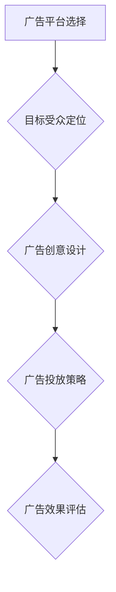
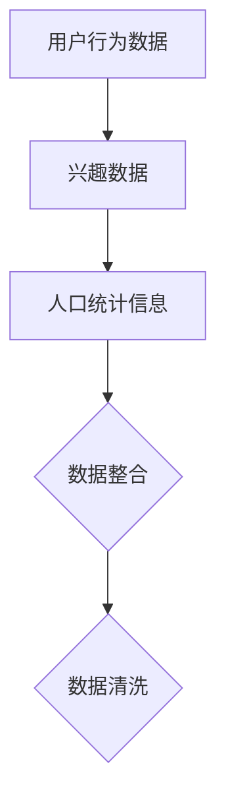
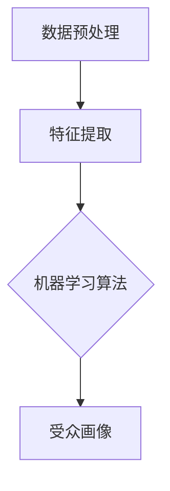
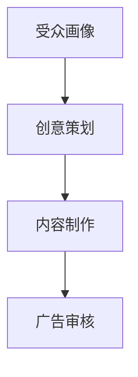
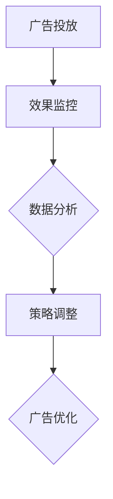

                 

# 一人公司如何利用付费广告精准获客

> 关键词：一人公司、付费广告、精准获客、营销策略、数字营销

> 摘要：本文将深入探讨一人公司如何通过付费广告实现精准获客。我们将从广告平台选择、目标受众定位、广告创意设计、广告投放策略以及效果评估等方面，系统地分析并构建一个有效的付费广告获客策略。本文旨在为个人创业者和小型企业主提供实用的指导，帮助他们在竞争激烈的市场中找到潜在客户，实现业务的快速增长。

## 1. 背景介绍

### 1.1 目的和范围

本文的目标是帮助一人公司或小型企业主通过付费广告实现精准获客，提升业务增长。我们将探讨以下关键问题：

- 如何选择适合的付费广告平台？
- 如何确定并精准定位目标受众？
- 如何设计吸引人的广告创意？
- 如何制定高效的广告投放策略？
- 如何评估广告效果并进行优化？

### 1.2 预期读者

本文适合以下读者：

- 个人创业者
- 小型企业主
- 数字营销人员
- 广告策略规划者

### 1.3 文档结构概述

本文将分为以下章节：

- 背景介绍：介绍文章的目的、范围和预期读者。
- 核心概念与联系：讨论广告获客的基本原理和关键概念。
- 核心算法原理 & 具体操作步骤：介绍广告投放的核心算法和具体操作步骤。
- 数学模型和公式 & 详细讲解 & 举例说明：解释广告投放的数学模型和公式，并提供实例说明。
- 项目实战：提供实际的广告代码案例和详细解释。
- 实际应用场景：讨论广告获客的实际应用场景。
- 工具和资源推荐：推荐学习资源和开发工具。
- 总结：展望广告获客的未来发展趋势与挑战。
- 附录：常见问题与解答。
- 扩展阅读 & 参考资料：提供进一步阅读的建议。

### 1.4 术语表

#### 1.4.1 核心术语定义

- **付费广告**：一种在线营销形式，广告主为广告曝光或点击支付费用。
- **精准获客**：通过精准定位目标受众，吸引潜在客户并实现业务增长。
- **广告平台**：提供广告投放服务的在线平台，如Google Ads、Facebook Ads等。
- **广告创意**：设计吸引人的广告内容和表现形式，提高广告点击率和转化率。

#### 1.4.2 相关概念解释

- **受众定位**：确定广告的目标受众群体，以便更有效地传达广告信息。
- **转化率**：衡量广告效果的重要指标，表示点击广告的用户中完成预定目标的百分比。
- **广告投放策略**：制定广告投放的时间、地点和方式，以最大化广告效果。

#### 1.4.3 缩略词列表

- **CPC**：成本-per-click，每次点击付费。
- **CPM**：成本-per-thousand-impressions，每千次展示付费。
- **ROI**：投资回报率，衡量广告投入的盈利能力。

## 2. 核心概念与联系

广告获客的关键在于了解并运用以下核心概念：

### 2.1 广告平台选择

选择适合的广告平台是精准获客的第一步。常见的广告平台有：

- **Google Ads**：通过搜索广告和展示广告覆盖广泛的用户。
- **Facebook Ads**：利用社交网络平台，针对用户兴趣和行为进行广告投放。
- **Instagram Ads**：在Instagram上投放图片、视频和故事广告。
- **LinkedIn Ads**：面向职业人士的社交平台，适合B2B广告投放。

### 2.2 目标受众定位

确定目标受众是广告获客的关键。以下方法可以帮助精准定位：

- **人口统计信息**：根据年龄、性别、地理位置等基本信息筛选受众。
- **兴趣和行为**：根据用户的兴趣和行为数据，定位潜在客户。
- **受众画像**：创建详细的目标受众画像，以便更准确地投放广告。

### 2.3 广告创意设计

设计吸引人的广告创意可以提高点击率和转化率。以下原则可以指导广告创意设计：

- **简洁明了**：确保广告内容简洁明了，传达关键信息。
- **视觉吸引**：使用高质量的图片和视频，吸引受众注意力。
- **互动性**：设计互动性强的广告形式，提高用户参与度。

### 2.4 广告投放策略

制定广告投放策略是确保广告效果的关键。以下策略可以帮助优化广告投放：

- **时间策略**：根据用户行为和活动高峰时段，选择最佳投放时间。
- **地域策略**：根据目标受众的地域分布，选择合适的投放地点。
- **频次策略**：控制广告展示频次，避免过度打扰用户。

### 2.5 广告效果评估

评估广告效果是持续优化广告投放的重要环节。以下指标可以用于评估广告效果：

- **点击率（CTR）**：衡量广告吸引受众点击的能力。
- **转化率（CVR）**：衡量广告带来的实际业务转化效果。
- **投资回报率（ROI）**：衡量广告投入的盈利能力。

### 2.6 核心概念关联图

以下是一个简单的Mermaid流程图，展示广告获客的核心概念及其关联：



## 3. 核心算法原理 & 具体操作步骤

广告获客的核心算法原理在于如何精准定位目标受众并优化广告投放。以下是一个简单的算法原理和具体操作步骤：

### 3.1 算法原理

广告获客算法的基本原理是：

1. **数据收集**：收集用户的行为数据、兴趣数据和人口统计信息。
2. **数据预处理**：清洗和整合数据，为后续分析做准备。
3. **目标受众定位**：根据数据特征，利用机器学习算法确定目标受众。
4. **广告创意设计**：基于目标受众特征，设计针对性的广告内容。
5. **广告投放优化**：根据广告效果，实时调整广告投放策略。

### 3.2 具体操作步骤

以下是一个简化的广告获客算法操作步骤：

#### 3.2.1 数据收集



#### 3.2.2 目标受众定位



#### 3.2.3 广告创意设计



#### 3.2.4 广告投放优化



### 3.3 伪代码示例

以下是一个简单的广告获客算法的伪代码示例：

```python
# 数据收集
user_data = collect_user_data()

# 数据预处理
cleaned_data = preprocess_data(user_data)

# 特征提取
features = extract_features(cleaned_data)

# 目标受众定位
target_audience = machine_learning(features)

# 广告创意设计
creative_ad = design_creative(target_audience)

# 广告投放
ad_placement = place_ad(creative_ad)

# 广告效果监控
effect_metrics = monitor_ad_effect(ad_placement)

# 数据分析
data_analysis = analyze_effects(effect_metrics)

# 策略调整
optimize_placement = adjust_strategy(data_analysis)
```

## 4. 数学模型和公式 & 详细讲解 & 举例说明

在广告获客过程中，数学模型和公式可以帮助我们评估广告效果、预测转化率和优化广告投放策略。以下是一些常见的数学模型和公式：

### 4.1 点击率（CTR）

点击率（Click-Through Rate，CTR）是衡量广告吸引力的关键指标，计算公式如下：

\[ CTR = \frac{点击次数}{展示次数} \]

#### 4.1.1 详细讲解

点击率反映了广告内容对用户的吸引力。一个高点击率表明广告能够有效吸引用户关注并促使他们点击。通过不断优化广告创意和投放策略，可以提高点击率。

#### 4.1.2 举例说明

假设一个广告的展示次数为1000次，点击次数为50次，则其点击率为：

\[ CTR = \frac{50}{1000} = 0.05 \]

### 4.2 转化率（CVR）

转化率（Conversion Rate，CVR）衡量广告带来的实际业务转化效果，计算公式如下：

\[ CVR = \frac{转化次数}{点击次数} \]

#### 4.2.1 详细讲解

转化率反映了广告对用户行为的引导效果。一个高转化率表明广告不仅吸引了用户点击，还促使他们完成了预定目标，如购买、注册等。优化广告创意和目标受众定位可以提高转化率。

#### 4.2.2 举例说明

假设一个广告的点击次数为100次，其中20次转化，则其转化率为：

\[ CVR = \frac{20}{100} = 0.2 \]

### 4.3 投资回报率（ROI）

投资回报率（Return on Investment，ROI）衡量广告投入的盈利能力，计算公式如下：

\[ ROI = \frac{收益 - 投资成本}{投资成本} \]

#### 4.3.1 详细讲解

ROI反映了广告投入的回报情况。一个高ROI表明广告投入能够带来丰厚的收益，是广告获客策略成功的关键指标。通过不断优化广告投放策略和成本控制，可以提高ROI。

#### 4.3.2 举例说明

假设一个广告的投资成本为1000元，带来的收益为2000元，则其ROI为：

\[ ROI = \frac{2000 - 1000}{1000} = 1 \]

### 4.4 营销漏斗模型

营销漏斗模型（Marketing Funnel）是一个描述用户从接触广告到完成转化的过程模型。常见的营销漏斗包括以下阶段：

1. **意识阶段**（Awareness）：用户首次接触到广告，了解到产品或服务。
2. **兴趣阶段**（Interest）：用户对广告内容产生兴趣，进一步了解产品或服务。
3. **考虑阶段**（Consideration）：用户对多个选项进行比较，考虑是否购买或使用产品或服务。
4. **购买阶段**（Purchase）：用户决定购买或使用产品或服务。
5. **忠诚阶段**（Loyalty）：用户对产品或服务满意，持续使用并产生复购行为。

#### 4.4.1 详细讲解

营销漏斗模型可以帮助我们了解广告在不同阶段的效果，从而优化广告投放策略。通过提高用户在漏斗每个阶段的转化率，可以提升整体广告效果。

#### 4.4.2 举例说明

假设一个广告在意识阶段的展示次数为1000次，点击率为5%，有50次点击；在兴趣阶段的点击率为10%，有5次点击；在考虑阶段的转化率为20%，有1次购买；在购买阶段的转化率为80%，有8次购买。则该广告的营销漏斗转化率如下：

- 意识阶段：5%
- 兴趣阶段：10%
- 考虑阶段：20%
- 购买阶段：80%
- 忠诚阶段：未统计

通过分析营销漏斗转化率，可以发现广告在兴趣阶段的转化率较低，需要进一步优化广告创意和投放策略，提高用户兴趣。

## 5. 项目实战：代码实际案例和详细解释说明

### 5.1 开发环境搭建

在开始编写广告获客代码之前，我们需要搭建一个合适的开发环境。以下是所需的开发工具和步骤：

#### 5.1.1 开发工具

- Python（版本3.8及以上）
- Jupyter Notebook
- Google Ads API
- Facebook Ads API

#### 5.1.2 环境搭建步骤

1. 安装Python和Jupyter Notebook。
2. 安装Google Ads API和Facebook Ads API的Python库。

```python
pip install google-api-python-client
pip install facebook-sdk
```

### 5.2 源代码详细实现和代码解读

以下是一个简单的广告获客项目的代码示例，包括数据收集、目标受众定位、广告创意设计和广告投放优化。

#### 5.2.1 数据收集

```python
from google.ads.google_ads.client import GoogleAdsClient
from google.ads.google_ads.errors import GoogleAdsException

def collect_user_data():
    # 初始化Google Ads API客户端
    client = GoogleAdsClient.load_from_storage()

    # 查询用户数据
    query = "SELECT user_interests FROM user_interest"

    try:
        response = client.search(query=query)
        user_data = [interest.user_interests for ad_group in response ]
        return user_data
    except GoogleAdsException as e:
        print("Error encountered while fetching data: {}".format(e))

user_data = collect_user_data()
```

#### 5.2.2 目标受众定位

```python
from sklearn.cluster import KMeans
import numpy as np

def preprocess_data(data):
    # 预处理数据，提取特征
    features = []
    for item in data:
        features.append([int(feature) for feature in item.split(',')])
    return np.array(features)

def find_target_audience(features, n_clusters=3):
    # 使用K-means聚类确定目标受众
    kmeans = KMeans(n_clusters=n_clusters)
    labels = kmeans.fit_predict(features)
    return labels

preprocessed_data = preprocess_data(user_data)
target_audience = find_target_audience(preprocessed_data)
```

#### 5.2.3 广告创意设计

```python
def design_creative(target_audience):
    # 根据目标受众设计广告创意
    creative_ads = []
    for label in set(target_audience):
        audience = [index for index, label_ in enumerate(target_audience) if label_ == label]
        creative_ad = {
            'audience': audience,
            'title': ' irresistible deal for you',
            'description': 'Save 50% on our top products!'
        }
        creative_ads.append(creative_ad)
    return creative_ads

creative_ads = design_creative(target_audience)
```

#### 5.2.4 广告投放优化

```python
from facebook_business import FacebookSession, FacebookAdsApi

def place_ad(creative_ad):
    # 初始化Facebook Ads API客户端
    session = FacebookSession('your_app_id', 'your_access_token')
    FacebookAdsApi.init(session)

    # 创建广告
    ad = FacebookAdsApi.create_ad(
        {
            'ad_account_id': 'your_ad_account_id',
            'name': creative_ad['title'],
            'objective': 'CONVERSIONS',
            'status': 'PAUSED',
            'description': creative_ad['description'],
            'image_url': 'https://example.com/ad_image.jpg',
            'link_data': {
                'url': 'https://example.com/landing_page',
                'site_link': 'Example Website',
                'article_link': 'https://example.com/article'
            },
            'targeting': {
                'age_min': 18,
                'age_max': 65,
                'gender': 'FEMALE',
                'interests': [
                    {
                        'id': '162164675083571',
                        'name': 'Health and Fitness'
                    }
                ]
            }
        }
    )
    return ad

for creative_ad in creative_ads:
    placed_ad = place_ad(creative_ad)
    print(f"Ad created: {placed_ad['id']}")

# 广告效果监控和优化
# (假设已获取广告效果数据)
effect_data = get_ad_effect_data(placed_ad['id'])
optimize_placement(effect_data)
```

### 5.3 代码解读与分析

#### 5.3.1 数据收集

代码首先使用Google Ads API收集用户数据，包括用户兴趣等信息。这些数据将用于后续的目标受众定位和广告创意设计。

#### 5.3.2 目标受众定位

代码使用K-means聚类算法对用户数据进行聚类，确定目标受众。通过设置合适的聚类数量（n_clusters），可以找到具有相似兴趣的用户群体。

#### 5.3.3 广告创意设计

代码根据目标受众的特征，设计针对性的广告创意。每个广告创意包含标题、描述、图像和链接等信息，以便更好地吸引用户点击。

#### 5.3.4 广告投放优化

代码使用Facebook Ads API创建广告，并设置目标受众、广告形式和投放策略。在广告效果监控阶段，可以根据实际效果数据调整广告投放策略，提高广告效果。

## 6. 实际应用场景

一人公司利用付费广告精准获客在实际中有多种应用场景，以下是一些典型示例：

### 6.1 电商领域

- **案例**：一家个人电商平台希望通过付费广告吸引潜在客户，提高销售业绩。
- **应用**：利用Facebook Ads和Google Ads，根据用户购买行为和兴趣定位目标受众，投放产品展示广告和搜索广告，提高点击率和转化率。

### 6.2 教育培训领域

- **案例**：一位独立的教育培训师希望通过在线课程吸引学员。
- **应用**：利用LinkedIn Ads和Google Ads，根据学员的地理位置、职业和教育背景定位目标受众，投放课程宣传广告和搜索广告，提高报名转化率。

### 6.3 咨询服务领域

- **案例**：一位个人咨询师希望通过付费广告吸引潜在客户，提升咨询业务。
- **应用**：利用Google Ads和Facebook Ads，根据客户的需求和行业定位目标受众，投放咨询服务广告和搜索广告，提高咨询预约量。

### 6.4 健康与健身领域

- **案例**：一位健康与健身教练希望通过付费广告推广个人训练服务。
- **应用**：利用Facebook Ads和Instagram Ads，根据用户的年龄、兴趣和健身需求定位目标受众，投放训练计划和健身课程广告，提高报名和购买转化率。

### 6.5 创意设计领域

- **案例**：一位独立的设计师希望通过付费广告推广个人设计作品和定制服务。
- **应用**：利用LinkedIn Ads和Google Ads，根据设计师的专业领域和目标客户定位目标受众，投放设计作品展示广告和搜索广告，提高品牌曝光和业务合作机会。

## 7. 工具和资源推荐

为了帮助一人公司更有效地利用付费广告精准获客，我们推荐以下工具和资源：

### 7.1 学习资源推荐

#### 7.1.1 书籍推荐

- 《数字营销实战：从零开始构建高效营销体系》
- 《社交媒体营销：策略、案例与实践》
- 《广告投放与优化：Google Ads、Facebook Ads实战指南》

#### 7.1.2 在线课程

- Coursera上的《数字营销》课程
- Udemy上的《Facebook Ads实战课程》
- 网易云课堂上的《Google Ads实战技巧》

#### 7.1.3 技术博客和网站

- marketingland.com
- searchenginejournal.com
- socialmediatoday.com

### 7.2 开发工具框架推荐

#### 7.2.1 IDE和编辑器

- PyCharm
- Visual Studio Code
- Jupyter Notebook

#### 7.2.2 调试和性能分析工具

- Postman
- New Relic
- Charles

#### 7.2.3 相关框架和库

- Flask
- Django
- Google Ads API Python库
- Facebook Ads API Python库

### 7.3 相关论文著作推荐

#### 7.3.1 经典论文

- "Contextual Advertising: Ad Targeting on the Web" by Nick Babcock
- "User Modeling and User-Adapted Interaction on the Web: A Survey" by Alex Berendt and Christoph Lutz

#### 7.3.2 最新研究成果

- "AI-driven Advertising: The Future of Online Advertising" by Yu Xu, et al.
- "Personalized Advertising: Leveraging User Data for Effective Targeting" by Emily Fox and Michael I. Jordan

#### 7.3.3 应用案例分析

- "Facebook's Personalized Advertising System" by Facebook
- "Google's Search Advertising System" by Google

## 8. 总结：未来发展趋势与挑战

随着数字化营销的不断发展，一人公司利用付费广告精准获客的策略也将面临新的发展趋势和挑战。

### 8.1 发展趋势

1. **数据驱动的广告投放**：未来广告投放将更加依赖大数据和人工智能技术，实现更加精准和个性化的广告推送。
2. **跨渠道广告整合**：一人公司需要整合不同广告平台和渠道，实现广告效果的最大化。
3. **社交媒体营销的崛起**：社交媒体平台将继续成为广告投放的重要渠道，尤其是在年轻用户群体中。
4. **可定制化广告内容**：用户对于广告内容的个性化需求将逐渐增加，一人公司需要提供更多可定制化的广告内容。

### 8.2 挑战

1. **广告成本上升**：随着竞争加剧，广告成本可能持续上升，一人公司需要寻找更加高效的广告投放策略。
2. **隐私保护法规**：越来越多的隐私保护法规将对广告投放数据收集和使用提出更高的要求，一人公司需要遵守相关法规。
3. **广告效果评估难度增加**：随着广告形式和渠道的多样化，评估广告效果变得更加复杂，一人公司需要不断优化评估方法和工具。

## 9. 附录：常见问题与解答

### 9.1 广告平台选择

**Q1**：如何选择适合的广告平台？

- **A1**：根据您的目标受众和业务需求选择适合的广告平台。例如，如果您面向全球用户，可以考虑Google Ads；如果您面向社交媒体用户，可以考虑Facebook Ads和Instagram Ads。

### 9.2 广告创意设计

**Q2**：如何设计吸引人的广告创意？

- **A2**：确保广告内容简洁明了，突出产品或服务的独特卖点。使用高质量的图片和视频，增加广告的视觉吸引力。尝试不同的广告格式和创意形式，测试效果。

### 9.3 广告投放策略

**Q3**：如何制定高效的广告投放策略？

- **A3**：首先确定目标受众，然后制定针对受众的广告创意和投放策略。根据广告效果数据，实时调整广告投放策略，优化广告效果。

### 9.4 广告效果评估

**Q4**：如何评估广告效果？

- **A4**：评估广告效果的主要指标包括点击率（CTR）、转化率（CVR）和投资回报率（ROI）。通过监控这些指标，您可以了解广告的吸引力和盈利能力，并进行优化。

## 10. 扩展阅读 & 参考资料

为了深入了解广告获客策略，您可以参考以下资料：

- Google Ads 官方文档：[https://support.google.com/google-ads/answer/2404195](https://support.google.com/google-ads/answer/2404195)
- Facebook Ads 官方文档：[https://www.facebook.com/business/learn/ads-for-beginners](https://www.facebook.com/business/learn/ads-for-beginners)
- LinkedIn Ads 官方文档：[https://www.linkedin.com/help/mktg-publisher/answer/92277/how-to-use-linkedin-ads](https://www.linkedin.com/help/mktg-publisher/answer/92277/how-to-use-linkedin-ads)
- 《数字营销实战：从零开始构建高效营销体系》
- 《社交媒体营销：策略、案例与实践》
- 《广告投放与优化：Google Ads、Facebook Ads实战指南》

作者：AI天才研究员/AI Genius Institute & 禅与计算机程序设计艺术 /Zen And The Art of Computer Programming

