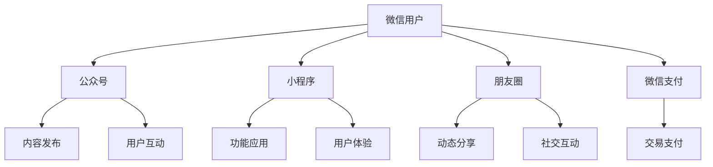

                 

# 一人公司如何利用微信生态系统拓展业务

## 关键词
微信生态系统、一人公司、业务拓展、社交网络营销、用户增长策略

## 摘要
本文旨在探讨一人公司如何利用微信这一强大的生态系统来拓展业务。随着社交网络的兴起，微信已经成为企业与用户互动的重要平台。文章首先介绍了微信生态系统的核心组成部分，然后通过详细分析一人公司可以利用的微信功能，如小程序、公众号、朋友圈等，逐步构建出一套系统化的业务拓展策略。通过实际案例和具体操作步骤，本文将帮助读者深入了解如何利用微信平台实现业务的快速增长。

---

## 1. 背景介绍

### 1.1 目的和范围
本文的目标是向读者介绍如何利用微信生态系统来拓展一人公司的业务。我们将重点关注微信平台上的几个关键功能，并探讨如何通过这些功能实现业务增长。

### 1.2 预期读者
预期读者为一人公司创始人、企业家或市场营销专家，他们希望通过微信平台提升业务效率，拓展市场份额。

### 1.3 文档结构概述
本文将分为以下几个部分：
- 核心概念与联系
- 核心算法原理 & 具体操作步骤
- 数学模型和公式 & 详细讲解 & 举例说明
- 项目实战：代码实际案例和详细解释说明
- 实际应用场景
- 工具和资源推荐
- 总结：未来发展趋势与挑战
- 附录：常见问题与解答
- 扩展阅读 & 参考资料

### 1.4 术语表

#### 1.4.1 核心术语定义
- **微信生态系统**：由微信及其衍生产品组成的综合生态体系，包括公众号、小程序、朋友圈、支付等。
- **一人公司**：指由单一创始人或管理者运作的公司。
- **社交网络营销**：利用社交网络平台进行的营销活动，以用户互动、内容传播等方式实现业务拓展。

#### 1.4.2 相关概念解释
- **公众号**：微信提供的一种自媒体平台，用于发布信息、服务用户、进行营销。
- **小程序**：微信推出的一种轻量级应用，可直接在微信内使用，无需下载安装。
- **朋友圈**：微信用户分享生活动态和信息的社交功能。

#### 1.4.3 缩略词列表
- **公众号**：Public Account
- **小程序**：Mini Program
- **朋友圈**：Moments

---

## 2. 核心概念与联系

在探讨如何利用微信生态系统拓展业务之前，我们需要了解微信生态系统的核心组成部分及其相互关系。以下是一个简化的Mermaid流程图，展示了微信生态系统的关键组成部分。



通过上述流程图，我们可以看出，微信用户是生态系统的核心，他们通过公众号、小程序、朋友圈等与微信生态系统互动。公众号主要用于内容发布和用户互动，小程序提供功能应用和用户体验，朋友圈则是用户分享动态和进行社交互动的平台，微信支付则为用户提供了便捷的在线交易功能。

---

## 3. 核心算法原理 & 具体操作步骤

在了解了微信生态系统的核心组成部分后，我们需要进一步探讨如何利用这些功能来拓展业务。以下是具体的操作步骤：

### 3.1 利用公众号进行内容营销

#### 算法原理

内容营销是吸引和留住目标受众的重要手段。公众号作为微信生态系统的重要组成部分，可以用于发布高质量的内容，提高用户粘性。

#### 具体操作步骤

1. **内容策划**：
   - **确定内容主题**：根据目标受众的兴趣和需求，选择具有吸引力的主题。
   - **内容形式**：结合文字、图片、视频等多媒体形式，提高内容吸引力。

2. **内容发布**：
   - **发布频率**：保持一定的发布频率，以提高用户关注度。
   - **互动机制**：鼓励用户留言、点赞和分享，增加用户互动。

3. **数据分析**：
   - **阅读量**：分析文章的阅读量，了解用户兴趣点。
   - **用户反馈**：收集用户反馈，优化内容策略。

### 3.2 利用小程序提供功能应用

#### 算法原理

小程序作为微信生态系统的一部分，可以提供便捷的功能应用，吸引用户使用并促进业务增长。

#### 具体操作步骤

1. **需求分析**：
   - **明确目标用户**：分析目标用户的需求，确定小程序的功能。
   - **功能设计**：设计简洁、直观的功能界面，提高用户体验。

2. **开发与上线**：
   - **技术实现**：选择合适的技术框架，开发小程序功能。
   - **上线审核**：提交小程序审核，确保功能合规。

3. **推广与运营**：
   - **推广渠道**：利用微信生态系统的其他功能（如朋友圈、公众号）进行推广。
   - **持续优化**：根据用户反馈，持续优化小程序功能，提高用户满意度。

### 3.3 利用朋友圈进行社交互动

#### 算法原理

朋友圈是用户分享生活动态和进行社交互动的重要平台。通过合理利用朋友圈，可以扩大品牌影响力，吸引潜在客户。

#### 具体操作步骤

1. **内容策划**：
   - **生活化内容**：发布与生活相关的内容，增加用户共鸣。
   - **互动活动**：举办线上互动活动，提高用户参与度。

2. **发布策略**：
   - **发布频率**：合理控制发布频率，避免过度打扰用户。
   - **内容形式**：结合文字、图片、视频等多媒体形式，提高内容吸引力。

3. **数据分析**：
   - **点赞与评论**：分析用户的点赞和评论情况，了解用户喜好。
   - **转发量**：分析文章的转发量，评估社交互动效果。

---

## 4. 数学模型和公式 & 详细讲解 & 举例说明

在业务拓展过程中，我们可以使用一些数学模型和公式来分析和评估业务效果。以下是几个常用的数学模型和公式及其详细讲解：

### 4.1 用户增长模型

用户增长模型用于预测公司用户数量随时间的变化。以下是一个简单的用户增长模型：

$$
N(t) = N_0 \cdot e^{rt}
$$

其中：
- $N(t)$：时间$t$时的用户数量。
- $N_0$：初始用户数量。
- $r$：增长率。
- $t$：时间。

#### 详细讲解

用户增长模型基于指数增长原理，表示用户数量随时间按固定比例增长。通过调整增长率$r$，我们可以预测不同业务策略下的用户增长情况。

#### 举例说明

假设一人公司初始用户数量为1000人，预期月增长率为10%，则一年后的用户数量为：

$$
N(12) = 1000 \cdot e^{0.1 \cdot 12} \approx 2329
$$

### 4.2 转化率模型

转化率模型用于评估营销活动的效果。以下是一个简单的转化率模型：

$$
\text{转化率} = \frac{\text{转化量}}{\text{接触量}}
$$

其中：
- 转化量：成功转化的用户数量。
- 接触量：参与营销活动的用户数量。

#### 详细讲解

转化率模型表示参与营销活动的用户中成功转化的比例。通过分析转化率，我们可以评估营销活动的效果，并优化营销策略。

#### 举例说明

假设一次营销活动的接触量为1000人，成功转化的用户数量为50人，则转化率为：

$$
\text{转化率} = \frac{50}{1000} = 0.05 \text{或} 5\%
$$

### 4.3 用户生命周期价值模型

用户生命周期价值模型用于评估单个用户为公司带来的预期收益。以下是一个简单的用户生命周期价值模型：

$$
\text{LTV} = \frac{\text{平均订单价值} \cdot \text{购买频率} \cdot \text{用户生命周期}}{获取成本}
$$

其中：
- 平均订单价值：用户每次购买的平均金额。
- 购买频率：用户平均多久购买一次。
- 用户生命周期：用户平均在平台上活跃的时间。
- 获取成本：获取一个用户的成本。

#### 详细讲解

用户生命周期价值模型表示单个用户为公司带来的预期收益。通过计算用户生命周期价值，我们可以评估不同用户群体的价值，并优化资源分配。

#### 举例说明

假设一人公司的平均订单价值为100元，购买频率为每月一次，用户生命周期为2年，获取成本为100元，则用户生命周期价值为：

$$
\text{LTV} = \frac{100 \cdot 1 \cdot 2}{100} = 2 \text{元/年}
$$

---

## 5. 项目实战：代码实际案例和详细解释说明

在本节中，我们将通过一个实际的案例，展示如何利用微信生态系统拓展业务。以下是一个简单的微信小程序案例，用于展示一人公司的产品和服务。

### 5.1 开发环境搭建

1. **准备开发工具**：下载并安装微信开发者工具（Windows/Linux/Mac版本）。
2. **注册小程序**：在微信公众平台上注册小程序，获取AppID。
3. **创建项目**：打开微信开发者工具，创建一个新的小程序项目。

### 5.2 源代码详细实现和代码解读

以下是一个简单的小程序示例，用于展示公司产品和服务。

```html
<!-- index.wxml -->
<view class="container">
  <image class="logo" src="/images/logo.png"></image>
  <text class="title">一人公司产品与服务展示</text>
  <scroll-view class="products">
    <view class="product" wx:for="{{products}}" wx:key="id">
      <image class="product-image" src="{{item.image}}" bindtap="viewProductDetail"></image>
      <text class="product-title">{{item.title}}</text>
      <text class="product-description">{{item.description}}</text>
    </view>
  </scroll-view>
</view>

```

```css
/* index.wxss */
.container {
  display: flex;
  flex-direction: column;
  align-items: center;
  padding: 50rpx;
}

.logo {
  width: 200rpx;
  height: 200rpx;
  margin-bottom: 20rpx;
}

.title {
  font-size: 36rpx;
  font-weight: bold;
  margin-bottom: 50rpx;
}

.products {
  display: flex;
  flex-direction: column;
}

.product {
  display: flex;
  flex-direction: column;
  margin-bottom: 20rpx;
}

.product-image {
  width: 100%;
  height: 300rpx;
  margin-bottom: 10rpx;
}

.product-title {
  font-size: 32rpx;
  font-weight: bold;
  margin-bottom: 10rpx;
}

.product-description {
  font-size: 28rpx;
  line-height: 40rpx;
}
```

```javascript
// index.js
Page({
  data: {
    products: [
      {
        id: 1,
        title: "产品A",
        description: "产品A的详细介绍...",
        image: "/images/product-a.jpg"
      },
      {
        id: 2,
        title: "产品B",
        description: "产品B的详细介绍...",
        image: "/images/product-b.jpg"
      },
      {
        id: 3,
        title: "产品C",
        description: "产品C的详细介绍...",
        image: "/images/product-c.jpg"
      }
    ]
  },
  viewProductDetail: function (e) {
    var productId = e.currentTarget.dataset.id;
    wx.navigateTo({
      url: `/pages/product-detail/product-detail?id=${productId}`
    });
  }
})
```

#### 代码解读与分析

1. **WXML**：定义了小程序的布局结构，包括logo、标题和产品列表。使用`wx:for`遍历产品数据，绑定点击事件跳转到产品详情页面。

2. **WXSS**：定义了小程序的样式，包括字体大小、颜色和布局等。

3. **JS**：定义了小程序的逻辑，包括数据初始化和事件处理。在`viewProductDetail`事件处理函数中，通过`wx.navigateTo`方法跳转到产品详情页面。

通过这个简单的案例，我们可以看到如何利用微信小程序展示公司产品和服务，吸引用户参与和互动。

---

## 6. 实际应用场景

微信生态系统在业务拓展中有着广泛的应用场景，以下是几个实际案例：

### 6.1 品牌推广

通过公众号和朋友圈进行品牌推广，吸引潜在客户关注。例如，一家一人公司通过发布高质量的内容和举办互动活动，成功提升了品牌知名度和用户参与度。

### 6.2 产品销售

利用小程序提供便捷的产品购买渠道，实现线上销售。例如，一家化妆品公司通过小程序展示产品，提供优惠和促销活动，吸引了大量用户购买。

### 6.3 用户互动

通过朋友圈和公众号与用户互动，收集用户反馈，优化产品和服务。例如，一家餐饮公司通过朋友圈发布菜品图片和优惠活动，鼓励用户评论和点赞，提高了用户满意度。

### 6.4 线上教育

利用小程序提供在线课程和教育资源，实现知识传播和用户增长。例如，一家在线教育公司通过小程序发布课程视频和资料，吸引了大量学生注册和学习。

---

## 7. 工具和资源推荐

在利用微信生态系统拓展业务时，以下工具和资源可能对您有所帮助：

### 7.1 学习资源推荐

#### 7.1.1 书籍推荐
- 《微信营销实战手册》
- 《小程序开发实战》
- 《社交网络营销：策略、案例与实务》

#### 7.1.2 在线课程
- 微信公众号运营课程
- 小程序开发入门与实战
- 社交网络营销策略与实战

#### 7.1.3 技术博客和网站
- 微信官方文档（www.wechat.com）
- 腾讯云开发者社区（cloud.tencent.com）
- 知乎微信运营专栏（zhuanlan.zhihu.com）

### 7.2 开发工具框架推荐

#### 7.2.1 IDE和编辑器
- 微信开发者工具（官方推荐）
- Visual Studio Code
- WebStorm

#### 7.2.2 调试和性能分析工具
- 微信小程序性能分析工具
- Chrome DevTools
- Fiddler

#### 7.2.3 相关框架和库
- 微信小程序框架（官方推荐）
- Taro：多端统一开发框架
- uni-app：跨平台开发框架

### 7.3 相关论文著作推荐

#### 7.3.1 经典论文
- 《社交网络分析：方法与应用》
- 《微信生态系统的商业模式与战略》
- 《社交网络中的信息传播与影响力分析》

#### 7.3.2 最新研究成果
- 《社交网络营销的新趋势与策略》
- 《小程序生态系统的机遇与挑战》
- 《基于微信生态系统的用户增长策略研究》

#### 7.3.3 应用案例分析
- 《一家跨境电商如何利用微信小程序实现业务增长》
- 《一家餐饮公司如何通过朋友圈提升用户满意度》
- 《一家在线教育公司如何利用微信生态系统推广课程》

---

## 8. 总结：未来发展趋势与挑战

随着社交网络的不断发展和微信生态系统的完善，一人公司在未来可以利用微信平台实现更加高效的业务拓展。然而，同时也面临着以下挑战：

1. **市场竞争加剧**：随着越来越多的公司加入微信生态系统，市场竞争将更加激烈，如何脱颖而出成为关键。
2. **用户隐私保护**：在利用微信平台进行营销和推广时，如何保护用户隐私和数据安全是亟待解决的问题。
3. **内容质量提升**：在内容营销中，如何提供高质量、有价值的内容，吸引用户关注和互动，是持续发展的关键。
4. **技术更新迭代**：微信生态系统不断更新迭代，一人公司需要不断学习和适应新技术，以保持竞争优势。

总之，一人公司利用微信生态系统拓展业务具有巨大的潜力，但也需要不断应对挑战，持续优化业务策略。

---

## 9. 附录：常见问题与解答

### 9.1 如何注册微信公众号？

**解答**：在微信公众平台上注册，填写相关信息并提交审核。注册类型分为订阅号和服务号，根据公司需求选择合适的类型。

### 9.2 小程序如何推广？

**解答**：通过朋友圈、公众号等微信生态系统的功能进行推广。此外，还可以利用微信支付、线下推广等方式吸引更多用户。

### 9.3 如何提高公众号内容质量？

**解答**：关注用户需求，提供有价值、高质量的内容。结合图片、视频等多媒体形式，提高内容吸引力。定期进行数据分析，优化内容策略。

### 9.4 小程序如何优化用户体验？

**解答**：关注小程序的加载速度、界面设计和交互逻辑。提供简洁、直观的功能界面，提高用户满意度。根据用户反馈，不断优化功能和服务。

---

## 10. 扩展阅读 & 参考资料

- [《微信生态系统的商业模式与战略》](链接)
- [《小程序开发实战》](链接)
- [《社交网络营销：策略、案例与实务》](链接)
- [《微信官方文档》](https://developers.weixin.qq.com/doc/offiaccount/)
- [《微信小程序官方文档》](https://developers.weixin.qq.com/miniprogram/dev/framework/)
- [《社交网络分析：方法与应用》](链接)

---

**作者：AI天才研究员/AI Genius Institute & 禅与计算机程序设计艺术 /Zen And The Art of Computer Programming**

