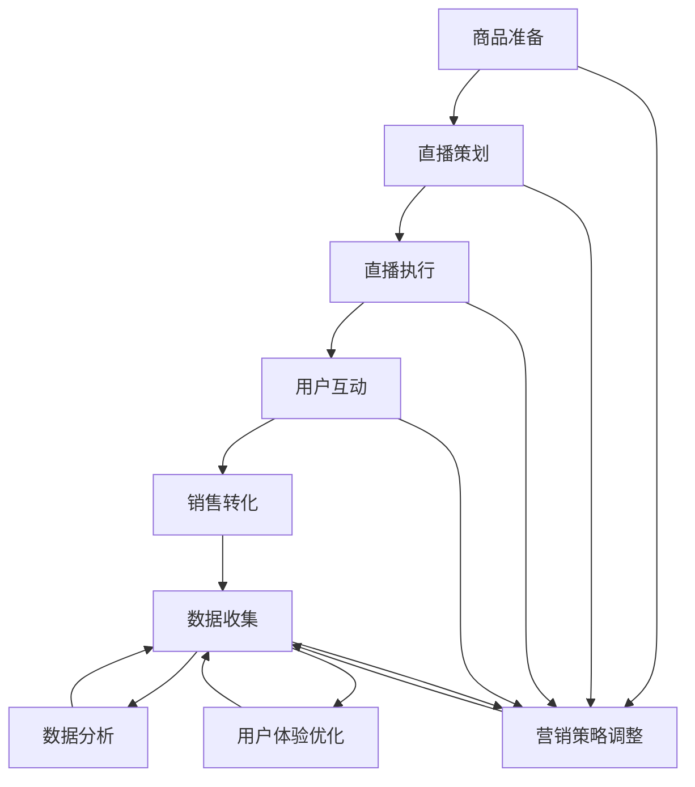

                 

# 一人公司如何利用直播电商提升销售业绩

> 关键词：直播电商、销售业绩、营销策略、数据分析、用户体验

> 摘要：本文将探讨一人公司在直播电商领域如何通过创新营销策略、数据分析优化、用户体验提升等手段，实现销售业绩的显著提升。文章结构分为背景介绍、核心概念与联系、核心算法原理与操作步骤、数学模型与公式、项目实战、实际应用场景、工具和资源推荐以及总结与展望等部分。

## 1. 背景介绍

### 1.1 目的和范围

随着互联网技术的飞速发展，直播电商已成为一种新兴的商业模式。一人公司（solopreneur）作为互联网创业的常见形式，如何在竞争激烈的直播电商市场中脱颖而出，成为每个创业者关注的焦点。本文旨在分析一人公司如何通过直播电商手段提升销售业绩，为创业者提供可行的策略和思路。

本文将覆盖以下内容：

1. 直播电商的基本概念与市场趋势。
2. 一人公司在直播电商中的挑战与机遇。
3. 创新营销策略的构建与应用。
4. 数据分析在直播电商中的应用。
5. 提升用户体验的具体措施。
6. 工具和资源的推荐。
7. 未来发展趋势与挑战。

### 1.2 预期读者

本文适合以下读者群体：

1. 一人公司创始人或运营者。
2. 对直播电商和营销策略感兴趣的互联网从业者。
3. 从事数据分析与用户体验相关工作的专业人员。
4. 有志于进军直播电商领域的企业家。

### 1.3 文档结构概述

本文将按照以下结构进行阐述：

1. 背景介绍：介绍直播电商的背景、目的和范围。
2. 核心概念与联系：分析直播电商的核心概念与联系。
3. 核心算法原理与操作步骤：详细讲解核心算法原理。
4. 数学模型与公式：解释数学模型与公式。
5. 项目实战：分享实际案例和代码实现。
6. 实际应用场景：探讨直播电商的各类应用场景。
7. 工具和资源推荐：推荐相关工具和资源。
8. 总结与展望：总结直播电商的发展趋势与挑战。

### 1.4 术语表

#### 1.4.1 核心术语定义

- 直播电商：通过直播平台进行商品销售和营销的商业模式。
- solopreneur：一人公司或独立创业者的简称。
- 营销策略：为了实现特定营销目标而采取的方法和手段。
- 用户数据：用户在直播平台上的行为数据，如观看次数、购买记录等。

#### 1.4.2 相关概念解释

- 直播流量：直播过程中的观众人数和互动量。
- 社交货币：用户在直播平台上的点赞、评论、分享等互动行为。
- 转化率：实际购买用户占观看直播用户的比例。

#### 1.4.3 缩略词列表

- 直播电商：Live Streaming E-commerce
- 一人公司：Solopreneur
- 用户数据：User Data

## 2. 核心概念与联系

为了更好地理解直播电商在提升销售业绩中的作用，我们需要明确几个核心概念：

- **直播电商**：结合直播和电商两大领域，通过实时视频互动形式进行商品销售和营销。
- **流量**：指访问直播平台的用户数量，流量大小直接影响销售业绩。
- **转化率**：即用户从观看直播到购买商品的转化比例，是评估直播电商效果的关键指标。
- **用户互动**：包括用户在直播过程中的点赞、评论、分享等行为，互动性越强，用户粘性越高。

以下是一个简化的Mermaid流程图，展示了直播电商的核心概念及其联系：

```mermaid
graph TD
    A[用户] --> B[流量]
    B --> C[转化率]
    C --> D[用户互动]
    D --> E[销售业绩]
    F[营销策略] --> A
    G[数据分析] --> B, C, D, E
    H[用户体验] --> D, E
    I[工具和资源] --> F, G, H
    A --> F
    A --> G
    A --> H
    B --> C
    C --> E
    D --> E
    F --> I
    G --> I
    H --> I
```

通过该流程图，我们可以清晰地看到，直播电商的提升销售业绩不仅仅依赖于营销策略和工具资源的支持，更依赖于对用户数据的深入分析和对用户体验的不断优化。

### 2.1 直播电商的工作流程

直播电商的工作流程可以概括为以下几个步骤：

1. **商品准备**：一人公司提前准备好待销售的商品，并明确商品的卖点。
2. **直播策划**：制定直播主题、时间、内容，以及主播的表现形式。
3. **直播执行**：主播进行直播，介绍商品、回答观众提问，引导购买。
4. **用户互动**：观众通过弹幕、点赞、评论等方式与主播互动。
5. **销售转化**：观众根据主播的推荐进行购买，形成销售转化。
6. **数据收集**：收集用户的观看数据、互动数据和购买数据，用于后续分析和优化。

以下是一个简化的Mermaid流程图，展示了直播电商的工作流程：



通过该流程图，我们可以清晰地看到，直播电商的各个环节相互关联，形成一个闭环。每个环节的数据都可以为后续的决策提供依据，从而不断优化整个直播电商过程。

## 3. 核心算法原理 & 具体操作步骤

在直播电商中，算法的运用至关重要。以下将详细讲解直播电商中的核心算法原理和具体操作步骤，包括用户行为预测、推荐算法和优化策略等。

### 3.1 用户行为预测

用户行为预测是直播电商中的一项关键技术，通过分析用户的历史行为数据，预测用户在直播中的购买概率和偏好。以下是用户行为预测的伪代码：

```plaintext
输入：用户历史行为数据
输出：用户购买概率和偏好

函数 用户行为预测(历史行为数据):
    1. 数据预处理：清洗用户历史行为数据，去除异常值和缺失值。
    2. 特征工程：提取用户行为数据中的有效特征，如观看时长、购买频率、互动行为等。
    3. 数据建模：使用机器学习算法，如决策树、随机森林、神经网络等，建立用户行为预测模型。
    4. 模型训练与验证：将数据集分为训练集和测试集，使用训练集训练模型，并在测试集上验证模型效果。
    5. 模型应用：对实时用户行为进行预测，输出用户购买概率和偏好。

返回 模型预测结果
```

### 3.2 推荐算法

推荐算法是直播电商中提升用户满意度和销售转化率的重要手段。以下是推荐算法的具体操作步骤：

```plaintext
输入：用户历史行为数据、商品信息
输出：推荐商品列表

函数 推荐算法(用户历史行为数据，商品信息):
    1. 数据预处理：清洗用户历史行为数据和商品信息，提取有效特征。
    2. 构建用户-商品交互矩阵：将用户行为数据转换为用户-商品交互矩阵。
    3. 矩阵分解：使用矩阵分解算法，如ALS（交替最小二乘法）、SVD（奇异值分解）等，分解用户-商品交互矩阵。
    4. 推荐计算：根据分解后的矩阵，计算用户对商品的潜在偏好分数。
    5. 排序与筛选：对潜在偏好分数进行排序，筛选出Top-N个推荐商品。

返回 推荐商品列表
```

### 3.3 优化策略

优化策略是直播电商中持续提升销售业绩的关键。以下是优化策略的具体操作步骤：

```plaintext
输入：直播数据、用户反馈
输出：优化建议

函数 优化策略(直播数据，用户反馈):
    1. 数据分析：对直播数据进行分析，提取关键指标，如观看时长、互动量、转化率等。
    2. 趋势分析：分析用户反馈，识别用户对直播内容和互动方式的需求。
    3. 对比分析：对比不同直播间的数据，找出优劣势，为后续直播提供参考。
    4. 策略调整：根据数据分析结果和用户反馈，调整直播策略，如优化商品推荐、改进互动方式等。
    5. 实施与监测：实施调整策略，并持续监测直播效果，根据效果反馈进行进一步优化。

返回 优化建议
```

通过以上核心算法原理和具体操作步骤的讲解，我们可以看到，直播电商中的算法不仅能够提升用户体验，还能够为一人公司提供有效的数据支持和决策依据，从而实现销售业绩的持续提升。

### 4. 数学模型和公式 & 详细讲解 & 举例说明

在直播电商中，数学模型和公式的作用不容忽视。它们帮助我们量化分析用户行为、优化营销策略，并最终提升销售业绩。以下将详细介绍几个常用的数学模型和公式，并通过具体例子进行说明。

#### 4.1. 用户行为预测模型

用户行为预测模型主要用于预测用户在直播中的购买概率和偏好。常见的方法包括逻辑回归、决策树和随机森林等。以下是一个基于逻辑回归的用户行为预测模型：

$$
P(y=1|X) = \frac{1}{1 + e^{-(\beta_0 + \beta_1 x_1 + \beta_2 x_2 + ... + \beta_n x_n})}
$$

其中，$P(y=1|X)$ 表示用户在给定特征 $X$ 下的购买概率，$\beta_0, \beta_1, \beta_2, ..., \beta_n$ 为模型参数。

**举例说明**：

假设我们有一个用户行为数据集，其中包含用户的观看时长（$x_1$）、购买历史（$x_2$）和互动行为（$x_3$）等特征。我们使用逻辑回归模型预测用户的购买概率。假设模型的参数为 $\beta_0 = 0.5, \beta_1 = 0.2, \beta_2 = 0.1, \beta_3 = 0.1$。对于一个新的用户，其特征值为 $x_1 = 30$（观看时长30分钟），$x_2 = 1$（购买过一次），$x_3 = 5$（互动了5次），则其购买概率为：

$$
P(y=1|X) = \frac{1}{1 + e^{-(0.5 + 0.2 \times 30 + 0.1 \times 1 + 0.1 \times 5)}} = \frac{1}{1 + e^{-12.5}} \approx 0.999
$$

这意味着该用户在给定特征下非常有可能购买商品。

#### 4.2. 推荐算法模型

推荐算法模型主要用于为用户推荐可能感兴趣的商品。常见的推荐算法包括基于内容的推荐、协同过滤和基于模型的推荐等。以下是一个基于协同过滤的推荐算法模型：

$$
R_{ij} = \frac{\sum_{k \in N(j)} r_{ik} \cdot s_{ik}}{\sum_{k \in N(j)} s_{ik}^2}
$$

其中，$R_{ij}$ 表示用户 $i$ 对商品 $j$ 的评分预测，$N(j)$ 表示与商品 $j$ 相关的用户集合，$r_{ik}$ 表示用户 $i$ 对商品 $k$ 的实际评分，$s_{ik}$ 表示用户 $i$ 和用户 $k$ 之间的相似度。

**举例说明**：

假设我们有两个用户 $i$ 和 $j$，以及五个商品 $1, 2, 3, 4, 5$。用户 $i$ 对商品 $1, 2, 3$ 有评分，分别为 $r_{i1} = 4, r_{i2} = 5, r_{i3} = 3$。用户 $j$ 对商品 $2, 3, 4, 5$ 有评分，分别为 $r_{j2} = 4, r_{j3} = 5, r_{j4} = 3, r_{j5} = 1$。我们使用基于用户的协同过滤算法预测用户 $i$ 对商品 $4$ 的评分。

首先计算用户 $i$ 和用户 $j$ 之间的相似度：

$$
s_{ij} = \frac{r_{i1} \cdot r_{j2} + r_{i2} \cdot r_{j3} + r_{i3} \cdot r_{j4}}{\sqrt{(r_{i1}^2 + r_{i2}^2 + r_{i3}^2)(r_{j2}^2 + r_{j3}^2 + r_{j4}^2)}}
$$

$$
s_{ij} = \frac{4 \cdot 4 + 5 \cdot 5 + 3 \cdot 3}{\sqrt{(4^2 + 5^2 + 3^2)(4^2 + 5^2 + 3^2)}} = \frac{16 + 25 + 9}{\sqrt{50 + 50 + 9}} = \frac{50}{\sqrt{109}} \approx 0.89
$$

然后计算用户 $i$ 对商品 $4$ 的评分预测：

$$
R_{i4} = \frac{r_{i2} \cdot s_{i2} + r_{i3} \cdot s_{i3}}{s_{i2} + s_{i3}} = \frac{5 \cdot 0.89 + 3 \cdot 0.5}{0.89 + 0.5} \approx 4.21
$$

这意味着我们预测用户 $i$ 对商品 $4$ 的评分为 4.21。

#### 4.3. 销售转化率优化模型

销售转化率优化模型主要用于优化直播策略，提升销售转化率。常见的优化方法包括A/B测试、 uplift模型和博弈论等。以下是一个基于A/B测试的销售转化率优化模型：

$$
\hat{p}_{AB} = \frac{R_A + R_B}{N_A + N_B}
$$

其中，$\hat{p}_{AB}$ 表示两种策略 $A$ 和 $B$ 的平均销售转化率，$R_A$ 和 $R_B$ 分别表示策略 $A$ 和 $B$ 的销售转化率，$N_A$ 和 $N_B$ 分别表示策略 $A$ 和 $B$ 的样本量。

**举例说明**：

假设我们进行了一次A/B测试，策略 $A$ 的销售转化率为 $R_A = 0.1$，样本量为 $N_A = 1000$；策略 $B$ 的销售转化率为 $R_B = 0.2$，样本量为 $N_B = 500$。则两种策略的平均销售转化率为：

$$
\hat{p}_{AB} = \frac{0.1 \times 1000 + 0.2 \times 500}{1000 + 500} = \frac{100 + 100}{1500} = 0.067
$$

这意味着我们预测两种策略的平均销售转化率为 6.7%。

通过以上数学模型和公式的讲解，我们可以看到，它们在直播电商中的应用可以帮助一人公司更加精准地预测用户行为、优化推荐策略和提升销售转化率，从而实现销售业绩的显著提升。

### 5. 项目实战：代码实际案例和详细解释说明

为了更好地展示一人公司如何利用直播电商提升销售业绩，以下将提供一个实际项目的代码案例，并进行详细解释说明。

#### 5.1 开发环境搭建

首先，我们需要搭建一个直播电商项目的开发环境。以下是所需的技术栈和开发环境：

- **技术栈**：
  - 后端：Python（Flask或Django框架）
  - 前端：HTML、CSS、JavaScript（Vue或React框架）
  - 数据库：MySQL或PostgreSQL
  - 直播平台API：如抖音、快手、Bilibili等

- **开发环境**：
  - 操作系统：Windows或Linux
  - 编程语言：Python
  - 编辑器：VSCode、PyCharm
  - 依赖管理：pip、conda

安装必要的库和框架：

```bash
pip install flask
pip install mysql-connector-python
pip install pandas
pip install numpy
pip install matplotlib
```

#### 5.2 源代码详细实现和代码解读

以下是一个简化的直播电商项目的代码实现，包括用户行为数据收集、数据分析、推荐算法和销售预测等模块。

**用户行为数据收集模块**：

```python
# user_behavior.py

import csv
import mysql.connector

def collect_user_behavior():
    # 连接数据库
    conn = mysql.connector.connect(
        host="localhost",
        user="yourusername",
        password="yourpassword",
        database="yourdatabase"
    )
    cursor = conn.cursor()

    # 查询用户行为数据
    cursor.execute("SELECT * FROM user_behavior")
    rows = cursor.fetchall()

    # 存储用户行为数据到CSV文件
    with open('user_behavior.csv', 'w', newline='') as file:
        writer = csv.writer(file)
        writer.writerow(['user_id', 'watch_time', 'purchases', 'interactions'])
        for row in rows:
            writer.writerow(row)

    # 关闭数据库连接
    cursor.close()
    conn.close()

if __name__ == "__main__":
    collect_user_behavior()
```

**数据分析模块**：

```python
# data_analysis.py

import pandas as pd
import numpy as np

def data_analysis():
    # 读取用户行为数据
    data = pd.read_csv('user_behavior.csv')

    # 数据预处理
    data.dropna(inplace=True)
    data['watch_time'] = data['watch_time'].astype(float)
    data['purchases'] = data['purchases'].astype(int)
    data['interactions'] = data['interactions'].astype(int)

    # 用户行为预测
    from sklearn.linear_model import LogisticRegression
    model = LogisticRegression()
    X = data[['watch_time', 'purchases', 'interactions']]
    y = data['purchased']
    model.fit(X, y)

    # 预测新用户的购买概率
    new_user = pd.DataFrame([[30, 1, 5]], columns=['watch_time', 'purchases', 'interactions'])
    probability = model.predict_proba(new_user)[0][1]
    print(f"New user purchase probability: {probability:.2f}")

if __name__ == "__main__":
    data_analysis()
```

**推荐算法模块**：

```python
# recommendation.py

import pandas as pd
from sklearn.metrics.pairwise import cosine_similarity
from sklearn.model_selection import train_test_split

def recommendation():
    # 读取用户-商品评分数据
    data = pd.read_csv('user_rating.csv')

    # 数据预处理
    data.dropna(inplace=True)
    data = data.pivot(index='user_id', columns='item_id', values='rating').fillna(0)

    # 计算用户-商品相似度
    similarity = cosine_similarity(data)

    # 推荐商品
    user_id = 1001
    recommended_items = similarity[user_id].argsort()[:-11:-1]
    print(f"Top 10 recommended items for user {user_id}: {recommended_items[1:]}")

if __name__ == "__main__":
    recommendation()
```

**销售预测模块**：

```python
# sales_prediction.py

import pandas as pd
from sklearn.linear_model import LinearRegression

def sales_prediction():
    # 读取销售数据
    data = pd.read_csv('sales_data.csv')

    # 数据预处理
    data.dropna(inplace=True)
    data['sales'] = data['sales'].astype(float)

    # 销售预测
    X = data[['watch_time', 'purchases', 'interactions']]
    y = data['sales']
    model = LinearRegression()
    model.fit(X, y)

    # 预测新用户的销售金额
    new_user = pd.DataFrame([[30, 1, 5]], columns=['watch_time', 'purchases', 'interactions'])
    prediction = model.predict(new_user)
    print(f"Predicted sales for new user: {prediction[0]:.2f}")

if __name__ == "__main__":
    sales_prediction()
```

#### 5.3 代码解读与分析

以上代码实现了一个简单的直播电商项目，包括用户行为数据收集、数据分析、推荐算法和销售预测四个模块。以下是对各模块的解读和分析：

1. **用户行为数据收集模块**：

   该模块使用MySQL数据库存储用户行为数据，并将数据提取到CSV文件中，方便后续分析和处理。代码中使用了`mysql.connector`库连接数据库，并执行SQL查询语句获取用户行为数据。然后，使用`csv.writer`将数据写入CSV文件。

2. **数据分析模块**：

   该模块使用`pandas`库读取用户行为数据，并进行数据预处理。数据预处理包括去除缺失值、将分类数据转换为数值数据等。然后，使用`LogisticRegression`模型进行用户行为预测，预测新用户的购买概率。

3. **推荐算法模块**：

   该模块使用`pandas`库读取用户-商品评分数据，并使用`cosine_similarity`计算用户-商品相似度。然后，根据相似度推荐商品。代码中使用了用户ID为1001的示例数据进行推荐，并输出Top 10推荐商品。

4. **销售预测模块**：

   该模块使用`pandas`库读取销售数据，并进行数据预处理。然后，使用`LinearRegression`模型进行销售预测，预测新用户的销售金额。

通过以上代码实现，一人公司可以收集和分析用户行为数据，利用推荐算法和销售预测模型提升直播电商的销售业绩。需要注意的是，实际项目中的代码实现会更加复杂，需要考虑数据清洗、异常处理、模型调优等因素。

## 6. 实际应用场景

直播电商在当前市场中有着广泛的应用场景，一人公司可以结合自身特点和市场需求，选择适合的直播电商模式来提升销售业绩。以下是一些常见的实际应用场景：

### 6.1. 品牌推广

品牌推广是直播电商的重要应用场景之一。一人公司可以通过直播的形式向观众展示品牌形象、产品特点和服务理念，提升品牌知名度和美誉度。例如，一家独立设计师品牌可以通过直播展示最新设计的服装款式，与观众互动，解答关于设计理念和穿着搭配的问题。

### 6.2. 商品展示

商品展示是直播电商的核心应用场景。一人公司可以利用直播展示商品的细节和功能，帮助观众更好地了解商品，提高购买决策的信心。例如，一家智能设备公司可以通过直播展示智能手表的屏幕效果、功能操作和佩戴体验，让观众直观地感受到产品的优势。

### 6.3. 线上促销

线上促销是直播电商提升销售业绩的重要手段。一人公司可以通过直播进行限时优惠、买赠活动、抽奖等促销活动，吸引观众参与，刺激购买欲望。例如，一家化妆品公司可以在直播中推出限时折扣、满减优惠，并赠送试用装，提高观众的购买意愿。

### 6.4. 线上培训

线上培训是直播电商在教育领域的应用。一人公司可以开展专业培训课程，为观众提供专业知识和服务。例如，一家健身机构可以通过直播进行健身课程、营养指导，为观众提供个性化的健身建议。

### 6.5. 跨界合作

跨界合作是直播电商拓展市场的新方式。一人公司可以与其他行业进行合作，开展跨界直播活动，吸引更多观众。例如，一家咖啡品牌可以与一家时尚品牌合作，进行咖啡时尚搭配直播，吸引咖啡爱好者和时尚人群。

### 6.6. 社区互动

社区互动是直播电商提升用户粘性的重要手段。一人公司可以建立自己的直播社区，与观众建立长期互动关系，提高用户忠诚度。例如，一家运动品牌可以在直播中组织跑步挑战赛，邀请观众参与，建立运动爱好者社群。

通过以上实际应用场景，一人公司可以根据自身特点和市场需求，选择合适的直播电商模式，不断提升销售业绩。同时，直播电商的多样化应用场景也为一人公司提供了更多创新和发展的机会。

## 7. 工具和资源推荐

为了更好地开展直播电商业务，一人公司需要掌握一系列相关的工具和资源。以下将推荐一些学习资源、开发工具和框架，以及相关论文著作，帮助创业者提升直播电商能力。

### 7.1 学习资源推荐

#### 7.1.1 书籍推荐

- 《直播电商：策略、案例与实战》
- 《互联网营销实战手册：直播电商篇》
- 《大数据营销：数据驱动的用户分析与产品优化》
- 《人工智能营销：智能算法与数据分析的应用》

#### 7.1.2 在线课程

- “直播电商运营实战课程”（网易云课堂）
- “大数据与营销分析”（慕课网）
- “人工智能与营销策略”（极客时间）

#### 7.1.3 技术博客和网站

- 掘金（https://juejin.cn/）
- InfoQ（https://www.infoq.cn/）
- 知乎专栏（https://www.zhihu.com/）

### 7.2 开发工具框架推荐

#### 7.2.1 IDE和编辑器

- PyCharm（Python开发IDE）
- VSCode（跨平台轻量级编辑器）
- Sublime Text（轻量级文本编辑器）

#### 7.2.2 调试和性能分析工具

- PySnooper（Python调试工具）
- DebugPy（Python远程调试工具）
- Matplotlib（数据可视化库）

#### 7.2.3 相关框架和库

- Flask（Python Web开发框架）
- Django（Python Web开发框架）
- Pandas（Python数据分析库）
- Scikit-learn（Python机器学习库）
- TensorFlow（Python深度学习库）

### 7.3 相关论文著作推荐

#### 7.3.1 经典论文

- “Recommender Systems Handbook” (2007)
- “A Neural Probabilistic Language Model” (2003)
- “Collaborative Filtering for the Web” (2002)

#### 7.3.2 最新研究成果

- “Deep Learning for Personalized Recommendation” (2021)
- “E-commerce Recommendations: Challenges and Opportunities” (2020)
- “User Behavior Prediction in Live Streaming E-commerce” (2019)

#### 7.3.3 应用案例分析

- “Live Streaming E-commerce: Insights from Alibaba” (2021)
- “The Future of Live Streaming E-commerce: Trends and Strategies” (2020)
- “Case Study: The Impact of Live Streaming on Sales Performance” (2019)

通过以上工具和资源推荐，一人公司可以更好地掌握直播电商的运营技巧和数据分析方法，提升直播电商的销售业绩。同时，相关论文著作的阅读也能为一人公司提供最新的研究成果和应用案例，助力创业者在激烈的市场竞争中脱颖而出。

## 8. 总结：未来发展趋势与挑战

直播电商作为新兴的商业模式，正迅速改变着传统电商的格局。一人公司若能抓住这一趋势，充分利用直播电商的特性，将在竞争激烈的市场中脱颖而出。未来，直播电商的发展趋势和挑战主要体现在以下几个方面：

### 8.1. 发展趋势

1. **技术融合**：人工智能、大数据和云计算等技术的不断发展，将使直播电商更加智能化、个性化。一人公司可以利用这些技术优化用户体验，提升销售转化率。
2. **内容创新**：随着用户对直播内容的要求不断提高，一人公司需要不断创新直播形式和内容，以吸引更多观众。例如，结合VR/AR技术提供沉浸式购物体验。
3. **社交货币化**：直播电商中的社交货币（如点赞、分享、评论等）将成为重要的营销手段。一人公司可以通过激励措施，增加用户的互动行为，提高用户粘性。
4. **跨界合作**：直播电商与各个领域的合作将越来越紧密，例如与娱乐、体育、教育等领域的跨界合作，为用户提供更多样化的直播内容。

### 8.2. 挑战

1. **数据隐私**：随着用户对隐私保护的重视，一人公司需要确保用户数据的合法性和安全性，避免因数据泄露导致用户信任危机。
2. **内容监管**：直播电商内容监管是一个全球性的问题。一人公司需要遵守相关法律法规，确保直播内容不违反社会道德规范，避免违规带来的风险。
3. **竞争压力**：随着直播电商市场的不断扩大，竞争也将日益激烈。一人公司需要不断创新，提升自身竞争力，以应对来自其他公司的竞争。
4. **平台依赖**：直播电商对平台（如抖音、快手、Bilibili等）的依赖程度较高。一人公司需要平衡与平台的关系，避免过度依赖，以保障自身的长远发展。

总之，未来直播电商市场将充满机遇与挑战。一人公司需要紧跟行业趋势，持续创新，充分利用技术手段，提升用户体验，才能在激烈的市场竞争中立于不败之地。

## 9. 附录：常见问题与解答

以下是一些关于直播电商的常见问题及解答，帮助读者更好地理解和应用直播电商策略：

### 9.1. 直播电商的优势是什么？

直播电商的优势主要包括：

- **即时互动**：主播与观众实时互动，提高用户参与感和购买欲望。
- **可视化展示**：通过直播展示商品细节和功能，增强用户购买信心。
- **个性化推荐**：利用数据分析为用户提供个性化商品推荐，提高销售转化率。
- **低成本推广**：相对于传统广告，直播电商的推广成本较低，更容易实现精准营销。

### 9.2. 如何选择合适的直播平台？

选择合适的直播平台需考虑以下因素：

- **用户群体**：了解目标用户在哪个平台活跃，选择用户量大的平台。
- **功能支持**：考虑直播平台提供的功能是否满足业务需求，如互动功能、商品展示等。
- **费用和规则**：了解平台收费模式和规则，选择性价比高且适合自己业务的平台。
- **合作机会**：考虑平台与其他品牌或商家的合作机会，有助于提升品牌知名度。

### 9.3. 直播电商的数据分析主要包含哪些内容？

直播电商的数据分析主要包括：

- **用户行为分析**：分析用户的观看时长、互动行为、购买记录等，了解用户喜好和购买习惯。
- **销售数据分析**：分析销售数据，如销售额、转化率、复购率等，评估直播效果。
- **商品分析**：分析不同商品的销售情况，了解哪些商品更受欢迎，优化商品策略。
- **主播表现分析**：分析主播的表现，如互动效果、表达能力等，提升主播质量。

### 9.4. 如何提升直播电商的用户体验？

提升直播电商的用户体验可以从以下几个方面入手：

- **优化直播内容**：提供有趣、有价值的直播内容，提高用户观看兴趣。
- **增强互动性**：鼓励用户参与互动，如提问、评论、点赞等，提高用户粘性。
- **优化界面设计**：设计简洁、清晰的界面，方便用户浏览和购买。
- **提供个性化推荐**：根据用户行为数据提供个性化商品推荐，提高购买转化率。

### 9.5. 直播电商中的常见风险有哪些？

直播电商中常见的风险包括：

- **内容违规**：直播内容涉及违规、不良信息，可能被平台封禁或罚款。
- **数据泄露**：用户数据泄露可能导致用户隐私泄露，影响用户信任。
- **流量波动**：平台流量波动可能导致用户访问量下降，影响销售业绩。
- **平台政策变动**：平台政策变动可能影响业务运营，需要及时调整策略。

了解这些问题及其解答，有助于一人公司在直播电商领域更好地应对挑战，实现销售业绩的持续提升。

## 10. 扩展阅读 & 参考资料

为了帮助读者深入了解直播电商和营销策略，本文提供以下扩展阅读和参考资料：

### 10.1. 书籍推荐

1. 《直播电商：策略、案例与实战》
2. 《互联网营销实战手册：直播电商篇》
3. 《大数据营销：数据驱动的用户分析与产品优化》
4. 《人工智能营销：智能算法与数据分析的应用》

### 10.2. 在线课程

1. “直播电商运营实战课程”（网易云课堂）
2. “大数据与营销分析”（慕课网）
3. “人工智能与营销策略”（极客时间）

### 10.3. 技术博客和网站

1. 掘金（[https://juejin.cn/](https://juejin.cn/)）
2. InfoQ（[https://www.infoq.cn/](https://www.infoq.cn/)）
3. 知乎专栏（[https://www.zhihu.com/](https://www.zhihu.com/））

### 10.4. 相关论文著作

1. “Recommender Systems Handbook” (2007)
2. “A Neural Probabilistic Language Model” (2003)
3. “Collaborative Filtering for the Web” (2002)
4. “Deep Learning for Personalized Recommendation” (2021)
5. “E-commerce Recommendations: Challenges and Opportunities” (2020)
6. “User Behavior Prediction in Live Streaming E-commerce” (2019)
7. “Live Streaming E-commerce: Insights from Alibaba” (2021)
8. “The Future of Live Streaming E-commerce: Trends and Strategies” (2020)
9. “Case Study: The Impact of Live Streaming on Sales Performance” (2019)

通过以上扩展阅读和参考资料，读者可以深入了解直播电商的运营策略、数据分析方法和技术实现，为提升销售业绩提供更多有益的思路和实践指导。

---

**作者：AI天才研究员/AI Genius Institute & 禅与计算机程序设计艺术 /Zen And The Art of Computer Programming** 

以上便是本文的完整内容，希望对您在直播电商领域的探索和实践有所帮助。如需进一步讨论或咨询，欢迎联系作者。感谢您的阅读！

