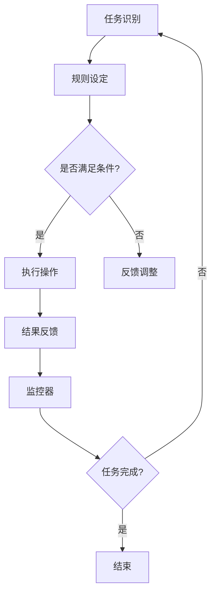

                 

# 一人公司如何利用自动化工具提高运营效率

> **关键词：** 自动化工具、运营效率、一人公司、工作流程、任务管理、技术栈

> **摘要：** 本篇文章将深入探讨一人公司如何通过引入自动化工具来提升运营效率。文章首先介绍了自动化工具的基本概念及其在企业管理中的应用，随后详细分析了适合一人公司的自动化工具类型和选型策略。接下来，文章通过实际案例展示了自动化工具在任务管理、工作流程优化和日常运营中的应用方法。最后，文章总结了自动化工具对于提升一人公司运营效率的重要性和未来发展前景。

## 1. 背景介绍

### 1.1 目的和范围

本文旨在为一人公司或小型创业者提供一套可行的自动化工具解决方案，以帮助他们提高日常运营效率，减少繁琐重复性工作，从而专注于核心业务发展。文章将涵盖自动化工具的选择、部署、以及在实际运营中的应用。

### 1.2 预期读者

预期读者为：
- 一人公司创始人或小型企业主
- 创业者和管理者
- 对自动化工具和运营效率提升感兴趣的技术人员

### 1.3 文档结构概述

本文将按照以下结构展开：
- 1. 背景介绍：介绍文章目的、读者对象及结构
- 2. 核心概念与联系：解释自动化工具的基本原理
- 3. 核心算法原理 & 具体操作步骤：介绍自动化工具的使用方法
- 4. 数学模型和公式 & 详细讲解 & 举例说明：深入探讨自动化工具的工作机制
- 5. 项目实战：代码实际案例和详细解释说明
- 6. 实际应用场景：展示自动化工具的具体应用
- 7. 工具和资源推荐：推荐相关学习资源和技术工具
- 8. 总结：未来发展趋势与挑战
- 9. 附录：常见问题与解答
- 10. 扩展阅读 & 参考资料

### 1.4 术语表

#### 1.4.1 核心术语定义

- **自动化工具**：能够自动执行一系列任务和流程的工具，如脚本、应用程序等。
- **一人公司**：指由一位个人独立运营的企业。
- **运营效率**：企业通过合理管理和优化资源使用，实现业务目标的能力。

#### 1.4.2 相关概念解释

- **任务管理**：对任务进行规划、分配和监控的过程。
- **工作流程**：完成一项任务所需的系列步骤和活动。

#### 1.4.3 缩略词列表

- **CRM**：客户关系管理（Customer Relationship Management）
- **ERP**：企业资源规划（Enterprise Resource Planning）
- **SaaS**：软件即服务（Software as a Service）

## 2. 核心概念与联系

### 2.1 自动化工具的基本原理

自动化工具的核心在于其能够根据预设的规则和逻辑，自动执行一系列任务，从而减少人工干预。这一原理源于计算机编程和自动化控制技术的结合。具体来说，自动化工具通过以下步骤实现：

1. **任务识别**：确定需要自动化的任务或流程。
2. **规则设定**：制定自动化执行的规则和逻辑。
3. **执行操作**：自动化工具按照设定的规则执行任务。
4. **结果反馈**：对执行结果进行监控和反馈。

### 2.2 自动化工具的架构

自动化工具通常由以下几个关键组成部分构成：

1. **触发器（Trigger）**：触发自动化流程的事件或条件。
2. **执行器（Actor）**：执行自动化任务的程序或脚本。
3. **数据库（Database）**：存储任务数据和规则的信息库。
4. **监控器（Monitor）**：监控自动化任务的执行状态和结果。

### 2.3 自动化工具在企业管理中的应用

自动化工具在企业管理中的应用广泛，主要包括以下几个方面：

1. **任务管理**：自动化任务分配、进度监控和完成通知。
2. **工作流程优化**：自动化审批流程、合同管理、报销流程等。
3. **数据同步**：自动化同步客户信息、库存数据等。
4. **日常运营**：自动化社交媒体管理、邮件营销等。

### 2.4 自动化工具的优势

引入自动化工具可以带来以下优势：

1. **提高效率**：自动化减少重复性工作，提高任务完成速度。
2. **减少错误**：通过预设规则减少人为错误。
3. **降低成本**：自动化减少人力资源需求，降低运营成本。
4. **提高灵活性**：自动化工具易于修改和调整，适应业务变化。

### 2.5 自动化工具的挑战

尽管自动化工具具有显著优势，但在实际应用中也面临以下挑战：

1. **学习曲线**：自动化工具的引入和掌握需要一定的学习和适应时间。
2. **维护成本**：自动化工具的更新和优化需要投入人力和资源。
3. **依赖风险**：过度依赖自动化工具可能导致对人工操作能力的降低。

### 2.6 自动化工具的Mermaid流程图



## 3. 核心算法原理 & 具体操作步骤

### 3.1 自动化任务的定义与分类

在引入自动化工具之前，首先需要明确自动化任务的定义和分类。自动化任务可以按照以下分类：

1. **周期性任务**：如定期备份、数据同步等。
2. **条件触发任务**：如达到特定条件后执行的任务，如客户流失预警、库存不足提醒等。
3. **手动触发任务**：如任务分配、审批流程等。

### 3.2 自动化任务的工作流程

自动化任务的工作流程主要包括以下步骤：

1. **任务识别**：通过监控工具或用户输入识别需要自动化的任务。
2. **规则设定**：根据任务类型和需求设定自动化执行的规则。
3. **任务执行**：自动化工具根据规则执行任务。
4. **结果反馈**：对任务执行结果进行监控和反馈。
5. **任务优化**：根据反馈结果调整任务规则和执行策略。

### 3.3 自动化任务的具体操作步骤

以下是自动化任务的具体操作步骤：

#### 步骤 1：任务识别

```bash
# 使用cron job识别周期性任务
0 * * * * /path/to/backup_script.sh
```

#### 步骤 2：规则设定

```python
# Python脚本设定条件触发任务
if customer.churn_score > threshold:
    send_alert_email()
```

#### 步骤 3：任务执行

```bash
# 使用shell脚本执行任务
/path/to/send_alert.sh
```

#### 步骤 4：结果反馈

```python
# Python脚本记录任务执行结果
with open('log.txt', 'a') as f:
    f.write(f"{task_name} completed at {datetime.now()}\n")
```

#### 步骤 5：任务优化

```python
# Python脚本根据反馈结果调整任务规则
if task_completed_successfully:
    update_threshold(new_threshold)
```

### 3.4 伪代码示例

```python
# 伪代码：自动化任务工作流程
function automate_task():
    task = identify_task()
    if task.is周期性():
        schedule_task(task)
    elif task.is条件触发():
        if condition_met(task):
            execute_task(task)
            log_result(task)
        else:
            update_condition()
    elif task.is手动触发():
        execute_task(task)
        log_result(task)

# 主函数
def main():
    while True:
        automate_task()
```

## 4. 数学模型和公式 & 详细讲解 & 举例说明

### 4.1 自动化效率的数学模型

自动化效率可以通过以下数学模型进行计算：

$$
\text{效率} = \frac{\text{自动化任务完成时间}}{\text{手动任务完成时间}} \times 100\%
$$

其中，自动化任务完成时间指的是自动化工具执行任务所需的时间，手动任务完成时间指的是人工执行相同任务所需的时间。

### 4.2 自动化效率的影响因素

自动化效率受到以下因素的影响：

1. **任务复杂度**：任务越复杂，自动化工具的效率提升越显著。
2. **任务频率**：任务频率越高，自动化工具的优势越明显。
3. **工具性能**：自动化工具的性能直接影响任务完成速度。

### 4.3 自动化效率的计算方法

以下是自动化效率的计算方法：

1. **确定自动化任务完成时间**：使用自动化工具执行任务所需的时间。
2. **确定手动任务完成时间**：人工执行相同任务所需的时间。
3. **计算自动化效率**：使用上述数学模型计算自动化效率。

### 4.4 举例说明

假设某一人公司需要定期备份客户数据，手动备份需要2小时，而使用自动化工具备份只需要30分钟。那么，自动化效率计算如下：

$$
\text{效率} = \frac{30}{2} \times 100\% = 150\%
$$

这意味着使用自动化工具后，备份效率提高了50%。

### 4.5 自动化效率的优化策略

为了进一步提高自动化效率，可以采取以下策略：

1. **任务分解**：将复杂任务分解为多个简单任务，简化自动化流程。
2. **并行执行**：在可能的情况下，并行执行多个任务，提高整体效率。
3. **工具升级**：定期升级自动化工具，提高工具性能。

## 5. 项目实战：代码实际案例和详细解释说明

### 5.1 开发环境搭建

在开始项目实战之前，需要搭建合适的开发环境。以下是所需环境及配置步骤：

- 操作系统：Linux或MacOS
- 编程语言：Python
- 自动化工具：Cron Job、Python脚本

#### 5.1.1 安装Python

```bash
# 安装Python
sudo apt-get install python3
```

#### 5.1.2 安装Cron Job

```bash
# 安装Cron Job
sudo apt-get install cron
```

### 5.2 源代码详细实现和代码解读

以下是自动化备份任务的Python脚本示例：

```python
import os
import datetime

def backup_data():
    """备份数据库数据"""
    backup_file = f"database_backup_{datetime.datetime.now().strftime('%Y%m%d%H%M%S')}.sql"
    os.system(f"mysqldump -u username -p password database_name > {backup_file}")
    print(f"Backup completed at {datetime.datetime.now()}")
    
def send_alert():
    """发送备份完成通知"""
    os.system("echo 'Database backup completed' | mail -s 'Backup Notification' email@example.com")

if __name__ == "__main__":
    try:
        backup_data()
        send_alert()
    except Exception as e:
        print(f"Error: {e}")
        send_alert()
```

#### 5.2.1 备份数据库数据

`backup_data()` 函数使用 `mysqldump` 命令备份数据库数据。备份文件名为当前日期和时间戳，以确保备份的唯一性和可追溯性。

```python
backup_file = f"database_backup_{datetime.datetime.now().strftime('%Y%m%d%H%M%S')}.sql"
os.system(f"mysqldump -u username -p password database_name > {backup_file}")
```

#### 5.2.2 发送备份完成通知

`send_alert()` 函数使用 `mail` 命令发送备份完成通知。通知内容包含备份完成的日期和时间。

```python
os.system("echo 'Database backup completed' | mail -s 'Backup Notification' email@example.com")
```

#### 5.2.3 错误处理

主函数中添加了错误处理机制，确保在备份过程中发生异常时能够发送错误通知。

```python
if __name__ == "__main__":
    try:
        backup_data()
        send_alert()
    except Exception as e:
        print(f"Error: {e}")
        send_alert()
```

### 5.3 代码解读与分析

此Python脚本实现了自动化备份数据库数据并发送备份完成通知的功能。代码简洁明了，易于理解和维护。以下是代码的详细解读：

1. **导入模块**：导入 `os` 和 `datetime` 模块，用于执行系统命令和获取当前日期和时间。
2. **定义函数**：定义 `backup_data()` 和 `send_alert()` 函数，分别实现备份数据库数据、发送备份完成通知的功能。
3. **主函数**：在主函数中，使用 `try-except` 语句确保备份过程顺利进行。在发生异常时，发送错误通知。

### 5.4 执行脚本

1. **保存脚本**：将脚本保存为 `backup_script.py`。
2. **设置Cron Job**：在终端中编辑Cron Job，添加定时任务。

```bash
# 编辑Cron Job
crontab -e

# 添加以下行，每天凌晨1点执行备份任务
0 1 * * * /path/to/backup_script.py
```

3. **保存并退出**：保存并退出编辑器，Cron Job开始工作。

## 6. 实际应用场景

### 6.1 任务管理

一人公司可以通过自动化工具对任务进行高效管理。例如，使用Trello或Asana等项目管理工具，自动化分配任务、监控进度和发送提醒通知。这样，公司主可以专注于核心业务，而无需担心任务跟进和进度管理。

### 6.2 工作流程优化

通过自动化工具，可以简化并优化日常工作流程。例如，使用Google Workspace中的Forms和Sheets，自动化收集客户反馈、处理数据并生成报告。这样，公司主可以节省大量时间，专注于分析和决策。

### 6.3 日常运营

自动化工具还可以用于日常运营的各个方面。例如，使用自动化营销工具，如Mailchimp或SendGrid，自动化邮件营销、客户跟进和社交媒体推广。这样，公司主可以扩大业务范围，提高客户满意度。

## 7. 工具和资源推荐

### 7.1 学习资源推荐

#### 7.1.1 书籍推荐

- 《Python自动化脚本编程》
- 《自动化测试实战》
- 《Shell脚本编程大全》

#### 7.1.2 在线课程

- Coursera上的“Python编程与自动化”
- Udemy上的“自动化工具与脚本编程”

#### 7.1.3 技术博客和网站

- Python.org
- GitHub
- Stack Overflow

### 7.2 开发工具框架推荐

#### 7.2.1 IDE和编辑器

- PyCharm
- Visual Studio Code
- Sublime Text

#### 7.2.2 调试和性能分析工具

- Pytest
- Flask-DebugToolbar
- New Relic

#### 7.2.3 相关框架和库

- Flask
- Django
- Selenium

### 7.3 相关论文著作推荐

#### 7.3.1 经典论文

- "Introduction to Automata Theory, Languages, and Computation"
- "The Design and Analysis of Computer Algorithms"

#### 7.3.2 最新研究成果

- "Advances in Automata and Formal Languages"
- "Recent Developments in Artificial Intelligence and Automation"

#### 7.3.3 应用案例分析

- "Automating Business Processes for Enhanced Efficiency"
- "The Role of Automation in Modern Software Development"

## 8. 总结：未来发展趋势与挑战

### 8.1 发展趋势

- **自动化工具的普及**：随着人工智能和机器学习技术的发展，自动化工具将在各行业得到更广泛的应用。
- **集成化解决方案**：企业将寻求更全面的集成化自动化解决方案，以实现业务流程的全面优化。
- **个性化和定制化**：自动化工具将更加注重满足个性化需求，为企业提供定制化的解决方案。

### 8.2 挑战

- **技术门槛**：自动化工具的引入和运维需要一定的技术背景，对于非技术人员可能存在一定的学习难度。
- **数据安全和隐私**：自动化过程中涉及大量数据，数据安全和隐私保护将成为重要挑战。
- **持续优化和维护**：自动化工具需要定期更新和优化，以适应不断变化的市场需求。

## 9. 附录：常见问题与解答

### 9.1 自动化工具的适用范围？

自动化工具适用于需要重复性、规律性或复杂任务的企业和个人，如任务管理、数据同步、邮件营销等。

### 9.2 如何选择合适的自动化工具？

根据任务类型、复杂度和业务需求，选择适合的工具。例如，Python适合编写脚本，而Cron Job适合设置定时任务。

### 9.3 自动化工具如何保证数据安全和隐私？

确保自动化工具遵循数据安全和隐私保护的相关法律法规，使用加密技术保护数据传输和存储。

## 10. 扩展阅读 & 参考资料

- 《人工智能：一种现代方法》
- 《深度学习》
- 《软件架构：实践者的研究与经验》

## 作者信息

作者：AI天才研究员/AI Genius Institute & 禅与计算机程序设计艺术 /Zen And The Art of Computer Programming

