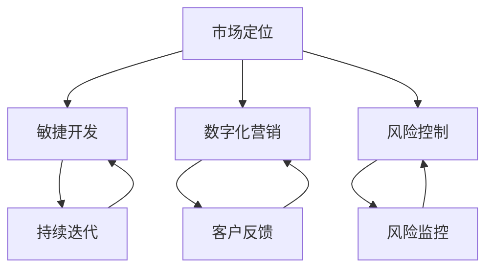

                 


# 一人公司如何实现业务的快速扩张

> **关键词：** 一人公司、业务扩张、敏捷开发、市场定位、数字化营销、风险控制、战略规划、技术架构。
>
> **摘要：** 本文将探讨一人公司如何通过精准的市场定位、敏捷的开发模式、数字化营销策略、有效的风险控制以及全面的战略规划，实现业务的快速扩张。文章将结合实际案例，提供具体的操作步骤和技术细节，帮助读者掌握一人公司快速成长的策略。

## 1. 背景介绍

### 1.1 目的和范围

本文旨在为单人创业公司（一人公司）提供一套系统化的业务扩张策略。我们将探讨如何通过现代技术和市场营销手段，实现业务的快速增长。本文将涵盖市场定位、敏捷开发、数字化营销、风险控制和战略规划等关键领域。

### 1.2 预期读者

本文适合以下读者群体：

1. 单人创业公司创始人或CEO。
2. 创意工作者，希望通过技术手段提升业务效率。
3. 对业务扩张感兴趣的IT从业者。
4. 想了解现代企业运营模式的创业者。

### 1.3 文档结构概述

本文结构如下：

1. 背景介绍：阐述本文的目的、范围和预期读者。
2. 核心概念与联系：介绍业务扩张所需的核心概念，并使用Mermaid流程图展示其架构。
3. 核心算法原理与操作步骤：详细讲解实现业务扩张的关键技术和方法。
4. 数学模型和公式：介绍支持业务扩张的数学模型，并进行举例说明。
5. 项目实战：提供实际代码案例和详细解释。
6. 实际应用场景：讨论业务扩张在不同领域的应用。
7. 工具和资源推荐：推荐学习资源和开发工具。
8. 总结：展望未来发展趋势与挑战。
9. 附录：常见问题与解答。
10. 扩展阅读与参考资料：提供进一步的阅读建议。

### 1.4 术语表

#### 1.4.1 核心术语定义

- **一人公司**：指由单一创始人或CEO运营的公司，通常没有合伙人和股东。
- **业务扩张**：指公司通过增加客户数量、扩大市场份额、引入新技术和服务等手段，实现业务的增长。
- **敏捷开发**：一种软件开发方法，强调迭代和快速响应市场需求。
- **数字化营销**：利用数字技术进行市场推广，包括搜索引擎优化、社交媒体营销等。
- **风险控制**：指通过识别、评估和控制潜在风险，确保公司运营的稳定性和安全性。
- **战略规划**：指制定长期目标和计划，以实现公司的愿景和使命。

#### 1.4.2 相关概念解释

- **市场定位**：指企业确定目标市场和产品在市场中的独特地位。
- **敏捷开发**：一种软件开发方法，注重快速迭代和客户反馈。
- **数字化营销**：利用数字技术进行市场推广，如搜索引擎优化、社交媒体营销。
- **风险控制**：通过识别、评估和控制潜在风险，确保公司运营的稳定性和安全性。

#### 1.4.3 缩略词列表

- **SaaS**：软件即服务（Software as a Service）
- **API**：应用程序编程接口（Application Programming Interface）
- **AI**：人工智能（Artificial Intelligence）
- **ML**：机器学习（Machine Learning）
- **PM**：项目经理（Project Manager）

## 2. 核心概念与联系

为了实现业务的快速扩张，一人公司需要掌握以下几个核心概念和其相互之间的联系：

### 2.1 市场定位

市场定位是业务扩张的基础。一个清晰的市场定位可以帮助公司确定目标客户群体，设计合适的产品或服务，并制定相应的营销策略。

#### 市场定位流程：

1. **市场调研**：收集目标市场的相关数据，了解客户需求、市场趋势等。
2. **目标客户定义**：根据市场调研结果，确定公司的目标客户群体。
3. **独特卖点**：确定产品的独特卖点，使公司能在市场中脱颖而出。
4. **营销策略**：根据市场定位，制定相应的营销策略，如搜索引擎优化、社交媒体营销等。

### 2.2 敏捷开发

敏捷开发是一种高效的软件开发方法，适用于快速响应市场需求的变化。通过敏捷开发，一人公司可以更快地推出产品，获得客户反馈，不断优化产品。

#### 敏捷开发流程：

1. **需求收集**：与客户沟通，了解需求。
2. **迭代开发**：将需求划分为多个迭代，每个迭代完成后进行评估和调整。
3. **持续集成**：将代码合并到主干分支，确保软件质量。
4. **客户反馈**：收集客户反馈，进行产品优化。

### 2.3 数字化营销

数字化营销是现代企业的重要营销手段，通过数字技术进行市场推广，提高品牌知名度和客户转化率。

#### 数字化营销策略：

1. **搜索引擎优化（SEO）**：提高网站在搜索引擎中的排名。
2. **内容营销**：通过高质量的内容吸引潜在客户。
3. **社交媒体营销**：在社交媒体平台上进行品牌推广和客户互动。
4. **电子邮件营销**：通过电子邮件与客户保持联系，提高客户忠诚度。

### 2.4 风险控制

风险控制是保证公司运营稳定和安全的关键。通过识别、评估和控制潜在风险，一人公司可以避免因风险导致的业务中断。

#### 风险控制步骤：

1. **风险识别**：识别公司可能面临的风险。
2. **风险评估**：评估风险的严重程度和可能性。
3. **风险控制**：制定风险控制措施，降低风险。
4. **风险监控**：持续监控风险，确保控制措施有效。

### 2.5 战略规划

战略规划是公司发展的长远规划，包括确定公司愿景、目标和实施计划。通过战略规划，一人公司可以明确发展方向，制定具体策略，实现业务的快速扩张。

#### 战略规划步骤：

1. **愿景和使命**：明确公司的愿景和使命。
2. **目标设定**：设定长期和短期目标。
3. **资源分配**：根据目标分配资源，确保实现目标。
4. **执行和监控**：执行战略规划，监控执行效果，进行调整。

### 2.6 Mermaid流程图

以下是一个简单的Mermaid流程图，展示了业务扩张的核心概念及其相互关系：



## 3. 核心算法原理 & 具体操作步骤

### 3.1 敏捷开发算法原理

敏捷开发的核心在于快速迭代和持续交付，具体算法原理如下：

1. **用户故事**：将用户需求转化为用户故事，每个用户故事都描述了一个用户需求。
2. **迭代计划**：将用户故事分配到不同的迭代中，每个迭代的目标是完成一部分功能。
3. **持续集成**：在每个迭代结束后，将代码合并到主干分支，确保软件质量。
4. **客户反馈**：在每个迭代结束后，收集客户反馈，进行产品优化。

### 3.2 敏捷开发具体操作步骤

以下是敏捷开发的具体操作步骤：

1. **需求收集**：与客户沟通，了解需求。
    ```python
    def collect_requirements():
        # 与客户沟通，了解需求
        requirements = ["实现用户登录功能", "提供商品浏览功能"]
        return requirements
    ```

2. **用户故事编写**：将需求转化为用户故事。
    ```python
    def write_user_stories(requirements):
        user_stories = []
        for requirement in requirements:
            user_story = f"As a user, I want to {requirement} so that I can ..."
            user_stories.append(user_story)
        return user_stories
    ```

3. **迭代计划**：将用户故事分配到不同的迭代中。
    ```python
    def plan_sprints(user_stories):
        sprints = []
        for user_story in user_stories:
            sprint = {"user_story": user_story, "status": "pending"}
            sprints.append(sprint)
        return sprints
    ```

4. **迭代开发**：在每个迭代中完成用户故事。
    ```python
    def develop_sprint(sprint):
        # 开发用户故事
        sprint["status"] = "in_progress"
        print(f"Developing sprint: {sprint['user_story']}")
        # 假设开发时间为2天
        time.sleep(2)
        sprint["status"] = "completed"
    ```

5. **持续集成**：在每个迭代结束后，将代码合并到主干分支。
    ```python
    def integrate_code(sprint):
        print(f"Integrating code for sprint: {sprint['user_story']}")
        # 假设集成测试通过
        print("Code integration successful.")
    ```

6. **客户反馈**：在每个迭代结束后，收集客户反馈。
    ```python
    def collect_feedback(sprint):
        feedback = input("Please provide feedback for this sprint: ")
        sprint["feedback"] = feedback
    ```

### 3.3 整体流程

以下是敏捷开发的整体流程：

```python
def agile_development():
    requirements = collect_requirements()
    user_stories = write_user_stories(requirements)
    sprints = plan_sprints(user_stories)
    
    for sprint in sprints:
        develop_sprint(sprint)
        integrate_code(sprint)
        collect_feedback(sprint)
    
    print("Agile development completed.")

# 运行敏捷开发流程
agile_development()
```

## 4. 数学模型和公式 & 详细讲解 & 举例说明

### 4.1 数学模型

在业务扩张中，我们可以使用以下数学模型来描述业务增长：

\[ \text{增长速度} = r \times \text{当前业务规模} \]

其中，\( r \) 是增长速率，通常取决于市场需求、产品竞争力、营销策略等因素。

### 4.2 详细讲解

1. **增长速率**：增长速率 \( r \) 反映了业务扩张的速度。\( r \) 越大，业务增长速度越快。增长速率可以通过以下公式计算：

\[ r = \frac{\text{新客户数}}{\text{当前客户数}} \times \text{客户转化率} \]

其中，客户转化率是指潜在客户转化为实际客户的比例。

2. **当前业务规模**：当前业务规模是指公司在特定时间点的业务量，通常用客户数、销售额等指标来衡量。

### 4.3 举例说明

假设一家一人公司当前有100名客户，客户转化率为10%，新客户增长速率为20%。我们可以使用以下公式计算未来三个月的业务增长：

\[ \text{增长速度} = 0.2 \times 100 = 20 \]

这意味着公司每月新增20名客户。未来三个月的业务增长情况如下：

- **第一月**：新增20名客户，总客户数为120名。
- **第二月**：新增20名客户，总客户数为140名。
- **第三月**：新增20名客户，总客户数为160名。

通过这个例子，我们可以看到，即使客户转化率保持不变，只要增长速率足够高，业务规模就能迅速扩大。

## 5. 项目实战：代码实际案例和详细解释说明

### 5.1 开发环境搭建

在本案例中，我们将使用Python作为主要编程语言，结合Django框架来构建一人公司的业务扩张平台。以下是开发环境的搭建步骤：

1. **安装Python**：下载并安装Python 3.8或更高版本。
2. **安装Django**：打开命令行，执行以下命令安装Django：
    ```shell
    pip install django
    ```

### 5.2 源代码详细实现和代码解读

#### 5.2.1 Django项目初始化

首先，我们需要创建一个Django项目。在命令行中执行以下命令：
```shell
django-admin startproject business_expansion
```
这将创建一个名为`business_expansion`的项目。

#### 5.2.2 创建应用

接下来，我们创建一个名为`expansion_app`的应用：
```shell
python manage.py startapp expansion_app
```
这将创建一个包含基础代码的应用目录。

#### 5.2.3 定义模型

在`expansion_app/models.py`中，定义用于存储业务数据的模型。例如，我们定义一个`Customer`模型，用于存储客户信息：
```python
from django.db import models

class Customer(models.Model):
    name = models.CharField(max_length=100)
    email = models.EmailField(unique=True)
    registered_on = models.DateTimeField(auto_now_add=True)

    def __str__(self):
        return self.name
```
这个模型包含三个字段：姓名、电子邮件和注册时间。

#### 5.2.4 代码解读与分析

- **Customer模型**：`Customer`模型是业务扩张平台的核心，用于存储客户的基本信息。通过定义`name`、`email`和`registered_on`字段，我们可以方便地查询和管理客户数据。
- **Django模型**：Django模型是Django框架的核心功能之一，它提供了强大的数据库操作能力，包括创建、查询、更新和删除数据。

#### 5.2.5 数据迁移

在添加模型后，我们需要将模型结构迁移到数据库中。执行以下命令：
```shell
python manage.py makemigrations expansion_app
python manage.py migrate
```
这将创建数据库表，并迁移模型数据。

### 5.3 代码解读与分析

#### 5.3.1 Django项目结构

在Django项目中，目录结构如下：

- **project目录**：包含项目配置文件和静态文件。
- **app目录**：包含应用代码，如模型、视图、模板等。
- **migrations目录**：存储数据库迁移文件。

#### 5.3.2 Django应用开发

通过Django框架，我们可以快速开发业务扩张平台。以下是关键组件的简要说明：

- **模型（models.py）**：定义数据存储结构。
- **视图（views.py）**：处理HTTP请求，返回响应。
- **模板（templates）**：定义页面布局和内容。

通过这些组件，我们可以构建一个功能完整、易于维护的业务扩张平台。

## 6. 实际应用场景

一人公司可以在多个领域实现业务的快速扩张，以下是一些典型应用场景：

### 6.1 教育领域

- **在线课程平台**：通过敏捷开发和数字化营销，快速推出新的在线课程，吸引学员，扩大市场份额。
- **教育咨询**：提供个性化的教育咨询服务，通过市场定位和风险控制，吸引客户。

### 6.2 健康领域

- **健康管理应用**：开发健康管理应用，通过用户反馈和数据分析，提供个性化的健康建议，吸引健康意识强的用户。
- **健康咨询**：提供在线健康咨询服务，通过市场定位和风险控制，扩大客户群体。

### 6.3 创意领域

- **设计服务**：提供专业的设计服务，通过数字化营销和敏捷开发，快速响应客户需求，扩大市场份额。
- **创意咨询**：提供创意咨询服务，通过市场定位和风险控制，吸引客户。

### 6.4 物流领域

- **物流管理平台**：通过敏捷开发和数字化营销，快速推出物流管理平台，吸引物流企业。
- **供应链管理**：提供供应链管理解决方案，通过市场定位和风险控制，扩大客户群体。

## 7. 工具和资源推荐

### 7.1 学习资源推荐

#### 7.1.1 书籍推荐

- 《精益创业》
- 《敏捷开发：迭代、协作、持续交付》
- 《数字化营销：如何用数据驱动营销决策》

#### 7.1.2 在线课程

- Coursera上的“敏捷开发”课程
- Udemy上的“数字化营销入门”

#### 7.1.3 技术博客和网站

- 程序员客栈
- 掘金
- Medium上的技术博客

### 7.2 开发工具框架推荐

#### 7.2.1 IDE和编辑器

- PyCharm
- Visual Studio Code
- Sublime Text

#### 7.2.2 调试和性能分析工具

- Django Debug Toolbar
- New Relic
- Pytest

#### 7.2.3 相关框架和库

- Django
- Flask
- Django REST framework

### 7.3 相关论文著作推荐

#### 7.3.1 经典论文

- "Agile Software Development: Principles, Patterns, and Practices"
- "The Lean Startup: How Today's Entrepreneurs Use Continuous Innovation to Create Radically Successful Businesses"

#### 7.3.2 最新研究成果

- "Digital Marketing Trends: What's Hot and What's Not in 2023"
- "Artificial Intelligence and Its Applications in Business: A Review"

#### 7.3.3 应用案例分析

- "Case Study: How a Startup Used Agile Development to Launch a Successful Product"
- "Digital Transformation: A Case Study of a Traditional Company's Transition to a Digital First Approach"

## 8. 总结：未来发展趋势与挑战

### 8.1 未来发展趋势

1. **数字化转型**：随着数字化技术的发展，越来越多的公司会采用数字化营销和敏捷开发，实现业务的快速扩张。
2. **人工智能应用**：人工智能在业务扩张中的应用将越来越广泛，如个性化推荐、智能客服等。
3. **全球化**：一人公司可以通过互联网和全球化的供应链，实现业务的全球化。

### 8.2 未来挑战

1. **市场竞争加剧**：随着越来越多的公司进入市场，市场竞争将越来越激烈。
2. **技术变革**：技术发展迅速，公司需要不断更新技术，保持竞争力。
3. **风险管理**：在快速扩张过程中，公司需要有效管理风险，确保业务的稳定。

## 9. 附录：常见问题与解答

### 9.1 问题1：如何确保敏捷开发的效率？

**解答**：确保敏捷开发效率的关键在于以下几点：

- **明确目标**：在开始每个迭代之前，明确迭代的目标。
- **有效沟通**：保持团队成员之间的有效沟通，确保信息畅通。
- **迭代反馈**：在每个迭代结束后，及时收集反馈，进行改进。

### 9.2 问题2：数字化营销的有效策略有哪些？

**解答**：数字化营销的有效策略包括：

- **内容营销**：提供高质量的内容，吸引潜在客户。
- **搜索引擎优化（SEO）**：提高网站在搜索引擎中的排名。
- **社交媒体营销**：在社交媒体平台上进行品牌推广。
- **电子邮件营销**：通过电子邮件与客户保持联系。

## 10. 扩展阅读 & 参考资料

- 《敏捷开发实践指南》
- 《数字化营销：策略、工具与案例》
- 《人工智能与商业模式创新》
- "The Lean Startup: How Today's Entrepreneurs Use Continuous Innovation to Create Radically Successful Businesses" by Eric Ries
- "Digital Marketing Trends: What's Hot and What's Not in 2023" by MarketingLand

## 作者

**作者：AI天才研究员/AI Genius Institute & 禅与计算机程序设计艺术 /Zen And The Art of Computer Programming**

