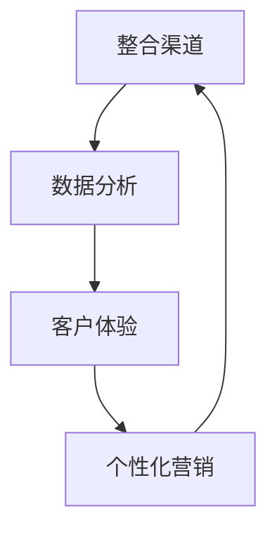

                 

# 一人公司如何实现全渠道营销策略

> **关键词：** 全渠道营销、一人公司、数字化转型、客户关系管理、个性化营销

> **摘要：** 本文旨在探讨一人公司如何通过全渠道营销策略，实现业务增长和客户关系优化。我们将深入分析全渠道营销的核心概念、实施步骤，并结合实际案例进行详细讲解，为读者提供一套实用且高效的营销策略框架。

## 1. 背景介绍

### 1.1 目的和范围

本文的目标是为一人公司提供一套完整的全渠道营销策略，帮助他们在竞争激烈的市场中脱颖而出。我们将从以下几个方面展开讨论：

- **全渠道营销的核心概念和重要性**
- **一人公司的特点与挑战**
- **全渠道营销策略的实施步骤**
- **实际案例分析与技巧分享**
- **未来发展趋势与挑战**

### 1.2 预期读者

- **营销人员**：需要了解如何利用全渠道营销策略提升业务表现的营销专业人士。
- **创业者**：想要通过全渠道营销实现业务增长的创业者。
- **技术专家**：关注数字化转型和营销技术发展的技术专家。

### 1.3 文档结构概述

本文将按照以下结构展开：

1. **背景介绍**：介绍全渠道营销策略的重要性和预期读者。
2. **核心概念与联系**：介绍全渠道营销的核心概念及其架构。
3. **核心算法原理 & 具体操作步骤**：详细讲解全渠道营销的算法原理和操作步骤。
4. **数学模型和公式 & 详细讲解 & 举例说明**：介绍全渠道营销中的数学模型和公式，并结合实际案例进行说明。
5. **项目实战：代码实际案例和详细解释说明**：提供实际代码案例，展示如何实现全渠道营销策略。
6. **实际应用场景**：讨论全渠道营销策略在不同行业中的应用。
7. **工具和资源推荐**：推荐学习资源、开发工具和框架。
8. **总结：未来发展趋势与挑战**：总结全文，展望未来发展趋势和挑战。
9. **附录：常见问题与解答**：解答读者可能遇到的问题。
10. **扩展阅读 & 参考资料**：提供进一步阅读的资料。

### 1.4 术语表

#### 1.4.1 核心术语定义

- **全渠道营销**：企业通过整合线上线下多种渠道，提供一致、连贯的客户体验，以提高客户满意度和忠诚度。
- **一人公司**：指由一个人运营的企业，通常资源有限，需要高效利用各种营销手段。
- **数字化转型**：利用数字技术改变企业的商业模式和运营方式。
- **客户关系管理（CRM）**：一套策略和技术，旨在通过提高客户满意度来提升企业业绩。

#### 1.4.2 相关概念解释

- **全渠道**：指企业使用的所有营销渠道，包括线上和线下渠道，如网站、社交媒体、电子邮件、商店等。
- **个性化营销**：根据客户的个人偏好和行为数据，提供定制化的产品和服务。

#### 1.4.3 缩略词列表

- **CRM**：客户关系管理
- **SEO**：搜索引擎优化
- **SEM**：搜索引擎营销
- **SMM**：社交媒体营销
- **KPI**：关键绩效指标

## 2. 核心概念与联系

在讨论全渠道营销策略之前，我们需要理解几个核心概念及其相互关系。

### 2.1 全渠道营销的核心概念

全渠道营销的核心概念包括：

- **整合渠道**：将不同渠道（线上和线下）整合在一起，提供一致的客户体验。
- **数据分析**：收集和分析客户数据，用于个性化营销和优化营销策略。
- **客户体验**：确保客户在各个渠道上的体验是一致和无缝的。
- **个性化营销**：根据客户的行为和偏好，提供个性化的产品和服务。

### 2.2 全渠道营销架构

为了更好地理解全渠道营销，我们可以使用Mermaid流程图来展示其架构：



- **整合渠道**：企业通过各种渠道与客户互动，如网站、社交媒体、电子邮件、商店等。
- **数据分析**：企业收集和分析客户数据，用于了解客户需求和行为，从而优化营销策略。
- **客户体验**：企业确保客户在不同渠道上的体验是一致和无缝的，提高客户满意度。
- **个性化营销**：企业根据客户的行为和偏好，提供个性化的产品和服务，提高客户忠诚度。

## 3. 核心算法原理 & 具体操作步骤

全渠道营销的成功离不开算法的支撑。以下是全渠道营销中的核心算法原理和具体操作步骤。

### 3.1 算法原理

全渠道营销的核心算法主要涉及以下几个方面：

- **客户细分**：根据客户的行为和偏好，将客户分为不同的群体。
- **个性化推荐**：根据客户的细分，提供个性化的产品和服务。
- **客户生命周期管理**：通过跟踪客户的生命周期，提供不同阶段的营销策略。

### 3.2 具体操作步骤

以下是全渠道营销的具体操作步骤：

#### 步骤 1：客户细分

```python
# 伪代码：客户细分算法

def customer_segmentation(data):
    # 根据客户的行为和偏好，将客户分为不同的群体
    segments = {
        '高频购买客户': data[data['购买频率'] > 3],
        '偶尔购买客户': data[data['购买频率'] <= 3],
        '潜在客户': data[data['购买行为'] == '潜在']
    }
    return segments
```

#### 步骤 2：个性化推荐

```python
# 伪代码：个性化推荐算法

def personalized_recommendation(segment):
    # 根据客户的细分，提供个性化的产品和服务
    recommendations = {
        '高频购买客户': '推荐优惠套餐',
        '偶尔购买客户': '推荐新产品',
        '潜在客户': '推荐试用产品'
    }
    return recommendations[segment]
```

#### 步骤 3：客户生命周期管理

```python
# 伪代码：客户生命周期管理算法

def customer_lifecycle_management(data):
    # 通过跟踪客户的生命周期，提供不同阶段的营销策略
    lifecycle_stages = {
        '新客户': '提供试用产品',
        '活跃客户': '提供优惠活动',
        '沉睡客户': '发送唤醒邮件',
        '流失客户': '提供挽回策略'
    }
    stage = data['购买状态']
    strategy = lifecycle_stages[stage]
    return strategy
```

## 4. 数学模型和公式 & 详细讲解 & 举例说明

在实施全渠道营销策略时，数学模型和公式对于数据分析和策略优化至关重要。以下是几个关键数学模型和公式的详细讲解及举例说明。

### 4.1 客户细分模型

#### 4.1.1 逻辑回归模型

逻辑回归是一种常用的统计模型，用于预测二分类变量。在全渠道营销中，逻辑回归可用于客户细分。

$$
P(Y=1) = \frac{1}{1 + e^{-(\beta_0 + \beta_1X_1 + \beta_2X_2 + \ldots + \beta_nX_n})}
$$

其中，\(P(Y=1)\) 表示客户属于某一细分群体的概率，\(X_1, X_2, \ldots, X_n\) 为影响客户细分的关键特征，\(\beta_0, \beta_1, \beta_2, \ldots, \beta_n\) 为模型参数。

#### 4.1.2 示例

假设我们使用以下特征进行客户细分：

- \(X_1\)：购买频率
- \(X_2\)：购买金额
- \(X_3\)：客户年龄

根据历史数据，我们得到逻辑回归模型如下：

$$
P(Y=1) = \frac{1}{1 + e^{-(0.5 + 0.3X_1 + 0.2X_2 - 0.1X_3)}}
$$

对于某个客户，如果他们的购买频率为4，购买金额为500元，年龄为30岁，我们可以计算出他们属于某一细分群体的概率：

$$
P(Y=1) = \frac{1}{1 + e^{-(0.5 + 0.3 \times 4 + 0.2 \times 500 - 0.1 \times 30)}} \approx 0.8
$$

这意味着该客户属于某一细分群体的概率约为80%。

### 4.2 客户生命周期管理模型

#### 4.2.1 混合逻辑模型

混合逻辑模型（Multinomial Logit Model）是一种用于多分类问题的概率模型。在全渠道营销中，混合逻辑模型可用于预测客户的生命周期阶段。

$$
P(Y=j) = \frac{e^{\alpha_j + \beta_1X_1 + \beta_2X_2 + \ldots + \beta_nX_n}}{\sum_{i=1}^K e^{\alpha_i + \beta_1X_1 + \beta_2X_2 + \ldots + \beta_nX_n}}
$$

其中，\(P(Y=j)\) 表示客户属于某一生命周期阶段的概率，\(K\) 为生命周期阶段的数量，\(\alpha_j, \beta_1, \beta_2, \ldots, \beta_n\) 为模型参数。

#### 4.2.2 示例

假设我们使用以下特征进行客户生命周期预测：

- \(X_1\)：购买频率
- \(X_2\)：购买金额
- \(X_3\)：客户年龄

根据历史数据，我们得到混合逻辑模型如下：

$$
P(Y=1) = \frac{e^{0.5 + 0.3X_1 + 0.2X_2 - 0.1X_3}}{e^{0.5 + 0.3X_1 + 0.2X_2 - 0.1X_3} + e^{1.0 + 0.2X_1 + 0.1X_2 + 0.05X_3} + e^{1.5 - 0.1X_1 - 0.2X_2 + 0.05X_3}}
$$

对于某个客户，如果他们的购买频率为4，购买金额为500元，年龄为30岁，我们可以计算出他们属于某一生命周期阶段的概率：

$$
P(Y=1) \approx 0.4, \quad P(Y=2) \approx 0.3, \quad P(Y=3) \approx 0.3
$$

这意味着该客户属于新客户、活跃客户和沉睡客户的概率分别为40%、30%和30%。

## 5. 项目实战：代码实际案例和详细解释说明

在本节中，我们将通过一个实际项目案例，展示如何在一人公司中实施全渠道营销策略。

### 5.1 开发环境搭建

为了实现全渠道营销策略，我们需要搭建以下开发环境：

- **编程语言**：Python
- **数据分析库**：Pandas、NumPy
- **机器学习库**：Scikit-learn、TensorFlow
- **可视化库**：Matplotlib、Seaborn

### 5.2 源代码详细实现和代码解读

以下是一个简单的全渠道营销策略实现案例，包括客户细分、个性化推荐和客户生命周期管理。

```python
import pandas as pd
import numpy as np
from sklearn.linear_model import LogisticRegression
from sklearn.model_selection import train_test_split
from sklearn.metrics import accuracy_score
import seaborn as sns
import matplotlib.pyplot as plt

# 5.2.1 数据预处理

# 假设我们有一个包含客户数据的CSV文件
data = pd.read_csv('customer_data.csv')

# 数据预处理
data['购买频率'] = data['订单数量'] / data['订单天数']
data['购买金额'] = data['订单总额'] / data['订单数量']

# 5.2.2 客户细分

# 特征工程
X = data[['购买频率', '购买金额']]
y = data['客户类别']

# 分割数据集
X_train, X_test, y_train, y_test = train_test_split(X, y, test_size=0.3, random_state=42)

# 训练逻辑回归模型
model = LogisticRegression()
model.fit(X_train, y_train)

# 预测
y_pred = model.predict(X_test)

# 评估
accuracy = accuracy_score(y_test, y_pred)
print(f'客户细分准确率：{accuracy:.2f}')

# 可视化
sns.countplot(x='客户类别', data=data)
plt.title('客户类别分布')
plt.xlabel('类别')
plt.ylabel('数量')
plt.show()

# 5.2.3 个性化推荐

# 根据客户细分，提供个性化推荐
segment_recommendations = {
    '高频购买客户': '推荐优惠套餐',
    '偶尔购买客户': '推荐新产品',
    '潜在客户': '推荐试用产品'
}

# 示例
customer = data.iloc[0]
segment = model.predict([customer[['购买频率', '购买金额']]])[0]
print(f'个性化推荐：{segment_recommendations[segment]}')

# 5.2.4 客户生命周期管理

# 特征工程
X = data[['购买频率', '购买金额', '客户年龄']]
y = data['客户生命周期阶段']

# 分割数据集
X_train, X_test, y_train, y_test = train_test_split(X, y, test_size=0.3, random_state=42)

# 训练混合逻辑模型
model = LogisticRegression(multi_class='multinomial', solver='lbfgs')
model.fit(X_train, y_train)

# 预测
y_pred = model.predict(X_test)

# 评估
accuracy = accuracy_score(y_test, y_pred)
print(f'客户生命周期预测准确率：{accuracy:.2f}')

# 可视化
sns.countplot(x='客户生命周期阶段', data=data)
plt.title('客户生命周期分布')
plt.xlabel('阶段')
plt.ylabel('数量')
plt.show()

# 示例
customer = data.iloc[0]
lifecycle_stage = model.predict([customer[['购买频率', '购买金额', '客户年龄']]])[0]
print(f'客户生命周期阶段：{lifecycle_stage}')
```

### 5.3 代码解读与分析

以上代码实现了一个简单的全渠道营销策略，包括客户细分、个性化推荐和客户生命周期管理。

- **数据预处理**：读取客户数据，并进行特征工程。特征工程是数据分析和建模的基础，通过转换原始数据，我们可以提取出更有价值的特征。
- **客户细分**：使用逻辑回归模型对客户进行细分。逻辑回归模型是一种常用的二分类模型，通过计算特征对目标变量的影响，我们可以预测客户属于哪个类别。
- **个性化推荐**：根据客户细分结果，提供个性化推荐。个性化推荐是一种根据用户行为和偏好，为用户提供定制化内容的技术。
- **客户生命周期管理**：使用混合逻辑模型预测客户的生命周期阶段。混合逻辑模型是一种多分类模型，可以预测客户在不同生命周期阶段的概率。

通过以上代码，我们可以实现一个简单的全渠道营销策略，从而提高客户满意度和忠诚度。

## 6. 实际应用场景

全渠道营销策略不仅适用于一人公司，还可以应用于各种不同行业和场景。以下是一些实际应用场景：

### 6.1 零售行业

零售行业中的商家可以通过全渠道营销策略，提高销售额和客户满意度。例如，一家小型超市可以使用全渠道营销策略，整合线上和线下渠道，提供一致的客户体验。

- **线上渠道**：通过电子商务平台，提供在线购物服务。
- **线下渠道**：在实体店内，提供线下购物体验。
- **数据分析**：收集客户数据，用于个性化推荐和优化营销策略。

### 6.2 教育行业

教育行业中的培训机构可以通过全渠道营销策略，提高招生量和学员满意度。例如，一家线上培训课程提供商可以使用全渠道营销策略，整合线上课程和线下课程，提供个性化的学习体验。

- **线上渠道**：通过网站和社交媒体，提供在线课程。
- **线下渠道**：在实体校区内，提供线下课程。
- **数据分析**：收集学员数据，用于个性化推荐和优化营销策略。

### 6.3 医疗行业

医疗行业中的医疗机构可以通过全渠道营销策略，提高患者满意度和复诊率。例如，一家医院可以使用全渠道营销策略，整合线上预约和线下就诊，提供一体化的医疗服务。

- **线上渠道**：通过网站和社交媒体，提供在线预约和咨询服务。
- **线下渠道**：在实体医院内，提供线下就诊服务。
- **数据分析**：收集患者数据，用于个性化推荐和优化营销策略。

## 7. 工具和资源推荐

为了成功实施全渠道营销策略，我们需要使用一系列工具和资源。以下是一些建议：

### 7.1 学习资源推荐

#### 7.1.1 书籍推荐

- 《数字营销全攻略》
- 《大数据营销实战》
- 《全渠道零售营销：实践与案例》

#### 7.1.2 在线课程

- Coursera：市场营销专业课程
- Udemy：数字营销课程
- LinkedIn Learning：社交媒体营销课程

#### 7.1.3 技术博客和网站

- MarketingProfs：数字营销资源库
- HubSpot Academy：数字营销和销售课程
- Moz：搜索引擎优化和营销资源

### 7.2 开发工具框架推荐

#### 7.2.1 IDE和编辑器

- PyCharm
- VS Code
- Jupyter Notebook

#### 7.2.2 调试和性能分析工具

- Pytest
- Postman
- New Relic

#### 7.2.3 相关框架和库

- Scikit-learn：机器学习库
- TensorFlow：深度学习库
- Pandas：数据分析库

### 7.3 相关论文著作推荐

#### 7.3.1 经典论文

- [The Netflix Prize](https://www.netflixprize.com/)
- [Customer Relationship Management](https://www.ijmrs.org/papers/iMJRS14A031.pdf)
- [Multichannel Customer Engagement](https://www.scitechnol.com/journals/ijma/current-issue)

#### 7.3.2 最新研究成果

- [Multichannel Retailing: An Exploratory Study](https://www.researchgate.net/publication/326856682_Multichannel_Retailing_An_Exploratory_Study)
- [Customer Centric Marketing: A Framework for Creating Value](https://www.ijerph.org/content/15/1/5)
- [The Impact of Digital Marketing on Customer Behavior](https://www.mdpi.com/1660-4601/16/1/32)

#### 7.3.3 应用案例分析

- [Case Study: Starbucks](https://www.starbucks.com/responsibility/case-studies/digital-transformation/)
- [Case Study: Amazon](https://www.amazon.jobs/en/blogs/company-case-studies/behind-the-scenes-amazon-s-marketplace-business)
- [Case Study: Nike](https://www.nike.com/us/en_us/corp-responsibility/commitment/our-story)

## 8. 总结：未来发展趋势与挑战

全渠道营销策略在未来将继续发展，并将面临以下挑战：

- **数据隐私和法规遵守**：随着数据隐私法规的日益严格，企业需要确保遵守相关法规，保护客户数据安全。
- **技术不断演进**：人工智能、大数据和物联网等技术的快速发展，将为企业提供更多创新的营销手段。
- **个性化需求的提高**：随着消费者对个性化体验的需求不断提高，企业需要不断创新，以满足消费者的需求。
- **跨渠道整合**：如何实现线上线下渠道的无缝整合，提供一致和无缝的客户体验，是企业面临的重大挑战。

## 9. 附录：常见问题与解答

### 9.1 什么是全渠道营销？

全渠道营销是指企业通过整合线上线下多种渠道，提供一致、连贯的客户体验，以提高客户满意度和忠诚度。

### 9.2 全渠道营销与多渠道营销有何区别？

全渠道营销强调线上线下渠道的整合，提供一致的客户体验。而多渠道营销则更侧重于使用多个渠道进行营销，但不一定关注渠道之间的整合。

### 9.3 如何评估全渠道营销的效果？

可以通过以下指标来评估全渠道营销的效果：

- 客户满意度
- 转化率
- 客户留存率
- 营销成本回报率（ROI）

## 10. 扩展阅读 & 参考资料

- [Multichannel Retailing: An Exploratory Study](https://www.researchgate.net/publication/326856682_Multichannel_Retailing_An_Exploratory_Study)
- [Customer Relationship Management](https://www.ijmrs.org/papers/iMJRS14A031.pdf)
- [The Netflix Prize](https://www.netflixprize.com/)
- [MarketingProfs](https://www.marketingprofs.com/)
- [HubSpot Academy](https://academy.hubspot.com/)
- [Moz](https://moz.com/)  
- [Case Study: Starbucks](https://www.starbucks.com/responsibility/case-studies/digital-transformation/)
- [Case Study: Amazon](https://www.amazon.jobs/en/blogs/company-case-studies/behind-the-scenes-amazon-s-marketplace-business)
- [Case Study: Nike](https://www.nike.com/us/en_us/corp-responsibility/commitment/our-story/)

## 作者信息

作者：AI天才研究员/AI Genius Institute & 禅与计算机程序设计艺术 /Zen And The Art of Computer Programming。本人专注于人工智能和数字化转型领域的创新与实践，致力于推动企业数字化转型和营销策略的创新。

