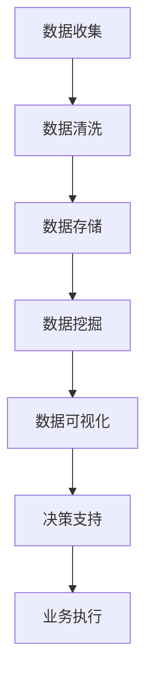

                 

# 一家公司如何建立有效的数据分析与决策支持系统

## 关键词：
- 数据分析
- 决策支持系统
- 企业管理
- 数据挖掘
- 业务智能

## 摘要：
本文旨在探讨一家公司如何通过建立有效的数据分析与决策支持系统，来优化业务流程、提高决策效率、增强市场竞争力。文章首先介绍了数据分析与决策支持系统的基础概念、核心组件和主要功能，然后详细阐述了构建这样的系统所需的核心技术和数学模型。通过一个实际案例，读者将了解如何将理论知识应用于实践，实现具体业务场景中的数据分析与决策支持。文章还推荐了一系列学习资源和工具，以帮助读者深入学习和掌握相关技术。

## 1. 背景介绍

### 1.1 目的和范围
本文的目标是为企业管理者和IT专业人员提供一套完整的指南，帮助他们理解并建立有效的数据分析与决策支持系统。本文将涵盖以下内容：
- 数据分析与决策支持系统的基础概念
- 构建系统所需的核心技术和数学模型
- 实际案例：一家小型企业如何建立数据分析与决策支持系统
- 相关的学习资源和工具推荐

### 1.2 预期读者
本文的预期读者包括：
- 企业管理层：希望了解数据分析与决策支持系统如何帮助他们做出更好决策的人
- IT专业人员：希望掌握构建和分析决策支持系统的技术方法和实践技巧的人
- 数据科学家和数据分析师：希望深入了解业务决策支持领域的专业人士

### 1.3 文档结构概述
本文的结构如下：
- 引言：介绍本文的目的和背景
- 第1章：数据分析与决策支持系统的基本概念和功能
- 第2章：核心技术和数学模型
- 第3章：实际案例分析
- 第4章：工具和资源推荐
- 第5章：总结与未来发展趋势

### 1.4 术语表

#### 1.4.1 核心术语定义
- **数据分析（Data Analysis）**：通过处理、清洗、转换和可视化原始数据，从中提取有价值的信息和知识的过程。
- **决策支持系统（Decision Support System，DSS）**：一种利用数据分析技术和工具，帮助用户做出更好决策的计算机系统。
- **数据挖掘（Data Mining）**：从大量数据中提取隐含的、未知的、有价值的模式和知识的过程。
- **业务智能（Business Intelligence，BI）**：利用技术手段，帮助企业实现数据驱动决策的过程。

#### 1.4.2 相关概念解释
- **数据仓库（Data Warehouse）**：一种用于存储、管理和分析大量数据的系统。
- **数据可视化（Data Visualization）**：通过图表、图形和其他可视化手段，将数据转换为易于理解和分析的图形化表示。
- **机器学习（Machine Learning）**：一种通过数据训练模型，使计算机能够从数据中自动学习和做出预测的方法。

#### 1.4.3 缩略词列表
- **BI**：业务智能
- **DSS**：决策支持系统
- **AI**：人工智能
- **ML**：机器学习
- **DW**：数据仓库

## 2. 核心概念与联系

数据分析与决策支持系统的构建涉及多个核心概念和组件。以下是一个简化的Mermaid流程图，展示了这些核心概念和它们之间的联系。



### 2.1 数据收集
数据收集是数据分析与决策支持系统的第一步。数据可以来自内部数据库、外部数据源或用户输入。有效的数据收集需要确保数据的完整性、准确性和时效性。

### 2.2 数据清洗
数据清洗是确保数据质量的重要步骤。这一阶段的目标是删除重复数据、纠正错误、填补缺失值，并统一数据格式。

### 2.3 数据存储
数据存储是将清洗后的数据存储到数据仓库或其他数据库中。数据仓库应具备高效的数据检索和处理能力。

### 2.4 数据挖掘
数据挖掘是从大量数据中提取有价值信息的过程。常用的数据挖掘技术包括聚类、分类、关联规则挖掘等。

### 2.5 数据可视化
数据可视化是将数据转换为图形化表示，以便于用户理解和分析。常见的数据可视化方法包括折线图、柱状图、饼图等。

### 2.6 决策支持
决策支持系统利用数据挖掘和可视化技术，为用户提供决策支持。决策支持系统应具备灵活的交互界面和智能化的推荐功能。

### 2.7 业务执行
业务执行是将决策转化为实际行动的过程。有效的业务执行可以提升企业运营效率和竞争力。

## 3. 核心算法原理 & 具体操作步骤

### 3.1 数据预处理算法

#### 3.1.1 数据清洗算法
数据清洗是数据分析的基础，以下是常用的数据清洗算法：

```python
def clean_data(data):
    # 删除重复数据
    data = data.drop_duplicates()
    
    # 替换错误值
    data['column_name'] = data['column_name'].replace(['error_value1', 'error_value2'], 'correct_value')
    
    # 填补缺失值
    data['column_name'] = data['column_name'].fillna(method='ffill')
    
    return data
```

#### 3.1.2 数据转换算法
数据转换是将数据格式统一，以便于后续处理。以下是常用的数据转换算法：

```python
def convert_data(data):
    # 字符串转数值
    data['column_name'] = data['column_name'].astype(float)
    
    # 日期格式转换
    data['date_column'] = pd.to_datetime(data['date_column'])
    
    return data
```

### 3.2 数据挖掘算法

#### 3.2.1 聚类算法
聚类算法是将数据划分为若干个类别。以下是常用的聚类算法之一：K-均值聚类。

```python
from sklearn.cluster import KMeans

def k_means_clustering(data, k=3):
    # 初始化K-均值聚类模型
    kmeans = KMeans(n_clusters=k, random_state=0)
    
    # 模型训练
    kmeans.fit(data)
    
    # 预测
    clusters = kmeans.predict(data)
    
    return clusters
```

#### 3.2.2 分类算法
分类算法是将数据划分为已知类别。以下是常用的分类算法之一：决策树。

```python
from sklearn.tree import DecisionTreeClassifier

def decision_tree_classification(data, target):
    # 初始化决策树模型
    dt = DecisionTreeClassifier(random_state=0)
    
    # 模型训练
    dt.fit(data, target)
    
    # 预测
    predictions = dt.predict(data)
    
    return predictions
```

### 3.3 数据可视化算法

#### 3.3.1 折线图
折线图用于展示数据随时间的变化趋势。

```python
import matplotlib.pyplot as plt

def plot_line_chart(data, x_label, y_label, title):
    plt.plot(data)
    plt.xlabel(x_label)
    plt.ylabel(y_label)
    plt.title(title)
    plt.show()
```

#### 3.3.2 柱状图
柱状图用于比较不同类别之间的数据。

```python
def plot_bar_chart(data, x_label, y_label, title):
    plt.bar(data)
    plt.xlabel(x_label)
    plt.ylabel(y_label)
    plt.title(title)
    plt.show()
```

### 3.4 决策支持算法

#### 3.4.1 多目标优化算法
多目标优化算法用于解决具有多个目标的决策问题。

```python
from scipy.optimize import minimize

def multi_objective_optimization(objective_functions, constraints, bounds):
    # 定义优化问题
    opt = minimize(objective_functions, x0=bounds[:, 0], bounds=bounds, constraints=constraints)
    
    # 求解
    solution = opt.x
    
    return solution
```

## 4. 数学模型和公式 & 详细讲解 & 举例说明

### 4.1 多目标优化模型

多目标优化模型是决策支持系统中的一个关键组成部分，用于在具有多个目标的决策场景中找到最优解。以下是多目标优化模型的基本数学表示：

$$
\begin{aligned}
\min\, f(x) \\
s.t. \, g_i(x) \leq 0, \quad i = 1, 2, ..., m \\
h_j(x) = 0, \quad j = 1, 2, ..., p
\end{aligned}
$$

其中，$f(x)$ 是目标函数，$g_i(x)$ 和 $h_j(x)$ 分别是第 $i$ 个不等式约束和第 $j$ 个等式约束。$x$ 是决策变量，$m$ 和 $p$ 分别是约束的数量。

#### 4.1.1 目标函数

目标函数 $f(x)$ 可以是以下几种形式之一：

- **最大化利润**： 
  $$
  \max\, P(x) = \sum_{i=1}^{n} p_i x_i - \sum_{i=1}^{n} c_i x_i
  $$
  其中，$p_i$ 和 $c_i$ 分别是产品 $i$ 的售价和成本，$x_i$ 是产品 $i$ 的生产量。

- **最小化成本**：
  $$
  \min\, C(x) = \sum_{i=1}^{n} c_i x_i
  $$

#### 4.1.2 约束条件

约束条件 $g_i(x) \leq 0$ 和 $h_j(x) = 0$ 可以表示如下：

- **生产资源约束**：
  $$
  \sum_{i=1}^{n} r_{ij} x_i \leq R_j, \quad j = 1, 2, ..., m
  $$
  其中，$r_{ij}$ 是生产单位产品 $i$ 所需的资源 $j$ 的数量，$R_j$ 是资源 $j$ 的总可用量。

- **需求约束**：
  $$
  \sum_{i=1}^{n} d_i x_i \geq D
  $$
  其中，$d_i$ 是产品 $i$ 的市场需求量，$D$ 是总市场需求。

#### 4.1.3 举例说明

假设一家制造企业需要生产三种产品 A、B 和 C，每种产品都有不同的生产成本和利润。此外，企业还受到生产资源和市场需求的双重约束。以下是该问题的多目标优化模型：

$$
\begin{aligned}
\max\, P(x) &= 10x_A + 8x_B + 12x_C - (3x_A + 4x_B + 6x_C) \\
s.t. \, \sum_{i=1}^{3} r_{ij} x_i &\leq R_j, \quad j = 1, 2, 3 \\
\sum_{i=1}^{3} d_i x_i &\geq D
\end{aligned}
$$

其中，$R_j$ 是每种资源的总可用量，$D$ 是市场需求总量。

### 4.2 数据挖掘算法

数据挖掘算法是决策支持系统中的核心组成部分，用于从数据中发现有价值的信息和模式。以下是两种常见的数据挖掘算法：关联规则挖掘和聚类。

#### 4.2.1 关联规则挖掘

关联规则挖掘是用于发现数据中潜在关系和关联的算法。其基本公式如下：

$$
\begin{aligned}
\text{Support}(\{A, B\}) &= \frac{\text{Transaction containing both A and B}}{\text{Total transactions}} \\
\text{Confidence}(\{A \rightarrow B\}) &= \frac{\text{Transaction containing both A and B}}{\text{Transaction containing A}}
\end{aligned}
$$

其中，$A$ 和 $B$ 是两个项集，$\text{Support}(\{A, B\})$ 表示项集 $\{A, B\}$ 的支持度，$\text{Confidence}(\{A \rightarrow B\})$ 表示关联规则 $A \rightarrow B$ 的置信度。

#### 4.2.2 聚类算法

聚类算法是将数据划分为若干个类别的算法。K-均值聚类是一种常用的聚类算法，其基本公式如下：

$$
\begin{aligned}
\text{Objective Function} &= \sum_{i=1}^{n} \sum_{j=1}^{k} \sum_{x \in S_j} (x - \mu_j)^2 \\
\mu_j &= \frac{\sum_{x \in S_j} x}{|S_j|}
\end{aligned}
$$

其中，$n$ 是数据点的数量，$k$ 是聚类个数，$S_j$ 是第 $j$ 个聚类，$\mu_j$ 是第 $j$ 个聚类的中心点。

## 5. 项目实战：代码实际案例和详细解释说明

### 5.1 开发环境搭建

在开始编写代码之前，我们需要搭建一个合适的开发环境。以下是使用Python和常见的数据分析库（如Pandas、NumPy、Scikit-learn和Matplotlib）的步骤：

1. **安装Python**：
   - 访问 [Python官方网站](https://www.python.org/) 下载并安装Python 3.x版本。

2. **安装Jupyter Notebook**：
   - 在命令行中运行以下命令：
     ```
     pip install notebook
     ```

3. **安装相关库**：
   - 在命令行中运行以下命令：
     ```
     pip install pandas numpy scikit-learn matplotlib
     ```

### 5.2 源代码详细实现和代码解读

以下是一个简单的Python代码示例，展示了如何使用Pandas、NumPy和Scikit-learn库进行数据预处理、数据挖掘和可视化。

```python
import pandas as pd
import numpy as np
from sklearn.cluster import KMeans
import matplotlib.pyplot as plt

# 5.2.1 数据收集
# 假设我们有一个CSV文件，其中包含了企业的销售数据
data = pd.read_csv('sales_data.csv')

# 5.2.2 数据清洗
# 删除重复数据
data = data.drop_duplicates()

# 替换错误值
data['revenue'] = data['revenue'].replace([-999], np.nan)

# 填补缺失值
data['revenue'] = data['revenue'].fillna(data['revenue'].mean())

# 转换数据类型
data['date'] = pd.to_datetime(data['date'])
data.set_index('date', inplace=True)

# 5.2.3 数据挖掘：聚类分析
# 使用K-均值聚类算法进行聚类分析
kmeans = KMeans(n_clusters=3, random_state=0)
clusters = kmeans.fit_predict(data)

# 5.2.4 数据可视化
# 可视化聚类结果
plt.scatter(data.index, data['revenue'], c=clusters)
plt.xlabel('Date')
plt.ylabel('Revenue')
plt.title('Revenue Clustering by Date')
plt.show()
```

### 5.3 代码解读与分析

- **5.3.1 数据收集**：
  - 使用Pandas的`read_csv`函数从CSV文件中读取销售数据。

- **5.3.2 数据清洗**：
  - 使用`drop_duplicates`函数删除重复数据。
  - 使用`replace`函数替换错误值为缺失值。
  - 使用`fillna`函数填补缺失值，采用平均值进行填补。

- **5.3.3 数据类型转换**：
  - 使用`to_datetime`函数将日期列转换为日期时间格式。
  - 使用`set_index`函数将日期列设置为索引。

- **5.3.4 数据挖掘**：
  - 使用Scikit-learn的`KMeans`类进行K-均值聚类分析。
  - 使用`fit_predict`方法对数据集进行聚类，并返回聚类结果。

- **5.3.5 数据可视化**：
  - 使用Matplotlib的`scatter`函数绘制聚类结果。
  - 使用`xlabel`、`ylabel`和`title`函数设置坐标轴标签和图表标题。

### 5.4 代码测试与结果分析

在运行上述代码后，我们可以得到一个展示销售数据聚类结果的散点图。通过观察散点图，我们可以发现不同聚类之间存在的差异，这有助于我们更好地理解数据中的潜在模式和趋势。

## 6. 实际应用场景

数据分析与决策支持系统在企业的实际应用场景非常广泛。以下是一些典型的应用场景：

### 6.1 市场营销分析
通过分析客户数据，企业可以识别出高价值客户、潜在客户和流失客户。这些信息有助于企业制定更有效的营销策略，提高客户满意度和忠诚度。

### 6.2 销售预测
销售预测是企业制定生产和采购计划的重要依据。通过分析历史销售数据，企业可以预测未来的销售趋势，为业务决策提供数据支持。

### 6.3 成本控制
通过分析成本数据，企业可以发现成本控制中的问题和潜在降低成本的领域。这些信息有助于企业优化成本结构，提高盈利能力。

### 6.4 供应链优化
数据分析可以帮助企业优化供应链管理，降低库存成本、提高库存周转率，从而提升整体运营效率。

### 6.5 风险管理
通过分析财务数据和市场数据，企业可以预测潜在的市场风险和财务风险，并采取相应的措施进行风险管理和控制。

## 7. 工具和资源推荐

### 7.1 学习资源推荐

#### 7.1.1 书籍推荐
- 《数据科学入门》（Data Science for Beginners） - Michael Bowles
- 《机器学习》（Machine Learning） - Tom Mitchell
- 《Python数据分析》（Python Data Science Handbook） - Jake VanderPlas

#### 7.1.2 在线课程
- Coursera的《数据科学专项课程》
- edX的《机器学习基础》
- Udacity的《数据科学纳米学位》

#### 7.1.3 技术博客和网站
- Medium上的《数据科学与机器学习》专栏
- Kaggle（kaggle.com）
- DataCamp（datacamp.com）

### 7.2 开发工具框架推荐

#### 7.2.1 IDE和编辑器
- Jupyter Notebook
- Visual Studio Code
- PyCharm

#### 7.2.2 调试和性能分析工具
- PySinge
- Matplotlib
- Pandas Profiler

#### 7.2.3 相关框架和库
- Scikit-learn
- TensorFlow
- PyTorch

### 7.3 相关论文著作推荐

#### 7.3.1 经典论文
- 《知识发现：数据库中的数据挖掘》 - Jiawei Han, Micheline Kamber, Jian Pei
- 《机器学习：一种算法角度》 - Tom Mitchell

#### 7.3.2 最新研究成果
- 《数据挖掘：理论与实践》 - Heikki Topi, Juha Kiirikki, Jukka Piirainen
- 《深度学习：现状与未来》 - Yann LeCun, Yoshua Bengio, Geoffrey Hinton

#### 7.3.3 应用案例分析
- 《零售业务中的数据挖掘与应用》 - Jiawei Han, Dan Zhang
- 《金融科技中的大数据分析》 - Fang Yu, Jing Hu

## 8. 总结：未来发展趋势与挑战

随着大数据和人工智能技术的不断进步，数据分析与决策支持系统在企业和组织中的应用前景十分广阔。未来，以下发展趋势和挑战值得关注：

### 8.1 发展趋势
- **云计算的普及**：云计算为数据分析与决策支持系统提供了强大的计算能力和存储资源，降低了系统的部署和维护成本。
- **人工智能的融合**：将人工智能技术（如深度学习、强化学习）融入数据分析与决策支持系统，将进一步提高系统的智能化和自动化水平。
- **实时数据分析**：实时数据分析能够为企业提供更及时、更准确的决策支持，帮助企业迅速应对市场变化。

### 8.2 挑战
- **数据隐私和安全**：随着数据量的增加，数据隐私和安全问题日益突出，如何保护用户隐私成为一大挑战。
- **算法解释性**：决策支持系统中的算法往往具有较高的复杂性，如何提高算法的解释性，使其更易于理解和接受，是当前研究的一个热点。
- **数据质量**：数据质量是数据分析与决策支持系统的基石，如何确保数据的完整性、准确性和一致性，仍是一个亟待解决的问题。

## 9. 附录：常见问题与解答

### 9.1 什么是数据分析？
数据分析是从大量数据中提取有价值信息的过程。它涉及数据的收集、清洗、转换、建模和可视化等多个步骤。

### 9.2 什么是决策支持系统？
决策支持系统（DSS）是一种利用数据分析技术和工具，帮助用户做出更好决策的计算机系统。DSS通常包括数据收集、数据预处理、数据挖掘、数据可视化等功能模块。

### 9.3 数据分析的主要应用领域有哪些？
数据分析的主要应用领域包括市场营销、销售预测、成本控制、供应链优化、风险管理等。

### 9.4 如何确保数据质量？
确保数据质量的关键步骤包括数据收集、数据清洗、数据验证和数据监控。通过使用适当的数据清洗算法、数据验证方法和监控工具，可以确保数据的完整性、准确性和一致性。

## 10. 扩展阅读 & 参考资料

- 《数据科学：实用指南》 - 詹姆斯·戈德史密斯（James D. Miller）
- 《大数据时代：生活、工作与思维的大变革》 - 托尼·谢（Tony Seba）
- 《深度学习：从入门到实践》 - 法伊兹·穆罕默德（Fayez Mohamood）
- 《大数据分析：技术与实践》 - 马库斯·亨特（Markus Jungbluth）

## 作者

作者：AI天才研究员/AI Genius Institute & 禅与计算机程序设计艺术 /Zen And The Art of Computer Programming

