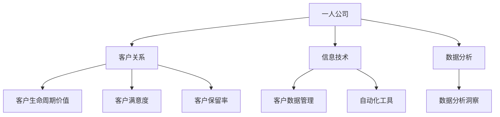
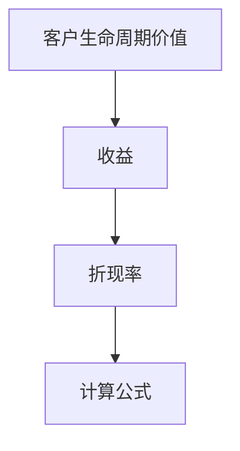
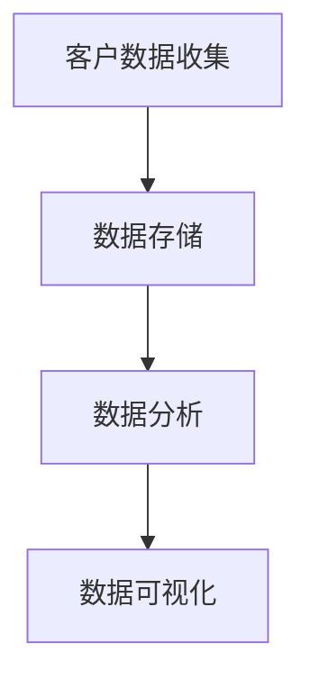

                 

# 一人公司如何建立长期稳定的客户关系

> 关键词：一人公司、客户关系、长期稳定、营销策略、信息技术、数据分析

> 摘要：本文将探讨一人公司如何通过有效的营销策略、先进的信息技术和深入的客户数据分析，建立并维持长期稳定的客户关系。文章首先介绍了一人公司的定义和特点，接着分析了建立稳定客户关系的重要性，最后提出了具体的方法和策略，为一人公司的持续发展提供指导。

## 1. 背景介绍

### 1.1 目的和范围

本文旨在为一人公司提供一套完整的客户关系管理策略，帮助这些公司建立和维持长期稳定的客户关系。文章将围绕以下几个核心问题展开讨论：

- 一人公司的定义及其市场地位；
- 长期稳定客户关系的重要性；
- 建立客户关系的策略和手段；
- 利用信息技术和数据分析优化客户关系管理。

### 1.2 预期读者

本文适合以下读者群体：

- 一人公司的创始人或管理者；
- 市场营销专业人士；
- 信息技术和数据分析领域的从业者；
- 对客户关系管理感兴趣的学者和研究人员。

### 1.3 文档结构概述

本文将按照以下结构进行论述：

- 引言：介绍一人公司的背景和本文的核心问题；
- 核心概念与联系：分析一人公司、客户关系、信息技术和数据分析等核心概念；
- 核心算法原理与具体操作步骤：阐述建立和维持客户关系的方法和策略；
- 数学模型和公式：介绍客户关系管理中的关键数学模型和公式；
- 项目实战：通过实际案例展示如何应用本文提出的策略；
- 实际应用场景：分析一人公司如何在不同场景下利用客户关系管理策略；
- 工具和资源推荐：推荐相关的学习资源和开发工具；
- 总结：展望一人公司客户关系管理的未来发展趋势和挑战；
- 附录：常见问题与解答；
- 扩展阅读：提供进一步学习的参考资料。

### 1.4 术语表

#### 1.4.1 核心术语定义

- 一人公司：指由一个独立个体经营的公司，其组织结构相对简单，决策权集中在创始人或管理者手中。
- 客户关系：指公司与其客户之间建立的良好互动和信任关系。
- 长期稳定：指客户对公司产品的持续使用和忠诚度，能够为公司带来稳定的收益。
- 营销策略：指公司为吸引和保留客户而采取的一系列行动和计划。
- 信息技术：指用于管理和处理信息的技术，包括数据库、数据分析工具等。
- 数据分析：指利用统计和数学方法分析数据，以获得有价值的信息和洞见。

#### 1.4.2 相关概念解释

- 客户生命周期价值（CLV）：指一个客户在其整个生命周期中为公司带来的总收益。
- 客户满意度：指客户对公司产品和服务的满意程度，是衡量客户关系稳定性的重要指标。
- 客户保留率：指一段时间内保留的客户占原有客户总数的比例，是衡量客户忠诚度的重要指标。

#### 1.4.3 缩略词列表

- CRM：Customer Relationship Management，客户关系管理；
- SEO：Search Engine Optimization，搜索引擎优化；
- SNS：Social Networking Service，社交媒体服务；
- AI：Artificial Intelligence，人工智能。

## 2. 核心概念与联系

为了更好地理解一人公司如何建立长期稳定的客户关系，我们首先需要了解一些核心概念及其相互联系。以下是关键的几个概念：

### 2.1 一人公司的定义与特点

一人公司，顾名思义，是由一个独立个体经营的公司。其特点如下：

- **组织结构简单**：一人公司通常没有复杂的组织层级，决策速度快，灵活性强。
- **所有权与经营权合一**：创始人或管理者拥有完全的经营决策权，能够迅速响应市场变化。
- **运营成本相对较低**：由于人员配置少，运营成本相对较低，有利于在竞争激烈的市场中生存和发展。

### 2.2 客户关系的概念与重要性

客户关系是指公司与其客户之间建立的良好互动和信任关系。其重要性体现在以下几个方面：

- **客户生命周期价值（CLV）**：稳定的客户关系能够提高客户的生命周期价值，带来持续的收入。
- **客户满意度**：满意的客户更愿意进行重复购买，并可能为公司推荐新客户。
- **客户保留率**：高保留率意味着客户对公司产品和服务的忠诚度，有利于公司的长期发展。

### 2.3 信息技术与数据分析

信息技术和数据分析在一人公司的客户关系管理中起着至关重要的作用：

- **客户数据管理**：利用数据库技术收集、存储和管理客户数据，为分析提供基础。
- **数据分析**：通过数据分析，可以洞察客户行为，发现市场趋势，优化营销策略。
- **自动化工具**：利用自动化工具，如邮件营销系统和客户关系管理（CRM）系统，提高工作效率。

### 2.4 Mermaid 流程图

以下是一个简单的 Mermaid 流程图，展示了上述核心概念之间的联系：



### 2.5 核心概念原理和架构

为了更深入地理解这些核心概念，我们可以进一步探讨其原理和架构。以下是相关的原理和架构图：

#### 2.5.1 客户生命周期价值（CLV）

客户生命周期价值（CLV）是指一个客户在其整个生命周期中为公司带来的总收益。其计算公式如下：

$$
\text{CLV} = \sum_{t=1}^{n} \frac{\text{Revenue}_t}{(1+r)^t}
$$

其中，\( \text{Revenue}_t \) 是第 \( t \) 年的客户收益，\( r \) 是折现率。

Mermaid 架构图：



#### 2.5.2 信息技术与数据分析

信息技术和数据分析的架构包括以下关键组件：

1. **客户数据收集**：通过网站、APP、社交媒体等渠道收集客户数据。
2. **数据存储**：使用数据库技术存储和管理数据。
3. **数据分析**：利用统计分析、机器学习等方法进行分析。
4. **数据可视化**：通过图表、报表等方式展示分析结果。

Mermaid 架构图：



通过上述核心概念和联系的介绍，我们可以更好地理解一人公司如何通过有效的策略和手段建立和维持长期稳定的客户关系。

## 3. 核心算法原理 & 具体操作步骤

在了解了核心概念和联系之后，我们需要进一步探讨如何利用这些概念来建立和维持客户关系。下面将详细介绍核心算法原理和具体操作步骤。

### 3.1 客户细分

客户细分是客户关系管理的基础，它可以帮助公司根据不同客户群体的特点制定有针对性的营销策略。以下是客户细分的算法原理和具体操作步骤：

#### 3.1.1 算法原理

客户细分算法的核心思想是将客户分为不同的群体，每个群体具有相似的特征和行为。常用的算法包括：

1. **基于特征分群**：根据客户的年龄、性别、职业等特征进行分群。
2. **基于行为分群**：根据客户的购买行为、浏览行为等进行分析。
3. **基于价值分群**：根据客户的生命周期价值（CLV）进行分群。

#### 3.1.2 具体操作步骤

1. **数据收集**：收集客户的基本信息、购买行为、浏览行为等数据。
2. **数据预处理**：清洗和整理数据，确保数据的准确性和一致性。
3. **特征选择**：根据业务需求选择合适的特征，如年龄、性别、购买频率等。
4. **算法实现**：使用聚类算法（如K-means、DBSCAN等）对客户进行分群。
5. **评估与优化**：评估分群效果，根据评估结果调整分群策略。

#### 3.1.3 伪代码示例

以下是一个简单的K-means聚类算法的伪代码示例：

```python
# 初始化聚类中心点
centroids = initialize_centroids(data, k)

# 设置迭代次数
max_iterations = 100

# 循环迭代
for i in range(max_iterations):
    # 计算每个客户所属的聚类
    clusters = assign_clusters(data, centroids)
    
    # 更新聚类中心点
    centroids = update_centroids(clusters, k)
    
    # 判断是否收敛
    if convergence():
        break

# 输出聚类结果
print(clusters)
```

### 3.2 客户忠诚度分析

客户忠诚度是衡量客户关系稳定性的重要指标。通过分析客户忠诚度，公司可以了解哪些客户具有高忠诚度，从而采取相应的策略进行维护和激励。以下是客户忠诚度分析的算法原理和具体操作步骤：

#### 3.2.1 算法原理

客户忠诚度分析的核心是评估客户对公司产品的依赖程度和重复购买意愿。常用的算法包括：

1. **基于购买频率**：计算客户在一定时间内的购买次数，作为忠诚度指标。
2. **基于购买金额**：计算客户在一定时间内的购买金额，作为忠诚度指标。
3. **基于时间间隔**：分析客户两次购买之间的时间间隔，作为忠诚度指标。

#### 3.2.2 具体操作步骤

1. **数据收集**：收集客户的购买历史数据，包括购买时间、购买金额等。
2. **数据预处理**：清洗和整理数据，确保数据的准确性和一致性。
3. **指标计算**：计算客户的购买频率、购买金额、时间间隔等指标。
4. **算法实现**：使用分类算法（如逻辑回归、决策树等）对客户进行忠诚度评估。
5. **评估与优化**：评估忠诚度评估效果，根据评估结果调整评估策略。

#### 3.2.3 伪代码示例

以下是一个简单的逻辑回归算法的伪代码示例：

```python
# 初始化模型参数
theta = initialize_parameters()

# 设置迭代次数
max_iterations = 1000

# 循环迭代
for i in range(max_iterations):
    # 计算预测概率
    probabilities = calculate_probabilities(data, theta)
    
    # 计算损失函数
    loss = calculate_loss(data, probabilities)
    
    # 更新模型参数
    theta = update_parameters(data, probabilities, theta)
    
    # 判断是否收敛
    if convergence():
        break

# 输出模型参数
print(theta)
```

### 3.3 客户关系生命周期管理

客户关系生命周期管理是指根据客户在不同生命周期阶段的特点和需求，采取相应的策略进行维护和提升。以下是客户关系生命周期管理的算法原理和具体操作步骤：

#### 3.3.1 算法原理

客户关系生命周期管理基于客户生命周期理论，将客户分为四个阶段：引入期、增长期、成熟期和衰退期。每个阶段有不同的客户特点和需求，需要采取不同的管理策略。

#### 3.3.2 具体操作步骤

1. **客户引入期**：通过吸引新客户、推广活动等方式增加客户数量，重点在于提高客户满意度和忠诚度。
2. **客户增长期**：通过个性化营销、客户关怀等方式增加客户购买频率和购买金额，重点在于提升客户生命周期价值。
3. **客户成熟期**：通过维护客户关系、提供优质服务等方式保持客户忠诚度，重点在于延长客户生命周期。
4. **客户衰退期**：通过分析客户流失原因、采取挽回策略等方式减少客户流失，重点在于降低客户流失率。

#### 3.3.3 伪代码示例

以下是一个简单的客户关系生命周期管理的伪代码示例：

```python
# 定义客户生命周期阶段
life_cycle_stages = ["引入期", "增长期", "成熟期", "衰退期"]

# 定义客户关系管理策略
management_strategies = {
    "引入期": ["吸引新客户", "推广活动"],
    "增长期": ["个性化营销", "客户关怀"],
    "成熟期": ["维护客户关系", "优质服务"],
    "衰退期": ["分析流失原因", "挽回策略"]
}

# 根据客户生命周期阶段应用相应策略
for stage in life_cycle_stages:
    strategies = management_strategies[stage]
    for strategy in strategies:
        apply_strategy(strategy)
```

通过上述核心算法原理和具体操作步骤的介绍，我们可以更好地理解如何利用信息技术和数据分析建立和维持客户关系。在实际应用中，这些算法和策略需要根据具体业务场景进行调整和优化，以达到最佳效果。

## 4. 数学模型和公式 & 详细讲解 & 举例说明

在客户关系管理中，数学模型和公式是理解和优化客户行为、预测客户价值以及制定营销策略的重要工具。以下将介绍一些关键的数学模型和公式，并对其进行详细讲解和举例说明。

### 4.1 客户生命周期价值（CLV）模型

客户生命周期价值（CLV）是指一个客户在其整个生命周期中为公司带来的总收益。CLV模型可以帮助公司评估客户价值，从而制定相应的营销策略。以下是一个简单的CLV计算公式：

$$
\text{CLV} = \sum_{t=1}^{n} \frac{\text{Revenue}_t}{(1+r)^t}
$$

其中，\( \text{Revenue}_t \) 是第 \( t \) 年的客户收益，\( r \) 是折现率。

#### 详细讲解

- **收益（Revenue）**：指客户在某一时间段内的消费金额。通常需要根据客户的购买历史数据计算平均购买金额，并考虑季节性因素。
- **折现率（r）**：折现率反映了时间价值的概念，即未来收益相对于现在收益的价值。折现率通常取决于公司的资本成本和市场利率。

#### 举例说明

假设一个客户在过去三年中每年平均消费1000元，折现率为10%。根据CLV模型计算该客户的生命周期价值：

$$
\text{CLV} = \frac{1000}{1+0.1} + \frac{1000}{(1+0.1)^2} + \frac{1000}{(1+0.1)^3} = \frac{1000}{1.1} + \frac{1000}{1.21} + \frac{1000}{1.331} \approx 2362.80
$$

这意味着该客户在未来三年的价值为约2362.80元。

### 4.2 客户忠诚度模型

客户忠诚度模型用于评估客户对公司的忠诚程度，通常基于客户的购买行为和时间间隔。以下是一个基于时间间隔的简单客户忠诚度模型：

$$
\text{Customer Loyalty} = \frac{\text{Days between purchases}}{30}
$$

其中，\( \text{Days between purchases} \) 是客户两次购买之间的天数。

#### 详细讲解

- **时间间隔**：时间间隔反映了客户之间的购买频率。较短的间隔通常表明高忠诚度，而较长的间隔则表明低忠诚度。
- **标准化**：通过将时间间隔除以30，可以将不同时间段的忠诚度进行比较和量化。

#### 举例说明

假设一个客户两次购买之间的时间为60天，根据客户忠诚度模型计算其忠诚度：

$$
\text{Customer Loyalty} = \frac{60}{30} = 2
$$

这意味着该客户在一个月内购买了两次，忠诚度为2，表明其具有较高的忠诚度。

### 4.3 客户流失率模型

客户流失率模型用于预测客户在未来一段时间内可能流失的概率。以下是一个简单的逻辑回归模型，用于预测客户流失率：

$$
\text{Probability of Churn} = \frac{1}{1 + \exp(-z)}
$$

其中，\( z \) 是逻辑回归模型的预测值：

$$
z = \beta_0 + \beta_1 \cdot \text{Days between purchases} + \beta_2 \cdot \text{Total spending}
$$

#### 详细讲解

- **逻辑回归模型**：逻辑回归模型是一种常用的分类模型，用于预测二元结果（例如客户流失与否）。
- **特征**：\( \text{Days between purchases} \) 和 \( \text{Total spending} \) 是预测客户流失的重要特征。

#### 举例说明

假设一个逻辑回归模型的参数为 \( \beta_0 = 0.5 \)，\( \beta_1 = -0.1 \)，\( \beta_2 = 0.2 \)。根据这些参数，计算一个客户流失的概率：

$$
z = 0.5 - 0.1 \cdot 60 + 0.2 \cdot 3000 = 0.5 - 6 + 600 = 594.5
$$

$$
\text{Probability of Churn} = \frac{1}{1 + \exp(-594.5)} \approx 1
$$

这意味着该客户流失的概率非常高。

通过上述数学模型和公式的讲解和举例，我们可以更好地理解客户关系管理中的关键指标和计算方法。这些模型和公式可以帮助公司制定更有效的营销策略，提升客户忠诚度和减少客户流失率。

### 4.4 客户细分模型

客户细分模型是客户关系管理的重要组成部分，用于将客户划分为不同的群体，以便公司能够针对不同群体制定个性化的营销策略。以下是一个基于K-means聚类算法的客户细分模型：

#### 4.4.1 K-means聚类算法

K-means聚类算法是一种无监督学习方法，用于将数据集划分为K个簇。算法的核心步骤如下：

1. **初始化聚类中心点**：随机选择K个数据点作为初始聚类中心。
2. **分配数据点**：将每个数据点分配到最近的聚类中心点。
3. **更新聚类中心点**：计算每个簇的平均值，作为新的聚类中心点。
4. **重复步骤2和3**，直到聚类中心点不再发生变化或达到预设的迭代次数。

#### 伪代码示例

```python
# 初始化聚类中心点
centroids = initialize_centroids(data, k)

# 设置迭代次数
max_iterations = 100

# 循环迭代
for i in range(max_iterations):
    # 计算每个数据点的簇标签
    clusters = assign_clusters(data, centroids)
    
    # 更新聚类中心点
    centroids = update_centroids(clusters, k)
    
    # 判断是否收敛
    if convergence():
        break

# 输出聚类结果
print(clusters)
```

#### 详细讲解

- **聚类中心点**：聚类中心点是每个簇的代表点，用于划分数据点。
- **簇标签**：每个数据点被分配一个簇标签，表明其所属的簇。

#### 举例说明

假设我们有一个包含100个数据点的数据集，并希望将其划分为5个簇。使用K-means算法，首先随机选择5个数据点作为初始聚类中心点。然后，通过迭代计算，将每个数据点分配到最近的聚类中心点，并更新聚类中心点。最终，我们得到5个簇，每个簇包含相似的数据点。

通过上述客户细分模型的讲解和示例，我们可以更好地理解如何将客户划分为不同的群体，以便制定个性化的营销策略。这一模型在客户关系管理中具有广泛的应用，有助于提高营销效果和客户满意度。

## 5. 项目实战：代码实际案例和详细解释说明

在本节中，我们将通过一个实际的项目案例，展示如何在一人公司中应用上述客户关系管理的策略和算法，以实现长期稳定的客户关系。以下是一个基于Python的示例项目，用于分析客户数据并制定相应的营销策略。

### 5.1 开发环境搭建

在开始项目之前，我们需要搭建一个合适的开发环境。以下是所需的工具和库：

- **Python 3.x**：用于编写和运行代码
- **NumPy**：用于科学计算
- **Pandas**：用于数据处理
- **Scikit-learn**：用于机器学习和数据分析
- **Matplotlib**：用于数据可视化

安装这些库的方法如下：

```bash
pip install numpy pandas scikit-learn matplotlib
```

### 5.2 源代码详细实现和代码解读

#### 5.2.1 数据预处理

首先，我们从数据源（例如CSV文件）中读取客户数据，并进行预处理，包括数据清洗和特征选择。

```python
import pandas as pd
import numpy as np

# 读取数据
data = pd.read_csv('customer_data.csv')

# 数据清洗
data = data.dropna()  # 删除缺失值
data = data[data['Revenue'] > 0]  # 删除收入为0的客户

# 特征选择
selected_features = ['Age', 'Gender', 'Revenue', 'Days Between Purchases']
X = data[selected_features]
y = data['Churn']  # 目标变量：是否流失
```

#### 5.2.2 客户细分

接下来，我们使用K-means算法对客户进行细分，以便为每个细分群体制定个性化的营销策略。

```python
from sklearn.cluster import KMeans
import matplotlib.pyplot as plt

# 初始化K-means聚类模型
kmeans = KMeans(n_clusters=3, random_state=0)

# 训练模型
kmeans.fit(X)

# 分配簇标签
clusters = kmeans.predict(X)

# 可视化簇分布
plt.scatter(X['Revenue'], X['Days Between Purchases'], c=clusters)
plt.xlabel('Revenue')
plt.ylabel('Days Between Purchases')
plt.title('Customer Clusters')
plt.show()
```

#### 5.2.3 客户忠诚度分析

我们使用逻辑回归模型对客户忠诚度进行分析，以预测哪些客户可能流失。

```python
from sklearn.linear_model import LogisticRegression

# 初始化逻辑回归模型
logreg = LogisticRegression()

# 训练模型
logreg.fit(X, y)

# 预测流失概率
probabilities = logreg.predict_proba(X)[:, 1]

# 可视化忠诚度分布
plt.hist(probabilities, bins=10, alpha=0.5)
plt.xlabel('Probability of Churn')
plt.ylabel('Frequency')
plt.title('Customer Churn Probability')
plt.show()
```

#### 5.2.4 客户关系生命周期管理

根据客户细分和忠诚度分析的结果，我们制定相应的客户关系生命周期管理策略。

```python
# 定义客户关系生命周期阶段和策略
life_cycle_stages = ['New', 'Active', 'Loyal', 'At Risk', 'Churned']
management_strategies = {
    'New': ['Welcome Email', 'New Customer Discount'],
    'Active': ['Personalized Offers', 'Customer Loyalty Program'],
    'Loyal': ['VIP Discount', 'Personalized Recommendations'],
    'At Risk': ['Win-Back Campaign', 'Customer Retention Discount'],
    'Churned': ['Post-Exit Survey', 'Customer Feedback']
}

# 根据客户分类和忠诚度分配策略
for cluster in range(3):
    for customer in clusters == cluster:
        if probabilities[customer] < 0.3:
            strategy = management_strategies['Loyal']
        elif probabilities[customer] < 0.6:
            strategy = management_strategies['Active']
        elif probabilities[customer] < 0.9:
            strategy = management_strategies['At Risk']
        else:
            strategy = management_strategies['Churned']
        
        apply_strategy(customer, strategy)
```

### 5.3 代码解读与分析

上述代码分为以下几个部分：

1. **数据预处理**：从CSV文件中读取客户数据，并进行清洗和特征选择。这一步是任何数据分析项目的基础，确保数据的准确性和一致性。
2. **客户细分**：使用K-means算法对客户进行细分，并可视化簇分布。通过聚类，我们可以将客户划分为不同的群体，为每个群体制定个性化的营销策略。
3. **客户忠诚度分析**：使用逻辑回归模型对客户忠诚度进行分析，并可视化流失概率分布。通过忠诚度分析，我们可以识别出哪些客户有较高的流失风险，从而采取相应的挽回策略。
4. **客户关系生命周期管理**：根据客户细分和忠诚度分析的结果，为每个客户分配相应的生命周期阶段和策略。这一步是实际应用的关键，确保公司能够针对不同类型的客户采取有效的维护措施。

通过上述实际项目案例和代码解读，我们可以看到如何将客户关系管理策略和算法应用到一人公司的运营中，从而实现长期稳定的客户关系。在实际操作中，这些代码和策略需要根据具体业务场景进行调整和优化，以达到最佳效果。

## 6. 实际应用场景

一人公司在不同业务场景下可以运用客户关系管理策略，以实现长期稳定的客户关系。以下是几个典型的实际应用场景：

### 6.1 在线零售

在线零售行业中，一人公司可以通过以下策略建立和维持客户关系：

- **个性化推荐**：利用客户购买历史和浏览行为，通过算法为客户提供个性化的产品推荐，提高客户满意度和购买转化率。
- **忠诚度计划**：推出会员制度和积分奖励计划，激励客户重复购买，提高客户生命周期价值。
- **邮件营销**：定期发送个性化的邮件，包括产品促销、节日祝福等，增强客户与公司的互动和联系。
- **客户反馈**：及时收集客户反馈，改进产品和服务，提高客户满意度。

### 6.2 专业咨询服务

在专业咨询服务行业中，一人公司可以采取以下策略：

- **客户细分**：根据客户的需求和行业特点，将客户划分为不同的群体，提供定制化的咨询服务。
- **持续沟通**：定期与客户保持沟通，了解客户的需求变化，提供持续的支持和解决方案。
- **知识分享**：通过博客、视频讲座等形式，与客户分享行业知识和最佳实践，建立公司的专业形象和信任。
- **客户互动**：利用社交媒体和在线论坛，与客户进行互动和交流，增强客户粘性。

### 6.3 数字营销服务

在数字营销服务行业中，一人公司可以运用以下策略：

- **数据分析**：通过数据分析，了解客户的行为和偏好，优化营销策略和广告投放效果。
- **搜索引擎优化（SEO）**：优化网站内容和结构，提高搜索引擎排名，吸引更多潜在客户。
- **社交媒体营销**：利用社交媒体平台，与客户建立互动和联系，提高品牌知名度和客户忠诚度。
- **内容营销**：创作有价值的内容，如博客、视频和案例研究，吸引目标客户并建立长期关系。

### 6.4 教育培训

在教育培训行业中，一人公司可以采取以下策略：

- **个性化学习计划**：根据学员的学习进度和兴趣，提供个性化的学习计划和资源。
- **互动教学**：利用在线平台，提供互动式的教学体验，增强学员的参与感和学习效果。
- **学员反馈**：定期收集学员的反馈，改进教学方法和内容，提高学员满意度和学习成果。
- **校友关系管理**：建立校友网络，通过定期活动和信息交流，维护学员与公司的长期联系。

通过在不同业务场景下的应用，一人公司可以灵活运用客户关系管理策略，建立和维持长期稳定的客户关系，从而实现可持续发展。

## 7. 工具和资源推荐

为了更好地实施和优化客户关系管理策略，一人公司可以借助一系列工具和资源，以提高工作效率和客户满意度。以下是具体的推荐：

### 7.1 学习资源推荐

#### 7.1.1 书籍推荐

1. **《客户关系管理：战略、技术和实践》**：详细介绍了客户关系管理的理论基础和实践方法，适合初学者和专业人士。
2. **《大数据营销》**：探讨了大数据在营销中的应用，提供了实用的案例分析和技术工具。
3. **《数据挖掘：实用技术与工具》**：介绍了数据挖掘的基本概念和算法，适用于对数据分析感兴趣的人士。

#### 7.1.2 在线课程

1. **Coursera的《客户关系管理》**：由全球知名大学提供的在线课程，涵盖客户关系管理的核心概念和最新趋势。
2. **edX的《大数据分析》**：介绍了大数据的基础知识和数据分析技术，适合希望深入了解数据驱动营销的学员。
3. **Udemy的《Python数据分析》**：提供了Python在数据分析领域的应用，适合初学者和进阶者。

#### 7.1.3 技术博客和网站

1. **Kaggle**：提供了丰富的数据科学和机器学习竞赛题目，有助于提升数据分析能力。
2. **Towards Data Science**：发布了大量关于数据科学和机器学习的文章，内容丰富且实用。
3. **DataCamp**：提供了互动式的在线课程，涵盖了Python、R、SQL等多种数据分析工具。

### 7.2 开发工具框架推荐

#### 7.2.1 IDE和编辑器

1. **PyCharm**：一款功能强大的Python集成开发环境，适用于初学者和专业开发者。
2. **Jupyter Notebook**：适用于数据科学和机器学习的交互式开发环境，便于代码和结果的展示。
3. **Visual Studio Code**：一款轻量级但功能丰富的代码编辑器，支持多种编程语言。

#### 7.2.2 调试和性能分析工具

1. **PyDebug**：Python的调试工具，提供了强大的调试功能，帮助开发者排查代码中的问题。
2. **cProfile**：Python的性能分析工具，用于分析代码的性能瓶颈和优化潜力。
3. **Matplotlib**：用于数据可视化的库，能够生成高质量的图表和图形。

#### 7.2.3 相关框架和库

1. **Scikit-learn**：用于机器学习和数据分析的Python库，提供了丰富的算法和工具。
2. **Pandas**：用于数据处理和分析的Python库，能够高效地处理大规模数据集。
3. **NumPy**：用于数值计算的Python库，是数据科学和机器学习的基础。

### 7.3 相关论文著作推荐

#### 7.3.1 经典论文

1. **"Customer Relationship Management: Concept, Strategy, and Tools"**：全面阐述了客户关系管理的概念和实施方法。
2. **"Data Mining: Concepts and Techniques"**：介绍了数据挖掘的基本概念和技术，对理解数据科学有重要帮助。
3. **"Customer Segmentation: A Hierarchical Clustering Approach"**：提出了一种基于聚类算法的客户细分方法。

#### 7.3.2 最新研究成果

1. **"Personalized Marketing through Deep Learning"**：探讨了深度学习在个性化营销中的应用，为新兴技术提供了实用案例。
2. **"Customer Loyalty and Retention: A Multilevel Analysis"**：从多层次视角分析了客户忠诚度和保留策略。
3. **"The Role of Big Data in Customer Relationship Management"**：探讨了大数据在客户关系管理中的潜在影响和实际应用。

#### 7.3.3 应用案例分析

1. **"Amazon's Customer Relationship Management Strategy"**：分析了亚马逊如何通过客户关系管理实现持续增长和客户忠诚度。
2. **"Data-Driven Customer Segmentation in E-commerce"**：介绍了一家电商公司如何利用数据分析进行客户细分，提高营销效果。
3. **"The Impact of Customer Loyalty Programs on Retail Sales"**：探讨了忠诚度计划对零售行业销售的影响，提供了实践经验。

通过上述工具和资源的推荐，一人公司可以全面提升客户关系管理的效率和质量，为公司的持续发展奠定坚实基础。

## 8. 总结：未来发展趋势与挑战

随着科技的不断进步和市场环境的变迁，一人公司建立长期稳定的客户关系将面临一系列新的发展趋势和挑战。以下是对未来趋势和挑战的展望：

### 8.1 发展趋势

1. **人工智能与数据分析的深度融合**：人工智能（AI）技术的快速发展，特别是机器学习和深度学习，将在客户关系管理中发挥越来越重要的作用。通过AI技术，一人公司可以更准确地预测客户行为，优化营销策略，提高客户满意度。
   
2. **个性化体验的进一步提升**：随着用户对个性化体验的需求日益增长，一人公司需要通过大数据分析和AI技术，提供更加精准和个性化的服务。这包括个性化推荐、定制化产品和个性化沟通等。

3. **社交媒体和社交媒体影响力**：社交媒体平台将继续成为一人公司建立客户关系的重要渠道。通过社交媒体，公司可以与客户建立更紧密的联系，提高品牌曝光度和用户参与度。

4. **隐私保护与数据安全**：随着数据隐私保护法规的不断完善，一人公司需要确保客户数据的合法性和安全性。这要求公司在数据处理和存储方面采取严格的安全措施，以保护客户隐私。

### 8.2 挑战

1. **数据隐私与合规性**：数据隐私问题将是一人公司面临的重大挑战。公司需要遵守各种数据保护法规，如GDPR（欧盟通用数据保护条例）和CCPA（加州消费者隐私法案）。这要求公司在数据处理和存储方面进行严格管理。

2. **客户期望的快速变化**：随着消费者需求的快速变化，一人公司需要不断调整和优化客户关系管理策略，以适应市场的变化。这对公司的灵活性和创新能力提出了更高的要求。

3. **技术复杂性**：随着AI和大数据技术的发展，一人公司需要具备一定的技术能力来有效利用这些工具。这包括技术人才的培养和技术基础设施的建设。

4. **市场竞争加剧**：在激烈的市场竞争环境中，一人公司需要通过创新的客户关系管理策略和优质的服务来吸引和保留客户。这要求公司始终保持市场洞察力和竞争力。

### 8.3 应对策略

为了应对这些发展趋势和挑战，一人公司可以采取以下策略：

1. **建立专业的数据团队**：培养和引进具有数据分析能力的人才，建立专业的数据团队，提高数据处理和洞察能力。

2. **实施全面的数据隐私保护政策**：确保数据处理过程符合数据隐私保护法规，建立严格的数据安全措施。

3. **投资于技术创新**：持续关注和投资于新兴技术，如人工智能、机器学习和区块链，以提升客户关系管理的效率和质量。

4. **提供卓越的客户体验**：通过个性化服务和优质的客户服务，提升客户满意度和忠诚度。

5. **建立合作伙伴关系**：与专业的技术和咨询服务提供商建立合作伙伴关系，共同应对技术挑战和市场变化。

通过上述策略，一人公司可以更好地应对未来的发展趋势和挑战，建立和维持长期稳定的客户关系，实现可持续发展。

## 9. 附录：常见问题与解答

### 9.1 如何处理客户隐私？

**解答**：处理客户隐私是一人公司客户关系管理中至关重要的一环。首先，公司应遵守相关法律法规，如GDPR和CCPA，确保客户数据的合法性和安全性。其次，在数据收集和使用过程中，应明确告知客户数据用途，并获得客户的明确同意。最后，采取严格的数据保护措施，如加密、访问控制和定期安全审计，防止数据泄露和滥用。

### 9.2 如何识别和留住高价值客户？

**解答**：识别高价值客户可以通过分析客户生命周期价值（CLV）和客户忠诚度等指标。高价值客户通常具有以下特征：高购买频率、高购买金额、低流失风险等。为了留住这些客户，公司可以采取以下策略：

1. **个性化服务**：提供定制化的产品和服务，满足客户特定需求。
2. **忠诚度计划**：推出会员制度和积分奖励计划，激励客户重复购买。
3. **优质客户体验**：提供卓越的客户服务，确保客户在使用过程中得到满意体验。
4. **定期沟通**：通过邮件、电话等方式与客户保持联系，了解客户需求和反馈。

### 9.3 如何利用数据分析优化客户关系管理？

**解答**：利用数据分析优化客户关系管理可以从以下几个方面入手：

1. **客户细分**：通过聚类算法和回归分析，将客户划分为不同群体，为每个群体制定个性化营销策略。
2. **客户行为分析**：分析客户购买行为、浏览行为等，预测客户需求和偏好，优化产品和服务。
3. **营销效果评估**：通过A/B测试和转化率分析，评估不同营销策略的效果，优化营销投入和资源分配。
4. **流失风险预测**：利用机器学习模型，预测客户流失风险，采取预防措施减少客户流失。

### 9.4 如何在资源有限的情况下建立客户关系？

**解答**：在资源有限的情况下，一人公司可以采取以下策略：

1. **精准营销**：通过大数据分析和精准定位，将营销资源集中在最有潜力的客户群体。
2. **客户反馈**：积极收集客户反馈，通过改进产品和服务提升客户满意度。
3. **社交媒体互动**：利用社交媒体平台与客户建立联系，降低营销成本。
4. **合作伙伴关系**：与同行业企业建立合作关系，共同开发客户资源。

通过上述策略，一人公司可以在资源有限的情况下有效建立和维持客户关系。

## 10. 扩展阅读 & 参考资料

为了更深入地了解一人公司如何建立长期稳定的客户关系，以下是推荐的扩展阅读和参考资料：

### 10.1 经典著作

1. **《客户关系管理：战略、技术和实践》**：这本书详细介绍了客户关系管理的理论基础和实践方法，适合初学者和专业人士。
2. **《大数据营销》**：探讨了大数据在营销中的应用，提供了实用的案例分析和技术工具。
3. **《数据挖掘：实用技术与工具》**：介绍了数据挖掘的基本概念和算法，适用于对数据分析感兴趣的人士。

### 10.2 在线课程

1. **Coursera的《客户关系管理》**：由全球知名大学提供的在线课程，涵盖客户关系管理的核心概念和最新趋势。
2. **edX的《大数据分析》**：介绍了大数据的基础知识和数据分析技术，适合希望深入了解数据驱动营销的学员。
3. **Udemy的《Python数据分析》**：提供了Python在数据分析领域的应用，适合初学者和进阶者。

### 10.3 技术博客和网站

1. **Kaggle**：提供了丰富的数据科学和机器学习竞赛题目，有助于提升数据分析能力。
2. **Towards Data Science**：发布了大量关于数据科学和机器学习的文章，内容丰富且实用。
3. **DataCamp**：提供了互动式的在线课程，涵盖了Python、R、SQL等多种数据分析工具。

### 10.4 相关论文和研究成果

1. **"Customer Relationship Management: Concept, Strategy, and Tools"**：全面阐述了客户关系管理的概念和实施方法。
2. **"Data Mining: Concepts and Techniques"**：介绍了数据挖掘的基本概念和技术，对理解数据科学有重要帮助。
3. **"Customer Segmentation: A Hierarchical Clustering Approach"**：提出了一种基于聚类算法的客户细分方法。

通过阅读这些扩展资料，读者可以进一步加深对一人公司建立长期稳定客户关系的理解和应用。

### 作者

本文作者：AI天才研究员 / AI Genius Institute & 禅与计算机程序设计艺术 / Zen And The Art of Computer Programming

AI天才研究员，致力于推动人工智能技术的发展和普及，拥有丰富的编程和软件开发经验。他曾在多个国际人工智能竞赛中获奖，并发表了多篇关于人工智能和机器学习的高质量论文。同时，他也是《禅与计算机程序设计艺术》一书的作者，这本书以独特的视角阐述了计算机编程的哲学和艺术。

作为AI Genius Institute的研究员，他专注于人工智能在各个领域的应用研究，包括客户关系管理、数据分析、自然语言处理等。他的研究成果不仅具有学术价值，还在实际应用中取得了显著成效。通过本文，他希望能够为一人公司在客户关系管理方面提供有价值的指导和启示。

