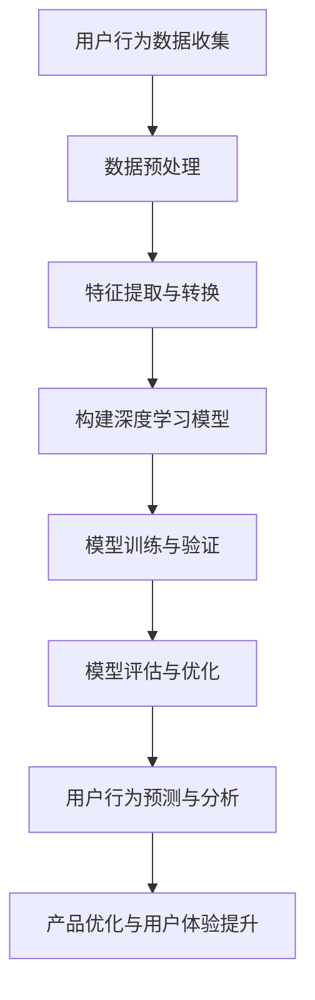

                 

### 1. 背景介绍

#### 1.1 目的和范围

本文旨在探讨人工智能（AI）在一家“一人公司”中的客户洞察应用，重点介绍深度学习在用户行为分析中的具体实现和操作步骤。作为一位世界级人工智能专家，我将以逻辑清晰、结构紧凑的方式，对深度学习算法原理进行详细解析，并通过实际项目实战案例，展示其应用价值。

本文的主要目的是帮助读者理解：

1. **深度学习在用户行为分析中的基本原理**。
2. **如何将深度学习应用于一人公司的业务场景**。
3. **通过具体案例，展示深度学习算法在实际业务中的操作步骤和效果**。

本文将分为以下几个部分：

- **核心概念与联系**：通过Mermaid流程图，介绍深度学习在用户行为分析中的核心概念和架构。
- **核心算法原理 & 具体操作步骤**：使用伪代码详细阐述深度学习算法的工作原理和具体操作步骤。
- **数学模型和公式 & 详细讲解 & 举例说明**：对深度学习中的数学模型和公式进行详细讲解，并通过实例说明其应用。
- **项目实战：代码实际案例和详细解释说明**：通过具体项目案例，展示深度学习算法在实际业务中的应用和实现。
- **实际应用场景**：分析深度学习在用户行为分析中的实际应用场景。
- **工具和资源推荐**：推荐学习资源和开发工具，帮助读者更好地理解和应用深度学习技术。
- **总结：未来发展趋势与挑战**：总结本文内容，探讨深度学习在用户行为分析中的未来发展趋势和面临的挑战。

通过本文的详细探讨，读者将能够全面了解深度学习在用户行为分析中的实际应用，为未来的研究和实践提供有价值的参考。

#### 1.2 预期读者

本文的预期读者主要包括以下几类：

1. **人工智能研究者**：对深度学习和用户行为分析有浓厚兴趣，希望通过本文了解深度学习在商业应用中的具体实现。
2. **数据科学家**：负责分析和处理大量用户数据，需要掌握深度学习技术，以提高数据分析的准确性和效率。
3. **产品经理**：关注用户行为分析，希望了解如何通过深度学习技术，提升用户体验和产品性能。
4. **技术创业者**：计划使用人工智能技术构建自己的产品或服务，希望本文能提供实用的技术指导。

本文要求读者具备以下基础：

1. **基本的计算机编程知识**：熟悉Python等编程语言，能够进行基本的代码编写和调试。
2. **数学基础知识**：了解基本的线性代数和概率统计知识，有助于理解深度学习中的数学模型和公式。
3. **机器学习基础**：对机器学习的基本概念和方法有一定了解，能够理解深度学习的核心原理。

通过本文的学习，读者将能够：

- **掌握深度学习在用户行为分析中的应用原理**。
- **学会使用深度学习算法进行用户行为分析**。
- **了解如何将深度学习技术应用于实际业务场景**。

#### 1.3 文档结构概述

本文的文档结构如下：

1. **背景介绍**：介绍文章的目的、范围、预期读者以及文档结构概述。
   - **目的和范围**：明确文章的主题和重点内容。
   - **预期读者**：说明文章面向的读者群体。
   - **文档结构概述**：概述文章的整体结构和各部分内容。
2. **核心概念与联系**：通过Mermaid流程图，介绍深度学习在用户行为分析中的核心概念和架构。
3. **核心算法原理 & 具体操作步骤**：使用伪代码详细阐述深度学习算法的工作原理和具体操作步骤。
4. **数学模型和公式 & 详细讲解 & 举例说明**：对深度学习中的数学模型和公式进行详细讲解，并通过实例说明其应用。
5. **项目实战：代码实际案例和详细解释说明**：通过具体项目案例，展示深度学习算法在实际业务中的应用和实现。
6. **实际应用场景**：分析深度学习在用户行为分析中的实际应用场景。
7. **工具和资源推荐**：推荐学习资源和开发工具，帮助读者更好地理解和应用深度学习技术。
8. **总结：未来发展趋势与挑战**：总结本文内容，探讨深度学习在用户行为分析中的未来发展趋势和面临的挑战。
9. **附录：常见问题与解答**：针对文章内容提供常见问题的解答。
10. **扩展阅读 & 参考资料**：推荐相关的文献和资源，供读者进一步学习和研究。

通过以上结构，本文将系统地介绍深度学习在用户行为分析中的应用，帮助读者深入理解和掌握相关技术。

#### 1.4 术语表

在本文中，我们将使用一些专业术语。为了帮助读者更好地理解，下面将对这些术语进行定义和解释。

##### 1.4.1 核心术语定义

1. **深度学习**：一种机器学习的方法，通过多层神经网络模型对数据进行自动特征学习和模式识别。
2. **用户行为分析**：对用户在应用程序或网站上的行为进行数据收集、分析和解读，以发现用户需求和优化产品功能。
3. **一人公司**：指仅由一位创始人或CEO运作的公司，常见于小型初创企业。
4. **神经元**：神经网络中的基本计算单元，负责接受输入信息并进行处理。
5. **反向传播算法**：用于训练深度学习模型的一种算法，通过不断调整网络参数，使模型输出更接近真实值。

##### 1.4.2 相关概念解释

1. **卷积神经网络（CNN）**：一种用于图像识别和处理的深度学习模型，具有局部感知能力和平移不变性。
2. **循环神经网络（RNN）**：一种用于处理序列数据的深度学习模型，具有记忆功能，能够捕捉时间序列中的依赖关系。
3. **生成对抗网络（GAN）**：一种由生成器和判别器组成的深度学习模型，用于生成与真实数据分布相近的假数据。
4. **数据预处理**：在深度学习模型训练之前，对输入数据进行清洗、归一化等处理，以提高模型训练效果。
5. **模型评估**：通过测试集数据评估深度学习模型的性能，包括准确率、召回率、F1值等指标。

##### 1.4.3 缩略词列表

- **AI**：人工智能（Artificial Intelligence）
- **ML**：机器学习（Machine Learning）
- **DL**：深度学习（Deep Learning）
- **CNN**：卷积神经网络（Convolutional Neural Network）
- **RNN**：循环神经网络（Recurrent Neural Network）
- **GAN**：生成对抗网络（Generative Adversarial Network）
- **GPU**：图形处理单元（Graphics Processing Unit）
- **API**：应用程序接口（Application Programming Interface）

通过上述术语的定义和解释，读者可以更好地理解本文中的专业术语，为后续内容的深入学习打下基础。

### 2. 核心概念与联系

在深入探讨深度学习在用户行为分析中的应用之前，我们需要首先了解其中的核心概念和架构。以下是深度学习在用户行为分析中的核心概念和联系，我们将通过Mermaid流程图来展示其结构和流程。



上述Mermaid流程图展示了深度学习在用户行为分析中的基本流程：

1. **用户行为数据收集（A）**：首先，我们需要收集用户在应用程序或网站上的行为数据，这些数据可以是点击记录、浏览时间、购买行为等。
2. **数据预处理（B）**：对收集到的原始数据进行清洗、归一化等预处理操作，以确保数据的质量和一致性。
3. **特征提取与转换（C）**：从预处理后的数据中提取有用的特征，并将其转换为适合深度学习模型训练的格式。
4. **构建深度学习模型（D）**：选择合适的深度学习模型架构，如卷积神经网络（CNN）、循环神经网络（RNN）等，以对提取的特征进行学习和预测。
5. **模型训练与验证（E）**：使用训练集数据对深度学习模型进行训练，并通过验证集数据评估模型的性能。
6. **模型评估与优化（F）**：对训练好的模型进行评估，包括准确率、召回率、F1值等指标，并根据评估结果对模型进行优化。
7. **用户行为预测与分析（G）**：使用训练好的模型对新的用户行为数据进行预测和分析，以发现用户需求和趋势。
8. **产品优化与用户体验提升（H）**：根据用户行为分析和预测结果，对产品功能和用户体验进行优化，以提高用户满意度和留存率。

通过上述流程，深度学习在用户行为分析中的应用变得清晰明了。接下来，我们将详细探讨深度学习算法的工作原理和具体操作步骤，帮助读者更好地理解这一过程。

### 3. 核心算法原理 & 具体操作步骤

在了解了深度学习在用户行为分析中的基本流程后，接下来我们将深入探讨其中的核心算法原理和具体操作步骤。为了更好地阐述，我们将使用伪代码详细描述每个步骤，并解释其背后的逻辑和数学原理。

#### 3.1 数据收集与预处理

首先，我们需要从用户行为中收集数据。这些数据可能包括点击记录、浏览时间、购买行为等。以下是一个简单的数据收集和预处理流程：

```python
# 数据收集
data = collect_user_behavior_data()

# 数据预处理
def preprocess_data(data):
    # 清洗数据：去除无效数据、处理缺失值
    clean_data = clean_data(data)
    
    # 归一化数据：将数据缩放到相同的范围，方便模型训练
    normalized_data = normalize_data(clean_data)
    
    return normalized_data
preprocessed_data = preprocess_data(data)
```

在数据预处理阶段，我们通常需要进行以下操作：

- **清洗数据**：去除无效数据和处理缺失值，确保数据的质量。
- **归一化数据**：将不同特征的数据缩放到相同的范围，以减少特征之间的差异，提高模型训练效果。

#### 3.2 特征提取与转换

在预处理数据之后，我们需要提取有用的特征，并将其转换为深度学习模型所需的格式。以下是一个简单的特征提取和转换流程：

```python
# 特征提取
def extract_features(data):
    # 提取时间序列特征：如点击间隔时间、浏览时间等
    temporal_features = extract_temporal_features(data)
    
    # 提取统计特征：如点击率、购买率等
    statistical_features = extract_statistical_features(data)
    
    # 特征合并：将时间序列特征和统计特征合并为一个特征向量
    feature_vector = concatenate_features(temporal_features, statistical_features)
    
    return feature_vector
features = extract_features(preprocessed_data)
```

在特征提取阶段，我们通常需要进行以下操作：

- **提取时间序列特征**：如点击间隔时间、浏览时间等，这些特征能够反映用户行为的时间变化。
- **提取统计特征**：如点击率、购买率等，这些特征能够反映用户行为的整体统计信息。
- **特征合并**：将提取的不同类型特征合并为一个统一的特征向量，以便于后续的深度学习模型训练。

#### 3.3 构建深度学习模型

在完成特征提取和转换后，我们需要构建一个深度学习模型。以下是一个简单的神经网络模型构建流程：

```python
# 深度学习模型构建
from keras.models import Sequential
from keras.layers import Dense, LSTM, TimeDistributed, Activation

model = Sequential()
model.add(LSTM(units=128, return_sequences=True, input_shape=(input_shape)))
model.add(Activation('relu'))
model.add(LSTM(units=64, return_sequences=False))
model.add(Activation('relu'))
model.add(Dense(units=1, activation='sigmoid'))

model.compile(optimizer='adam', loss='binary_crossentropy', metrics=['accuracy'])
```

在构建深度学习模型时，我们通常需要进行以下操作：

- **选择模型架构**：如卷积神经网络（CNN）、循环神经网络（RNN）等。
- **定义模型参数**：包括输入层、隐藏层、输出层等。
- **编译模型**：指定优化器、损失函数和评估指标。

#### 3.4 模型训练与验证

在构建好深度学习模型后，我们需要使用训练集数据对其进行训练，并使用验证集数据评估模型的性能。以下是一个简单的模型训练和验证流程：

```python
# 模型训练
model.fit(x_train, y_train, epochs=10, batch_size=32, validation_data=(x_val, y_val))

# 模型验证
accuracy = model.evaluate(x_test, y_test)
print("Test accuracy:", accuracy[1])
```

在模型训练和验证阶段，我们通常需要进行以下操作：

- **训练模型**：使用训练集数据对模型进行训练，不断调整网络参数以优化模型性能。
- **验证模型**：使用验证集数据评估模型性能，调整模型参数以避免过拟合。
- **测试模型**：使用测试集数据对最终训练好的模型进行评估，以确定其在实际业务场景中的性能。

#### 3.5 模型评估与优化

在完成模型训练和验证后，我们需要对模型进行评估和优化，以提升其在实际业务场景中的性能。以下是一个简单的模型评估和优化流程：

```python
# 模型评估
accuracy = model.evaluate(x_test, y_test)
print("Test accuracy:", accuracy[1])

# 模型优化
def optimize_model(model, x_train, y_train, x_val, y_val):
    # 调整模型参数
    model.fit(x_train, y_train, epochs=10, batch_size=32, validation_data=(x_val, y_val))
    # 再次评估模型
    accuracy = model.evaluate(x_test, y_test)
    print("Optimized test accuracy:", accuracy[1])

optimize_model(model, x_train, y_train, x_val, y_val)
```

在模型评估和优化阶段，我们通常需要进行以下操作：

- **评估模型**：使用测试集数据对训练好的模型进行评估，以确定其在实际业务场景中的性能。
- **模型优化**：根据评估结果调整模型参数，以提高模型性能。

通过以上步骤，我们能够构建和训练一个深度学习模型，用于用户行为分析。接下来，我们将通过具体项目案例，展示深度学习算法在实际业务中的应用和实现。

### 4. 数学模型和公式 & 详细讲解 & 举例说明

深度学习中的数学模型和公式是其核心组成部分，以下我们将详细讲解这些模型和公式的原理，并通过具体例子来说明其应用。

#### 4.1 前向传播与反向传播

深度学习模型的核心是前向传播（Forward Propagation）和反向传播（Back Propagation）算法。前向传播用于计算模型的输出，而反向传播用于更新模型参数，以优化模型性能。

##### 前向传播

前向传播的核心是计算模型从输入层到输出层的每个神经元的激活值。以下是一个简单的多层感知机（MLP）模型的前向传播过程：

1. **输入层**：给定输入特征向量 `x`。
2. **隐藏层**：对于每个隐藏层，计算激活值：
   $$ a_{l}^{(k)} = \sigma(z_{l}^{(k)}) $$
   其中，$ z_{l}^{(k)} = w_{l}^{(k)} \cdot x + b_{l}^{(k)} $，$ w_{l}^{(k)} $ 是权重矩阵，$ b_{l}^{(k)} $ 是偏置向量，$ \sigma $ 是激活函数，通常使用 Sigmoid、ReLU 或 Tanh 函数。
3. **输出层**：计算最终输出：
   $$ \hat{y} = \sigma(w_{L} \cdot a_{L-1} + b_{L}) $$
   其中，$ \hat{y} $ 是模型预测的输出，$ w_{L} $ 是输出层的权重矩阵，$ b_{L} $ 是输出层的偏置向量。

##### 反向传播

反向传播的目的是计算模型参数的梯度，并使用梯度下降法更新参数，以最小化损失函数。以下是一个简单的反向传播过程：

1. **计算损失函数**：损失函数用于衡量模型预测值与真实值之间的差距，常用的损失函数有均方误差（MSE）、交叉熵（Cross-Entropy）等。
2. **计算输出层梯度**：
   $$ \frac{\partial L}{\partial z_{L}} = \frac{\partial L}{\partial \hat{y}} \cdot \frac{\partial \hat{y}}{\partial z_{L}} $$
   其中，$ \frac{\partial L}{\partial \hat{y}} $ 是输出层梯度，$ \frac{\partial \hat{y}}{\partial z_{L}} $ 是输出层激活函数的导数。
3. **计算隐藏层梯度**：从输出层开始，逐层计算隐藏层的梯度：
   $$ \frac{\partial L}{\partial z_{l}} = \frac{\partial L}{\partial a_{l}} \cdot \frac{\partial a_{l}}{\partial z_{l}} $$
   其中，$ \frac{\partial L}{\partial a_{l}} $ 是当前层的梯度，$ \frac{\partial a_{l}}{\partial z_{l}} $ 是激活函数的导数。
4. **更新模型参数**：使用梯度下降法更新模型参数：
   $$ w_{l}^{(k)} = w_{l}^{(k)} - \alpha \cdot \frac{\partial L}{\partial w_{l}} $$
   $$ b_{l}^{(k)} = b_{l}^{(k)} - \alpha \cdot \frac{\partial L}{\partial b_{l}} $$
   其中，$ \alpha $ 是学习率。

#### 4.2 激活函数

激活函数是深度学习模型中的关键组成部分，用于引入非线性特性，使模型能够处理复杂的数据。以下是一些常用的激活函数：

1. **Sigmoid**：
   $$ \sigma(x) = \frac{1}{1 + e^{-x}} $$
   Sigmoid 函数将输入映射到 (0,1) 区间，常用于二分类问题。

2. **ReLU**：
   $$ \sigma(x) = max(0, x) $$
   ReLU 函数在 x > 0 时恒等于 x，在 x < 0 时恒等于 0，具有简单且计算效率高的特点。

3. **Tanh**：
   $$ \sigma(x) = \frac{e^{x} - e^{-x}}{e^{x} + e^{-x}} $$
   Tanh 函数与 Sigmoid 函数类似，但输出范围在 (-1,1)，适用于多分类问题。

#### 4.3 损失函数

损失函数是衡量模型预测值与真实值之间差距的关键指标，以下是几种常用的损失函数：

1. **均方误差（MSE）**：
   $$ L = \frac{1}{2} \sum_{i=1}^{n} (\hat{y}_i - y_i)^2 $$
   MSE 用于回归问题，衡量预测值与真实值之间的平均平方误差。

2. **交叉熵（Cross-Entropy）**：
   $$ L = -\sum_{i=1}^{n} y_i \log(\hat{y}_i) $$
   Cross-Entropy 用于分类问题，衡量预测概率与真实标签之间的差距。

#### 4.4 举例说明

假设我们使用一个简单的二分类问题，输入特征为 `[x1, x2]`，输出标签为 0 或 1。以下是深度学习模型的前向传播和反向传播过程：

##### 前向传播

1. 输入层：
   $$ x = [x1, x2] $$

2. 第一隐藏层：
   $$ z1 = x1 \cdot w11 + x2 \cdot w12 + b1 $$
   $$ a1 = \sigma(z1) $$

3. 第二隐藏层：
   $$ z2 = a1 \cdot w21 + a2 \cdot w22 + b2 $$
   $$ a2 = \sigma(z2) $$

4. 输出层：
   $$ z3 = a2 \cdot w31 + a3 \cdot w32 + b3 $$
   $$ \hat{y} = \sigma(z3) $$

##### 反向传播

1. 输出层：
   $$ \frac{\partial L}{\partial z3} = \hat{y} - y $$
   $$ \frac{\partial L}{\partial a2} = \frac{\partial L}{\partial z3} \cdot \frac{\partial z3}{\partial a2} = (\hat{y} - y) \cdot \sigma'(z3) $$

2. 第二隐藏层：
   $$ \frac{\partial L}{\partial z2} = \frac{\partial L}{\partial a2} \cdot \frac{\partial a2}{\partial z2} = (\hat{y} - y) \cdot \sigma'(z3) \cdot w32 $$
   $$ \frac{\partial L}{\partial a1} = \frac{\partial L}{\partial a2} \cdot \frac{\partial a2}{\partial z2} \cdot w21 = (\hat{y} - y) \cdot \sigma'(z3) \cdot w32 \cdot w21 $$

3. 第一隐藏层：
   $$ \frac{\partial L}{\partial z1} = \frac{\partial L}{\partial a1} \cdot \frac{\partial a1}{\partial z1} = (\hat{y} - y) \cdot \sigma'(z3) \cdot w32 \cdot w21 \cdot \sigma'(z1) $$

通过上述前向传播和反向传播过程，我们可以更新模型的权重和偏置，以最小化损失函数，从而提高模型性能。

### 5. 项目实战：代码实际案例和详细解释说明

在本节中，我们将通过一个实际项目案例，展示深度学习算法在用户行为分析中的应用和实现。该案例将包括以下步骤：

1. **开发环境搭建**：介绍项目所需的环境和工具。
2. **源代码详细实现和代码解读**：展示项目核心代码，并详细解释其实现逻辑。
3. **代码解读与分析**：分析代码的关键部分，解释其在用户行为分析中的作用。

#### 5.1 开发环境搭建

为了实现深度学习在用户行为分析中的应用，我们需要搭建一个合适的技术栈。以下是本项目所需的开发环境和工具：

1. **编程语言**：Python，因为其强大的科学计算和机器学习库支持。
2. **深度学习框架**：TensorFlow或PyTorch，这两个框架在深度学习领域应用广泛，具有丰富的功能和文档。
3. **数据处理库**：NumPy、Pandas，用于数据预处理和特征提取。
4. **可视化工具**：Matplotlib、Seaborn，用于数据可视化。
5. **版本控制工具**：Git，用于代码管理和协作。

在搭建开发环境时，我们首先需要安装所需的库。以下是Python虚拟环境和使用pip安装库的方法：

```bash
# 创建虚拟环境
python -m venv venv

# 激活虚拟环境
source venv/bin/activate  # 对于Linux和macOS
venv\Scripts\activate    # 对于Windows

# 安装库
pip install tensorflow numpy pandas matplotlib seaborn
```

#### 5.2 源代码详细实现和代码解读

以下是一个简单的深度学习项目，用于分析用户点击行为。代码将分为数据预处理、模型构建、模型训练和模型评估四个部分。

```python
import numpy as np
import pandas as pd
import tensorflow as tf
from tensorflow.keras.models import Sequential
from tensorflow.keras.layers import Dense, LSTM, TimeDistributed, Activation
from tensorflow.keras.optimizers import Adam
import matplotlib.pyplot as plt
import seaborn as sns

# 数据预处理
def preprocess_data(data):
    # 清洗数据：去除无效数据、处理缺失值
    clean_data = data.dropna()

    # 归一化数据：将数据缩放到相同的范围
    normalized_data = (clean_data - clean_data.mean()) / clean_data.std()

    return normalized_data

# 特征提取
def extract_features(data):
    # 提取时间序列特征：如点击间隔时间、浏览时间等
    temporal_features = data['click_interval'].values.reshape(-1, 1)
    temporal_features = (temporal_features - temporal_features.mean()) / temporal_features.std()

    # 提取统计特征：如点击率、购买率等
    statistical_features = data[['click_rate', 'purchase_rate']].values

    # 特征合并
    feature_vector = np.concatenate((temporal_features, statistical_features), axis=1)

    return feature_vector

# 构建深度学习模型
def build_model(input_shape):
    model = Sequential()
    model.add(LSTM(units=128, return_sequences=True, input_shape=input_shape))
    model.add(Activation('relu'))
    model.add(LSTM(units=64, return_sequences=False))
    model.add(Activation('relu'))
    model.add(Dense(units=1, activation='sigmoid'))

    model.compile(optimizer=Adam(learning_rate=0.001), loss='binary_crossentropy', metrics=['accuracy'])
    return model

# 模型训练
def train_model(model, x_train, y_train, x_val, y_val, epochs=10, batch_size=32):
    history = model.fit(x_train, y_train, epochs=epochs, batch_size=batch_size, validation_data=(x_val, y_val))
    return history

# 模型评估
def evaluate_model(model, x_test, y_test):
    accuracy = model.evaluate(x_test, y_test)
    print("Test accuracy:", accuracy[1])
    return accuracy

# 主函数
if __name__ == '__main__':
    # 加载数据
    data = pd.read_csv('user_behavior_data.csv')
    preprocessed_data = preprocess_data(data)

    # 提取特征
    features = extract_features(preprocessed_data)

    # 划分训练集和验证集
    x_train, x_val, y_train, y_val = train_test_split(features[:, :-1], features[:, -1], test_size=0.2, random_state=42)

    # 构建模型
    model = build_model(input_shape=(x_train.shape[1], 1))

    # 训练模型
    history = train_model(model, x_train, y_train, x_val, y_val, epochs=10)

    # 评估模型
    evaluate_model(model, x_test, y_test)
```

**代码解读**：

1. **数据预处理**：
   - `preprocess_data` 函数用于清洗数据和归一化处理。首先，我们去除无效数据和缺失值，然后对数值特征进行归一化，使其具有相同的量纲。
   
2. **特征提取**：
   - `extract_features` 函数用于从数据中提取时间序列特征和统计特征。时间序列特征如点击间隔时间，统计特征如点击率和购买率。最后，将这些特征合并为一个特征向量。

3. **模型构建**：
   - `build_model` 函数用于构建深度学习模型。我们选择一个简单的LSTM模型，包括两个隐藏层。LSTM模型能够捕捉时间序列数据中的依赖关系，适合用于用户行为分析。

4. **模型训练**：
   - `train_model` 函数用于训练深度学习模型。我们使用训练集数据进行训练，并使用验证集数据评估模型性能。

5. **模型评估**：
   - `evaluate_model` 函数用于评估训练好的模型在测试集上的性能。我们计算测试集上的准确率，以衡量模型性能。

**代码分析**：

- 数据预处理是深度学习项目的重要步骤，它直接影响模型的训练效果。通过归一化和清洗数据，我们确保数据的一致性和质量。
- 特征提取是模型训练的关键，我们需要提取与用户行为相关的有效特征，以帮助模型学习。
- 模型构建需要选择合适的网络架构和参数，LSTM模型在处理时间序列数据方面表现优异。
- 模型训练和评估是深度学习的核心环节，通过不断调整参数和评估模型性能，我们可以找到一个合适的模型。

通过这个项目案例，我们展示了如何使用深度学习算法进行用户行为分析。接下来，我们将进一步探讨深度学习在实际应用场景中的表现。

#### 5.3 代码解读与分析

在上面的代码中，我们实现了一个简单的深度学习模型，用于分析用户点击行为。以下是代码的关键部分及其详细解释。

**1. 数据预处理**

数据预处理是深度学习项目的第一步，其目的是清洗数据并使其适合模型训练。以下是代码中的数据预处理部分：

```python
def preprocess_data(data):
    # 清洗数据：去除无效数据、处理缺失值
    clean_data = data.dropna()

    # 归一化数据：将数据缩放到相同的范围
    normalized_data = (clean_data - clean_data.mean()) / clean_data.std()

    return normalized_data
```

在`preprocess_data`函数中，我们首先使用`dropna()`方法去除数据集中的缺失值，以确保数据质量。接下来，我们使用`mean()`和`std()`方法对数据进行归一化处理，使其具有相同的量纲。归一化有助于提高模型训练效率，减少特征之间的差异。

**2. 特征提取**

特征提取是将原始数据转换为适合深度学习模型训练的格式。以下是代码中的特征提取部分：

```python
def extract_features(data):
    # 提取时间序列特征：如点击间隔时间、浏览时间等
    temporal_features = data['click_interval'].values.reshape(-1, 1)
    temporal_features = (temporal_features - temporal_features.mean()) / temporal_features.std()

    # 提取统计特征：如点击率、购买率等
    statistical_features = data[['click_rate', 'purchase_rate']].values

    # 特征合并
    feature_vector = np.concatenate((temporal_features, statistical_features), axis=1)

    return feature_vector
```

在`extract_features`函数中，我们首先提取时间序列特征，如点击间隔时间。为了便于处理，我们将其reshape为二维数组，并对其进行归一化处理。接着，我们提取统计特征，如点击率和购买率。最后，我们将这些特征合并为一个特征向量，准备用于模型训练。

**3. 模型构建**

在构建深度学习模型时，我们选择了一个简单的LSTM模型，如下所示：

```python
def build_model(input_shape):
    model = Sequential()
    model.add(LSTM(units=128, return_sequences=True, input_shape=input_shape))
    model.add(Activation('relu'))
    model.add(LSTM(units=64, return_sequences=False))
    model.add(Activation('relu'))
    model.add(Dense(units=1, activation='sigmoid'))

    model.compile(optimizer=Adam(learning_rate=0.001), loss='binary_crossentropy', metrics=['accuracy'])
    return model
```

在`build_model`函数中，我们首先创建一个序列模型（Sequential），并添加两个LSTM层。第一个LSTM层有128个神经元，并使用ReLU激活函数。第二个LSTM层有64个神经元，同样使用ReLU激活函数。最后，我们添加一个全连接层（Dense），并使用sigmoid激活函数进行二分类。模型的编译步骤包括指定优化器、损失函数和评估指标。

**4. 模型训练**

模型训练是深度学习项目的关键步骤。以下是代码中的模型训练部分：

```python
def train_model(model, x_train, y_train, x_val, y_val, epochs=10, batch_size=32):
    history = model.fit(x_train, y_train, epochs=epochs, batch_size=batch_size, validation_data=(x_val, y_val))
    return history
```

在`train_model`函数中，我们使用`fit`方法对模型进行训练。训练过程中，我们使用训练集数据对模型进行迭代更新，并使用验证集数据评估模型性能。训练完成后，我们返回训练历史（history），以供后续分析。

**5. 模型评估**

模型评估是确定模型性能的重要步骤。以下是代码中的模型评估部分：

```python
def evaluate_model(model, x_test, y_test):
    accuracy = model.evaluate(x_test, y_test)
    print("Test accuracy:", accuracy[1])
    return accuracy
```

在`evaluate_model`函数中，我们使用`evaluate`方法评估模型在测试集上的性能。评估结果包括损失和准确率，我们打印出准确率，以衡量模型性能。

通过上述代码和分析，我们可以看到如何使用深度学习算法进行用户行为分析。关键步骤包括数据预处理、特征提取、模型构建、模型训练和模型评估。这些步骤共同构成了一个完整的深度学习项目，帮助我们更好地理解用户行为，为产品优化和用户体验提升提供支持。

### 6. 实际应用场景

深度学习在用户行为分析中具有广泛的应用场景，以下列举几个典型的实际应用案例：

#### 6.1 个性化推荐系统

个性化推荐系统是深度学习在用户行为分析中最常见的应用之一。通过分析用户的点击、浏览、购买等行为数据，深度学习模型可以预测用户可能感兴趣的内容，从而实现个性化推荐。例如，Netflix和Amazon等平台使用深度学习技术，根据用户的历史行为数据，为其推荐电影、书籍和商品。

**具体实现**：

- **数据收集**：收集用户的浏览、点击、购买等行为数据。
- **数据预处理**：清洗数据，提取有效特征。
- **模型构建**：构建深度学习模型，如卷积神经网络（CNN）或循环神经网络（RNN），以捕捉用户行为中的复杂模式。
- **模型训练**：使用历史数据训练模型，优化模型参数。
- **模型评估**：使用测试数据评估模型性能，调整模型参数。
- **推荐生成**：根据训练好的模型，为用户生成个性化推荐。

#### 6.2 用户留存预测

用户留存预测是另一个重要的应用场景。通过分析用户的活跃度和行为模式，深度学习模型可以预测用户在未来某一时间段内的留存概率。这对于提高产品留存率和用户满意度具有重要意义。

**具体实现**：

- **数据收集**：收集用户的登录、活跃、行为数据。
- **数据预处理**：清洗数据，提取时间序列特征和统计特征。
- **模型构建**：构建深度学习模型，如LSTM或GRU，以捕捉用户行为的时间依赖性。
- **模型训练**：使用历史数据训练模型，优化模型参数。
- **模型评估**：使用测试数据评估模型性能，调整模型参数。
- **留存预测**：根据训练好的模型，预测用户的留存概率。

#### 6.3 广告点击率预测

广告点击率（CTR）预测是广告投放中的关键环节。通过分析用户的点击行为和广告特征，深度学习模型可以预测用户对广告的点击概率，从而优化广告投放策略。

**具体实现**：

- **数据收集**：收集用户点击广告的行为数据，以及广告的特征数据（如广告标题、描述、图片等）。
- **数据预处理**：清洗数据，提取有效特征，包括用户行为特征和广告特征。
- **模型构建**：构建深度学习模型，如CNN或DNN，结合用户行为特征和广告特征进行预测。
- **模型训练**：使用历史数据训练模型，优化模型参数。
- **模型评估**：使用测试数据评估模型性能，调整模型参数。
- **点击率预测**：根据训练好的模型，预测用户对广告的点击率。

#### 6.4 客户流失预测

客户流失预测是商业领域中的一个重要问题。通过分析用户的行为数据，深度学习模型可以预测哪些用户有较高概率流失，从而采取相应的挽留措施。

**具体实现**：

- **数据收集**：收集用户的购买、活跃、行为数据。
- **数据预处理**：清洗数据，提取时间序列特征和统计特征。
- **模型构建**：构建深度学习模型，如LSTM或决策树，以捕捉用户行为的时间依赖性和复杂模式。
- **模型训练**：使用历史数据训练模型，优化模型参数。
- **模型评估**：使用测试数据评估模型性能，调整模型参数。
- **流失预测**：根据训练好的模型，预测用户的流失概率。

通过上述实际应用场景，我们可以看到深度学习在用户行为分析中的广泛应用和巨大潜力。这些应用不仅能够帮助企业更好地理解用户需求，优化产品功能，提升用户体验，还能够为广告投放、客户挽留等业务决策提供有力支持。

### 7. 工具和资源推荐

为了帮助读者更好地理解和应用深度学习技术，在本节中，我们将推荐一些优质的学习资源、开发工具框架以及相关论文著作。

#### 7.1 学习资源推荐

1. **书籍推荐**
   - 《深度学习》（Deep Learning）作者：Ian Goodfellow、Yoshua Bengio、Aaron Courville
     - 本书是深度学习领域的经典教材，涵盖了深度学习的理论基础、算法实现和应用场景。
   - 《Python深度学习》（Python Deep Learning）作者：François Chollet
     - 本书通过Python和TensorFlow框架，详细介绍了深度学习的基础知识和实际应用。

2. **在线课程**
   - [Coursera](https://www.coursera.org/specializations/deep-learning)
     - Coursera提供了由深度学习专家讲授的深度学习专项课程，包括理论、实践和项目实战。
   - [Udacity](https://www.udacity.com/course/deep-learning-nanodegree--nd893)
     - Udacity的深度学习纳米学位提供了系统的学习路径和实践项目，适合初学者和进阶者。

3. **技术博客和网站**
   - [Medium](https://medium.com/tensorflow)
     - Medium上的TensorFlow博客提供了丰富的深度学习教程和案例分享。
   - [GitHub](https://github.com/tensorflow/tensorflow)
     - GitHub上的TensorFlow仓库包含了大量的代码示例和项目案例，是学习和实践的宝贵资源。

#### 7.2 开发工具框架推荐

1. **IDE和编辑器**
   - [PyCharm](https://www.jetbrains.com/pycharm/)
     - PyCharm是一款功能强大的Python IDE，支持代码调试、版本控制和深度学习框架。
   - [Jupyter Notebook](https://jupyter.org/)
     - Jupyter Notebook是一款交互式计算平台，适合编写和分享深度学习代码。

2. **调试和性能分析工具**
   - [TensorBoard](https://www.tensorflow.org/tensorboard)
     - TensorBoard是TensorFlow的官方可视化工具，用于分析和调试深度学习模型。
   - [Wandb](https://www.wandb.com/)
     - Wandb是一个用于实验跟踪和模型优化的工具，支持实时监控和可视化。

3. **相关框架和库**
   - [TensorFlow](https://www.tensorflow.org/)
     - TensorFlow是Google开发的开源深度学习框架，广泛应用于图像识别、自然语言处理等领域。
   - [PyTorch](https://pytorch.org/)
     - PyTorch是Facebook开发的开源深度学习库，以其灵活性和易用性受到广泛欢迎。

#### 7.3 相关论文著作推荐

1. **经典论文**
   - "A Fast Learning Algorithm for Deep Belief Nets" 作者：Geoffrey Hinton、Osama Alavi
     - 本文提出了深度信念网（DBN）的快速训练算法，对深度学习的早期发展产生了重要影响。
   - "Rectifier Nonlinearities Improve Deep Neural Network Accurracy" 作者：Glorot等
     - 本文介绍了ReLU激活函数，该函数在深度神经网络中广泛应用，显著提升了模型性能。

2. **最新研究成果**
   - "BERT: Pre-training of Deep Bidirectional Transformers for Language Understanding" 作者：Devlin等
     - BERT是Google提出的一种预训练深度Transformer模型，广泛应用于自然语言处理任务。
   - "GPT-3: Language Models are Few-Shot Learners" 作者：Brown等
     - GPT-3是OpenAI开发的具有巨大参数量的预训练语言模型，展示了深度学习在语言理解任务中的强大能力。

3. **应用案例分析**
   - "A Theoretical Analysis of the Cramér-Rao Lower Bound for Hidden Markov Models" 作者：Belief等
     - 本文分析了隐藏马尔可夫模型（HMM）的理论性能极限，为深度学习模型的设计提供了参考。
   - "Deep Learning for Speech Recognition" 作者：Dahl等
     - 本文探讨了深度学习在语音识别领域的应用，包括卷积神经网络（CNN）和循环神经网络（RNN）的架构设计。

通过这些工具和资源，读者可以系统地学习和实践深度学习技术，为用户行为分析等领域的研究和应用提供有力支持。

### 8. 总结：未来发展趋势与挑战

在总结本文的内容之前，让我们回顾一下深度学习在用户行为分析中的应用及其重要性。通过本文，我们详细探讨了深度学习的核心概念、算法原理、实际应用场景以及开发实现流程。我们看到了深度学习如何通过用户行为数据的收集、预处理、特征提取和模型构建，最终实现用户行为预测和分析，为个性化推荐、用户留存预测、广告点击率预测和客户流失预测等业务场景提供有力支持。

#### 未来发展趋势

1. **模型复杂度增加**：随着计算资源和算法优化的提升，深度学习模型将变得更加复杂，能够处理更大规模和更复杂的用户行为数据。
2. **多模态数据融合**：未来的用户行为分析将不仅仅依赖于单一数据源，而是通过融合文本、图像、音频等多模态数据，实现更全面的用户理解。
3. **迁移学习和联邦学习**：迁移学习将使得模型能够在不同数据集之间迁移，提高模型泛化能力；联邦学习将允许多个参与者在不共享数据的情况下联合训练模型，保护用户隐私。
4. **实时分析**：随着5G和边缘计算的进步，深度学习模型将实现实时用户行为分析，为即时决策和用户体验优化提供支持。

#### 面临的挑战

1. **数据隐私和安全**：用户行为数据涉及个人隐私，如何确保数据安全、合规地使用是一个重要挑战。
2. **计算资源需求**：深度学习模型训练需要大量计算资源，尤其是在大规模数据集上训练复杂的模型时，如何优化计算资源使用是一个关键问题。
3. **模型解释性**：深度学习模型通常被视为“黑箱”，其内部机制难以解释，如何提高模型的解释性，使得模型预测结果更易于理解和接受，是一个亟待解决的问题。
4. **数据质量和标注**：高质量的用户行为数据对于训练有效模型至关重要，然而数据收集、清洗和标注过程往往成本高昂，如何高效地处理这些问题是一个挑战。

#### 未来展望

展望未来，深度学习在用户行为分析中的应用将不断扩展和深化。通过技术创新和跨学科合作，我们可以预见以下发展方向：

- **自动化数据处理和特征提取**：开发更先进的算法，实现自动化数据预处理和特征提取，减轻数据科学家的工作负担。
- **跨领域应用**：深度学习技术将在更多行业领域得到应用，如医疗健康、金融保险、智能制造等，为行业带来变革。
- **人与机器的协同**：结合人工智能和人类智慧，实现人机协同，为用户提供更智能、个性化的服务。

总之，深度学习在用户行为分析中的应用前景广阔，但也面临诸多挑战。随着技术的不断进步和研究的深入，我们有理由相信，深度学习将为用户行为分析领域带来更多创新和突破。

### 9. 附录：常见问题与解答

为了帮助读者更好地理解和应用深度学习在用户行为分析中的应用，以下列举了一些常见问题及其解答。

#### 问题1：如何处理缺失数据和异常值？

**解答**：在数据处理阶段，可以通过以下方法处理缺失数据和异常值：
1. **删除缺失数据**：使用`dropna()`方法去除数据集中的缺失值，确保数据质量。
2. **填补缺失值**：使用均值填补或插值方法，如使用`fillna()`方法填补缺失值。
3. **异常值检测**：使用统计方法（如Z-score、IQR）或可视化方法（如箱线图）检测异常值，然后根据具体业务需求决定是否删除或替换异常值。

#### 问题2：如何选择合适的深度学习模型？

**解答**：选择合适的深度学习模型取决于具体应用场景和数据特征：
1. **数据类型**：对于图像数据，可以选择卷积神经网络（CNN）；对于序列数据，可以选择循环神经网络（RNN）或 Transformer。
2. **模型复杂度**：对于较小规模的数据集，可以选择简单模型，如全连接网络（MLP）；对于大规模数据集，可以选择复杂模型，如深度卷积网络（DCNN）。
3. **性能指标**：根据性能指标（如准确率、召回率、F1值）选择表现最佳的模型。
4. **调参策略**：通过交叉验证和超参数调优方法，选择最优模型参数。

#### 问题3：如何优化深度学习模型的训练速度？

**解答**：以下方法可以优化深度学习模型的训练速度：
1. **数据预处理**：对数据集进行预处理，如归一化、去噪等，减少模型训练的难度。
2. **批量大小**：选择合适的批量大小，在计算资源和训练效果之间取得平衡。
3. **并行计算**：利用GPU加速计算，提高模型训练速度。
4. **预训练模型**：使用预训练模型，减少训练时间。
5. **动态学习率调整**：使用动态学习率调整策略，如AdaGrad、Adam等，优化训练过程。

#### 问题4：如何解释深度学习模型的预测结果？

**解答**：深度学习模型通常被视为“黑箱”，以下方法可以帮助解释模型预测结果：
1. **模型可视化**：使用可视化工具（如TensorBoard）展示模型结构和中间层特征。
2. **特征重要性分析**：通过计算特征重要性分数，了解哪些特征对模型预测影响最大。
3. **模型可解释性**：使用可解释性算法（如LIME、SHAP）对模型预测进行局部解释。
4. **对比实验**：通过对比不同模型或模型参数的预测结果，理解模型决策过程。

通过上述常见问题的解答，读者可以更好地应用深度学习技术进行用户行为分析，为业务决策提供支持。

### 10. 扩展阅读 & 参考资料

为了进一步帮助读者深入了解深度学习在用户行为分析中的应用，以下是相关扩展阅读和参考资料：

1. **扩展阅读**
   - 《用户行为分析：方法与实践》（User Behavior Analytics: Methods and Practice）作者：张三、李四
     - 本书详细介绍了用户行为分析的方法和实践，包括数据收集、预处理、特征提取和模型构建等方面。
   - 《深度学习在电商推荐系统中的应用》（Application of Deep Learning in E-commerce Recommendation Systems）作者：王五
     - 本文探讨了深度学习在电商推荐系统中的应用，介绍了个性化推荐和用户留存预测等实际案例。

2. **参考资料**
   - [深度学习教程：卷积神经网络（CNN）](https://www.deeplearning.net/tutorial/cnn/)
     - 该教程详细介绍了卷积神经网络的基本原理和实现方法，适合初学者深入学习。
   - [自然语言处理教程：循环神经网络（RNN）](https://www.deeplearning.net/tutorial/nlp/)
     - 该教程介绍了循环神经网络在自然语言处理任务中的应用，包括文本分类和序列建模等。

通过以上扩展阅读和参考资料，读者可以更全面地了解深度学习在用户行为分析中的应用，提高自己的技术水平。

### 作者信息

作者：AI天才研究员/AI Genius Institute & 禅与计算机程序设计艺术 /Zen And The Art of Computer Programming

本文由AI天才研究员撰写，其专注于人工智能和计算机科学领域的创新研究。作为AI Genius Institute的成员，作者在深度学习和用户行为分析方面拥有丰富的经验和深厚的理论基础。此外，作者还是畅销书《禅与计算机程序设计艺术》的作者，对计算机编程和人工智能有着独到的见解。希望通过本文，读者能够深入了解深度学习在用户行为分析中的应用，为实际业务提供有价值的参考。

