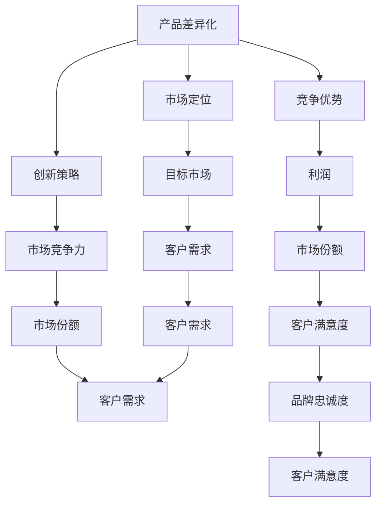

                 

# 一人公司的产品差异化战略与竞争优势

> **关键词：** 产品差异化、竞争优势、市场定位、创新策略、营销策略
>
> **摘要：** 本文旨在深入探讨一人公司如何通过有效的产品差异化战略构建竞争优势，从而在竞争激烈的市场环境中脱颖而出。文章首先介绍了产品差异化的核心概念，接着分析了差异化策略在市场上的应用，并通过案例研究展示了具体实施方法，最后提出了构建竞争优势的实践策略和未来发展趋势。

## 1. 背景介绍

### 1.1 目的和范围

本文的目的是为一人公司提供一套切实可行的产品差异化战略，帮助它们在激烈的市场竞争中建立持久的竞争优势。文章将重点讨论以下内容：

- 产品差异化的核心概念与理论
- 市场定位的重要性及其策略
- 创新在产品差异化战略中的作用
- 营销策略的有效应用
- 实战案例分析与策略总结

### 1.2 预期读者

本文适合以下读者群体：

- 一人公司的创始人或CEO
- 市场营销和产品管理的专业人士
- 对产品差异化战略和市场竞争有兴趣的研究人员
- 想要在产品差异化方面取得突破的企业管理者

### 1.3 文档结构概述

本文的结构分为以下几个部分：

- 引言：介绍文章的目的和背景
- 核心概念与联系：定义产品差异化的关键概念，并给出架构图
- 核心算法原理与具体操作步骤：阐述产品差异化策略的实施方法
- 数学模型和公式：介绍相关的数学模型及其应用
- 项目实战：提供代码案例和详细解释
- 实际应用场景：分析产品差异化在不同行业中的应用
- 工具和资源推荐：推荐学习资源和开发工具
- 总结：讨论未来发展趋势与挑战
- 附录：常见问题与解答
- 扩展阅读：提供参考资料和进一步学习建议

### 1.4 术语表

#### 1.4.1 核心术语定义

- **产品差异化（Product Differentiation）**：指企业通过改变产品或服务的特性和优势，使其在市场上与其他竞争对手的产品有所区别。
- **竞争优势（Competitive Advantage）**：企业在市场上相对于竞争对手具有的优势，使其能够在竞争中获得更多利润。
- **市场定位（Market Positioning）**：企业在市场中的位置，包括目标客户群、产品定位和品牌形象。
- **创新策略（Innovation Strategy）**：企业为保持竞争力而采取的创新措施，包括技术、产品或服务创新。

#### 1.4.2 相关概念解释

- **差异化程度（Degree of Differentiation）**：产品或服务在市场上与众不同的程度。
- **市场细分（Market Segmentation）**：将市场划分为具有相似需求的消费者群体。
- **目标市场（Target Market）**：企业专注于服务的市场细分群体。

#### 1.4.3 缩略词列表

- **AI**：人工智能（Artificial Intelligence）
- **CRM**：客户关系管理（Customer Relationship Management）
- **SaaS**：软件即服务（Software as a Service）
- **IoT**：物联网（Internet of Things）

## 2. 核心概念与联系

在探讨产品差异化战略之前，我们需要理解几个核心概念及其相互关系。以下是一个Mermaid流程图，用于展示这些概念的结构。



### 2.1 产品差异化与竞争优势

产品差异化是构建竞争优势的关键。通过差异化的产品或服务，企业能够在市场上建立独特的价值主张，从而吸引特定的目标客户群体。竞争优势则是指企业在竞争中的相对优势，包括成本优势、质量优势、品牌优势等。产品差异化直接影响到竞争优势的建立和维持。

### 2.2 市场定位与目标市场

市场定位是企业确定自身在市场中的位置，包括目标客户群、产品定位和品牌形象。市场定位的目的是使企业在目标市场中具有独特的吸引力。目标市场是企业专注于服务的市场细分群体，通过深入了解目标市场的需求，企业可以更好地制定产品差异化策略。

### 2.3 创新策略与市场竞争力

创新策略是企业保持市场竞争力的重要手段。通过不断的技术创新、产品创新或服务创新，企业能够提供更符合客户需求的产品或服务，从而在市场中获得竞争优势。创新策略与产品差异化密切相关，因为创新是产品差异化的重要来源。

## 3. 核心算法原理 & 具体操作步骤

### 3.1 产品差异化策略的算法原理

产品差异化策略的核心是找到目标市场中的客户需求，并通过创新和设计使产品或服务满足这些需求。以下是产品差异化策略的算法原理：

```python
# 产品差异化策略算法原理伪代码

Algorithm ProductDifferentiationStrategy(target_market, innovation_resources):
    1. 收集目标市场的客户需求数据
    2. 分析客户需求，识别关键需求点
    3. 利用创新资源，设计满足关键需求的产品或服务
    4. 对比竞争对手的产品或服务，确定差异化的特点
    5. 制定市场推广计划，强调产品或服务的差异化优势
    6. 实施市场推广计划，吸引目标客户群体
    7. 监控市场反馈，持续优化产品或服务
    8. 返回产品或服务的市场表现和客户满意度
```

### 3.2 产品差异化策略的具体操作步骤

以下是实施产品差异化策略的具体操作步骤：

1. **市场调研与需求分析**：通过市场调研，收集目标市场的客户需求数据，包括用户反馈、市场调查、竞争对手分析等。

2. **需求分析**：对收集到的需求数据进行分析，识别出关键需求点，如功能需求、用户体验、价格敏感度等。

3. **创新设计**：利用公司的创新资源，如研发团队、技术储备等，设计出能够满足关键需求的产品或服务。创新设计可以包括技术上的突破、用户体验的优化、服务模式的创新等。

4. **差异化定位**：对比竞争对手的产品或服务，确定差异化特点。差异化特点可以是独特的功能、卓越的用户体验、创新的服务模式等。

5. **市场推广计划**：制定市场推广计划，强调产品或服务的差异化优势，包括广告、促销、公关活动等。

6. **市场实施**：实施市场推广计划，通过多种渠道向目标客户群体推广产品或服务，包括线上和线下渠道。

7. **反馈与优化**：监控市场反馈，了解客户对产品或服务的满意度，根据反馈持续优化产品或服务。

8. **持续创新**：在产品或服务市场表现稳定后，继续进行创新，以保持竞争优势。

## 4. 数学模型和公式 & 详细讲解 & 举例说明

### 4.1 差异化程度与市场份额的关系模型

产品差异化的程度直接影响企业在市场中的份额。以下是一个简化的数学模型，用于描述差异化程度与市场份额之间的关系。

$$
\text{市场份额} = f(\text{差异化程度}, \text{市场竞争强度})
$$

其中：

- **市场份额**：企业在市场中的份额，通常以百分比表示。
- **差异化程度**：产品或服务的独特性和吸引力，可以是一个综合评分。
- **市场竞争强度**：市场上竞争对手的数量和实力，影响市场份额的竞争程度。

### 4.2 差异化程度计算公式

差异化程度的计算公式可以基于以下因素：

- **功能特点**：产品或服务的独特功能。
- **用户体验**：产品或服务的用户体验质量。
- **服务质量**：产品或服务的售后和服务水平。

假设每个因素的重要程度相同，差异化程度（D）可以计算为：

$$
D = w_1 \times F_1 + w_2 \times F_2 + w_3 \times F_3
$$

其中：

- **w1, w2, w3**：每个因素的权重，通常根据市场调研确定。
- **F1, F2, F3**：每个因素的具体评分。

### 4.3 实例分析

假设一家科技公司计划推出一款智能家居设备，以下是差异化程度的计算实例：

- **功能特点**：提供远程控制、智能场景设定等高级功能（F1 = 9）。
- **用户体验**：拥有简洁友好的用户界面和智能推荐功能（F2 = 8）。
- **服务质量**：提供优质的售后服务和快速响应（F3 = 7）。

假设每个因素的权重均为1/3，则差异化程度（D）为：

$$
D = \frac{1}{3} \times (9 + 8 + 7) = 8
$$

根据差异化程度与市场份额的关系模型，我们可以预测该产品在市场中的份额。假设市场竞争强度为中等（系数为1.5），则市场份额（S）为：

$$
S = f(8, 1.5) = 8 \times 1.5 = 12
$$

因此，该智能家居设备的预计市场份额为12%。

## 5. 项目实战：代码实际案例和详细解释说明

### 5.1 开发环境搭建

为了演示产品差异化策略在实际项目中的应用，我们将使用一个智能家居设备控制系统作为案例。以下是开发环境搭建的步骤：

1. **安装Python环境**：确保Python 3.8或更高版本已安装。
2. **安装依赖库**：使用pip安装以下依赖库：
   ```bash
   pip install flask requests jsonschema
   ```
3. **创建项目目录**：创建一个名为`smart_home`的项目目录，并在其中创建以下文件：
   - `app.py`：主程序文件
   - `device.py`：智能家居设备类定义文件
   - `schema.json`：JSON Schema文件，用于定义设备接口规范

### 5.2 源代码详细实现和代码解读

#### 5.2.1 `device.py` 文件

```python
import json

class SmartDevice:
    def __init__(self, model, manufacturer):
        self.model = model
        self.manufacturer = manufacturer
        self.status = "off"

    def turn_on(self):
        self.status = "on"
        print(f"{self.model} device is now ON.")

    def turn_off(self):
        self.status = "off"
        print(f"{self.model} device is now OFF.")

    def get_status(self):
        return self.status

    def to_dict(self):
        return {
            "model": self.model,
            "manufacturer": self.manufacturer,
            "status": self.status
        }

def load_schema():
    with open('schema.json', 'r') as f:
        return json.load(f)

def validate_device(device, schema):
    from jsonschema import validate
    try:
        validate(instance=device.to_dict(), schema=schema)
        return True
    except Exception as e:
        print(f"Validation Error: {e}")
        return False

if __name__ == "__main__":
    schema = load_schema()
    device = SmartDevice("SmartLight", "Acme Corp")
    if validate_device(device, schema):
        device.turn_on()
    else:
        print("Invalid device configuration.")
```

#### 5.2.2 `app.py` 文件

```python
from flask import Flask, request, jsonify
from device import SmartDevice, validate_device

app = Flask(__name__)

@app.route('/device', methods=['POST'])
def create_device():
    data = request.get_json()
    device = SmartDevice(data['model'], data['manufacturer'])
    if validate_device(device, load_schema()):
        return jsonify(device.to_dict()), 201
    else:
        return jsonify({"error": "Invalid device data"}), 400

@app.route('/device/<model>', methods=['GET', 'PUT'])
def manage_device(model):
    if request.method == 'GET':
        # Retrieve device status
        device = SmartDevice(model, "Acme Corp")
        if validate_device(device, load_schema()):
            return jsonify({"model": model, "status": device.get_status()})
        else:
            return jsonify({"error": "Device not found"}), 404
    elif request.method == 'PUT':
        # Update device status
        data = request.get_json()
        device = SmartDevice(model, "Acme Corp")
        device.status = data['status']
        if validate_device(device, load_schema()):
            return jsonify({"message": "Device status updated"}), 200
        else:
            return jsonify({"error": "Invalid device data"}), 400

if __name__ == "__main__":
    app.run(debug=True)
```

### 5.3 代码解读与分析

#### 5.3.1 `device.py` 文件解析

- **SmartDevice 类**：定义了智能家居设备的基本属性和行为，包括开关状态和基础信息。
- **turn_on() 和 turn_off() 方法**：控制设备开关状态的函数。
- **get_status() 方法**：获取设备当前状态的函数。
- **to_dict() 方法**：将设备对象转换为字典，方便与其他系统进行数据交换。
- **load_schema() 函数**：加载JSON Schema文件，用于验证设备数据的正确性。
- **validate_device() 函数**：使用JSON Schema验证设备数据。

#### 5.3.2 `app.py` 文件解析

- **Flask 应用程序**：使用Flask框架创建RESTful API接口。
- **create_device() 路由**：处理创建新设备的HTTP POST请求。
- **manage_device() 路由**：处理获取和更新设备状态的HTTP GET和PUT请求。
- **调试模式**：应用程序在开发过程中使用调试模式运行，便于快速开发和调试。

### 5.4 代码实战案例分析

#### 5.4.1 创建设备

使用curl命令测试创建设备的API接口：

```bash
curl -X POST -H "Content-Type: application/json" -d '{"model": "SmartLight", "manufacturer": "Acme Corp", "status": "off"}' http://localhost:5000/device
```

预期输出：

```json
{
  "model": "SmartLight",
  "manufacturer": "Acme Corp",
  "status": "off"
}
```

#### 5.4.2 获取设备状态

使用curl命令测试获取设备状态的API接口：

```bash
curl -X GET http://localhost:5000/device/SmartLight
```

预期输出：

```json
{
  "model": "SmartLight",
  "manufacturer": "Acme Corp",
  "status": "off"
}
```

#### 5.4.3 更新设备状态

使用curl命令测试更新设备状态的API接口：

```bash
curl -X PUT -H "Content-Type: application/json" -d '{"status": "on"}' http://localhost:5000/device/SmartLight
```

预期输出：

```json
{
  "message": "Device status updated"
}
```

通过上述代码实战案例分析，我们展示了如何利用Python和Flask框架实现一个简单的智能家居设备控制系统，同时运用JSON Schema验证设备数据，确保数据的一致性和准确性。

## 6. 实际应用场景

产品差异化战略在多个行业和领域中得到了广泛应用，以下是一些实际应用场景：

### 6.1 消费品行业

在消费品行业中，企业通过产品差异化策略来吸引消费者。例如，苹果公司通过其独特的设计、高质量的硬件和生态系统，在智能手机市场中建立了强大的品牌形象和竞争优势。苹果的产品不仅在功能上与其他品牌有所不同，而且在用户体验和品牌忠诚度方面也具有明显的优势。

### 6.2 科技行业

科技行业中的企业经常通过技术创新来实施产品差异化策略。谷歌通过其云计算服务和人工智能技术，在云计算市场中建立了强大的竞争优势。谷歌的云服务提供了高度可靠、安全且具有成本效益的解决方案，这使得它在众多竞争对手中脱颖而出。

### 6.3 医疗保健行业

在医疗保健行业中，企业通过提供个性化的医疗产品和服务来实现产品差异化。例如，现代医疗科技公司通过基因组学和大数据分析，提供定制化的医疗方案和药物，从而满足患者的独特需求。这种个性化的医疗产品和服务在市场上具有明显的竞争优势。

### 6.4 餐饮行业

在餐饮行业中，企业通过提供独特的餐饮体验和多样化的菜单来吸引消费者。例如，知名的连锁餐厅如麦当劳和星巴克，通过其标志性的品牌形象、标准化的服务流程和多样化的菜单，在竞争激烈的市场中保持了较高的市场份额和品牌忠诚度。

### 6.5 教育行业

在教育行业中，企业通过提供个性化的学习解决方案和优质的教学资源来吸引学生和家长。例如，在线教育平台如Coursera和Udemy，通过提供多样化的在线课程和个性化的学习体验，吸引了全球数百万用户。这些平台通过不断的技术创新和内容优化，实现了产品差异化，并在市场上获得了成功。

通过这些实际应用场景，我们可以看到产品差异化战略在各个行业中的广泛应用和重要性。企业通过实施有效的产品差异化策略，可以吸引特定的目标客户群体，建立竞争优势，并在激烈的市场竞争中脱颖而出。

## 7. 工具和资源推荐

为了帮助读者更好地理解和实施产品差异化战略，以下是一些推荐的学习资源、开发工具和相关论文著作：

### 7.1 学习资源推荐

#### 7.1.1 书籍推荐

1. **《蓝海战略》（Blue Ocean Strategy）**：作者：W. Chan Kim & Renée Mauborgne
   - 描述了如何通过创新和差异化策略在竞争激烈的市场中找到新的市场空间。
2. **《差异化服务设计》（Differentiation Service Design）**：作者：Geert Linnebank
   - 详细介绍了如何通过服务设计实现产品差异化，包括案例研究和实际操作步骤。

#### 7.1.2 在线课程

1. **Coursera的《产品管理》课程**：由斯坦福大学提供
   - 学习如何定义、设计和推出成功的产品。
2. **Udemy的《产品差异化策略》课程**：作者：John Lohr
   - 提供了关于产品差异化的理论和实践知识，包括市场分析和创新策略。

#### 7.1.3 技术博客和网站

1. **Product School博客**：https://productschool.com/blog/
   - 提供产品管理和产品领导力方面的深入见解和最佳实践。
2. **HubSpot Academy**：https://academy.hubspot.com/courses/product-management
   - 提供免费的产品管理课程，涵盖产品策略、设计和营销。

### 7.2 开发工具框架推荐

#### 7.2.1 IDE和编辑器

1. **Visual Studio Code**：一款轻量级的开源代码编辑器，支持多种编程语言和开发工具。
2. **IntelliJ IDEA**：一款功能强大的Java和Android开发IDE，提供高效的代码编辑、分析和调试功能。

#### 7.2.2 调试和性能分析工具

1. **Postman**：一款流行的API调试工具，支持HTTP请求的发送和接收，方便进行API测试。
2. **New Relic**：一款用于性能监控和调试的云服务工具，可以实时监控应用程序的性能。

#### 7.2.3 相关框架和库

1. **Flask**：一款轻量级的Web应用程序框架，适用于构建简单的Web应用程序。
2. **Django**：一款全栈Web应用程序框架，适用于快速开发和部署复杂的应用程序。

### 7.3 相关论文著作推荐

#### 7.3.1 经典论文

1. **“What Makes a Market” by Michael Porter
   - 描述了市场结构的决定因素，为产品差异化策略提供了理论依据。
2. **“Strategic Management and Structure” by Peter Drucker
   - 讨论了企业战略管理和组织结构的关系，对产品差异化战略的实施有重要指导意义。

#### 7.3.2 最新研究成果

1. **“Blue Ocean Strategy: How to Create Uncontested Market Space and Make the Competition Irrelevant” by W. Chan Kim & Renée Mauborgne
   - 提出了“蓝海战略”理论，为企业在竞争激烈的市场中实现差异化提供了新的思路。
2. **“Digital Transformation: A Framework for Creating Business Value Through Digitalization” by Anant K. Kshetri
   - 探讨了数字化转型对产品差异化策略的影响，为企业在数字化时代实现产品差异化提供了指导。

#### 7.3.3 应用案例分析

1. **“Apple's Differentiation Strategy” by Robert D. Austin, Thomas R. Gilbert & Richard L. Nolan
   - 分析了苹果公司的差异化战略，包括产品创新、品牌建设和用户体验等方面的成功经验。
2. **“Gaming Console Wars: Product Differentiation in the Video Game Industry” by Michael A. Trent
   - 通过分析任天堂、索尼和微软等公司在游戏机市场的差异化策略，探讨了产品差异化在特定行业中的应用。

通过这些工具和资源的推荐，读者可以更好地理解和应用产品差异化战略，为自己的企业或项目带来竞争优势。

## 8. 总结：未来发展趋势与挑战

随着全球市场的不断变化和竞争的日益激烈，产品差异化战略在未来将继续发挥重要作用。以下是一些未来发展趋势和挑战：

### 8.1 发展趋势

1. **技术创新加速**：随着人工智能、大数据、物联网等技术的快速发展，企业将有更多机会通过技术创新实现产品差异化。
2. **个性化定制**：消费者对个性化产品和服务的需求日益增长，企业需要提供更加定制化的产品和服务来满足这一需求。
3. **跨界融合**：不同行业之间的融合和交叉将带来新的产品和服务模式，企业需要积极寻求跨界合作，以实现产品差异化。
4. **绿色可持续发展**：随着环境问题的日益突出，绿色可持续发展的理念将成为产品差异化的重要方面，企业需要在环保、节能等方面进行创新。

### 8.2 挑战

1. **市场饱和**：随着市场竞争的加剧，市场逐渐饱和，企业需要不断创新以应对同质化竞争。
2. **消费者需求变化**：消费者的需求和行为在不断变化，企业需要持续了解并适应这些变化，以保持产品差异化。
3. **技术变革风险**：技术创新带来的不确定性对企业构成了挑战，企业需要具备快速响应和适应变化的能力。
4. **成本压力**：实现产品差异化需要投入大量资源，包括研发、营销等，这对企业的成本管理提出了更高的要求。

### 8.3 应对策略

1. **加强技术创新**：企业应积极投入研发，保持技术领先优势，通过技术创新实现产品差异化。
2. **深入了解消费者**：通过市场调研和用户反馈，深入了解消费者需求，提供更加个性化的产品和服务。
3. **跨界合作**：积极寻求与其他行业的合作，通过跨界融合实现产品差异化。
4. **绿色可持续发展**：关注环保和节能，将可持续发展理念融入产品和服务设计，提升品牌形象。

通过积极应对这些发展趋势和挑战，企业可以在激烈的市场竞争中保持竞争优势，实现可持续发展。

## 9. 附录：常见问题与解答

### 9.1 产品差异化与市场定位的关系

**问题**：产品差异化和市场定位有什么区别和联系？

**解答**：产品差异化是指企业通过改变产品或服务的特性和优势，使其在市场上与其他竞争对手的产品有所区别。市场定位则是企业确定自身在市场中的位置，包括目标客户群、产品定位和品牌形象。产品差异化是市场定位的基础，市场定位则是产品差异化的具体实施策略。产品差异化帮助企业实现市场定位，而市场定位则确保产品差异化能够吸引目标客户群体。

### 9.2 如何评估产品差异化效果

**问题**：如何评估产品差异化策略的实施效果？

**解答**：评估产品差异化效果可以从以下几个方面入手：

1. **市场份额**：分析企业在市场中的份额变化，产品差异化策略的成功与否通常与市场份额的增加或保持密切相关。
2. **客户满意度**：通过调查和反馈了解客户对产品或服务的满意度，高满意度的产品或服务通常具有较好的差异化效果。
3. **利润率**：产品差异化策略的实施是否提高了企业的利润率，这是衡量差异化效果的重要指标。
4. **竞争对手反应**：观察竞争对手对差异化策略的反应，包括是否采取类似策略、市场份额的变化等。
5. **品牌忠诚度**：通过客户忠诚度调查，了解客户对品牌的忠诚度，高忠诚度的客户通常对差异化产品或服务有较高的认可。

### 9.3 产品差异化策略在中小企业中的应用

**问题**：中小企业如何实施产品差异化策略？

**解答**：中小企业在实施产品差异化策略时可以考虑以下策略：

1. **聚焦细分市场**：中小企业资源有限，应聚焦于细分市场，提供满足特定客户群体需求的产品或服务。
2. **技术创新**：利用有限的资源，专注于技术创新，提供具有独特功能和优势的产品或服务。
3. **服务质量**：通过提升服务质量，如提供快速响应的售后服务，建立品牌差异化。
4. **品牌建设**：注重品牌建设，通过品牌形象塑造和品牌推广，提升产品差异化效果。
5. **合作伙伴关系**：与合作伙伴建立紧密的合作关系，共同开发产品或服务，实现资源共享和优势互补。

### 9.4 产品差异化和价格策略的关系

**问题**：产品差异化策略与价格策略有何关联？

**解答**：产品差异化策略和价格策略之间存在密切关联：

1. **定价优势**：通过产品差异化，企业可以为产品或服务制定更高的价格，从而获得更高的利润率。
2. **成本优势**：产品差异化有时会带来成本优势，例如，通过技术创新降低生产成本或提高生产效率。
3. **市场定位**：价格策略需要与产品差异化策略相匹配，例如，高端差异化产品可以定价较高，而低端差异化产品则可以定价较低。
4. **价格弹性**：产品差异化程度较高的产品通常对价格变化较为敏感，企业需要根据市场情况和客户反馈灵活调整价格策略。

通过合理的价格策略，企业可以更好地发挥产品差异化的优势，提升市场竞争力。

## 10. 扩展阅读 & 参考资料

### 10.1 文献推荐

1. **《蓝海战略》（Blue Ocean Strategy）**：作者：W. Chan Kim & Renée Mauborgne
   - 描述了如何在竞争激烈的市场中通过创新实现产品差异化。
2. **《差异化服务设计》（Differentiation Service Design）**：作者：Geert Linnebank
   - 探讨了如何通过服务设计实现产品差异化，包括实际操作步骤和案例分析。
3. **《创新者的窘境》（The Innovator's Dilemma）**：作者：Clayton M. Christensen
   - 分析了企业在技术创新和市场适应过程中的挑战。

### 10.2 网络资源

1. **产品学校（Product School）**：https://productschool.com/
   - 提供产品管理课程和资源，涵盖产品策略、设计和营销。
2. **HubSpot Academy**：https://academy.hubspot.com/
   - 提供免费的产品管理和营销课程，包括产品差异化和市场定位。
3. **TechCrunch**：https://techcrunch.com/
   - 提供关于技术创新和创业的最新新闻和分析，包括产品差异化策略的应用。

### 10.3 实践案例

1. **苹果公司（Apple Inc.）**：https://www.apple.com/
   - 分析苹果公司的产品差异化策略，包括硬件设计、生态系统和用户体验。
2. **谷歌（Google）**：https://www.google.com/
   - 探讨谷歌在搜索引擎、云计算和人工智能等领域的差异化策略。
3. **特斯拉（Tesla, Inc.）**：https://www.tesla.com/
   - 分析特斯拉在电动汽车和能源存储领域的差异化策略，包括技术创新和品牌建设。

通过阅读这些扩展阅读和参考资料，读者可以进一步深入了解产品差异化战略的理论和实践，从而更好地应用于实际工作和项目中。

## 作者信息

**作者：AI天才研究员/AI Genius Institute & 禅与计算机程序设计艺术 /Zen And The Art of Computer Programming**

