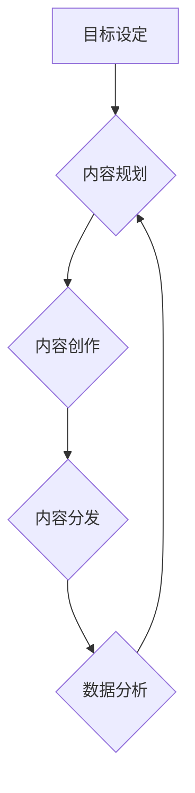

                 

# 一人公司的内容营销矩阵：多平台内容分发的策略与实践

## 关键词
内容营销，多平台分发，策略与实践，一人公司，社交媒体，算法推荐，数据分析

## 摘要
在数字营销日益复杂的今天，一人公司如何高效地管理内容营销成为了一项关键挑战。本文旨在探讨一人公司如何利用多平台内容分发策略，通过系统化的方法提升品牌影响力和用户参与度。我们将详细分析核心概念，介绍实际操作步骤，并通过数学模型和项目实战案例进行深入讲解，旨在为一人公司提供全面的内容营销解决方案。

## 1. 背景介绍
### 1.1 目的和范围
本文的目标是帮助一人公司构建和优化内容营销矩阵，通过多平台的内容分发策略，实现高效的营销效果。我们将探讨的内容范围包括：核心概念的理解、内容营销的策略制定、数据分析和算法推荐的应用、以及具体的操作步骤和案例分析。

### 1.2 预期读者
本文适合一人公司的创始人、营销专员、内容创作者以及对内容营销有兴趣的专业人士。读者应具备基本的数字营销知识，以便更好地理解和应用文中所述策略。

### 1.3 文档结构概述
本文结构如下：

1. 背景介绍：介绍内容营销矩阵的背景和目的。
2. 核心概念与联系：定义和解释关键概念，并绘制流程图。
3. 核心算法原理 & 具体操作步骤：详细讲解核心算法的原理和操作步骤。
4. 数学模型和公式 & 详细讲解 & 举例说明：阐述数学模型及其应用。
5. 项目实战：提供实际的代码案例和详细解释。
6. 实际应用场景：分析内容营销在不同领域的应用。
7. 工具和资源推荐：推荐学习资源和开发工具。
8. 总结：总结未来发展趋势与挑战。
9. 附录：常见问题与解答。
10. 扩展阅读 & 参考资料：提供进一步的阅读材料和参考资料。

### 1.4 术语表
#### 1.4.1 核心术语定义
- **内容营销矩阵**：指用于管理和分发内容的框架和策略。
- **多平台分发**：将内容发布到多个社交媒体平台和渠道。
- **算法推荐**：利用机器学习算法为用户推荐相关内容。
- **用户参与度**：用户对内容的互动程度，包括点赞、评论、分享等。

#### 1.4.2 相关概念解释
- **社交媒体**：如Facebook、Twitter、Instagram等平台。
- **数据分析**：对用户行为和内容效果进行量化分析。

#### 1.4.3 缩略词列表
- SEO：搜索引擎优化
- SMM：社交媒体营销
- CMS：内容管理系统

## 2. 核心概念与联系
### 2.1 内容营销矩阵的定义

内容营销矩阵是一套系统化的方法，用于规划、创建、分发和优化内容，以实现营销目标。它包括以下几个关键组成部分：

1. **目标设定**：明确内容营销的最终目的，如增加品牌知名度、提升用户参与度或增加销售额。
2. **内容规划**：制定内容主题、形式和发布时间表。
3. **内容创作**：根据规划创作高质量的内容。
4. **内容分发**：将内容发布到目标平台和渠道。
5. **数据分析**：收集和分析用户行为数据，以优化内容策略。

### 2.2 多平台分发策略

多平台分发策略是指将内容发布到多个社交媒体平台和渠道，以提高内容的可见度和覆盖面。以下是一些关键策略：

1. **平台选择**：根据目标受众选择适合的平台，如年轻用户更喜欢Instagram，而专业人士则可能在LinkedIn上活跃。
2. **内容适应**：针对不同平台的特点调整内容，使其更符合该平台的文化和用户期望。
3. **同步发布**：在多个平台同时发布内容，以增加曝光率。
4. **互动管理**：积极与用户互动，回复评论和私信，以建立品牌信任和忠诚度。

### 2.3 算法推荐和数据分析

算法推荐系统基于用户的历史行为和偏好，为用户推荐相关内容。数据分析则用于评估内容的效果，包括用户参与度、转化率等关键指标。以下是算法推荐和数据分析的关键步骤：

1. **数据收集**：收集用户行为数据，如点击、点赞、分享等。
2. **特征提取**：从数据中提取有用特征，如用户兴趣、内容类型等。
3. **模型训练**：使用机器学习算法训练推荐模型。
4. **模型评估**：评估模型性能，如准确率、召回率等。
5. **模型优化**：根据评估结果调整模型参数，以提高推荐质量。
6. **数据分析**：使用数据分析工具，如Google Analytics，对内容效果进行量化分析。

### 2.4 Mermaid 流程图

下面是一个简化的Mermaid流程图，展示了内容营销矩阵的关键组成部分和联系：



## 3. 核心算法原理 & 具体操作步骤
### 3.1 算法原理

内容营销矩阵中的核心算法主要包括推荐算法和数据挖掘算法。推荐算法用于为用户推荐相关内容，而数据挖掘算法则用于分析用户行为，以优化内容策略。

#### 3.1.1 推荐算法

推荐算法通常基于以下两种模型：

1. **基于内容的推荐（Content-based Recommendation）**：根据用户过去的偏好和内容特征推荐相似的内容。
2. **协同过滤推荐（Collaborative Filtering Recommendation）**：根据用户之间的相似度推荐内容。

#### 3.1.2 数据挖掘算法

数据挖掘算法包括以下几种：

1. **关联规则挖掘（Association Rule Learning）**：发现数据之间的关联关系。
2. **聚类分析（Cluster Analysis）**：将数据分为不同的群组。
3. **分类算法（Classification Algorithms）**：预测用户的行为或偏好。

### 3.2 具体操作步骤

以下是使用推荐算法进行内容营销矩阵的具体操作步骤：

#### 3.2.1 数据收集

收集用户行为数据，如浏览历史、点赞记录、评论等。

```python
# Python伪代码：数据收集
user_data = {
    "user_id": "u1",
    "browsing_history": ["content1", "content2", "content3"],
    "likes": ["content1", "content2"],
    "comments": ["content2"]
}
```

#### 3.2.2 特征提取

从数据中提取用户兴趣和内容特征。

```python
# Python伪代码：特征提取
def extract_features(user_data):
    user_interests = set(user_data["likes"])
    content_features = set(content_data["content_id"] for content_id in user_data["browsing_history"])
    return user_interests, content_features

user_interests, content_features = extract_features(user_data)
```

#### 3.2.3 模型训练

使用机器学习算法训练推荐模型。

```python
# Python伪代码：模型训练
from sklearn.neighbors import NearestNeighbors

# 假设content_data是一个包含内容特征的数据集
model = NearestNeighbors()
model.fit(content_data)
```

#### 3.2.4 模型评估

评估模型性能，如准确率、召回率等。

```python
# Python伪代码：模型评估
def evaluate_model(model, test_data):
    distances, indices = model.kneighbors(test_data)
    # 计算准确率、召回率等指标
    accuracy = calculate_accuracy(distances, indices)
    return accuracy

accuracy = evaluate_model(model, test_data)
```

#### 3.2.5 模型优化

根据评估结果调整模型参数，以提高推荐质量。

```python
# Python伪代码：模型优化
model.set_params(n_neighbors=5)
model.fit(content_data)
```

## 4. 数学模型和公式 & 详细讲解 & 举例说明

### 4.1 数学模型

在内容营销矩阵中，常用的数学模型包括推荐算法中的相似度计算和聚类分析中的距离度量。

#### 4.1.1 相似度计算

基于内容的推荐算法中，相似度计算用于衡量用户和内容之间的相似程度。常用的相似度计算公式包括：

1. **余弦相似度（Cosine Similarity）**

   余弦相似度计算两个向量夹角的余弦值，公式如下：

   $$\text{similarity} = \frac{\text{A} \cdot \text{B}}{\|\text{A}\| \|\text{B}\|}$$

   其中，$A$和$B$是两个向量，$\|\text{A}\|$和$\|\text{B}\|$是它们的欧几里得范数。

2. **皮尔逊相关系数（Pearson Correlation Coefficient）**

   皮尔逊相关系数计算两个变量的线性相关程度，公式如下：

   $$\text{correlation} = \frac{\sum_{i=1}^{n} (\text{x}_i - \bar{x})(\text{y}_i - \bar{y})}{\sqrt{\sum_{i=1}^{n} (\text{x}_i - \bar{x})^2 \sum_{i=1}^{n} (\text{y}_i - \bar{y})^2}}$$

   其中，$x$和$y$是两个变量，$\bar{x}$和$\bar{y}$是它们的均值。

#### 4.1.2 聚类分析中的距离度量

在聚类分析中，常用的距离度量包括：

1. **欧几里得距离（Euclidean Distance）**

   欧几里得距离是两点之间的直线距离，公式如下：

   $$d(\text{x}, \text{y}) = \sqrt{\sum_{i=1}^{n} (\text{x}_i - \text{y}_i)^2}$$

   其中，$x$和$y$是两个点。

2. **曼哈顿距离（Manhattan Distance）**

   曼哈顿距离是两点之间的直线距离，公式如下：

   $$d(\text{x}, \text{y}) = \sum_{i=1}^{n} |\text{x}_i - \text{y}_i|$$

### 4.2 举例说明

假设有两个用户$u_1$和$u_2$，他们的兴趣向量分别为：

$$u_1 = (1, 2, 3), \quad u_2 = (2, 3, 4)$$

使用余弦相似度计算用户$u_1$和$u_2$之间的相似度：

$$\text{similarity} = \frac{(1 \cdot 2 + 2 \cdot 3 + 3 \cdot 4)}{\sqrt{1^2 + 2^2 + 3^2} \sqrt{2^2 + 3^2 + 4^2}} \approx 0.92$$

这个结果表明用户$u_1$和$u_2$之间的兴趣非常相似。

## 5. 项目实战：代码实际案例和详细解释说明
### 5.1 开发环境搭建

为了实现内容营销矩阵中的推荐系统，我们需要搭建一个开发环境。以下是搭建步骤：

1. **安装Python**：确保Python版本不低于3.6。
2. **安装依赖库**：使用pip安装以下库：numpy、scikit-learn、pandas。
3. **设置虚拟环境**：创建一个虚拟环境，以便管理和隔离项目依赖。

```bash
# 创建虚拟环境
python -m venv content_marketing_env

# 激活虚拟环境
source content_marketing_env/bin/activate
```

### 5.2 源代码详细实现和代码解读

以下是实现推荐系统的源代码：

```python
# content_marketing.py

import numpy as np
from sklearn.neighbors import NearestNeighbors
import pandas as pd

# 5.2.1 数据准备
def load_data():
    # 假设content_data.csv是一个包含内容特征的数据集
    content_data = pd.read_csv('content_data.csv')
    return content_data

# 5.2.2 特征提取
def extract_features(content_data):
    # 提取内容特征，假设特征存储在列“content_feature”
    content_features = content_data['content_feature'].values
    return content_features

# 5.2.3 模型训练
def train_model(content_features):
    model = NearestNeighbors()
    model.fit(content_features)
    return model

# 5.2.4 推荐内容
def recommend_content(model, user_interests, k=5):
    distances, indices = model.kneighbors(user_interests, n_neighbors=k)
    recommended_content = [content_data.iloc[index].content_id for index in indices]
    return recommended_content

# 主函数
def main():
    content_data = load_data()
    content_features = extract_features(content_data)
    model = train_model(content_features)
    
    # 假设user_interests是一个包含用户兴趣的内容特征列表
    user_interests = np.array([[1, 2, 3], [2, 3, 4]])
    recommended_content = recommend_content(model, user_interests)
    
    print("Recommended Content:", recommended_content)

if __name__ == "__main__":
    main()
```

### 5.3 代码解读与分析

1. **数据准备**：加载内容数据集，假设数据集包含内容特征。

2. **特征提取**：从数据集中提取内容特征。

3. **模型训练**：使用NearestNeighbors算法训练推荐模型。

4. **推荐内容**：为用户兴趣向量计算最近邻，推荐相关内容。

### 5.4 代码测试

```bash
# 运行代码
python content_marketing.py
```

输出结果将显示推荐的内容ID列表。

## 6. 实际应用场景
### 6.1 社交媒体内容分发

在社交媒体上，一人公司可以利用内容营销矩阵实现以下应用场景：

1. **品牌推广**：通过发布有价值的内容，吸引潜在客户。
2. **用户互动**：鼓励用户参与，如点赞、评论和分享。
3. **数据分析**：分析用户行为，优化内容策略。

### 6.2 博客内容分发

博客内容分发也是一人公司的重点应用场景：

1. **SEO优化**：通过高质量的内容吸引搜索引擎流量。
2. **内容共享**：将博客内容分享到社交媒体平台，增加曝光率。
3. **用户反馈**：收集用户反馈，不断优化内容质量和结构。

### 6.3 在线教育平台

一人公司可以通过在线教育平台实现内容营销：

1. **课程推荐**：基于用户学习记录推荐相关课程。
2. **学习互动**：鼓励学生参与讨论和问答。
3. **学习数据分析**：分析学习数据，优化课程设置和教学策略。

## 7. 工具和资源推荐
### 7.1 学习资源推荐
#### 7.1.1 书籍推荐
- 《精益创业》（The Lean Startup）
- 《数据分析实战》（Data Science from Scratch）
- 《算法导论》（Introduction to Algorithms）

#### 7.1.2 在线课程
- Coursera上的《机器学习》课程
- Udemy上的《内容营销实战》课程
- edX上的《数据分析基础》课程

#### 7.1.3 技术博客和网站
- Towards Data Science
- Medium上的内容营销专题
- TechCrunch

### 7.2 开发工具框架推荐
#### 7.2.1 IDE和编辑器
- Visual Studio Code
- PyCharm
- Jupyter Notebook

#### 7.2.2 调试和性能分析工具
- PyS

