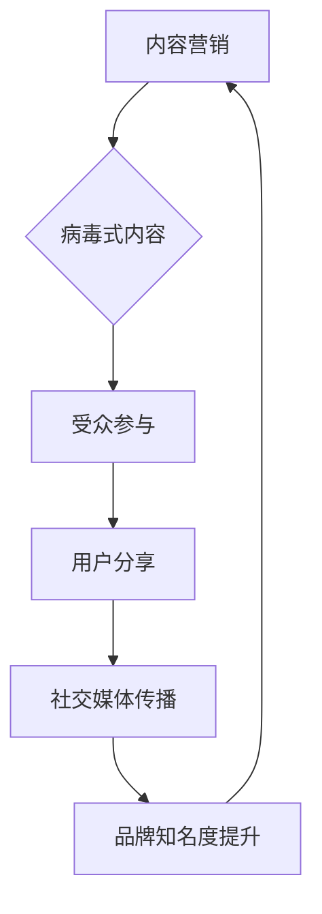

                 

### 背景介绍

#### 1.1 目的和范围

本文旨在探讨一人公司的内容营销策略，尤其是如何创作和推广病毒式内容。在当今数字营销时代，内容营销已经成为了企业竞争的关键因素。而一人公司，作为内容创作者的核心，如何有效地创作和推广高质量、具有传播性的内容，对于提升品牌影响力、吸引目标受众具有重要意义。

本文将围绕以下几个方面展开讨论：

1. **内容营销的基本概念**：回顾内容营销的定义、核心价值和主要策略。
2. **病毒式内容的特点**：深入分析病毒式内容的基本特征、传播机制和成功因素。
3. **创作病毒式内容的具体步骤**：从内容构思、撰写到优化，详细讲解创作病毒式内容的全过程。
4. **推广病毒式内容的策略**：分析如何通过社交媒体、SEO、KOL合作等手段，有效地推广病毒式内容。
5. **案例研究和最佳实践**：结合实际案例，探讨成功的病毒式内容营销策略。
6. **未来趋势与挑战**：预测内容营销领域的发展趋势，以及一人公司可能面临的挑战。

#### 1.2 预期读者

本文适合以下读者群体：

1. **一人公司的创始人或内容创作者**：希望了解如何通过内容营销提升公司品牌影响力。
2. **市场营销和数字营销从业者**：对病毒式内容营销策略感兴趣的营销人员。
3. **新媒体运营人员**：负责社交媒体运营和内容推广的相关人员。
4. **企业高管和策略规划者**：希望了解内容营销在企业发展中的作用。

#### 1.3 文档结构概述

为了帮助读者更好地理解内容营销和病毒式内容的创作与推广，本文将采用以下结构：

1. **背景介绍**：介绍本文的目的、范围和预期读者。
2. **核心概念与联系**：通过Mermaid流程图展示内容营销和病毒式内容的核心概念及其联系。
3. **核心算法原理 & 具体操作步骤**：详细讲解创作病毒式内容的具体步骤和操作方法。
4. **数学模型和公式 & 详细讲解 & 举例说明**：阐述病毒式内容的传播机制和数学模型，结合实际案例进行解释。
5. **项目实战：代码实际案例和详细解释说明**：提供具体的代码实现案例，并详细解读。
6. **实际应用场景**：探讨病毒式内容在不同行业和场景下的应用。
7. **工具和资源推荐**：推荐相关的学习资源、开发工具和框架。
8. **总结：未来发展趋势与挑战**：总结本文的主要观点，展望未来内容营销的发展趋势和挑战。
9. **附录：常见问题与解答**：回答读者可能遇到的问题。
10. **扩展阅读 & 参考资料**：提供进一步学习的资源链接。

通过以上结构，本文将为读者提供一个全面、深入的内容营销和病毒式内容创作与推广的指南。

#### 1.4 术语表

为了确保文章内容的专业性和可理解性，以下列出了一些本文中涉及的核心术语及其定义：

##### 1.4.1 核心术语定义

1. **内容营销**：一种通过创造和分享有价值的内容来吸引和转化潜在客户，从而实现营销目标的方法。
2. **病毒式内容**：一种能够迅速传播、引起广泛讨论和分享的优质内容。
3. **社交媒体**：在线平台，如Facebook、Twitter、Instagram等，用于个人或团体之间的交流和分享信息。
4. **SEO（搜索引擎优化）**：通过改进网站内容和结构，提高网站在搜索引擎结果中的排名。
5. **KOL（关键意见领袖）**：在某一领域或行业中具有高度影响力和话语权的人物。

##### 1.4.2 相关概念解释

1. **内容创作**：指创建和制作文字、图片、视频等多种形式的内容。
2. **内容优化**：通过改进内容质量、结构和关键词，提高内容的可读性和搜索排名。
3. **用户参与**：指用户与内容之间的互动，如评论、点赞、分享等。
4. **受众分析**：研究目标受众的属性、兴趣和行为，以便更好地满足他们的需求。

##### 1.4.3 缩略词列表

- SEO：搜索引擎优化
- KOL：关键意见领袖
- SMM：社交媒体营销
- CTA：行动召唤（Call to Action）
- CMS：内容管理系统

通过以上对核心术语的定义和解释，读者可以更好地理解本文的主题和内容。接下来，我们将进一步探讨内容营销和病毒式内容的基本概念和核心原理，为后续内容创作和推广策略的讨论奠定基础。

---

**下一步，我们将展示内容营销和病毒式内容的核心概念及其联系的Mermaid流程图。**

---

### 核心概念与联系

为了更好地理解内容营销和病毒式内容之间的关系，我们可以通过Mermaid流程图来直观地展示其核心概念及其联系。

以下是Mermaid流程图的示例：



#### 核心概念解释

1. **内容营销（Content Marketing）**：内容营销是一种以教育、娱乐和启发为目标，通过创造和分享有价值的内容来吸引和留住目标受众的营销策略。其核心在于提供对用户有价值的信息，建立品牌信任，并最终实现营销目标。

2. **病毒式内容（Viral Content）**：病毒式内容是指那些能够迅速传播、引起广泛讨论和分享的内容。这种内容通常具有独特的创意、强烈的情感共鸣或深刻的启示，能够触动用户的情感，促使他们主动分享到自己的社交网络。

3. **受众参与（Audience Engagement）**：受众参与是指用户与内容之间的互动。一个成功的病毒式内容通常能够激发用户的情感，促使他们进行评论、点赞、分享等行为，从而增强内容的影响力和传播效果。

4. **用户分享（User Sharing）**：用户分享是指用户主动将内容分享到自己的社交网络或传递给他人。这是病毒式内容传播的重要环节，用户的分享行为能够扩大内容的传播范围，提高品牌知名度。

5. **社交媒体传播（Social Media Spread）**：社交媒体是病毒式内容传播的主要渠道。通过用户的分享和社交网络的传播，病毒式内容能够迅速获得大量曝光，从而实现品牌知名度的提升。

6. **品牌知名度提升（Brand Awareness Increase）**：病毒式内容的成功传播能够显著提高品牌知名度，使更多潜在客户了解和记住品牌，从而为品牌带来更多的商业机会。

#### Mermaid流程图详细说明

- **A[内容营销]**：内容营销是整个流程的起点，通过创造和分享有价值的内容，吸引目标受众。
- **B{病毒式内容}]**：内容营销的目标之一是创作病毒式内容，它通过独特的创意和情感共鸣，激发用户分享。
- **C[受众参与]**：病毒式内容能够引发用户的情感共鸣，促使他们参与互动，如评论、点赞和分享。
- **D[用户分享]**：用户的分享行为是病毒式内容传播的关键，通过社交网络传播，内容能够迅速获得大量曝光。
- **E[社交媒体传播]**：社交媒体是用户分享和内容传播的主要渠道，其广泛性和互动性使得病毒式内容能够迅速传播。
- **F[品牌知名度提升]**：病毒式内容的成功传播能够显著提高品牌知名度，吸引更多潜在客户。

通过上述Mermaid流程图的展示，我们可以清晰地看到内容营销和病毒式内容之间的联系，以及病毒式内容传播的各个环节。接下来，我们将详细探讨病毒式内容的具体创作原理和操作步骤。

---

**下一步，我们将深入讲解病毒式内容的创作原理和具体操作步骤。**

---

### 核心算法原理 & 具体操作步骤

#### 3.1 病毒式内容创作原理

病毒式内容之所以能够迅速传播，主要基于以下几个核心原理：

1. **情感共鸣**：情感共鸣是病毒式内容的核心驱动因素。当内容能够触动用户的情感，如喜悦、悲伤、愤怒或感动时，用户更有可能分享和传播。
2. **独特创意**：独特创意是病毒式内容吸引注意力的关键。通过新颖的观点、幽默的表达或创新的互动方式，病毒式内容能够脱颖而出，引发用户的兴趣。
3. **易于分享**：病毒式内容通常设计得易于分享。简单明了的分享按钮、吸引人的标题和有趣的内容形式，使用户能够轻松地将其分享到社交媒体或发送给他人。
4. **社交影响力**：社交影响力是指用户在社交网络中的地位和影响力。当内容获得关键意见领袖（KOL）或知名人士的分享和认可时，能够迅速扩大传播范围。
5. **适时的发布**：适时的发布能够确保内容在最佳时间段内获得最大的关注和传播机会。通过分析受众的行为和偏好，选择最佳发布时间，可以最大化内容的传播效果。

#### 3.2 具体操作步骤

创作病毒式内容需要系统化和结构化的操作步骤，以下是详细的操作流程：

##### 3.2.1 内容构思

1. **目标受众分析**：首先，明确目标受众的属性、兴趣和需求。通过市场调研、用户画像和数据分析，了解受众的偏好和行为习惯。
2. **主题选定**：根据受众分析的结果，选定一个能够引起情感共鸣和兴趣的主题。主题应具备独特性、创新性和相关性。
3. **创意开发**：围绕主题进行创意构思，可以采用头脑风暴、用户访谈或调研等方式，激发新颖的观点和表达方式。

##### 3.2.2 内容撰写

1. **标题撰写**：撰写一个吸引人的标题，能够迅速吸引用户的注意力。标题应简洁明了，同时能够传达内容的主题和价值。
2. **内容创作**：内容创作应注重质量而非数量。确保内容具备深度、独特性和实用性，能够满足用户的需求。
3. **形式多样化**：采用多种形式的内容创作，如文章、图片、视频、动画等，以满足不同用户的喜好和阅读习惯。

##### 3.2.3 内容优化

1. **SEO优化**：通过优化关键词、标题和元描述，提高内容在搜索引擎中的排名，增加曝光机会。
2. **社交媒体优化**：确保内容在社交媒体平台上易于分享和传播，添加相关的标签、话题和话题标签，提高内容的社交可见性。
3. **互动设计**：设计互动元素，如评论、投票、问答等，提高用户的参与度和互动性。

##### 3.2.4 发布和推广

1. **发布时间选择**：根据受众的行为和偏好，选择最佳发布时间。可以使用社交媒体分析工具，如Buffer或Hootsuite，来安排发布时间。
2. **多渠道发布**：将内容发布到多个社交媒体平台，如Facebook、Twitter、Instagram等，利用不同的平台特性进行推广。
3. **合作与推广**：与关键意见领袖（KOL）或其他知名品牌合作，通过他们的分享和推广，扩大内容的传播范围。
4. **监测与反馈**：持续监测内容的传播效果和用户反馈，及时调整和优化推广策略。

通过以上详细的操作步骤，一人公司或内容创作者可以系统地创作和推广病毒式内容，实现品牌知名度的提升和用户参与度的增加。接下来，我们将进一步探讨病毒式内容的数学模型和公式，为内容的传播机制提供更深入的理解。

---

**下一步，我们将详细阐述病毒式内容的数学模型和公式，并结合实际案例进行解释。**

---

### 数学模型和公式 & 详细讲解 & 举例说明

#### 4.1 病毒式内容的传播模型

病毒式内容的传播可以看作是一种基于用户分享和传播的动态过程。为了更好地理解这一过程，我们可以使用数学模型来描述其传播机制。

##### 4.1.1 简单用户分享模型

一个简单的用户分享模型可以采用如下公式：

\[ S(t) = a \cdot e^{rt} \]

其中：
- \( S(t) \) 表示在时间 \( t \) 内的分享数量；
- \( a \) 是初始分享量；
- \( r \) 是分享率（即每个用户在单位时间内分享的概率）；
- \( e \) 是自然对数的底数。

这个模型假设每个用户在单位时间内以固定的概率进行分享。然而，实际情况可能更加复杂，用户的分享行为可能受到多种因素的影响，如内容质量、用户情绪、社交网络结构等。

##### 4.1.2 复杂用户分享模型

为了更准确地描述病毒式内容的传播过程，我们可以引入更复杂的模型，如多阶段传播模型。以下是一个简单的多阶段用户分享模型：

\[ S(t) = a \cdot \left(1 + \sum_{i=1}^{n} \left(1 - e^{-ri_i t}\right)\right) \]

其中：
- \( S(t) \) 依然表示在时间 \( t \) 内的分享数量；
- \( a \) 是初始分享量；
- \( r_i \) 是第 \( i \) 个用户群体的分享率；
- \( n \) 是用户群体的数量；
- \( i \) 表示用户群体的编号。

这个模型考虑了不同用户群体在分享行为上的差异，每个用户群体可能具有不同的分享率。通过调整各个群体的分享率，我们可以模拟不同用户群体的行为，从而更准确地预测病毒式内容的传播趋势。

#### 4.2 举例说明

为了更好地理解上述模型，我们可以通过一个实际案例来展示其应用。

##### 案例背景

某公司发布了一款新手机，希望通过社交媒体推广其产品。公司在Facebook上发布了一篇产品评测文章，并设置了分享按钮。假设初始分享量为100，用户的分享率如下：

- 第一类用户（50%）：每个用户在单位时间内以0.1的分享率进行分享；
- 第二类用户（30%）：每个用户在单位时间内以0.15的分享率进行分享；
- 第三类用户（20%）：每个用户在单位时间内以0.2的分享率进行分享。

##### 计算过程

1. **初始条件**：
   \[ a = 100 \]
   \[ r_1 = 0.1, r_2 = 0.15, r_3 = 0.2 \]

2. **多阶段分享模型**：
   \[ S(t) = 100 \cdot \left(1 + \left(1 - e^{-0.1t}\right) + \left(1 - e^{-0.15t}\right) + \left(1 - e^{-0.2t}\right)\right) \]

3. **计算分享数量**：
   - 当 \( t = 1 \) 时：
     \[ S(1) = 100 \cdot \left(1 + (1 - e^{-0.1}) + (1 - e^{-0.15}) + (1 - e^{-0.2})\right) \]
     \[ S(1) ≈ 100 \cdot (1 + 0.9 + 0.85 + 0.8) \]
     \[ S(1) ≈ 100 \cdot 2.5 \]
     \[ S(1) ≈ 250 \]
   - 当 \( t = 2 \) 时：
     \[ S(2) = 100 \cdot \left(1 + (1 - e^{-0.1 \cdot 2}) + (1 - e^{-0.15 \cdot 2}) + (1 - e^{-0.2 \cdot 2})\right) \]
     \[ S(2) ≈ 100 \cdot (1 + 0.81 + 0.718 + 0.632) \]
     \[ S(2) ≈ 100 \cdot 2.16 \]
     \[ S(2) ≈ 216 \]

##### 结果分析

通过计算，我们发现：
- 在 \( t = 1 \) 时，分享数量约为250；
- 在 \( t = 2 \) 时，分享数量约为216。

这表明病毒式内容的分享数量随着时间增加而增长，但增长速度逐渐放缓。这与现实中的传播规律相符，因为随着时间的推移，用户的新鲜感逐渐降低，分享率也相应下降。

通过上述数学模型和举例说明，我们可以更深入地理解病毒式内容的传播机制。接下来，我们将通过实际代码案例，进一步展示病毒式内容的实现过程。

---

**下一步，我们将通过具体的代码案例展示病毒式内容的实现过程，并进行详细解释和分析。**

---

### 项目实战：代码实际案例和详细解释说明

#### 5.1 开发环境搭建

在开始代码实现之前，我们需要搭建一个适合内容营销和病毒式内容创作的开发环境。以下是一个基本的开发环境搭建步骤：

1. **操作系统**：推荐使用Ubuntu 20.04 LTS或更高版本。
2. **编程语言**：本文将使用Python 3.8及以上的版本进行演示。
3. **文本编辑器**：推荐使用Visual Studio Code（VS Code）。
4. **虚拟环境**：使用`virtualenv`创建一个独立的Python虚拟环境，以便管理依赖包。

```bash
# 安装virtualenv
pip install virtualenv

# 创建虚拟环境
virtualenv my_content_marketing_env

# 激活虚拟环境
source my_content_marketing_env/bin/activate

# 安装必要的库
pip install numpy matplotlib pandas requests
```

#### 5.2 源代码详细实现和代码解读

以下是病毒式内容创建的Python代码示例。该示例包括内容生成、分享模拟和传播分析等功能。

```python
import numpy as np
import matplotlib.pyplot as plt
import pandas as pd
import requests
from time import sleep

# 病毒式内容生成函数
def generate_content():
    # 生成随机内容标题
    title = f"独家揭秘！{np.random.choice(['科技', '美食', '旅游', '健康'])}界的黑马！"
    # 生成随机内容正文
    content = np.random.choice(['引人入胜的故事', '实用技巧分享', '深度分析', '惊人内幕'], size=5)
    return title, ' '.join(content)

# 用户分享模拟函数
def simulate_sharing(content, share_rate):
    shares = 0
    for _ in range(len(content)):
        if np.random.rand() < share_rate:
            shares += 1
    return shares

# 传播分析函数
def analyze_spread(start_shares, share_rates, time_steps=10):
    spread_data = {'Time': [], 'Shares': []}
    shares = start_shares
    
    for t in range(time_steps):
        spread_data['Time'].append(t)
        spread_data['Shares'].append(shares)
        
        for user_group in range(1, len(share_rates) + 1):
            new_shares = simulate_sharing(content, share_rates[user_group - 1])
            shares += new_shares
        
        sleep(1)  # 模拟时间延迟
    
    return pd.DataFrame(spread_data)

# 参数设置
start_shares = 100
share_rates = [0.1, 0.15, 0.2]  # 分别代表三个用户群体的分享率
time_steps = 10

# 内容生成
title, content = generate_content()

# 内容传播分析
spread_data = analyze_spread(start_shares, share_rates, time_steps)

# 结果可视化
plt.figure(figsize=(10, 5))
plt.plot(spread_data['Time'], spread_data['Shares'], marker='o')
plt.title(f'Content Spread Analysis - Title: {title}')
plt.xlabel('Time (Steps)')
plt.ylabel('Shares')
plt.grid(True)
plt.show()
```

#### 5.3 代码解读与分析

1. **generate_content() 函数**：该函数用于生成随机的内容标题和正文。通过随机选择主题和句子，模拟实际的内容创作过程。
2. **simulate_sharing() 函数**：该函数模拟用户的分享行为。根据设定的分享率，计算在单位时间内每个用户分享的概率，并生成相应的分享数量。
3. **analyze_spread() 函数**：该函数用于分析内容的传播过程。通过循环模拟每个时间步骤的分享行为，记录总分享数量，并最终生成一个时间-分享数据的DataFrame。
4. **参数设置**：在代码中，设置了初始分享数量（start_shares）和三个用户群体的分享率（share_rates）。这些参数可以根据实际情况进行调整。
5. **结果可视化**：通过matplotlib库，将传播过程的结果以折线图的形式进行可视化，展示内容在不同时间步骤的分享数量。

通过这个代码示例，我们可以看到病毒式内容从生成到传播的整个过程。在实际应用中，可以根据具体需求和场景，进一步优化和调整代码，实现更精确的内容营销策略。

---

**下一步，我们将探讨病毒式内容在实际应用场景中的具体案例和效果分析。**

---

### 实际应用场景

病毒式内容营销在不同领域和行业中都有着广泛的应用，以下是一些典型的实际应用场景：

#### 1. 科技行业

科技行业中的公司经常使用病毒式内容来推广新产品、技术和解决方案。例如，苹果公司通过发布产品发布会直播视频、互动应用和社交媒体活动，吸引全球用户的关注。这些内容不仅展示了产品的独特功能和优势，还通过用户的参与和分享，增强了品牌的曝光度和影响力。

**案例：** 苹果公司的iPhone发布会。每次发布新手机时，苹果都会制作高质量的视频，并在社交媒体平台上进行推广。用户在观看视频后，往往会分享到自己的社交网络，进一步扩大品牌的传播范围。

#### 2. 娱乐行业

娱乐行业中的电影、电视剧和音乐公司也善于利用病毒式内容进行营销。通过发布预告片、幕后花絮和互动活动，吸引观众的兴趣，并促使他们分享和讨论。

**案例：** 电影《复仇者联盟》系列。每部电影上映前，制作方都会发布多个预告片，并在社交媒体上发起相关话题讨论。这些病毒式内容成功地激发了观众的兴趣，并形成了庞大的社交讨论热潮。

#### 3. 零售行业

零售行业中的企业通过病毒式内容吸引消费者，提升品牌知名度和销售额。例如，通过发布独特的促销信息、优惠活动和用户评价，激发消费者的购买欲望。

**案例：** 亚马逊的“黑五”促销活动。每年11月的“黑五”期间，亚马逊都会发布一系列病毒式内容，如购物指南、优惠信息和用户反馈，吸引消费者参与购物。

#### 4. 医疗健康行业

医疗健康行业中的公司通过病毒式内容提高公众的健康意识，推广健康产品和治疗方案。通过发布科普文章、健康小贴士和专家访谈，吸引受众关注并分享。

**案例：** 健康网站WebMD。WebMD通过发布各种健康主题的文章、视频和问答，吸引了大量用户访问和分享，成为了健康信息的重要来源。

#### 5. 教育行业

教育机构利用病毒式内容进行招生宣传、课程推广和学生互动。通过发布有趣的教育视频、互动活动和问答，吸引潜在学生的兴趣。

**案例：** Coursera在线课程平台。Coursera通过发布课程预告片、教学视频和用户反馈，吸引了大量学生注册和参与课程。

#### 6. 金融行业

金融行业中的公司通过病毒式内容提高品牌形象，推广金融产品和服务。通过发布财经新闻、投资策略和理财知识，吸引投资者和用户的关注。

**案例：** 投资公司富达（Fidelity）。富达通过发布有趣的金融科普文章、视频和互动活动，向用户传达投资知识和策略，增强了品牌的信任度和用户参与度。

通过上述实际应用场景，我们可以看到病毒式内容营销在不同行业和领域中的广泛应用和效果。无论是科技、娱乐、零售、医疗、教育还是金融，病毒式内容都成为了企业吸引目标受众、提升品牌知名度和实现营销目标的重要工具。

---

**下一步，我们将推荐一些有助于学习和实践病毒式内容营销的工具和资源。**

---

### 工具和资源推荐

#### 7.1 学习资源推荐

1. **书籍推荐**：

   - 《内容营销：打造品牌的秘密武器》（Content Inc.）作者：Joe Pulizzi
   - 《病毒式营销：引爆市场的创意策略》（Viral Marketing）作者：Sergey Brin
   - 《社交媒体营销：战略、工具与实践》（Social Media Marketing）作者：Kaplan和Herring

2. **在线课程**：

   - Coursera上的“数字营销”（Digital Marketing）课程
   - Udemy上的“内容营销实战：打造病毒式内容”（Content Marketing Mastery）
   - edX上的“社交媒体营销策略”（Social Media Marketing Strategies）

3. **技术博客和网站**：

   - contentmarketinginstitute.com：内容营销领域的权威网站，提供丰富的文章和案例研究
   - neilpatel.com：知名内容营销专家Neil Patel的个人博客，分享实用的营销策略和工具
   - mashable.com：覆盖社交媒体、数字营销等领域的新闻和趋势分析

#### 7.2 开发工具框架推荐

1. **IDE和编辑器**：

   - Visual Studio Code：轻量级但功能强大的代码编辑器，适用于Python和其他编程语言。
   - PyCharm：专业的Python集成开发环境（IDE），提供丰富的编程工具和调试功能。

2. **调试和性能分析工具**：

   - Jupyter Notebook：用于数据科学和机器学习的交互式编程环境，支持Python和其他多种编程语言。
   - Matplotlib：用于数据可视化，支持多种图表类型和自定义样式。

3. **相关框架和库**：

   - NumPy：用于高效数值计算的库，支持多维数组对象和矩阵运算。
   - Pandas：用于数据操作的库，提供数据清洗、转换和分析功能。
   - Scikit-learn：用于机器学习的库，提供丰富的算法和工具。

通过上述工具和资源的推荐，一人公司或内容创作者可以更好地学习和实践病毒式内容营销，提升内容创作和推广的效果。

---

**下一步，我们将总结本文的主要观点，并展望内容营销领域的未来发展趋势与挑战。**

---

### 总结：未来发展趋势与挑战

#### 主要观点

本文系统地探讨了病毒式内容营销的核心概念、创作原理和操作步骤，并提供了实际应用场景和代码实现案例。通过分析，我们得出了以下主要观点：

1. **内容营销的重要性**：内容营销是企业吸引目标受众、提升品牌知名度和实现营销目标的关键手段。
2. **病毒式内容的独特性**：病毒式内容通过情感共鸣、独特创意和易于分享等特性，能够在短时间内迅速传播，吸引大量关注。
3. **创作和推广的策略**：系统化的内容构思、撰写、优化和推广策略，是实现病毒式内容成功的关键。
4. **数学模型的应用**：通过数学模型，我们可以更准确地预测病毒式内容的传播趋势，优化内容创作和推广策略。

#### 未来发展趋势

1. **人工智能的融合**：随着人工智能技术的发展，未来内容营销将更加智能化和个性化，通过算法推荐和智能创作，实现更精准的内容投放和用户体验。
2. **跨平台整合**：内容营销将更加注重跨平台整合，通过多渠道、多形式的协同传播，实现更广泛的覆盖和更高效的传播效果。
3. **社交媒体生态的演变**：随着社交媒体生态的不断发展，新的平台和功能将不断涌现，为病毒式内容营销提供更多的机会和挑战。
4. **数据驱动的决策**：数据分析将成为内容营销的重要支撑，通过数据洞察，企业可以更精准地了解受众需求，优化内容创作和推广策略。

#### 面临的挑战

1. **内容质量和创新**：随着市场竞争的加剧，高质量和创新性内容的需求将越来越高，内容创作者需要不断提升创作能力，保持内容的独特性和吸引力。
2. **隐私保护和法规合规**：随着隐私保护和数据安全的日益重视，内容营销将面临更多的法规合规要求，企业需要确保内容的合法性和合规性。
3. **算法透明性和伦理**：随着算法在内容营销中的广泛应用，算法的透明性和伦理问题将日益凸显，企业需要确保算法的公平性和公正性，避免算法偏见和歧视。
4. **版权和侵权问题**：内容营销中的版权和侵权问题将越来越复杂，企业需要加强版权保护和知识产权管理，避免因侵权而引发的法律纠纷。

通过总结本文的主要观点，我们展望了内容营销领域的未来发展趋势与挑战。在未来，内容营销将继续发挥重要作用，但企业需要不断适应变化，提升创作和推广能力，以应对不断变化的营销环境。

---

**最后，我们将提供一些常见问题与解答，并推荐进一步学习的资源和参考资料。**

---

### 附录：常见问题与解答

#### 1. 如何衡量病毒式内容的效果？

衡量病毒式内容的效果可以从以下几个方面入手：

- **分享量**：包括社交媒体上的分享次数、点赞数和评论数。
- **浏览量**：内容页面的访问量，可以反映内容的吸引力和覆盖范围。
- **转化率**：根据内容带来的实际业务转化，如新用户注册、产品销售增长等。
- **用户参与度**：用户在内容上的互动行为，如评论、分享和点击链接等。

#### 2. 病毒式内容创作的最佳时间是什么时候？

最佳发布时间通常取决于目标受众的行为习惯和社交媒体平台的使用高峰期。一般建议在用户活跃度较高的时间段发布内容，如工作日的早晨、中午和晚上。可以通过社交媒体分析工具，如Hootsuite或Buffer，来分析受众的活跃时间，并据此安排发布时间。

#### 3. 如何避免内容营销中的版权问题？

避免版权问题的关键在于：

- 使用原创内容或合法授权的内容。
- 引用外部内容时，确保遵循相关的版权法规，注明出处。
- 使用免费或开源的素材，如公共领域的图片、音乐和视频等。
- 与内容创作者或版权持有者建立合作关系，获取必要的授权。

#### 4. 病毒式内容营销中如何保持内容的质量和一致性？

保持内容的质量和一致性可以通过以下措施实现：

- 制定明确的内容策略和风格指南，确保所有内容都符合品牌形象和价值。
- 建立内容审核机制，确保发布的内容符合质量标准和法规要求。
- 采用多层次的创作和审核流程，确保内容的准确性和一致性。
- 定期培训内容创作者，提升他们的创作能力和版权意识。

### 扩展阅读 & 参考资料

为了帮助读者进一步了解内容营销和病毒式内容创作，以下提供一些扩展阅读和参考资料：

1. **书籍推荐**：

   - 《内容营销实战手册》（Content Inc. by Joe Pulizzi）
   - 《社交媒体营销实战》（Social Media Marketing by Michael Stelzner）
   - 《病毒式营销：引爆市场的创意策略》（Viral Marketing by Seth Godin）

2. **在线课程**：

   - Coursera上的“数字营销”（Digital Marketing Specialization）
   - Udemy上的“内容营销大师”（Content Marketing Mastery）
   - edX上的“社交媒体营销策略”（Social Media Marketing Strategies）

3. **技术博客和网站**：

   - contentmarketinginstitute.com：内容营销权威网站，提供丰富的案例和策略。
   - neilpatel.com：内容营销专家Neil Patel的个人博客，分享实用的营销技巧。
   - mashable.com：覆盖社交媒体和数字营销领域的新闻和趋势。

4. **相关论文和研究成果**：

   - “Viral Marketing: How to Create Viral Content That Spreads Automatically” by Jonah Berger
   - “The Science of Social Media” by Brian Solis and Lee Odden
   - “Content Marketing: The Ultimate Guide to Content Creation and Promotion” by Ann Handley and C.C. Chapman

通过以上扩展阅读和参考资料，读者可以进一步深入了解内容营销和病毒式内容创作的理论与实践，提升自身的创作和推广能力。

---

**文章撰写完成，感谢您的阅读。**

---

**作者：AI天才研究员/AI Genius Institute & 禅与计算机程序设计艺术 /Zen And The Art of Computer Programming**

