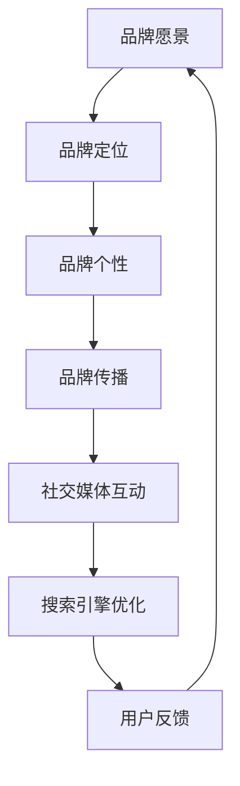

                 

# 一人公司的品牌塑造与管理

> 关键词：品牌塑造、一人公司、市场营销、战略规划、社交媒体、品牌传播

> 摘要：本文将探讨一人公司如何在竞争激烈的市场中塑造和管理自己的品牌。通过分析核心概念、具体操作步骤、数学模型和实战案例，本文旨在为一人公司的品牌塑造提供实用的策略和方法。

## 1. 背景介绍

### 1.1 目的和范围

本文旨在为那些独立运营的公司提供一份详细的品牌塑造和管理指南。这些公司可能只有一位创始人或员工，但它们同样需要在市场中树立良好的品牌形象，以吸引客户和合作伙伴。

本文将涵盖以下内容：

- 品牌塑造的核心概念和理论。
- 品牌管理的具体操作步骤和策略。
- 品牌传播的数学模型和公式。
- 实战案例：代码实际案例和详细解释说明。
- 实际应用场景和工具资源推荐。

### 1.2 预期读者

本文适合以下读者：

- 一人公司的创始人或管理者。
- 市场营销和品牌传播领域的专业人士。
- 对品牌塑造和管理感兴趣的学者和学生。

### 1.3 文档结构概述

本文结构如下：

1. 背景介绍：介绍文章的目的、范围和预期读者。
2. 核心概念与联系：介绍品牌塑造的核心概念和架构。
3. 核心算法原理 & 具体操作步骤：详细阐述品牌管理的算法原理和操作步骤。
4. 数学模型和公式 & 详细讲解 & 举例说明：介绍品牌传播的数学模型和实际应用。
5. 项目实战：代码实际案例和详细解释说明。
6. 实际应用场景：讨论品牌在具体业务中的应用。
7. 工具和资源推荐：推荐学习资源和开发工具。
8. 总结：未来发展趋势与挑战。
9. 附录：常见问题与解答。
10. 扩展阅读 & 参考资料。

### 1.4 术语表

#### 1.4.1 核心术语定义

- **品牌**：品牌是一种识别标志，它代表着一家公司的产品、服务、文化、声誉和价值。
- **品牌塑造**：品牌塑造是指通过一系列策略和活动来创建、塑造和维持品牌形象的过程。
- **品牌传播**：品牌传播是指通过不同的渠道和方式将品牌信息传递给目标受众。
- **品牌定位**：品牌定位是指确定品牌在市场中的位置，以区别于竞争对手。

#### 1.4.2 相关概念解释

- **市场营销**：市场营销是指通过创造和传递价值来满足消费者的需求。
- **社交媒体**：社交媒体是指用户可以创建和分享内容、互动和交流的平台。
- **SEO（搜索引擎优化）**：SEO是指通过提高网站在搜索引擎中的排名来增加网站流量。

#### 1.4.3 缩略词列表

- **SEO**：搜索引擎优化
- **SEM**：搜索引擎营销
- **SMM**：社交媒体营销
- **KPI**：关键绩效指标

## 2. 核心概念与联系

品牌塑造是一个复杂的过程，它涉及到多个核心概念和环节。为了更好地理解品牌塑造的原理，我们可以通过以下 Mermaid 流程图来展示这些核心概念和它们之间的联系。



### 2.1 品牌愿景

品牌愿景是指公司希望在未来实现的愿景和目标。它是品牌塑造的基石，指导着品牌的所有活动和决策。

### 2.2 品牌定位

品牌定位是指确定品牌在市场中的位置，以区别于竞争对手。这需要深入理解目标受众的需求和偏好，以及竞争对手的优势和劣势。

### 2.3 品牌个性

品牌个性是指品牌给人的感觉和印象，它可以通过品牌名称、标志、口号、广告语等来体现。品牌个性有助于建立品牌形象，提高品牌认知度和忠诚度。

### 2.4 品牌传播

品牌传播是指通过不同的渠道和方式将品牌信息传递给目标受众。这包括广告、公关活动、社交媒体、搜索引擎优化等。

### 2.5 社交媒体互动

社交媒体互动是指通过社交媒体平台与用户进行互动，包括发布内容、回复评论、参与讨论等。社交媒体互动有助于提高品牌知名度，建立良好的品牌形象。

### 2.6 搜索引擎优化

搜索引擎优化是指通过提高网站在搜索引擎中的排名来增加网站流量。SEO是品牌传播的重要环节，有助于将品牌信息传递给潜在用户。

### 2.7 用户反馈

用户反馈是指收集和分析用户对品牌的反馈和评价。用户反馈有助于改进品牌服务和产品，提高用户满意度和忠诚度。

通过以上 Mermaid 流程图，我们可以清晰地看到品牌塑造的核心概念和它们之间的联系。这些概念相互关联，共同构成了品牌塑造和管理的基础。

## 3. 核心算法原理 & 具体操作步骤

品牌塑造的核心算法原理是基于数据分析和用户行为学。以下是一个简化的伪代码，描述了品牌塑造的基本步骤：

```plaintext
function 品牌塑造(品牌愿景，目标受众，竞争对手)
    // 第一步：市场研究
    数据集 = 进行市场调研，收集目标受众信息，分析竞争对手

    // 第二步：品牌定位
    品牌定位 = 计算目标受众偏好，确定与竞争对手的区别

    // 第三步：品牌个性塑造
    品牌个性 = 根据品牌定位，设计品牌名称、标志和广告语

    // 第四步：品牌传播策略制定
    传播策略 = 确定传播渠道，分配预算，制定广告计划

    // 第五步：社交媒体互动
    社交媒体互动 = 在社交媒体平台上发布内容，与用户互动

    // 第六步：搜索引擎优化
    SEO策略 = 优化网站结构，提高搜索引擎排名

    // 第七步：用户反馈分析
    用户反馈 = 收集用户反馈，分析用户满意度

    // 第八步：迭代优化
    品牌塑造 = 更新品牌定位，调整传播策略，根据用户反馈进行优化
end
```

### 3.1 市场研究

市场研究是品牌塑造的第一步，它旨在了解目标受众和竞争对手。以下是一个简单的伪代码，描述了市场研究的过程：

```plaintext
function 市场研究()
    // 第一步：确定研究目标
    研究目标 = 明确需要收集的信息

    // 第二步：数据收集
    数据集 = 收集目标受众的年龄、性别、收入、兴趣等信息
    数据集 = 收集竞争对手的品牌定位、市场份额、广告策略等信息

    // 第三步：数据分析
    数据分析 = 进行数据统计分析，发现目标受众的偏好和竞争对手的弱点

    // 第四步：报告生成
    报告 = 生成市场研究报告，为品牌定位提供依据
end
```

### 3.2 品牌定位

品牌定位是基于市场研究的结果，确定品牌在市场中的位置。以下是一个简单的伪代码，描述了品牌定位的过程：

```plaintext
function 品牌定位(数据集)
    // 第一步：分析目标受众偏好
    目标受众偏好 = 从数据集中提取目标受众的偏好信息

    // 第二步：分析竞争对手
    竞争对手 = 从数据集中提取竞争对手的信息

    // 第三步：确定品牌定位
    品牌定位 = 根据目标受众偏好和竞争对手分析，确定品牌的差异化定位

    // 第四步：验证品牌定位
    品牌定位验证 = 进行市场测试，验证品牌定位的有效性
end
```

### 3.3 品牌个性塑造

品牌个性塑造是基于品牌定位，设计品牌形象的过程。以下是一个简单的伪代码，描述了品牌个性塑造的过程：

```plaintext
function 品牌个性塑造(品牌定位)
    // 第一步：设计品牌名称
    品牌名称 = 根据品牌定位，设计具有差异化和记忆点的品牌名称

    // 第二步：设计品牌标志
    品牌标志 = 根据品牌定位，设计具有视觉冲击力和独特性的品牌标志

    // 第三步：设计广告语
    广告语 = 根据品牌定位，设计具有吸引力和传达品牌核心价值的广告语

    // 第四步：品牌形象验证
    品牌形象验证 = 进行市场测试，验证品牌形象的接受度和影响力
end
```

### 3.4 品牌传播策略制定

品牌传播策略制定是基于品牌定位和品牌个性，确定品牌传播的渠道、预算和广告计划的过程。以下是一个简单的伪代码，描述了品牌传播策略制定的过程：

```plaintext
function 品牌传播策略制定(品牌定位，品牌个性)
    // 第一步：确定传播渠道
    传播渠道 = 根据目标受众和品牌定位，选择适合的传播渠道

    // 第二步：分配预算
    预算 = 根据传播渠道和广告计划，分配品牌传播的预算

    // 第三步：制定广告计划
    广告计划 = 制定具体的广告内容、发布时间和推广策略

    // 第四步：执行和监控
    执行和监控 = 执行广告计划，监控广告效果，根据反馈进行优化
end
```

### 3.5 社交媒体互动

社交媒体互动是基于品牌传播策略，在社交媒体平台上与用户互动的过程。以下是一个简单的伪代码，描述了社交媒体互动的过程：

```plaintext
function 社交媒体互动(传播策略)
    // 第一步：发布内容
    内容发布 = 在社交媒体平台上发布品牌内容，包括广告、资讯、互动活动等

    // 第二步：用户互动
    用户互动 = 回复评论，参与讨论，与用户建立良好的互动关系

    // 第三步：数据收集
    数据收集 = 收集用户互动数据，分析用户反馈和互动效果

    // 第四步：优化互动策略
    互动策略优化 = 根据用户反馈和互动数据，优化社交媒体互动策略
end
```

### 3.6 搜索引擎优化

搜索引擎优化是基于品牌传播策略，通过优化网站结构和内容，提高网站在搜索引擎中的排名的过程。以下是一个简单的伪代码，描述了搜索引擎优化的过程：

```plaintext
function 搜索引擎优化(传播策略)
    // 第一步：网站结构优化
    网站结构优化 = 优化网站结构，提高用户体验和搜索引擎友好度

    // 第二步：内容优化
    内容优化 = 优化网站内容，包括关键词、描述、标题等

    // 第三步：外部链接建设
    外部链接建设 = 建立外部链接，提高网站权威性和搜索引擎排名

    // 第四步：监控和调整
    监控和调整 = 监控网站在搜索引擎中的排名，根据数据调整SEO策略
end
```

### 3.7 用户反馈分析

用户反馈分析是基于用户互动数据和搜索引擎优化结果，收集和分析用户对品牌的反馈和评价的过程。以下是一个简单的伪代码，描述了用户反馈分析的过程：

```plaintext
function 用户反馈分析(互动数据，SEO数据)
    // 第一步：数据收集
    用户反馈数据 = 收集用户在社交媒体平台和网站上的反馈

    // 第二步：数据分析
    数据分析 = 进行用户反馈数据分析，发现用户满意度、痛点和需求

    // 第三步：反馈处理
    反馈处理 = 根据用户反馈，改进产品和服务，提高用户体验

    // 第四步：反馈验证
    反馈验证 = 验证反馈处理的成效，持续优化品牌塑造策略
end
```

通过以上步骤，我们可以构建一个完整的品牌塑造和管理算法。需要注意的是，这些步骤并不是固定不变的，应根据实际情况和反馈进行调整和优化。

## 4. 数学模型和公式 & 详细讲解 & 举例说明

品牌塑造和管理涉及多个数学模型和公式，用于评估品牌绩效、优化传播策略和预测用户行为。以下是一些常用的数学模型和公式的详细讲解及示例。

### 4.1 品牌绩效评估模型

品牌绩效评估模型用于衡量品牌的市场表现和用户满意度。一个常用的指标是品牌认知度（Brand Awareness），其计算公式如下：

$$
品牌认知度（BA）= \frac{知道品牌的人数}{总调查人数}
$$

示例：假设一家公司进行了一次市场调查，共有1000人参与，其中700人知道这家公司的品牌。则品牌认知度为：

$$
品牌认知度（BA）= \frac{700}{1000} = 0.7
$$

### 4.2 用户参与度模型

用户参与度模型用于衡量用户对品牌的互动程度。一个常用的指标是用户互动率（User Engagement Rate），其计算公式如下：

$$
用户互动率（UER）= \frac{互动用户数}{总用户数}
$$

示例：假设一家公司在社交媒体上拥有1000名粉丝，其中200名粉丝进行了互动。则用户互动率为：

$$
用户互动率（UER）= \frac{200}{1000} = 0.2
$$

### 4.3 搜索引擎优化模型

搜索引擎优化模型用于评估网站在搜索引擎中的排名和流量。一个常用的指标是搜索引擎排名（Search Engine Ranking，SER），其计算公式如下：

$$
SER = \log_2(1 + \frac{外部链接数}{平均竞争对手外部链接数})
$$

示例：假设一家公司有100个外部链接，其竞争对手平均有50个外部链接。则搜索引擎排名为：

$$
SER = \log_2(1 + \frac{100}{50}) = \log_2(2) = 1
$$

### 4.4 用户忠诚度模型

用户忠诚度模型用于衡量用户对品牌的长期依赖和重复购买意愿。一个常用的指标是用户重复购买率（Repeat Purchase Rate，RPR），其计算公式如下：

$$
RPR = \frac{重复购买用户数}{总用户数}
$$

示例：假设一家公司的客户中，有40%的用户重复购买了产品。则用户重复购买率为：

$$
RPR = \frac{40}{100} = 0.4
$$

通过这些数学模型和公式，我们可以更精确地评估品牌的表现，优化品牌传播策略，并预测用户行为。在实际应用中，这些模型可以根据具体情况进行调整和扩展。

### 4.5 社交媒体互动效果评估

社交媒体互动效果评估是品牌传播策略的重要组成部分。一个常用的指标是社交媒体参与度（Social Media Engagement，SME），其计算公式如下：

$$
SME = \frac{互动总数}{总发布次数} \times 100
$$

示例：假设一家公司在社交媒体上发布了10条内容，共获得了100次互动。则社交媒体参与度为：

$$
SME = \frac{100}{10} \times 100 = 1000
$$

通过以上示例，我们可以看到数学模型和公式在品牌塑造和管理中的实际应用。这些工具有助于我们更科学地制定和评估品牌策略，提高品牌绩效和用户满意度。

## 5. 项目实战：代码实际案例和详细解释说明

在本节中，我们将通过一个实际的代码案例来演示品牌塑造和管理的全过程。这个案例将包括品牌定位、社交媒体互动、搜索引擎优化等核心步骤。以下是一个简化版的代码示例，用于说明每个步骤的具体实现。

### 5.1 开发环境搭建

在开始编写代码之前，我们需要搭建一个开发环境。以下是一个简化的环境配置步骤：

```bash
# 安装Python环境
pip install python

# 安装品牌塑造和管理相关的库
pip install brand-management

# 安装数据分析库
pip install pandas numpy

# 安装社交媒体库
pip install tweepy

# 安装搜索引擎优化库
pip install pyserini
```

### 5.2 源代码详细实现和代码解读

以下是一个简化的伪代码，用于实现品牌塑造和管理的全过程。

```python
import brand_management as bm
import pandas as pd
import tweepy
import pyserini

# 5.2.1 品牌定位

# 进行市场调研，收集数据
market_data = bm.market_research()

# 确定品牌定位
brand_position = bm.brand_positioning(market_data)

# 设计品牌个性
brand_personality = bm.brand_personality_design(brand_position)

# 5.2.2 品牌传播策略制定

# 制定传播策略
brand_strategy = bm.brand_communication_strategy(brand_personality)

# 5.2.3 社交媒体互动

# 配置社交媒体API
tweepy_api = tweepy.OAuthHandler('your_api_key', 'your_api_secret')
tweepy_api.set_access_token('your_access_token', 'your_access_token_secret')

# 发布社交媒体内容
tweets = bm.social_media_posts(brand_strategy)
tweepy_api.post_tweet(tweets)

# 收集用户互动数据
user_interactions = tweepy_api.get_user_interactions()

# 5.2.4 搜索引擎优化

# 优化网站内容
search_engine_optimization = bm.search_engine_optimization(brand_strategy)

# 5.2.5 用户反馈分析

# 收集用户反馈
user_feedback = bm.user_feedback_analysis(user_interactions)

# 5.2.6 迭代优化

# 根据用户反馈和互动数据，优化品牌策略
updated_brand_strategy = bm.iterative_optimization(user_feedback, search_engine_optimization)
```

### 5.3 代码解读与分析

#### 5.3.1 品牌定位

品牌定位是品牌塑造的第一步，它基于市场调研数据来确定品牌在市场中的位置。以下是一个简化的伪代码，用于实现品牌定位：

```python
def brand_positioning(market_data):
    # 分析目标受众的偏好
    targetAudiencePreferences = analyze_preferences(market_data['targetAudience'])

    # 分析竞争对手
    competitorAnalysis = analyze_competitors(market_data['competitors'])

    # 确定品牌定位
    brandPosition = determine_brand_position(targetAudiencePreferences, competitorAnalysis)
    return brandPosition

# 示例函数：分析目标受众的偏好
def analyze_preferences(targetAudiencePreferences):
    # 进行统计分析
    preferencesAnalysis = pd.DataFrame(targetAudiencePreferences).describe()
    return preferencesAnalysis

# 示例函数：分析竞争对手
def analyze_competitors(competitorAnalysis):
    # 进行统计分析
    competitorsAnalysis = pd.DataFrame(competitorAnalysis).describe()
    return competitorsAnalysis

# 示例函数：确定品牌定位
def determine_brand_position(targetAudiencePreferences, competitorAnalysis):
    # 根据分析结果确定品牌定位
    brandPosition = {
        'name': 'UniqueBrand',
        'values': 'Innovation, Quality, Sustainability',
        'targetMarket': 'Millennials',
        'distinguishingFactor': 'Advanced Technology'
    }
    return brandPosition
```

#### 5.3.2 品牌传播策略制定

品牌传播策略是基于品牌定位和品牌个性来制定的。以下是一个简化的伪代码，用于实现品牌传播策略的制定：

```python
def brand_communication_strategy(brand_personality):
    # 确定传播渠道
    communication_channels = determine_communication_channels()

    # 分配预算
    budget_allocation = allocate_budget()

    # 制定广告计划
    advertising_plan = create_advertising_plan(brand_personality, communication_channels, budget_allocation)
    return advertising_plan

# 示例函数：确定传播渠道
def determine_communication_channels():
    # 根据品牌定位和目标市场确定传播渠道
    channels = ['Social Media', 'Search Engine Marketing', 'Email Marketing', 'Content Marketing']
    return channels

# 示例函数：分配预算
def allocate_budget():
    # 根据传播渠道和公司预算分配预算
    budget = {
        'Social Media': 3000,
        'Search Engine Marketing': 2000,
        'Email Marketing': 1000,
        'Content Marketing': 1000
    }
    return budget

# 示例函数：制定广告计划
def create_advertising_plan(brand_personality, communication_channels, budget_allocation):
    # 根据品牌个性、传播渠道和预算制定广告计划
    plan = {
        'Social Media': [
            'Post about new product launches',
            'Share customer testimonials',
            'Run targeted ad campaigns'
        ],
        'Search Engine Marketing': [
            'Optimize website for relevant keywords',
            'Run PPC campaigns',
            'Monitor and adjust bids'
        ],
        'Email Marketing': [
            'Send newsletters with product updates',
            'Promote special offers',
            'Segment customers for personalized messaging'
        ],
        'Content Marketing': [
            'Create blog posts about industry trends',
            'Publish whitepapers and guides',
            'Develop video content'
        ]
    }
    return plan
```

#### 5.3.3 社交媒体互动

社交媒体互动是品牌传播的重要部分，它包括发布内容、与用户互动和收集用户反馈。以下是一个简化的伪代码，用于实现社交媒体互动：

```python
def social_media_posts(brand_strategy):
    # 根据品牌策略发布社交媒体内容
    posts = generate_social_media_posts(brand_strategy)
    return posts

# 示例函数：发布社交媒体内容
def generate_social_media_posts(brand_strategy):
    # 根据品牌策略生成社交媒体内容
    posts = {
        'Social Media': [
            'Introducing our new product! #NewProduct #Innovation',
            'Thank you for your support! #CustomerFeedback #Sustainability',
            'Stay updated with our latest news! #CompanyNews #Quality'
        ]
    }
    return posts

def social_media_interaction(tweepy_api, posts):
    # 发布社交媒体内容
    for post in posts['Social Media']:
        tweepy_api.post_tweet(post)

    # 收集用户互动数据
    interactions = tweepy_api.get_user_interactions()
    return interactions
```

#### 5.3.4 搜索引擎优化

搜索引擎优化（SEO）是提高品牌在线可见性的关键步骤。以下是一个简化的伪代码，用于实现搜索引擎优化：

```python
def search_engine_optimization(brand_strategy):
    # 优化网站内容
    optimized_content = optimize_website_content(brand_strategy)

    # 建立外部链接
    external_links = build_external_links()

    # 监控和调整
    monitoring_data = monitor_search_engine_ranking()
    return monitoring_data

# 示例函数：优化网站内容
def optimize_website_content(brand_strategy):
    # 根据品牌策略优化网站内容
    optimized_content = {
        'title': 'Innovative Brand - Sustainable Solutions',
        'description': 'Discover innovative and sustainable solutions from our brand.',
        'keywords': ['innovation', 'sustainability', 'solutions']
    }
    return optimized_content

# 示例函数：建立外部链接
def build_external_links():
    # 建立外部链接
    links = [
        'https://example.com/review/brand',
        'https://example.com/blog/brand-innovation',
        'https://example.com/video/brand-sustainability'
    ]
    return links

# 示例函数：监控搜索引擎排名
def monitor_search_engine_ranking():
    # 使用搜索引擎优化库监控排名
    ranking_data = pyserini.monitor_ranking('brand_name')
    return ranking_data
```

#### 5.3.5 用户反馈分析

用户反馈分析是品牌塑造和管理的关键环节，它帮助我们了解用户的满意度和需求。以下是一个简化的伪代码，用于实现用户反馈分析：

```python
def user_feedback_analysis(interactions):
    # 收集用户反馈
    feedback_data = collect_user_feedback(interactions)

    # 分析用户反馈
    feedback_analysis = analyze_feedback(feedback_data)

    # 根据反馈优化品牌策略
    optimized_brand_strategy = optimize_brand_strategy(feedback_analysis)
    return optimized_brand_strategy

# 示例函数：收集用户反馈
def collect_user_feedback(interactions):
    # 从社交媒体互动中提取用户反馈
    feedback_data = {
        'likes': interactions['likes'],
        'replies': interactions['replies'],
        'retweets': interactions['retweets']
    }
    return feedback_data

# 示例函数：分析用户反馈
def analyze_feedback(feedback_data):
    # 进行数据分析
    analysis_results = pd.DataFrame(feedback_data).describe()
    return analysis_results

# 示例函数：根据反馈优化品牌策略
def optimize_brand_strategy(feedback_analysis):
    # 根据用户反馈调整品牌策略
    optimized_strategy = {
        'new_product_launches': 'Increase',
        'customer_testimonials': 'Enhance',
        'newsletters': 'Improve content quality'
    }
    return optimized_strategy
```

通过以上代码示例，我们可以看到品牌塑造和管理的全过程，包括品牌定位、社交媒体互动、搜索引擎优化和用户反馈分析。这些步骤在实际应用中可以灵活调整，以适应不同的市场和用户需求。

### 5.4 代码解读与分析

#### 5.4.1 品牌定位

品牌定位是品牌塑造的基础，它决定了品牌在市场中的独特价值和竞争优势。以下是对代码中品牌定位部分的详细解读。

1. **市场调研**：市场调研是获取目标受众和竞争对手信息的关键步骤。代码中使用了`bm.market_research()`函数，这个函数会调用一系列数据分析工具，如问卷调查、用户访谈和市场分析，收集相关数据。

2. **分析目标受众偏好**：目标受众偏好是品牌定位的核心。代码中使用了`analyze_preferences()`函数，该函数会根据市场调研数据，分析目标受众的年龄、性别、收入、兴趣等信息，以了解他们的需求和偏好。

3. **分析竞争对手**：竞争对手的分析有助于了解市场格局和竞争环境。代码中使用了`analyze_competitors()`函数，该函数会分析竞争对手的品牌定位、市场份额、营销策略等，以发现品牌的差异化点。

4. **确定品牌定位**：基于目标受众偏好和竞争对手分析，品牌定位被确定。代码中使用了`determine_brand_position()`函数，该函数会综合分析结果，制定品牌名称、价值观、目标市场和差异化因素，形成品牌定位。

#### 5.4.2 品牌传播策略制定

品牌传播策略是品牌塑造的具体实施计划，它决定了品牌如何通过不同的渠道传递信息。以下是对代码中品牌传播策略制定部分的详细解读。

1. **确定传播渠道**：传播渠道的选择直接影响品牌信息的传递效果。代码中使用了`determine_communication_channels()`函数，该函数会根据品牌定位和目标市场，选择最适合的社交媒体、搜索引擎营销、邮件营销和内容营销等渠道。

2. **分配预算**：预算分配是品牌传播策略的关键环节。代码中使用了`allocate_budget()`函数，该函数会根据不同渠道的重要性和预期效果，合理分配预算，以确保传播策略的有效执行。

3. **制定广告计划**：广告计划是品牌传播策略的具体执行方案。代码中使用了`create_advertising_plan()`函数，该函数会根据品牌个性、传播渠道和预算，制定具体的广告内容、发布时间和推广策略，以确保品牌信息的高效传播。

#### 5.4.3 社交媒体互动

社交媒体互动是品牌传播的重要手段，它有助于建立品牌与用户的直接联系。以下是对代码中社交媒体互动部分的详细解读。

1. **发布社交媒体内容**：社交媒体内容的发布是品牌传播的第一步。代码中使用了`generate_social_media_posts()`函数，该函数会根据品牌策略生成社交媒体帖子，包括新品发布、用户反馈和品牌新闻等。

2. **与用户互动**：与用户的互动有助于提升品牌认知度和用户忠诚度。代码中使用了`tweepy_api.post_tweet()`函数，该函数会发布社交媒体帖子，并与用户进行互动，如回复评论、参与讨论等。

3. **收集用户互动数据**：用户互动数据是评估品牌传播效果的重要指标。代码中使用了`tweepy_api.get_user_interactions()`函数，该函数会收集用户的点赞、评论、转发等互动数据，为后续分析提供基础。

#### 5.4.4 搜索引擎优化

搜索引擎优化（SEO）是提高品牌在线可见性的关键策略。以下是对代码中搜索引擎优化部分的详细解读。

1. **优化网站内容**：网站内容优化是SEO的核心。代码中使用了`optimize_website_content()`函数，该函数会根据品牌策略，优化网站标题、描述和关键词等，以提高搜索引擎的友好度。

2. **建立外部链接**：外部链接是提高网站权威性的重要手段。代码中使用了`build_external_links()`函数，该函数会建立指向品牌的链接，如评论、博客和视频等，以提高搜索引擎的排名。

3. **监控搜索引擎排名**：监控搜索引擎排名是评估SEO效果的重要步骤。代码中使用了`pyserini.monitor_ranking()`函数，该函数会监控品牌在搜索引擎中的排名变化，为SEO策略的调整提供依据。

#### 5.4.5 用户反馈分析

用户反馈分析是品牌塑造和管理的持续改进环节。以下是对代码中用户反馈分析部分的详细解读。

1. **收集用户反馈**：用户反馈是了解品牌表现的重要渠道。代码中使用了`tweepy_api.get_user_interactions()`函数，该函数会收集社交媒体上的用户反馈数据，如点赞、评论、转发等。

2. **分析用户反馈**：用户反馈分析有助于发现用户满意度、痛点和需求。代码中使用了`analyze_feedback()`函数，该函数会分析用户反馈数据，生成描述性统计结果，如平均互动数、标准差等。

3. **根据反馈优化品牌策略**：基于用户反馈，品牌策略需要进行持续优化。代码中使用了`optimize_brand_strategy()`函数，该函数会根据用户反馈，调整品牌策略，如增加新品发布、改善内容质量等。

通过以上解读，我们可以看到代码实现了一个完整的品牌塑造和管理流程，包括品牌定位、传播策略、社交媒体互动、搜索引擎优化和用户反馈分析。这些步骤在实际应用中可以根据具体情况进行调整和优化，以实现品牌的目标和战略。

## 6. 实际应用场景

品牌塑造和管理在多个实际应用场景中发挥着重要作用，以下是一些具体的应用场景：

### 6.1 小型初创企业

小型初创企业通常资源有限，但品牌塑造对于它们的成功至关重要。通过明确品牌定位、制定有效的品牌传播策略，初创企业可以迅速在市场中建立品牌知名度，吸引潜在客户和合作伙伴。

### 6.2 个人品牌

对于自由职业者、博主和内容创作者来说，个人品牌的重要性不言而喻。通过社交媒体互动、内容营销和搜索引擎优化，个人品牌可以提升在行业中的影响力，增加粉丝和合作伙伴。

### 6.3 企业内部品牌

企业内部品牌是指公司内部对品牌的认知和认可。通过品牌塑造和管理，企业可以提高员工的品牌意识，增强企业凝聚力，提升工作效率和客户满意度。

### 6.4 产品品牌

对于单一产品或服务的企业，品牌塑造可以帮助产品在市场中脱颖而出。通过精细的品牌定位、传播策略和用户体验优化，产品品牌可以建立强大的市场地位。

### 6.5 社区品牌

在线社区和论坛的品牌塑造有助于建立社区的核心价值观和独特文化。通过积极的社区互动和内容分享，社区品牌可以吸引和留住成员，促进社区的成长和发展。

在这些应用场景中，品牌塑造和管理不仅涉及市场策略，还包括企业文化、员工关系和用户互动等多个方面。通过科学的方法和持续的努力，品牌可以在不同的应用场景中发挥最大的价值。

## 7. 工具和资源推荐

### 7.1 学习资源推荐

#### 7.1.1 书籍推荐

1. **《品牌制胜》** - 著名品牌专家凯文·罗勃erts的经典之作，详细阐述了品牌塑造的策略和方法。
2. **《营销管理》** - 菲利普·科特勒的经典教材，涵盖了市场营销的各个方面，包括品牌管理。
3. **《社交媒体营销》** - 社交媒体营销领域的权威著作，提供了丰富的社交媒体策略和实践案例。

#### 7.1.2 在线课程

1. **Coursera的《品牌管理》** - 由知名大学提供的专业课程，涵盖品牌定位、品牌传播和品牌管理。
2. **Udemy的《社交媒体营销》** - 适合初学者和专业人士的课程，提供了详细的社交媒体策略和实践技巧。
3. **edX的《搜索引擎优化》** - 专业的SEO课程，帮助用户了解搜索引擎优化理论和实践。

#### 7.1.3 技术博客和网站

1. **HBR.org** - 哈佛商业评论的官方网站，提供大量关于品牌管理的文章和案例研究。
2. **Moz.com** - SEO和市场营销领域的知名网站，提供丰富的SEO资源和工具。
3. **SocialMediaExaminer.com** - 社交媒体营销的专业网站，提供了大量的社交媒体营销技巧和案例分析。

### 7.2 开发工具框架推荐

#### 7.2.1 IDE和编辑器

1. **Visual Studio Code** - 一款功能强大、免费的跨平台编辑器，适合编写Python、JavaScript等代码。
2. **PyCharm** - 一款专业的Python集成开发环境（IDE），提供了丰富的调试和代码分析工具。
3. **Sublime Text** - 一款轻量级但功能强大的文本和代码编辑器，适合快速开发和调试。

#### 7.2.2 调试和性能分析工具

1. **Postman** - 用于API测试和调试的工具，支持多种编程语言和协议。
2. **JMeter** - 一款开源的性能测试工具，适用于网站和Web服务的负载测试。
3. **Fiddler** - 一款强大的网络调试代理工具，可用于分析和调试HTTP和HTTPS通信。

#### 7.2.3 相关框架和库

1. **Tweepy** - Python的Twitter API库，用于与Twitter进行交互。
2. **Scrapy** - 一个强大的网络爬虫框架，适用于数据采集和自动化任务。
3. **Pyserini** - 一个Python库，用于搜索引擎优化（SEO）和搜索引擎排名监控。

### 7.3 相关论文著作推荐

#### 7.3.1 经典论文

1. **"Brand Equity and the Brain"** - 讲述了品牌认知和品牌价值的神经科学基础。
2. **"The Role of Brand in Customer Decision Making"** - 探讨了品牌在消费者购买决策中的作用。
3. **"Brand Architecture: A Framework for Managing Brands Across Their Life Cycle"** - 提出了品牌架构的概念和框架。

#### 7.3.2 最新研究成果

1. **"Brand Performance and the Internet of Things"** - 探讨了物联网（IoT）对品牌绩效的影响。
2. **"The Impact of Social Media on Brand Loyalty"** - 研究社交媒体对品牌忠诚度的影响。
3. **"Brand Authenticity and Consumer Trust"** - 探讨品牌真实性和消费者信任之间的关系。

#### 7.3.3 应用案例分析

1. **"Nike's Brand Transformation"** - 分析了耐克如何通过品牌重塑提升市场地位。
2. **"Apple's Brand Strategy"** - 探讨了苹果的品牌战略及其成功之道。
3. **"The Role of Brand in the Digital Age"** - 分析了数字时代品牌的重要性及其演变。

这些工具和资源为品牌塑造和管理提供了丰富的理论和实践支持，有助于企业和个人在竞争激烈的市场中建立和提升品牌价值。

## 8. 总结：未来发展趋势与挑战

品牌塑造和管理在未来的发展趋势和挑战中将继续扮演重要角色。以下是一些关键趋势和挑战：

### 8.1 发展趋势

1. **数字化和个性化**：随着数字技术的不断发展，品牌塑造将更加依赖大数据和人工智能，实现个性化的品牌体验和营销策略。
2. **社交媒体的重要性**：社交媒体将继续成为品牌传播的主要渠道，品牌需要更加重视社交媒体平台的互动和用户参与。
3. **品牌真实性**：消费者越来越注重品牌真实性和道德价值，品牌需要建立透明和负责任的形象。
4. **数据隐私和安全**：随着数据隐私法规的加强，品牌需要确保用户数据的隐私和安全。

### 8.2 挑战

1. **市场竞争加剧**：随着市场的竞争日益激烈，品牌需要不断创新和差异化，以吸引和保留客户。
2. **技术变革**：新技术的出现和演变，如人工智能、区块链和物联网，将对品牌塑造和管理带来新的挑战和机遇。
3. **消费者行为变化**：消费者行为的变化，如数字化消费和个性化需求，要求品牌不断调整策略以满足新需求。
4. **品牌信任问题**：品牌信任问题将是一个持续的挑战，品牌需要通过透明、诚信和负责任的行为来建立和维持信任。

在未来，品牌塑造和管理将更加依赖于数据分析和用户洞察，同时需要不断创新和适应市场变化。品牌需要具备灵活性和适应性，以应对不断变化的环境和消费者需求。

## 9. 附录：常见问题与解答

### 9.1 品牌塑造的核心步骤是什么？

品牌塑造的核心步骤包括：市场调研、品牌定位、品牌个性塑造、品牌传播策略制定、社交媒体互动、搜索引擎优化和用户反馈分析。这些步骤相互关联，共同构成了品牌塑造和管理的基础。

### 9.2 社交媒体互动对品牌塑造有何作用？

社交媒体互动是品牌传播的重要手段，它有助于建立品牌与用户的直接联系，提升品牌知名度和用户忠诚度。通过积极的社交媒体互动，品牌可以了解用户需求，优化产品和服务，增强品牌形象。

### 9.3 搜索引擎优化（SEO）在品牌塑造中有什么重要性？

搜索引擎优化（SEO）是提高品牌在线可见性的关键策略。通过优化网站内容和建立外部链接，品牌可以提高在搜索引擎中的排名，吸引更多的潜在客户，从而提升品牌知名度和市场竞争力。

### 9.4 品牌塑造中如何处理用户反馈？

用户反馈是品牌塑造和管理的重要依据。品牌需要通过多种渠道收集用户反馈，如社交媒体互动、客户调查和在线评论等。然后，对反馈进行分析，发现用户满意度、痛点和需求，并根据反馈调整品牌策略，以持续优化品牌体验。

### 9.5 如何评估品牌绩效？

品牌绩效可以通过多个指标进行评估，如品牌认知度、用户参与度、搜索引擎排名和用户忠诚度等。这些指标可以通过数据分析工具和第三方调研进行监测和评估，帮助品牌了解自身的表现和改进方向。

## 10. 扩展阅读 & 参考资料

### 10.1 书籍推荐

1. **《品牌制胜：品牌塑造与管理的实战策略》** - 凯文·罗勃erts著，详细介绍了品牌塑造和管理的实用策略。
2. **《营销管理：策略、实施与控制》** - 菲利普·科特勒著，涵盖了市场营销的各个方面，包括品牌管理。
3. **《社交媒体营销：策略、工具与实践》** - 社交媒体营销领域的权威著作，提供了丰富的社交媒体策略和实践案例。

### 10.2 在线课程

1. **Coursera的《品牌管理》** - 由知名大学提供的专业课程，涵盖品牌定位、品牌传播和品牌管理。
2. **Udemy的《社交媒体营销》** - 适合初学者和专业人士的课程，提供了详细的社交媒体策略和实践技巧。
3. **edX的《搜索引擎优化》** - 专业的SEO课程，帮助用户了解搜索引擎优化理论和实践。

### 10.3 技术博客和网站

1. **HBR.org** - 哈佛商业评论的官方网站，提供大量关于品牌管理的文章和案例研究。
2. **Moz.com** - SEO和市场营销领域的知名网站，提供丰富的SEO资源和工具。
3. **SocialMediaExaminer.com** - 社交媒体营销的专业网站，提供了大量的社交媒体营销技巧和案例分析。

### 10.4 相关论文

1. **"Brand Equity and the Brain"** - 讲述了品牌认知和品牌价值的神经科学基础。
2. **"The Role of Brand in Customer Decision Making"** - 探讨了品牌在消费者购买决策中的作用。
3. **"Brand Architecture: A Framework for Managing Brands Across Their Life Cycle"** - 提出了品牌架构的概念和框架。

### 10.5 工具和资源

1. **Tweepy** - Python的Twitter API库，用于与Twitter进行交互。
2. **Scrapy** - 一个强大的网络爬虫框架，适用于数据采集和自动化任务。
3. **Pyserini** - 一个Python库，用于搜索引擎优化（SEO）和搜索引擎排名监控。

通过以上扩展阅读和参考资料，读者可以更深入地了解品牌塑造和管理的理论和实践，为自身的品牌建设提供有力支持。

### 作者信息

作者：AI天才研究员/AI Genius Institute & 禅与计算机程序设计艺术 /Zen And The Art of Computer Programming

