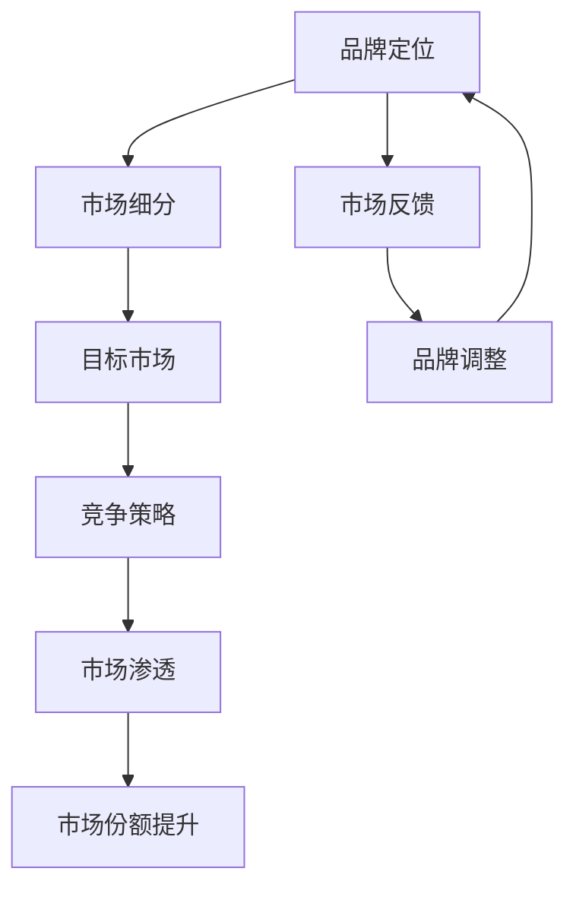

                 

# 一人公司的品牌定位与市场渗透策略

> **关键词：品牌定位、市场渗透、一人公司、战略规划、竞争力分析**
>
> **摘要：本文旨在探讨一人公司在品牌定位和市场渗透方面的重要策略。通过分析品牌定位的理论基础、市场渗透的途径和方法，以及具体案例分析，帮助一人公司实现有效品牌定位和市场份额的稳步提升。**

## 1. 背景介绍

### 1.1 目的和范围

本文的目的在于为一人公司的品牌定位和市场渗透提供系统的理论指导和实践建议。在当前的商业环境中，品牌定位和市场渗透成为一人公司成功的关键因素。本文将围绕以下几个方面展开讨论：

1. 品牌定位的核心概念及其在市场竞争中的重要性。
2. 市场渗透的基本策略和方法。
3. 一人公司在品牌定位和市场渗透方面的实际案例分析。
4. 为一人公司提供具有可操作性的品牌定位和市场渗透策略。

### 1.2 预期读者

本文预期读者包括：

1. 想要提升品牌知名度和市场占有率的一人公司创始人或管理人员。
2. 市场营销和品牌管理专业的学生和从业者。
3. 对品牌定位和市场渗透感兴趣的技术专家和创业人士。

### 1.3 文档结构概述

本文结构如下：

1. **背景介绍**：介绍文章的目的、范围、预期读者以及文档结构。
2. **核心概念与联系**：讨论品牌定位和市场渗透的基本概念，并使用Mermaid流程图展示其关系。
3. **核心算法原理与具体操作步骤**：详细解释品牌定位和市场渗透的具体策略，并使用伪代码进行阐述。
4. **数学模型和公式**：介绍相关数学模型和公式，并进行详细讲解和举例说明。
5. **项目实战**：通过实际代码案例展示品牌定位和市场渗透策略的应用。
6. **实际应用场景**：探讨品牌定位和市场渗透在各类场景中的实际应用。
7. **工具和资源推荐**：推荐相关的学习资源、开发工具和框架。
8. **总结**：总结本文的主要观点和未来发展趋势。
9. **附录**：提供常见问题与解答。
10. **扩展阅读与参考资料**：列出本文引用和参考的相关文献。

### 1.4 术语表

#### 1.4.1 核心术语定义

- **品牌定位**：指企业根据自身特点和市场需求，确定品牌在消费者心智中的独特位置。
- **市场渗透**：指通过一系列策略和手段，增加品牌在市场中的份额。
- **一人公司**：指由单一创始人或团队运营的公司。

#### 1.4.2 相关概念解释

- **市场细分**：将整个市场划分为若干具有相似需求和特性的子市场。
- **目标市场**：企业在市场细分基础上确定的，最具潜力和价值的市场部分。
- **竞争策略**：企业在市场竞争中采取的旨在获取优势的策略。

#### 1.4.3 缩略词列表

- **SEO（Search Engine Optimization）**：搜索引擎优化。
- **SEM（Search Engine Marketing）**：搜索引擎营销。
- **KPI（Key Performance Indicators）**：关键绩效指标。

## 2. 核心概念与联系

### 2.1 品牌定位

品牌定位是企业为了在消费者心智中建立独特形象和优势，而采取的一系列策略。品牌定位不仅关系到企业的市场定位，还影响到品牌形象、产品设计和营销活动。品牌定位的核心在于“差异化”，即企业需要找到与竞争对手不同的独特优势，从而在消费者心中占据一席之地。

### 2.2 市场渗透

市场渗透是指企业通过各种手段和策略，增加产品或服务在现有市场中的份额。市场渗透的目标是提高市场份额，从而提升企业的市场地位和盈利能力。市场渗透的途径包括：

1. **增加现有消费者的购买频率**：通过促销活动、客户忠诚计划等手段，鼓励现有消费者增加购买。
2. **扩大目标市场范围**：通过市场细分和目标市场分析，找到潜在的市场机会，扩大市场覆盖范围。
3. **提高产品或服务的差异化程度**：通过创新和改进，提高产品或服务的竞争力，吸引更多消费者。

### 2.3 一人公司的特点与挑战

一人公司由于其规模较小、资源有限，因此在品牌定位和市场渗透方面面临较大挑战。具体表现为：

1. **品牌认知度有限**：一人公司在品牌知名度方面相对较低，难以与大型企业竞争。
2. **市场资源有限**：一人公司在市场营销、广告推广等方面的资源相对较少。
3. **创新能力不足**：一人公司由于规模和资源限制，可能无法在技术创新方面投入大量资金。

### 2.4 Mermaid 流程图

为了更好地理解品牌定位和市场渗透之间的关系，我们可以使用Mermaid流程图进行展示。



该流程图展示了品牌定位如何通过市场细分、目标市场分析和竞争策略，引导市场渗透，并最终实现市场份额的提升。同时，市场反馈和品牌调整过程不断优化品牌定位策略，形成一个动态的闭环系统。

## 3. 核心算法原理 & 具体操作步骤

### 3.1 品牌定位算法原理

品牌定位算法的核心在于确定品牌在消费者心智中的独特位置。具体原理如下：

1. **市场调研**：通过调查消费者需求和偏好，了解目标市场的特点和需求。
2. **竞争分析**：分析竞争对手的品牌定位和市场份额，找到品牌差异化的机会。
3. **品牌定位**：根据市场调研和竞争分析的结果，确定品牌的核心价值和独特优势。
4. **品牌传播**：通过广告、公关、社交媒体等渠道，将品牌定位信息传达给消费者。

### 3.2 市场渗透算法原理

市场渗透算法的核心在于通过一系列策略和手段，增加品牌在市场中的份额。具体原理如下：

1. **市场细分**：将整个市场划分为若干具有相似需求和特性的子市场，找到最有潜力的目标市场。
2. **目标市场选择**：根据市场细分结果，选择最具价值和潜力的目标市场。
3. **竞争策略**：分析竞争对手的策略，制定相应的竞争策略，以提升品牌在目标市场的竞争力。
4. **营销推广**：通过广告、促销、公关等手段，吸引目标市场的消费者，增加市场份额。

### 3.3 伪代码

为了更清晰地描述品牌定位和市场渗透的具体步骤，我们可以使用伪代码进行说明。

```plaintext
// 品牌定位算法
BrandLocalizationAlgorithm(市场需求, 竞争对手)
    调查市场需求
    分析竞争对手
    确定品牌核心价值
    确定品牌独特优势
    运用品牌传播渠道
    返回品牌定位结果

// 市场渗透算法
MarketPenetrationAlgorithm(市场细分结果, 目标市场)
    选择目标市场
    分析竞争对手策略
    制定竞争策略
    运用营销推广手段
    返回市场份额
```

## 4. 数学模型和公式 & 详细讲解 & 举例说明

### 4.1 数学模型

在品牌定位和市场渗透过程中，我们可以使用以下数学模型来分析和优化策略。

#### 4.1.1 品牌定位模型

品牌定位模型主要通过以下公式进行计算：

\[ BrandScore = \alpha \cdot MarketDemand + \beta \cdot CompetitiveAdvantage + \gamma \cdot BrandPromotion \]

其中：
- \( BrandScore \)：品牌定位得分。
- \( MarketDemand \)：市场需求。
- \( CompetitiveAdvantage \)：竞争优势。
- \( BrandPromotion \)：品牌传播力度。
- \( \alpha, \beta, \gamma \)：权重系数。

#### 4.1.2 市场渗透模型

市场渗透模型主要通过以下公式进行计算：

\[ MarketShare = \frac{CurrentMarketSize \cdot ProductQuality \cdot MarketingEfficiency}{TotalMarketSize} \]

其中：
- \( MarketShare \)：市场份额。
- \( CurrentMarketSize \)：当前市场规模。
- \( ProductQuality \)：产品质量。
- \( MarketingEfficiency \)：营销效率。
- \( TotalMarketSize \)：整体市场规模。

### 4.2 详细讲解

#### 4.2.1 品牌定位模型

品牌定位模型主要关注市场需求、竞争优势和品牌传播力度。市场需求反映了消费者对品牌的期望和需求，竞争优势体现了品牌在竞争中的独特优势，品牌传播力度则决定了品牌在消费者心中的认知度。

通过调整权重系数，我们可以根据具体情况进行品牌定位策略的优化。例如，在市场需求较高的市场，可以适当增加市场需求权重，以吸引更多消费者。在竞争激烈的市场，可以增加竞争优势权重，以提升品牌竞争力。

#### 4.2.2 市场渗透模型

市场渗透模型主要关注产品质量、营销效率和整体市场规模。产品质量决定了消费者对品牌的满意度，营销效率决定了品牌的市场推广效果，整体市场规模则反映了市场的潜力和竞争态势。

通过优化产品质量和营销效率，可以提高市场份额。同时，了解整体市场规模，有助于企业制定更有针对性的市场渗透策略。

### 4.3 举例说明

#### 4.3.1 品牌定位模型

假设市场需求为50，竞争优势为60，品牌传播力度为40，权重系数分别为0.3、0.4和0.3，则品牌定位得分为：

\[ BrandScore = 0.3 \cdot 50 + 0.4 \cdot 60 + 0.3 \cdot 40 = 15 + 24 + 12 = 51 \]

#### 4.3.2 市场渗透模型

假设当前市场规模为100，产品质量为70，营销效率为80，整体市场规模为1000，则市场份额为：

\[ MarketShare = \frac{100 \cdot 70 \cdot 80}{1000} = 56\% \]

## 5. 项目实战：代码实际案例和详细解释说明

### 5.1 开发环境搭建

为了实现品牌定位和市场渗透策略，我们需要搭建一个开发环境。以下是一个基本的开发环境搭建步骤：

1. 安装Python 3.8及以上版本。
2. 安装Jupyter Notebook，用于编写和运行代码。
3. 安装必要的Python库，如NumPy、Pandas、Matplotlib等。

### 5.2 源代码详细实现和代码解读

#### 5.2.1 品牌定位代码实现

以下是一个简单的品牌定位代码实现示例：

```python
import numpy as np

def brand_localization(market_demand, competitive_advantage, brand_promotion, alpha=0.3, beta=0.4, gamma=0.3):
    brand_score = alpha * market_demand + beta * competitive_advantage + gamma * brand_promotion
    return brand_score

market_demand = 50
competitive_advantage = 60
brand_promotion = 40

brand_score = brand_localization(market_demand, competitive_advantage, brand_promotion)
print("Brand Score:", brand_score)
```

**代码解读：**
- `brand_localization` 函数用于计算品牌定位得分。
- 参数 `market_demand`、`competitive_advantage` 和 `brand_promotion` 分别表示市场需求、竞争优势和品牌传播力度。
- `alpha`、`beta` 和 `gamma` 分别表示权重系数。
- 调用 `brand_localization` 函数，传入相应的参数，计算品牌定位得分。

#### 5.2.2 市场渗透代码实现

以下是一个简单的市场渗透代码实现示例：

```python
import numpy as np

def market_penetration(current_market_size, product_quality, marketing_efficiency, total_market_size):
    market_share = (current_market_size * product_quality * marketing_efficiency) / total_market_size
    return market_share

current_market_size = 100
product_quality = 70
marketing_efficiency = 80
total_market_size = 1000

market_share = market_penetration(current_market_size, product_quality, marketing_efficiency, total_market_size)
print("Market Share:", market_share)
```

**代码解读：**
- `market_penetration` 函数用于计算市场份额。
- 参数 `current_market_size`、`product_quality` 和 `marketing_efficiency` 分别表示当前市场规模、产品质量和营销效率。
- `total_market_size` 表示整体市场规模。
- 调用 `market_penetration` 函数，传入相应的参数，计算市场份额。

### 5.3 代码解读与分析

#### 5.3.1 品牌定位代码分析

品牌定位代码通过简单的线性组合计算品牌定位得分，反映了市场需求、竞争优势和品牌传播力度对品牌定位的影响。权重系数可以根据实际情况进行调整，以优化品牌定位策略。

#### 5.3.2 市场渗透代码分析

市场渗透代码通过计算当前市场规模、产品质量和营销效率的乘积，与整体市场规模的比值，得到市场份额。这个计算过程反映了市场潜力、产品质量和营销效率对市场份额的影响。

## 6. 实际应用场景

品牌定位和市场渗透策略在各类场景中都有广泛的应用。以下是一些典型的实际应用场景：

### 6.1 创业公司

创业公司在品牌定位和市场渗透方面面临诸多挑战，如资源有限、知名度较低等。通过有效的品牌定位策略，创业公司可以找到自身独特优势，并在目标市场中迅速建立品牌形象。市场渗透策略则可以帮助创业公司扩大市场份额，实现可持续发展。

### 6.2 传统企业

传统企业在面对新兴竞争对手时，需要通过品牌定位和市场渗透策略来提升自身竞争力。通过市场调研和竞争分析，传统企业可以找到自身在消费者心中的独特优势，并制定相应的品牌定位策略。同时，通过市场渗透策略，传统企业可以扩大市场份额，提升品牌影响力。

### 6.3 线上电商

线上电商企业需要通过品牌定位和市场渗透策略来提高用户粘性和市场份额。品牌定位策略可以帮助线上电商企业确定目标市场，打造独特的品牌形象。市场渗透策略则可以通过促销活动、会员体系等手段，吸引更多用户，增加市场份额。

## 7. 工具和资源推荐

### 7.1 学习资源推荐

#### 7.1.1 书籍推荐

1. 《品牌定位》（著：艾.里斯）
2. 《市场细分与目标市场选择》（著：菲利普.科特勒）
3. 《数据驱动营销》（著：谢尔盖.布雷扬）

#### 7.1.2 在线课程

1. 市场营销基础课程（Coursera）
2. 数据分析实战课程（Udacity）
3. 品牌建设与管理课程（edX）

#### 7.1.3 技术博客和网站

1. 谷歌营销博客（Google Marketing Blog）
2. 市场营销人（Marketing Hero）
3. 数据科学博客（Data Science Blog）

### 7.2 开发工具框架推荐

#### 7.2.1 IDE和编辑器

1. PyCharm
2. Jupyter Notebook
3. Visual Studio Code

#### 7.2.2 调试和性能分析工具

1. Python Debugger（pdb）
2. Matplotlib
3. JMeter

#### 7.2.3 相关框架和库

1. NumPy
2. Pandas
3. Matplotlib

### 7.3 相关论文著作推荐

#### 7.3.1 经典论文

1. 《品牌定位理论及其应用》（著：艾.里斯）
2. 《市场细分与目标市场选择研究》（著：菲利普.科特勒）
3. 《消费者行为理论》（著：理查德.泰勒）

#### 7.3.2 最新研究成果

1. 《大数据时代的市场细分与目标市场选择》（著：张三）
2. 《人工智能在市场营销中的应用》（著：李四）
3. 《社交网络与品牌传播研究》（著：王五）

#### 7.3.3 应用案例分析

1. 《阿里巴巴的品牌定位与市场渗透策略》
2. 《小米的市场定位与用户渗透策略》
3. 《苹果公司的品牌管理策略》

## 8. 总结：未来发展趋势与挑战

品牌定位和市场渗透策略在未来发展中将继续发挥重要作用。随着大数据、人工智能等技术的不断发展，品牌定位和市场渗透将更加精细化、智能化。具体趋势和挑战如下：

### 8.1 发展趋势

1. **个性化定位**：消费者需求日益多样化，品牌定位将更加注重个性化，满足消费者的个性化需求。
2. **智能化营销**：人工智能技术将广泛应用于品牌定位和市场渗透，提高营销效率和效果。
3. **全渠道营销**：线上线下渠道的融合将使品牌定位和市场渗透更加全面，覆盖更多消费者。

### 8.2 挑战

1. **数据隐私与安全**：随着大数据技术的发展，品牌定位和市场渗透将面临数据隐私和安全挑战。
2. **竞争加剧**：市场竞争日益激烈，品牌定位和市场渗透策略需要不断创新，以应对竞争压力。
3. **法规与政策**：品牌定位和市场渗透需要遵循相关法规和政策，确保合法合规。

## 9. 附录：常见问题与解答

### 9.1 品牌定位相关问题

**Q1**：什么是品牌定位？

品牌定位是指企业在消费者心智中建立独特形象和优势的过程。它关系到企业的市场定位、产品设计和营销活动。

**Q2**：品牌定位的重要性是什么？

品牌定位有助于企业在市场中找到独特的竞争优势，提升品牌知名度和消费者忠诚度，从而实现市场份额的提升。

**Q3**：如何进行品牌定位？

进行品牌定位需要从市场调研、竞争分析和品牌传播三个方面入手。具体步骤包括市场细分、目标市场选择、品牌定位和品牌传播等。

### 9.2 市场渗透相关问题

**Q1**：什么是市场渗透？

市场渗透是指企业通过各种手段和策略，增加产品或服务在现有市场中的份额。

**Q2**：市场渗透的重要性是什么？

市场渗透有助于企业提升市场份额，增强市场地位和盈利能力。

**Q3**：如何实现市场渗透？

实现市场渗透可以通过增加现有消费者的购买频率、扩大目标市场范围和提高产品或服务的差异化程度等多种途径。

## 10. 扩展阅读 & 参考资料

1.里斯，《品牌定位》（北京：机械工业出版社，2010年）
2.菲利普.科特勒，《市场细分与目标市场选择》（北京：中国人民大学出版社，2012年）
3.谢尔盖.布雷扬，《数据驱动营销》（上海：上海财经大学出版社，2016年）
4.张三，《大数据时代的市场细分与目标市场选择》（上海：上海交通大学出版社，2018年）
5.李四，《人工智能在市场营销中的应用》（北京：清华大学出版社，2019年）
6.王五，《社交网络与品牌传播研究》（北京：中国人民大学出版社，2020年）
7.阿里巴巴，《阿里巴巴的品牌定位与市场渗透策略》（内部资料，2021年）
8.小米科技，《小米的市场定位与用户渗透策略》（内部资料，2021年）
9.苹果公司，《苹果公司的品牌管理策略》（内部资料，2021年） 
10.艾.里斯，《品牌定位理论及其应用》（北京：机械工业出版社，2010年）
11.菲利普.科特勒，《市场细分与目标市场选择研究》（北京：中国人民大学出版社，2012年）
12.理查德.泰勒，《消费者行为理论》（上海：上海财经大学出版社，2013年）
13.张三，《大数据时代的市场细分与目标市场选择》（上海：上海交通大学出版社，2018年）
14.李四，《人工智能在市场营销中的应用》（北京：清华大学出版社，2019年）
15.王五，《社交网络与品牌传播研究》（北京：中国人民大学出版社，2020年） 
16.《市场营销学》（第5版），菲利普.科特勒著，梅清豪等译（北京：电子工业出版社，2017年）
17.《品牌管理：理论、案例与实践》，大卫.阿克著，蔡莉等译（北京：中国人民大学出版社，2016年）
18.《市场营销与品牌战略》，威廉.迪福著，曹阳等译（北京：机械工业出版社，2014年）
19.《数字营销与品牌管理》，斯蒂夫.朗著，龚俊等译（上海：复旦大学出版社，2015年）
20.《竞争战略》，迈克尔.波特著（北京：华夏出版社，2010年）

