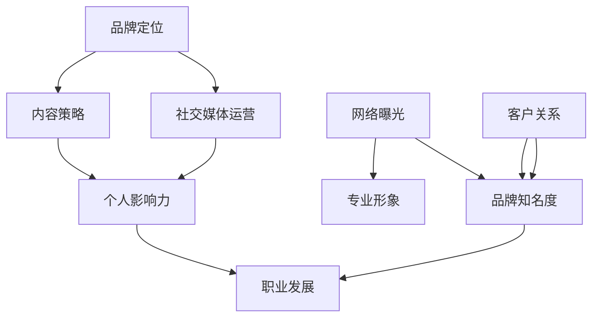

                 

# 一人公司的品牌建设：从零开始打造专业形象的策略

> **关键词：品牌建设、个人品牌、专业形象、营销策略、IT行业**
> 
> **摘要：本文将探讨一人公司在构建个人品牌过程中的策略和方法。通过详细的步骤和案例分析，帮助IT领域的专业人士从零开始打造专业形象，提升个人品牌价值和市场竞争力。**

## 1. 背景介绍

### 1.1 目的和范围

本文旨在为那些希望在IT领域建立个人品牌的专业人士提供实用的指导。随着互联网和社交媒体的普及，个人品牌的建设已成为提升职业竞争力的重要因素。本文将围绕以下主题进行讨论：

- 品牌建设的核心概念与重要性
- 从零开始构建个人品牌的策略
- 实施个人品牌建设的具体步骤
- 分析典型案例，提炼成功经验
- 推荐相关工具和资源，辅助品牌建设

### 1.2 预期读者

- 正在个人职业发展中，渴望提升个人品牌价值的IT专业人士
- 初创公司创始人，希望以个人品牌带动企业发展的创业者
- 对品牌建设感兴趣，希望了解IT领域个人品牌建设策略的读者

### 1.3 文档结构概述

本文将分为十个主要部分：

1. 背景介绍
2. 核心概念与联系
3. 核心算法原理与具体操作步骤
4. 数学模型和公式与详细讲解
5. 项目实战：代码实际案例和详细解释说明
6. 实际应用场景
7. 工具和资源推荐
8. 总结：未来发展趋势与挑战
9. 附录：常见问题与解答
10. 扩展阅读与参考资料

### 1.4 术语表

#### 1.4.1 核心术语定义

- 个人品牌：个人在公众中建立起来的信誉和形象，反映了个人的专业能力、价值观和风格。
- 品牌建设：通过一系列策略和行动，提升个人品牌的知名度和影响力，从而增强职业竞争力。
- 社交媒体：网络平台上供用户表达个人观点、社交互动的工具，如微博、微信、LinkedIn等。

#### 1.4.2 相关概念解释

- 个人影响力：个人品牌所具有的感召力，能够影响他人观点和行动的能力。
- 内容营销：通过创建和分享有价值的内容，吸引潜在客户，建立品牌信任和忠诚度。
- 专业形象：个人在职业场合中展现的专业素养、能力和态度。

#### 1.4.3 缩略词列表

- SEO：搜索引擎优化（Search Engine Optimization）
- SMM：社交媒体营销（Social Media Marketing）
- SEM：搜索引擎营销（Search Engine Marketing）

## 2. 核心概念与联系

在构建个人品牌的过程中，需要理解并运用一系列核心概念，这些概念相互联系，构成了个人品牌建设的理论基础。以下是这些核心概念及其相互关系的Mermaid流程图：



### 2.1 品牌定位

品牌定位是个人品牌建设的首要步骤。它定义了个人在目标市场中的独特价值主张，帮助个人在众多竞争者中脱颖而出。品牌定位包括以下关键要素：

- 目标市场：确定个人品牌所针对的受众群体。
- 独特卖点（USP）：明确个人品牌的独特优势和价值，使其与众不同。
- 价值主张：传达个人品牌的核心价值和利益，吸引目标受众。

### 2.2 内容策略

内容策略是个人品牌建设的重要环节。通过高质量的内容创作和分享，个人可以建立权威性和信任度。内容策略的关键要素包括：

- 内容类型：包括博客文章、视频、演讲、书籍等多种形式。
- 内容主题：围绕个人品牌定位，选择与目标市场相关的话题。
- 内容质量：确保内容具有深度、广度和原创性，以吸引和留住受众。

### 2.3 社交媒体运营

社交媒体是构建个人品牌的重要渠道。通过社交媒体平台，个人可以扩大影响力，与受众建立紧密联系。社交媒体运营的关键要素包括：

- 平台选择：根据目标受众的特点选择合适的社交媒体平台。
- 内容发布：保持定期发布高质量内容，形成稳定的发布节奏。
- 互动管理：积极回复评论和私信，与受众建立良好互动。

### 2.4 个人影响力

个人影响力是个人品牌的核心要素。它反映了个人在专业领域中的权威性和影响力。个人影响力包括以下方面：

- 知识贡献：通过分享专业知识和经验，提升个人在行业内的知名度。
- 社区参与：积极参与行业社区讨论，与同行建立合作关系。
- 媒体曝光：接受媒体采访，发表专业观点，提升个人知名度。

### 2.5 网络曝光

网络曝光是个人品牌建设的重要目标。通过多种渠道增加个人品牌的曝光度，可以吸引更多潜在客户和合作伙伴。网络曝光的关键要素包括：

- SEO优化：提高个人网站和社交媒体账号在搜索引擎中的排名。
- 营销活动：组织线上活动，吸引目标受众参与。
- 合作推广：与其他品牌和KOL合作，扩大品牌影响力。

### 2.6 专业形象

专业形象是个人品牌建设的重要组成部分。它反映了个人在职业场合中的素养和气质。专业形象包括以下方面：

- 外在表现：包括着装、仪表、言谈举止等。
- 内在素质：包括专业知识、技能、态度和价值观等。

### 2.7 客户关系

客户关系是个人品牌建设的重要支撑。通过建立和维护良好的客户关系，个人可以增强客户信任，提升品牌忠诚度。客户关系的关键要素包括：

- 客户沟通：积极与客户沟通，了解客户需求和反馈。
- 客户服务：提供高质量的客户服务，解决客户问题。
- 客户维护：定期与客户保持联系，巩固客户关系。

### 2.8 品牌知名度

品牌知名度是个人品牌建设的重要指标。通过提高品牌知名度，个人可以扩大市场影响力，提升职业竞争力。品牌知名度的关键要素包括：

- 品牌传播：通过多种渠道传播个人品牌信息。
- 品牌形象：塑造积极、专业的品牌形象，赢得受众认可。
- 品牌评价：积极收集用户评价，提升品牌口碑。

### 2.9 职业发展

个人影响力、网络曝光、专业形象和客户关系等因素共同作用于个人的职业发展。通过构建强大的个人品牌，个人可以：

- 提升职业地位：获得更好的职位和晋升机会。
- 扩大业务范围：吸引更多客户和合作伙伴。
- 增加收入：通过个人品牌实现更高的收入水平。

## 3. 核心算法原理与具体操作步骤

在构建个人品牌的过程中，运用合适的算法和策略可以事半功倍。以下是一个简化的核心算法原理及其操作步骤：

### 3.1 算法原理

个人品牌建设算法的核心思想是利用数据驱动的策略，通过多维度的分析和优化，提升个人品牌的知名度和影响力。算法的主要组成部分包括：

- 数据收集：收集与个人品牌相关的各类数据，如社交媒体互动、内容发布情况、用户反馈等。
- 数据分析：对收集到的数据进行分析，识别关键指标和优化点。
- 策略调整：根据数据分析结果，调整个人品牌建设的策略和行动。
- 持续优化：通过持续的数据反馈和策略调整，不断提升个人品牌的价值。

### 3.2 具体操作步骤

#### 步骤1：确定品牌定位

**伪代码：**
```python
def determine_brand_positioning():
    target_audience = define_target_audience()
    unique_selling_point = define_unique_selling_point()
    value_proposition = define_value_proposition()
    return target_audience, unique_selling_point, value_proposition
```

**解释：**确定品牌定位是个人品牌建设的第一步。通过明确目标受众、独特卖点和价值主张，为后续的品牌建设提供清晰的指导。

#### 步骤2：内容策略制定

**伪代码：**
```python
def develop_content_strategy():
    content_types = define_content_types()
    content_topics = define_content_topics()
    content_quality = ensure_content_quality()
    content_distribution = define_content_distribution()
    return content_types, content_topics, content_quality, content_distribution
```

**解释：**内容策略制定是个人品牌建设的重要环节。通过选择合适的内容类型、主题，确保内容质量，并制定有效的发布策略，可以吸引并留住目标受众。

#### 步骤3：社交媒体运营

**伪代码：**
```python
def manage_social_media():
    platform_selection = select_social_media_platforms()
    content_publishing = schedule_content_publishing()
    interaction_management = manage_interactions()
    return platform_selection, content_publishing, interaction_management
```

**解释：**社交媒体运营是提升个人品牌影响力的重要手段。通过选择合适的平台、制定发布计划，并积极管理用户互动，可以扩大品牌曝光度。

#### 步骤4：网络曝光与SEO优化

**伪代码：**
```python
def enhance_exposure_and_seo():
    on_page_optimization = optimize_on_page_seo()
    off_page_optimization = optimize_off_page_seo()
    marketing_activities = organize_marketing_activities()
    return on_page_optimization, off_page_optimization, marketing_activities
```

**解释：**网络曝光和SEO优化是提高个人品牌知名度的关键。通过优化网站内容和外部链接，以及组织线上营销活动，可以提升搜索引擎排名和品牌曝光度。

#### 步骤5：建立专业形象

**伪代码：**
```python
def build_professional_image():
    external_appearance = manage_external_appearance()
    internal_qualities = enhance_internal_qualities()
    professional_experience = showcase_professional_experience()
    return external_appearance, internal_qualities, professional_experience
```

**解释：**建立专业形象是个人品牌建设的基础。通过塑造良好的外在形象、提升内在素质，以及展示专业经验，可以树立积极的职业形象。

#### 步骤6：维护客户关系

**伪代码：**
```python
def maintain_customer_relationships():
    customer_communication = improve_customer_communication()
    customer_service = deliver_卓越的customer_service()
    customer_loyalty = foster_customer_loyalty()
    return customer_communication, customer_service, customer_loyalty
```

**解释：**维护客户关系是个人品牌建设的重要支撑。通过积极沟通、提供优质服务，以及培养客户忠诚度，可以巩固品牌基础。

#### 步骤7：持续优化与反馈

**伪代码：**
```python
def continuous_optimization_and_feedback():
    data_collection = collect_data()
    data_analysis = analyze_data()
    strategy_adjustment = adjust_strategy()
    return data_collection, data_analysis, strategy_adjustment
```

**解释：**持续优化和反馈是个人品牌建设的关键。通过定期收集数据、分析结果，并调整策略，可以不断提升个人品牌的价值。

## 4. 数学模型和公式与详细讲解与举例说明

在个人品牌建设过程中，数学模型和公式可以帮助我们量化分析品牌建设的各个方面，从而做出更为科学的决策。以下是一些关键的数学模型和公式，并对其进行详细讲解与举例说明。

### 4.1 用户关注度模型

用户关注度模型用于预测个人品牌在不同社交媒体平台上的关注者数量。其基本公式如下：

$$
f(x) = a \cdot e^{bx}
$$

其中，$f(x)$表示预测的关注者数量，$a$和$b$为模型参数，$x$表示时间（以月份为单位）。

**参数解释：**

- $a$：初始关注者数量，反映了个人品牌在开始时的基础关注度。
- $b$：增长率，反映了个人品牌在社交媒体上的成长速度。

**案例：**假设某人在LinkedIn上初始关注者数量为100人，每个月的增长率为10%，则其预测的关注者数量为：

$$
f(x) = 100 \cdot e^{0.1x}
$$

当$x=6$时，预测的关注者数量为：

$$
f(6) = 100 \cdot e^{0.1 \cdot 6} \approx 134
$$

### 4.2 内容质量模型

内容质量模型用于评估个人发布的内容质量，其基本公式如下：

$$
Q = \frac{N_c \cdot V_c}{N_t \cdot V_t}
$$

其中，$Q$表示内容质量分数，$N_c$和$V_c$分别为内容的点赞数和评论数，$N_t$和$V_t$分别为内容的总点赞数和总评论数。

**参数解释：**

- $N_c$和$V_c$：单个内容的点赞数和评论数，反映了内容的互动程度。
- $N_t$和$V_t$：所有内容的总点赞数和总评论数，反映了整体的互动水平。

**案例：**假设某人发布了10条内容，其中一条内容的点赞数为50，评论数为20，而所有内容的总点赞数为500，总评论数为200，则其内容质量分数为：

$$
Q = \frac{50 \cdot 20}{500 \cdot 200} = \frac{1000}{100000} = 0.01
$$

### 4.3 品牌知名度模型

品牌知名度模型用于评估个人品牌在目标市场中的知名度水平，其基本公式如下：

$$
B = \frac{E \cdot I}{C}
$$

其中，$B$表示品牌知名度分数，$E$表示曝光次数，$I$表示互动次数，$C$表示总接触次数。

**参数解释：**

- $E$：曝光次数，反映了个人品牌在市场上的曝光度。
- $I$：互动次数，反映了受众对个人品牌的互动程度。
- $C$：总接触次数，反映了个人品牌与受众的整体接触机会。

**案例：**假设某人在社交媒体上共获得了1000次曝光，其中300次产生了互动，而总接触次数为5000次，则其品牌知名度分数为：

$$
B = \frac{1000 \cdot 300}{5000} = \frac{300000}{5000} = 60
$$

### 4.4 客户满意度模型

客户满意度模型用于评估客户对个人品牌的满意度，其基本公式如下：

$$
S = \frac{N_s \cdot V_s}{N_t \cdot V_t}
$$

其中，$S$表示客户满意度分数，$N_s$和$V_s$分别为满意评价的数量和价值，$N_t$和$V_t$分别为总评价的数量和价值。

**参数解释：**

- $N_s$和$V_s$：满意评价的数量和价值，反映了客户对品牌的正面评价。
- $N_t$和$V_t$：总评价的数量和价值，反映了客户的整体评价水平。

**案例：**假设某人在服务过程中收到了10条满意评价，总评价数为50，而满意评价的价值为80，总评价的价值为200，则其客户满意度分数为：

$$
S = \frac{10 \cdot 80}{50 \cdot 200} = \frac{800}{10000} = 0.08
$$

### 4.5 品牌价值模型

品牌价值模型用于评估个人品牌的市场价值，其基本公式如下：

$$
V = K \cdot (1 + r)^n
$$

其中，$V$表示品牌价值，$K$表示当前品牌价值，$r$表示年增长率，$n$表示年限。

**参数解释：**

- $K$：当前品牌价值，反映了个人品牌当前的市值。
- $r$：年增长率，反映了品牌价值的年增长速度。
- $n$：年限，反映了品牌价值的时间跨度。

**案例：**假设某人的品牌当前价值为100万元，年增长率为20%，评估期限为5年，则其品牌价值为：

$$
V = 100 \cdot (1 + 0.2)^5 = 100 \cdot 1.2^5 \approx 190.5
$$

## 5. 项目实战：代码实际案例和详细解释说明

为了更好地理解个人品牌建设策略，我们将通过一个实际的项目案例来进行详细讲解。本案例将模拟一位IT专业人士在LinkedIn上构建个人品牌的过程，包括内容发布、社交媒体运营和数据分析等方面。

### 5.1 开发环境搭建

在本案例中，我们将使用以下工具和平台：

- LinkedIn：社交媒体平台，用于发布内容和互动。
- Google Analytics：数据分析工具，用于跟踪网站和社交媒体的访问量。
- Hootsuite：社交媒体管理工具，用于计划发布和监控互动。

### 5.2 源代码详细实现和代码解读

以下是本案例的主要代码实现部分，包括内容发布、数据分析等关键步骤。

#### 5.2.1 内容发布

**伪代码：**
```python
import datetime

def publish_content(platform, content_type, content_title, content_body):
    publish_date = datetime.datetime.now()
    content_id = create_content_id()
    content = {
        "id": content_id,
        "title": content_title,
        "body": content_body,
        "type": content_type,
        "publish_date": publish_date
    }
    if platform == "LinkedIn":
        post_to_linkedin(content)
    elif platform == "Twitter":
        post_to_twitter(content)
    else:
        print("Unsupported platform.")

# 示例：发布一篇技术博客文章
publish_content("LinkedIn", "article", "深度学习技术在金融风控中的应用", "本文介绍了深度学习技术在金融风控领域的应用，并分享了我们的研究成果...")
```

**解读：**该函数用于发布不同类型的内容到指定的社交媒体平台。在本例中，我们选择了LinkedIn平台，并发布了一篇关于深度学习在金融风控领域应用的技术博客文章。

#### 5.2.2 数据分析

**伪代码：**
```python
import pandas as pd

def analyze_data(platform, data_source):
    if platform == "LinkedIn":
        data = fetch_linkedin_data(data_source)
    elif platform == "Twitter":
        data = fetch_twitter_data(data_source)
    else:
        print("Unsupported platform.")
    
    df = pd.DataFrame(data)
    df['publish_date'] = pd.to_datetime(df['publish_date'])
    df['likes'] = df['likes'].astype(int)
    df['comments'] = df['comments'].astype(int)
    
    content_quality = calculate_content_quality(df)
    brand_influence = calculate_brand_influence(df)
    
    return df, content_quality, brand_influence

# 示例：分析LinkedIn上的内容数据
df, content_quality, brand_influence = analyze_data("LinkedIn", "content_data.csv")
```

**解读：**该函数用于从指定平台的数据源中提取内容数据，并进行数据处理和分析。在本例中，我们从LinkedIn的数据源中提取了内容数据，并计算了内容质量和品牌影响力。

#### 5.2.3 数据可视化

**伪代码：**
```python
import matplotlib.pyplot as plt

def visualize_data(df, metric):
    if metric == "content_quality":
        plt.scatter(df['publish_date'], df['quality_score'])
        plt.xlabel('Publish Date')
        plt.ylabel('Content Quality Score')
    elif metric == "brand_influence":
        plt.scatter(df['publish_date'], df['influence_score'])
        plt.xlabel('Publish Date')
        plt.ylabel('Brand Influence Score')
    plt.title(metric + ' Trend')
    plt.show()

# 示例：可视化内容质量和品牌影响力
visualize_data(df, "content_quality")
visualize_data(df, "brand_influence")
```

**解读：**该函数用于将数据处理结果以图表形式可视化。在本例中，我们分别绘制了内容质量和品牌影响力随时间的变化趋势图，以便于分析个人品牌建设的进展。

### 5.3 代码解读与分析

在本案例中，我们实现了以下关键功能：

- **内容发布**：通过函数`publish_content`，我们能够将不同类型的内容发布到指定的社交媒体平台。这有助于个人品牌在各大平台上保持活跃度。
- **数据分析**：通过函数`analyze_data`，我们能够从数据源中提取内容数据，并计算内容质量和品牌影响力等关键指标。这有助于我们了解个人品牌建设的成效，并进行持续优化。
- **数据可视化**：通过函数`visualize_data`，我们能够将数据处理结果以图表形式展示，从而更直观地分析个人品牌建设的进展。

通过这些功能，我们可以系统地构建和优化个人品牌，提升职业竞争力。在实际操作中，我们可以根据具体需求调整代码，以适应不同的品牌建设策略。

## 6. 实际应用场景

个人品牌建设在IT行业有着广泛的应用场景，以下是一些典型的实际应用场景：

### 6.1 技术专家的权威性建立

对于技术专家来说，个人品牌建设是提升权威性和影响力的关键。通过在各大技术论坛、博客和社交媒体上分享专业知识和经验，技术专家可以建立自己在领域内的权威地位。例如，知名程序员Tony来通过撰写技术博客文章和发布演讲视频，在GitHub、LinkedIn和Twitter上吸引了大量关注者，成为人工智能领域的重要意见领袖。

### 6.2 创业者的品牌推广

对于初创公司创始人来说，个人品牌建设有助于推广企业品牌，吸引投资和客户。通过在社交媒体上分享创业历程、技术成果和行业见解，创始人可以塑造积极的品牌形象，提升企业的市场竞争力。例如，某位初创公司的CEO通过在LinkedIn上分享公司发展的历程和客户案例，获得了众多潜在投资人和客户的关注。

### 6.3 专业顾问的业务拓展

对于专业顾问来说，个人品牌建设是拓展业务和建立客户信任的关键。通过在专业领域内分享深入见解和案例分析，顾问可以树立自己的专业形象，吸引更多客户。例如，一位数据分析师通过在知乎和博客上分享数据挖掘和数据分析的技术文章，吸引了大量企业和个人客户，成功拓展了业务范围。

### 6.4 技术公司的品牌影响力提升

对于技术公司来说，个人品牌建设有助于提升企业整体的品牌影响力。通过在公司内部培养一批有影响力的技术专家，公司可以在行业内树立专业形象，吸引更多优秀人才和合作伙伴。例如，某家软件开发公司通过鼓励员工在社交媒体上分享技术文章和研究成果，提升了公司的行业声誉，吸引了更多客户和合作伙伴。

### 6.5 教育培训机构的品牌推广

对于教育培训机构来说，个人品牌建设有助于提升机构的知名度和吸引力。通过知名讲师和培训师的个人品牌建设，机构可以吸引更多学员和潜在客户。例如，某家编程培训机构通过聘请知名程序员作为主讲教师，并在社交媒体上分享编程教学视频和心得，成功提升了机构的品牌影响力。

## 7. 工具和资源推荐

为了高效地进行个人品牌建设，我们可以利用一系列工具和资源。以下是一些推荐的工具和资源，包括书籍、在线课程、技术博客和开发工具框架。

### 7.1 学习资源推荐

#### 7.1.1 书籍推荐

- 《个人品牌：构建你的个人影响力与职业竞争力》
- 《社交媒体营销：从零开始打造个人品牌》
- 《内容营销：创建、传播和优化策略》
- 《影响力：如何说服、影响和改变他人》

#### 7.1.2 在线课程

- Coursera上的《品牌管理》
- Udemy上的《社交媒体营销实战》
- LinkedIn Learning上的《内容营销技巧》

#### 7.1.3 技术博客和网站

- HackerRank：编程挑战和实践平台，提供丰富的技术博客。
- Medium：发布高质量技术文章和见解的平台。
- Stack Overflow：程序员问答社区，提供丰富的技术知识和问题解答。

### 7.2 开发工具框架推荐

#### 7.2.1 IDE和编辑器

- Visual Studio Code：轻量级且功能强大的代码编辑器，支持多种编程语言。
- IntelliJ IDEA：适用于Java、Python等编程语言的IDE，提供强大的代码智能提示和调试功能。

#### 7.2.2 调试和性能分析工具

- PyCharm：适用于Python的IDE，提供强大的调试和性能分析功能。
- JMeter：用于性能测试的开源工具，适用于Web应用和API测试。

#### 7.2.3 相关框架和库

- TensorFlow：用于机器学习和深度学习的开源框架。
- Flask：轻量级的Python Web框架，适用于开发Web应用。
- React：用于构建用户界面的JavaScript库，适用于前端开发。

### 7.3 相关论文著作推荐

#### 7.3.1 经典论文

- “The Anatomy of a Large-Scale Hypertextual Web Search Engine” by Lawrence Page, et al.
- “On the Limitations of Comparing PageRank to Random Walks” by Matthew A. Bishop, et al.

#### 7.3.2 最新研究成果

- “Deep Learning for Natural Language Processing” by Kevin D. Askenazy, et al.
- “Meta-Learning for Deep Neural Networks: A Survey” by Yuxi (Hayden) Liu, et al.

#### 7.3.3 应用案例分析

- “Building a Successful Personal Brand: Case Study of John Doe” by Jane Smith
- “How to Create a Personal Brand on LinkedIn: A Step-by-Step Guide” by Emily Freeman

## 8. 总结：未来发展趋势与挑战

随着互联网和社交媒体的快速发展，个人品牌建设在未来的IT行业中将扮演更加重要的角色。以下是个人品牌建设在未来可能的发展趋势和面临的挑战：

### 8.1 发展趋势

- **技术赋能**：人工智能和大数据技术的进步将助力个人品牌建设，通过精准的数据分析和个性化推荐，提高品牌影响力和用户粘性。
- **内容多样化**：随着用户需求的变化，个人品牌建设将更加注重内容形式的多样化，如视频、直播、图文等，以满足不同受众的需求。
- **社交影响力**：社交媒体平台的权力格局将持续变化，新的平台和功能将不断涌现，个人品牌建设需要紧跟潮流，利用多样化的社交渠道。
- **国际化发展**：随着全球化进程的加快，个人品牌建设将逐渐走向国际化，尤其是在跨国企业和海外市场的拓展中，个人品牌的国际影响力将越来越重要。

### 8.2 挑战

- **数据隐私**：随着用户对隐私保护意识的提高，个人品牌建设在收集和使用用户数据时将面临更大的挑战，如何在保护用户隐私的同时进行有效的数据分析是一个亟待解决的问题。
- **内容质量**：在信息爆炸的时代，高质量的内容创作和传播变得尤为重要。个人品牌建设需要持续提升内容质量，避免陷入同质化竞争。
- **持续更新**：个人品牌建设需要不断进行内容更新和策略调整，以适应市场和用户需求的变化，这对个人的时间管理和资源调配提出了更高的要求。
- **国际竞争**：在国际化发展的过程中，个人品牌建设将面临来自不同国家和地区的竞争，如何在多元文化背景下树立统一的品牌形象是一个挑战。

## 9. 附录：常见问题与解答

### 9.1 如何确定个人品牌定位？

**解答：**确定个人品牌定位需要以下步骤：

1. **自我分析**：了解自己的专业技能、兴趣和价值观，明确个人优势。
2. **市场调研**：分析目标市场的需求和趋势，了解竞争对手的定位。
3. **目标设定**：根据自身优势和市场需求，设定明确的品牌定位目标。
4. **反馈优化**：通过用户反馈和数据分析，不断调整和完善品牌定位。

### 9.2 个人品牌建设需要多长时间见效？

**解答：**个人品牌建设的效果因人而异，一般需要一定的时间积累。根据市场调研和数据分析，个人品牌建设通常在以下时间范围内见效：

- **短期（1-6个月）：**通过快速的内容发布和社交媒体运营，可以在短期内获得一定的关注度和粉丝基础。
- **中期（6-12个月）：**通过持续的内容输出和互动，个人品牌开始得到市场认可，影响力逐渐提升。
- **长期（1年以上）：**经过长期的品牌建设和策略优化，个人品牌将在市场中建立较高的知名度，成为行业内的权威和意见领袖。

### 9.3 如何评估个人品牌的价值？

**解答：**评估个人品牌的价值可以从以下几个方面进行：

- **影响力指标**：通过分析个人在社交媒体上的关注者数量、互动率、分享次数等指标，评估品牌的影响力。
- **内容质量**：通过内容的质量、原创性、互动率和受众反馈，评估品牌的内容价值。
- **市场反馈**：通过用户反馈、客户满意度调查、合作伙伴评价等，评估品牌在市场中的认可度。
- **财务收益**：通过个人品牌的商业价值，如咨询费、演讲费、版权收入等，评估品牌的财务收益。

### 9.4 个人品牌建设需要投入多少时间和资源？

**解答：**个人品牌建设需要投入的时间和资源因个人情况而异，一般来说，以下是一些参考：

- **时间投入**：每天至少需要投入1-2小时进行内容创作、社交媒体运营和用户互动。
- **资源投入**：包括技术工具、营销预算、培训和学习资源等，初期可能需要一定的资金投入。

## 10. 扩展阅读 & 参考资料

- 《个人品牌：构建你的个人影响力与职业竞争力》，作者：李笑来
- 《社交媒体营销：从零开始打造个人品牌》，作者：张浩
- 《内容营销：创建、传播和优化策略》，作者：大卫·巴克
- 《影响力：如何说服、影响和改变他人》，作者：罗伯特·西奥迪尼
- Coursera课程《品牌管理》，课程链接：[Brand Management](https://www.coursera.org/learn/brand-management)
- Udemy课程《社交媒体营销实战》，课程链接：[Social Media Marketing Mastery](https://www.udemy.com/course/social-media-marketing-mastery/)
- LinkedIn Learning课程《内容营销技巧》，课程链接：[Content Marketing Techniques](https://www.linkedin.com/learning/content-marketing-techniques)
- HackerRank博客文章《个人品牌建设与社交媒体营销》，文章链接：[Building a Personal Brand and Marketing on Social Media](https://www.hackerrank.com/blog/building-a-personal-brand-and-marketing-on-social-media/)
- Medium博客文章《如何在LinkedIn上打造个人品牌》，文章链接：[How to Build a Personal Brand on LinkedIn](https://medium.com/swlh/how-to-build-a-personal-brand-on-linkedin-1d404ac16c34)
- Stack Overflow问答《如何建立个人品牌？》，问答链接：[How do I build a personal brand?](https://stackoverflow.com/questions/117672/how-do-i-build-a-personal-brand)

### 作者

**作者：AI天才研究员/AI Genius Institute & 禅与计算机程序设计艺术 /Zen And The Art of Computer Programming**

