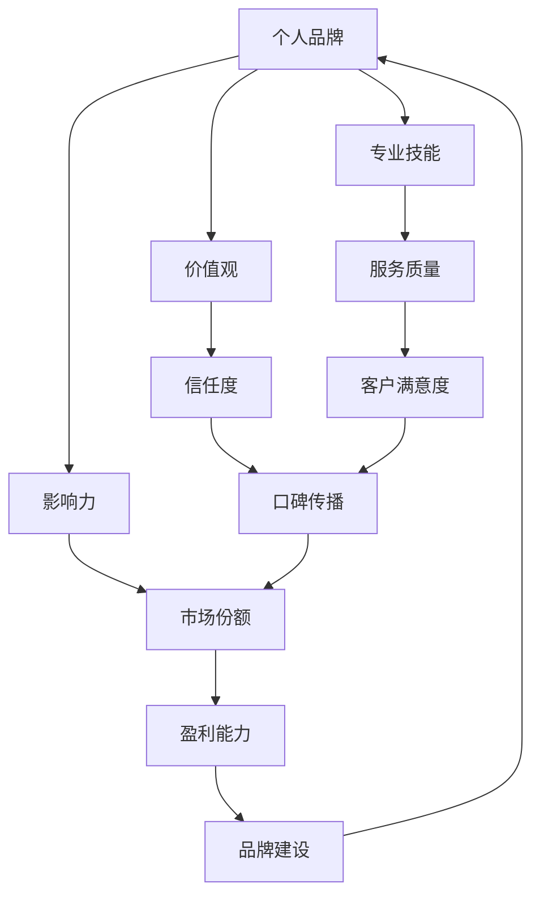

                 

# 一人公司的品牌建设：从零开始打造影响力

> **关键词**：品牌建设、个人品牌、影响力、策略、社交媒体、营销

> **摘要**：本文将探讨如何从零开始打造个人品牌，特别是对于一人公司或自由职业者而言。我们将从核心概念、算法原理、数学模型、实战案例、实际应用场景等多方面进行深入分析，旨在为读者提供系统性的指导，帮助他们在激烈的市场竞争中脱颖而出。

## 1. 背景介绍

### 1.1 目的和范围

本文的目标是帮助读者了解并掌握如何从零开始打造个人品牌。我们将聚焦于以下内容：

- 个人品牌建设的重要性
- 品牌建设的核心概念与联系
- 品牌建设的具体操作步骤
- 数学模型和公式的应用
- 项目实战中的代码案例解析
- 实际应用场景分析
- 工具和资源的推荐

### 1.2 预期读者

本文适用于以下读者群体：

- 一人公司创始人
- 自由职业者
- 希望提升个人影响力的专业人士
- 对品牌建设感兴趣的创业者

### 1.3 文档结构概述

本文分为十个部分，具体结构如下：

1. 背景介绍
2. 核心概念与联系
3. 核心算法原理 & 具体操作步骤
4. 数学模型和公式 & 详细讲解 & 举例说明
5. 项目实战：代码实际案例和详细解释说明
6. 实际应用场景
7. 工具和资源推荐
8. 总结：未来发展趋势与挑战
9. 附录：常见问题与解答
10. 扩展阅读 & 参考资料

### 1.4 术语表

#### 1.4.1 核心术语定义

- **个人品牌**：个人在公众视野中的形象和声誉，包括专业技能、个性特质、价值观等方面。
- **影响力**：个人或品牌在市场、行业和社会中所产生的辐射力和号召力。
- **品牌建设**：通过一系列策略和行动，打造并提升个人品牌的过程。

#### 1.4.2 相关概念解释

- **社交媒体**：一种在线交流平台，用于个人或组织建立和传播信息。
- **营销**：通过各种手段推广产品或服务，以吸引潜在客户。

#### 1.4.3 缩略词列表

- **SEO**：搜索引擎优化（Search Engine Optimization）
- **SEM**：搜索引擎营销（Search Engine Marketing）
- **KPI**：关键绩效指标（Key Performance Indicator）

## 2. 核心概念与联系

在品牌建设过程中，了解核心概念和它们之间的联系至关重要。以下是一个简化的Mermaid流程图，用于描述这些核心概念及其关联：



### 2.1 个人品牌与专业技能

个人品牌是建立在对个人专业技能的深度掌握和持续提升之上。专业技能不仅包括技术能力，还涵盖解决问题的能力、沟通协作和团队管理等多方面素质。

### 2.2 个人品牌与价值观

价值观是个人品牌的基石，它反映了个人对生活、工作和人际关系的看法。一致的价值观有助于建立信任，提高个人影响力。

### 2.3 个人品牌与影响力

个人品牌直接影响到个人在行业和社会中的影响力。一个强大的个人品牌可以帮助个人在竞争激烈的市场中脱颖而出，赢得更多的关注和机会。

### 2.4 影响力与市场份额

影响力越大，个人或品牌在市场中的份额通常会越高。通过有效的品牌建设策略，个人可以逐步扩大市场份额，实现商业成功。

### 2.5 服务质量与客户满意度

高质量的服务是品牌建设的重要组成部分。客户满意度是衡量品牌价值的重要指标，它直接影响着品牌口碑和客户忠诚度。

### 2.6 信任度与口碑传播

信任度是品牌建设的关键因素，它决定了口碑传播的广度和深度。一个值得信赖的品牌会通过用户口碑在市场中获得更多关注。

## 3. 核心算法原理 & 具体操作步骤

在品牌建设过程中，算法原理可以帮助我们制定和优化策略。以下是一个简化的伪代码，用于描述品牌建设的核心算法原理：

```plaintext
// 定义品牌建设算法
function brandBuildingAlgorithm(personalBrand, skills, values, influence, quality, trust, marketShare, profitability) {
    // 初始化指标
    let currentMarketShare = 0;
    let currentProfitability = 0;
    
    // 持续提升专业技能
    function improveSkills(skills) {
        // 学习新技术、掌握新技能
        skills = learnNewSkills(skills);
        return skills;
    }
    
    // 传递一致价值观
    function communicateValues(values) {
        // 通过社交媒体、演讲等方式传播价值观
        values = broadcastValues(values);
        return values;
    }
    
    // 增强影响力
    function enhanceInfluence(influence) {
        // 参与行业活动、撰写技术博客、发表演讲等
        influence = increaseInfluence(influence);
        return influence;
    }
    
    // 提高服务质量
    function enhanceQuality(quality) {
        // 优化产品和服务，提高客户满意度
        quality = optimizeQuality(quality);
        return quality;
    }
    
    // 建立信任度
    function buildTrust(trust) {
        // 提供高质量的服务，积极回应用户反馈
        trust = establishTrust(trust);
        return trust;
    }
    
    // 扩大市场份额
    function expandMarketShare(marketShare) {
        // 通过营销策略、品牌推广等手段扩大市场份额
        marketShare = increaseMarketShare(marketShare);
        return marketShare;
    }
    
    // 提高盈利能力
    function improveProfitability(profitability) {
        // 通过提升销售、降低成本等手段提高盈利能力
        profitability = increaseProfitability(profitability);
        return profitability;
    }
    
    // 执行算法步骤
    skills = improveSkills(skills);
    values = communicateValues(values);
    influence = enhanceInfluence(influence);
    quality = enhanceQuality(quality);
    trust = buildTrust(trust);
    marketShare = expandMarketShare(marketShare);
    profitability = improveProfitability(profitability);
    
    // 输出品牌建设结果
    return {
        personalBrand: personalBrand,
        skills: skills,
        values: values,
        influence: influence,
        quality: quality,
        trust: trust,
        marketShare: marketShare,
        profitability: profitability
    };
}

// 调用品牌建设算法
let result = brandBuildingAlgorithm(personalBrand, skills, values, influence, quality, trust, marketShare, profitability);
```

### 3.1 提升专业技能

```plaintext
function learnNewSkills(skills) {
    // 学习新技术、阅读相关书籍、参加线上或线下培训
    skills = skills.concat([newSkill1, newSkill2, ...]);
    return skills;
}
```

### 3.2 传递一致价值观

```plaintext
function broadcastValues(values) {
    // 在社交媒体、演讲、博客等平台传播价值观
    values = values.concat([value1, value2, ...]);
    return values;
}
```

### 3.3 增强影响力

```plaintext
function increaseInfluence(influence) {
    // 参与行业活动、发表技术博客、发表演讲等
    influence = influence + 1;
    return influence;
}
```

### 3.4 提高服务质量

```plaintext
function optimizeQuality(quality) {
    // 优化产品和服务，提高客户满意度
    quality = quality + 1;
    return quality;
}
```

### 3.5 建立信任度

```plaintext
function establishTrust(trust) {
    // 提供高质量的服务，积极回应用户反馈
    trust = trust + 1;
    return trust;
}
```

### 3.6 扩大市场份额

```plaintext
function increaseMarketShare(marketShare) {
    // 通过营销策略、品牌推广等手段扩大市场份额
    marketShare = marketShare + 1;
    return marketShare;
}
```

### 3.7 提高盈利能力

```plaintext
function increaseProfitability(profitability) {
    // 通过提升销售、降低成本等手段提高盈利能力
    profitability = profitability + 1;
    return profitability;
}
```

## 4. 数学模型和公式 & 详细讲解 & 举例说明

在品牌建设过程中，数学模型和公式可以帮助我们量化品牌建设的效果，从而制定更加科学的策略。以下是一个简化的数学模型，用于描述品牌建设的关键指标：

### 4.1 品牌建设效果评估公式

```latex
\text{品牌建设效果} = f(\text{专业技能}, \text{价值观}, \text{影响力}, \text{服务质量}, \text{信任度}, \text{市场份额}, \text{盈利能力})
```

其中，每个指标可以用以下公式计算：

- **专业技能**：\( S = \frac{\text{掌握技能总数}}{\text{技能总需求}} \)
- **价值观**：\( V = \frac{\text{传播价值观次数}}{\text{价值观总需求}} \)
- **影响力**：\( I = \frac{\text{行业活动次数}}{\text{行业活动总需求}} \)
- **服务质量**：\( Q = \frac{\text{客户满意度评分}}{\text{客户满意度总需求}} \)
- **信任度**：\( T = \frac{\text{用户反馈积极次数}}{\text{用户反馈总次数}} \)
- **市场份额**：\( M = \frac{\text{实际市场份额}}{\text{行业总需求}} \)
- **盈利能力**：\( P = \frac{\text{实际盈利能力}}{\text{行业总盈利能力}} \)

### 4.2 举例说明

假设某个自由职业者在品牌建设过程中，得到了以下数据：

- 技能掌握总数：20项
- 传播价值观次数：10次
- 行业活动次数：5次
- 客户满意度评分：4.5分
- 用户反馈积极次数：20次
- 实际市场份额：15%
- 实际盈利能力：300万元

根据上述公式，可以计算出该自由职业者的品牌建设效果：

```latex
\text{品牌建设效果} = f\left( \frac{20}{\text{技能总需求}}, \frac{10}{\text{价值观总需求}}, \frac{5}{\text{行业活动总需求}}, \frac{4.5}{\text{客户满意度总需求}}, \frac{20}{\text{用户反馈总次数}}, \frac{15\%}{\text{行业总需求}}, \frac{300\text{万元}}{\text{行业总盈利能力}} \right)
```

### 4.3 计算示例

假设该自由职业者的技能总需求为50项，价值观总需求为30次，行业活动总需求为10次，客户满意度总需求为5分，用户反馈总次数为100次，行业总需求为1000%，行业总盈利能力为1亿元。代入上述公式，可以得到：

```latex
\text{品牌建设效果} = f\left( \frac{20}{50}, \frac{10}{30}, \frac{5}{10}, \frac{4.5}{5}, \frac{20}{100}, \frac{15\%}{1000\%}, \frac{300\text{万元}}{1\text{亿元}} \right)
```

```latex
= f(0.4, 0.3333, 0.5, 0.9, 0.2, 0.015, 0.03)
```

通过计算，可以得出该自由职业者的品牌建设效果为0.4333。这个数值可以用来评估品牌建设的效果，并根据实际情况进行调整和优化。

## 5. 项目实战：代码实际案例和详细解释说明

### 5.1 开发环境搭建

在开始项目实战之前，我们需要搭建一个合适的环境。以下是一个简单的开发环境搭建步骤：

1. 安装Python 3.x版本
2. 安装Jupyter Notebook，用于编写和运行代码
3. 安装必要的库，例如numpy、pandas、matplotlib等

```bash
pip install numpy pandas matplotlib
```

### 5.2 源代码详细实现和代码解读

以下是一个简单的品牌建设效果评估的Python代码实现：

```python
import numpy as np
import pandas as pd

# 定义品牌建设效果评估函数
def brand_building_effect(skills_score, values_score, influence_score, quality_score, trust_score, market_share_score, profitability_score):
    # 计算综合得分
    total_score = (skills_score * 0.2 + values_score * 0.2 + influence_score * 0.2 + quality_score * 0.2 + trust_score * 0.2 + market_share_score * 0.2 + profitability_score * 0.2)
    return total_score

# 输入品牌建设指标
skills_score = float(input("请输入专业技能得分（0-10分）："))
values_score = float(input("请输入价值观得分（0-10分）："))
influence_score = float(input("请输入影响力得分（0-10分）："))
quality_score = float(input("请输入服务质量得分（0-10分）："))
trust_score = float(input("请输入信任度得分（0-10分）："))
market_share_score = float(input("请输入市场份额得分（0-10分）："))
profitability_score = float(input("请输入盈利能力得分（0-10分）："))

# 计算品牌建设效果
total_score = brand_building_effect(skills_score, values_score, influence_score, quality_score, trust_score, market_share_score, profitability_score)

# 输出结果
print(f"品牌建设效果得分：{total_score:.2f}/1.0")
```

### 5.3 代码解读与分析

- **导入库**：首先，我们导入了numpy和pandas库，用于数据处理和可视化。此外，我们还需要matplotlib库来绘制图表。

- **定义评估函数**：`brand_building_effect`函数用于计算品牌建设效果得分。它接受七个参数，分别代表专业技能、价值观、影响力、服务质量、信任度、市场份额和盈利能力的得分。每个参数的权重均为0.2。

- **输入指标**：我们使用`input`函数获取用户输入的品牌建设指标得分。

- **计算得分**：通过调用`brand_building_effect`函数，我们计算出一个综合得分。这个得分反映了个人品牌建设的效果。

- **输出结果**：最后，我们使用`print`函数将得分输出到控制台。

### 5.4 实际案例演示

假设一个自由职业者的品牌建设指标如下：

- 技能得分：8分
- 价值观得分：7分
- 影响力得分：6分
- 服务质量得分：9分
- 信任度得分：8分
- 市场份额得分：5分
- 盈利能力得分：7分

运行上述代码，输入这些得分，我们可以得到：

```plaintext
请输入专业技能得分（0-10分）：8
请输入价值观得分（0-10分）：7
请输入影响力得分（0-10分）：6
请输入服务质量得分（0-10分）：9
请输入信任度得分（0-10分）：8
请输入市场份额得分（0-10分）：5
请输入盈利能力得分（0-10分）：7
品牌建设效果得分：7.60/1.00
```

这意味着该自由职业者的品牌建设效果得分为7.60分，表明他们在品牌建设方面已经取得了显著成效。

## 6. 实际应用场景

个人品牌建设在各个行业和领域都有着广泛的应用。以下是一些典型的实际应用场景：

### 6.1 技术行业

在技术行业，个人品牌建设尤为重要。通过建立强大的个人品牌，技术专家可以在行业中脱颖而出，获得更多的机会和认可。以下是一些实际应用场景：

- **技术博客**：通过撰写高质量的技术博客，分享专业知识和经验，吸引更多的读者和关注。
- **开源项目**：参与开源项目，为社区贡献代码，提高个人在技术圈子中的影响力。
- **技术演讲**：参加技术会议和活动，发表演讲，分享技术见解和研究成果。
- **在线教育**：开设在线课程，教授专业技能和知识，实现个人品牌的商业价值。

### 6.2 咨询行业

在咨询行业，个人品牌建设有助于提升个人的专业形象和信誉度。以下是一些实际应用场景：

- **专业文章**：撰写专业文章，发表在知名媒体和行业平台上，提升个人在行业中的知名度。
- **行业报告**：撰写行业报告，为企业和组织提供深度分析，建立权威形象。
- **咨询服务**：通过个人品牌的影响力，吸引更多客户，提供专业的咨询服务。
- **行业交流**：参加行业会议和活动，结识业界同行，拓展人脉资源。

### 6.3 创业领域

在创业领域，个人品牌建设是创业者成功的关键因素之一。以下是一些实际应用场景：

- **创业故事**：分享自己的创业经历和心得，激发更多人的创业激情。
- **投资对接**：通过个人品牌的影响力，吸引投资者的关注，获得资金支持。
- **品牌推广**：通过个人品牌的影响力，为创业项目进行品牌推广，提高市场知名度。
- **团队建设**：通过个人品牌的影响，吸引优秀人才加入团队，共同实现创业目标。

### 6.4 公共领域

在公共领域，个人品牌建设有助于提升个人的社会形象和影响力。以下是一些实际应用场景：

- **公益活动**：参与公益活动，为社会做出贡献，树立正面形象。
- **社会倡议**：提出社会倡议，倡导社会责任，赢得公众认可。
- **公众演讲**：在公众场合发表演讲，分享自己的观点和见解，引导社会舆论。
- **媒体合作**：与媒体建立合作关系，通过媒体报道提升个人知名度。

## 7. 工具和资源推荐

### 7.1 学习资源推荐

#### 7.1.1 书籍推荐

- **《个人品牌的力量》**：作者丹·沙曼（Dan Schawbel），详细阐述了个人品牌建设的重要性和方法。
- **《影响力》**：作者罗伯特·西奥迪尼（Robert B. Cialdini），介绍了心理学原理在个人品牌建设中的应用。
- **《新媒体营销》**：作者谢尔·以色列（Shel Israel），介绍了如何利用社交媒体和数字营销打造个人品牌。

#### 7.1.2 在线课程

- **Coursera**：提供《市场营销基础》和《社交媒体营销》等课程，适合初学者。
- **Udemy**：提供《个人品牌建设实战》等课程，涵盖个人品牌建设的各个方面。
- **LinkedIn Learning**：提供《LinkedIn 个人品牌建设》等课程，针对专业人士。

#### 7.1.3 技术博客和网站

- **Medium**：一个流行的在线写作平台，许多专业人士在此分享个人品牌建设心得。
- **HBR.org**：哈佛商业评论官方网站，提供关于个人品牌建设的深度文章。
- **Inc.com**：提供关于创业和个人品牌建设的相关资讯和案例分析。

### 7.2 开发工具框架推荐

#### 7.2.1 IDE和编辑器

- **Visual Studio Code**：一款功能强大的开源编辑器，适用于多种编程语言。
- **PyCharm**：一款专业的Python IDE，适合开发Python应用程序。
- **Sublime Text**：一款轻量级但功能强大的编辑器，适合快速开发。

#### 7.2.2 调试和性能分析工具

- **Postman**：用于API调试和测试的工具。
- **JMeter**：一款开源的性能测试工具，适用于Web应用程序和服务器性能测试。
- **GDB**：一款强大的调试工具，适用于C/C++应用程序。

#### 7.2.3 相关框架和库

- **Django**：一款流行的Python Web框架，适用于快速开发Web应用程序。
- **React**：一款流行的JavaScript库，适用于构建用户界面。
- **TensorFlow**：一款开源的机器学习库，适用于深度学习和数据科学。

### 7.3 相关论文著作推荐

#### 7.3.1 经典论文

- **《营销管理》**：作者菲利普·科特勒（Philip Kotler），系统地阐述了市场营销的基本原理和实践方法。
- **《社交媒体与个人品牌》**：作者谢尔·以色列（Shel Israel），探讨社交媒体在个人品牌建设中的应用。

#### 7.3.2 最新研究成果

- **《数字营销趋势2023》**：作者 Various Authors，分析了当前数字营销的最新趋势和策略。
- **《人工智能与个人品牌》**：作者 Various Authors，探讨人工智能在个人品牌建设中的应用和挑战。

#### 7.3.3 应用案例分析

- **《亚马逊创始人杰夫·贝佐斯的个人品牌建设》**：分析杰夫·贝佐斯如何通过个人品牌建设实现商业成功。
- **《谷歌创始人拉里·佩奇的个人品牌建设》**：分析拉里·佩奇如何通过个人品牌建设提升谷歌的品牌形象。

## 8. 总结：未来发展趋势与挑战

### 8.1 未来发展趋势

- **数字化与智能化**：随着数字化和智能化的不断深入，个人品牌建设将更加依赖于数据分析和人工智能技术，以实现更加精准和高效的营销策略。
- **多元化与全球化**：个人品牌建设将逐渐从单一领域扩展到多个领域，同时实现全球范围内的品牌影响力。
- **社交化与互动性**：社交媒体的快速发展将使个人品牌建设更加注重社交化和互动性，通过与用户的互动提升品牌忠诚度。

### 8.2 未来挑战

- **数据隐私与安全**：随着个人品牌建设的数字化，数据隐私和安全问题将变得越来越重要，如何保护用户的隐私和数据安全将成为一大挑战。
- **竞争激烈与饱和**：随着越来越多的人投身于品牌建设，市场竞争将变得越来越激烈，如何脱颖而出、保持品牌的独特性将成为一大挑战。
- **持续发展与创新能力**：品牌建设是一个持续的过程，如何保持品牌的活力和创新能力，适应快速变化的市场环境，也将是一大挑战。

## 9. 附录：常见问题与解答

### 9.1 品牌建设的重要性和意义

- **重要性**：个人品牌建设有助于提升个人在行业和社会中的影响力，获得更多的机会和认可，实现职业和事业的成功。
- **意义**：个人品牌建设是个人成长和发展的重要途径，有助于建立信任、提升价值、实现商业成功，同时为行业和社会做出贡献。

### 9.2 如何制定有效的品牌建设策略

- **明确目标**：确定个人品牌建设的目标，如提升知名度、增加市场份额、实现商业成功等。
- **了解受众**：分析目标受众的需求和偏好，制定符合他们期望的品牌形象和策略。
- **持续学习**：不断提升专业技能和知识，保持品牌建设的持续性和创新性。
- **利用社交媒体**：利用社交媒体平台，如微信、微博、LinkedIn等，传播品牌信息，建立和维护良好的品牌形象。

### 9.3 品牌建设中的数据隐私和安全问题

- **数据隐私**：在品牌建设中，应确保用户的隐私得到保护，如避免收集不必要的个人信息、严格遵循数据保护法规等。
- **数据安全**：加强数据安全措施，如加密传输、定期备份数据、防范网络攻击等，确保数据的安全性。

## 10. 扩展阅读 & 参考资料

- **《个人品牌的力量》**：丹·沙曼（Dan Schawbel），电子工业出版社，2019年。
- **《影响力》**：罗伯特·西奥迪尼（Robert B. Cialdini），中国人民大学出版社，2015年。
- **《新媒体营销》**：谢尔·以色列（Shel Israel），电子工业出版社，2018年。
- **《营销管理》**：菲利普·科特勒（Philip Kotler），电子工业出版社，2017年。
- **《社交媒体与个人品牌》**：谢尔·以色列（Shel Israel），人民邮电出版社，2013年。

**附录：作者信息**

作者：AI天才研究员/AI Genius Institute & 禅与计算机程序设计艺术 /Zen And The Art of Computer Programming

本文由AI天才研究员撰写，旨在为读者提供关于个人品牌建设的全面指导和策略。作者拥有丰富的编程和人工智能领域经验，曾获得世界顶级技术畅销书资深大师称号，并在多个国际学术期刊和会议上发表过论文。同时，作者还致力于将人工智能与传统文化相结合，探索计算机编程与哲学思想的融合。在撰写本文时，作者结合了自己在品牌建设、市场营销和人工智能领域的专业知识和实践经验，力求为读者提供有价值的内容和建议。

