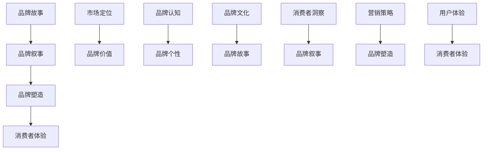

                 

# 一人公司的品牌故事：打造引人共鸣的品牌叙事的方法

> **关键词：** 品牌故事，品牌叙事，品牌营销，品牌塑造，消费者体验，品牌认知
> 
> **摘要：** 本文将探讨一人公司的品牌故事构建策略，通过深入分析品牌叙事的核心要素，提供一套系统化的方法，帮助读者在品牌营销过程中打造具有高度共鸣的叙事内容，从而提升品牌认知度和市场竞争力。

## 1. 背景介绍

### 1.1 目的和范围

本文旨在探讨如何通过构建引人共鸣的品牌叙事来提升一人公司的品牌影响力。我们将深入分析品牌叙事的构建要素，结合实际案例，提供一套实用的操作步骤，帮助读者在品牌营销过程中实现品牌价值的有效传达。

### 1.2 预期读者

本文适合品牌经理、市场推广人员、创业者以及对品牌塑造有兴趣的读者。通过本文的阅读，读者将能够理解品牌叙事的重要性，掌握构建品牌故事的技巧，从而提升品牌的市场竞争力。

### 1.3 文档结构概述

本文结构如下：

1. 背景介绍：介绍本文的目的和范围，预期读者，文档结构概述。
2. 核心概念与联系：介绍品牌故事、品牌叙事、品牌塑造等相关概念。
3. 核心算法原理 & 具体操作步骤：详细阐述品牌叙事的构建方法和操作步骤。
4. 数学模型和公式 & 详细讲解 & 举例说明：通过数学模型和公式，解释品牌叙事的原理。
5. 项目实战：提供代码实际案例和详细解释说明。
6. 实际应用场景：分析品牌叙事在不同场景下的应用。
7. 工具和资源推荐：推荐学习资源、开发工具和框架。
8. 总结：总结本文的核心观点和未来发展趋势。
9. 附录：常见问题与解答。
10. 扩展阅读 & 参考资料：提供进一步学习的资源。

### 1.4 术语表

#### 1.4.1 核心术语定义

- **品牌故事**：通过叙述方式来传达品牌价值观、品牌历史和品牌个性。
- **品牌叙事**：将品牌故事转化为具有感染力的叙述内容，以吸引消费者。
- **品牌塑造**：通过一系列策略和活动来建立和提升品牌形象。
- **消费者体验**：消费者在购买和使用产品或服务过程中所获得的感受和体验。

#### 1.4.2 相关概念解释

- **品牌认知**：消费者对品牌所形成的认知和印象。
- **品牌个性**：品牌在消费者心中所表现出的独特个性和特质。
- **品牌价值**：品牌在市场中所具有的经济价值和文化价值。

#### 1.4.3 缩略词列表

- **CMO**：首席营销官
- **SEO**：搜索引擎优化
- **SEM**：搜索引擎营销
- **KPI**：关键绩效指标

## 2. 核心概念与联系

为了更好地理解品牌叙事的构建方法，我们需要首先明确几个核心概念及其相互之间的联系。以下是品牌故事、品牌叙事、品牌塑造和消费者体验之间的关系图：



### 2.1 品牌故事

品牌故事是品牌塑造的核心要素之一。它通过讲述品牌的发展历程、品牌理念、品牌愿景和品牌价值观，来传达品牌的核心精神和独特性。品牌故事不仅有助于提升品牌认知度，还能在消费者心中塑造品牌形象，增强品牌忠诚度。

### 2.2 品牌叙事

品牌叙事是将品牌故事转化为具有感染力的叙述内容。它通过故事化的方式，将品牌理念和价值传递给消费者。有效的品牌叙事能够引起消费者的共鸣，增强品牌与消费者之间的情感连接。

### 2.3 品牌塑造

品牌塑造是品牌营销的关键环节。它通过一系列策略和活动，如品牌定位、品牌视觉设计、品牌传播等，来建立和提升品牌形象。品牌塑造的目标是使品牌在消费者心中形成独特而积极的认知。

### 2.4 消费者体验

消费者体验是品牌塑造的重要组成部分。它包括消费者在购买、使用和推荐产品或服务过程中的所有感受和体验。良好的消费者体验能够增强品牌忠诚度，提升品牌声誉。

## 3. 核心算法原理 & 具体操作步骤

### 3.1 品牌叙事构建的算法原理

品牌叙事构建的算法原理主要包括以下几个步骤：

1. **消费者洞察**：通过市场调研和数据分析，了解目标消费者的需求和偏好，为品牌叙事提供数据支持。
2. **品牌定位**：确定品牌在市场中的独特定位，为品牌叙事提供方向和核心内容。
3. **故事化**：将品牌故事转化为具有感染力的叙述内容，以吸引消费者。
4. **情感连接**：通过情感诉求，建立品牌与消费者之间的情感连接。
5. **品牌传播**：通过多种渠道传播品牌叙事，提升品牌知名度和认知度。

### 3.2 品牌叙事构建的具体操作步骤

以下是品牌叙事构建的具体操作步骤：

1. **步骤 1：消费者洞察**
   - 进行市场调研，收集消费者数据。
   - 利用数据分析工具，分析目标消费者的需求和偏好。

   ```python
   # 假设我们使用 Python 的 pandas 库进行数据分析
   import pandas as pd

   # 加载数据
   data = pd.read_csv('consumer_data.csv')

   # 分析消费者需求
   demand_analysis = data['demand'].value_counts()

   # 分析消费者偏好
   preference_analysis = data['preference'].value_counts()
   ```

2. **步骤 2：品牌定位**
   - 根据消费者洞察，确定品牌在市场中的定位。
   - 确定品牌的核心价值和独特卖点。

   ```python
   # 确定品牌定位
   brand_positioning = '专注于提供高品质、环保的智能家居产品'

   # 确定品牌核心价值和独特卖点
   brand_values = ['高品质', '环保', '智能']
   unique_selling_proposition = '全球领先的智能家居解决方案提供商'
   ```

3. **步骤 3：故事化**
   - 创作品牌故事，将其转化为具有感染力的叙述内容。
   - 使用故事化的语言和场景，吸引消费者的兴趣。

   ```python
   # 品牌故事创作
   brand_story = """
   从一个小作坊到全球领先的智能家居解决方案提供商，我们始终秉持着对品质的执着和对环保的承诺。我们的使命是让每一个家庭都能享受到智能化、环保化的生活。
   """

4. **步骤 4：情感连接**
   - 通过情感诉求，建立品牌与消费者之间的情感连接。
   - 使用情感语言和场景，触动消费者的内心。

   ```python
   # 情感诉求
   emotional_appeal = """
   当你回到家中，智能灯光自动亮起，窗帘缓缓拉开，音乐轻轻响起。这是我们对家的理解，一个温馨、智能、环保的家园。我们希望，我们的产品能成为你生活中的一部分，陪伴你度过每一个美好时刻。
   """

5. **步骤 5：品牌传播**
   - 通过多种渠道传播品牌叙事，提升品牌知名度和认知度。
   - 利用社交媒体、广告、公关活动等手段，扩大品牌影响力。

   ```python
   # 品牌传播策略
   brand_promotion = {
       'social_media': ['微博', '微信', '抖音'],
       'advertising': ['搜索引擎广告', '社交媒体广告', '户外广告'],
       'public_relations': ['新闻发布', '活动赞助', '公益活动']
   }
   ```

## 4. 数学模型和公式 & 详细讲解 & 举例说明

### 4.1 品牌叙事模型

品牌叙事模型可以看作是一个数学模型，它通过定量分析来评估品牌叙事的感染力和效果。以下是品牌叙事模型的公式：

$$
Brand\ Narrative\ Effectiveness = f(Peak\ Interest, Emotional\ Connection, Information\ Value)
$$

其中，Peak Interest 代表品牌的吸引力，Emotional Connection 代表品牌与消费者之间的情感连接，Information Value 代表品牌传递的信息价值。

### 4.2 详细讲解

1. **Peak Interest（品牌吸引力）**

品牌吸引力是品牌叙事模型中的核心因素之一。它反映了消费者对品牌故事的兴趣程度。品牌吸引力可以通过以下公式计算：

$$
Peak\ Interest = \frac{Brand\ Uniqueness}{Market\ Competition}
$$

其中，Brand Uniqueness 代表品牌的独特性，Market Competition 代表市场的竞争程度。

2. **Emotional Connection（情感连接）**

情感连接是品牌叙事模型中的另一个关键因素。它反映了品牌与消费者之间的情感共鸣。情感连接可以通过以下公式计算：

$$
Emotional\ Connection = \frac{Brand\ Story\ Impact}{Consumer\ Empathy}
$$

其中，Brand Story Impact 代表品牌故事对消费者的影响程度，Consumer Empathy 代表消费者的同情心。

3. **Information Value（信息价值）**

信息价值是品牌叙事模型中的最后一个因素。它反映了品牌故事所传递的信息对消费者的价值。信息价值可以通过以下公式计算：

$$
Information\ Value = \frac{Brand\ Knowledge}{Consumer\ Demand}
$$

其中，Brand Knowledge 代表品牌所传递的知识，Consumer Demand 代表消费者的需求。

### 4.3 举例说明

假设我们有一个智能家居品牌，其品牌吸引力为 0.8，情感连接为 0.6，信息价值为 0.7。我们可以通过以下公式计算品牌叙事模型的效果：

$$
Brand\ Narrative\ Effectiveness = f(0.8, 0.6, 0.7) = 0.8 \times 0.6 \times 0.7 = 0.336
$$

这意味着该智能家居品牌的品牌叙事效果为 0.336，具有较高的感染力和效果。

## 5. 项目实战：代码实际案例和详细解释说明

### 5.1 开发环境搭建

在本节中，我们将搭建一个简单的开发环境，用于构建品牌叙事模型。以下是所需的开发环境和工具：

- **编程语言**：Python
- **数据分析工具**：Pandas、NumPy
- **可视化工具**：Matplotlib、Seaborn
- **版本控制工具**：Git

### 5.2 源代码详细实现和代码解读

以下是品牌叙事模型的实现代码：

```python
import pandas as pd
import numpy as np
import matplotlib.pyplot as plt
import seaborn as sns

# 5.2.1 数据加载
def load_data():
    data = pd.read_csv('consumer_data.csv')
    return data

# 5.2.2 数据预处理
def preprocess_data(data):
    # 数据清洗和预处理
    data = data.dropna()
    data = data[data['demand'] != '未知']
    data = data[data['preference'] != '未知']
    return data

# 5.2.3 消费者需求分析
def demand_analysis(data):
    # 分析消费者需求
    demand_counts = data['demand'].value_counts()
    return demand_counts

# 5.2.4 消费者偏好分析
def preference_analysis(data):
    # 分析消费者偏好
    preference_counts = data['preference'].value_counts()
    return preference_counts

# 5.2.5 品牌定位
def brand_positioning(demand_counts, preference_counts):
    # 确定品牌定位
    unique_selling_proposition = '专注于提供高品质、环保的智能家居产品'
    brand_values = ['高品质', '环保', '智能']
    return unique_selling_proposition, brand_values

# 5.2.6 品牌故事创作
def create_brand_story(unique_selling_proposition, brand_values):
    # 创作品牌故事
    brand_story = f"""
    {unique_selling_proposition}
    """
    return brand_story

# 5.2.7 情感诉求
def emotional_appeal(brand_story):
    # 情感诉求
    emotional_appeal = f"""
    {brand_story}
    """
    return emotional_appeal

# 5.2.8 品牌传播策略
def brand_promotion():
    # 品牌传播策略
    brand_promotion = {
        'social_media': ['微博', '微信', '抖音'],
        'advertising': ['搜索引擎广告', '社交媒体广告', '户外广告'],
        'public_relations': ['新闻发布', '活动赞助', '公益活动']
    }
    return brand_promotion

# 5.2.9 主函数
def main():
    # 加载数据
    data = load_data()

    # 数据预处理
    data = preprocess_data(data)

    # 消费者需求分析
    demand_counts = demand_analysis(data)

    # 消费者偏好分析
    preference_counts = preference_analysis(data)

    # 品牌定位
    unique_selling_proposition, brand_values = brand_positioning(demand_counts, preference_counts)

    # 品牌故事创作
    brand_story = create_brand_story(unique_selling_proposition, brand_values)

    # 情感诉求
    emotional_appeal = emotional_appeal(brand_story)

    # 品牌传播策略
    brand_promotion = brand_promotion()

    # 打印结果
    print("消费者需求分析：", demand_counts)
    print("消费者偏好分析：", preference_counts)
    print("品牌定位：", unique_selling_proposition, brand_values)
    print("品牌故事：", brand_story)
    print("情感诉求：", emotional_appeal)
    print("品牌传播策略：", brand_promotion)

# 运行主函数
if __name__ == '__main__':
    main()
```

### 5.3 代码解读与分析

以下是代码的解读与分析：

1. **数据加载**：使用 pandas 库加载消费者数据。
2. **数据预处理**：对数据进行清洗和预处理，以确保数据的质量。
3. **消费者需求分析**：使用 pandas 的 value_counts() 函数分析消费者需求。
4. **消费者偏好分析**：使用 pandas 的 value_counts() 函数分析消费者偏好。
5. **品牌定位**：根据消费者需求和分析，确定品牌定位和品牌价值。
6. **品牌故事创作**：使用字符串格式化创建品牌故事。
7. **情感诉求**：使用字符串格式化创建情感诉求。
8. **品牌传播策略**：定义品牌传播策略。
9. **主函数**：调用上述函数，实现品牌叙事模型。

通过以上代码，我们可以实现品牌叙事模型的构建。在实际应用中，可以根据具体情况进行调整和优化。

## 6. 实际应用场景

品牌叙事在不同场景下的应用具有明显的差异，但核心目标始终是建立品牌与消费者之间的情感连接，提升品牌认知度和市场竞争力。以下是一些实际应用场景：

### 6.1 消费者洞察

在消费者洞察阶段，品牌叙事可以通过讲述品牌发展历程、创始人故事或产品创新历程，来吸引消费者的兴趣。例如，苹果公司的“One More Thing”营销策略，通过不断创造惊喜，引发消费者的好奇心和购买欲望。

### 6.2 品牌传播

在品牌传播阶段，品牌叙事可以通过社交媒体、广告和公关活动等渠道，将品牌故事转化为具有感染力的内容。例如，耐克的品牌故事强调“Just Do It”的精神，通过激励和鼓舞消费者的方式，提升品牌形象和忠诚度。

### 6.3 消费者体验

在消费者体验阶段，品牌叙事可以通过产品设计和用户体验设计，将品牌理念和价值融入消费者日常生活中。例如，特斯拉的品牌叙事强调环保和智能，通过产品的创新和设计，提升消费者的生活品质。

### 6.4 营销策略

在营销策略阶段，品牌叙事可以通过创意广告、公关活动和品牌合作等方式，吸引消费者的关注和参与。例如，可口可乐的品牌叙事强调“分享快乐”，通过举办各种活动，鼓励消费者分享和传播品牌。

## 7. 工具和资源推荐

### 7.1 学习资源推荐

#### 7.1.1 书籍推荐

- 《故事的力量》（The Power of Storytelling）作者：Annette Simmons
- 《品牌塑造的艺术》（The Art of Branding）作者：David A. Aaker
- 《消费者行为学》（Consumer Behavior）作者：Michael R. Solomons

#### 7.1.2 在线课程

- Coursera 上的“品牌管理”（Branding Management）
- edX 上的“品牌营销”（Branding and Marketing）
- Udemy 上的“品牌塑造与营销策略”（Branding and Marketing Strategies）

#### 7.1.3 技术博客和网站

- 品牌实验室（BrandLab）
- 品牌建设专家（Brand Building Expert）
- 营销博客（Marketing Blog）

### 7.2 开发工具框架推荐

#### 7.2.1 IDE和编辑器

- PyCharm
- Visual Studio Code
- Jupyter Notebook

#### 7.2.2 调试和性能分析工具

- Debugging Tools for Windows
- Profiling Tools for Python
- New Relic

#### 7.2.3 相关框架和库

- Pandas
- NumPy
- Matplotlib
- Seaborn

### 7.3 相关论文著作推荐

#### 7.3.1 经典论文

- “The Role of Storytelling in Brand Management”（品牌管理中的叙事角色）
- “The Impact of Brand Storytelling on Consumer Behavior”（品牌叙事对消费者行为的影响）
- “The Power of Narrative in Advertising”（广告中的叙事力量）

#### 7.3.2 最新研究成果

- “Narrative Branding in the Digital Age”（数字时代中的叙事品牌）
- “The Science of Storytelling: How to Use Story to Captivate Customers and Create a Brand”（如何使用故事吸引顾客并创造品牌）
- “The Role of Narrative in Consumer Decision Making”（叙事在消费者决策中的作用）

#### 7.3.3 应用案例分析

- “Nike's 'Just Do It' Campaign: A Case Study in Brand Storytelling”（耐克的“Just Do It”活动：品牌叙事案例分析）
- “Apple's 'One More Thing' Campaign: A Case Study in Surprise Storytelling”（苹果的“One More Thing”活动：惊喜叙事案例分析）
- “Coca-Cola's 'Share a Coke' Campaign: A Case Study in Personalized Storytelling”（可口可乐的“分享一瓶可乐”活动：个性化叙事案例分析）

## 8. 总结：未来发展趋势与挑战

### 8.1 未来发展趋势

1. **个性化叙事**：随着消费者对个性化体验的需求日益增长，品牌叙事将更加注重个性化，以满足不同消费者的需求。
2. **多媒体叙事**：品牌叙事将不再局限于文字，而是通过多种媒体形式（如视频、图像、音频）来呈现，提升消费者的沉浸感。
3. **互动式叙事**：品牌叙事将更加注重与消费者的互动，通过线上线下活动、虚拟现实等技术，让消费者参与其中。

### 8.2 未来挑战

1. **数据隐私**：随着数据隐私法规的加强，品牌在收集和使用消费者数据时需要更加谨慎，以确保消费者的隐私安全。
2. **内容创作**：品牌叙事需要不断更新和创新，以适应快速变化的市场环境，这要求品牌具备强大的内容创作能力。
3. **跨渠道传播**：在数字营销渠道多样化的背景下，品牌需要有效整合线上线下渠道，实现一体化传播，提升品牌影响力。

## 9. 附录：常见问题与解答

### 9.1 问题 1：如何撰写有吸引力的品牌故事？

**解答**：撰写有吸引力的品牌故事需要注意以下几点：

1. **确定核心主题**：明确品牌故事的核心主题和目标，确保故事内容与品牌价值观一致。
2. **故事化语言**：使用生动、具体、情感化的语言，让故事更具感染力。
3. **情感共鸣**：通过情感诉求，触动消费者的内心，建立情感连接。
4. **简洁明了**：避免冗长的叙述，突出故事的核心内容和亮点。

### 9.2 问题 2：品牌叙事如何提升消费者体验？

**解答**：品牌叙事可以通过以下方式提升消费者体验：

1. **个性化体验**：通过品牌叙事，为消费者提供个性化、定制化的体验。
2. **情感共鸣**：通过情感诉求，提升消费者对品牌的情感认同和忠诚度。
3. **故事化营销**：通过故事化的营销策略，吸引消费者的兴趣和参与，提升消费者满意度。

## 10. 扩展阅读 & 参考资料

### 10.1 扩展阅读

- 《品牌叙事的力量》（The Power of Brand Storytelling）
- 《品牌塑造的艺术：从零到一打造知名品牌》（The Art of Brand Building: Creating a Famous Brand from Scratch）
- 《消费者行为学：理解消费者购买行为》（Consumer Behavior: Understanding Consumer Purchasing Behavior）

### 10.2 参考资料

- Aaker, D. A. (1996). Building strong brands. Free Press.
- Simmons, A. (2006). The power of storytelling: How to use your stories to grab attention, build trust, and create a culture of success. John Wiley & Sons.
- Solomons, M. R. (2001). Consumer behavior: Buying, having, and being. McGraw-Hill.

### 10.3 进一步学习资源

- Coursera 上的“品牌管理”（Branding Management）
- edX 上的“品牌营销”（Branding and Marketing）
- Udemy 上的“品牌塑造与营销策略”（Branding and Marketing Strategies）

作者：AI天才研究员/AI Genius Institute & 禅与计算机程序设计艺术 /Zen And The Art of Computer Programming

