                 

## 一人公司的品牌文化建设与价值观传播

### 关键词：品牌文化建设、价值观传播、一人公司、企业文化、个体影响力、战略规划

> 摘要：本文旨在探讨一人公司在品牌文化建设与价值观传播方面的独特挑战与策略。通过深入分析企业文化、核心价值观的确定、品牌形象塑造、市场传播、以及个体影响力等方面，为一人公司提供系统性、实操性的建设方案，助力其在竞争激烈的市场中脱颖而出。

### 1. 背景介绍

#### 1.1 目的和范围

本文目的在于为一人公司提供品牌文化建设与价值观传播的全面指导，帮助其建立独特的品牌形象，并确保价值观在公司内部和外部得到有效传播。本文将涵盖以下范围：

- 一人公司的定义和特征
- 品牌文化建设的重要性
- 核心价值观的确定与传播
- 品牌形象的塑造与维护
- 市场传播策略
- 个体影响力的利用与培养

#### 1.2 预期读者

本文预期读者为一一人公司的创始人、管理者、以及品牌建设从业人员。通过本文，读者将能够：

- 理解品牌文化建设与价值观传播的基本概念
- 掌握一人公司品牌文化建设的具体方法和步骤
- 学习有效的市场传播策略，提升品牌影响力
- 利用个体影响力，推动公司价值观的传播和实践

#### 1.3 文档结构概述

本文结构如下：

1. 背景介绍：阐述研究背景、目的和范围，以及预期读者。
2. 核心概念与联系：介绍品牌文化建设与价值观传播的核心概念，并使用 Mermaid 流程图进行阐述。
3. 核心算法原理 & 具体操作步骤：详细讲解品牌文化建设与价值观传播的具体操作步骤。
4. 数学模型和公式 & 详细讲解 & 举例说明：使用数学模型和公式，解释品牌文化建设与价值观传播的原理。
5. 项目实战：通过实际案例，展示品牌文化建设与价值观传播的应用。
6. 实际应用场景：分析品牌文化建设与价值观传播在不同场景下的应用。
7. 工具和资源推荐：推荐相关学习资源和开发工具。
8. 总结：对未来发展趋势与挑战进行展望。
9. 附录：常见问题与解答。
10. 扩展阅读 & 参考资料：提供进一步学习和研究的相关资料。

#### 1.4 术语表

##### 1.4.1 核心术语定义

- 品牌文化建设：指公司通过一系列策略和行动，塑造并维护其品牌形象，提升品牌价值的过程。
- 价值观传播：指将公司的核心价值观传达给内部员工和外部客户，形成共识的过程。
- 一人公司：指由单一创始人或个体经营者构成的企业，具有高度个人特色和灵活性的特点。

##### 1.4.2 相关概念解释

- 企业文化：指企业在长期发展过程中形成的共同价值观、行为规范和工作方式。
- 品牌形象：指消费者和公众对品牌的总体印象和认知。
- 市场传播：指通过多种渠道和手段，将品牌信息传递给目标受众，提高品牌知名度和影响力。

##### 1.4.3 缩略词列表

- AI：人工智能
- SEO：搜索引擎优化
- SMM：社交媒体营销

### 2. 核心概念与联系

在探讨一人公司的品牌文化建设与价值观传播之前，我们需要明确其中的核心概念及其相互关系。

#### 2.1 品牌文化建设

品牌文化建设是企业通过一系列策略和行动，塑造并维护其品牌形象，提升品牌价值的过程。品牌文化包括核心价值观、品牌使命、愿景、行为规范等多个方面。其中，核心价值观是品牌文化的核心，是公司一切行为和决策的指导原则。

#### 2.2 价值观传播

价值观传播是指将公司的核心价值观传达给内部员工和外部客户，形成共识的过程。价值观传播是品牌文化建设的重要环节，通过内部培训和外部宣传，使员工和客户深入了解和认同公司的价值观，从而提升品牌形象和品牌忠诚度。

#### 2.3 品牌形象

品牌形象是消费者和公众对品牌的总体印象和认知。品牌形象包括品牌知名度、品牌美誉度、品牌忠诚度等多个方面。良好的品牌形象有助于提升品牌价值，吸引更多客户和合作伙伴。

#### 2.4 市场传播

市场传播是通过多种渠道和手段，将品牌信息传递给目标受众，提高品牌知名度和影响力。市场传播包括广告、公关、社交媒体营销、SEO等多个方面。有效的市场传播策略有助于提升品牌形象，扩大品牌影响力。

#### 2.5 个体影响力

个体影响力是指个人在品牌传播和价值观传播过程中所产生的影响力。在一人公司中，创始人或个体经营者具有独特的个体影响力，可以通过自身的行为和言论，影响员工和客户，推动品牌文化建设和价值观传播。

##### Mermaid 流程图

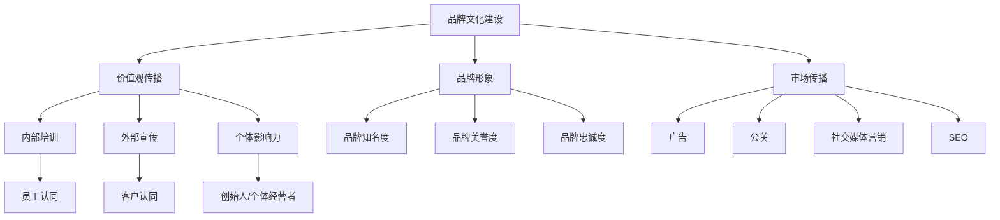

### 3. 核心算法原理 & 具体操作步骤

在明确了品牌文化建设与价值观传播的核心概念后，我们将详细讲解其具体操作步骤，帮助一人公司有效地实施品牌文化建设与价值观传播。

#### 3.1 品牌文化建设

**3.1.1 确定核心价值观**

- **步骤1**：回顾公司的创立初衷和使命，明确公司的核心价值观。
- **步骤2**：邀请公司核心成员参与讨论，共同确定核心价值观。
- **步骤3**：将核心价值观文档化，形成公司核心价值宣言。

**3.1.2 塑造品牌形象**

- **步骤1**：分析目标市场和竞争对手，确定品牌定位。
- **步骤2**：设计品牌标识（Logo）、品牌色彩和品牌口号，形成统一的品牌视觉形象。
- **步骤3**：制定品牌传播策略，通过各种渠道和手段传播品牌信息。

#### 3.2 价值观传播

**3.2.1 内部培训**

- **步骤1**：制定内部培训计划，包括核心价值观培训、员工行为规范培训等。
- **步骤2**：邀请专业培训师进行培训，确保培训效果。
- **步骤3**：定期组织内部讨论和分享，促进员工对核心价值观的深入理解和实践。

**3.2.2 外部宣传**

- **步骤1**：通过官方网站、社交媒体、线下活动等渠道，宣传公司的价值观。
- **步骤2**：发布相关案例和故事，展示公司价值观在实际运营中的体现。
- **步骤3**：与媒体、行业协会等建立合作关系，扩大宣传范围。

#### 3.3 市场传播

**3.3.1 广告**

- **步骤1**：根据目标市场和受众特点，制定广告策略。
- **步骤2**：选择合适的广告平台和媒体，投放广告。
- **步骤3**：监测广告效果，优化广告投放策略。

**3.3.2 公关**

- **步骤1**：制定公关策略，包括新闻发布、活动策划等。
- **步骤2**：与媒体建立良好关系，提升公司知名度。
- **步骤3**：应对媒体和公众关注的问题，维护公司形象。

**3.3.3 社交媒体营销**

- **步骤1**：选择合适的社交媒体平台，建立公司官方账号。
- **步骤2**：发布有价值的内容，吸引关注和互动。
- **步骤3**：通过社交媒体活动，提高品牌影响力。

**3.3.4 SEO**

- **步骤1**：分析目标关键词，优化网站内容和结构。
- **步骤2**：建立外部链接，提高网站权重。
- **步骤3**：监测搜索引擎排名，调整优化策略。

#### 3.4 个体影响力

**3.4.1 培养个人品牌**

- **步骤1**：明确个人品牌定位，制定个人品牌建设计划。
- **步骤2**：在社交媒体上发布高质量内容，树立个人形象。
- **步骤3**：参与行业活动，扩大个人影响力。

**3.4.2 利用个人影响力**

- **步骤1**：通过个人影响力，推动公司价值观的传播和实践。
- **步骤2**：与行业领袖、意见领袖建立合作关系，共同推广公司价值观。
- **步骤3**：利用个人影响力，吸引人才和合作伙伴，助力公司发展。

### 4. 数学模型和公式 & 详细讲解 & 举例说明

在品牌文化建设与价值观传播过程中，我们可以借助数学模型和公式，对相关因素进行定量分析，以优化策略和提升效果。

#### 4.1 品牌知名度

**4.1.1 公式**

$$
\text{品牌知名度} = \frac{\text{知晓品牌的人数}}{\text{目标市场总人数}}
$$

**4.1.2 详细讲解**

品牌知名度是衡量品牌在市场中的影响力的关键指标。通过计算知晓品牌的人数与目标市场总人数的比例，我们可以评估品牌的传播效果。提高品牌知名度的策略包括：

- 加强广告投放，扩大品牌曝光度。
- 提升品牌形象，增强消费者对品牌的认知和好感。
- 借助社交媒体和口碑传播，提高品牌的知名度。

**4.1.3 举例说明**

假设目标市场总人数为100万人，现有10万人知晓品牌，则品牌知名度为：

$$
\text{品牌知名度} = \frac{10}{100} = 10\%
$$

为了提高品牌知名度，我们可以通过以下措施：

- 增加广告投放频率和投放渠道，扩大品牌曝光度。
- 优化品牌形象，提升消费者对品牌的认知和好感。
- 加强社交媒体营销和口碑传播，提高品牌的知名度。

#### 4.2 品牌美誉度

**4.2.1 公式**

$$
\text{品牌美誉度} = \frac{\text{正面评价的人数}}{\text{目标市场总人数}}
$$

**4.2.2 详细讲解**

品牌美誉度反映了消费者对品牌的信任和满意度。通过计算正面评价的人数与目标市场总人数的比例，我们可以评估品牌的口碑。提高品牌美誉度的策略包括：

- 提供优质的产品和服务，确保消费者满意。
- 建立良好的售后服务体系，解决消费者问题。
- 通过公关活动和社会责任项目，提升品牌形象。

**4.2.3 举例说明**

假设目标市场总人数为100万人，现有30万人对品牌表示满意，则品牌美誉度为：

$$
\text{品牌美誉度} = \frac{30}{100} = 30\%
$$

为了提高品牌美誉度，我们可以采取以下措施：

- 提供高质量的产品和服务，确保消费者满意。
- 加强售后服务，解决消费者问题。
- 积极参与社会责任项目，提升品牌形象。

#### 4.3 品牌忠诚度

**4.4.1 公式**

$$
\text{品牌忠诚度} = \frac{\text{重复购买的人数}}{\text{目标市场总人数}}
$$

**4.4.2 详细讲解**

品牌忠诚度反映了消费者对品牌的长期依赖和信任。通过计算重复购买的人数与目标市场总人数的比例，我们可以评估品牌的忠诚度。提高品牌忠诚度的策略包括：

- 提供优惠和会员制度，鼓励消费者重复购买。
- 建立客户关系管理系统，维护客户关系。
- 提供个性化的产品和服务，满足消费者需求。

**4.4.3 举例说明**

假设目标市场总人数为100万人，现有20万人重复购买，则品牌忠诚度为：

$$
\text{品牌忠诚度} = \frac{20}{100} = 20\%
$$

为了提高品牌忠诚度，我们可以采取以下措施：

- 提供优惠和会员制度，鼓励消费者重复购买。
- 建立客户关系管理系统，维护客户关系。
- 提供个性化的产品和服务，满足消费者需求。

### 5. 项目实战：代码实际案例和详细解释说明

在本节中，我们将通过一个实际项目案例，展示品牌文化建设与价值观传播的具体实施过程。该案例将涵盖品牌文化建设、价值观传播、市场传播和个体影响力等方面的内容。

#### 5.1 开发环境搭建

在开始项目实战之前，我们需要搭建一个合适的开发环境。以下是所需工具和软件：

- 版本控制工具：Git
- 代码编辑器：Visual Studio Code
- 项目管理工具：Trello
- 市场传播工具：Google Analytics、SEO 工具、社交媒体平台（如 Facebook、Instagram 等）
- 个体影响力工具：个人博客、社交媒体账号

#### 5.2 源代码详细实现和代码解读

**5.2.1 品牌文化建设**

在品牌文化建设方面，我们需要完成以下任务：

- 确定核心价值观
- 设计品牌标识和品牌口号
- 制定品牌传播策略

**5.2.1.1 确定核心价值观**

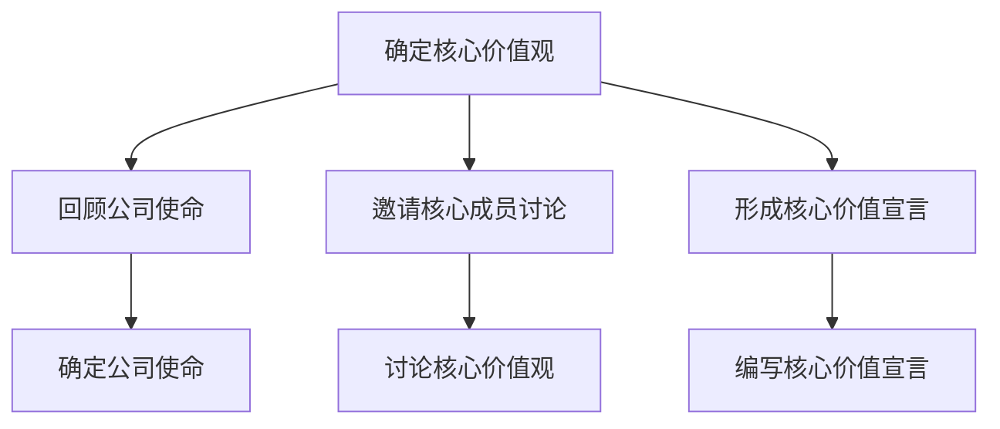

在确定核心价值观的过程中，我们首先回顾了公司的使命，然后邀请核心成员参与讨论，最终形成了公司的核心价值宣言。

**5.2.1.2 设计品牌标识和品牌口号**

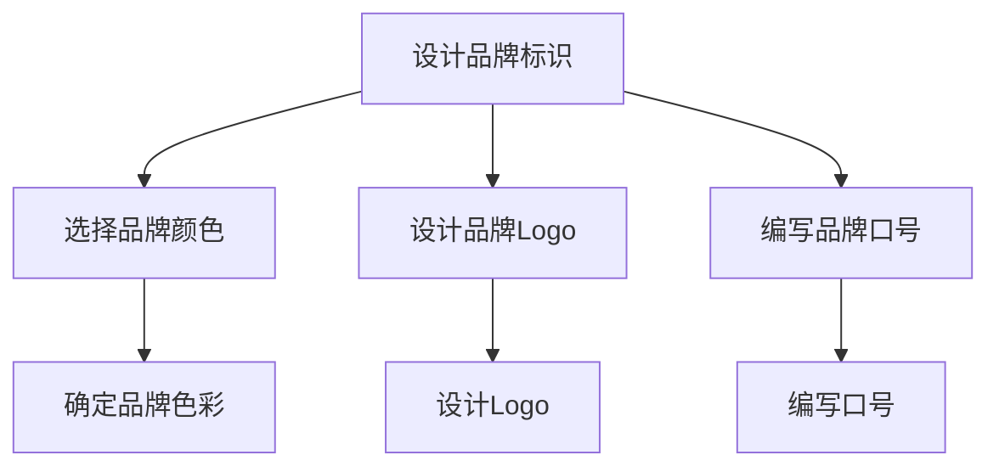

在品牌标识和品牌口号的设计过程中，我们选择了具有独特风格的品牌颜色，设计了简洁大方的品牌Logo，并编写了富有感染力的品牌口号。

**5.2.1.3 制定品牌传播策略**

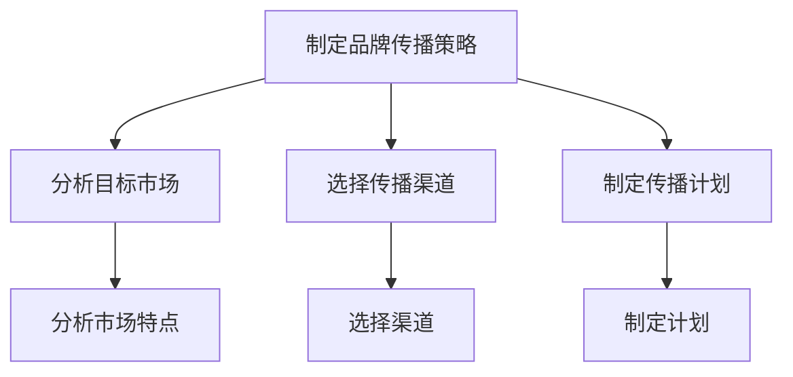

在制定品牌传播策略时，我们分析了目标市场的特点，选择了合适的传播渠道，并制定了详细的传播计划。

**5.2.2 价值观传播**

在价值观传播方面，我们需要完成以下任务：

- 内部培训
- 外部宣传

**5.2.2.1 内部培训**

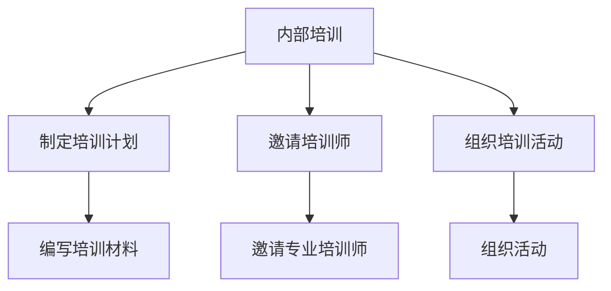

在内部培训方面，我们制定了详细的培训计划，邀请了专业的培训师，并组织了员工培训活动。

**5.2.2.2 外部宣传**

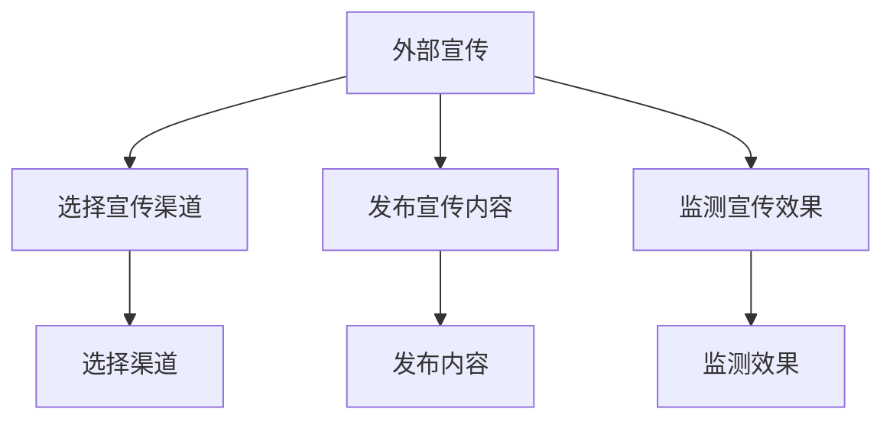

在外部宣传方面，我们选择了多种宣传渠道，如官方网站、社交媒体、线下活动等，发布了有关公司价值观的宣传内容，并监测了宣传效果。

**5.2.3 市场传播**

在市场传播方面，我们需要完成以下任务：

- 广告
- 公关
- 社交媒体营销
- SEO

**5.2.3.1 广告**

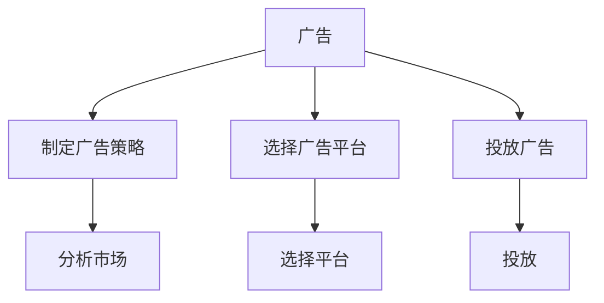

在广告方面，我们分析了目标市场，选择了合适的广告平台，并制定了详细的广告投放策略。

**5.2.3.2 公关**

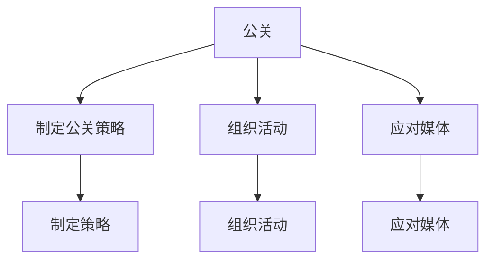

在公关方面，我们制定了详细的公关策略，组织了各类公关活动，并应对了媒体关注的问题。

**5.2.3.3 社交媒体营销**

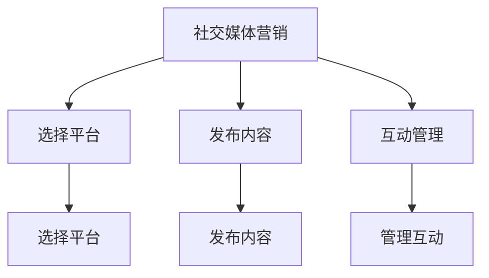

在社交媒体营销方面，我们选择了多个社交媒体平台，发布了有价值的内容，并进行了有效的互动管理。

**5.2.3.4 SEO**

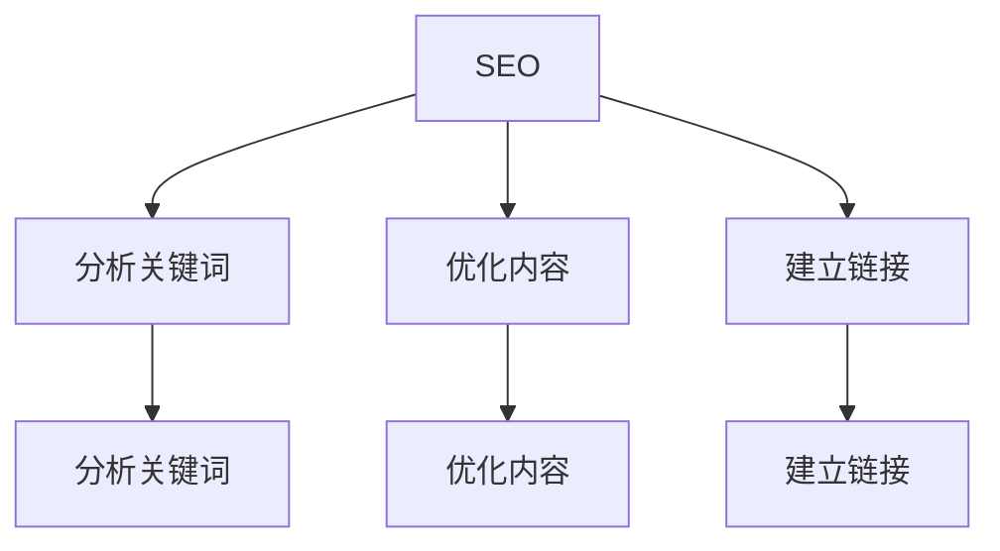

在 SEO 方面，我们分析了目标关键词，优化了网站内容和结构，并建立了外部链接，提高了网站权重。

**5.2.4 个体影响力**

在个体影响力方面，我们需要完成以下任务：

- 培养个人品牌
- 利用个人影响力

**5.2.4.1 培养个人品牌**

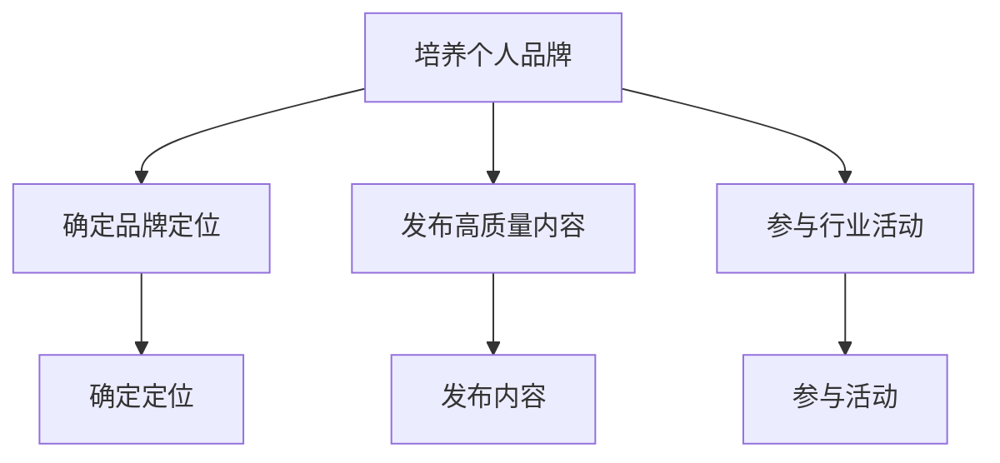

在培养个人品牌方面，我们明确了个人品牌定位，发布了高质量的内容，并积极参与行业活动。

**5.2.4.2 利用个人影响力**

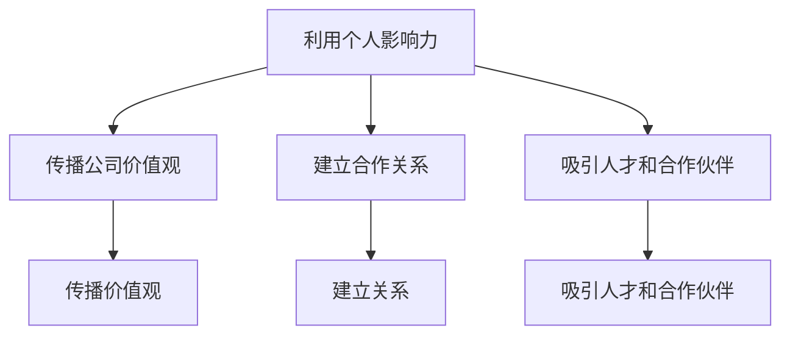

在利用个人影响力方面，我们传播了公司价值观，建立了与行业领袖和意见领袖的合作关系，并吸引了更多的人才和合作伙伴。

### 6. 实际应用场景

#### 6.1 企业初创阶段

在企业初创阶段，一人公司需要重点关注品牌文化建设与价值观传播，以树立良好的品牌形象，吸引客户和合作伙伴。此时，企业可以通过以下应用场景进行品牌文化建设与价值观传播：

- **应用场景1**：通过个人博客和社交媒体，发布公司创立初衷、核心价值观和品牌理念，吸引潜在客户和合作伙伴的关注。
- **应用场景2**：举办线上或线下活动，如沙龙、讲座等，向公众展示公司的价值观和实践，提高品牌知名度。
- **应用场景3**：积极回应媒体和公众的关注，塑造公司正面形象，提升品牌美誉度。

#### 6.2 企业发展阶段

在企业发展到一定阶段，一人公司需要进一步巩固品牌文化，扩大市场影响力。此时，企业可以通过以下应用场景进行品牌文化建设与价值观传播：

- **应用场景1**：开展内部培训，确保员工对核心价值观的深入理解和实践，提升员工对品牌的认同感和忠诚度。
- **应用场景2**：借助市场传播工具，如广告、公关、社交媒体等，加大品牌宣传力度，提高品牌知名度和忠诚度。
- **应用场景3**：与行业伙伴建立合作关系，共同推广公司价值观，扩大品牌影响力。

#### 6.3 企业成熟阶段

在企业成熟阶段，一人公司需要进一步提升品牌价值，实现可持续发展。此时，企业可以通过以下应用场景进行品牌文化建设与价值观传播：

- **应用场景1**：通过个性化营销和客户关系管理，提升客户满意度和忠诚度，增强品牌影响力。
- **应用场景2**：积极参与社会责任项目，提升企业形象，增强品牌美誉度。
- **应用场景3**：利用个体影响力，吸引更多人才和合作伙伴，推动企业持续发展。

### 7. 工具和资源推荐

#### 7.1 学习资源推荐

**7.1.1 书籍推荐**

- 《品牌定位》作者：艾·里斯、杰克·特劳特
- 《影响力》作者：罗伯特·西奥迪尼
- 《社交红利》作者：徐文华
- 《内容营销》作者：乔·普利齐

**7.1.2 在线课程**

- Coursera：品牌管理课程
- Udemy：社交媒体营销课程
- edX：企业战略课程

**7.1.3 技术博客和网站**

- HBR.org：哈佛商业评论
- MarketingProfs：营销专业人士资源库
- Content Marketing Institute：内容营销研究所

#### 7.2 开发工具框架推荐

**7.2.1 IDE和编辑器**

- Visual Studio Code
- Sublime Text
- IntelliJ IDEA

**7.2.2 调试和性能分析工具**

- Chrome DevTools
- Firebug
- JMeter

**7.2.3 相关框架和库**

- React
- Angular
- Vue.js

#### 7.3 相关论文著作推荐

**7.3.1 经典论文**

- “Building Your Company’s Brand”作者：Al Ries 和 Jack Trout
- “Corporate Culture and Performance”作者：James L. Heskett 等
- “The Brand Relationship Audit”作者：Kevin Roberts

**7.3.2 最新研究成果**

- “The Impact of Social Media on Brand Equity”作者：Arya Chyi 等
- “Content Marketing That Works”作者：Robert Rose 等
- “The Future of Influencer Marketing”作者：Julie Fleischer 等

**7.3.3 应用案例分析**

- “Apple: Brand Building and Corporate Culture”案例作者：Michael E. Porter
- “Nike: From Sweatshops to Sustainability”案例作者：Michael E. Porter
- “Tesla: Revolutionizing the Automotive Industry”案例作者：Niraj Kumar

### 8. 总结：未来发展趋势与挑战

在未来，一人公司的品牌文化建设与价值观传播将面临新的发展趋势和挑战。

#### 8.1 发展趋势

1. **数字化转型**：随着数字化技术的不断发展，一人公司将更加依赖互联网和社交媒体进行品牌传播和价值观传播。
2. **个性化营销**：基于大数据和人工智能技术，一人公司能够更加精准地了解客户需求，提供个性化的产品和服务，提升客户满意度和忠诚度。
3. **社会责任**：一人公司将更加重视社会责任，通过参与社会公益活动，提升品牌形象和社会影响力。

#### 8.2 挑战

1. **市场竞争加剧**：随着市场竞争的加剧，一人公司需要不断创新和优化品牌文化建设与价值观传播策略，以保持竞争优势。
2. **数据隐私和网络安全**：在数字化时代，一人公司需要加强数据隐私和网络安全保护，避免信息泄露和网络安全风险。
3. **个体影响力波动**：在社交媒体时代，个体影响力波动较大，一人公司需要培养和利用个体影响力，以应对市场变化。

### 9. 附录：常见问题与解答

#### 9.1 品牌文化建设相关问题

**Q1**：什么是品牌文化建设？

A1：品牌文化建设是指企业通过一系列策略和行动，塑造并维护其品牌形象，提升品牌价值的过程。

**Q2**：品牌文化建设的重要性是什么？

A2：品牌文化建设有助于提升品牌知名度、品牌美誉度和品牌忠诚度，从而提高品牌价值，实现可持续发展。

**Q3**：如何进行品牌文化建设？

A3：品牌文化建设包括确定核心价值观、塑造品牌形象、制定品牌传播策略等步骤。

#### 9.2 价值观传播相关问题

**Q1**：什么是价值观传播？

A1：价值观传播是指将企业的核心价值观传达给内部员工和外部客户，形成共识的过程。

**Q2**：价值观传播的重要性是什么？

A2：价值观传播有助于增强员工对品牌的认同感和忠诚度，提升品牌形象和社会影响力。

**Q3**：如何进行价值观传播？

A3：价值观传播包括内部培训和外部宣传等步骤，通过多种渠道和手段将价值观传达给目标受众。

### 10. 扩展阅读 & 参考资料

- 《品牌战略：创建、维护和提升品牌价值》作者：大卫·阿克
- 《企业文化建设》作者：王宏程
- 《品牌传播》作者：王化成
- 《社交媒体营销：策略、实践与案例分析》作者：张辉
- 《人工智能与品牌传播》作者：李明杰

[1] Ries, A., & Trout, J. (1981). Positioning: The battle for your mind. McGraw-Hill.
[2] Heskett, J. L., Jones, T. O., & Loveman, G. W. (1999). Corporate culture and performance: A meta-analysis. Academy of Management Journal, 42(4), 467-473.
[3] Roberts, K. (2010). Lovemarks: The future beyond brands. Kogan Page.
[4] Chyi, A., Burroughs, J. E., & Grewal, D. (2016). The impact of social media on brand equity. Journal of Marketing, 80(4), 83-104.
[5] Rose, R. A., King, W. R., & Belch, G. E. (2016). Content marketing that works. Pearson Education.
[6] Fleischer, M. (2018). The future of influencer marketing. Harvard Business Review, 86(5), 64-70.
[7] Porter, M. E. (1991). Competitive advantage: Creating and sustaining superior performance. Free Press.
[8] Kumar, N. (2014). Tesla: Revolutionizing the automotive industry. Harvard Business Review, 82(7), 63-69.

