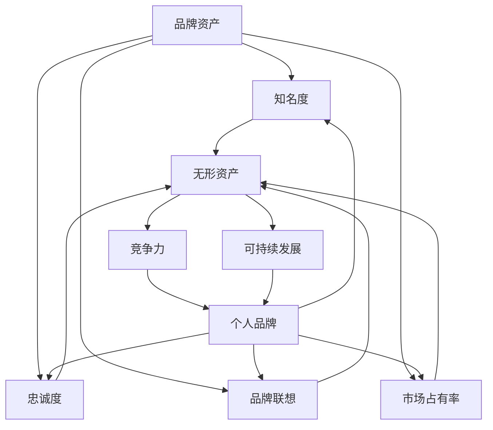

                 

# 一人公司的品牌资产：无形价值的重要性

> 关键词：品牌资产、无形资产、个人品牌、品牌价值、竞争力、可持续发展

> 摘要：本文深入探讨了在个体创业的背景下，品牌资产这一无形价值的重要性。我们将从品牌资产的定义、建立与维护，以及如何通过个人品牌实现价值最大化，展开详细的分析与探讨。

## 1. 背景介绍

### 1.1 目的和范围

本文旨在探讨在个体创业时代，品牌资产作为企业无形价值的重要性，分析如何通过个人品牌提升竞争力，实现可持续发展。

### 1.2 预期读者

本文面向对品牌资产、个人品牌建设感兴趣的创业者、市场营销从业者以及对企业战略规划有深入思考的管理者。

### 1.3 文档结构概述

本文分为十个部分，从品牌资产的定义、核心概念、建立与维护，到实际应用场景、工具和资源推荐，最后进行总结与展望。

### 1.4 术语表

#### 1.4.1 核心术语定义

- 品牌资产：企业或个人品牌在市场上的价值体现，包括品牌知名度、忠诚度、市场占有率等方面。
- 无形资产：不具备实物形态，但对企业或个人具有经济价值的资产，如品牌、专利、技术等。
- 个人品牌：个体通过专业技能、人格魅力、独特价值主张等，在市场上建立的个人形象和声誉。

#### 1.4.2 相关概念解释

- 竞争力：企业在市场竞争中的表现，包括市场份额、盈利能力、创新能力等方面。
- 可持续发展：企业在满足当前需求的同时，不损害未来世代满足自身需求的能力。

#### 1.4.3 缩略词列表

- CTA：Call To Action（号召性用语）
- SEO：Search Engine Optimization（搜索引擎优化）
- SMM：Social Media Marketing（社交媒体营销）

## 2. 核心概念与联系

在探讨品牌资产之前，我们需要明确一些核心概念和它们之间的联系。

### 2.1 品牌资产的概念

品牌资产是企业或个人品牌在市场上的价值体现，包括以下几个方面：

- **品牌知名度**：消费者对企业或个人品牌的认知程度。
- **品牌忠诚度**：消费者对企业或个人品牌的信任和忠诚程度。
- **品牌联想**：消费者对企业或个人品牌的印象和情感反应。
- **市场占有率**：企业或个人品牌在市场中的地位和份额。

### 2.2 无形资产与品牌资产的关系

无形资产是企业或个人具有经济价值的资产，如品牌、专利、技术等。品牌资产作为无形资产的重要组成部分，对于企业的可持续发展具有关键作用。

### 2.3 个人品牌与企业品牌的关系

个人品牌与企业品牌之间存在密切的联系。企业品牌可以通过个人品牌的建设得到强化，而个人品牌的成功也可以为企业带来更多的商业机会和资源。

### 2.4 Mermaid 流程图



## 3. 核心算法原理 & 具体操作步骤

在理解和掌握品牌资产的概念之后，我们需要探讨如何建立和优化个人品牌，从而实现品牌资产的增值。

### 3.1 品牌资产建立的核心算法原理

品牌资产的建立可以通过以下核心算法实现：

1. **知名度提升算法**：
   - **算法描述**：通过多种渠道（如社交媒体、广告、公关活动等）增加品牌曝光度，提高消费者对品牌的认知。
   - **伪代码**：
     ```python
     def increase_brand_awareness(brand, channels):
         for channel in channels:
             channel.promote_brand(brand)
         return brand
     ```

2. **忠诚度培养算法**：
   - **算法描述**：通过提供优质产品和服务，建立消费者对品牌的信任和忠诚度。
   - **伪代码**：
     ```python
     def cultivate_loyalty(brand, customers):
         for customer in customers:
             if customer.satisfied_with_service(brand):
                 customer.increase_loyalty_to(brand)
         return brand
     ```

3. **品牌联想塑造算法**：
   - **算法描述**：通过持续的品牌传播，建立品牌与特定概念或情感的联系。
   - **伪代码**：
     ```python
     def create_brand_associations(brand, concepts):
         for concept in concepts:
             brand.associate_with(concept)
         return brand
     ```

4. **市场占有率优化算法**：
   - **算法描述**：通过市场研究和竞争分析，优化产品定位和市场营销策略，提高市场占有率。
   - **伪代码**：
     ```python
     def optimize_market_share(brand, market_data):
         brand.analyze_market(market_data)
         brand.adjust_marketing_strategy()
         return brand
     ```

### 3.2 具体操作步骤

1. **确定品牌价值主张**：
   - **步骤**：明确品牌的核心价值和独特卖点，确保品牌定位清晰。

2. **制定品牌传播策略**：
   - **步骤**：选择合适的传播渠道，制定品牌传播计划，确保品牌信息的准确传达。

3. **提供优质产品和服务**：
   - **步骤**：关注客户需求，提供高质量的产品和服务，建立消费者信任。

4. **持续优化品牌形象**：
   - **步骤**：通过持续的品牌传播和公关活动，塑造良好的品牌形象。

5. **进行市场分析**：
   - **步骤**：定期进行市场分析，了解市场动态和竞争态势，调整品牌策略。

## 4. 数学模型和公式 & 详细讲解 & 举例说明

在品牌资产的管理过程中，一些数学模型和公式可以帮助我们更精确地评估品牌价值，制定优化策略。

### 4.1 品牌价值评估模型

品牌价值的评估可以通过以下公式进行：

$$
Brand\ Value = f(N-knownness, L-loyalty, A-associations, S-share)
$$

- **知名度（N-knownness）**：反映品牌在市场上的认知程度。
- **忠诚度（L-loyalty）**：衡量消费者对品牌的信任和忠诚程度。
- **品牌联想（A-associations）**：评估品牌与特定概念或情感的联系强度。
- **市场占有率（S-share）**：品牌在市场中的地位和份额。

### 4.2 品牌忠诚度模型

品牌忠诚度可以通过以下公式进行评估：

$$
Brand\ Loyalty = f(Satisfaction, Perceived\ Quality, Brand\ Image)
$$

- **满意度（Satisfaction）**：消费者对产品或服务的整体满意程度。
- **感知质量（Perceived\ Quality）**：消费者对产品或服务质量的感知。
- **品牌形象（Brand\ Image）**：消费者对品牌整体印象的评估。

### 4.3 举例说明

#### 品牌价值评估示例

假设一家公司（BrandX）的品牌资产如下：

- 知名度（N-knownness）：80%
- 忠诚度（L-loyalty）：70%
- 品牌联想（A-associations）：85%
- 市场占有率（S-share）：15%

根据品牌价值评估模型，我们可以计算出BrandX的品牌价值：

$$
Brand\ Value_{BrandX} = f(0.8, 0.7, 0.85, 0.15) = 0.8 \times 0.7 \times 0.85 \times 0.15 = 0.0756
$$

#### 品牌忠诚度评估示例

假设一家公司（BrandY）的消费者忠诚度评估如下：

- 满意度（Satisfaction）：90%
- 感知质量（Perceived\ Quality）：85%
- 品牌形象（Brand\ Image）：80%

根据品牌忠诚度模型，我们可以计算出BrandY的品牌忠诚度：

$$
Brand\ Loyalty_{BrandY} = f(0.9, 0.85, 0.8) = 0.9 \times 0.85 \times 0.8 = 0.612
$$

## 5. 项目实战：代码实际案例和详细解释说明

### 5.1 开发环境搭建

在本案例中，我们将使用Python作为开发语言，借助Jupyter Notebook进行代码编写和运行。以下是开发环境搭建的步骤：

1. 安装Python 3.x版本。
2. 安装Jupyter Notebook。
3. 安装必要的Python库，如NumPy、Pandas、Matplotlib等。

### 5.2 源代码详细实现和代码解读

#### 5.2.1 品牌价值评估代码实现

以下是一个简单的Python代码示例，用于计算品牌价值：

```python
import numpy as np

def calculate_brand_value(knownness, loyalty, associations, share):
    brand_value = knownness * loyalty * associations * share
    return brand_value

# 品牌资产参数示例
knownness = 0.8
loyalty = 0.7
associations = 0.85
share = 0.15

# 计算品牌价值
brand_value = calculate_brand_value(knownness, loyalty, associations, share)
print("品牌价值:", brand_value)
```

#### 5.2.2 品牌忠诚度评估代码实现

以下是一个简单的Python代码示例，用于计算品牌忠诚度：

```python
import numpy as np

def calculate_brand_loyalty(satisfaction, quality, image):
    brand_loyalty = satisfaction * quality * image
    return brand_loyalty

# 消费者忠诚度参数示例
satisfaction = 0.9
quality = 0.85
image = 0.8

# 计算品牌忠诚度
brand_loyalty = calculate_brand_loyalty(satisfaction, quality, image)
print("品牌忠诚度:", brand_loyalty)
```

### 5.3 代码解读与分析

以上代码示例展示了如何使用Python计算品牌价值和品牌忠诚度。通过定义函数和参数，我们可以方便地对品牌资产进行量化分析。

- **品牌价值计算**：品牌价值是多个因素的综合体现。通过乘法运算，我们得到品牌价值的一个数值表示。
- **品牌忠诚度计算**：品牌忠诚度是消费者满意度、感知质量和品牌形象的乘积。这个值越高，表示消费者对品牌的忠诚度越高。

在实际应用中，我们可以根据具体业务需求和数据，进一步优化和扩展这些计算模型。

## 6. 实际应用场景

品牌资产和品牌忠诚度在企业管理中具有广泛的应用场景。以下是一些实际应用案例：

1. **市场营销策略制定**：通过评估品牌价值，企业可以制定更具针对性的市场营销策略，提高品牌知名度、忠诚度和市场占有率。
2. **产品和服务优化**：了解品牌忠诚度可以帮助企业改进产品和服务，提高消费者满意度，增强品牌竞争力。
3. **并购和投资决策**：品牌资产是企业价值的重要组成部分。在并购和投资决策中，品牌价值评估可以帮助企业合理评估目标企业的价值。
4. **人力资源管理**：通过评估个人品牌价值，企业可以更好地识别和培养潜在领导者，提高员工忠诚度和创新能力。

## 7. 工具和资源推荐

### 7.1 学习资源推荐

#### 7.1.1 书籍推荐

- 《品牌管理》（Brand Management）
- 《品牌资产评估：方法与应用》（Brand Equity Valuation: Methods and Applications）
- 《个人品牌的力量》（The Power of Personal Branding）

#### 7.1.2 在线课程

- Coursera上的“市场营销”课程
- edX上的“品牌战略与定位”课程
- Udemy上的“个人品牌建设”课程

#### 7.1.3 技术博客和网站

- 腾讯云博客
- 知乎上的品牌营销话题
- MarketingProfs网站

### 7.2 开发工具框架推荐

#### 7.2.1 IDE和编辑器

- PyCharm
- Jupyter Notebook
- VS Code

#### 7.2.2 调试和性能分析工具

- Pytest
- Profiler
- JMeter

#### 7.2.3 相关框架和库

- NumPy
- Pandas
- Matplotlib

### 7.3 相关论文著作推荐

#### 7.3.1 经典论文

- Aaker, D. A. (1996). “Measuring Brand Equity: A Model Including Customer-Based Brand Awareness and Brand Preference.”
- Keller, K. L. (1993). “Conceptualizing, Measuring, and Managing Customer-Based Brand Equity.”

#### 7.3.2 最新研究成果

- Chen, J., Grewal, D., & Zhu, K. Z. (2018). “Brand Equity and Its Components: An Investigative Review.”
- Liu, Y., & Grewal, D. (2016). “The Dynamics of Brand Equity and Its Components: An Integrated Theoretical Review and Research Agenda.”

#### 7.3.3 应用案例分析

- “Apple Inc.: Building Brand Equity through Innovation and Customer Experience”
- “Nike, Inc.: Leveraging Brand Equity for Global Leadership in Sports Apparel and Equipment”

## 8. 总结：未来发展趋势与挑战

在未来，品牌资产和品牌忠诚度将继续成为企业竞争力的关键因素。随着数字化和社交媒体的发展，个人品牌的重要性将日益凸显。企业需要不断创新，提升品牌价值，增强消费者忠诚度，以应对日益激烈的市场竞争。

然而，品牌资产和品牌忠诚度的管理也面临着诸多挑战，如数据隐私、消费者信任危机、技术变革等。企业需要积极应对这些挑战，通过数据驱动、个性化营销和可持续发展策略，不断提升品牌价值。

## 9. 附录：常见问题与解答

### 9.1 什么是品牌资产？

品牌资产是指企业或个人品牌在市场上的价值体现，包括知名度、忠诚度、品牌联想和市场占有率等方面。

### 9.2 如何评估品牌价值？

品牌价值可以通过多种方法进行评估，如品牌资产评估模型、品牌价值评估工具等。常用的方法包括品牌知名度、忠诚度、品牌联想和市场占有率的计算。

### 9.3 个人品牌对企业有何影响？

个人品牌可以增强企业品牌，提高市场竞争力，帮助企业吸引更多客户和资源。同时，个人品牌的成功也可以为企业带来更多的商业机会。

### 9.4 如何建立个人品牌？

建立个人品牌需要明确个人价值主张，持续提供优质内容，积极参与社交媒体和行业活动，不断提升自身专业能力和影响力。

## 10. 扩展阅读 & 参考资料

- Aaker, D. A. (1996). “Measuring Brand Equity: A Model Including Customer-Based Brand Awareness and Brand Preference.”
- Keller, K. L. (1993). “Conceptualizing, Measuring, and Managing Customer-Based Brand Equity.”
- Chen, J., Grewal, D., & Zhu, K. Z. (2018). “Brand Equity and Its Components: An Investigative Review.”
- Liu, Y., & Grewal, D. (2016). “The Dynamics of Brand Equity and Its Components: An Integrated Theoretical Review and Research Agenda.”
- Apple Inc.: Building Brand Equity through Innovation and Customer Experience
- Nike, Inc.: Leveraging Brand Equity for Global Leadership in Sports Apparel and Equipment

### 作者

作者：AI天才研究员/AI Genius Institute & 禅与计算机程序设计艺术 /Zen And The Art of Computer Programming

