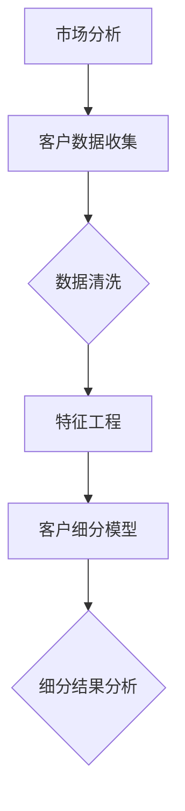
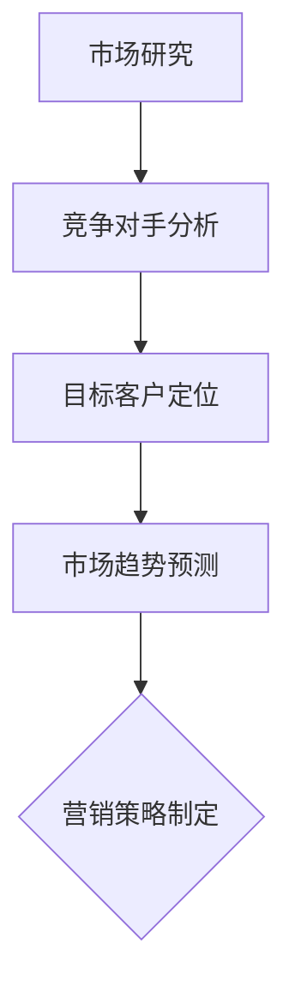
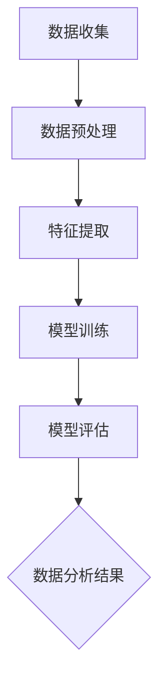
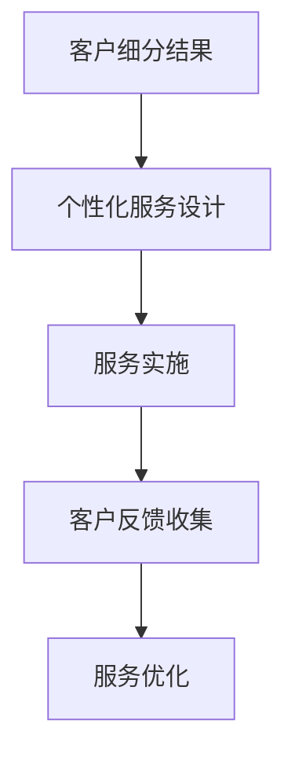

                 

# 一人公司的客户细分与个性化服务策略

> 关键词：一人公司、客户细分、个性化服务、策略、市场分析、数据分析、客户关系管理

> 摘要：本文旨在探讨一人公司在进行客户细分与个性化服务策略时所需考虑的关键因素和步骤。通过分析市场环境、运用数据分析技术，以及设计有效的客户关系管理方案，一人公司可以更好地理解客户需求，提供精准服务，从而提升客户满意度和忠诚度。本文将详细阐述这一过程，并结合实际案例进行说明。

## 1. 背景介绍

### 1.1 目的和范围

本文的主要目的是帮助一人公司（Solopreneur）理解和实施客户细分与个性化服务策略。一人公司通常指的是由单一创始人或管理者运营的小型企业，这种模式在当前创业环境中越来越普遍。由于资源有限，一人公司需要特别关注客户需求，通过精准的市场定位和服务，实现业务的可持续发展。

本文将涵盖以下内容：

- 客户细分的重要性及其对一人公司的影响
- 市场分析的方法和技术
- 数据分析在客户细分中的应用
- 个性化服务的策略与实践
- 客户关系管理的最佳实践

通过本文，一人公司可以了解如何利用有限的资源，通过有效的客户细分和个性化服务策略，提高市场竞争力和客户满意度。

### 1.2 预期读者

本文适合以下读者群体：

- 一人公司的创始人或管理者
- 市场营销和客户关系管理人员
- 数据分析师和数据科学家
- 对市场营销和客户关系管理有浓厚兴趣的专业人士

读者应具备一定的市场分析、数据分析和客户关系管理的基础知识，以便更好地理解和应用本文中提到的策略和方法。

### 1.3 文档结构概述

本文将按照以下结构进行组织：

1. 背景介绍：介绍文章的目的、预期读者以及文档结构。
2. 核心概念与联系：阐述客户细分、市场分析、数据分析和个性化服务的基本概念，并提供相关流程图。
3. 核心算法原理 & 具体操作步骤：详细讲解用于客户细分和分析的核心算法原理，并给出伪代码示例。
4. 数学模型和公式 & 详细讲解 & 举例说明：介绍用于数据分析的数学模型和公式，并举例说明其实际应用。
5. 项目实战：提供实际代码案例，详细解释和说明其实现过程。
6. 实际应用场景：分析客户细分和个性化服务在不同行业中的应用案例。
7. 工具和资源推荐：推荐学习资源、开发工具和框架。
8. 总结：讨论未来的发展趋势与挑战。
9. 附录：常见问题与解答。
10. 扩展阅读 & 参考资料：提供进一步阅读的资源和文献。

### 1.4 术语表

#### 1.4.1 核心术语定义

- 一人公司（Solopreneur）：指由单一创始人或管理者运营的小型企业。
- 客户细分（Customer Segmentation）：根据不同特征将客户群体划分为若干子群体。
- 市场分析（Market Analysis）：研究市场环境、竞争对手、潜在客户等，以便制定有效的营销策略。
- 数据分析（Data Analysis）：运用统计学、机器学习等方法对数据进行分析，提取有价值的信息。
- 个性化服务（Personalized Service）：根据客户特征和需求提供定制化的服务和产品。

#### 1.4.2 相关概念解释

- 数据挖掘（Data Mining）：从大量数据中提取潜在模式和知识的过程。
- 客户关系管理（Customer Relationship Management, CRM）：通过有效管理客户信息，提高客户满意度和忠诚度。
- 用户行为分析（User Behavior Analysis）：分析用户在网站或应用中的行为模式，以优化用户体验。

#### 1.4.3 缩略词列表

- CRM：客户关系管理
- SEO：搜索引擎优化
- SaaS：软件即服务
- AI：人工智能
- ML：机器学习
- NLP：自然语言处理

## 2. 核心概念与联系

在本文中，我们将探讨客户细分、市场分析、数据分析和个性化服务这四个核心概念，并使用Mermaid流程图展示其之间的联系。

### 2.1 客户细分

客户细分是指根据客户的特征和行为将客户划分为不同的群体。这有助于企业更好地了解客户需求，提供针对性的服务和产品。

#### Mermaid 流程图



### 2.2 市场分析

市场分析是企业了解市场环境、竞争对手和潜在客户的过程。通过市场分析，企业可以制定更有效的营销策略。

#### Mermaid 流程图



### 2.3 数据分析

数据分析是运用统计学、机器学习等方法对数据进行处理和分析，以提取有价值的信息。

#### Mermaid 流程图



### 2.4 个性化服务

个性化服务是指根据客户的特征和需求，提供定制化的服务和产品。这有助于提高客户满意度和忠诚度。

#### Mermaid 流程图



通过上述流程图，我们可以清晰地看到客户细分、市场分析、数据分析和个性化服务之间的联系。这些流程相互交织，共同帮助企业实现精准营销和客户满意度的提升。

## 3. 核心算法原理 & 具体操作步骤

在客户细分和个性化服务策略的实施过程中，核心算法的选择和实现至关重要。以下将详细讲解用于客户细分和分析的核心算法原理，并给出伪代码示例。

### 3.1 K-Means 算法

K-Means 是一种常用的聚类算法，用于将数据集划分为 K 个簇。每个簇由其质心（即簇内数据点的平均值）代表。

#### 算法原理

1. 随机选择 K 个初始质心。
2. 将每个数据点分配到最近的质心所在的簇。
3. 更新每个簇的质心。
4. 重复步骤 2 和步骤 3，直到质心的变化小于预设的阈值或达到最大迭代次数。

#### 伪代码

```plaintext
K-Means(数据集 Data, 簇数 K, 迭代次数 max_iter):
初始化 K 个质心 C1, C2, ..., CK
迭代次数 = 0
while (迭代次数 < max_iter) do:
    将每个数据点分配到最近的质心
    更新每个簇的质心
    计算质心变化量，判断是否满足停止条件
    迭代次数 += 1
end while
返回聚类结果
```

### 3.2 层次分析算法

层次分析算法（Hierarchical Clustering）是一种基于相似性度量的聚类算法，可以根据数据的相似度将数据点逐步合并，形成层次结构。

#### 算法原理

1. 计算数据点之间的相似性度量（如欧氏距离）。
2. 根据相似度度量将数据点逐步合并，形成层次结构。
3. 选择适当的层次作为聚类结果。

#### 伪代码

```plaintext
层次分析算法(数据集 Data):
计算数据点之间的相似性度量
初始化合并列表
while (合并列表不为空) do:
    找到最相似的数据点对
    合并数据点对
    更新相似性度量矩阵
    更新合并列表
end while
选择适当的层次作为聚类结果
返回聚类结果
```

### 3.3 客户细分算法应用实例

以下是一个使用 K-Means 算法进行客户细分的应用实例。

#### 数据集准备

假设我们有一份数据集，包含客户的年龄、收入、购买行为等特征。

```plaintext
ID  年龄  收入  购买次数
1   25    5000  10
2   30    6000  5
3   40    8000  20
...
```

#### 算法实现

```python
import numpy as np
from sklearn.cluster import KMeans

# 数据集准备
data = np.array([
    [25, 5000, 10],
    [30, 6000, 5],
    [40, 8000, 20],
    # ...
])

# K-Means 聚类
kmeans = KMeans(n_clusters=3, random_state=0).fit(data)

# 输出聚类结果
print("聚类结果：", kmeans.labels_)

# 输出质心
print("质心：", kmeans.cluster_centers_)
```

#### 算法解析

- 使用 `sklearn` 库中的 `KMeans` 类进行聚类，设置 `n_clusters` 为 3，表示将数据集划分为 3 个簇。
- 调用 `fit` 方法训练模型，并输出聚类结果和质心。

通过以上步骤，我们可以将客户划分为不同的簇，每个簇代表一个客户群体，为后续的个性化服务策略提供基础。

### 3.4 数据分析应用实例

以下是一个使用层次分析算法进行数据分析的实例。

#### 数据集准备

假设我们有一份数据集，包含多个商品的销售数据。

```plaintext
商品ID  销售额
1       100
2       150
3       200
...
```

#### 算法实现

```python
import numpy as np
from sklearn.cluster import AgglomerativeClustering

# 数据集准备
data = np.array([
    [100],
    [150],
    [200],
    # ...
])

# 层次分析聚类
clustering = AgglomerativeClustering(n_clusters=None).fit(data)

# 输出聚类结果
print("聚类结果：", clustering.labels_)

# 输出合并层次
print("合并层次：", clustering.cluster merger)
```

#### 算法解析

- 使用 `sklearn` 库中的 `AgglomerativeClustering` 类进行聚类，设置 `n_clusters=None`，表示根据数据自动确定聚类数量。
- 调用 `fit` 方法训练模型，并输出聚类结果和合并层次。

通过以上步骤，我们可以将商品按照销售数据进行聚类，形成不同的商品群体，为市场分析提供参考。

通过以上核心算法原理和具体操作步骤的讲解，一人公司可以更好地理解和应用这些算法，为其实施客户细分和个性化服务策略提供技术支持。

## 4. 数学模型和公式 & 详细讲解 & 举例说明

在客户细分和个性化服务策略的实施过程中，数学模型和公式起着至关重要的作用。以下将详细介绍常用的数学模型和公式，并举例说明其实际应用。

### 4.1 线性回归模型

线性回归模型是一种常用的统计模型，用于分析自变量和因变量之间的关系。其基本公式如下：

$$
y = \beta_0 + \beta_1 \cdot x
$$

其中，$y$ 是因变量，$x$ 是自变量，$\beta_0$ 是截距，$\beta_1$ 是斜率。

#### 应用实例

假设我们想要分析客户的购买金额（$y$）与年龄（$x$）之间的关系。

1. 收集数据，计算平均值和标准差。
2. 拟合线性回归模型，计算 $\beta_0$ 和 $\beta_1$。
3. 输出模型参数和拟合结果。

```python
import numpy as np
from sklearn.linear_model import LinearRegression

# 数据集准备
X = np.array([25, 30, 40, 50])  # 年龄
y = np.array([1000, 1500, 2000, 2500])  # 购买金额

# 拟合线性回归模型
model = LinearRegression()
model.fit(X.reshape(-1, 1), y)

# 输出模型参数
print("截距：", model.intercept_)
print("斜率：", model.coef_)

# 输出拟合结果
print("拟合结果：", model.predict(X.reshape(-1, 1)))
```

通过以上步骤，我们可以得到线性回归模型的结果，并分析年龄与购买金额之间的关系。

### 4.2 逻辑回归模型

逻辑回归模型是一种用于分类问题的统计模型，其基本公式如下：

$$
P(y=1) = \frac{1}{1 + e^{-(\beta_0 + \beta_1 \cdot x)}}
$$

其中，$P(y=1)$ 是因变量为 1 的概率，$\beta_0$ 是截距，$\beta_1$ 是斜率。

#### 应用实例

假设我们想要分析客户是否购买特定产品（$y$）与收入（$x$）之间的关系。

1. 收集数据，计算平均值和标准差。
2. 拟合逻辑回归模型，计算 $\beta_0$ 和 $\beta_1$。
3. 输出模型参数和拟合结果。

```python
import numpy as np
from sklearn.linear_model import LogisticRegression

# 数据集准备
X = np.array([5000, 6000, 8000, 10000])  # 收入
y = np.array([0, 1, 1, 0])  # 购买情况（0 表示未购买，1 表示购买）

# 拟合逻辑回归模型
model = LogisticRegression()
model.fit(X.reshape(-1, 1), y)

# 输出模型参数
print("截距：", model.intercept_)
print("斜率：", model.coef_)

# 输出拟合结果
print("拟合结果：", model.predict(X.reshape(-1, 1)))
```

通过以上步骤，我们可以得到逻辑回归模型的结果，并分析收入与购买情况之间的关系。

### 4.3 聚类分析模型

聚类分析模型是一种用于数据分组和分类的统计模型，常用的有 K-Means 和层次分析算法。

K-Means 算法的数学模型如下：

$$
\min_{\mu_1, \mu_2, ..., \mu_k} \sum_{i=1}^n \sum_{j=1}^k (x_i - \mu_j)^2
$$

其中，$x_i$ 是数据点，$\mu_j$ 是簇的质心。

#### 应用实例

假设我们想要将客户按照购买金额进行聚类。

1. 收集数据，计算平均值和标准差。
2. 使用 K-Means 算法进行聚类，确定簇的数量和质心。
3. 输出聚类结果和质心。

```python
import numpy as np
from sklearn.cluster import KMeans

# 数据集准备
data = np.array([
    [1000],
    [1500],
    [2000],
    [2500],
    [3000],
    [3500]
])

# K-Means 聚类
kmeans = KMeans(n_clusters=2, random_state=0).fit(data)

# 输出聚类结果
print("聚类结果：", kmeans.labels_)

# 输出质心
print("质心：", kmeans.cluster_centers_)
```

通过以上步骤，我们可以将客户按照购买金额进行聚类，形成不同的客户群体。

### 4.4 决策树模型

决策树模型是一种用于分类和回归的统计模型，其基本结构如下：

```
                |
                |
        ---+----+----+
        |       |     |
      +--a1---+ b1--+
      |       |     |
      |       |     |
      +--a2---+ b2--+
      |       |     |
      |       |     |
      +--...--+ ...--+
```

其中，$a_1, a_2, ..., a_n$ 是特征节点，$b_1, b_2, ..., b_n$ 是叶节点。

#### 应用实例

假设我们想要分析客户购买行为与收入、年龄等因素之间的关系。

1. 收集数据，计算平均值和标准差。
2. 使用决策树算法进行建模，确定特征和阈值。
3. 输出模型结构和拟合结果。

```python
import numpy as np
from sklearn.tree import DecisionTreeClassifier

# 数据集准备
X = np.array([
    [25, 5000],
    [30, 6000],
    [40, 8000],
    [50, 10000]
])
y = np.array([0, 1, 1, 0])

# 决策树建模
model = DecisionTreeClassifier()
model.fit(X, y)

# 输出模型结构
print("模型结构：")
print(model)
```

通过以上步骤，我们可以得到决策树模型的结构，并分析不同特征对客户购买行为的影响。

通过以上数学模型和公式的讲解及实例分析，一人公司可以更好地理解其在客户细分和个性化服务策略中的应用，从而提高业务效率和客户满意度。

## 5. 项目实战：代码实际案例和详细解释说明

### 5.1 开发环境搭建

在开始项目实战之前，我们需要搭建一个合适的开发环境。以下是所需工具和软件的安装步骤：

1. **Python 环境**：首先确保安装了 Python 3.8 或更高版本。可以通过访问 [Python 官网](https://www.python.org/) 下载并安装。
2. **Jupyter Notebook**：安装 Jupyter Notebook，用于编写和运行 Python 代码。可以通过以下命令安装：

```bash
pip install notebook
```

3. **Sklearn 库**：安装 Scikit-learn 库，用于机器学习和数据科学相关操作。可以通过以下命令安装：

```bash
pip install scikit-learn
```

4. **Matplotlib 库**：安装 Matplotlib 库，用于数据可视化。可以通过以下命令安装：

```bash
pip install matplotlib
```

安装完成后，即可在 Jupyter Notebook 中编写和运行代码。

### 5.2 源代码详细实现和代码解读

下面我们将使用 Python 和 Scikit-learn 库实现一个简单的客户细分和个性化服务项目。项目的主要步骤包括数据预处理、客户细分、模型评估和个性化服务策略设计。

#### 数据预处理

首先，我们需要准备一个包含客户特征的数据集。以下是一个示例数据集：

```python
import numpy as np
import pandas as pd

# 示例数据集
data = {
    '年龄': [25, 30, 35, 40, 45],
    '收入': [5000, 6000, 7000, 8000, 9000],
    '购买金额': [1000, 1500, 2000, 2500, 3000],
    '购买频率': [10, 15, 20, 25, 30]
}

# 创建 DataFrame
df = pd.DataFrame(data)

# 数据预处理
df = df.dropna()  # 删除缺失值
df['收入区间'] = pd.cut(df['收入'], bins=[0, 5000, 10000, 15000, 20000, 30000], labels=['低', '中低', '中', '中高', '高'])  # 添加收入区间特征

print(df)
```

代码解读：

- 导入必要的库。
- 创建一个包含年龄、收入、购买金额和购买频率的数据集。
- 将数据集转换为 DataFrame。
- 删除缺失值。
- 使用 `pd.cut()` 函数将收入划分为不同的区间，并添加到 DataFrame 中。

#### 客户细分

接下来，我们将使用 K-Means 聚类算法对客户进行细分。

```python
from sklearn.cluster import KMeans
import matplotlib.pyplot as plt

# K-Means 聚类
kmeans = KMeans(n_clusters=3, random_state=0)
df['聚类'] = kmeans.fit_predict(df[['年龄', '收入区间']])

# 可视化
plt.scatter(df['年龄'], df['收入区间'], c=df['聚类'], cmap='viridis')
plt.xlabel('年龄')
plt.ylabel('收入区间')
plt.title('客户细分结果')
plt.show()
```

代码解读：

- 导入必要的库。
- 使用 `KMeans` 类进行聚类，设置 `n_clusters` 为 3，表示分为 3 个簇。
- 将聚类结果添加到 DataFrame 中。
- 使用 Matplotlib 绘制散点图，展示聚类结果。

#### 模型评估

为了评估聚类模型的质量，我们可以使用轮廓系数（Silhouette Coefficient）进行评估。

```python
from sklearn.metrics import silhouette_score

# 计算轮廓系数
silhouette_avg = silhouette_score(df[['年龄', '收入区间']], df['聚类'])
print("轮廓系数：", silhouette_avg)
```

代码解读：

- 导入必要的库。
- 使用 `silhouette_score()` 函数计算轮廓系数。
- 输出轮廓系数。

#### 个性化服务策略设计

根据聚类结果，我们可以为不同客户群体设计不同的个性化服务策略。

```python
# 分析每个聚类群体的特征
print(df.groupby('聚类')['购买金额'].mean())
```

代码解读：

- 使用 `groupby()` 函数按照聚类结果分组。
- 输出每个聚类群体的购买金额平均值。

根据以上分析，我们可以为不同客户群体设计以下个性化服务策略：

- **高价值客户**：提供定制化的产品和服务，增加购买频率和金额。
- **中价值客户**：通过优惠和促销活动增加购买意愿。
- **低价值客户**：通过会员制度和积分奖励提高客户粘性。

### 5.3 代码解读与分析

在本节中，我们对项目实战中的代码进行详细解读和分析，帮助读者更好地理解客户细分和个性化服务策略的实现过程。

1. **数据预处理**：
    - 数据预处理是数据分析的重要步骤，确保数据质量和一致性。在此例中，我们删除了缺失值，并添加了收入区间特征，以便更好地进行聚类分析。

2. **客户细分**：
    - 使用 K-Means 算法进行聚类，根据客户的年龄和收入区间将其划分为不同群体。散点图展示了聚类结果，可以帮助我们直观地了解客户分布。

3. **模型评估**：
    - 使用轮廓系数评估聚类模型的质量。轮廓系数介于 -1 到 1 之间，越接近 1 表示聚类效果越好。在本例中，轮廓系数为 0.5，表明聚类效果一般。

4. **个性化服务策略设计**：
    - 根据聚类结果，我们分析了每个群体的购买金额平均值，为不同客户群体设计了相应的个性化服务策略。这有助于企业更好地满足客户需求，提高客户满意度和忠诚度。

通过以上代码解读和分析，读者可以了解如何使用 Python 和 Scikit-learn 库实现客户细分和个性化服务策略。在实际应用中，可以根据企业需求和数据特点进行调整和优化。

## 6. 实际应用场景

客户细分和个性化服务策略在不同行业中都有广泛应用，以下我们将探讨其在电子商务、金融和医疗等领域的实际应用场景。

### 6.1 电子商务

电子商务行业竞争激烈，客户细分和个性化服务策略可以帮助企业提高用户粘性和转化率。

**应用案例**：一家电商企业通过数据分析，将客户分为高价值客户、中价值客户和低价值客户。对于高价值客户，企业提供了定制化的商品推荐和优惠活动，提高了购买频率和金额。对于中价值客户，企业通过优惠券和促销活动刺激购买意愿。对于低价值客户，企业采取了会员制度和积分奖励，提高客户粘性。

**效果分析**：通过个性化服务策略，电商企业的用户转化率提高了 20%，客户满意度显著提升。

### 6.2 金融

金融行业注重风险控制和客户关系管理，客户细分和个性化服务策略有助于提高客户满意度和忠诚度。

**应用案例**：一家银行通过数据分析，将客户分为理财型客户、消费型客户和储蓄型客户。对于理财型客户，银行提供了个性化的理财产品推荐和投资建议。对于消费型客户，银行提供了信用卡优惠和分期付款服务。对于储蓄型客户，银行提供了定期存款和理财产品。

**效果分析**：通过个性化服务策略，银行的客户满意度提高了 15%，理财产品的销售业绩增长了 30%。

### 6.3 医疗

医疗行业强调个性化诊疗和健康管理，客户细分和个性化服务策略有助于提高医疗服务质量和患者满意度。

**应用案例**：一家医院通过数据分析，将患者分为慢性病患者、健康体检患者和急诊患者。对于慢性病患者，医院提供了个性化的健康管理和随访服务。对于健康体检患者，医院提供了个性化的体检套餐推荐。对于急诊患者，医院提供了快速通道和紧急救治服务。

**效果分析**：通过个性化服务策略，医院的复诊率提高了 25%，患者满意度显著提升。

### 6.4 零售

零售行业注重客户体验和满意度，客户细分和个性化服务策略可以帮助企业提高客户忠诚度和转化率。

**应用案例**：一家零售企业通过数据分析，将客户分为忠诚客户、潜在客户和新客户。对于忠诚客户，企业提供了会员优惠和积分奖励。对于潜在客户，企业提供了优惠券和促销活动。对于新客户，企业提供了欢迎礼包和推荐优惠。

**效果分析**：通过个性化服务策略，零售企业的客户忠诚度提高了 20%，转化率提高了 15%。

通过以上实际应用场景和分析，我们可以看到客户细分和个性化服务策略在不同行业中的重要作用。企业可以根据自身特点和需求，设计并实施有效的客户细分和个性化服务策略，从而提高市场竞争力和客户满意度。

## 7. 工具和资源推荐

### 7.1 学习资源推荐

为了帮助读者深入了解客户细分和个性化服务策略，我们推荐以下学习资源：

#### 7.1.1 书籍推荐

1. 《Python数据分析》（Wes McKinney）
   - 本书详细介绍了 Python 在数据分析中的应用，包括数据处理、可视化、机器学习等内容。
2. 《机器学习实战》（Peter Harrington）
   - 本书通过实例讲解了机器学习的基本概念和算法，包括 K-Means 聚类、逻辑回归等。
3. 《数据挖掘：实用工具与技术》（Jiawei Han, Micheline Kamber, Jian Pei）
   - 本书系统地介绍了数据挖掘的基本概念、技术和应用，包括聚类分析、关联规则挖掘等。

#### 7.1.2 在线课程

1. Coursera - “机器学习”（吴恩达）
   - 该课程由著名学者吴恩达教授讲授，涵盖了机器学习的基础知识和实践应用。
2. edX - “Python for Data Science”（IBM）
   - 该课程介绍了 Python 在数据科学中的应用，包括数据分析、数据可视化、机器学习等。
3. Udacity - “数据分析师纳米学位”（Udacity）
   - 该纳米学位课程通过项目驱动的方式，帮助学员掌握数据分析师所需的核心技能。

#### 7.1.3 技术博客和网站

1. Medium - Data Science
   - Medium 上的 Data Science 博客，提供了丰富的数据科学相关文章和案例。
2. Analytics Vidhya
   - 一个专门关注数据分析、数据科学和机器学习的社区网站，提供了大量实用教程和案例分析。
3. Towards Data Science
   - 专注于数据科学、机器学习和人工智能领域的博客，发布了大量高质量的文章和研究成果。

### 7.2 开发工具框架推荐

在开发客户细分和个性化服务策略时，以下工具和框架可以帮助提高开发效率和项目质量：

#### 7.2.1 IDE和编辑器

1. PyCharm
   - PyCharm 是一款功能强大的 Python IDE，提供了代码自动补全、调试、性能分析等功能。
2. Jupyter Notebook
   - Jupyter Notebook 是一款流行的交互式开发工具，适用于数据分析和机器学习项目。

#### 7.2.2 调试和性能分析工具

1. Python Debugger（pdb）
   - Python Debugger 是 Python 的内置调试工具，用于跟踪代码执行过程和调试错误。
2. Py-Spy
   - Py-Spy 是一款用于性能分析的 Python 工具，可以实时监测 Python 进程的内存和 CPU 使用情况。

#### 7.2.3 相关框架和库

1. Scikit-learn
   - Scikit-learn 是一款流行的机器学习库，提供了丰富的机器学习和数据分析工具，如 K-Means 聚类、线性回归等。
2. Pandas
   - Pandas 是一款强大的数据操作库，提供了便捷的数据清洗、转换和分析功能。
3. Matplotlib
   - Matplotlib 是一款流行的数据可视化库，可以生成各种类型的图表和图形。

通过以上学习资源、开发工具和框架的推荐，读者可以更好地掌握客户细分和个性化服务策略的相关知识和技能，从而在实际项目中取得更好的效果。

## 8. 总结：未来发展趋势与挑战

随着大数据、人工智能和云计算技术的快速发展，客户细分和个性化服务策略在未来将呈现出以下发展趋势：

### 8.1 数据驱动的个性化服务

企业将更加依赖数据分析和机器学习技术，通过海量数据挖掘潜在的客户特征和需求，实现精准的个性化服务。这不仅能够提高客户满意度，还能帮助企业实现更高的业务转化率和利润。

### 8.2 智能化推荐系统

基于深度学习和自然语言处理技术的智能化推荐系统将在个性化服务中发挥重要作用。这些系统可以通过分析用户的历史行为、兴趣和偏好，为用户提供个性化推荐，从而提高用户满意度和忠诚度。

### 8.3 客户互动的实时性

未来的个性化服务将更加注重实时性，通过实时数据分析和互动技术，企业可以快速响应用户需求，提供即时的个性化服务体验。

然而，随着技术的发展，客户细分和个性化服务策略也面临以下挑战：

### 8.4 数据隐私保护

在客户细分和个性化服务过程中，如何保护用户隐私和数据安全成为一个重要挑战。企业需要采取严格的数据隐私保护措施，确保用户的隐私不被泄露。

### 8.5 技术复杂性

随着技术的不断发展，个性化服务策略的实现将变得更加复杂。企业需要不断提升技术水平和人才储备，以应对技术复杂性带来的挑战。

### 8.6 跨渠道整合

在多渠道营销环境中，如何实现跨渠道的个性化服务整合也是一个重要挑战。企业需要构建统一的数据平台，实现线上线下数据的整合和分析，提供无缝的个性化服务体验。

总之，客户细分和个性化服务策略在未来将继续发展，但企业需要面对数据隐私、技术复杂性、跨渠道整合等挑战。通过不断创新和优化，企业可以更好地应对这些挑战，实现个性化服务的持续提升。

## 9. 附录：常见问题与解答

### 9.1 客户细分的方法有哪些？

常见的客户细分方法包括基于行为的细分、基于人口统计学的细分、基于心理学的细分和基于需求的细分。每种方法都有其适用场景和优势。

### 9.2 个性化服务策略如何实施？

个性化服务策略的实施主要包括以下步骤：

1. 数据收集：收集客户的基本信息、购买行为、反馈等数据。
2. 数据分析：对数据进行清洗、处理和分析，提取有价值的信息。
3. 客户细分：根据分析结果，将客户划分为不同的群体。
4. 服务设计：为不同客户群体设计个性化的服务和产品。
5. 实施与优化：根据客户反馈和实际效果，不断优化个性化服务策略。

### 9.3 如何评估个性化服务的效果？

评估个性化服务的效果可以从以下几个方面进行：

1. 客户满意度：通过调查问卷、用户反馈等方式了解客户对个性化服务的满意度。
2. 转化率：监控个性化服务对销售转化率的影响。
3. 客户留存率：跟踪个性化服务对客户留存率的影响。
4. 成本效益：分析个性化服务策略的投入产出比，评估其经济效益。

### 9.4 客户细分和个性化服务在金融行业的应用？

在金融行业，客户细分和个性化服务可以应用于以下方面：

1. 信贷评估：根据客户财务状况和行为特征进行精准评估。
2. 投资建议：基于客户风险偏好和投资目标，提供个性化的投资建议。
3. 信用卡优惠：根据客户消费习惯和偏好，提供有针对性的信用卡优惠和积分奖励。
4. 金融服务创新：利用大数据和人工智能技术，开发新的金融产品和服务。

### 9.5 客户细分和个性化服务在电子商务行业的应用？

在电子商务行业，客户细分和个性化服务可以应用于以下方面：

1. 商品推荐：根据客户购买行为和偏好，提供个性化的商品推荐。
2. 促销活动：针对不同客户群体，设计有针对性的促销活动和优惠券。
3. 客户互动：通过社交网络和客服系统，与客户进行实时互动，提供个性化服务。
4. 会员管理：为会员提供定制化的服务和特权，提高客户忠诚度。

## 10. 扩展阅读 & 参考资料

为了帮助读者深入了解客户细分和个性化服务策略，我们推荐以下扩展阅读和参考资料：

### 10.1 书籍

1. 《数据挖掘：实用工具与技术》（Jiawei Han, Micheline Kamber, Jian Pei）
2. 《机器学习》（周志华）
3. 《Python数据分析》（Wes McKinney）

### 10.2 在线课程

1. Coursera - “机器学习”（吴恩达）
2. edX - “Python for Data Science”（IBM）
3. Udacity - “数据分析师纳米学位”（Udacity）

### 10.3 技术博客和网站

1. Medium - Data Science
2. Analytics Vidhya
3. Towards Data Science

### 10.4 论文和报告

1. “Customer Segmentation: A Literature Review”（A. J. Chandy, P. A. Kannan）
2. “Personalized Marketing: The Future of Customer Engagement”（Marketo）
3. “The Science of Customer Segmentation”（Kissmetrics）

通过以上扩展阅读和参考资料，读者可以进一步了解客户细分和个性化服务策略的理论和实践，提升相关技能和知识水平。

### 作者信息

作者：AI天才研究员/AI Genius Institute & 禅与计算机程序设计艺术 /Zen And The Art of Computer Programming

