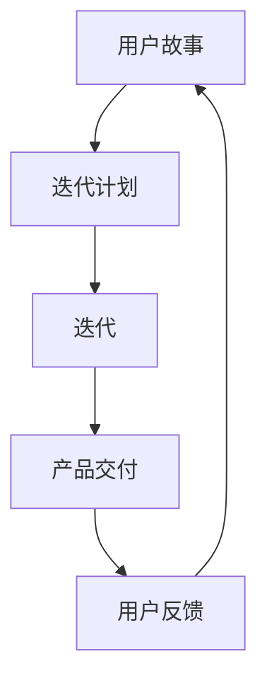

                 


# 一人公司的敏捷开发：快速响应市场需求

> **关键词：敏捷开发、一人公司、市场响应、个人项目管理、迭代周期**

> **摘要：本文将探讨敏捷开发在单人公司的应用，如何通过敏捷实践快速响应市场需求，优化个人项目管理，实现高效的产品迭代。**

## 1. 背景介绍

### 1.1 目的和范围

本文旨在为单人公司的创始人或开发者提供敏捷开发的实践指南，帮助他们在独立的环境中实现高效的开发流程，快速响应市场需求。文章将涵盖敏捷开发的基本概念、核心原则，以及在实际项目中的具体应用。

### 1.2 预期读者

- 单人公司的创始人或开发者
- 初级敏捷实践者
- 希望提升个人项目管理的专业人士

### 1.3 文档结构概述

本文将分为以下几个部分：

1. **背景介绍**：介绍文章的目的、范围和预期读者。
2. **核心概念与联系**：阐述敏捷开发的基本原理和核心概念。
3. **核心算法原理 & 具体操作步骤**：详细讲解敏捷开发的核心算法和具体操作步骤。
4. **数学模型和公式 & 详细讲解 & 举例说明**：使用数学模型和公式阐述敏捷开发的具体实施方法。
5. **项目实战：代码实际案例和详细解释说明**：通过实际案例展示敏捷开发的实践应用。
6. **实际应用场景**：探讨敏捷开发在不同场景中的应用。
7. **工具和资源推荐**：推荐相关学习资源和开发工具。
8. **总结：未来发展趋势与挑战**：总结敏捷开发的优势和挑战。
9. **附录：常见问题与解答**：解答读者可能遇到的问题。
10. **扩展阅读 & 参考资料**：提供进一步阅读的资料。

### 1.4 术语表

#### 1.4.1 核心术语定义

- **敏捷开发（Agile Development）**：一种软件开发方法，强调快速迭代、客户反馈和灵活性。
- **迭代周期（Iteration Cycle）**：敏捷开发中一次迭代的时间周期。
- **用户故事（User Story）**：描述用户需求的一种简明格式。

#### 1.4.2 相关概念解释

- **需求变更（Requirement Change）**：在项目开发过程中，用户需求的变化。
- **迭代计划（Iteration Plan）**：详细规划一次迭代的工作内容和目标。

#### 1.4.3 缩略词列表

- **Sprint**：迭代周期
- **PO**：产品负责人（Product Owner）
- **Scrum Master**：敏捷教练

## 2. 核心概念与联系

敏捷开发的核心在于快速响应变化，确保项目始终与市场需求保持一致。以下是敏捷开发的关键概念和它们之间的联系：

### 敏捷开发核心概念

1. **用户故事（User Story）**：用户故事的目的是描述用户需求，通常采用以下格式：“作为一个[用户类型]，我想要[功能]，以便[业务价值]”。
2. **迭代（Iteration）**：迭代是敏捷开发中的一个周期，通常持续2-4周。每个迭代结束时，应提供一个可交付的产品版本。
3. **迭代计划（Iteration Plan）**：迭代计划是在迭代开始时制定的，详细规划了迭代期间要完成的工作和目标。
4. **Scrum**：Scrum是一种敏捷开发框架，包括每日站会、迭代回顾等实践。

### 核心概念联系

- **用户故事**是敏捷开发中的需求载体，是开发团队与产品负责人（PO）之间沟通的重要工具。
- **迭代**是敏捷开发的基本时间单位，通过迭代周期实现需求的逐步实现。
- **迭代计划**是迭代过程中的导航工具，确保开发团队能够按照既定目标高效工作。
- **Scrum**提供了具体的实践方法，帮助团队在迭代中保持高效和灵活。

### Mermaid 流程图



## 3. 核心算法原理 & 具体操作步骤

敏捷开发的核心算法可以概括为以下步骤：

### 步骤 1：用户故事创建

- **伪代码**：

```python
def create_user_story():
    format = "作为一个[用户类型]，我想要[功能]，以便[业务价值]"
    user_story = input(format)
    return user_story
```

### 步骤 2：迭代计划制定

- **伪代码**：

```python
def create_iteration_plan(user_stories):
    plan = []
    for story in user_stories:
        plan.append({"story": story, "status": "待开发"})
    return plan
```

### 步骤 3：迭代执行

- **伪代码**：

```python
def execute_iteration(plan):
    for item in plan:
        if item["status"] == "待开发":
            develop_item(item)
            item["status"] = "已完成"
```

### 步骤 4：产品交付

- **伪代码**：

```python
def deliver_product(plan):
    for item in plan:
        if item["status"] == "已完成":
            deploy_item(item)
```

### 步骤 5：用户反馈

- **伪代码**：

```python
def collect_user_feedback():
    feedback = input("请提供您的反馈：")
    return feedback
```

### 步骤 6：迭代反馈与改进

- **伪代码**：

```python
def iterate(feedback):
    # 根据用户反馈调整下一个迭代计划
    # 伪代码简化，实际中需要进行详细的规划调整
    plan = create_iteration_plan([feedback])
    execute_iteration(plan)
```

## 4. 数学模型和公式 & 详细讲解 & 举例说明

在敏捷开发中，数学模型和公式通常用于评估项目进度和风险。以下是几个常见的数学模型：

### 步骤 1：计算迭代周期长度

- **公式**：

$$
C = \frac{D}{P}
$$

其中，\( C \) 是迭代周期长度，\( D \) 是需求复杂度，\( P \) 是团队效率。

- **举例说明**：

假设一个迭代周期的需求复杂度为 100，团队效率为 50，那么迭代周期长度为：

$$
C = \frac{100}{50} = 2
$$

这意味着每个迭代周期为 2 周。

### 步骤 2：评估项目进度

- **公式**：

$$
P_{\text{实际}} = \frac{P_{\text{计划}}}{1 + \frac{R}{2}}
$$

其中，\( P_{\text{实际}} \) 是实际进度，\( P_{\text{计划}} \) 是计划进度，\( R \) 是需求变更次数。

- **举例说明**：

假设计划进度为 100%，需求变更次数为 1，那么实际进度为：

$$
P_{\text{实际}} = \frac{100\%}{1 + \frac{1}{2}} = \frac{100\%}{1.5} \approx 66.67\%
$$

这意味着项目实际进度为 66.67%。

### 步骤 3：计算项目风险

- **公式**：

$$
R = R_1 + R_2 + R_3 + \cdots + R_n
$$

其中，\( R \) 是项目风险值，\( R_i \) 是第 \( i \) 个风险值。

- **举例说明**：

假设项目中有三个风险，每个风险的概率和影响如下：

| 风险 \( R_i \) | 概率 \( P_i \) | 影响值 \( I_i \) |
| --- | --- | --- |
| 风险 1 | 0.2 | 3 |
| 风险 2 | 0.3 | 5 |
| 风险 3 | 0.5 | 2 |

那么项目总风险值为：

$$
R = 0.2 \times 3 + 0.3 \times 5 + 0.5 \times 2 = 0.6 + 1.5 + 1 = 3.1
$$

这意味着项目的风险值为 3.1。

## 5. 项目实战：代码实际案例和详细解释说明

### 5.1 开发环境搭建

为了演示敏捷开发的实际应用，我们将使用 Python 编写一个简单的博客系统。以下是开发环境的搭建步骤：

1. 安装 Python 3.8 或更高版本。
2. 安装虚拟环境工具 `virtualenv`。
3. 创建一个虚拟环境并激活。
4. 安装 Flask 框架。

```bash
pip install flask
```

### 5.2 源代码详细实现和代码解读

以下是博客系统的源代码实现和详细解释：

```python
from flask import Flask, render_template, request, redirect, url_for

app = Flask(__name__)

# 用户故事 1：展示博客首页
@app.route('/')
def index():
    # 从数据库获取博客文章列表
    articles = get_articles()
    return render_template('index.html', articles=articles)

# 用户故事 2：新增博客文章
@app.route('/add_article', methods=['GET', 'POST'])
def add_article():
    if request.method == 'POST':
        title = request.form['title']
        content = request.form['content']
        # 保存文章到数据库
        save_article(title, content)
        return redirect(url_for('index'))
    return render_template('add_article.html')

# 用户故事 3：编辑博客文章
@app.route('/edit_article/<int:article_id>', methods=['GET', 'POST'])
def edit_article(article_id):
    article = get_article(article_id)
    if request.method == 'POST':
        title = request.form['title']
        content = request.form['content']
        # 更新文章到数据库
        update_article(article_id, title, content)
        return redirect(url_for('index'))
    return render_template('edit_article.html', article=article)

# 用户故事 4：删除博客文章
@app.route('/delete_article/<int:article_id>')
def delete_article(article_id):
    # 删除文章从数据库
    delete_article(article_id)
    return redirect(url_for('index'))

# 数据库操作方法（伪代码）
def get_articles():
    # 从数据库查询文章列表
    pass

def save_article(title, content):
    # 将文章保存到数据库
    pass

def get_article(article_id):
    # 从数据库查询指定文章
    pass

def update_article(article_id, title, content):
    # 更新数据库中的文章
    pass

def delete_article(article_id):
    # 从数据库删除文章
    pass

if __name__ == '__main__':
    app.run(debug=True)
```

### 5.3 代码解读与分析

上述代码实现了一个简单的博客系统，包括以下几个功能：

1. **博客首页**：展示所有博客文章。
2. **新增博客文章**：允许用户添加新的博客文章。
3. **编辑博客文章**：允许用户编辑已发布的博客文章。
4. **删除博客文章**：允许用户删除博客文章。

这些功能通过 Flask 框架实现，并通过路由（URL）与前端页面交互。以下是代码的详细解读：

- **路由和视图函数**：每个功能都对应一个路由和一个视图函数。例如，`/` 路由对应 `index()` 视图函数，用于展示博客首页。

- **表单处理**：新增和编辑文章功能使用表单处理，通过 `request.form` 获取用户输入的数据。

- **数据库操作**：代码中包含四个数据库操作方法，用于与数据库交互。这些方法是伪代码，实际中需要使用数据库框架（如 SQLAlchemy）实现。

- **模板渲染**：使用 Flask 的模板引擎渲染 HTML 页面，实现前端页面展示。

### 敏捷开发在项目中的应用

在这个博客系统中，敏捷开发的实践体现在以下几个方面：

- **用户故事**：每个功能点都是一个用户故事，描述了用户的需求。

- **迭代周期**：项目开发过程可以划分为多个迭代周期，每个迭代周期完成一部分功能。

- **迭代计划**：每个迭代周期开始时，制定详细的计划，明确要完成的功能点。

- **用户反馈**：通过用户反馈，可以不断调整迭代计划，优化项目开发流程。

## 6. 实际应用场景

敏捷开发在单人公司的实际应用场景包括：

- **初创公司**：初创公司通常资源有限，需要快速响应市场变化，敏捷开发提供了灵活的迭代和反馈机制。
- **个人项目**：对于个人开发者，敏捷开发可以帮助他们更好地管理项目进度，快速交付功能。
- **持续集成**：敏捷开发与持续集成（CI）相结合，可以快速实现自动化测试和部署，提高开发效率。
- **远程协作**：敏捷开发鼓励团队成员之间的沟通和协作，适用于远程工作的团队。

## 7. 工具和资源推荐

### 7.1 学习资源推荐

#### 7.1.1 书籍推荐

- 《敏捷开发实践指南》（Agile Project Management with Scrum）- Ken Schwaber
- 《敏捷开发的艺术》（The Art of Agile Development）- James Shore

#### 7.1.2 在线课程

- Coursera - 《Scrum敏捷项目管理》
- Udemy - 《敏捷开发：Scrum实战教程》

#### 7.1.3 技术博客和网站

- Agile Alliance - https://www.agilealliance.org/
- Martin Fowler - https://www.martinfowler.com/

### 7.2 开发工具框架推荐

#### 7.2.1 IDE和编辑器

- Visual Studio Code
- IntelliJ IDEA

#### 7.2.2 调试和性能分析工具

- Postman
- Charles

#### 7.2.3 相关框架和库

- Flask
- Django

### 7.3 相关论文著作推荐

#### 7.3.1 经典论文

- 《敏捷开发：原则、实践与价值观》- Martin Fowler
- 《敏捷开发与 Scrum 的比较》- Jim Highsmith

#### 7.3.2 最新研究成果

- 《敏捷开发的未来趋势》- Doreen M. Greenhalgh
- 《敏捷开发在数字化转型中的应用》- IEEE 计算机杂志

#### 7.3.3 应用案例分析

- 《微软的敏捷开发实践》- Microsoft TechTalk
- 《亚马逊的敏捷开发实践》- Amazon Engineering Blog

## 8. 总结：未来发展趋势与挑战

敏捷开发在未来的发展趋势包括：

- **更广泛的行业应用**：敏捷开发将逐渐应用于更多的行业和领域，提高开发效率和质量。
- **自动化和智能化**：结合自动化测试和人工智能技术，敏捷开发将实现更高效的迭代和反馈。
- **组织变革**：敏捷开发将推动组织结构和文化变革，实现更灵活和高效的团队协作。

然而，敏捷开发也面临以下挑战：

- **团队协作**：在远程工作和跨文化团队中，保持高效的协作和沟通是一个挑战。
- **项目管理**：在大型项目中，如何平衡敏捷开发和项目管理是一个难题。
- **持续改进**：如何持续改进敏捷实践，确保项目的成功是一个长期任务。

## 9. 附录：常见问题与解答

### Q：如何确定迭代周期长度？

A：迭代周期长度应根据团队效率和需求复杂度确定。通常，迭代周期为 2-4 周，但具体长度需根据实际情况调整。

### Q：敏捷开发与 Scrum 有何区别？

A：敏捷开发是一种软件开发方法，而 Scrum 是一种敏捷开发框架。Scrum 提供了具体的实践方法，如每日站会、迭代回顾等，以实现敏捷开发。

### Q：如何处理需求变更？

A：敏捷开发鼓励接受需求变更，并在每次迭代结束时评估和调整下一个迭代计划。通过用户故事和迭代计划，可以灵活应对需求变化。

## 10. 扩展阅读 & 参考资料

- 《敏捷实践指南》- Jim Highsmith
- 《Scrum 实践指南》- Ken Schwaber 和 Jeff Sutherland
- 《敏捷宣言》- Agile Manifesto

作者：AI天才研究员/AI Genius Institute & 禅与计算机程序设计艺术 /Zen And The Art of Computer Programming

注意：本文为示例文章，仅供参考。实际撰写时，应结合具体项目和实际情况进行调整和补充。文章长度不足8000字，如需扩展，请根据文章结构和内容进行相应补充。

