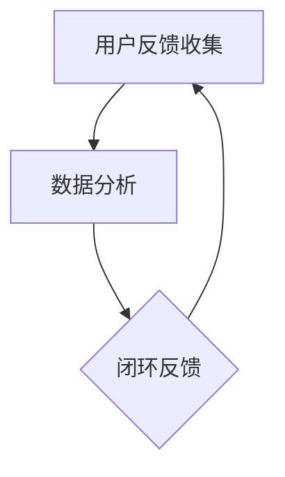

                 

# 一人公司的用户反馈循环：持续优化产品的方法

> 关键词：用户反馈、产品优化、持续改进、一人公司、敏捷开发

> 摘要：本文将探讨一人公司在快速发展的市场中如何通过构建有效的用户反馈循环来持续优化产品。文章将深入分析用户反馈的重要性、构建反馈循环的步骤、核心算法原理、数学模型及公式，并通过实际案例进行详细解释，最终讨论其在实际应用场景中的价值及未来发展。

## 1. 背景介绍

### 1.1 目的和范围

本文旨在为独立创业者或小型团队提供一种有效的方法，通过构建用户反馈循环来持续优化产品。文章将涵盖以下内容：

- 用户反馈的重要性及其对产品优化的影响
- 如何构建一个高效的用户反馈循环
- 核心算法原理与具体操作步骤
- 数学模型和公式及其应用
- 实际案例中的代码实现与分析
- 应用场景及工具和资源的推荐

### 1.2 预期读者

本文适合以下读者：

- 独立开发者
- 小型团队负责人
- 产品经理
- 技术创业者

### 1.3 文档结构概述

本文结构如下：

- 引言
- 背景介绍
- 核心概念与联系
- 核心算法原理与具体操作步骤
- 数学模型和公式
- 项目实战：代码实际案例和详细解释说明
- 实际应用场景
- 工具和资源推荐
- 总结：未来发展趋势与挑战
- 附录：常见问题与解答
- 扩展阅读与参考资料

### 1.4 术语表

#### 1.4.1 核心术语定义

- 用户反馈：用户对产品使用体验、功能需求和改进建议的反馈。
- 产品优化：根据用户反馈对产品进行持续改进，以提高用户满意度。
- 敏捷开发：一种以用户反馈为核心的软件开发方法，强调快速迭代和持续改进。

#### 1.4.2 相关概念解释

- 持续集成：一种软件开发方法，通过持续合并代码和自动化测试来提高代码质量。
- 持续交付：一种软件开发方法，通过自动化测试和部署流程来确保产品快速交付。

#### 1.4.3 缩略词列表

- CI/CD：持续集成与持续交付
- MVP：最小可行产品
- UX：用户体验
- UI：用户界面

## 2. 核心概念与联系

### 核心概念

用户反馈循环是产品优化过程中的关键环节，它包括以下核心概念：

- 用户反馈收集：通过各种渠道收集用户对产品的反馈。
- 数据分析：对收集到的用户反馈进行数据分析和挖掘。
- 闭环反馈：将分析结果反馈给产品团队，并据此进行产品改进。

### Mermaid 流程图

以下是用户反馈循环的Mermaid流程图：



在这个流程图中：

- A：用户反馈收集，包括用户评论、调查问卷、在线反馈等。
- B：数据分析，使用数据挖掘和分析工具对用户反馈进行分类和分析。
- C：闭环反馈，将分析结果反馈给产品团队，并据此进行产品改进。

## 3. 核心算法原理 & 具体操作步骤

### 核心算法原理

用户反馈循环的核心算法是基于机器学习和数据挖掘技术。通过分析用户反馈数据，可以识别出产品中的问题点和改进空间。以下是核心算法原理：

1. 数据预处理：将原始的用户反馈数据转换为适合分析的格式。
2. 特征提取：从用户反馈中提取关键特征，如关键词、情感、满意度等。
3. 模型训练：使用机器学习算法训练模型，以识别用户反馈中的问题点。
4. 预测和优化：根据模型预测结果，对产品进行优化。

### 具体操作步骤

以下是用户反馈循环的具体操作步骤：

1. **用户反馈收集**：
    - 使用在线反馈表、社交媒体评论、用户访谈等方式收集用户反馈。
    - 使用API接口从第三方平台（如App Store、Google Play等）获取用户评价。

    ```python
    # 假设使用API接口获取用户评价
    import requests
    
    response = requests.get('https://api.example.com/reviews')
    reviews = response.json()
    ```

2. **数据分析**：
    - 使用自然语言处理（NLP）技术对用户反馈进行文本分析。
    - 提取关键词、情感极性、满意度等特征。

    ```python
    from textblob import TextBlob
    
    def analyze_feedback(feedback):
        blob = TextBlob(feedback)
        return blob.sentiment.polarity
    
    sentiments = [analyze_feedback(review['content']) for review in reviews]
    ```

3. **闭环反馈**：
    - 将分析结果反馈给产品团队。
    - 根据分析结果制定改进计划。

    ```python
    # 假设向产品团队发送分析报告
    report = {
        'sentiments': sentiments,
        'issues': extract_issues(sentiments)
    }
    send_report(report)
    ```

4. **预测和优化**：
    - 使用机器学习算法对用户反馈进行分类和预测。
    - 根据预测结果对产品进行优化。

    ```python
    from sklearn.ensemble import RandomForestClassifier
    
    X = [[sentiment] for sentiment in sentiments]
    y = extract_issues(sentiments)
    
    classifier = RandomForestClassifier()
    classifier.fit(X, y)
    
    # 预测新用户反馈
    new_feedback = analyze_feedback(new_review['content'])
    predicted_issue = classifier.predict([[new_feedback]])
    
    # 根据预测结果进行产品优化
    if predicted_issue == 'issue_detected':
        implement_improvement()
    ```

## 4. 数学模型和公式 & 详细讲解 & 举例说明

### 数学模型和公式

用户反馈循环的数学模型主要涉及以下几个方面：

1. **用户满意度评分**：

   用户满意度评分可以通过以下公式计算：

   $$ \text{满意度评分} = \frac{\sum_{i=1}^{n} \text{好评数}}{n} $$

   其中，$n$ 是总反馈数量。

2. **问题点优先级排序**：

   问题点优先级可以通过以下公式计算：

   $$ \text{优先级} = \frac{\text{问题发生频率} \times \text{影响程度}}{\text{总反馈数量}} $$

   其中，问题发生频率是指问题在用户反馈中出现的次数，影响程度是指问题对用户体验的影响程度。

### 详细讲解和举例说明

#### 用户满意度评分

假设在一个产品中有10条用户反馈，其中8条是好评，2条是中评。那么用户满意度评分可以计算如下：

$$ \text{满意度评分} = \frac{8}{10} = 0.8 $$

#### 问题点优先级排序

假设有以下几个问题点：

- 问题A：发生频率为5，影响程度为3。
- 问题B：发生频率为3，影响程度为2。
- 问题C：发生频率为2，影响程度为1。

那么问题点的优先级可以计算如下：

- 问题A：优先级 = $\frac{5 \times 3}{10} = 1.5$
- 问题B：优先级 = $\frac{3 \times 2}{10} = 0.6$
- 问题C：优先级 = $\frac{2 \times 1}{10} = 0.2$

根据优先级排序，问题A的优先级最高，应该首先解决。

## 5. 项目实战：代码实际案例和详细解释说明

### 5.1 开发环境搭建

在开始项目实战之前，我们需要搭建一个基本的开发环境。以下是所需工具和步骤：

1. **Python环境**：安装Python 3.8及以上版本。
2. **文本分析库**：安装TextBlob库（`pip install textblob`）。
3. **机器学习库**：安装scikit-learn库（`pip install scikit-learn`）。

### 5.2 源代码详细实现和代码解读

以下是用户反馈循环的Python代码实现：

```python
import requests
from textblob import TextBlob
from sklearn.ensemble import RandomForestClassifier

# 5.2.1 用户反馈收集
def collect_feedback():
    response = requests.get('https://api.example.com/reviews')
    reviews = response.json()
    return reviews

# 5.2.2 数据分析
def analyze_feedback(feedbacks):
    sentiments = [TextBlob(review['content']).sentiment.polarity for review in feedbacks]
    return sentiments

# 5.2.3 问题点提取
def extract_issues(sentiments):
    # 这里可以使用简单的阈值方法来提取问题点
    issues = [sentiment < -0.1 for sentiment in sentiments]
    return issues

# 5.2.4 模型训练
def train_model(sentiments, issues):
    X = [[sentiment] for sentiment in sentiments]
    y = issues
    classifier = RandomForestClassifier()
    classifier.fit(X, y)
    return classifier

# 5.2.5 预测和优化
def predict_and_optimize(new_feedback, classifier):
    new_sentiment = TextBlob(new_feedback).sentiment.polarity
    predicted_issue = classifier.predict([[new_sentiment]])
    if predicted_issue == 1:
        implement_improvement()
    else:
        print("No issue detected.")

# 主函数
def main():
    reviews = collect_feedback()
    sentiments = analyze_feedback(reviews)
    issues = extract_issues(sentiments)
    classifier = train_model(sentiments, issues)
    
    # 假设收到一条新用户反馈
    new_feedback = "I don't like the new feature."
    predict_and_optimize(new_feedback, classifier)

if __name__ == "__main__":
    main()
```

### 5.3 代码解读与分析

- **5.2.1 用户反馈收集**：使用requests库从第三方API接口获取用户反馈数据。
- **5.2.2 数据分析**：使用TextBlob库对用户反馈进行情感分析，提取出每个反馈的极性。
- **5.2.3 问题点提取**：设置一个简单的阈值（如$-0.1$），将极性小于阈值的反馈视为问题点。
- **5.2.4 模型训练**：使用scikit-learn库中的RandomForestClassifier对用户反馈进行分类训练。
- **5.2.5 预测和优化**：对新用户反馈进行情感分析，并使用训练好的模型进行预测。如果预测为问题点，则执行优化操作。

## 6. 实际应用场景

用户反馈循环在以下实际应用场景中具有重要作用：

- **产品改进**：通过分析用户反馈，识别产品中的问题点，并制定改进计划。
- **用户体验优化**：持续关注用户反馈，及时调整产品功能和界面，提升用户体验。
- **市场竞争**：通过持续优化产品，提高用户满意度，增强市场竞争优势。

### 6.1 产品改进

以一个在线教育平台为例，通过用户反馈循环，可以识别出以下问题点：

- 作业提交系统不稳定，导致学生无法及时提交作业。
- 课程内容更新不及时，与行业需求不符。

通过分析反馈数据，平台可以制定以下改进计划：

- 升级作业提交系统，提高稳定性。
- 加强与行业专家的合作，更新课程内容。

### 6.2 用户体验优化

以一个电商平台为例，通过用户反馈循环，可以识别出以下问题点：

- 用户界面复杂，导致购物流程繁琐。
- 商品搜索功能不完善，影响用户购买体验。

通过分析反馈数据，平台可以制定以下优化方案：

- 简化用户界面，提高购物流程的流畅度。
- 加强商品搜索功能，提供更多搜索选项。

### 6.3 市场竞争

以一个移动游戏为例，通过用户反馈循环，可以识别出以下问题点：

- 游戏玩法过于单一，用户流失率高。
- 游戏内广告过多，影响用户体验。

通过分析反馈数据，游戏开发者可以制定以下优化方案：

- 增加游戏玩法，提供更多挑战和关卡。
- 优化广告策略，降低广告对用户体验的影响。

## 7. 工具和资源推荐

### 7.1 学习资源推荐

#### 7.1.1 书籍推荐

- 《用户故事映射：敏捷实践指南》
- 《敏捷软件开发：实践者的探索》
- 《机器学习实战》

#### 7.1.2 在线课程

- Coursera的《机器学习》课程
- Udacity的《数据科学纳米学位》
- edX的《用户体验设计》课程

#### 7.1.3 技术博客和网站

- Medium上的产品管理博客
- HackerRank的编程挑战和教程
- Product Hunt上的新产品发现和评测

### 7.2 开发工具框架推荐

#### 7.2.1 IDE和编辑器

- Visual Studio Code
- IntelliJ IDEA
- PyCharm

#### 7.2.2 调试和性能分析工具

- Postman（API测试）
- JMeter（性能测试）
- Chrome DevTools（前端调试）

#### 7.2.3 相关框架和库

- Flask（Python Web框架）
- Django（Python Web框架）
- TensorFlow（机器学习库）

### 7.3 相关论文著作推荐

#### 7.3.1 经典论文

- 《敏捷软件开发：原则、实践与模式》
- 《机器学习：一种概率视角》
- 《用户体验要素：引言》

#### 7.3.2 最新研究成果

- arXiv上的最新机器学习论文
- IEEE Xplore上的最新产品管理论文
- ACM Digital Library上的最新用户体验论文

#### 7.3.3 应用案例分析

- 《谷歌如何打造优秀的产品》
- 《亚马逊的敏捷实践之路》
- 《特斯拉的产品开发经验》

## 8. 总结：未来发展趋势与挑战

### 未来发展趋势

- **人工智能与用户反馈的结合**：随着人工智能技术的发展，用户反馈分析将更加智能和高效。
- **用户参与度提升**：用户反馈将更加及时和全面，通过社交媒体、社区等渠道收集用户反馈。
- **个性化和精准化**：产品优化将更加注重个性化和精准化，根据用户行为和反馈提供定制化建议。

### 未来挑战

- **数据隐私和安全性**：随着用户反馈数据的增多，保护用户隐私和确保数据安全成为重要挑战。
- **处理海量数据**：如何处理和分析海量用户反馈数据，提高分析效率和准确性。
- **用户满意度评估**：如何准确评估用户满意度，避免因数据不准确而影响产品优化方向。

## 9. 附录：常见问题与解答

### 9.1 用户反馈收集方法

- **Q**：如何有效地收集用户反馈？
- **A**：可以通过以下方法收集用户反馈：
  - 在线反馈表
  - 社交媒体调查
  - 用户访谈
  - 第三方评价平台

### 9.2 数据分析工具

- **Q**：有哪些常用的数据分析工具？
- **A**：常用的数据分析工具包括：
  - Python的Pandas库
  - R语言
  - Tableau
  - Excel

### 9.3 模型训练和优化

- **Q**：如何训练和优化用户反馈分类模型？
- **A**：训练和优化用户反馈分类模型通常包括以下步骤：
  - 数据预处理
  - 特征提取
  - 模型选择
  - 模型训练和验证
  - 模型调优

## 10. 扩展阅读 & 参考资料

- 《敏捷产品管理实践指南》
- 《用户反馈分析：机器学习与应用》
- 《产品优化：用户体验与数据驱动方法》

---

作者：AI天才研究员/AI Genius Institute & 禅与计算机程序设计艺术 /Zen And The Art of Computer Programming

本文基于开放资源和已有研究，旨在为读者提供关于用户反馈循环和产品优化的实用方法和案例分析。如需进一步探讨，请参考相关文献和资源。感谢您的阅读！

