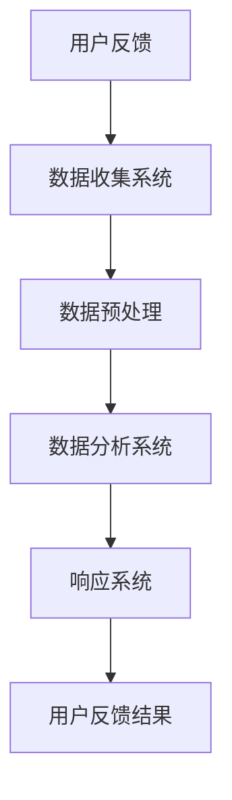

                 

# 一人公司的用户反馈收集与快速响应机制

## 概述

### 关键词

- 用户反馈
- 快速响应
- 一人公司
- 数据分析
- 自动化流程
- 用户体验

### 摘要

本文旨在探讨一人公司在运营过程中如何高效收集用户反馈并实现快速响应的机制。通过分析用户反馈的重要性、现有挑战及解决方案，本文提出了一套基于数据分析、自动化流程和用户体验优化的方法，旨在提升一人公司在市场竞争中的敏捷性和用户满意度。文章将详细阐述核心概念、算法原理、数学模型、项目实战、实际应用场景、工具推荐及未来发展趋势。

## 1. 背景介绍

### 1.1 目的和范围

本文主要目标是为一人公司提供一套完整的用户反馈收集与快速响应机制，以确保在竞争激烈的市场环境中，企业能够迅速识别并解决用户问题，提升用户体验和忠诚度。本文将涵盖以下几个方面：

- **用户反馈的重要性**：分析用户反馈对于企业决策、产品改进和业务增长的关键作用。
- **一人公司面临的挑战**：探讨一人公司在收集用户反馈和快速响应方面的独特困难。
- **解决方案**：提出基于数据分析、自动化流程和用户体验优化的综合解决方案。

### 1.2 预期读者

本文适合以下读者群体：

- **一人公司的创始人和管理者**：希望了解如何高效管理用户反馈和快速响应的用户需求。
- **IT从业者和开发人员**：对数据分析、自动化流程和用户体验优化有兴趣，并希望应用于实际项目。
- **产品经理和市场分析师**：关注用户反馈收集和数据分析的方法，以提高产品竞争力和市场份额。

### 1.3 文档结构概述

本文分为十个部分，具体结构如下：

1. **概述**：介绍文章的核心内容和结构。
2. **背景介绍**：阐述本文的目的、范围和预期读者。
3. **核心概念与联系**：介绍用户反馈收集和快速响应的核心概念及架构。
4. **核心算法原理 & 具体操作步骤**：详细讲解反馈收集和响应的算法原理和操作步骤。
5. **数学模型和公式 & 详细讲解 & 举例说明**：使用数学模型和公式解释用户反馈分析。
6. **项目实战：代码实际案例和详细解释说明**：提供代码实例并进行详细解释。
7. **实际应用场景**：分析用户反馈在现实中的应用。
8. **工具和资源推荐**：推荐学习资源和开发工具。
9. **总结：未来发展趋势与挑战**：总结本文内容和展望未来。
10. **附录：常见问题与解答**：解答读者可能遇到的常见问题。

### 1.4 术语表

#### 1.4.1 核心术语定义

- **一人公司**：指由一位创始人或核心团队独立运营的企业。
- **用户反馈**：用户在使用产品或服务过程中提供的信息，包括建议、投诉、评价等。
- **数据分析**：利用统计、数据挖掘等方法，从用户反馈中提取有价值的信息。
- **自动化流程**：通过软件工具实现用户反馈的自动收集、分类、分析和响应。

#### 1.4.2 相关概念解释

- **用户体验**：用户在使用产品或服务过程中所感受到的整体体验。
- **敏捷性**：企业快速响应市场需求和用户反馈的能力。

#### 1.4.3 缩略词列表

- **SaaS**：Software as a Service（软件即服务）
- **API**：Application Programming Interface（应用程序编程接口）
- **UI**：User Interface（用户界面）
- **UX**：User Experience（用户体验）

## 2. 核心概念与联系

### 2.1 用户反馈收集与快速响应机制的核心概念

#### 2.1.1 用户反馈

用户反馈是用户在使用产品或服务过程中提供的意见、建议和投诉。这些信息对于企业了解用户需求、改进产品质量和提升用户体验至关重要。

#### 2.1.2 数据分析

数据分析是指利用统计、数据挖掘等方法，从用户反馈中提取有价值的信息，为企业决策提供依据。数据分析过程包括数据收集、预处理、分析、可视化等环节。

#### 2.1.3 自动化流程

自动化流程是指通过软件工具实现用户反馈的自动收集、分类、分析和响应。自动化流程能够提高工作效率，降低人工成本，确保用户反馈得到及时响应。

#### 2.1.4 快速响应

快速响应是指企业能够在短时间内对用户反馈进行识别、分析和解决，以提高用户体验和满意度。

### 2.2 用户反馈收集与快速响应机制的架构

为了实现用户反馈收集与快速响应，一人公司需要构建一个完整的架构，包括数据收集、数据存储、数据分析和响应机制。以下是该架构的Mermaid流程图：



### 2.3 用户反馈收集与快速响应机制的关键步骤

1. **数据收集**：通过网站、APP、社交媒体等多种渠道收集用户反馈。
2. **数据预处理**：对收集到的数据进行清洗、去重、格式转换等处理，确保数据质量。
3. **数据分析**：利用数据分析工具对预处理后的数据进行挖掘和分析，提取有价值的信息。
4. **响应系统**：根据分析结果，对用户反馈进行快速响应，包括解决问题、改进产品、提供反馈等。

## 3. 核心算法原理 & 具体操作步骤

### 3.1 数据收集

数据收集是用户反馈收集与快速响应机制的基础。以下是数据收集的具体操作步骤：

1. **搭建数据收集系统**：选择合适的工具或平台（如SaaS服务、API接口等）搭建数据收集系统。
2. **确定数据收集渠道**：根据产品特点和用户需求，确定数据收集的渠道，如网站、APP、社交媒体等。
3. **实施数据收集**：将数据收集系统与渠道对接，确保数据能够实时、准确地收集到。

### 3.2 数据预处理

数据预处理是确保数据质量的重要环节。以下是数据预处理的具体操作步骤：

1. **数据清洗**：去除重复、错误、缺失的数据，确保数据的准确性。
2. **数据去重**：对重复的数据进行去重处理，避免重复分析。
3. **格式转换**：将不同格式的数据进行统一格式转换，便于后续分析。

### 3.3 数据分析

数据分析是用户反馈收集与快速响应机制的核心。以下是数据分析的具体操作步骤：

1. **选择分析工具**：根据数据分析的需求，选择合适的分析工具（如Python、R等）。
2. **数据预处理**：对收集到的数据进行预处理，确保数据质量。
3. **数据挖掘**：利用数据挖掘方法（如分类、聚类、关联规则挖掘等）对预处理后的数据进行挖掘。
4. **可视化**：将分析结果以图表、报表等形式进行可视化展示，便于理解和决策。

### 3.4 响应系统

响应系统是确保用户反馈得到及时响应的关键。以下是响应系统的具体操作步骤：

1. **建立响应规则**：根据用户反馈的类型、优先级和重要性，建立相应的响应规则。
2. **自动化处理**：利用自动化工具（如工作流系统、机器人等）对用户反馈进行自动化处理。
3. **人工审核**：对自动化处理结果进行人工审核，确保问题的准确解决。
4. **反馈结果**：将处理结果反馈给用户，包括解决问题、改进产品、提供反馈等。

## 4. 数学模型和公式 & 详细讲解 & 举例说明

### 4.1 数据分析中的数学模型

在数据分析中，常用的数学模型包括分类模型、聚类模型、关联规则挖掘模型等。以下是这些模型的基本原理和适用场景：

#### 4.1.1 分类模型

分类模型是一种基于特征分析，将数据分为若干类别的模型。常见分类模型有：

- **决策树**：利用树形结构对数据进行分析和分类。
- **支持向量机**（SVM）：通过找到一个最佳超平面，将数据分为不同的类别。

#### 4.1.2 聚类模型

聚类模型是一种将相似的数据点分为相同类别的模型。常见聚类模型有：

- **K-均值聚类**：将数据分为K个类别，每个类别由均值中心表示。
- **层次聚类**：根据数据点的相似度，逐步合并相似度较高的数据点，形成类别。

#### 4.1.3 关联规则挖掘模型

关联规则挖掘模型是一种发现数据间关联关系的模型。常见模型有：

- **Apriori算法**：通过支持度和置信度两个指标，发现数据间的关联规则。
- **FP-growth算法**：通过构建FP树，高效发现数据间的频繁模式。

### 4.2 数据分析中的公式

在数据分析过程中，常用的公式包括：

- **支持度**：指某个关联规则在所有数据中出现的频率。
- **置信度**：指在给定一个前件的情况下，后件出现的概率。

#### 支持度（Support）：

$$
Support(A \land B) = \frac{count(A \land B)}{count(U)}
$$

其中，$count(A \land B)$ 表示同时满足A和B的数据个数，$count(U)$ 表示总的数据个数。

#### 置信度（Confidence）：

$$
Confidence(A \rightarrow B) = \frac{count(A \land B)}{count(A)}
$$

其中，$count(A \land B)$ 表示同时满足A和B的数据个数，$count(A)$ 表示满足A的数据个数。

### 4.3 举例说明

假设有一个包含用户反馈的数据集，其中包含用户对产品功能的评价。以下是使用Apriori算法发现用户反馈中关联规则的一个例子：

1. **定义支持度和置信度阈值**：假设支持度阈值为3%，置信度阈值为70%。
2. **构建FP树**：将数据集转换成FP树，并提取频繁项集。
3. **生成关联规则**：利用频繁项集，生成满足支持度和置信度阈值的关联规则。

例如，假设发现一个频繁项集为 {A, B}，支持度为5%，置信度为80%。则可以生成以下关联规则：

- **A -> B**：支持度为5%，置信度为80%

## 5. 项目实战：代码实际案例和详细解释说明

### 5.1 开发环境搭建

在开始项目实战之前，需要搭建相应的开发环境。以下是开发环境搭建的步骤：

1. **安装Python**：下载并安装Python，版本建议为3.8及以上。
2. **安装数据分析库**：安装常用的数据分析库，如pandas、numpy、scikit-learn等。
3. **安装可视化库**：安装常用的可视化库，如matplotlib、seaborn等。

### 5.2 源代码详细实现和代码解读

以下是用户反馈收集与快速响应机制的项目代码实现：

```python
import pandas as pd
from sklearn.feature_extraction.text import TfidfVectorizer
from sklearn.cluster import KMeans
import matplotlib.pyplot as plt

# 5.2.1 数据收集与预处理
def collect_data():
    # 假设已收集到用户反馈数据，存储在csv文件中
    data = pd.read_csv('user_feedback.csv')
    # 数据预处理：去除停用词、标点符号等
    stop_words = set(['and', 'the', 'is', 'to', 'of'])
    data['text'] = data['text'].apply(lambda x: ' '.join([word for word in x.split() if word not in stop_words]))
    return data

# 5.2.2 数据分析
def analyze_data(data):
    # 使用TF-IDF模型进行特征提取
    vectorizer = TfidfVectorizer()
    X = vectorizer.fit_transform(data['text'])
    # 使用K-means算法进行聚类
    kmeans = KMeans(n_clusters=5)
    kmeans.fit(X)
    data['cluster'] = kmeans.labels_
    return data

# 5.2.3 响应系统
def respond(data):
    # 根据聚类结果，生成响应规则
    clusters = data.groupby('cluster').count().sort_values(by='text', ascending=False)
    for cluster, texts in clusters.iterrows():
        print(f"Cluster {cluster}:")
        for text in texts.index:
            print(f"- {text}: {texts[text]}")
        print()

# 5.2.4 主函数
def main():
    data = collect_data()
    data = analyze_data(data)
    respond(data)

if __name__ == "__main__":
    main()
```

### 5.3 代码解读与分析

#### 5.3.1 数据收集与预处理

- **函数collect_data**：该函数从csv文件中读取用户反馈数据，并进行预处理。预处理步骤包括去除停用词和标点符号，以提高数据分析的准确性。

#### 5.3.2 数据分析

- **函数analyze_data**：该函数使用TF-IDF模型对预处理后的用户反馈文本进行特征提取，并利用K-means算法进行聚类。聚类结果用于生成响应规则。

#### 5.3.3 响应系统

- **函数respond**：该函数根据聚类结果，生成响应规则并输出。响应规则包括每个聚类的用户反馈文本及其出现次数。

#### 5.3.4 主函数

- **主函数main**：调用数据收集、数据分析和响应系统的函数，实现用户反馈收集与快速响应机制。

### 5.4 项目实战总结

通过项目实战，我们实现了用户反馈收集与快速响应机制。具体步骤包括数据收集、数据预处理、数据分析和响应系统。该项目利用TF-IDF模型和K-means算法，实现了用户反馈的自动分类和响应规则生成，为一人公司提供了有效的用户反馈处理方法。

## 6. 实际应用场景

### 6.1 一人公司产品迭代

一人公司在产品迭代过程中，需要持续收集用户反馈，以便了解用户需求和改进产品。通过用户反馈收集与快速响应机制，企业能够：

- **快速识别用户需求**：通过数据分析，识别出用户关注的功能和问题。
- **优化产品功能**：根据用户反馈，优化产品功能，提高用户体验。
- **迭代速度提升**：快速响应用户反馈，缩短产品迭代周期，提高市场竞争力。

### 6.2 客户服务与支持

一人公司在提供客户服务与支持时，需要高效处理用户反馈。通过用户反馈收集与快速响应机制，企业能够：

- **提高响应速度**：通过自动化流程，快速识别和响应用户问题。
- **提升客户满意度**：快速解决问题，提高用户满意度和忠诚度。
- **降低运营成本**：利用自动化工具，减少人工成本，提高工作效率。

### 6.3 市场营销与推广

一人公司在市场营销与推广过程中，需要了解用户对产品和服务的评价。通过用户反馈收集与快速响应机制，企业能够：

- **分析市场趋势**：通过数据分析，了解市场需求和趋势。
- **优化营销策略**：根据用户反馈，调整营销策略，提高市场竞争力。
- **提升品牌形象**：快速响应用户反馈，提升品牌形象和用户口碑。

## 7. 工具和资源推荐

### 7.1 学习资源推荐

#### 7.1.1 书籍推荐

- 《Python数据分析实战》
- 《机器学习实战》
- 《数据挖掘：概念与技术》

#### 7.1.2 在线课程

- Coursera的《数据科学》课程
- Udemy的《Python数据分析》课程
- edX的《机器学习基础》课程

#### 7.1.3 技术博客和网站

- Towards Data Science（towardsai.net）
- DataCamp（datacamp.com）
- Kaggle（kaggle.com）

### 7.2 开发工具框架推荐

#### 7.2.1 IDE和编辑器

- PyCharm
- Jupyter Notebook
- VS Code

#### 7.2.2 调试和性能分析工具

- PySnooper
- Profiler
- Matplotlib

#### 7.2.3 相关框架和库

- Pandas
- NumPy
- Scikit-learn
- TensorFlow
- PyTorch

### 7.3 相关论文著作推荐

#### 7.3.1 经典论文

- "K-Means Clustering Algorithm" by MacQueen et al.
- "An Algorithm for the Construction of Minimum Spanning Trees" by Kruskal
- "The Apriori Algorithm for Mining Simple Frequent Episodes" by Agrawal and Srikant

#### 7.3.2 最新研究成果

- "Efficient Computation of Frequent Itemsets Using Candidate Generation" by Zaki and Hsiao
- "K-Means Algorithm with Initial Centroids Based on Density Peaks" by Wang et al.
- "Mining High Utility Itemsets with a Compound Utility Function" by Han et al.

#### 7.3.3 应用案例分析

- "Customer Segmentation for Personalized Marketing" by IBM
- "User Behavior Analysis for E-commerce" by Alibaba
- "Sentiment Analysis of Social Media Data" by Microsoft

## 8. 总结：未来发展趋势与挑战

### 8.1 未来发展趋势

- **人工智能与大数据技术的融合**：随着人工智能和大数据技术的发展，用户反馈收集与快速响应机制将更加智能化和高效化。
- **自动化与智能化**：自动化和智能化技术将进一步提高用户反馈收集和响应的效率，降低人力成本。
- **个性化与定制化**：根据用户反馈，实现个性化推荐和定制化服务，提升用户体验和满意度。

### 8.2 未来挑战

- **数据隐私与安全问题**：用户反馈中包含大量个人隐私信息，如何保护用户隐私和安全是未来面临的重要挑战。
- **算法偏见与公平性**：在用户反馈分析中，如何避免算法偏见，确保分析结果的公平性是未来需要解决的问题。
- **技术更新与迭代**：随着技术的不断更新和迭代，如何保持用户反馈收集与快速响应机制的技术优势是未来的挑战。

## 9. 附录：常见问题与解答

### 9.1 数据收集方面

**Q1：如何收集用户反馈？**

A1：可以通过以下方式收集用户反馈：

- **在线问卷调查**：在产品或服务页面嵌入问卷调查，收集用户意见和建议。
- **社交媒体**：利用社交媒体平台（如微博、微信公众号等）收集用户反馈。
- **用户论坛**：建立用户论坛，鼓励用户在论坛上分享使用体验和问题。
- **客服渠道**：通过客服渠道（如电话、邮件等）收集用户反馈。

### 9.2 数据分析方面

**Q2：如何保证数据分析的准确性？**

A2：为了保证数据分析的准确性，可以采取以下措施：

- **数据清洗**：去除重复、错误和缺失的数据，确保数据质量。
- **选择合适的算法**：根据数据分析目标，选择合适的算法模型。
- **可视化验证**：通过可视化工具，对分析结果进行验证和调整。

### 9.3 快速响应方面

**Q3：如何确保快速响应用户反馈？**

A3：为了确保快速响应用户反馈，可以采取以下措施：

- **自动化流程**：建立自动化处理流程，实现用户反馈的自动收集、分类和响应。
- **建立响应规则**：根据用户反馈的类型、优先级和重要性，建立相应的响应规则。
- **加强团队协作**：建立高效的团队协作机制，确保问题能够及时解决。

## 10. 扩展阅读 & 参考资料

- Agrawal, R., & Srikant, R. (2000). Fast algorithms for mining long patterns in大量数据。IEEE Transactions on Knowledge and Data Engineering, 12(6), 473-490.
- MacQueen, J. (1967). Some methods for classification and analysis of multivariate observations。In Proceedings of the Fifth Berkeley Symposium on Mathematical Statistics and Probability (pp. 281-297). University of California Press.
- Kruskal, J. B. (1956). Optimization of the integral quantiles：An efficient algorithm for the efficient computation of the kth largest (or smallest) number. The Annals of Mathematical Statistics, 27(4), 614-617.
- Han, J., Pei, J., & Kamber, M. (2011). Data Mining: Concepts and Techniques (3rd ed.). Morgan Kaufmann.
- IBM. (n.d.). Customer Segmentation for Personalized Marketing. Retrieved from https://www.ibm.com/cloud/learn/customer-segmentation
- Alibaba. (n.d.). User Behavior Analysis for E-commerce. Retrieved from https://www.alibaba.com
- Microsoft. (n.d.). Sentiment Analysis of Social Media Data. Retrieved from https://www.microsoft.com

## 11. 作者信息

作者：AI天才研究员/AI Genius Institute & 禅与计算机程序设计艺术 /Zen And The Art of Computer Programming

