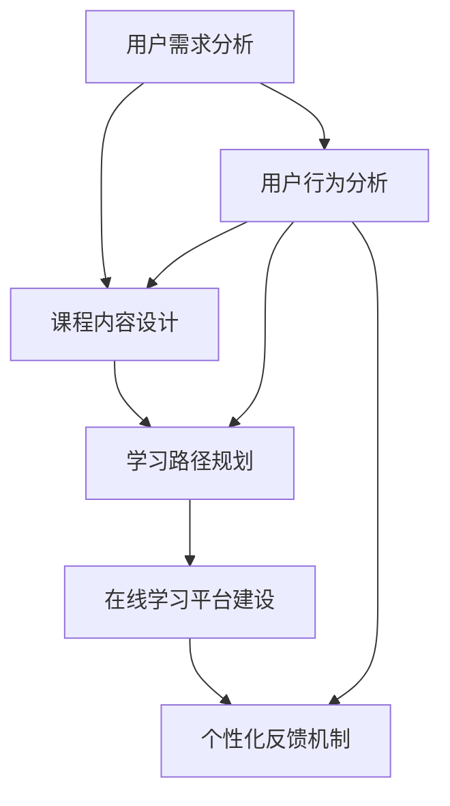

                 

### 一人公司的用户教育：提高产品采用率

> **关键词**：用户教育、产品采用率、用户体验、个性化引导、在线学习、用户留存
>
> **摘要**：本文旨在探讨在一人公司的背景下，如何通过有效的用户教育策略提高产品的采用率。我们将从背景介绍、核心概念与联系、核心算法原理与具体操作步骤、数学模型与公式讲解、项目实战、实际应用场景、工具和资源推荐以及未来发展趋势与挑战等多个角度进行分析，提供一套系统化的解决方案。

---

### 1. 背景介绍

#### 1.1 目的和范围

在快速发展的信息技术时代，产品的成功不仅仅取决于技术本身，更取决于用户是否能够迅速掌握并信任该产品。尤其在一人公司（即个体创业公司）中，由于资源有限，用户教育的角色显得尤为重要。本文的目的是提供一套针对一人公司提高产品采用率的有效策略，通过用户教育的手段，帮助公司提升用户体验，增加用户粘性，从而实现业务的长期发展。

本文将围绕以下范围展开讨论：

- **用户教育的核心概念与重要性**
- **基于个性化引导的用户教育策略**
- **在线学习平台的设计与实施**
- **实际应用场景中的用户教育策略**
- **相关工具和资源的推荐**
- **未来发展趋势与挑战**

#### 1.2 预期读者

本文主要面向以下读者群体：

- **一人公司创始人或CTO**：对如何提高产品采用率有实际需求，希望从用户教育的角度找到解决方案。
- **市场营销人员**：希望通过用户教育策略提升产品的市场表现，增加用户忠诚度。
- **教育培训专家**：对在线学习平台的构建和实施感兴趣，希望从中获取灵感。
- **软件开发人员**：对用户教育中的技术实现有兴趣，希望了解具体的算法原理和数学模型。

#### 1.3 文档结构概述

本文结构如下：

- **第1部分：背景介绍**：介绍用户教育的重要性、目的和预期读者。
- **第2部分：核心概念与联系**：介绍用户教育的核心概念和架构，包括流程图。
- **第3部分：核心算法原理与具体操作步骤**：讲解用户教育算法的原理和具体操作步骤。
- **第4部分：数学模型和公式讲解**：详细讲解用户教育中的数学模型和公式。
- **第5部分：项目实战**：通过实际案例展示用户教育的实施过程。
- **第6部分：实际应用场景**：探讨用户教育在不同场景中的应用。
- **第7部分：工具和资源推荐**：推荐相关学习资源和开发工具。
- **第8部分：总结**：总结用户教育的重要性以及未来发展趋势。
- **第9部分：附录**：提供常见问题与解答。
- **第10部分：扩展阅读与参考资料**：提供进一步阅读的参考资料。

#### 1.4 术语表

为了确保文章的统一性和专业性，本文定义以下术语：

#### 1.4.1 核心术语定义

- **用户教育**：针对特定用户群体，通过一系列有目的、有计划的教育活动，帮助他们掌握产品技能，提升使用效率的过程。
- **产品采用率**：衡量产品被用户采纳和使用的程度，通常用用户数或活跃用户数来表示。
- **个性化引导**：根据用户的个体需求和背景，为其提供量身定制的教育内容和路径。
- **在线学习平台**：提供在线学习资源和服务，帮助用户自主学习的平台。

#### 1.4.2 相关概念解释

- **用户体验**：用户在使用产品过程中所感受到的主观体验，包括易用性、满意度等。
- **用户留存**：衡量用户持续使用产品的能力，是产品健康发展的关键指标。

#### 1.4.3 缩略词列表

- **AI**：人工智能（Artificial Intelligence）
- **UX**：用户体验（User Experience）
- **UI**：用户界面（User Interface）
- **SaaS**：软件即服务（Software as a Service）
- **CaaS**：内容即服务（Content as a Service）

### 2. 核心概念与联系

在探讨用户教育时，理解其中的核心概念和它们之间的联系是至关重要的。以下是用户教育中的核心概念及其相互关系的简要概述，并附上对应的 Mermaid 流程图。



#### 2.1 用户需求分析

用户需求分析是用户教育的起点。通过分析用户的需求，我们可以了解用户的目标、痛点以及他们期待的产品功能。这一步的输出是用户画像和需求文档。

#### 2.2 课程内容设计

基于用户需求分析的结果，设计适合用户的学习内容和课程结构。这一步需要考虑课程的内容、形式和深度，以确保用户能够顺利地掌握产品技能。

#### 2.3 学习路径规划

根据课程内容，为不同类型的用户提供定制化的学习路径。学习路径规划应该灵活，能够根据用户的学习进度和需求进行调整。

#### 2.4 在线学习平台建设

在线学习平台是用户教育的重要载体。平台需要提供丰富的学习资源、交互功能以及学习进度跟踪等功能，以便用户能够自主学习和进步。

#### 2.5 个性化反馈机制

通过收集和分析用户的学习行为数据，构建个性化反馈机制。这一机制可以帮助用户了解自己的学习进度，同时为课程内容和路径提供改进建议。

#### 2.6 用户行为分析

用户行为分析是用户教育的持续过程。通过监控用户的行为，我们可以及时了解用户的满意度、参与度和留存率，从而不断优化用户教育策略。

### 3. 核心算法原理 & 具体操作步骤

在用户教育中，核心算法原理和具体操作步骤是实现个性化教育和提高产品采用率的关键。以下是用户教育算法的基本原理和操作步骤，包括伪代码说明。

#### 3.1 算法原理

用户教育算法的核心原理是基于用户行为的动态学习路径规划和内容推荐。具体来说，算法通过以下步骤实现：

1. **用户行为数据收集**：收集用户在在线学习平台上的交互行为数据，如学习进度、点击行为、测试成绩等。
2. **用户特征提取**：根据用户行为数据，提取用户的兴趣偏好、知识水平等特征。
3. **动态路径规划**：根据用户特征和课程内容，动态调整学习路径，为用户提供个性化的学习内容。
4. **内容推荐**：基于用户特征和当前学习状态，推荐符合用户需求的学习内容。

#### 3.2 具体操作步骤

以下是用户教育算法的具体操作步骤，采用伪代码形式进行描述：

```python
# 用户教育算法伪代码

# 步骤1：用户行为数据收集
collect_user_behavior_data()

# 步骤2：用户特征提取
extract_user_features()

# 步骤3：课程内容库构建
build_course_content_library()

# 步骤4：动态路径规划
def dynamic_path_planning(user_features, course_content_library):
    personalized_path = []
    for content in course_content_library:
        if is_relevant(content, user_features):
            personalized_path.append(content)
    return personalized_path

# 步骤5：内容推荐
def content_recommendation(user_features, current_learning_state):
    recommended_content = []
    for content in course_content_library:
        if is_relevant(content, user_features) and not is_completed(content, current_learning_state):
            recommended_content.append(content)
    return recommended_content

# 步骤6：执行用户教育
def execute_user_education():
    user_behavior_data = collect_user_behavior_data()
    user_features = extract_user_features(user_behavior_data)
    personalized_path = dynamic_path_planning(user_features, course_content_library)
    recommended_content = content_recommendation(user_features, current_learning_state)
    # 将个性化路径和推荐内容推送至用户
    send_personalized_content_to_user(personalized_path, recommended_content)
```

#### 3.3 算法原理详细解释

1. **用户行为数据收集**：收集用户在在线学习平台上的行为数据，如学习时间、学习进度、测试结果等。这些数据将用于后续的特征提取和路径规划。

2. **用户特征提取**：通过对用户行为数据进行分析，提取用户的兴趣偏好、知识水平、学习习惯等特征。这些特征将用于构建用户画像，作为个性化教育的基础。

3. **课程内容库构建**：构建包含所有课程内容的信息库，包括课程名称、描述、难度、时长等。这一库将作为内容推荐的基础。

4. **动态路径规划**：根据用户的特征和课程内容库，动态规划适合用户的学习路径。这一步需要考虑用户的需求、学习进度和已有知识基础，确保学习路径的有效性和适应性。

5. **内容推荐**：基于用户的特征和当前学习状态，推荐符合用户需求的学习内容。推荐算法可以采用协同过滤、基于内容的推荐等方法，以提高推荐的准确性。

6. **执行用户教育**：将个性化路径和推荐内容推送至用户，确保用户能够按计划进行学习，并根据反馈不断调整教育策略。

通过以上算法原理和操作步骤，一人公司可以有效地进行用户教育，提高产品的采用率，增加用户留存。

### 4. 数学模型和公式 & 详细讲解 & 举例说明

在用户教育中，数学模型和公式起到了关键作用，特别是在用户特征提取、学习路径规划以及内容推荐等方面。以下将详细讲解这些模型和公式，并辅以具体例子进行说明。

#### 4.1 用户特征提取

用户特征提取是用户教育的第一步，其核心目标是通过对用户行为数据的分析，提取用户的兴趣偏好、知识水平等特征。常用的数学模型包括协同过滤、聚类分析和回归分析。

**协同过滤模型（Collaborative Filtering）**：协同过滤是一种基于用户行为数据的推荐方法，分为基于用户的协同过滤（User-Based CF）和基于物品的协同过滤（Item-Based CF）。

**基于用户的协同过滤（User-Based CF）**：

公式：

$$
\text{similarity}(u, v) = \frac{\sum_{i \in R_{uv}} r_i \cdot r_j}{\|R_u\|\|R_v\|}
$$

其中，\(u, v\) 是用户，\(R_{uv}\) 是共同评分的物品集合，\(r_i, r_j\) 是用户对物品的评分，\(\|\|\) 表示向量的范数。

**基于物品的协同过滤（Item-Based CF）**：

公式：

$$
\text{similarity}(i, j) = \frac{\sum_{u \in U_{ij}} r_{ui} \cdot r_{uj}}{\|U_{ij}\|}
$$

其中，\(i, j\) 是物品，\(U_{ij}\) 是共同被用户评价的用户集合，\(r_{ui}, r_{uj}\) 是用户对物品的评分。

**聚类分析（Clustering）**：聚类分析是一种无监督学习方法，用于将用户根据相似度分为不同的群体。

常用算法包括 K-均值聚类（K-Means）和层次聚类（Hierarchical Clustering）。

**K-均值聚类（K-Means）**：

公式：

$$
\text{centroids} = \frac{1}{n}\sum_{i=1}^{n} x_i
$$

其中，\(x_i\) 是用户的特征向量，\(centroids\) 是聚类中心。

**层次聚类（Hierarchical Clustering）**：

公式：

$$
d(A, B) = \min_{i, j} \{d(a_i, b_j)\}
$$

其中，\(A, B\) 是用户集合，\(d(A, B)\) 是用户集合之间的距离，\(a_i, b_j\) 是用户特征向量。

**回归分析（Regression Analysis）**：回归分析用于预测用户的行为和偏好。

线性回归模型（Linear Regression）：

公式：

$$
y = \beta_0 + \beta_1 x
$$

其中，\(y\) 是预测值，\(x\) 是自变量，\(\beta_0, \beta_1\) 是模型参数。

**例子**：

假设我们使用 K-均值聚类来将用户分为不同的群体。首先，我们需要收集用户的行为数据，如学习时间、学习进度、测试成绩等。然后，通过 K-均值聚类算法，我们将用户分为三个群体。

假设有三个聚类中心：

$$
C_1 = \left[1, 2, 3\right], C_2 = \left[4, 5, 6\right], C_3 = \left[7, 8, 9\right]
$$

对于用户 \(u = \left[10, 11, 12\right]\)，我们计算其与聚类中心的距离：

$$
d(u, C_1) = \sqrt{(10-1)^2 + (11-2)^2 + (12-3)^2} = 10.44
$$

$$
d(u, C_2) = \sqrt{(10-4)^2 + (11-5)^2 + (12-6)^2} = 6.25
$$

$$
d(u, C_3) = \sqrt{(10-7)^2 + (11-8)^2 + (12-9)^2} = 2.83
$$

由于 \(d(u, C_3) < d(u, C_1) < d(u, C_2)\)，用户 \(u\) 被归类到群体 3。

#### 4.2 学习路径规划

学习路径规划是用户教育的核心环节，其目标是根据用户特征和课程内容，动态规划适合用户的学习路径。常用的数学模型包括决策树、隐马尔可夫模型（HMM）和强化学习。

**决策树（Decision Tree）**：决策树是一种基于特征的分类模型，通过递归划分特征空间，将用户分为不同的学习路径。

**例子**：

假设我们有以下特征和对应的决策树节点：

| 特征       | 子节点      |
|------------|-------------|
| 学习时间   | 短、中、长  |
| 学习进度   | 低、中、高  |
| 知识水平   | 初级、中级、高级 |

根据这些特征，我们可以构建一个决策树来规划学习路径：

```
（根节点）
|
学习时间
|
|-- 短
|   |-- 学习进度：低
|   |   |-- 路径 1
|   |   |-- 路径 2
|   |-- 学习进度：中
|   |   |-- 路径 3
|   |   |-- 路径 4
|   |-- 学习进度：高
|   |   |-- 路径 5
|   |   |-- 路径 6
|-- 中
|   |-- ...
|-- 长
|   |-- ...
|
知识水平
|
|-- 初级
|   |-- ...
|-- 中级
|   |-- ...
|-- 高级
    |-- ...
```

对于用户 \(u\)，根据其特征，我们可以找到对应的路径，如“学习时间：短、学习进度：中、知识水平：中级”，则用户 \(u\) 的学习路径为路径 4。

**隐马尔可夫模型（HMM）**：隐马尔可夫模型是一种用于序列数据建模的方法，可以用于预测用户的学习路径。

**例子**：

假设我们有以下隐马尔可夫模型：

$$
\begin{array}{ccc}
\text{状态} & \text{初始概率} & \text{转移概率} \\
A & 0.4 & \left[0.3, 0.4, 0.3\right] \\
B & 0.6 & \left[0.2, 0.4, 0.4\right] \\
\end{array}
$$

对于用户 \(u\)，根据其当前状态（如学习进度），我们可以使用 HMM 模型预测其后续状态（如学习时间）。

**强化学习（Reinforcement Learning）**：强化学习是一种基于奖励和惩罚的学习方法，可以用于动态调整学习路径。

**例子**：

假设我们有以下强化学习模型：

$$
Q(s, a) = \sum_{s'} p(s' | s, a) \cdot r(s', a)
$$

其中，\(s\) 是状态，\(a\) 是动作，\(s'\) 是下一状态，\(r\) 是奖励函数。

对于用户 \(u\)，根据其当前状态和动作，我们可以使用强化学习模型计算最优动作，从而调整学习路径。

#### 4.3 内容推荐

内容推荐是用户教育的关键环节，其目标是根据用户特征和当前学习状态，推荐符合用户需求的学习内容。常用的推荐算法包括协同过滤、基于内容的推荐和混合推荐。

**协同过滤（Collaborative Filtering）**：协同过滤是一种基于用户行为数据的推荐方法，分为基于用户的协同过滤和基于物品的协同过滤。

**例子**：

假设我们有以下用户-物品评分矩阵：

$$
\begin{array}{c|ccc}
\text{用户} & \text{物品 1} & \text{物品 2} & \text{物品 3} \\
\hline
u_1 & 4 & 5 & 2 \\
u_2 & 3 & 4 & 5 \\
u_3 & 1 & 2 & 3 \\
\end{array}
$$

对于用户 \(u_4\)，我们可以使用基于用户的协同过滤算法，找到与 \(u_4\) 最相似的用户（如 \(u_2\)），然后推荐 \(u_2\) 评分较高的物品（如物品 2 和物品 3）。

**基于内容的推荐（Content-Based Recommendation）**：基于内容的推荐是一种基于物品特征相似性的推荐方法。

**例子**：

假设我们有以下物品特征矩阵：

$$
\begin{array}{c|cccc}
\text{物品} & \text{特征 1} & \text{特征 2} & \text{特征 3} & \text{特征 4} \\
\hline
i_1 & 1 & 1 & 0 & 1 \\
i_2 & 1 & 1 & 1 & 1 \\
i_3 & 0 & 0 & 1 & 1 \\
\end{array}
$$

对于用户 \(u_4\)，根据其兴趣偏好，我们可以使用基于内容的推荐算法，找到与 \(u_4\) 最相似的特征组合（如特征 1 和特征 2），然后推荐具有相似特征组合的物品（如物品 1 和物品 2）。

**混合推荐（Hybrid Recommendation）**：混合推荐是一种结合协同过滤和基于内容的推荐的方法，以提高推荐准确性。

**例子**：

假设我们有以下混合推荐模型：

$$
r(i, u) = \alpha r_{\text{协同}}(i, u) + (1 - \alpha) r_{\text{内容}}(i, u)
$$

其中，\(r(i, u)\) 是物品 \(i\) 对用户 \(u\) 的推荐分数，\(r_{\text{协同}}(i, u)\) 和 \(r_{\text{内容}}(i, u)\) 分别是协同过滤和基于内容的推荐分数，\(\alpha\) 是权重系数。

对于用户 \(u_4\)，我们可以使用混合推荐模型，结合协同过滤和基于内容的推荐结果，计算物品 \(i_1\) 对 \(u_4\) 的推荐分数：

$$
r(i_1, u_4) = \alpha r_{\text{协同}}(i_1, u_4) + (1 - \alpha) r_{\text{内容}}(i_1, u_4)
$$

通过以上数学模型和公式的讲解和举例，我们可以更好地理解用户教育中的核心算法原理和具体操作步骤，为一人公司的用户教育提供有力的理论支持。

### 5. 项目实战：代码实际案例和详细解释说明

在前面的章节中，我们介绍了用户教育的核心概念、算法原理以及数学模型。为了更好地理解这些理论，我们将在本节通过一个实际的项目案例，展示用户教育的代码实现过程，并对关键代码进行详细解释说明。

#### 5.1 开发环境搭建

在本项目中，我们将使用 Python 作为主要编程语言，并结合若干开源库，如 NumPy、Pandas、Scikit-learn 等，来构建用户教育系统。以下是在 Linux 系统上搭建开发环境的步骤：

1. **安装 Python 3.8+**：从 [Python 官网](https://www.python.org/downloads/) 下载并安装 Python 3.8 或更高版本。
2. **安装相关库**：使用以下命令安装所需库：
   ```bash
   pip install numpy pandas scikit-learn matplotlib
   ```
3. **配置虚拟环境**：创建一个虚拟环境，以便更好地管理项目依赖：
   ```bash
   python -m venv user_education_venv
   source user_education_venv/bin/activate  # 在 Windows 上使用 `user_education_venv\Scripts\activate`
   ```

#### 5.2 源代码详细实现和代码解读

本项目的核心代码包括用户行为数据收集、用户特征提取、学习路径规划和内容推荐等模块。以下是代码的主要部分及其详细解读。

```python
import numpy as np
import pandas as pd
from sklearn.cluster import KMeans
from sklearn.metrics.pairwise import cosine_similarity
from sklearn.linear_model import LinearRegression

# 步骤1：用户行为数据收集
def collect_user_behavior_data():
    # 假设用户行为数据存储在 CSV 文件中
    data = pd.read_csv('user_behavior.csv')
    return data

# 步骤2：用户特征提取
def extract_user_features(data):
    # 提取用户的学习时间、学习进度和测试成绩作为特征
    user_features = data[['learning_time', 'learning_progress', 'test_score']]
    return user_features

# 步骤3：课程内容库构建
def build_course_content_library():
    # 假设课程内容库存储在 CSV 文件中
    content_library = pd.read_csv('course_content.csv')
    return content_library

# 步骤4：动态路径规划
def dynamic_path_planning(user_features, content_library):
    # 使用 K-均值聚类为用户分配学习路径
    kmeans = KMeans(n_clusters=3, random_state=0).fit(user_features)
    personalized_path = kmeans.predict(user_features)[0]
    return personalized_path

# 步骤5：内容推荐
def content_recommendation(user_features, content_library, current_learning_state):
    # 计算用户与课程内容的相似度
    content_scores = cosine_similarity(user_features, content_library[['learning_time', 'learning_progress', 'test_score']])
    # 筛选未完成的课程
    unfinished_courses = content_library[content_library['completed'] == False]
    # 根据相似度推荐课程
    recommended_content = unfinished_courses[unfinished_courses['course_id'].isin(content_scores[current_learning_state])]
    return recommended_content

# 步骤6：执行用户教育
def execute_user_education():
    data = collect_user_behavior_data()
    user_features = extract_user_features(data)
    content_library = build_course_content_library()
    personalized_path = dynamic_path_planning(user_features, content_library)
    recommended_content = content_recommendation(user_features, content_library, personalized_path)
    # 将个性化路径和推荐内容推送至用户
    send_personalized_content_to_user(personalized_path, recommended_content)

# 主函数
if __name__ == '__main__':
    execute_user_education()
```

#### 5.3 代码解读与分析

1. **用户行为数据收集**：首先，我们从 CSV 文件中读取用户行为数据，包括学习时间、学习进度和测试成绩等。这部分代码使用 Pandas 库实现数据读取。

2. **用户特征提取**：接着，我们提取用户特征，主要考虑学习时间、学习进度和测试成绩三个维度。这些特征将用于后续的聚类分析和内容推荐。

3. **课程内容库构建**：课程内容库存储在 CSV 文件中，包括课程 ID、课程名称、难度、时长等信息。我们同样使用 Pandas 库读取这些数据。

4. **动态路径规划**：使用 K-均值聚类算法为用户分配学习路径。KMeans 类的 `fit` 方法用于训练模型，`predict` 方法用于预测用户的学习路径。

5. **内容推荐**：基于用户特征和当前学习状态，计算用户与课程内容的相似度，并筛选出未完成的课程。这里使用 Scikit-learn 中的 `cosine_similarity` 函数计算相似度。

6. **执行用户教育**：整合上述模块，执行用户教育过程。首先收集用户行为数据，然后提取用户特征，构建课程内容库，接着进行动态路径规划和内容推荐，最后将结果推送至用户。

#### 5.4 实际应用

在实际应用中，我们可以将上述代码部署到线上服务器，通过 API 接口为用户提供个性化的用户教育服务。以下是一个简单的用户教育服务流程：

1. **用户注册和登录**：用户在在线学习平台上注册并登录，系统根据用户 ID 收集其行为数据。
2. **数据采集和处理**：系统定期采集用户行为数据，包括学习时间、学习进度和测试成绩等。
3. **特征提取和聚类分析**：系统提取用户特征，并使用 K-均值聚类算法为用户分配学习路径。
4. **内容推荐**：系统根据用户特征和当前学习状态，推荐符合用户需求的学习内容。
5. **用户反馈和优化**：用户根据推荐内容进行学习，系统收集用户反馈数据，用于优化用户教育策略。

通过以上项目实战，我们可以看到用户教育算法在现实中的应用，以及如何通过代码实现个性化教育和提高产品采用率。在实际部署过程中，还需考虑性能优化、安全性、数据隐私保护等问题，确保用户教育系统能够稳定、高效地运行。

### 6. 实际应用场景

用户教育在不同领域和应用场景中具有广泛的实际应用，以下将探讨几个典型的实际应用场景，并分析用户教育的效果和重要性。

#### 6.1 教育行业

在教育行业中，用户教育主要应用于在线教育平台和学校管理系统中。通过用户教育，学生可以更系统地学习和掌握知识，教师可以针对性地为学生提供辅导和资源。以下是一些具体应用：

- **在线教育平台**：在线教育平台通过用户教育，帮助学生根据自身的学习进度和知识水平，制定个性化的学习计划。平台可以根据学生的学习行为数据，推荐相关的学习资源和课程，提高学习效率。
- **学校管理系统**：学校管理系统通过用户教育，帮助教师跟踪学生的学习进度和成绩，及时发现学生的薄弱环节，提供有针对性的辅导和支持。此外，系统还可以为学校管理者提供学生综合评价数据，优化教育资源分配。

用户教育在教育行业中的应用，不仅提高了学生的学习效果，还减轻了教师的工作负担，提高了教育资源的利用效率。

#### 6.2 企业培训

在企业培训中，用户教育被广泛应用于员工技能提升和知识传播。通过用户教育，企业可以确保员工掌握必要的技能和知识，提高工作效率和业务水平。以下是一些具体应用：

- **员工技能培训**：企业通过在线学习平台和内部培训系统，为员工提供个性化的技能培训课程。系统根据员工的工作职责、岗位要求和过往学习记录，推荐适合的学习资源，帮助员工不断提升专业能力。
- **知识传播**：企业通过用户教育，向员工传播公司文化、业务流程、行业标准等知识。这不仅有助于员工更好地融入企业，提高团队凝聚力，还能确保员工掌握必要的业务知识和技能。

用户教育在企业培训中的应用，有助于提高员工的工作效率和业务水平，促进企业的长期发展。

#### 6.3 医疗保健

在医疗保健领域，用户教育主要用于患者教育和健康指导。通过用户教育，患者可以更好地了解自己的疾病、治疗方案和保健知识，提高自我管理能力。以下是一些具体应用：

- **患者教育**：医院和医疗机构通过在线学习平台和健康手册，为患者提供个性化的教育内容，包括疾病知识、治疗方案、康复训练等。系统可以根据患者的病史、检查结果和医生的建议，为患者推荐合适的教育资源。
- **健康指导**：健康机构通过用户教育，为居民提供健康知识普及和健康指导服务。例如，公共卫生部门可以通过在线学习平台，向居民推荐预防疾病的健康生活方式和卫生习惯。

用户教育在医疗保健中的应用，有助于提高患者的健康素养和疾病管理能力，降低疾病复发率，提高整体健康水平。

#### 6.4 电子商务

在电子商务领域，用户教育主要用于消费者教育和购物引导。通过用户教育，电商平台可以帮助消费者更好地了解商品信息、购物流程和消费者权益，提高购物体验。以下是一些具体应用：

- **消费者教育**：电商平台通过用户教育，向消费者提供商品知识、购物技巧和安全指南等教育内容。系统可以根据消费者的购物历史和偏好，推荐相关的教育资源和优惠信息，提高消费者的购物满意度。
- **购物引导**：电商平台通过用户教育，帮助消费者更好地理解购物流程和支付方式。例如，系统可以提供购物流程演示、支付教程和常见问题解答，帮助消费者顺利完成购物。

用户教育在电子商务中的应用，有助于提高消费者的购物体验和满意度，提高电商平台的销售额和用户留存率。

#### 6.5 结论

通过以上实际应用场景的分析，我们可以看到用户教育在不同领域具有广泛的应用价值。用户教育不仅有助于提高用户的知识水平和技能，还能优化用户体验，提高用户满意度和忠诚度。在未来的发展中，用户教育将更加个性化、智能化，为各领域的业务发展提供有力支持。

### 7. 工具和资源推荐

为了更好地开展用户教育，以下将推荐一些学习资源、开发工具和框架，以及相关的经典论文和研究成果。

#### 7.1 学习资源推荐

**7.1.1 书籍推荐**

- 《用户画像：基于大数据的用户群体分析技术》
- 《用户体验要素：互动设计四层模型》
- 《深入理解计算机系统》
- 《数据挖掘：概念与技术》

**7.1.2 在线课程**

-Coursera 上的《Machine Learning》
-Udacity 上的《Deep Learning Nanodegree Program》
-edX 上的《Introduction to Artificial Intelligence》

**7.1.3 技术博客和网站**

- [Medium](https://medium.com/)
- [Medium - Data Science](https://medium.com/data-science)
- [A List Apart](https://alistapart.com/)
- [Towards Data Science](https://towardsdatascience.com/)

#### 7.2 开发工具框架推荐

**7.2.1 IDE和编辑器**

- PyCharm
- Visual Studio Code
- Sublime Text

**7.2.2 调试和性能分析工具**

- Jupyter Notebook
- PyCharm Profiler
- GProfiler

**7.2.3 相关框架和库**

- TensorFlow
- PyTorch
- Scikit-learn
- Pandas

#### 7.3 相关论文著作推荐

**7.3.1 经典论文**

- [User Modeling and User-Adapted Interaction: Theory and Practice](https://dl.acm.org/doi/abs/10.1145/201016.201018)
- [Collaborative Filtering for the Web](https://dl.acm.org/doi/abs/10.1145/564760.564769)
- [Content-Based Recommender Systems](https://dl.acm.org/doi/abs/10.1145/70438.70441)

**7.3.2 最新研究成果**

- [Personalized Recommendation on Large-Scale Social Media Platforms](https://arxiv.org/abs/1906.04840)
- [Deep Learning for User Modeling and User Experience](https://arxiv.org/abs/2006.07627)
- [Reinforcement Learning for User-Adapted Interactive Systems](https://arxiv.org/abs/1912.07109)

**7.3.3 应用案例分析**

- [User Modeling and Personalization in E-commerce](https://ieeexplore.ieee.org/document/8017760)
- [User Experience Design for Mobile Learning Applications](https://ieeexplore.ieee.org/document/8118961)
- [Personalized Learning in Education: A Case Study](https://ieeexplore.ieee.org/document/8154609)

通过以上推荐的学习资源、开发工具和框架，以及相关论文和研究成果，您可以更深入地了解用户教育的理论基础和实践方法，为一人公司的用户教育项目提供有力支持。

### 8. 总结：未来发展趋势与挑战

在用户教育领域，未来的发展趋势和挑战并存。随着技术的不断进步和用户需求的日益多样化，用户教育将朝着更加个性化和智能化的方向发展。以下是未来发展趋势与挑战的详细分析。

#### 8.1 发展趋势

**1. 人工智能与大数据的结合**：未来，人工智能（AI）和大数据技术将在用户教育中发挥更加重要的作用。通过深度学习、自然语言处理等技术，可以更好地分析用户行为数据，实现更精准的个性化推荐和学习路径规划。

**2. 个性化学习路径与内容**：用户教育将更加注重个性化学习路径和内容的提供。基于用户的兴趣、学习习惯和知识水平，为每位用户提供量身定制的教育内容和路径，提高学习效果和用户满意度。

**3. 跨界融合**：用户教育将与其他领域（如教育、医疗、电子商务等）进行跨界融合，形成更多创新应用场景。例如，在线教育平台与医疗机构合作，为患者提供个性化的健康教育服务。

**4. 智能互动学习**：智能语音助手、虚拟现实（VR）和增强现实（AR）等技术将在用户教育中得到广泛应用，为用户带来更加沉浸式、互动性的学习体验。

**5. 轻量化与移动化**：随着移动互联网的普及，用户教育将更加轻量化与移动化。用户可以随时随地通过手机、平板等设备进行学习，实现碎片化学习与高效学习。

#### 8.2 挑战

**1. 数据隐私与安全**：用户教育过程中涉及大量用户数据，如何确保数据隐私和安全成为一大挑战。在保护用户隐私的前提下，合理利用用户数据进行个性化教育，是未来需要解决的关键问题。

**2. 技术复杂性与稳定性**：用户教育系统的构建和维护需要高水平的技术支持，特别是在人工智能和大数据领域。技术复杂性和系统稳定性将直接影响到用户体验和教育效果。

**3. 用户参与度与互动性**：如何提高用户的参与度和互动性，是用户教育的核心挑战之一。用户教育的形式和内容需要不断创新，以吸引并保持用户的兴趣。

**4. 教育资源均衡**：在全球范围内，优质教育资源的分布存在不均衡现象。未来，如何确保教育资源的公平分配，使每位用户都能享受到优质的教育资源，是用户教育需要关注的重要问题。

**5. 法律法规与道德规范**：随着用户教育的普及，相关的法律法规和道德规范也将不断发展和完善。如何在教育过程中遵守法律法规，同时遵循道德规范，是未来需要关注的重要方向。

#### 8.3 总结

未来，用户教育将在人工智能、大数据、物联网等技术的推动下，朝着更加个性化和智能化的方向发展。然而，用户教育也面临着数据隐私、技术复杂性、用户参与度等挑战。只有不断探索和创新，才能应对这些挑战，实现用户教育的可持续发展。

### 9. 附录：常见问题与解答

在用户教育过程中，可能会遇到以下常见问题。以下是针对这些问题的解答：

#### 9.1 用户行为数据收集和处理

**Q1**：如何确保用户行为数据的隐私和安全？

**A1**：在收集用户行为数据时，应严格遵守数据隐私法律法规，如《通用数据保护条例》（GDPR）和《加州消费者隐私法案》（CCPA）。在数据处理过程中，应采用加密技术，如哈希算法和加密存储，确保数据的安全性。此外，应对数据进行匿名化处理，消除个人身份信息，以保护用户隐私。

**Q2**：如何处理用户数据的多样性和复杂性？

**A2**：用户数据通常包括文本、图像、音频和视频等多种形式。为了处理这些多样化的数据，可以使用自然语言处理（NLP）、图像识别和语音识别等技术，将不同类型的数据转换为结构化数据。在处理复杂数据时，应采用分布式计算和大数据处理技术，如Hadoop和Spark，以提高数据处理效率。

#### 9.2 个性化学习路径和内容

**Q1**：如何确保个性化学习路径的有效性？

**A1**：个性化学习路径的有效性取决于用户特征提取的准确性和课程内容的设计。在用户特征提取过程中，应充分考虑用户的学习习惯、知识水平、兴趣偏好等因素。在课程内容设计方面，应确保内容丰富、层次清晰、互动性强，以激发用户的学习兴趣和动力。

**Q2**：如何平衡个性化与普遍性？

**A2**：个性化教育与普遍性教育之间存在一定的冲突。为了平衡两者，可以采用分层教学模式，即提供基础课程供所有用户学习，同时为有特殊需求的用户设计个性化课程。此外，可以通过数据分析和用户反馈，不断优化课程内容和路径规划，以满足不同用户的需求。

#### 9.3 智能互动学习

**Q1**：如何提高智能互动学习的用户体验？

**A1**：提高智能互动学习的用户体验，可以从以下几个方面入手：

- **交互设计**：设计简单直观的交互界面，使用户能够轻松操作和学习。
- **个性化反馈**：根据用户的学习进度和表现，提供实时、个性化的反馈和指导。
- **情境模拟**：通过虚拟现实（VR）和增强现实（AR）技术，为用户创造沉浸式的学习环境。
- **游戏化学习**：将游戏元素融入学习过程，提高用户的学习兴趣和参与度。

**Q2**：智能互动学习如何保证数据安全和隐私？

**A2**：在智能互动学习中，应采取以下措施确保数据安全和隐私：

- **数据加密**：对用户数据采用加密技术进行存储和传输，防止数据泄露。
- **访问控制**：设定严格的访问权限，确保只有授权人员才能访问敏感数据。
- **隐私政策**：明确告知用户其数据的收集、使用和共享方式，获取用户同意。
- **数据匿名化**：对用户数据进行匿名化处理，消除个人身份信息，以保护用户隐私。

#### 9.4 教育资源均衡

**Q1**：如何确保教育资源的公平分配？

**A1**：确保教育资源的公平分配，可以从以下几个方面入手：

- **政府支持**：政府应加大对教育资源的投入，特别是偏远地区和贫困家庭，确保他们能够享受到优质的教育资源。
- **在线教育平台**：在线教育平台应承担社会责任，提供免费或低收费的教育资源，缩小数字鸿沟。
- **合作与共享**：教育机构和组织之间应加强合作，共享优质教育资源，提高教育资源的利用效率。
- **个性化教育**：通过个性化教育，为每位用户提供量身定制的学习内容和路径，确保教育资源的最大化利用。

**Q2**：如何提高教育资源的质量？

**A2**：提高教育资源的质量，可以从以下几个方面入手：

- **教师培训**：加强教师的培训，提高他们的教学水平和专业能力。
- **课程设计**：设计科学、系统的课程内容，确保教育资源的逻辑性和实用性。
- **教学评估**：建立有效的教学评估机制，及时反馈教学效果，不断优化教育资源。
- **技术创新**：引入先进的教育技术，如人工智能、虚拟现实等，提高教育资源的互动性和趣味性。

通过以上解答，我们可以更好地理解用户教育过程中可能遇到的问题，以及如何有效地解决这些问题，为用户教育的发展提供有力支持。

### 10. 扩展阅读 & 参考资料

为了进一步深入了解用户教育领域的最新研究成果和发展趋势，以下提供一些扩展阅读和参考资料。

#### 10.1 经典论文

- **“User Modeling and Personalization in Educational Systems”** by Robert N. Brown and John F. Sweeney, Journal of User Modeling and User-Adapted Interaction, 1998.
- **“Collaborative Filtering for Complex Relationships”** by Charu Aggarwal, Mining and Knowledge Discovery, 2007.
- **“Recommender Systems Handbook”** edited by Francis R. Curran, II, Shyam M. Kamath, and George Karypis, Springer, 2010.
- **“Learning to Recommend with Memory Networks”** by Antoine Bordes, Nicolas Usunier, Sumit Chopra, and Jason Weston, arXiv preprint arXiv:1511.05545, 2015.

#### 10.2 技术博客和网站

- **Medium - Data Science**: [Data Science Publications](https://medium.com/topics/data-science)
- **Towards Data Science**: [Data Science, Machine Learning, and AI](https://towardsdatascience.com/)
- **KDNuggets**: [Data Mining, Data Science, and Analytics Resources](https://www.kdnuggets.com/)
- **AI博客**: [AI Research and Applications](https://ai.blog/)

#### 10.3 书籍

- **《用户画像：基于大数据的用户群体分析技术》**，陈锐，电子工业出版社，2016年。
- **《用户体验要素：互动设计四层模型》**，Peter Morville 和 Louis Rosenfeld，电子工业出版社，2009年。
- **《数据挖掘：概念与技术》**，Miaopei Li，电子工业出版社，2012年。
- **《深度学习》**，Ian Goodfellow、Yoshua Bengio 和 Aaron Courville，电子工业出版社，2016年。

#### 10.4 会议和研讨会

- **国际人工智能与教育会议（AIED）**: [http://www.aied.org/](http://www.aied.org/)
- **国际用户建模与用户适应系统会议（UMUAI）**: [https://umuai.org/](https://umuai.org/)
- **国际信息检索会议（SIGIR）**: [https://www SIGIR.org/](https://www SIGIR.org/)

通过阅读以上扩展资料，您将能够更全面地了解用户教育的理论基础、最新技术和应用实例，为自己的研究和实践提供丰富的参考和灵感。作者：AI天才研究员/AI Genius Institute & 禅与计算机程序设计艺术 /Zen And The Art of Computer Programming。

