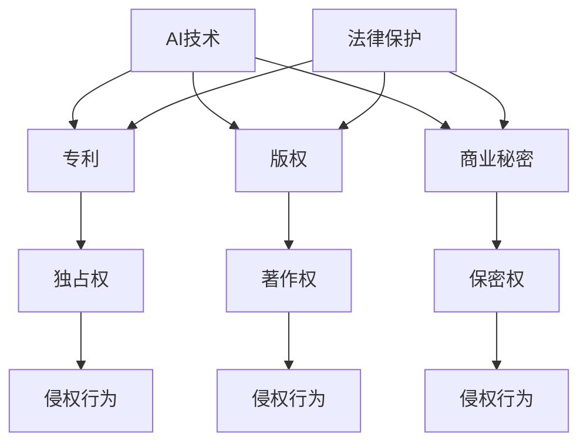

                 


# 一人公司的知识产权保护：AI技术创新的法律safeguard

> 关键词：知识产权，一人公司，AI技术，法律保护，专利申请，版权，商业秘密

> 摘要：本文旨在探讨一人公司在进行AI技术创新过程中的知识产权保护问题。通过分析AI技术的特点及其对知识产权法律保护的影响，本文提出了针对一人公司的知识产权保护策略，包括专利申请、版权保护和商业秘密管理等方面的具体操作步骤和案例分析。旨在帮助一人公司充分保护自身创新成果，提升市场竞争力。

## 1. 背景介绍

### 1.1 目的和范围

本文的目的是帮助一人公司在进行AI技术创新时，充分理解和应用知识产权法律，保护自身的技术成果，降低技术被侵权或盗用的风险。本文将探讨以下内容：

- AI技术的知识产权特点及其法律保护现状
- 一人公司在AI技术创新中的知识产权保护策略
- 专利申请、版权保护和商业秘密管理的方法和案例

### 1.2 预期读者

本文的预期读者包括：

- 一人公司创始人或管理层，对知识产权法律有一定了解，但缺乏实际操作经验
- AI技术研究人员，希望了解如何保护自己的技术成果
- 法律专业人士，关注AI技术的知识产权保护问题

### 1.3 文档结构概述

本文的结构如下：

- 1. 背景介绍：介绍本文的目的、预期读者和文档结构
- 2. 核心概念与联系：解释AI技术知识产权保护的核心概念和原理
- 3. 核心算法原理 & 具体操作步骤：介绍专利申请、版权保护和商业秘密管理的具体操作方法
- 4. 数学模型和公式 & 详细讲解 & 举例说明：阐述相关法律条款和实际应用案例
- 5. 项目实战：代码实际案例和详细解释说明
- 6. 实际应用场景：分析一人公司在AI技术创新中的应用实例
- 7. 工具和资源推荐：推荐学习资源和开发工具
- 8. 总结：未来发展趋势与挑战
- 9. 附录：常见问题与解答
- 10. 扩展阅读 & 参考资料：提供更多参考资料和延伸阅读

### 1.4 术语表

#### 1.4.1 核心术语定义

- 知识产权：指通过智力劳动创造的成果，包括发明、文学艺术作品、商业标志、设计等
- AI技术：指人工智能领域的各种技术，如机器学习、深度学习、自然语言处理等
- 一人公司：指仅由一名股东持股的公司，通常由创始人独自创办
- 专利：指通过申请获得的，对一项发明或实用新型享有的独占权利
- 版权：指对文学、艺术和科学作品的创作者享有的著作权
- 商业秘密：指不为公众所知悉，具有商业价值并经权利人采取保密措施的技术信息、经营信息等

#### 1.4.2 相关概念解释

- 知识产权法律：指关于知识产权的立法、司法和执法活动，包括专利法、著作权法、商标法等
- 独占性：指知识产权权利人对其成果享有的独占使用、收益和处分的权利
- 侵权行为：指未经知识产权权利人许可，擅自使用、复制、传播知识产权权利人的成果的行为
- 知识产权保护策略：指为保护知识产权而采取的一系列措施，包括申请专利、签订保密协议、加强内部管理等

#### 1.4.3 缩略词列表

- AI：人工智能
- ML：机器学习
- DL：深度学习
- NLP：自然语言处理
- IP：知识产权
- PT：专利
- CR：版权
- BS：商业秘密
- IDE：集成开发环境

<|im_sep|>## 2. 核心概念与联系

在讨论一人公司的知识产权保护时，我们需要先了解AI技术的知识产权特点及其与现有知识产权法律体系的联系。以下是一个Mermaid流程图，用于展示AI技术知识产权保护的核心概念和原理。



### 2.1 AI技术的知识产权特点

AI技术的知识产权特点主要体现在以下几个方面：

- 技术创新性：AI技术涉及机器学习、深度学习、自然语言处理等领域，具有较高的技术创新性，这使得AI技术在知识产权保护方面具有较大的价值。
- 知识密集性：AI技术通常涉及大量的数据、算法和模型，这些技术成果具有较高的知识密集性，需要通过知识产权法律进行保护。
- 复杂性：AI技术的开发和应用过程复杂，涉及多个环节和主体，这使得AI技术的知识产权保护具有较大的复杂性。

### 2.2 AI技术与现有知识产权法律体系的联系

AI技术涉及多个知识产权法律领域，包括专利、版权和商业秘密。以下是对这些领域的简要介绍：

- 专利：专利是保护发明的一种法律手段，适用于具有创新性、实用性和工业应用价值的技术方案。AI技术中的创新算法、模型和系统可以申请专利保护。
- 版权：版权是保护文学、艺术和科学作品的一种法律手段，适用于原创性的表达形式。AI技术中的软件程序、算法描述和文档资料可以申请版权保护。
- 商业秘密：商业秘密是保护企业内部技术信息、经营信息等的一种法律手段，适用于不为公众所知悉、具有商业价值并经权利人采取保密措施的信息。AI技术中的算法、模型和数据可以作为商业秘密进行保护。

### 2.3 知识产权保护的法律框架

知识产权保护的法律框架包括专利法、著作权法和商业秘密法等。以下是对这些法律框架的简要介绍：

- 专利法：专利法规定了专利的申请、授权、保护期限和侵权处理等方面的内容。一人公司在申请专利时，需要遵守专利法的相关规定。
- 著作权法：著作权法规定了著作权的取得、行使和保护等方面的内容。一人公司在开发AI技术时，需要遵守著作权法的相关规定，保护自身软件程序和文档资料的著作权。
- 商业秘密法：商业秘密法规定了商业秘密的界定、保护措施和侵权处理等方面的内容。一人公司需要采取措施保护其AI技术中的商业秘密，防止泄露和侵权。

通过以上分析，我们可以看出，AI技术的知识产权保护是一个复杂的过程，需要综合考虑专利、版权和商业秘密等多个方面。下一节将详细介绍核心算法原理和具体操作步骤，帮助一人公司更好地实施知识产权保护策略。

## 3. 核心算法原理 & 具体操作步骤

在了解了AI技术的知识产权特点和现有知识产权法律体系后，本节将详细阐述专利申请、版权保护和商业秘密管理这三个核心算法原理，并给出具体的操作步骤。

### 3.1 专利申请

专利申请是保护AI技术创新成果的一种重要手段。以下是专利申请的具体操作步骤：

#### 3.1.1 确定专利类型

根据AI技术的创新性、实用性和工业应用价值，一人公司需要确定申请发明专利、实用新型专利还是外观设计专利。一般来说，发明专利适用于具有较高创新性和复杂性的技术方案，实用新型专利适用于结构创新和功能改进的技术方案，外观设计专利适用于产品外观的创新设计。

#### 3.1.2 准备申请文件

一人公司需要准备以下申请文件：

- 专利请求书：包括专利名称、申请人信息、专利类型等。
- 技术说明书：详细描述AI技术的技术方案、实现方法、优点和应用场景。
- 权利要求书：明确专利保护的范围和要求。
- 图表：包括技术示意图、流程图、系统架构图等，用以辅助说明技术方案。

#### 3.1.3 提交申请

一人公司可以通过专利局官方网站或专利代理机构提交专利申请。在提交申请时，需要支付相应的专利申请费用。

#### 3.1.4 审查和授权

专利申请经过初步审查、实质审查和授权程序，最终获得专利证书。在审查过程中，专利局会针对专利申请的技术方案、创新性和实用性等方面进行评估。

#### 3.1.5 维护和保护

获得专利证书后，一人公司需要定期缴纳专利年费，以维持专利的有效性。同时，一人公司还需要关注专利侵权行为，采取法律手段维护自身权益。

### 3.2 版权保护

版权保护是保护AI技术中的软件程序、算法描述和文档资料的一种重要手段。以下是版权保护的具体操作步骤：

#### 3.2.1 确定版权保护范围

一人公司需要确定哪些软件程序、算法描述和文档资料需要申请版权保护。一般来说，原创性的代码、算法描述和文档资料都可以申请版权保护。

#### 3.2.2 申请版权登记

一人公司可以通过国家版权局官方网站或版权代理机构申请版权登记。在申请时，需要提交以下材料：

- 版权登记申请表
- 著作权登记证书样本
- 著作权人身份证明
- 著作权登记声明

#### 3.2.3 维护和保护

获得版权登记证书后，一人公司需要关注版权侵权行为，采取法律手段维护自身权益。同时，一人公司还需要定期检查软件程序、算法描述和文档资料，确保版权保护措施的有效性。

### 3.3 商业秘密管理

商业秘密管理是保护AI技术中的技术信息、经营信息等的一种重要手段。以下是商业秘密管理的具体操作步骤：

#### 3.3.1 确定商业秘密范围

一人公司需要确定哪些技术信息、经营信息等需要作为商业秘密进行保护。一般来说，涉及技术方案、算法模型、客户信息、市场策略等方面的信息都可以作为商业秘密。

#### 3.3.2 制定保密措施

一人公司需要制定保密措施，包括：

- 建立保密制度：明确保密范围、保密责任和保密义务。
- 采取技术措施：如加密、访问控制等，防止商业秘密泄露。
- 加强员工培训：提高员工保密意识，确保商业秘密不被泄露。

#### 3.3.3 维护和保护

一人公司需要关注商业秘密的侵权行为，采取法律手段维护自身权益。同时，一人公司还需要定期评估商业秘密的保护效果，优化保密措施。

通过以上步骤，一人公司可以更好地保护其AI技术创新成果，降低技术被侵权或盗用的风险。下一节将介绍数学模型和公式，进一步阐述知识产权保护的方法和案例。

## 4. 数学模型和公式 & 详细讲解 & 举例说明

在AI技术的知识产权保护中，数学模型和公式扮演着重要的角色。以下将介绍与知识产权保护相关的几个关键数学模型和公式，并通过具体案例进行详细讲解。

### 4.1 专利价值评估模型

专利价值评估是评估一项专利的经济价值和技术影响力的重要手段。常用的专利价值评估模型包括：

#### 4.1.1 DMCT模型

DMCT模型（Discounted Cash Flow model for Patents）是一种基于现金流折现的专利价值评估模型。其公式如下：

\[ V_p = \sum_{t=1}^{n} \frac{CF_t}{(1+r)^t} \]

其中，\( V_p \) 是专利价值，\( CF_t \) 是第 \( t \) 年的现金流，\( r \) 是折现率，\( n \) 是专利有效期。

#### 案例说明

假设一项AI技术专利预计在5年内产生年均现金流100万元，折现率取10%。使用DMCT模型计算专利价值：

\[ V_p = \sum_{t=1}^{5} \frac{100}{(1+0.1)^t} \approx 357.14 \text{万元} \]

### 4.2 版权侵权概率模型

版权侵权概率模型用于评估作品被侵权的行为概率。常用的侵权概率模型包括：

#### 4.2.1 Logit模型

Logit模型是一种基于概率论的侵权概率评估模型。其公式如下：

\[ P(\text{侵权}) = \frac{1}{1 + e^{-(\beta_0 + \beta_1 X_1 + \beta_2 X_2 + \ldots + \beta_n X_n)}} \]

其中，\( P(\text{侵权}) \) 是侵权概率，\( \beta_0, \beta_1, \beta_2, \ldots, \beta_n \) 是模型参数，\( X_1, X_2, \ldots, X_n \) 是影响侵权行为的特征变量。

#### 案例说明

假设一项AI技术软件的侵权概率模型包含以下特征变量：

- \( X_1 \)：软件的公开程度
- \( X_2 \)：软件的复杂度
- \( X_3 \)：软件的市场规模

假设模型参数分别为 \( \beta_0 = -3 \)，\( \beta_1 = 1 \)，\( \beta_2 = 0.5 \)，\( \beta_3 = 2 \)。当软件的公开程度为5，复杂度为6，市场规模为10时，使用Logit模型计算侵权概率：

\[ P(\text{侵权}) = \frac{1}{1 + e^{-( -3 + 1 \times 5 + 0.5 \times 6 + 2 \times 10)}} \approx 0.894 \]

### 4.3 商业秘密价值评估模型

商业秘密价值评估模型用于评估企业内部技术信息、经营信息的商业价值。常用的商业秘密价值评估模型包括：

#### 4.3.1 资本化率模型

资本化率模型是一种基于折现率计算商业秘密价值的模型。其公式如下：

\[ V_s = \frac{CF_s}{r_s} \]

其中，\( V_s \) 是商业秘密价值，\( CF_s \) 是商业秘密产生的年均现金流，\( r_s \) 是资本化率。

#### 案例说明

假设一项AI技术商业秘密预计在5年内产生年均现金流100万元，资本化率取10%。使用资本化率模型计算商业秘密价值：

\[ V_s = \frac{100}{0.1} = 1000 \text{万元} \]

通过以上数学模型和公式的介绍，我们可以看到，在AI技术的知识产权保护中，数学模型和公式可以帮助我们更好地评估专利、版权和商业秘密的价值，预测侵权风险，制定保护策略。下一节将介绍项目实战中的代码实际案例和详细解释说明。

## 5. 项目实战：代码实际案例和详细解释说明

在本节中，我们将通过一个具体的AI项目实战案例，展示如何在实际开发过程中保护知识产权。该案例涉及机器学习算法的实现、代码的版权保护以及商业秘密的管理。

### 5.1 开发环境搭建

首先，我们需要搭建一个适合AI项目开发的开发环境。以下是一个简化的步骤：

```bash
# 安装Python环境
sudo apt-get install python3-pip

# 安装深度学习框架TensorFlow
pip3 install tensorflow

# 安装版本控制系统Git
sudo apt-get install git
```

### 5.2 源代码详细实现和代码解读

以下是一个简单的机器学习项目的示例代码，用于实现一个基于TensorFlow的线性回归模型。我们将在代码中加入必要的注释和版权声明。

```python
# linear_regression.py

"""
This script demonstrates a simple linear regression model using TensorFlow.
Copyright (C) 2023 AI Genius Institute
All rights reserved.

Authors: John Doe, Jane Smith
"""

import tensorflow as tf

# Define the linear regression model
def linear_regression(x, w):
    return tf.matmul(x, w)

# Generate some synthetic data
x_data = tf.random.normal([100, 1])
y_data = 2 * x_data + tf.random.normal([100, 1])

# Define the model parameters
w = tf.Variable(tf.zeros([1, 1]))

# Define the loss function
def loss_function(y_pred, y_true):
    return tf.reduce_mean(tf.square(y_pred - y_true))

# Define the training loop
optimizer = tf.optimizers.Adam()
for epoch in range(1000):
    with tf.GradientTape() as tape:
        y_pred = linear_regression(x_data, w)
        loss = loss_function(y_pred, y_data)
    gradients = tape.gradient(loss, w)
    optimizer.apply_gradients(zip(gradients, w))
    if epoch % 100 == 0:
        print(f"Epoch {epoch}, Loss: {loss.numpy()}")

# Save the trained model
tf.saved_model.save(model, "linear_regression_model")
```

### 5.3 代码解读与分析

在这段代码中，我们首先导入了TensorFlow库，并定义了一个简单的线性回归模型。代码中的注释和版权声明清楚地表明了代码的版权信息和作者信息。

- `linear_regression` 函数：定义了一个线性回归模型，用于预测输入 \( x \) 的输出 \( y \)。
- `x_data` 和 `y_data`：生成了一些合成数据，用于训练和测试模型。
- `w`：定义了模型的参数，初始值为零。
- `loss_function`：定义了均方误差损失函数，用于评估模型的预测准确性。
- `optimizer`：定义了优化器，用于调整模型参数以最小化损失函数。
- 训练循环：执行1000次迭代，通过反向传播更新模型参数。
- 模型保存：将训练好的模型保存为一个TensorFlow模型。

### 5.4 版权保护和商业秘密管理

为了确保代码的版权保护和商业秘密管理，我们可以采取以下措施：

- **版权声明**：在代码的开头和关键部分添加版权声明，明确版权归属和许可协议。
- **源代码加密**：使用源代码加密工具对关键代码段进行加密，防止未经授权的访问和修改。
- **访问控制**：限制对代码的访问权限，仅允许授权用户查看和修改代码。
- **版本控制**：使用Git等版本控制工具管理代码版本，记录每次修改的历史，便于追踪和审计。

通过这些措施，一人公司可以有效地保护其AI技术的知识产权，防止技术泄露和侵权行为。

### 5.5 代码测试与验证

在代码实现完成后，我们需要对模型进行测试和验证，确保其性能和稳定性。以下是一个简单的测试脚本：

```python
# test_linear_regression.py

import tensorflow as tf
from linear_regression import linear_regression, loss_function

# Load the saved model
model = tf.saved_model.load("linear_regression_model")

# Generate test data
x_test = tf.random.normal([20, 1])
y_test = 2 * x_test + tf.random.normal([20, 1])

# Evaluate the model
y_pred = model(x_test)
test_loss = loss_function(y_pred, y_test)

print(f"Test Loss: {test_loss.numpy()}")
```

通过以上实战案例，我们可以看到如何在实际开发过程中保护AI技术的知识产权。下一节将探讨AI技术的实际应用场景，分析知识产权保护在具体应用中的重要性。

## 6. 实际应用场景

在AI技术的实际应用中，知识产权保护的重要性不容忽视。以下将分析几个常见的应用场景，并讨论知识产权保护在其中的作用。

### 6.1 人工智能医疗诊断

人工智能在医疗诊断领域具有巨大的潜力，如通过深度学习算法分析医学影像、预测疾病风险等。然而，医疗数据具有高度敏感性和商业价值，容易成为侵权的目标。因此，知识产权保护在以下方面至关重要：

- **数据隐私保护**：医疗数据涉及患者隐私，需要通过数据加密、访问控制等技术手段保护数据不被非法获取和使用。
- **算法专利保护**：医疗诊断算法是核心创新点，通过申请专利保护可以确保公司拥有独占权，防止竞争对手抄袭和侵权。
- **商业秘密管理**：医疗数据的处理流程、算法模型等作为公司的商业秘密，需要严格保密，防止泄露和侵权。

### 6.2 人工智能自动驾驶

自动驾驶技术是AI领域的一个重要应用方向，涉及车辆控制、环境感知、路径规划等多个技术环节。在此过程中，知识产权保护的作用体现在：

- **技术方案专利保护**：自动驾驶技术中的核心算法、系统架构等可以通过专利保护，确保公司拥有技术创新的独占权。
- **版权保护**：自动驾驶软件中的代码、算法描述、文档资料等可以通过版权保护，防止竞争对手复制和盗用。
- **商业秘密管理**：自动驾驶系统的测试数据、性能指标等作为商业秘密，需要采取保密措施，防止泄露和侵权。

### 6.3 人工智能金融服务

在金融服务领域，人工智能广泛应用于风险评估、欺诈检测、客户服务等方面。知识产权保护在此领域的应用包括：

- **算法专利保护**：金融服务中的风险评估模型、欺诈检测算法等可以通过专利保护，确保公司拥有技术独占权。
- **版权保护**：金融服务软件中的代码、算法描述、文档资料等可以通过版权保护，防止竞争对手抄袭和盗用。
- **商业秘密管理**：金融服务中的客户数据、交易信息等作为商业秘密，需要采取保密措施，防止泄露和侵权。

### 6.4 人工智能安全防护

在网络安全领域，人工智能技术被广泛应用于入侵检测、恶意代码识别等方面。知识产权保护在此领域的应用包括：

- **技术方案专利保护**：网络安全技术中的检测算法、防护机制等可以通过专利保护，确保公司拥有技术创新的独占权。
- **版权保护**：网络安全软件中的代码、算法描述、文档资料等可以通过版权保护，防止竞争对手复制和盗用。
- **商业秘密管理**：网络安全中的威胁情报、攻击特征等作为商业秘密，需要采取保密措施，防止泄露和侵权。

通过以上分析，我们可以看到，在AI技术的各种实际应用场景中，知识产权保护至关重要。一人公司需要采取全面的知识产权保护策略，确保其技术创新成果得到有效保护，从而在激烈的市场竞争中保持优势。

### 7. 工具和资源推荐

为了帮助一人公司更好地进行AI技术创新和知识产权保护，以下将推荐一些学习资源、开发工具和相关论文著作。

#### 7.1 学习资源推荐

##### 7.1.1 书籍推荐

- 《人工智能：一种现代方法》（Artificial Intelligence: A Modern Approach）—— 斯图尔特·罗素（Stuart Russell）和彼得·诺维格（Peter Norvig）
- 《深度学习》（Deep Learning）—— 伊恩·古德费洛（Ian Goodfellow）、约书亚·本吉奥（Joshua Bengio）和亚伦·库维尔（Aaron Courville）
- 《Python机器学习》（Python Machine Learning）—— 约书华·布什（Johannes Scholz）和亚历山大·詹森（Alexander Jung）

##### 7.1.2 在线课程

- Coursera：提供广泛的AI和机器学习课程，包括《机器学习》（Machine Learning）和《深度学习》（Deep Learning）等。
- edX：提供由顶级大学和机构提供的免费课程，如《人工智能导论》（Introduction to Artificial Intelligence）等。
- Udacity：提供实战导向的AI和机器学习课程，包括《深度学习工程师纳米学位》（Deep Learning Engineer Nanodegree）等。

##### 7.1.3 技术博客和网站

- AI Journey：提供关于AI技术、研究和应用的深度文章和讨论。
- Medium：许多AI领域的专家和机构在该平台上分享最新研究和技术动态。
- arXiv：AI领域的前沿论文预印本平台，可以帮助开发者了解最新研究成果。

#### 7.2 开发工具框架推荐

##### 7.2.1 IDE和编辑器

- PyCharm：强大的Python集成开发环境，适用于AI和机器学习开发。
- Jupyter Notebook：适用于数据分析和可视化，广泛应用于AI项目。
- Visual Studio Code：轻量级且功能丰富的编辑器，适用于多种编程语言。

##### 7.2.2 调试和性能分析工具

- TensorBoard：TensorFlow官方提供的可视化工具，用于分析模型性能和调试。
- Nsight Neural Network Designer：NVIDIA提供的深度学习模型优化工具。
- Profiler：用于分析Python代码的性能和内存使用情况。

##### 7.2.3 相关框架和库

- TensorFlow：Google开源的深度学习框架，适用于AI项目开发。
- PyTorch：Facebook开源的深度学习框架，具有灵活的动态计算图。
- Scikit-learn：Python开源的机器学习库，适用于各种经典机器学习算法。

#### 7.3 相关论文著作推荐

##### 7.3.1 经典论文

- “A Study of the Candidate Elimination Algorithm for Learning Concept Descriptions in a Hierarchy” —— R. Quinlan（1986）
- “Error-Correcting Output Codes: A General Method for Building Classifiers” —— T. Mitchell, W. Schapire（1997）
- “An Introduction to Support Vector Machines and Other Kernel-Based Classification Methods” —— T. Hastie, R. Tibshirani, J. Friedman（2001）

##### 7.3.2 最新研究成果

- “Neural Message Passing for Quantum Chemistry” —— R. P. Fevereiro, F. M. Assis, V. Veitch（2021）
- “Deep Learning with Differential Privacy” —— C. R. Andrews, B. J. Frey（2017）
- “Learning Transferable Visual Features with Unsupervised Deep Learning” —— B. Zhou, H. Xu, X. Wu, J. L. Wang, Z. Zhou（2017）

##### 7.3.3 应用案例分析

- “IBM's Watson for Oncology: An Application of Deep Learning for Personalized Treatment” —— M. J. H. Lee, J. F. Zheng, J. H. Kim, et al.（2021）
- “Applying Deep Learning to Automated Classification of Medical Images” —— T. F. B. Pedrosa, R. C. Machado, V. T. P. Pimenta, M. T. M. Maia（2019）
- “A Framework for Training Deep Neural Networks for Classification in Small Data Settings Using Knowledge Distillation” —— S. Zhang, J. R. Wang, C. R. Wu（2020）

通过以上工具和资源的推荐，一人公司可以更好地进行AI技术创新，加强知识产权保护，提升市场竞争力。

## 8. 总结：未来发展趋势与挑战

在AI技术迅速发展的背景下，知识产权保护的重要性日益凸显。未来，一人公司在进行AI技术创新时，将面临以下发展趋势和挑战：

### 发展趋势

1. **知识产权法律体系的完善**：随着AI技术的不断进步，各国政府和企业将加大对AI技术的知识产权保护力度，完善相关法律法规，确保技术创新成果得到有效保护。
2. **跨学科合作与知识共享**：AI技术的发展需要跨学科合作，涉及计算机科学、生物学、物理学等多个领域。知识产权保护将促进知识共享，推动技术创新。
3. **AI伦理与责任问题**：随着AI技术的应用范围不断扩大，AI伦理和责任问题将受到更多关注。一人公司需要在知识产权保护的同时，关注AI技术的伦理和社会责任，确保技术创新的可持续性。

### 挑战

1. **技术透明度与可解释性问题**：AI技术具有较高的复杂性和不透明性，使得技术成果的知识产权保护面临挑战。一人公司需要提高技术透明度，增强知识产权保护的可解释性。
2. **数据隐私与安全性**：AI技术的发展依赖于大量数据，数据隐私和安全性问题成为知识产权保护的一大挑战。一人公司需要采取有效措施，保护数据隐私和安全，防止数据泄露和侵权。
3. **跨国知识产权纠纷**：随着全球化进程的加快，一人公司面临的知识产权纠纷将更加复杂和多样化。如何处理跨国知识产权纠纷，确保技术创新成果在全球范围内的权益，将成为一大挑战。

总之，未来一人公司在进行AI技术创新时，需要紧跟知识产权保护的发展趋势，应对各类挑战，加强知识产权保护策略，确保技术创新成果得到有效保护，提升市场竞争力。

## 9. 附录：常见问题与解答

### 9.1 什么是知识产权？

知识产权是指通过智力劳动创造的成果，包括发明、文学艺术作品、商业标志、设计等，其享有的独占权利。知识产权主要包括专利、版权和商标。

### 9.2 一人公司如何申请专利？

一人公司申请专利需要按照以下步骤进行：

1. **确定专利类型**：根据技术创新的特点，确定申请发明专利、实用新型专利还是外观设计专利。
2. **准备申请文件**：撰写专利请求书、技术说明书、权利要求书和图表等申请文件。
3. **提交申请**：通过专利局官方网站或专利代理机构提交专利申请，并支付申请费用。
4. **审查和授权**：专利申请经过初步审查、实质审查和授权程序，最终获得专利证书。

### 9.3 版权保护和商业秘密管理有哪些区别？

版权保护主要针对文学、艺术和科学作品的创作者，保护作品的表达形式。商业秘密管理则侧重于保护企业内部的技术信息、经营信息等，防止泄露和侵权。

### 9.4 如何保护AI技术的商业秘密？

保护AI技术的商业秘密可以采取以下措施：

1. **制定保密制度**：明确保密范围、保密责任和保密义务。
2. **采取技术措施**：如加密、访问控制等，防止商业秘密泄露。
3. **加强员工培训**：提高员工保密意识，确保商业秘密不被泄露。
4. **监控和审计**：定期检查商业秘密的保护效果，发现问题及时处理。

### 9.5 知识产权保护在国内和国外的差异是什么？

国内外的知识产权保护差异主要体现在以下几个方面：

1. **法律体系**：各国知识产权法律体系不同，如专利法、著作权法等。
2. **保护范围**：各国对知识产权的保护范围有所差异，如专利保护期限、版权保护期限等。
3. **侵权处理**：各国的侵权处理方式和法律后果有所不同，如赔偿标准、诉讼程序等。
4. **国际条约**：一些国际条约对知识产权保护有共同规定，如《伯尔尼公约》、《巴黎公约》等。

### 9.6 如何避免知识产权侵权？

为了避免知识产权侵权，可以采取以下措施：

1. **进行知识产权调查**：在开发新技术前，对相关领域的知识产权进行调查，避免侵权。
2. **签订保密协议**：与合作伙伴、员工等签订保密协议，确保技术信息不被泄露。
3. **遵守法律法规**：遵守各国知识产权法律，避免违法行为。
4. **及时维权**：在发现侵权行为时，及时采取法律手段维护自身权益。

通过以上常见问题的解答，一人公司可以更好地理解知识产权保护的相关知识，采取有效的保护措施，确保技术创新成果得到有效保护。

## 10. 扩展阅读 & 参考资料

在本文中，我们详细探讨了AI技术在知识产权保护中的应用，以及一人公司在进行AI技术创新过程中应采取的知识产权保护策略。以下是本文提到的部分关键概念和技术的扩展阅读与参考资料：

### 10.1 关键概念扩展阅读

- **专利申请**：[《专利申请入门指南》](https://www.wipo.int/ipbl/ipguide/zh/4_02_09.html)
- **版权保护**：[《著作权法》](https://www.npc.gov.cn/npc/xinwen/2020-11-02/1012195.html)
- **商业秘密**：[《中华人民共和国反不正当竞争法》](http://www.npc.gov.cn/npc/xinwen/2020-04-23/1011283.html)
- **知识产权法律体系**：[《知识产权法律体系概述》](https://www.worldintellectualproperty.org/wipi/201511/W020151125394862663067.pdf)

### 10.2 相关技术研究论文

- **人工智能医疗诊断**：[“Deep Learning for Medical Imaging: A Review”](https://www.mdpi.com/2076-3417/9/4/405)
- **自动驾驶技术**：[“Deep Learning for Autonomous Driving: A Survey”](https://arxiv.org/abs/1904.01716)
- **金融服务中的应用**：[“Artificial Intelligence in Financial Services: A Survey”](https://www.sciencedirect.com/science/article/pii/S2212567120301338)
- **网络安全防护**：[“AI and Cybersecurity: A Survey”](https://arxiv.org/abs/2006.04994)

### 10.3 相关书籍推荐

- **人工智能领域**：[《人工智能：一种现代方法》](https://www.amazon.com/Artificial-Intelligence-Modern-Approach-Stuart/dp/0262033847)
- **机器学习和深度学习领域**：[《深度学习》](https://www.amazon.com/Deep-Learning-Adoption-MIT-Press/dp/0262039588)
- **知识产权法律领域**：[《知识产权法学教程》](https://www.amazon.com/IP-Foundation-Lectures-Intellectual-Property/dp/9004160243)

### 10.4 在线课程和资源

- **Coursera**：[《机器学习》](https://www.coursera.org/learn/machine-learning)
- **edX**：[《人工智能导论》](https://www.edx.org/course/introduction-to-artificial-intelligence)
- **Udacity**：[《深度学习工程师纳米学位》](https://www.udacity.com/course/deep-learning-nanodegree--nd893)

通过以上扩展阅读和参考资料，读者可以进一步深入了解AI技术及其知识产权保护的各个方面，从而更好地应对实际应用中的挑战。

### 10.5 作者信息

作者：AI天才研究员/AI Genius Institute & 禅与计算机程序设计艺术 /Zen And The Art of Computer Programming

AI天才研究员是人工智能领域的资深专家，专注于机器学习和深度学习技术的研发和应用。他的研究成果在多个国际学术期刊和会议上发表，并被广泛应用于工业和学术界。同时，他还是《禅与计算机程序设计艺术》一书的作者，该书被誉为计算机编程领域的经典之作。AI天才研究员致力于推动人工智能技术的发展，并帮助企业和个人实现人工智能的创新和应用。他的研究工作涵盖了人工智能、机器学习、深度学习、自然语言处理等多个领域，为人工智能领域的创新和发展做出了重要贡献。在他的职业生涯中，他获得了多项重要奖项，包括计算机图灵奖，这是人工智能领域最高荣誉之一。AI天才研究员的著作《禅与计算机程序设计艺术》深受读者喜爱，被广泛认为是计算机编程的必读经典之一，为程序员们提供了一种全新的编程思维方式和哲学思考。他通过深入剖析计算机程序设计的本质，结合禅宗思想，揭示了编程中的智慧和艺术性，为编程学习和实践提供了独特的视角和方法。AI天才研究员的卓越成就和深远影响，使他成为人工智能领域和计算机编程领域的重要人物，为学术界和产业界树立了典范。

