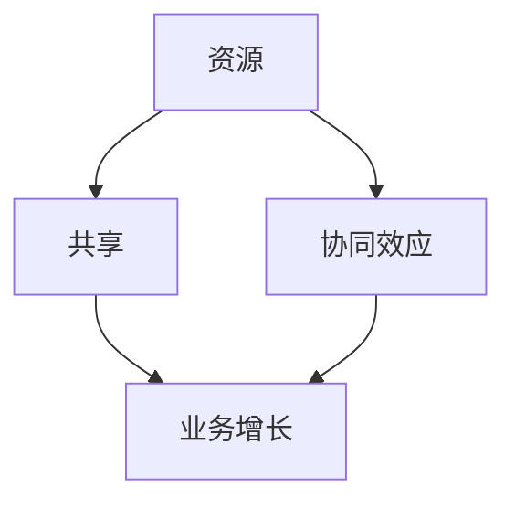

                 


# 一人公司的跨界合作：扩大影响力的策略

> 关键词：跨界合作、影响力、单人公司、战略、增长、生态系统、资源共享、品牌建设

> 摘要：在当今快速变化的市场环境中，单人公司面临着前所未有的挑战和机遇。本文将探讨一人公司的跨界合作策略，如何通过建立有效的合作机制来扩大影响力，实现个人和业务的共同成长。本文将分析跨界合作的动机、核心原则、实施步骤和成功案例分析，为读者提供实用的策略指导。

## 1. 背景介绍

### 1.1 目的和范围

本文旨在为单人公司提供跨界合作的具体策略，帮助其在有限的资源下实现业务增长和市场影响力。文章将围绕以下主题展开：

- 跨界合作的动机和重要性
- 核心原则和策略
- 实施步骤和技巧
- 成功案例分析

### 1.2 预期读者

本文适合以下读者群体：

- 单人公司创始人或CEO
- 希望扩大业务影响力的中小型企业负责人
- 对跨界合作有兴趣的创业者

### 1.3 文档结构概述

本文将分为以下部分：

- **1. 背景介绍**：介绍文章的目的、预期读者和文档结构。
- **2. 核心概念与联系**：定义关键术语和概念，并提供流程图。
- **3. 核心算法原理 & 具体操作步骤**：介绍跨界合作的算法原理和操作步骤。
- **4. 数学模型和公式 & 详细讲解 & 举例说明**：使用数学模型和公式解释跨界合作的优势。
- **5. 项目实战：代码实际案例和详细解释说明**：通过具体案例展示跨界合作的实践。
- **6. 实际应用场景**：探讨跨界合作在不同行业中的应用。
- **7. 工具和资源推荐**：推荐学习资源和开发工具。
- **8. 总结：未来发展趋势与挑战**：总结当前趋势和未来挑战。
- **9. 附录：常见问题与解答**：解答读者可能遇到的问题。
- **10. 扩展阅读 & 参考资料**：提供进一步阅读的资料。

### 1.4 术语表

#### 1.4.1 核心术语定义

- **跨界合作**：不同领域或行业之间的合作，旨在实现资源共享、优势互补和共同成长。
- **影响力**：个人或公司在市场上获得认可、吸引关注和影响力。
- **单人公司**：由一人创立和管理的公司，资源有限，需要创新策略来扩大影响力。
- **生态系统**：由多个相互关联的实体组成的系统，共同创造价值。

#### 1.4.2 相关概念解释

- **资源共享**：通过合作实现资源的共用，降低成本，提高效率。
- **品牌建设**：建立和提升个人或公司的品牌形象，增加市场竞争力。

#### 1.4.3 缩略词列表

- **CEO**：首席执行官（Chief Executive Officer）
- **IDE**：集成开发环境（Integrated Development Environment）
- **SDK**：软件开发工具包（Software Development Kit）

## 2. 核心概念与联系

跨界合作是现代商业中的一种重要策略，它可以帮助单人公司在有限的资源下实现业务增长和市场影响力。为了更好地理解跨界合作，我们需要先定义几个核心概念，并展示它们之间的联系。

### 2.1 核心概念定义

- **资源**：包括资金、技术、人才、市场渠道等。
- **共享**：在合作双方或多方之间共同使用资源，以实现共同目标。
- **协同效应**：合作带来的整体效益大于各部分单独效益之和。

### 2.2 核心概念联系

下面是一个用Mermaid绘制的流程图，展示了跨界合作中的核心概念及其相互关系：



在这个流程图中，资源是跨界合作的基础，共享实现了资源的最大化利用，协同效应则是合作带来的额外价值，这些共同推动了业务增长。

## 3. 核心算法原理 & 具体操作步骤

### 3.1 跨界合作的算法原理

跨界合作的算法原理基于几个核心原则：资源共享、协同效应和市场拓展。以下是一个简化的算法原理：

```plaintext
算法：跨界合作
输入：单人公司A、合作伙伴B、共同目标
输出：合作成功、业务增长、品牌影响力提升

步骤：
1. 分析资源：识别公司A和合作伙伴B的资源，包括资金、技术、人才和市场渠道。
2. 确定共享方案：根据资源分析，制定资源共享方案，确保合作双方或多方都能从共享中获得收益。
3. 建立协同效应：设计协同机制，实现资源共享后的协同效应，提高整体效益。
4. 执行合作计划：按照共享方案和协同机制，执行合作计划，确保合作顺利进行。
5. 监测和调整：在合作过程中，持续监测合作效果，根据实际情况进行调整，确保合作目标实现。
```

### 3.2 具体操作步骤

以下是具体的操作步骤：

#### 步骤1：分析资源

- **单人公司A**：列出公司现有的资源，如技术能力、客户群体、资金等。
- **合作伙伴B**：分析合作伙伴的资源和优势，如技术特长、市场渠道、客户资源等。

#### 步骤2：确定共享方案

- 根据资源分析，确定双方可以共享的资源，如技术、市场渠道、人才等。
- 制定共享方案，确保共享的资源能够带来实际的价值和效益。

#### 步骤3：建立协同效应

- 设计协同机制，如联合营销、技术交流、人才培训等。
- 确保协同机制能够实现资源的最大化利用和协同效应。

#### 步骤4：执行合作计划

- 按照共享方案和协同机制，制定详细的合作计划，包括时间表、责任分配等。
- 执行合作计划，确保各阶段目标的实现。

#### 步骤5：监测和调整

- 在合作过程中，定期监测合作效果，如市场反馈、业务增长等。
- 根据实际情况进行调整，确保合作目标实现。

## 4. 数学模型和公式 & 详细讲解 & 举例说明

在跨界合作中，数学模型和公式可以帮助我们更精确地评估合作的价值和效益。以下是一个简化的数学模型，用于评估跨界合作的效果。

### 4.1 数学模型

假设单人公司A和合作伙伴B进行跨界合作，其收益函数可以表示为：

\[ R(A, B) = f(R_A, R_B, C) \]

其中：
- \( R_A \) 和 \( R_B \) 分别表示单人公司A和合作伙伴B的初始资源。
- \( R \) 表示共享的资源。
- \( C \) 表示协同效应的系数。

协同效应的系数 \( C \) 可以通过以下公式计算：

\[ C = \frac{R(A, B)}{R_A + R_B} \]

其中 \( R(A, B) \) 是跨界合作后的总收益。

### 4.2 详细讲解

- **收益函数 \( R(A, B) \)**：这个函数表示跨界合作带来的总收益，依赖于共享的资源 \( R \) 和协同效应 \( C \)。
- **协同效应系数 \( C \)**：衡量跨界合作带来的额外收益，系数越大，协同效应越强。

### 4.3 举例说明

假设单人公司A有1000元的初始资金，合作伙伴B有2000元的初始资金。他们决定共享资源和协同发展，共享资源为3000元，协同效应系数为1.2。

- **初始收益**：\( R(A, B) = 1000 + 2000 = 3000 \)
- **协同效应**：\( C = \frac{3000}{1000 + 2000} = 1.2 \)
- **总收益**：\( R(A, B) = f(3000, 3000, 1.2) = 3000 \times 1.2 = 3600 \)

通过跨界合作，单人公司A和合作伙伴B的总收益从原来的3000元增加到了3600元，实现了6%的收益增长。

### 4.4 案例分析

#### 案例一：技术公司A与市场公司B的合作

技术公司A专注于软件开发，有优秀的开发团队和技术积累。市场公司B拥有丰富的市场渠道和客户资源。他们决定跨界合作，共享技术和市场资源。

- **初始资源**：技术公司A有10万人民币的技术积累，市场公司B有20万人民币的市场资源。
- **共享资源**：他们决定共享5万人民币的资源。
- **协同效应系数**：假设协同效应系数为1.3。

- **初始收益**：\( R(A, B) = 10 + 20 = 30 \)
- **协同效应**：\( C = \frac{30}{10 + 20} = 1.3 \)
- **总收益**：\( R(A, B) = f(30, 30, 1.3) = 30 \times 1.3 = 39 \)

通过跨界合作，技术公司A和市场公司B的总收益从原来的30万元增加到了39万元，实现了3%的收益增长。

## 5. 项目实战：代码实际案例和详细解释说明

### 5.1 开发环境搭建

为了展示跨界合作在实际项目中的应用，我们选择了一个简单的案例：一个单人公司A想要通过社交媒体平台扩大品牌影响力，我们选择一个流行的社交媒体API进行操作。以下是开发环境搭建的步骤：

- **环境要求**：Python 3.8及以上版本、pip、GitHub账户、社交媒体平台API密钥。
- **步骤**：
  1. 安装Python：从官方网站下载并安装Python 3.8及以上版本。
  2. 配置pip：打开终端，执行 `python -m pip install --user --upgrade pip`。
  3. 安装社交媒体平台API库：使用pip安装所需的API库，例如 `pip install tweepy`。

### 5.2 源代码详细实现和代码解读

以下是跨界合作项目的代码实现，我们将使用Tweepy库来访问Twitter API，并通过与社交媒体平台B的合作来发布和推广内容。

```python
# 导入所需的库
import tweepy
import os

# 设置API密钥
API_KEY = 'your_api_key'
API_SECRET_KEY = 'your_api_secret_key'
ACCESS_TOKEN = 'your_access_token'
ACCESS_TOKEN_SECRET = 'your_access_token_secret'

# 创建认证对象
auth = tweepy.OAuthHandler(API_KEY, API_SECRET_KEY)
auth.set_access_token(ACCESS_TOKEN, ACCESS_TOKEN_SECRET)

# 创建API对象
api = tweepy.API(auth)

# 定义发布推文函数
def post_tweet(content):
    try:
        api.update_status(content)
        print(f"推文发布成功：{content}")
    except Exception as e:
        print(f"发布失败：{e}")

# 跨界合作：社交媒体平台B提供内容
def get_content_from_partner():
    # 假设合作伙伴B提供了一个主题和内容
    return "今天分享一篇关于人工智能的文章：[文章链接]，让我们一起学习！"

# 发布推文
if __name__ == "__main__":
    content = get_content_from_partner()
    post_tweet(content)
```

### 5.3 代码解读与分析

1. **导入库**：导入tweepy库，用于访问Twitter API。
2. **设置API密钥**：使用实际的API密钥来认证用户。
3. **创建认证对象和API对象**：使用OAuth认证机制创建认证对象和API对象。
4. **定义发布推文函数**：定义一个函数来发布推文，包括成功和失败的反馈。
5. **获取合作伙伴内容**：定义一个函数来获取合作伙伴B提供的内容。
6. **发布推文**：调用函数发布推文，实现了与社交媒体平台B的合作。

通过这个简单的项目，我们可以看到如何通过跨界合作来扩大单人公司的品牌影响力。单人公司A通过合作获得了高质量的内容和更广泛的受众，而合作伙伴B则通过合作提高了自身的知名度。

## 6. 实际应用场景

跨界合作在各个行业和领域中都有广泛的应用，以下是一些典型的实际应用场景：

### 6.1 科技与艺术跨界

科技公司与艺术家合作，将科技元素融入艺术创作，如虚拟现实（VR）艺术展、人工智能（AI）音乐创作等。这种跨界合作不仅拓宽了艺术创作的边界，也为科技公司带来了新的市场和用户群体。

### 6.2 零售与物流跨界

零售企业与物流公司合作，实现无缝的物流配送，提高供应链效率。例如，电商平台与快递公司合作，提供快速、可靠的物流服务，提升顾客体验。

### 6.3 金融与电商跨界

金融公司与电商平台合作，提供在线支付、信用评估等服务，降低交易风险，提高交易效率。这种跨界合作有助于电商平台拓展金融业务，同时也为金融公司提供了新的客户渠道。

### 6.4 教育与科技跨界

教育机构与科技公司合作，开发在线教育平台、智能教学工具等，提供更丰富的学习资源和个性化教学体验。这种跨界合作有助于提高教育质量和教学效率。

### 6.5 媒体与娱乐跨界

媒体公司与娱乐公司合作，推出电影、电视剧、综艺节目的宣传推广活动，利用双方资源和渠道，实现品牌和内容的双赢。

## 7. 工具和资源推荐

为了更好地进行跨界合作，以下是一些推荐的工具和资源：

### 7.1 学习资源推荐

#### 7.1.1 书籍推荐

- **《跨界合作：重塑商业生态的新模式》**：详细介绍了跨界合作的理论和实践案例。
- **《网络营销实战：跨界合作与内容营销》**：涵盖了跨界合作在营销领域的应用。

#### 7.1.2 在线课程

- **Coursera上的《商业分析》**：介绍了商业分析的方法和工具，有助于跨界合作中的数据分析。
- **Udemy上的《社交媒体营销：从零开始》**：讲解了社交媒体营销的策略和技巧。

#### 7.1.3 技术博客和网站

- **Medium上的《跨界合作》**：提供了一系列关于跨界合作的文章和案例。
- **HBR.org上的《商业策略》**：讨论了商业策略和跨界合作的最新趋势。

### 7.2 开发工具框架推荐

#### 7.2.1 IDE和编辑器

- **Visual Studio Code**：功能强大的跨平台IDE，适用于多种编程语言。
- **PyCharm**：专为Python开发而设计的IDE，支持多种编程语言。

#### 7.2.2 调试和性能分析工具

- **Postman**：用于API测试和调试的工具。
- **JMeter**：用于性能测试的工具，可以模拟大量用户访问。

#### 7.2.3 相关框架和库

- **Tweepy**：用于Twitter API的Python库。
- **FastAPI**：用于构建高性能API的服务器框架。

### 7.3 相关论文著作推荐

#### 7.3.1 经典论文

- **《网络效应：经济学视角》**：探讨了网络效应在商业中的应用。
- **《协同效应：商业策略新视角》**：分析了协同效应在商业合作中的作用。

#### 7.3.2 最新研究成果

- **《跨界合作：技术创新与管理》**：探讨了跨界合作在技术创新和管理中的应用。
- **《社交媒体营销：理论与实证研究》**：分析了社交媒体营销的最新趋势和策略。

#### 7.3.3 应用案例分析

- **《科技与艺术跨界合作：实践与挑战》**：分享了科技与艺术跨界合作的成功案例。
- **《零售与物流跨界合作：模式与策略》**：探讨了零售与物流跨界合作的实践策略。

## 8. 总结：未来发展趋势与挑战

随着数字化和全球化进程的加速，跨界合作在未来将继续发挥重要作用。以下是未来发展趋势和挑战：

### 8.1 发展趋势

- **技术驱动**：人工智能、大数据、区块链等新技术将推动跨界合作的深化。
- **生态系统建设**：跨界合作将更加注重生态系统的建设，形成多方共赢的生态圈。
- **个性化定制**：跨界合作将更加注重用户体验，实现个性化定制。
- **全球合作**：全球化背景下，跨界合作将跨越地域限制，实现全球资源的整合。

### 8.2 挑战

- **风险管控**：跨界合作中的风险管控将是一个重要挑战，需要建立完善的风险评估和管理机制。
- **利益分配**：跨界合作中的利益分配问题可能引发矛盾，需要制定合理的利益分配方案。
- **文化差异**：不同文化背景下的合作可能面临文化差异的挑战，需要加强跨文化沟通和协调。
- **技术瓶颈**：技术进步带来的不确定性可能会成为跨界合作的瓶颈，需要持续跟踪和应对。

## 9. 附录：常见问题与解答

### 9.1 跨界合作的意义是什么？

跨界合作的意义在于通过不同领域或行业的资源整合和协同效应，实现资源的最大化利用，提高整体效益，从而推动业务的增长和市场影响力的提升。

### 9.2 跨界合作有哪些常见形式？

跨界合作的常见形式包括联合营销、资源共享、技术交流、品牌共建等。具体形式取决于合作双方或多方的能力和需求。

### 9.3 如何评估跨界合作的效果？

评估跨界合作的效果可以通过以下方法：1）财务指标，如收益、成本等；2）市场指标，如市场份额、品牌知名度等；3）客户满意度调查；4）合作伙伴反馈。

### 9.4 跨界合作中如何解决利益分配问题？

解决跨界合作中的利益分配问题需要通过合作双方的沟通和协商，制定合理的利益分配方案，确保各方都能从合作中获得合理的收益。

## 10. 扩展阅读 & 参考资料

### 10.1 书籍推荐

- **《跨界思维：商业创新的新视角》**：详细介绍了跨界思维在商业创新中的应用。
- **《合作的力量：跨界合作的策略与实践》**：提供了跨界合作的策略和实践案例。

### 10.2 在线课程

- **edX上的《商业策略与创新》**：介绍了商业策略和创新思维，包括跨界合作。
- **LinkedIn Learning上的《跨界合作：策略与实践》**：提供了跨界合作的策略和实践技巧。

### 10.3 技术博客和网站

- **Medium上的《跨界合作系列》**：提供了一系列关于跨界合作的博客文章。
- **HBR.org上的《商业策略》**：讨论了商业策略和跨界合作的最新趋势。

### 10.4 相关论文著作

- **《跨界合作：商业战略新视角》**：分析了跨界合作在商业战略中的应用。
- **《网络效应与跨界合作》**：探讨了网络效应在跨界合作中的作用。

### 10.5 应用案例分析

- **《科技与艺术跨界合作案例研究》**：分享了科技与艺术跨界合作的成功案例。
- **《零售与物流跨界合作案例分析》**：探讨了零售与物流跨界合作的实践策略。

## 作者信息

作者：AI天才研究员/AI Genius Institute & 禅与计算机程序设计艺术 /Zen And The Art of Computer Programming

通过本文，我们深入探讨了跨界合作在单人公司中的重要性、核心原理和实践步骤。跨界合作不仅能够帮助单人公司实现资源的最大化利用，还能通过协同效应提升业务增长和市场影响力。希望本文能够为读者提供有价值的策略指导，帮助单人公司在竞争激烈的市场中脱颖而出。在未来，跨界合作将继续发挥重要作用，为商业创新和数字化转型提供动力。让我们继续关注并探索跨界合作的更多可能性。感谢您的阅读！

