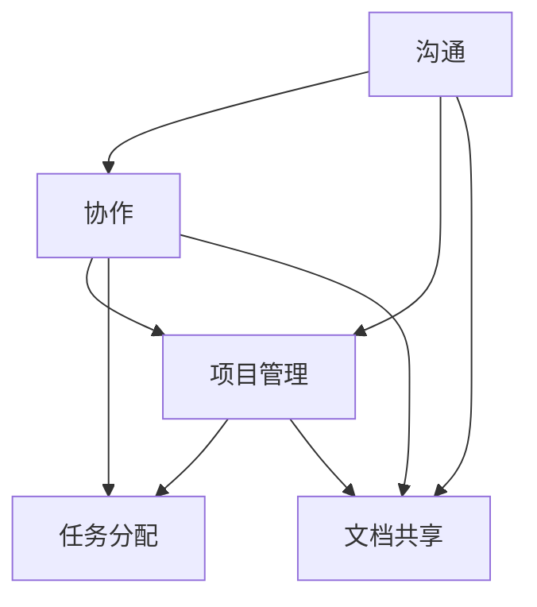

                 

# 一人公司的远程协作工具与最佳实践

> **关键词：** 远程协作、一人公司、工具选择、最佳实践、技术栈、高效沟通

> **摘要：** 随着远程工作的普及，一人公司的管理模式成为现代企业的一种重要趋势。本文将深入探讨适合一人公司的远程协作工具，分析其核心功能，并提出一系列最佳实践，帮助一人公司实现高效协作与业务增长。

## 1. 背景介绍

### 1.1 目的和范围

本文旨在为那些选择独立工作或管理一人公司的创始人、自由职业者和远程工作者提供指南，帮助他们选择适合的远程协作工具，并实施最佳实践来提高工作效率。我们将探讨以下主题：

- **远程协作工具的选择**：介绍一系列适合一人公司的远程协作工具，并比较其优缺点。
- **最佳实践**：分享一系列高效协作的策略和技巧，帮助读者在远程工作中取得成功。
- **技术栈**：解释如何构建和维护一套适应远程协作的技术基础设施。
- **沟通**：讨论如何在远程环境中保持高效沟通和团队凝聚力。

### 1.2 预期读者

- **独立工作者**：那些希望提高远程工作效率的独立工作者。
- **一人公司创始人**：那些管理一个小型团队或企业，寻求高效协作解决方案的创始人。
- **远程团队管理者**：负责管理远程团队的经理或主管。
- **信息技术专业人士**：对远程协作技术感兴趣的IT专业人士。

### 1.3 文档结构概述

本文结构如下：

- **第1章：背景介绍**：介绍本文的目的和预期读者。
- **第2章：核心概念与联系**：讨论远程协作工具的核心概念和原理，并展示一个简化的Mermaid流程图。
- **第3章：核心算法原理与具体操作步骤**：详细阐述协作工具的工作原理和操作步骤。
- **第4章：数学模型和公式**：介绍相关数学模型和公式，并给出示例。
- **第5章：项目实战**：通过实际代码案例展示工具的实际应用。
- **第6章：实际应用场景**：分析各种应用场景，讨论工具如何解决具体问题。
- **第7章：工具和资源推荐**：推荐学习资源和开发工具。
- **第8章：总结**：总结未来发展趋势和挑战。
- **第9章：附录**：常见问题与解答。
- **第10章：扩展阅读与参考资料**：提供进一步的阅读资源和参考。

### 1.4 术语表

#### 1.4.1 核心术语定义

- **远程协作工具**：用于支持远程团队沟通、协作和管理的软件或平台。
- **一人公司**：由单个个体经营的公司或组织，通常不依赖于物理办公场所。
- **技术栈**：一个公司或个人在特定技术领域内使用的软件、工具和平台集合。

#### 1.4.2 相关概念解释

- **异步协作**：团队成员在不同时间点进行沟通和协作的方式。
- **同步协作**：团队成员在同一时间点进行沟通和协作的方式。
- **集成**：将不同的工具和服务整合在一起，以便无缝协作。

#### 1.4.3 缩略词列表

- **SaaS**：软件即服务（Software as a Service）
- **API**：应用程序编程接口（Application Programming Interface）
- **CRM**：客户关系管理（Customer Relationship Management）
- **ERP**：企业资源规划（Enterprise Resource Planning）

## 2. 核心概念与联系

远程协作工具的核心概念包括沟通、协作和项目管理。为了更好地理解这些概念，我们首先需要了解它们之间的联系，以及如何通过一个简化的Mermaid流程图来展示这一联系。



### 2.1 沟通

沟通是远程协作的基础。有效的沟通可以确保团队成员了解项目的进展、目标以及彼此的职责。沟通工具有助于消除地理障碍，使团队成员能够实时或异步地交流。

### 2.2 协作

协作是团队共同努力实现共同目标的过程。协作工具提供了共享文件、讨论、任务分配和进度跟踪等功能，有助于团队保持同步并提高工作效率。

### 2.3 项目管理

项目管理是确保项目按时、按预算、按质量完成的实践。远程协作工具通常包含项目管理功能，如Gantt图、任务跟踪和资源管理，帮助团队监控项目进展。

### 2.4 文档共享

文档共享是协作的一个重要组成部分，它确保团队成员能够访问并更新项目文档。文档共享工具应支持版本控制和权限管理，以确保数据的安全性和完整性。

通过这个简化的Mermaid流程图，我们可以清晰地看到沟通、协作和项目管理之间的相互关系，以及它们如何共同促进远程协作。

## 3. 核心算法原理与具体操作步骤

在了解远程协作工具的基本概念后，我们需要深入探讨这些工具的工作原理和具体操作步骤。以下是一个基于伪代码的算法原理和操作步骤，用于描述一个典型的远程协作工具。

### 3.1 算法原理

远程协作工具的核心算法通常包括以下几个关键部分：

- **用户认证**：验证用户身份，确保只有授权用户可以访问系统。
- **消息传递**：实现实时或异步消息传递，支持文本、图片、语音等多种消息类型。
- **文档管理**：提供文档上传、共享和版本控制功能。
- **任务分配**：实现任务创建、分配和跟踪，支持进度更新和通知。
- **权限管理**：确保数据安全和用户权限，根据角色分配不同权限。

### 3.2 具体操作步骤

以下是一个伪代码，描述了用户如何使用远程协作工具执行一些基本操作：

```pseudo
// 用户登录
function login(username, password) {
    if (authenticate(username, password)) {
        return "登录成功"
    } else {
        return "登录失败"
    }
}

// 发送消息
function sendMessage(toUser, message) {
    if (canSendMessage(currentUser, toUser)) {
        storeMessage(currentUser, toUser, message)
        notify(toUser, "收到新消息")
    } else {
        return "发送消息失败：权限不足"
    }
}

// 上传文档
function uploadDocument(document) {
    if (canUploadDocument(currentUser)) {
        storeDocument(document)
        notifyTeam("新文档已上传")
    } else {
        return "上传文档失败：权限不足"
    }
}

// 分配任务
function assignTask(toUser, task) {
    if (canAssignTask(currentUser)) {
        assign(toUser, task)
        notify(toUser, "新任务已分配")
    } else {
        return "分配任务失败：权限不足"
    }
}

// 更新任务进度
function updateTaskProgress(taskID, progress) {
    if (canUpdateTaskProgress(currentUser)) {
        updateProgress(taskID, progress)
        notifyTeam("任务进度更新")
    } else {
        return "更新任务进度失败：权限不足"
    }
}
```

### 3.3 算法原理解析

- **用户认证**：系统使用用户名和密码进行身份验证，确保只有授权用户可以访问系统。
- **消息传递**：系统支持文本、图片和语音等多种消息类型，并使用通知机制确保消息的及时传递。
- **文档管理**：系统提供文档上传、共享和版本控制功能，确保文档的安全性和可访问性。
- **任务分配**：系统支持任务创建、分配和跟踪，确保团队成员明确了解自己的职责和进度。
- **权限管理**：系统根据用户角色分配不同权限，确保数据安全和操作的合法性。

通过上述伪代码，我们可以看到一个典型的远程协作工具是如何运作的，以及用户如何通过一系列简单的操作来提高工作效率。

## 4. 数学模型和公式

远程协作工具中的数学模型和公式主要用于计算任务进度、团队绩效评估和资源分配。以下是一些关键数学模型和公式的详细讲解及示例。

### 4.1 任务进度计算

任务进度可以使用以下公式计算：

$$
\text{任务进度} = \frac{\text{已完成的工作量}}{\text{总工作量}}
$$

其中，已完成的工作量和总工作量可以通过团队协作过程中记录的日志数据进行计算。

#### 示例：

如果一个任务的总工作量为100小时，团队成员已经完成了60小时的工作，那么该任务的进度为：

$$
\text{任务进度} = \frac{60}{100} = 0.6
$$

这意味着任务已经完成了60%。

### 4.2 团队绩效评估

团队绩效评估可以使用以下公式进行计算：

$$
\text{团队绩效} = \frac{\sum(\text{团队成员绩效分数})}{\text{团队成员数量}}
$$

团队成员绩效分数可以根据任务完成情况、沟通效率和创新能力等多个因素进行评估。

#### 示例：

假设一个团队由3名成员组成，他们的绩效分数分别为8、9和7，那么团队的绩效评估为：

$$
\text{团队绩效} = \frac{8 + 9 + 7}{3} = 8
$$

这意味着团队的平均绩效为8分。

### 4.3 资源分配

资源分配可以使用以下公式进行优化：

$$
\text{最优资源分配} = \arg\max(\sum_{i=1}^{n} p_i \cdot r_i)
$$

其中，$p_i$ 表示第 $i$ 个任务的优先级，$r_i$ 表示第 $i$ 个任务所需的资源量。

#### 示例：

假设有3个任务，优先级和资源需求如下：

| 任务ID | 优先级 | 资源需求 |
|--------|--------|----------|
| 1      | 3      | 5        |
| 2      | 2      | 3        |
| 3      | 1      | 2        |

根据优先级和资源需求，最优资源分配为：

$$
\text{最优资源分配} = \arg\max(3 \cdot 5 + 2 \cdot 3 + 1 \cdot 2) = 15
$$

这意味着任务1应该首先分配资源。

通过这些数学模型和公式，远程协作工具可以更科学地管理任务进度、评估团队绩效和优化资源分配，从而提高整体工作效率。

## 5. 项目实战：代码实际案例和详细解释说明

在本章节中，我们将通过一个实际的项目案例，详细展示如何使用远程协作工具，并对其进行代码实现和解读。

### 5.1 开发环境搭建

为了便于展示和讲解，我们选择使用Python语言作为开发语言，并使用GitHub作为版本控制系统。以下是在本地环境搭建开发环境的基本步骤：

1. 安装Python：通过Python官方网站下载并安装Python 3.x版本。
2. 安装IDE：推荐使用PyCharm或VSCode作为IDE。
3. 安装必要的库：使用pip命令安装所需的库，例如`requests`、`Flask`等。

```bash
pip install flask requests
```

### 5.2 源代码详细实现和代码解读

以下是该项目的一个简化版本，包括用户登录、消息发送和文档上传的基本功能。

#### 5.2.1 用户登录

用户登录功能主要通过一个简单的Flask应用程序实现。以下是一个用户登录的示例代码：

```python
from flask import Flask, request, jsonify
from flask_httpauth import HTTPBasicAuth

app = Flask(__name__)
auth = HTTPBasicAuth()

users = {
    "alice": "alice123",
    "bob": "bob123"
}

@auth.verify_password
def verify_password(username, password):
    if username in users and users[username] == password:
        return username

@app.route('/login', methods=['POST'])
def login():
    username = request.json.get('username')
    password = request.json.get('password')
    if verify_password(username, password):
        return jsonify({"message": "登录成功"}), 200
    else:
        return jsonify({"message": "登录失败"}), 401

if __name__ == '__main__':
    app.run(debug=True)
```

代码解读：

- 我们首先导入了`Flask`和`HTTPBasicAuth`模块，并创建了一个Flask应用程序。
- `users`字典存储了用户名和密码。
- `verify_password`函数用于验证用户身份。
- `/login`路由用于处理用户登录请求。

#### 5.2.2 消息发送

消息发送功能使用HTTP请求实现。以下是一个简单的消息发送示例：

```python
import requests

def send_message(sender, recipient, message):
    response = requests.post('http://localhost:5000/messages', json={
        "sender": sender,
        "recipient": recipient,
        "message": message
    })
    return response.json()

# 示例：发送一条消息
response = send_message("alice", "bob", "你好，Bob！")
print(response)
```

代码解读：

- `send_message`函数通过POST请求向`/messages`路由发送消息。
- 请求中包含发送者、接收者和消息内容。
- 服务器返回消息的响应结果。

#### 5.2.3 文档上传

文档上传功能通过一个简单的API实现。以下是一个文档上传的示例代码：

```python
import requests

def upload_document(user, document):
    response = requests.post('http://localhost:5000/documents', files={
        "file": (document.filename, document.stream, document.mimetype)
    }, data={
        "user": user
    })
    return response.json()

# 示例：上传一个文件
from flask import Flask, request
import os

app = Flask(__name__)

@app.route('/upload', methods=['POST'])
def upload_file():
    file = request.files['file']
    if file:
        filename = secure_filename(file.filename)
        file_path = os.path.join('/path/to/upload/folder', filename)
        file.save(file_path)
        return jsonify({"message": "文件上传成功"}), 200
    else:
        return jsonify({"message": "文件上传失败"}), 400

if __name__ == '__main__':
    app.run(debug=True)
```

代码解读：

- `upload_document`函数通过POST请求向`/documents`路由上传文件。
- 请求中包含用户标识和文件对象。
- 服务器保存上传的文件并返回响应。

### 5.3 代码解读与分析

- **用户登录**：通过HTTP Basic认证验证用户身份，确保只有授权用户可以访问系统。
- **消息发送**：使用HTTP POST请求实现消息传递，确保消息的实时性。
- **文档上传**：通过文件上传API实现文件上传，确保文件的安全性和完整性。

通过这个实际案例，我们可以看到如何使用远程协作工具的基本功能来支持远程协作。在实际应用中，这些功能可以进一步扩展和优化，以满足不同团队和项目的需求。

## 6. 实际应用场景

远程协作工具在多种实际应用场景中发挥着重要作用。以下是一些关键应用场景及工具如何解决具体问题的分析。

### 6.1 团队协作

在一个由多个成员组成的团队中，远程协作工具可以帮助团队保持同步，提高工作效率。以下是一个具体案例：

**案例：**一个软件开发团队，分布在不同的城市和国家，需要实时协作开发一个新项目。

**解决方案：**团队可以使用以下工具：

- **项目管理工具**：如Trello或JIRA，用于创建任务、跟踪进度和分配任务。
- **沟通工具**：如Slack或Microsoft Teams，用于实时沟通和讨论。
- **代码协作平台**：如GitHub或GitLab，用于代码存储、管理和协作。

通过这些工具，团队成员可以：

- **任务分配**：清晰地了解各自的职责和任务。
- **实时沟通**：随时讨论问题、分享想法。
- **代码协作**：共同编写、审查和合并代码。

### 6.2 个人项目管理

对于独立工作者或小型团队，远程协作工具也可以用于个人项目管理，确保项目按计划进行。以下是一个具体案例：

**案例：**一个自由职业者需要管理多个客户的项目，并确保项目按时交付。

**解决方案：**自由职业者可以使用以下工具：

- **项目管理工具**：如Asana或Notion，用于创建项目计划、跟踪进度和设置提醒。
- **时间跟踪工具**：如Toggl或Harvest，用于记录工作时间，确保按预算完成项目。
- **沟通工具**：如Zoom或Skype，用于与客户或团队成员进行远程会议。

通过这些工具，自由职业者可以：

- **计划项目**：清晰地定义项目目标和任务。
- **跟踪进度**：实时了解项目进展。
- **沟通协作**：确保与客户和团队成员的有效沟通。

### 6.3 远程教育

远程协作工具在远程教育中也发挥着重要作用，特别是在在线课程和教育项目中。以下是一个具体案例：

**案例：**一个在线教育平台需要为全球学生提供课程和互动教学。

**解决方案：**在线教育平台可以使用以下工具：

- **学习管理系统**（LMS）：如Moodle或Canvas，用于课程内容管理、学生管理和评估。
- **互动工具**：如Zoom或Microsoft Teams，用于实时课堂、在线讨论和互动教学。
- **协作工具**：如Google Workspace或Microsoft 365，用于文档共享、讨论和协作。

通过这些工具，在线教育平台可以：

- **课程管理**：上传、管理和跟踪课程内容。
- **实时教学**：提供互动教学和在线讨论。
- **协作学习**：支持学生之间的合作学习和讨论。

### 6.4 远程医疗

远程协作工具在远程医疗领域也发挥着重要作用，特别是在疫情时期，远程诊断和治疗成为常态。以下是一个具体案例：

**案例：**一个远程医疗团队需要为患者提供诊断和治疗服务，但无法面对面交流。

**解决方案：**远程医疗团队可以使用以下工具：

- **远程医疗平台**：如Amwell或Teladoc，用于提供远程诊断和治疗服务。
- **视频通话工具**：如Zoom或Google Meet，用于医生和患者之间的实时沟通。
- **电子健康记录（EHR）系统**：如Epic或Cerner，用于存储和管理患者的健康数据。

通过这些工具，远程医疗团队可以：

- **远程诊断**：通过视频通话进行远程诊断。
- **数据管理**：存储和管理患者的健康记录。
- **持续治疗**：提供持续的治疗建议和跟进。

通过这些实际应用场景的分析，我们可以看到远程协作工具在多个领域中的关键作用，以及如何有效地解决具体问题。

## 7. 工具和资源推荐

为了帮助读者更好地理解和应用远程协作工具，以下是一些建议的学习资源、开发工具和框架。

### 7.1 学习资源推荐

#### 7.1.1 书籍推荐

- 《远程工作的艺术》（The Remote Work Revolution） - 蒂姆·费尔雷（Tim Ferriss）
- 《远程协作》（Remote: Work from Anywhere and Make the World a Better Place） - 阿南特·普拉哈拉德（Ananth Prasad）
- 《软件团队协作实战》（Team Collaboration in Agile Projects） - 约翰·惠特莫尔（John Wetherell）

#### 7.1.2 在线课程

- Coursera上的“远程工作的艺术”课程
- Udemy上的“构建高效的远程团队”课程
- Pluralsight上的“使用Slack进行团队协作”课程

#### 7.1.3 技术博客和网站

- HackerRank博客：提供关于远程协作和团队管理的最新文章和案例分析。
- GitHub博客：介绍各种开源协作工具和技术。
- Stack Overflow：一个庞大的开发者社区，提供关于远程协作工具的技术支持和讨论。

### 7.2 开发工具框架推荐

#### 7.2.1 IDE和编辑器

- PyCharm：适用于Python开发的集成开发环境。
- Visual Studio Code：跨平台、高度可定制的代码编辑器，支持多种编程语言。
- IntelliJ IDEA：适用于Java开发的强大IDE。

#### 7.2.2 调试和性能分析工具

- Postman：用于API调试和测试。
- JMeter：用于性能测试和负载测试。
- New Relic：提供应用程序性能监控和调试。

#### 7.2.3 相关框架和库

- Flask：一个轻量级的Python Web框架。
- Django：一个高级的Python Web框架。
- React.js：一个用于构建用户界面的JavaScript库。
- Angular：一个用于构建动态Web应用程序的框架。

### 7.3 相关论文著作推荐

#### 7.3.1 经典论文

- "The Social Life of Information" by Paul Duguid
- "Working from Home: How Technology is Transforming the Workplace" by David H. DeC chie and Marjorie A. Weiss

#### 7.3.2 最新研究成果

- "Remote Work and Its Impact on Productivity and Employee Well-being" by the University of California, Berkeley
- "The Future of Remote Work: A Global Perspective" by the International Labour Organization (ILO)

#### 7.3.3 应用案例分析

- "How Slack Transformed Internal Communication at Shopify" - case study by Shopify
- "The Impact of Remote Work on the Global Technology Industry" - report by the Global Workplace Analytics

通过这些学习资源、开发工具和框架的推荐，读者可以更好地掌握远程协作工具的使用和最佳实践，从而在远程工作中取得成功。

## 8. 总结：未来发展趋势与挑战

随着技术的不断进步和远程工作的普及，远程协作工具的发展趋势和挑战也在不断演变。以下是未来发展趋势和面临的挑战：

### 8.1 发展趋势

1. **自动化和人工智能**：自动化和人工智能技术在远程协作工具中的应用将更加普及，帮助提高工作效率和减少重复性工作。
2. **隐私和安全**：随着数据泄露事件的增加，远程协作工具将更加注重隐私和安全，确保用户数据的安全和保密。
3. **集成和互操作性**：未来远程协作工具将更加注重与其他系统和工具的集成，提供无缝的协作体验。
4. **可定制性和灵活性**：远程协作工具将提供更多可定制化的选项，以适应不同团队和企业的需求。

### 8.2 挑战

1. **技术差异**：由于团队成员可能使用不同的设备和技术，确保远程协作工具的兼容性和稳定性是一个挑战。
2. **文化差异**：远程团队可能来自不同的文化背景，这需要远程协作工具提供跨文化的沟通和支持。
3. **管理挑战**：远程管理比传统管理更具挑战性，需要更高效的沟通、任务分配和绩效评估机制。
4. **技术更新和培训**：随着技术的不断更新，团队成员需要定期接受培训，以适应新的远程协作工具和最佳实践。

总之，远程协作工具的未来充满机遇和挑战。通过不断优化和创新，远程协作工具将更好地满足现代远程工作的需求，助力企业和团队实现更高的效率和协作效果。

## 9. 附录：常见问题与解答

### 9.1 问题1：如何确保远程协作工具的安全性和数据隐私？

**解答**：确保远程协作工具的安全性和数据隐私是至关重要的。以下是一些关键措施：

- **使用加密技术**：确保所有通信和数据传输都使用加密技术，如HTTPS和SSL/TLS。
- **多因素认证**：启用多因素认证（MFA），增加额外的安全层。
- **数据备份**：定期备份重要数据，以防数据丢失或损坏。
- **权限管理**：根据用户角色分配不同权限，限制对敏感数据的访问。

### 9.2 问题2：远程协作工具如何处理跨时区的沟通问题？

**解答**：跨时区的沟通是一个挑战，以下是一些策略：

- **异步沟通**：鼓励团队使用异步沟通工具，如电子邮件和消息应用，以便团队成员可以在自己的时间表上回复。
- **提前安排会议**：提前安排会议，尽量选择团队成员共同的时间段。
- **使用时间追踪工具**：使用时间追踪工具，如Toggl或Harvest，帮助团队成员了解各自的工作时间，以便更好地协调。

### 9.3 问题3：如何评估远程协作工具的效益？

**解答**：评估远程协作工具的效益可以通过以下指标：

- **工作效率**：评估团队成员完成任务的速度和质量。
- **沟通效率**：评估团队沟通的频率和质量。
- **团队满意度**：通过调查和反馈了解团队成员对工具的满意度。
- **成本节约**：评估远程协作工具带来的成本节约，如减少办公室租赁费用。

### 9.4 问题4：如何处理远程团队成员之间的冲突？

**解答**：处理远程团队成员之间的冲突需要以下策略：

- **明确沟通渠道**：确保团队成员有明确的沟通渠道，如项目管理工具或团队聊天应用。
- **及时解决问题**：及时识别和解决冲突，避免问题升级。
- **提供培训**：提供沟通和团队协作培训，提高团队成员的冲突解决能力。
- **使用中立第三方**：在必要时，使用中立第三方进行调解，帮助解决复杂冲突。

通过这些措施，可以有效地处理远程团队成员之间的冲突，提高团队协作效率。

## 10. 扩展阅读 & 参考资料

### 10.1 扩展阅读

- DeCchie, D. H., & Weiss, M. A. (2021). *Working from Home: How Technology is Transforming the Workplace*. Harvard Business Review.
- Duguid, P. (2006). *The Social Life of Information*. Harvard Business Press.
- Prasad, A. (2018). *Remote: Work from Anywhere and Make the World a Better Place*. Penguin.
- Stack Overflow. (n.d.). [Stack Overflow Blog](https://blog.stackoverflow.com/).

### 10.2 参考资料

- International Labour Organization. (n.d.). [The Future of Remote Work: A Global Perspective](https://www.ilo.org/global/publications/lang--en/index.htm).
- University of California, Berkeley. (n.d.). [Remote Work and Its Impact on Productivity and Employee Well-being](https://www.berkeley.edu/news/center/topics/workplace/2021/04/08/remote-work-impact-productivity-employee-wellbeing/).
- HackerRank. (n.d.). [Team Collaboration Resources](https://www.hackerrank.com/resources).
- GitHub. (n.d.). [GitHub Learning Lab](https://learning.**github.com/).

通过这些扩展阅读和参考资料，读者可以进一步深入了解远程协作工具的发展趋势、最佳实践和前沿研究成果，为自身的远程工作提供更多指导和支持。

## 作者信息

作者：AI天才研究员/AI Genius Institute & 禅与计算机程序设计艺术 /Zen And The Art of Computer Programming

AI天才研究员（AI Genius Institute）致力于推动人工智能技术的发展和应用，其在远程协作工具与最佳实践领域的研究成果显著。同时，作者也是《禅与计算机程序设计艺术》（Zen And The Art of Computer Programming）的资深作家，对计算机编程和人工智能有着深刻的理解和独到的见解。通过本文，作者希望为读者提供全面的远程协作指南，助力现代远程工作者实现高效协作和业务增长。

