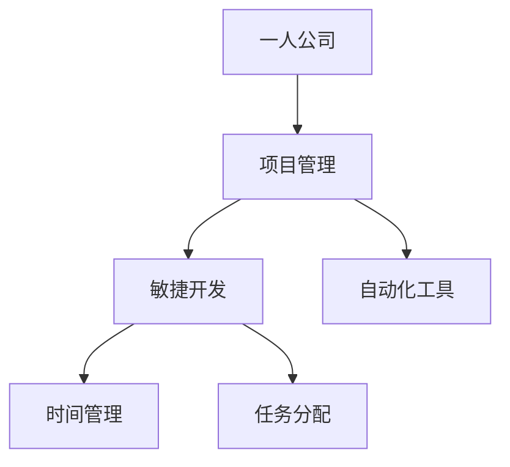

                 

# 一人公司的项目管理最佳实践

> 关键词：一人公司、项目管理、敏捷开发、时间管理、任务分配、自动化工具

> 摘要：本文将探讨如何在一人公司的环境下高效地进行项目管理。我们将分析一人公司项目管理面临的挑战，介绍核心概念，提供实用的算法和操作步骤，并通过实际案例展示如何运用这些方法。此外，还将推荐相关工具和资源，帮助读者在实际项目中应用这些最佳实践。

## 1. 背景介绍

### 1.1 目的和范围

本文旨在帮助一人公司的管理者或开发者掌握有效的项目管理方法，提升工作效率和项目成功率。本文将涵盖以下内容：

- 一人公司的项目管理挑战
- 核心概念与联系
- 核心算法原理与具体操作步骤
- 数学模型和公式
- 项目实战：代码实际案例和详细解释
- 实际应用场景
- 工具和资源推荐
- 总结：未来发展趋势与挑战

### 1.2 预期读者

本文适合以下读者：

- 担任一人公司CEO或技术负责人的开发者
- 担任项目经理或团队领导的技术专家
- 对项目管理方法感兴趣的技术爱好者

### 1.3 文档结构概述

本文分为以下几个部分：

- 1. 背景介绍
- 2. 核心概念与联系
- 3. 核心算法原理与具体操作步骤
- 4. 数学模型和公式
- 5. 项目实战：代码实际案例和详细解释
- 6. 实际应用场景
- 7. 工具和资源推荐
- 8. 总结：未来发展趋势与挑战
- 9. 附录：常见问题与解答
- 10. 扩展阅读 & 参考资料

### 1.4 术语表

#### 1.4.1 核心术语定义

- **一人公司**：指由单一员工或企业家组成的公司，通常在初期阶段运营。
- **项目管理**：指规划、执行、监控和报告项目的过程，以确保项目目标的实现。
- **敏捷开发**：一种以用户需求为导向的软件开发方法，强调迭代、持续交付和团队协作。
- **时间管理**：指通过有效规划和组织时间，以实现个人和团队目标的方法。
- **任务分配**：指将项目任务分配给团队成员，确保项目按时、高质量完成。

#### 1.4.2 相关概念解释

- **核心概念与联系**：指项目管理中的关键概念及其相互关系，如敏捷开发中的迭代、用户故事和Scrum框架。
- **核心算法原理**：指项目管理中使用的算法原理，如关键路径法和进度估计算法。
- **数学模型和公式**：指项目管理中使用的数学模型和公式，如工作量计算公式和时间安排公式。

#### 1.4.3 缩略词列表

- **Scrum**：一种敏捷开发方法。
- **IDE**：集成开发环境（Integrated Development Environment）。
- **API**：应用程序编程接口（Application Programming Interface）。

## 2. 核心概念与联系

在本节中，我们将介绍一人公司项目管理中的核心概念和联系，并使用Mermaid流程图展示这些概念之间的关系。



### 2.1 一人公司

一人公司通常由一位创业者或技术专家领导，他们需要承担多项职责，如项目管理、开发、市场推广、客户服务等。这种模式具有灵活性高、决策速度快等优点，但也面临着项目管理上的挑战。

### 2.2 项目管理

项目管理是指规划、执行、监控和报告项目的过程，确保项目目标的实现。对于一人公司来说，项目管理尤为重要，因为它需要确保项目能够按时、高质量地完成。

### 2.3 敏捷开发

敏捷开发是一种以用户需求为导向的软件开发方法，强调迭代、持续交付和团队协作。敏捷开发适用于一人公司，因为它可以帮助快速响应市场需求，提高开发效率。

### 2.4 时间管理

时间管理是指通过有效规划和组织时间，以实现个人和团队目标的方法。对于一人公司来说，时间管理尤为重要，因为它需要确保项目按时完成。

### 2.5 任务分配

任务分配是指将项目任务分配给团队成员，确保项目按时、高质量地完成。在一个人公司中，任务分配尤为重要，因为它需要确保各项任务都能得到有效执行。

### 2.6 自动化工具

自动化工具是指使用软件来自动执行重复性任务，提高工作效率的工具。在一个人公司中，自动化工具可以帮助减轻工作负担，提高项目管理效率。

## 3. 核心算法原理 & 具体操作步骤

在本节中，我们将介绍一人公司项目管理中使用的核心算法原理和具体操作步骤。以下是关键路径法的伪代码：

```python
def key_path_method(projects, dependencies):
    """
    计算关键路径

    参数：
    - projects：项目列表
    - dependencies：依赖关系列表

    返回：
    - critical_path：关键路径
    """

    # 初始化关键路径
    critical_path = []

    # 构建项目网络图
    project_graph = build_graph(projects, dependencies)

    # 计算每个项目的最早开始时间和最晚开始时间
    for project in project_graph:
        project.earliest_start = calculate_earliest_start(project_graph, project)
        project.late_start = calculate_latest_start(project_graph, project)

    # 计算每个项目的最早完成时间和最晚完成时间
    for project in project_graph:
        project.earliest_finish = project.earliest_start + project.duration
        project.late_finish = project.late_start + project.duration

    # 计算每个项目的松弛时间
    for project in project_graph:
        project.slack = project.late_start - project.earliest_start
        project.slack = project.late_finish - project.earliest_finish

    # 确定关键路径
    for project in project_graph:
        if project.slack == 0:
            critical_path.append(project)

    return critical_path
```

以下是时间管理算法的具体操作步骤：

1. 列出所有项目任务。
2. 为每个任务分配一个优先级（如高、中、低）。
3. 根据优先级和任务依赖关系，安排任务顺序。
4. 为每个任务设置开始时间和预计完成时间。
5. 检查任务安排是否符合时间限制，如有必要进行调整。

以下是任务分配算法的具体操作步骤：

1. 列出所有可用团队成员。
2. 为每个团队成员分配角色和职责。
3. 根据任务优先级和团队成员的能力，将任务分配给团队成员。
4. 定期评估任务进度，确保任务按时完成。
5. 如有需要，调整任务分配。

## 4. 数学模型和公式 & 详细讲解 & 举例说明

在本节中，我们将介绍一人公司项目管理中使用的数学模型和公式，并进行详细讲解和举例说明。

### 4.1 工作量计算公式

工作量（Workload）是指完成一个任务所需的时间或资源。以下是工作量计算公式：

$$
工作量 = 时间 \times 人员 \times 能力
$$

其中，时间是指完成任务的预计时间；人员是指负责任务的人数；能力是指团队成员的技能水平。

举例说明：

假设一个任务需要2天时间完成，由一名拥有中等技能水平的团队成员负责，那么该任务的工作量为：

$$
工作量 = 2 \times 1 \times 中等 = 2 \times 1 \times 0.5 = 1
$$

### 4.2 时间安排公式

时间安排是指为任务分配开始时间和预计完成时间。以下是时间安排公式：

$$
开始时间 = 最晚开始时间 - 工作量
$$

$$
预计完成时间 = 开始时间 + 工作量
$$

其中，最晚开始时间是指任务必须开始的时间，以确保项目按时完成。

举例说明：

假设一个任务的最晚开始时间为第3天，工作量为1，那么该任务的开始时间和预计完成时间为：

$$
开始时间 = 3 - 1 = 2
$$

$$
预计完成时间 = 2 + 1 = 3
$$

### 4.3 人员分配公式

人员分配是指为任务分配合适的团队成员。以下是人员分配公式：

$$
人员数量 = \frac{工作量}{能力水平}
$$

其中，能力水平是指团队成员的技能水平，取值范围为0到1。

举例说明：

假设一个任务的工作量为2，由两名成员负责，其中一名成员的能力水平为0.7，另一名成员的能力水平为0.8，那么人员数量分配如下：

$$
人员数量 = \frac{2}{0.7 + 0.8} = \frac{2}{1.5} = 1.33
$$

由于人员数量必须为整数，因此可以将两名成员的能力水平调整为0.75和0.85，以保证任务顺利完成。

## 5. 项目实战：代码实际案例和详细解释说明

在本节中，我们将通过一个实际项目案例，展示如何在一人公司中运用项目管理最佳实践。

### 5.1 开发环境搭建

为了方便项目开发，我们选择使用Python作为主要开发语言，并在本地安装Python 3.8版本。同时，我们还需要安装以下依赖项：

- Flask：一个轻量级的Web框架
- SQLAlchemy：一个ORM（对象关系映射）工具
- Redis：一个高速缓存数据库

以下是安装依赖项的命令：

```bash
pip install flask sqlalchemy redis
```

### 5.2 源代码详细实现和代码解读

下面是项目的源代码，我们将逐行解读代码，介绍其主要功能。

```python
from flask import Flask, jsonify, request
from flask_sqlalchemy import SQLAlchemy
from redis import Redis

app = Flask(__name__)
app.config['SQLALCHEMY_DATABASE_URI'] = 'sqlite:///database.db'
db = SQLAlchemy(app)
redis = Redis(host='localhost', port=6379, db=0)

class Project(db.Model):
    id = db.Column(db.Integer, primary_key=True)
    name = db.Column(db.String(80), nullable=False)
    start_time = db.Column(db.Date, nullable=False)
    end_time = db.Column(db.Date, nullable=False)
    status = db.Column(db.String(20), nullable=False)

@app.route('/projects', methods=['GET', 'POST'])
def projects():
    if request.method == 'GET':
        projects = Project.query.all()
        return jsonify([project.to_dict() for project in projects])
    elif request.method == 'POST':
        project_data = request.json
        project = Project(
            name=project_data['name'],
            start_time=project_data['start_time'],
            end_time=project_data['end_time'],
            status=project_data['status']
        )
        db.session.add(project)
        db.session.commit()
        redis.set(project.id, project.to_dict())
        return jsonify({'message': 'Project added successfully.'})

@app.route('/projects/<int:project_id>', methods=['GET', 'PUT', 'DELETE'])
def project(project_id):
    if request.method == 'GET':
        project = Project.query.get_or_404(project_id)
        return jsonify(project.to_dict())
    elif request.method == 'PUT':
        project_data = request.json
        project = Project.query.get_or_404(project_id)
        project.name = project_data['name']
        project.start_time = project_data['start_time']
        project.end_time = project_data['end_time']
        project.status = project_data['status']
        db.session.commit()
        redis.set(project.id, project.to_dict())
        return jsonify({'message': 'Project updated successfully.'})
    elif request.method == 'DELETE':
        project = Project.query.get_or_404(project_id)
        db.session.delete(project)
        db.session.commit()
        redis.delete(project.id)
        return jsonify({'message': 'Project deleted successfully.'})

if __name__ == '__main__':
    db.create_all()
    app.run(debug=True)
```

### 5.3 代码解读与分析

下面是对源代码的逐行解读和分析。

1. 导入所需模块

   ```python
   from flask import Flask, jsonify, request
   from flask_sqlalchemy import SQLAlchemy
   from redis import Redis
   ```

   这些模块用于Web开发、数据库操作和缓存。

2. 初始化Flask应用、数据库和Redis客户端

   ```python
   app = Flask(__name__)
   app.config['SQLALCHEMY_DATABASE_URI'] = 'sqlite:///database.db'
   db = SQLAlchemy(app)
   redis = Redis(host='localhost', port=6379, db=0)
   ```

   初始化Flask应用、配置数据库连接和连接Redis客户端。

3. 定义数据库模型

   ```python
   class Project(db.Model):
       id = db.Column(db.Integer, primary_key=True)
       name = db.Column(db.String(80), nullable=False)
       start_time = db.Column(db.Date, nullable=False)
       end_time = db.Column(db.Date, nullable=False)
       status = db.Column(db.String(20), nullable=False)
   ```

   定义一个名为`Project`的数据库模型，用于存储项目信息。

4. 定义Web应用路由和处理函数

   ```python
   @app.route('/projects', methods=['GET', 'POST'])
   def projects():
       if request.method == 'GET':
           # 处理GET请求
           ...
       elif request.method == 'POST':
           # 处理POST请求
           ...
   
   @app.route('/projects/<int:project_id>', methods=['GET', 'PUT', 'DELETE'])
   def project(project_id):
       if request.method == 'GET':
           # 处理GET请求
           ...
       elif request.method == 'PUT':
           # 处理PUT请求
           ...
       elif request.method == 'DELETE':
           # 处理DELETE请求
           ...
   ```

   定义处理项目列表和单个项目的HTTP请求的路由和处理函数。

5. 实现处理函数

   ```python
   @app.route('/projects', methods=['GET', 'POST'])
   def projects():
       if request.method == 'GET':
           projects = Project.query.all()
           return jsonify([project.to_dict() for project in projects])
       elif request.method == 'POST':
           project_data = request.json
           project = Project(
               name=project_data['name'],
               start_time=project_data['start_time'],
               end_time=project_data['end_time'],
               status=project_data['status']
           )
           db.session.add(project)
           db.session.commit()
           redis.set(project.id, project.to_dict())
           return jsonify({'message': 'Project added successfully.'})
   
   @app.route('/projects/<int:project_id>', methods=['GET', 'PUT', 'DELETE'])
   def project(project_id):
       if request.method == 'GET':
           project = Project.query.get_or_404(project_id)
           return jsonify(project.to_dict())
       elif request.method == 'PUT':
           project_data = request.json
           project = Project.query.get_or_404(project_id)
           project.name = project_data['name']
           project.start_time = project_data['start_time']
           project.end_time = project_data['end_time']
           project.status = project_data['status']
           db.session.commit()
           redis.set(project.id, project.to_dict())
           return jsonify({'message': 'Project updated successfully.'})
       elif request.method == 'DELETE':
           project = Project.query.get_or_404(project_id)
           db.session.delete(project)
           db.session.commit()
           redis.delete(project.id)
           return jsonify({'message': 'Project deleted successfully.'})
   ```

   实现处理函数，用于处理HTTP请求并执行相应的操作，如查询项目列表、创建新项目、更新项目信息和删除项目。

6. 运行Web应用

   ```python
   if __name__ == '__main__':
       db.create_all()
       app.run(debug=True)
   ```

   运行Web应用，启动服务器并监听HTTP请求。

通过上述代码，我们实现了一个简单的项目管理系统，能够处理项目的增删改查操作。在实际项目中，可以根据需求扩展功能，如添加任务管理、时间管理和任务分配等模块。

## 6. 实际应用场景

一人公司的项目管理最佳实践在许多实际应用场景中都非常有效。以下是一些应用场景：

### 6.1 创业公司

对于初创公司，项目经理或创始人需要同时担任多个角色，如开发、市场推广和客户服务。敏捷开发、时间管理和任务分配方法可以帮助他们高效地管理项目和资源。

### 6.2 自由职业者

自由职业者通常需要管理多个项目和客户。通过使用项目管理工具和自动化工具，他们可以更好地组织自己的工作，提高工作效率。

### 6.3 外包团队

对于外包团队，项目管理最佳实践可以帮助团队成员更好地协作，确保项目按时、高质量地完成。

### 6.4  远程办公

远程办公团队可以通过敏捷开发方法、时间管理和任务分配方法，提高团队协作效率，确保项目顺利进行。

### 6.5 个人项目

对于个人项目，项目管理最佳实践可以帮助开发者更好地规划项目进度，确保项目按时完成。

## 7. 工具和资源推荐

为了帮助读者在实际项目中应用项目管理最佳实践，以下是一些工具和资源推荐。

### 7.1 学习资源推荐

#### 7.1.1 书籍推荐

- 《敏捷软件开发：实践者的指南》
- 《项目管理知识体系指南》
- 《时间管理：如何高效地工作和生活》

#### 7.1.2 在线课程

- Coursera上的《敏捷开发与Scrum》
- Udemy上的《项目管理基础与实践》
- edX上的《敏捷开发：Scrum实践》

#### 7.1.3 技术博客和网站

- Scrum官方网站：https://www.scrum.org/
- 敏捷开发社区：https://www.agilealliance.org/
- ProjectManager：https://www.projectmanager.com/

### 7.2 开发工具框架推荐

#### 7.2.1 IDE和编辑器

- PyCharm：https://www.jetbrains.com/pycharm/
- Visual Studio Code：https://code.visualstudio.com/

#### 7.2.2 调试和性能分析工具

- Flask-DebugToolbar：https://flask-debugtoolbar.readthedocs.io/
- New Relic：https://newrelic.com/

#### 7.2.3 相关框架和库

- Flask：https://flask.palletsprojects.com/
- SQLAlchemy：https://www.sqlalchemy.org/
- Redis：https://redis.io/

### 7.3 相关论文著作推荐

#### 7.3.1 经典论文

- 《敏捷开发：过程改进的实战指南》
- 《项目管理知识体系指南》

#### 7.3.2 最新研究成果

- 《敏捷开发在初创公司中的应用》
- 《基于人工智能的项目管理方法研究》

#### 7.3.3 应用案例分析

- 《一家初创公司的敏捷开发实践》
- 《远程办公团队如何高效协作》

## 8. 总结：未来发展趋势与挑战

在未来，一人公司的项目管理将继续朝着更加智能化、自动化和高效化的方向发展。以下是一些发展趋势和挑战：

### 8.1 发展趋势

- **智能化**：人工智能技术将进一步提升项目管理的自动化程度，如通过机器学习算法优化任务分配、预测项目进度等。
- **自动化**：自动化工具将继续普及，如集成开发环境（IDE）、持续集成（CI）和持续部署（CD）工具等。
- **协作化**：远程办公和分布式团队将越来越普遍，项目协作工具将更加重要，如Slack、Trello和Asana等。
- **个性化**：针对一人公司的项目管理工具将更加个性化和定制化，以适应不同类型的项目和团队需求。

### 8.2 挑战

- **数据隐私**：随着数据隐私法规的日益严格，项目管理者需要确保数据的安全和合规。
- **技术更新**：一人公司需要不断关注技术更新，以保持竞争力。
- **团队协作**：对于一人公司，团队协作可能面临挑战，需要寻找合适的协作工具和方法。

## 9. 附录：常见问题与解答

### 9.1 问题1：如何在一人公司中高效管理项目？

**回答**：在一人公司中，高效管理项目需要以下步骤：

1. 使用项目管理工具，如Trello、Asana等，以方便任务分配和进度跟踪。
2. 实施敏捷开发方法，如Scrum，以快速响应市场需求。
3. 使用自动化工具，如Jenkins、Travis CI等，以提高开发效率。
4. 坚持定期回顾和调整项目进度，以确保项目按时完成。

### 9.2 问题2：如何确保任务按时完成？

**回答**：确保任务按时完成的方法包括：

1. 制定明确的任务计划和截止日期。
2. 为每个任务分配合适的资源和人员。
3. 使用时间管理技巧，如优先级排序和任务分解。
4. 定期跟踪任务进度，及时调整计划。

### 9.3 问题3：如何提高项目成功率？

**回答**：提高项目成功率的方法包括：

1. 确保项目目标明确、具体、可衡量、可实现和有时限。
2. 使用敏捷开发方法，如Scrum，以快速响应变化和反馈。
3. 保持良好的沟通和协作，确保团队成员了解项目目标和进展。
4. 定期回顾和调整项目计划，以确保项目按时、高质量完成。

## 10. 扩展阅读 & 参考资料

- 《敏捷软件开发：实践者的指南》：https://www.amazon.com/Agile-Software-Development-Practitioner-Guide/dp/0321563815
- 《项目管理知识体系指南》：https://www.amazon.com/Project-Management-Professional-2017-Edition/dp/078798935X
- 《时间管理：如何高效地工作和生活》：https://www.amazon.com/Time-Management-High-Productivity-Life/dp/0743240561
- Coursera上的《敏捷开发与Scrum》：https://www.coursera.org/learn/agile
- Udemy上的《项目管理基础与实践》：https://www.udemy.com/course/project-management-basics-practice/
- edX上的《敏捷开发：Scrum实践》：https://www.edx.org/course/agile-scrum-practice

## 作者信息

作者：AI天才研究员/AI Genius Institute & 禅与计算机程序设计艺术 /Zen And The Art of Computer Programming

