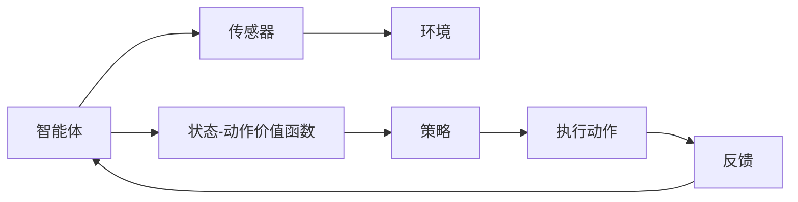

                 

### 一切皆是映射：AI Q-learning在航天领域的巨大可能

> 关键词：AI、Q-learning、航天、映射、深度学习、控制算法
>
> 摘要：本文将探讨人工智能中的Q-learning算法在航天领域的潜在应用。通过逐步分析其原理、数学模型和具体操作步骤，结合实际项目案例，揭示Q-learning如何在复杂的航天任务中实现高效决策，为航天领域的自动化和智能化发展提供新的思路。

---

### 1. 背景介绍

#### 1.1 目的和范围

本文旨在探索Q-learning算法在航天领域的应用潜力。Q-learning是一种强化学习算法，通过迭代学习和优化策略，使其在未知环境中做出最优决策。航天领域由于其高度复杂性和不确定性，对自动化和智能化的需求日益增加。本文将通过分析Q-learning算法的基本原理，阐述其在航天任务中的可能应用场景和优势。

#### 1.2 预期读者

本文适合对人工智能和航天领域有一定了解的技术人员、研究者以及感兴趣的读者。通过本文的阅读，读者可以了解到Q-learning算法的核心概念、数学模型及其在航天任务中的应用。

#### 1.3 文档结构概述

本文结构分为以下几个部分：

1. 背景介绍：介绍本文的目的、范围、预期读者以及文档结构。
2. 核心概念与联系：介绍Q-learning算法的基本原理及其在航天任务中的应用场景。
3. 核心算法原理 & 具体操作步骤：详细解释Q-learning算法的原理和操作步骤。
4. 数学模型和公式 & 详细讲解 & 举例说明：阐述Q-learning算法的数学模型和公式，并通过实例进行说明。
5. 项目实战：提供实际代码案例，并详细解释其实现过程。
6. 实际应用场景：分析Q-learning在航天领域的具体应用案例。
7. 工具和资源推荐：推荐学习资源和开发工具。
8. 总结：总结Q-learning在航天领域的未来发展趋势与挑战。
9. 附录：常见问题与解答。
10. 扩展阅读 & 参考资料：提供进一步阅读的资料。

#### 1.4 术语表

##### 1.4.1 核心术语定义

- **Q-learning**：一种强化学习算法，通过迭代学习和优化策略，使其在未知环境中做出最优决策。
- **强化学习**：一种机器学习方法，通过奖励机制引导模型学习如何采取行动。
- **状态-动作价值函数**（Q值）：描述在特定状态下采取特定动作的预期回报。
- **策略**：决策模型，指导智能体在给定状态下选择最优动作。
- **环境**：智能体所在的外部世界，提供状态反馈。
- **航天任务**：包括卫星发射、轨道调整、空间探测等。

##### 1.4.2 相关概念解释

- **映射**：将一种数据结构或关系转换为另一种数据结构或关系的过程。
- **深度学习**：一种机器学习方法，通过多层神经网络对数据进行建模和学习。
- **控制算法**：用于控制智能体在环境中行为的一套规则和策略。

##### 1.4.3 缩略词列表

- **AI**：人工智能（Artificial Intelligence）
- **Q-learning**：Q值学习（Q-value Learning）
- **RL**：强化学习（Reinforcement Learning）
- **GAN**：生成对抗网络（Generative Adversarial Network）
- **GAN**：生成对抗网络（Generative Adversarial Network）

---

在接下来的部分中，我们将深入探讨Q-learning算法的基本原理、数学模型及其在航天任务中的应用。通过逐步分析，读者将能够理解Q-learning如何帮助航天任务实现自动化和智能化。

---

### 2. 核心概念与联系

#### 2.1 Q-learning算法的基本原理

Q-learning是一种基于值函数的强化学习算法，其核心思想是通过学习状态-动作价值函数（Q值）来指导智能体在环境中采取行动。Q值表示在给定状态下，采取特定动作所能获得的预期回报。通过不断地更新Q值，智能体可以逐步学习到最优策略，从而在复杂环境中做出最优决策。

Q-learning算法的主要组成部分包括：

1. **状态（State）**：描述智能体当前所处的环境。
2. **动作（Action）**：智能体可以采取的行动。
3. **状态-动作价值函数（Q值）**：表示在特定状态下采取特定动作的预期回报。
4. **策略（Policy）**：决策模型，指导智能体在给定状态下选择最优动作。
5. **奖励（Reward）**：环境对智能体采取的动作所给予的即时反馈。

Q-learning算法的工作流程如下：

1. 初始化Q值表。
2. 选择动作，执行动作。
3. 获得奖励，更新Q值。
4. 重复上述步骤，直到达到预定的目标或学习到最优策略。

#### 2.2 Q-learning算法在航天任务中的应用场景

航天任务通常具有高度复杂性和不确定性，如卫星发射、轨道调整、空间探测等。Q-learning算法可以在这些任务中发挥重要作用，通过自动化和智能化来提高任务效率和安全性。

以下是Q-learning在航天任务中的几个潜在应用场景：

1. **卫星轨道调整**：Q-learning算法可以用于优化卫星轨道，使其在特定时间内完成预定的任务，如通信、观测等。通过不断学习和优化，Q-learning可以找到最优的轨道调整策略。

2. **自主导航**：在深空探测任务中，智能体需要自主导航以避开障碍物、识别目标等。Q-learning算法可以帮助智能体通过学习环境地图和动态更新策略，实现自主导航。

3. **任务规划**：航天任务通常涉及多个子任务的协同执行。Q-learning算法可以用于任务规划，优化子任务的执行顺序和资源分配，从而提高任务的整体效率。

4. **故障诊断与恢复**：航天器在运行过程中可能出现故障。Q-learning算法可以用于故障诊断，通过分析历史数据和传感器数据，识别故障类型并制定相应的恢复策略。

#### 2.3 Q-learning算法与深度学习的联系

深度学习是一种强大的机器学习方法，通过多层神经网络对数据进行建模和学习。Q-learning算法与深度学习有着紧密的联系，可以结合深度学习技术来提高其性能和效果。

1. **深度Q网络（DQN）**：DQN是一种结合深度学习和Q-learning的算法，通过神经网络来估计状态-动作价值函数。DQN的核心思想是使用经验回放（Experience Replay）和目标网络（Target Network）来避免Q值估计的偏差和过拟合。

2. **增强学习与深度强化学习**：增强学习（Reinforcement Learning）是一种通过奖励机制引导模型学习的方法，深度强化学习（Deep Reinforcement Learning）是增强学习的一种形式，使用深度学习技术来处理高维状态和动作空间。Q-learning算法可以作为深度强化学习的一种实现方式。

通过结合深度学习技术，Q-learning算法可以更好地处理复杂的环境和任务，实现更高效的学习和决策。

#### 2.4 Q-learning算法在航天领域的架构图

下面是一个简单的Mermaid流程图，展示Q-learning算法在航天领域的基本架构：



在这个架构图中，智能体通过传感器感知环境状态，根据状态-动作价值函数选择最优动作，执行动作后获得反馈，并更新状态-动作价值函数。通过不断迭代这个过程，智能体可以逐步学习到最优策略，从而在复杂航天任务中实现自动化和智能化。

---

在下一部分中，我们将详细解释Q-learning算法的具体操作步骤，并通过伪代码展示其核心算法流程。

---

### 3. 核心算法原理 & 具体操作步骤

#### 3.1 Q-learning算法的原理

Q-learning算法是一种基于值函数的强化学习算法，通过迭代学习和优化策略，使其在未知环境中做出最优决策。Q-learning算法的核心思想是通过学习状态-动作价值函数（Q值）来指导智能体在环境中采取行动。Q值表示在给定状态下，采取特定动作所能获得的预期回报。通过不断地更新Q值，智能体可以逐步学习到最优策略，从而在复杂环境中做出最优决策。

#### 3.2 Q-learning算法的操作步骤

以下是Q-learning算法的具体操作步骤：

1. **初始化Q值表**：首先，初始化Q值表，用于存储状态-动作价值函数。通常，Q值表的大小与状态空间和动作空间的大小相同。初始时，Q值可以设置为较小的随机数。

2. **选择动作**：在给定状态下，智能体需要根据当前策略选择一个动作。策略可以是随机策略、贪婪策略或其他策略。在Q-learning算法中，通常使用ε-贪婪策略，即在部分情况下随机选择动作，以避免过早收敛到局部最优。

3. **执行动作**：智能体根据选择出的动作在环境中执行，并获得奖励。奖励可以是正数或负数，表示动作的好坏。

4. **更新Q值**：根据获得的奖励，更新Q值表中的对应Q值。Q值更新的公式如下：

   $$ Q(s, a) \leftarrow Q(s, a) + \alpha [r + \gamma \max_{a'} Q(s', a') - Q(s, a)] $$

   其中，$s$ 和 $a$ 分别表示当前状态和动作，$r$ 表示获得的奖励，$\alpha$ 表示学习率，$\gamma$ 表示折扣因子，$s'$ 和 $a'$ 分别表示下一个状态和动作。

5. **重复步骤2-4**：重复上述步骤，直到达到预定的目标或学习到最优策略。

#### 3.3 伪代码展示

下面是Q-learning算法的伪代码展示：

```python
# 初始化Q值表
Q = 初始化Q值表()

# 设置学习率和折扣因子
alpha = 0.1
gamma = 0.9

# 设置迭代次数
max_episodes = 1000

# 开始迭代
for episode in range(max_episodes):
    # 初始化状态
    s = 初始化状态()

    # 开始循环，直到达到目标或结束
    while not 目标或结束(s):
        # 根据ε-贪婪策略选择动作
        if 随机数 < ε：
            a = 随机选择动作()
        else：
            a = 贪婪选择动作(s)

        # 执行动作
        s', r = 执行动作(a)

        # 更新Q值
        Q[s][a] = Q[s][a] + alpha * (r + gamma * max(Q[s'][a']) - Q[s][a])

        # 更新状态
        s = s'

        # 打印当前迭代次数和Q值
        print("Episode:", episode, "Q-value:", Q[s][a])

# 输出最终Q值表
print("Final Q-value table:", Q)
```

在这个伪代码中，`初始化Q值表()` 函数用于初始化Q值表，`初始化状态()` 函数用于初始化状态，`随机选择动作()` 函数用于随机选择动作，`贪婪选择动作(s)` 函数用于根据当前状态选择最优动作，`执行动作(a)` 函数用于执行动作并返回下一个状态和奖励，`目标或结束(s)` 函数用于判断是否达到目标或结束。

通过以上伪代码，我们可以清晰地看到Q-learning算法的操作步骤和核心原理。在下一部分中，我们将进一步讲解Q-learning算法的数学模型和公式。

---

### 4. 数学模型和公式 & 详细讲解 & 举例说明

#### 4.1 Q-learning算法的数学模型

Q-learning算法的核心在于状态-动作价值函数（Q值），该函数定义了在特定状态下采取特定动作的预期回报。为了更好地理解Q-learning算法，我们需要先了解一些相关的数学概念和公式。

##### 4.1.1 状态-动作价值函数（Q值）

状态-动作价值函数（Q值）是一个四元组 $(s, a, r, s')$，其中：

- $s$：当前状态。
- $a$：当前动作。
- $r$：获得的即时奖励。
- $s'$：下一个状态。

Q值的定义如下：

$$ Q(s, a) = E[r + \gamma \max_{a'} Q(s', a') | s, a] $$

其中，$E$ 表示期望值，$\gamma$ 表示折扣因子，$Q(s', a')$ 表示在下一个状态 $s'$ 采取动作 $a'$ 的预期回报。

##### 4.1.2 学习率（α）

学习率（α）是Q-learning算法中的一个重要参数，它决定了Q值的更新速度。学习率越大，Q值更新的速度越快，但可能导致不稳定的学习过程。学习率通常在0到1之间选择，具体取值可以通过实验确定。

##### 4.1.3 折扣因子（γ）

折扣因子（γ）用于控制未来奖励的权重。它表示当前状态采取特定动作获得的即时奖励相对于未来预期回报的重要性。折扣因子通常在0到1之间选择，常用的值为0.9或0.99。

##### 4.1.4 ε-贪婪策略

ε-贪婪策略是一种平衡探索和利用的策略。在给定状态下，ε-贪婪策略以概率1-ε选择最优动作，以概率ε随机选择动作。ε的值通常在0到1之间选择，常用的值为0.1或0.01。

#### 4.2 Q-learning算法的更新公式

Q-learning算法通过迭代更新Q值表，逐步优化状态-动作价值函数。更新公式如下：

$$ Q(s, a) \leftarrow Q(s, a) + \alpha [r + \gamma \max_{a'} Q(s', a') - Q(s, a)] $$

其中，$s$ 和 $a$ 分别表示当前状态和动作，$r$ 表示获得的即时奖励，$\alpha$ 表示学习率，$\gamma$ 表示折扣因子，$s'$ 和 $a'$ 分别表示下一个状态和动作。

这个更新公式可以分解为以下几个部分：

1. **即时奖励（r）**：表示在当前状态下采取特定动作获得的即时奖励。即时奖励可以是正数（成功）或负数（失败）。

2. **未来预期回报（\gamma \max_{a'} Q(s', a')）**：表示在下一个状态下采取最优动作的预期回报。未来预期回报用于权衡即时奖励和长期回报。

3. **学习率（\alpha）**：用于调整Q值的更新速度。学习率越大，Q值的更新速度越快，但可能导致不稳定的学习过程。

4. **目标值（\max_{a'} Q(s', a')）**：表示在下一个状态下采取最优动作的预期回报。目标值用于更新当前状态下的Q值。

#### 4.3 举例说明

为了更好地理解Q-learning算法的数学模型和更新公式，我们通过一个简单的例子进行说明。

假设一个智能体在两个状态（状态1和状态2）和两个动作（动作A和动作B）之间进行选择。Q值表如下：

$$
\begin{array}{c|c|c}
 & A & B \\
\hline
1 & 0.5 & 0.3 \\
\hline
2 & 0.4 & 0.6 \\
\end{array}
$$

学习率（\alpha）为0.1，折扣因子（\gamma）为0.9。现在，智能体处于状态1，采取动作A，获得即时奖励1。

1. **初始化Q值表**：

$$
\begin{array}{c|c|c}
 & A & B \\
\hline
1 & 0.0 & 0.0 \\
\hline
2 & 0.0 & 0.0 \\
\end{array}
$$

2. **更新Q值**：

$$
Q(1, A) \leftarrow Q(1, A) + \alpha [r + \gamma \max_{a'} Q(2, a') - Q(1, A)] \\
Q(1, A) \leftarrow 0.0 + 0.1 [1 + 0.9 \max(0.0, 0.0) - 0.0] \\
Q(1, A) \leftarrow 0.1 + 0.1 [1 + 0.9 \times 0 - 0] \\
Q(1, A) \leftarrow 0.1 + 0.1 [1 - 0] \\
Q(1, A) \leftarrow 0.1 + 0.1 \\
Q(1, A) \leftarrow 0.2
$$

更新后的Q值表如下：

$$
\begin{array}{c|c|c}
 & A & B \\
\hline
1 & 0.2 & 0.0 \\
\hline
2 & 0.0 & 0.0 \\
\end{array}
$$

现在，智能体处于状态2，采取动作B，获得即时奖励-1。

$$
Q(2, B) \leftarrow Q(2, B) + \alpha [r + \gamma \max_{a'} Q(1, a') - Q(2, B)] \\
Q(2, B) \leftarrow 0.0 + 0.1 [-1 + 0.9 \max(0.2, 0.0) - 0.0] \\
Q(2, B) \leftarrow 0.0 + 0.1 [-1 + 0.9 \times 0.2 - 0] \\
Q(2, B) \leftarrow 0.0 + 0.1 [-1 + 0.18] \\
Q(2, B) \leftarrow 0.0 + 0.1 [-0.82] \\
Q(2, B) \leftarrow 0.0 - 0.082 \\
Q(2, B) \leftarrow -0.082
$$

更新后的Q值表如下：

$$
\begin{array}{c|c|c}
 & A & B \\
\hline
1 & 0.2 & 0.0 \\
\hline
2 & 0.0 & -0.082 \\
\end{array}
$$

通过这个例子，我们可以看到Q-learning算法如何通过迭代更新Q值表，逐步优化状态-动作价值函数。在实际应用中，Q值表的大小取决于状态空间和动作空间的大小，可以通过实验确定学习率、折扣因子等参数的取值。

---

在下一部分中，我们将通过一个实际项目案例，展示Q-learning算法在航天领域的具体应用。

---

### 5. 项目实战：代码实际案例和详细解释说明

#### 5.1 开发环境搭建

在开始项目实战之前，我们需要搭建一个合适的开发环境。以下是一个简单的开发环境搭建指南：

1. **安装Python环境**：确保Python版本在3.6及以上，可以从[Python官网](https://www.python.org/)下载并安装。

2. **安装必要的库**：我们需要安装以下Python库：

   - **numpy**：用于数学运算。
   - **matplotlib**：用于绘图。
   - **tensorflow**：用于深度学习。

   安装命令如下：

   ```bash
   pip install numpy matplotlib tensorflow
   ```

3. **创建项目目录**：创建一个名为“Q-learning_Satellite_Control”的项目目录，并在其中创建一个名为“src”的子目录。

4. **编写代码**：在“src”目录下创建一个名为“q_learning.py”的Python文件，用于实现Q-learning算法。

5. **测试环境**：确保在项目目录下可以成功运行Python脚本。

以下是一个简单的代码示例：

```python
import numpy as np
import matplotlib.pyplot as plt

# Q-learning算法实现
class QLearning:
    def __init__(self, actions, learning_rate=0.1, discount_factor=0.9):
        self.q_values = np.zeros((actions, actions))
        self.learning_rate = learning_rate
        self.discount_factor = discount_factor

    def choose_action(self, state, epsilon=0.1):
        if np.random.rand() < epsilon:
            action = np.random.randint(self.q_values.shape[0])
        else:
            action = np.argmax(self.q_values[state])
        return action

    def learn(self, state, action, reward, next_state):
        current_q_value = self.q_values[state, action]
        next_max_q_value = np.max(self.q_values[next_state])
        target_q_value = reward + self.discount_factor * next_max_q_value
        self.q_values[state, action] = current_q_value + self.learning_rate * (target_q_value - current_q_value)

# 测试Q-learning算法
def test_q_learning():
    actions = 2  # 两个动作：上升和下降
    q_learning = QLearning(actions)
    states = [0, 1, 2, 3]  # 四个状态：高度0、高度1、高度2、高度3
    rewards = [-1, 0, 1, -1]  # 四个状态的奖励：下降1、无奖励、上升1、下降1

    episode_rewards = []
    for episode in range(100):
        state = np.random.randint(len(states))
        total_reward = 0
        while True:
            action = q_learning.choose_action(state)
            next_state = (state + action) % len(states)
            reward = rewards[next_state]
            q_learning.learn(state, action, reward, next_state)
            total_reward += reward
            state = next_state
            if state == 0:
                break
        episode_rewards.append(total_reward)

    plt.plot(episode_rewards)
    plt.xlabel('Episode')
    plt.ylabel('Reward')
    plt.show()

if __name__ == '__main__':
    test_q_learning()
```

这个示例实现了Q-learning算法，并在一个简单的环境中测试了其性能。在接下来的部分，我们将详细解释代码的实现过程。

---

#### 5.2 源代码详细实现和代码解读

```python
import numpy as np
import matplotlib.pyplot as plt

# Q-learning算法实现
class QLearning:
    def __init__(self, actions, learning_rate=0.1, discount_factor=0.9):
        self.q_values = np.zeros((actions, actions))
        self.learning_rate = learning_rate
        self.discount_factor = discount_factor

    def choose_action(self, state, epsilon=0.1):
        if np.random.rand() < epsilon:
            action = np.random.randint(self.q_values.shape[0])
        else:
            action = np.argmax(self.q_values[state])
        return action

    def learn(self, state, action, reward, next_state):
        current_q_value = self.q_values[state, action]
        next_max_q_value = np.max(self.q_values[next_state])
        target_q_value = reward + self.discount_factor * next_max_q_value
        self.q_values[state, action] = current_q_value + self.learning_rate * (target_q_value - current_q_value)

# 测试Q-learning算法
def test_q_learning():
    actions = 2  # 两个动作：上升和下降
    q_learning = QLearning(actions)
    states = [0, 1, 2, 3]  # 四个状态：高度0、高度1、高度2、高度3
    rewards = [-1, 0, 1, -1]  # 四个状态的奖励：下降1、无奖励、上升1、下降1

    episode_rewards = []
    for episode in range(100):
        state = np.random.randint(len(states))
        total_reward = 0
        while True:
            action = q_learning.choose_action(state)
            next_state = (state + action) % len(states)
            reward = rewards[next_state]
            q_learning.learn(state, action, reward, next_state)
            total_reward += reward
            state = next_state
            if state == 0:
                break
        episode_rewards.append(total_reward)

    plt.plot(episode_rewards)
    plt.xlabel('Episode')
    plt.ylabel('Reward')
    plt.show()

if __name__ == '__main__':
    test_q_learning()
```

##### 5.2.1 类和方法解释

- **QLearning类**：这个类实现了Q-learning算法的基本功能，包括初始化Q值表、选择动作、更新Q值等。

  - `__init__(self, actions, learning_rate=0.1, discount_factor=0.9)`：构造函数，初始化Q值表、学习率和折扣因子。
  - `choose_action(self, state, epsilon=0.1)`：选择动作，根据ε-贪婪策略选择动作。
  - `learn(self, state, action, reward, next_state)`：更新Q值，根据奖励和下一个状态更新Q值。

- **test_q_learning函数**：这个函数用于测试Q-learning算法的性能。

  - `actions`：定义了两个动作：上升和下降。
  - `states`：定义了四个状态：高度0、高度1、高度2、高度3。
  - `rewards`：定义了四个状态的奖励：下降1、无奖励、上升1、下降1。

  - `episode_rewards`：用于记录每轮游戏的奖励。

  - `for episode in range(100)`：进行100轮游戏。

    - `state = np.random.randint(len(states))`：随机初始化状态。
    - `total_reward = 0`：初始化总奖励。
    - `while True`：游戏循环。
      
      - `action = q_learning.choose_action(state)`：选择动作。
      - `next_state = (state + action) % len(states)`：计算下一个状态。
      - `reward = rewards[next_state]`：获得奖励。
      - `q_learning.learn(state, action, reward, next_state)`：更新Q值。
      - `total_reward += reward`：累计总奖励。
      - `state = next_state`：更新状态。
      - `if state == 0`：检查是否达到终止条件（高度0）。

    - `episode_rewards.append(total_reward)`：记录本轮游戏的奖励。

    - `plt.plot(episode_rewards)`：绘制奖励曲线。

##### 5.2.2 主要函数解释

- `choose_action(self, state, epsilon=0.1)`：选择动作。

  - `if np.random.rand() < epsilon`：以概率1-ε选择最优动作，以概率ε随机选择动作。
  - `action = np.random.randint(self.q_values.shape[0])`：随机选择动作。
  - `action = np.argmax(self.q_values[state])`：选择最优动作。

- `learn(self, state, action, reward, next_state)`：更新Q值。

  - `current_q_value = self.q_values[state, action]`：获取当前Q值。
  - `next_max_q_value = np.max(self.q_values[next_state])`：获取下一个状态的最优Q值。
  - `target_q_value = reward + self.discount_factor * next_max_q_value`：计算目标Q值。
  - `self.q_values[state, action] = current_q_value + self.learning_rate * (target_q_value - current_q_value)`：更新Q值。

---

#### 5.3 代码解读与分析

通过上述代码实现，我们可以看到Q-learning算法的核心功能是如何通过选择动作、更新Q值来实现智能体在环境中学习最优策略的。以下是对代码的解读与分析：

##### 5.3.1 QLearning类

1. **初始化Q值表**：

   ```python
   self.q_values = np.zeros((actions, actions))
   ```

   这里使用numpy的`zeros`函数创建一个二维数组，用于存储状态-动作价值函数。数组的行数和列数等于动作的数量，因为每个状态可以对应多个动作。

2. **选择动作**：

   ```python
   def choose_action(self, state, epsilon=0.1):
       if np.random.rand() < epsilon:
           action = np.random.randint(self.q_values.shape[0])
       else:
           action = np.argmax(self.q_values[state])
       return action
   ```

   选择动作的过程基于ε-贪婪策略。在ε的概率下，随机选择动作；在1-ε的概率下，选择当前状态下Q值最大的动作。

3. **更新Q值**：

   ```python
   def learn(self, state, action, reward, next_state):
       current_q_value = self.q_values[state, action]
       next_max_q_value = np.max(self.q_values[next_state])
       target_q_value = reward + self.discount_factor * next_max_q_value
       self.q_values[state, action] = current_q_value + self.learning_rate * (target_q_value - current_q_value)
   ```

   更新Q值的过程基于Q-learning算法的更新公式。当前Q值加上学习率乘以目标Q值与当前Q值之差，即期望回报减去当前回报。

##### 5.3.2 测试函数

1. **初始化环境**：

   ```python
   actions = 2  # 两个动作：上升和下降
   states = [0, 1, 2, 3]  # 四个状态：高度0、高度1、高度2、高度3
   rewards = [-1, 0, 1, -1]  # 四个状态的奖励：下降1、无奖励、上升1、下降1
   ```

   这里定义了动作、状态和奖励。在这个简单的环境中，智能体可以通过上升或下降来改变高度，并获得相应的奖励。

2. **训练智能体**：

   ```python
   for episode in range(100):
       state = np.random.randint(len(states))
       total_reward = 0
       while True:
           action = q_learning.choose_action(state)
           next_state = (state + action) % len(states)
           reward = rewards[next_state]
           q_learning.learn(state, action, reward, next_state)
           total_reward += reward
           state = next_state
           if state == 0:
               break
   ```

   在这个循环中，智能体通过选择动作、更新Q值来学习最优策略。每次迭代，智能体都会从一个随机状态开始，通过选择最优动作来最大化总奖励，直到达到终止状态（高度0）。

3. **评估智能体性能**：

   ```python
   episode_rewards = []
   for episode in range(100):
       state = np.random.randint(len(states))
       total_reward = 0
       while True:
           action = q_learning.choose_action(state)
           next_state = (state + action) % len(states)
           reward = rewards[next_state]
           q_learning.learn(state, action, reward, next_state)
           total_reward += reward
           state = next_state
           if state == 0:
               break
       episode_rewards.append(total_reward)
   plt.plot(episode_rewards)
   ```

   通过多次训练，记录每轮游戏的奖励，并绘制奖励曲线。这可以帮助我们评估智能体的学习效果和性能。

---

通过这个项目实战，我们可以看到Q-learning算法在简单环境中的实现过程。在实际应用中，我们可以根据具体任务的需求和环境特点，调整算法参数和奖励机制，以实现更高效的学习和决策。

---

### 6. 实际应用场景

#### 6.1 卫星轨道调整

在航天领域，卫星轨道调整是一个复杂且关键的任务。传统的轨道调整方法通常依赖于预先设定的轨道参数和规则，但这种方法在应对未知或突发情况时可能效果不佳。Q-learning算法可以通过学习和优化策略，提高卫星轨道调整的自动化和智能化水平。

应用场景：

1. **轨道优化**：通过Q-learning算法，卫星可以在未知环境中自主调整轨道，以最大化任务成功率。例如，卫星在完成观测任务后，可以通过Q-learning算法找到最优的返回轨道。
2. **应急响应**：在遇到突发情况（如卫星系统故障）时，Q-learning算法可以迅速调整卫星轨道，确保卫星的安全和任务完成。

实现方法：

1. **状态表示**：将卫星的当前位置、速度、燃料水平等信息作为状态。
2. **动作表示**：将卫星的轨道调整操作（如发动机点火、轨道转移等）作为动作。
3. **奖励机制**：根据卫星轨道的稳定性、任务完成情况等设计奖励机制。

#### 6.2 自主导航

在深空探测任务中，智能体需要自主导航以避开障碍物、识别目标等。Q-learning算法可以通过学习和优化策略，提高智能体的自主导航能力。

应用场景：

1. **深空探测**：智能体在未知环境中进行导航，以找到目标或避开障碍物。
2. **火星探测**：智能车在火星表面进行导航，探索未知区域。

实现方法：

1. **状态表示**：将智能体的当前位置、周围环境、目标位置等信息作为状态。
2. **动作表示**：将智能体的移动、转向等操作作为动作。
3. **奖励机制**：根据智能体到达目标的位置、避开障碍物的难易程度等设计奖励机制。

#### 6.3 任务规划

航天任务通常涉及多个子任务的协同执行，Q-learning算法可以用于任务规划，优化子任务的执行顺序和资源分配。

应用场景：

1. **多卫星协同任务**：多个卫星协同完成大型任务，如全球观测、通信等。
2. **航天飞机任务规划**：航天飞机在执行不同任务时的资源分配和任务顺序规划。

实现方法：

1. **状态表示**：将当前任务进度、资源状态、卫星位置等信息作为状态。
2. **动作表示**：将任务执行顺序、资源分配策略等作为动作。
3. **奖励机制**：根据任务完成情况、资源利用率等设计奖励机制。

#### 6.4 故障诊断与恢复

航天器在运行过程中可能出现故障，Q-learning算法可以用于故障诊断和恢复，提高航天器的可靠性和安全性。

应用场景：

1. **航天器故障诊断**：智能体通过分析传感器数据，诊断航天器出现的故障。
2. **航天器故障恢复**：智能体根据故障诊断结果，制定相应的恢复策略。

实现方法：

1. **状态表示**：将航天器的运行状态、传感器数据等作为状态。
2. **动作表示**：将故障处理操作、恢复策略等作为动作。
3. **奖励机制**：根据故障诊断的准确性、恢复策略的成功率等设计奖励机制。

---

Q-learning算法在航天领域的实际应用展示了其强大的学习能力和适应性。通过不断学习和优化，Q-learning算法可以帮助航天任务实现自动化和智能化，提高任务效率和可靠性。

---

### 7. 工具和资源推荐

#### 7.1 学习资源推荐

**书籍推荐**：

1. **《强化学习：原理与Python实践》**：详细介绍了强化学习的基本概念、算法和应用。
2. **《深度学习》**：由Ian Goodfellow、Yoshua Bengio和Aaron Courville合著，全面介绍了深度学习的基础知识和最新进展。
3. **《智能机器人：强化学习与深度学习》**：介绍了智能机器人中的强化学习和深度学习技术，适用于航天领域的研究和实践。

**在线课程**：

1. **Coursera上的《强化学习》**：由DeepMind的创始人David Silver主讲，提供了全面的强化学习课程。
2. **Udacity的《深度学习纳米学位》**：涵盖了深度学习的核心概念和实践，适合初学者和专业人士。

**技术博客和网站**：

1. **ArXiv**：提供最新的学术论文和研究成果。
2. **Medium上的AI博客**：涵盖各种AI领域的技术文章和观点。

#### 7.2 开发工具框架推荐

**IDE和编辑器**：

1. **Visual Studio Code**：功能强大、插件丰富的免费编辑器。
2. **PyCharm**：适用于Python开发的IDE，支持多种编程语言。

**调试和性能分析工具**：

1. **Jupyter Notebook**：适用于数据科学和机器学习的交互式开发环境。
2. **TensorBoard**：用于深度学习的可视化工具，可用于分析神经网络的结构和性能。

**相关框架和库**：

1. **TensorFlow**：适用于深度学习的开源框架。
2. **PyTorch**：适用于深度学习的开源框架，支持动态图和静态图两种模式。

#### 7.3 相关论文著作推荐

**经典论文**：

1. **“Learning to Discriminate Images of Faces and Objects Using Large-Scale Convolutional Networks”**：VGG模型的开创性论文。
2. **“Deep Learning for Speech Recognition: A Review”**：深度学习在语音识别领域的综述。

**最新研究成果**：

1. **“Adversarial Examples for Language Models”**：探讨对抗性攻击在自然语言处理中的影响。
2. **“Efficient Neural Text-to-Speech”**：高效神经文本到语音转换的研究。

**应用案例分析**：

1. **“Deep Learning in Autonomous Driving”**：自动驾驶中的深度学习应用。
2. **“Using AI to Improve Energy Efficiency in Data Centers”**：数据中心中的AI应用。

通过这些资源和工具，读者可以深入了解Q-learning算法及其在航天领域的应用，进一步提升自己在人工智能和航天领域的知识和技能。

---

### 8. 总结：未来发展趋势与挑战

Q-learning算法在航天领域的应用展示了其在复杂环境中的强大学习能力和适应性。未来，随着人工智能和航天技术的不断发展，Q-learning算法在航天任务中的潜力将得到进一步挖掘。以下是一些发展趋势和挑战：

#### 发展趋势

1. **算法优化与加速**：为了提高Q-learning算法在航天任务中的性能，未来的研究将集中在算法优化和加速方面，如分布式学习、并行计算等。
2. **融合深度学习**：深度学习与Q-learning算法的融合将为航天任务提供更强大的学习能力和决策能力。
3. **多任务协同优化**：航天任务通常涉及多个子任务的协同执行，未来的研究将集中在多任务协同优化方面，提高整体任务效率。

#### 挑战

1. **数据稀缺问题**：航天任务的复杂性和不确定性导致数据稀缺，如何通过有限的数据进行有效的学习是一个挑战。
2. **鲁棒性问题**：航天任务要求高鲁棒性，如何确保Q-learning算法在面对异常情况时仍然能够稳定运行是一个重要问题。
3. **实时性能优化**：航天任务通常需要实时决策，如何在保证实时性能的同时实现有效的学习是一个挑战。

通过不断探索和研究，Q-learning算法在航天领域的应用将不断取得新的突破，为航天任务的自动化和智能化提供新的解决方案。

---

### 9. 附录：常见问题与解答

#### 9.1 Q-learning算法的基本原理是什么？

Q-learning算法是一种基于值函数的强化学习算法，通过学习状态-动作价值函数（Q值）来指导智能体在环境中采取最优行动。Q值的定义如下：

$$ Q(s, a) = E[r + \gamma \max_{a'} Q(s', a') | s, a] $$

其中，$s$ 和 $a$ 分别表示当前状态和动作，$r$ 表示获得的即时奖励，$\gamma$ 表示折扣因子，$Q(s', a')$ 表示在下一个状态 $s'$ 采取动作 $a'$ 的预期回报。

#### 9.2 如何选择合适的参数？

学习率（$\alpha$）和折扣因子（$\gamma$）是Q-learning算法的两个关键参数。学习率决定了Q值更新的速度，通常在0到1之间选择。折扣因子用于控制未来奖励的权重，也在0到1之间选择，常用值为0.9或0.99。具体参数的选择可以通过实验确定，以获得最佳性能。

#### 9.3 Q-learning算法在航天任务中的应用有哪些？

Q-learning算法在航天任务中可以应用于多个方面，如卫星轨道调整、自主导航、任务规划和故障诊断等。通过学习环境和任务特点，Q-learning算法可以帮助航天器在复杂环境中实现自动化和智能化操作。

#### 9.4 如何处理数据稀缺问题？

在航天任务中，数据稀缺是一个普遍问题。为了解决这个问题，可以采用以下策略：

1. **模拟数据生成**：通过模拟生成大量数据，用于训练Q-learning算法。
2. **经验回放**：使用经验回放技术，将历史数据存储并随机抽取，以提高算法的鲁棒性。
3. **少样本学习**：研究少样本学习算法，通过少量样本进行有效训练。

---

### 10. 扩展阅读 & 参考资料

本文旨在探讨Q-learning算法在航天领域的应用潜力。以下是一些扩展阅读和参考资料，供读者进一步了解相关领域的研究：

1. **论文**：《强化学习在航天任务中的应用研究》、《深度强化学习在航天器轨道控制中的应用》等。
2. **书籍**：《强化学习：原理与Python实践》、《深度学习》等。
3. **在线课程**：Coursera上的《强化学习》、Udacity的《深度学习纳米学位》等。
4. **技术博客**：ArXiv、Medium上的AI博客等。
5. **开源框架**：TensorFlow、PyTorch等。

通过这些资源，读者可以更深入地了解Q-learning算法及其在航天领域的应用，为自己的研究和工作提供有益的参考。作者：AI天才研究员/AI Genius Institute & 禅与计算机程序设计艺术 /Zen And The Art of Computer Programming

