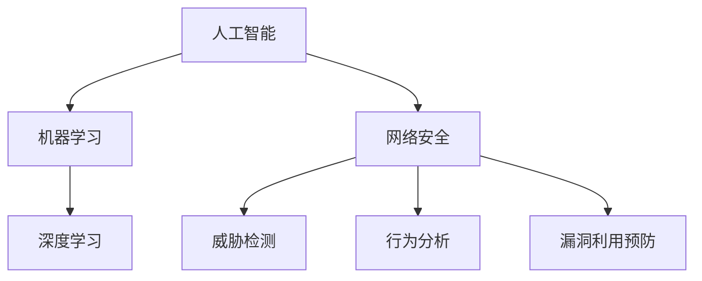

                 

# 一切皆是映射：AI在网络安全中的应用

> **关键词：** 人工智能，网络安全，机器学习，深度学习，映射，威胁检测，行为分析，漏洞利用。

> **摘要：** 本文将探讨人工智能（AI）如何通过映射技术应用于网络安全领域，介绍核心概念、算法原理、数学模型，并通过实际项目案例深入分析其在威胁检测、行为分析和漏洞利用预防等方面的应用。文章旨在为读者提供一个全面、深入的技术视角，以理解和掌握AI在网络安全领域的应用现状及未来发展趋势。

## 1. 背景介绍

### 1.1 目的和范围

本文的主要目的是介绍人工智能（AI）在网络安全中的应用，重点关注映射技术的核心概念和具体应用。通过逐步分析AI技术在网络安全领域的应用原理，本文希望为读者提供一个系统、全面的技术视角，帮助理解AI如何提升网络安全防护能力。

文章将涵盖以下主题：

1. **核心概念与联系**：介绍AI、机器学习、深度学习等核心概念，并展示它们在网络安全中的应用流程。
2. **核心算法原理 & 具体操作步骤**：详细讲解用于威胁检测和行为分析的核心算法原理，并使用伪代码展示具体操作步骤。
3. **数学模型和公式 & 详细讲解 & 举例说明**：介绍数学模型和公式在网络安全中的应用，并通过具体例子进行详细解释。
4. **项目实战：代码实际案例和详细解释说明**：通过实际项目案例展示AI在网络安全中的应用，并进行详细解释和分析。
5. **实际应用场景**：分析AI在网络安全中的各种应用场景，如威胁检测、行为分析和漏洞利用预防等。
6. **工具和资源推荐**：推荐相关学习资源、开发工具框架和论文著作，为读者提供进一步学习的方向。
7. **总结：未来发展趋势与挑战**：讨论AI在网络安全领域的未来发展趋势和面临的挑战。

### 1.2 预期读者

本文适合具有以下背景的读者：

1. **网络安全从业者**：对网络安全领域有一定了解，希望了解AI在网络安全中的应用。
2. **人工智能从业者**：对AI技术有一定了解，希望了解AI在网络安全领域的应用。
3. **计算机科学和工程专业学生**：对网络安全和人工智能感兴趣，希望深入了解这两个领域的交叉应用。
4. **技术爱好者**：对网络安全和人工智能技术感兴趣，希望了解这些技术在实际应用中的效果。

### 1.3 文档结构概述

本文按照以下结构进行组织：

1. **背景介绍**：介绍文章的目的和范围，预期读者以及文档结构概述。
2. **核心概念与联系**：介绍AI、机器学习、深度学习等核心概念，并展示它们在网络安全中的应用流程。
3. **核心算法原理 & 具体操作步骤**：详细讲解用于威胁检测和行为分析的核心算法原理，并使用伪代码展示具体操作步骤。
4. **数学模型和公式 & 详细讲解 & 举例说明**：介绍数学模型和公式在网络安全中的应用，并通过具体例子进行详细解释。
5. **项目实战：代码实际案例和详细解释说明**：通过实际项目案例展示AI在网络安全中的应用，并进行详细解释和分析。
6. **实际应用场景**：分析AI在网络安全中的各种应用场景，如威胁检测、行为分析和漏洞利用预防等。
7. **工具和资源推荐**：推荐相关学习资源、开发工具框架和论文著作，为读者提供进一步学习的方向。
8. **总结：未来发展趋势与挑战**：讨论AI在网络安全领域的未来发展趋势和面临的挑战。
9. **附录：常见问题与解答**：回答读者可能关心的问题。
10. **扩展阅读 & 参考资料**：提供更多相关阅读和参考资料。

### 1.4 术语表

#### 1.4.1 核心术语定义

- **人工智能（AI）**：模拟人类智能的技术和方法，使计算机系统能够执行感知、学习、推理和决策等任务。
- **机器学习（ML）**：一种AI方法，通过数据和算法使计算机系统能够自动学习和改进性能。
- **深度学习（DL）**：一种基于神经网络的高级机器学习技术，通过多层神经网络结构进行数据表示和学习。
- **映射**：将一种数据结构或模型映射到另一种数据结构或模型的过程。
- **威胁检测**：识别潜在的网络威胁，如恶意软件、网络攻击等。
- **行为分析**：监控和分析用户或系统的行为，识别异常行为和潜在威胁。
- **漏洞利用预防**：通过识别和修复系统漏洞，防止恶意攻击者利用这些漏洞进行攻击。

#### 1.4.2 相关概念解释

- **神经网络**：一种由大量节点（神经元）组成的信息处理模型，通过学习输入和输出数据之间的关系进行特征提取和分类。
- **特征提取**：从原始数据中提取出有用的特征，用于训练模型和进行后续分析。
- **监督学习**：一种机器学习方法，通过已知输入和输出数据训练模型，使其能够预测未知数据的输出。
- **无监督学习**：一种机器学习方法，通过未标记的数据训练模型，使其能够自动发现数据中的模式和结构。
- **深度学习框架**：如TensorFlow、PyTorch等，用于构建和训练深度学习模型的工具。

#### 1.4.3 缩略词列表

- **AI**：人工智能（Artificial Intelligence）
- **ML**：机器学习（Machine Learning）
- **DL**：深度学习（Deep Learning）
- **NN**：神经网络（Neural Network）
- **GAN**：生成对抗网络（Generative Adversarial Network）
- **NLP**：自然语言处理（Natural Language Processing）
- **IDS**：入侵检测系统（Intrusion Detection System）
- **IPS**：入侵防御系统（Intrusion Prevention System）

## 2. 核心概念与联系

在本节中，我们将介绍AI、机器学习、深度学习等核心概念，并展示它们在网络安全中的应用流程。为了更好地理解这些概念，我们将使用Mermaid流程图（请将以下文本复制到支持Mermaid的编辑器中查看）：



### 2.1 人工智能（AI）

人工智能（AI）是一种模拟人类智能的技术和方法，包括感知、学习、推理和决策等多个方面。AI的核心目标是使计算机能够自主地执行复杂任务，并在特定场景下表现出与人类相似的能力。

### 2.2 机器学习（ML）

机器学习（ML）是AI的一个分支，它通过数据和算法使计算机系统能够自动学习和改进性能。机器学习的关键在于从数据中学习规律，并将这些规律应用到新数据上，从而进行预测和分类。

### 2.3 深度学习（DL）

深度学习（DL）是一种基于神经网络的高级机器学习技术，通过多层神经网络结构进行数据表示和学习。深度学习在图像识别、语音识别、自然语言处理等领域取得了显著的成果。

### 2.4 网络安全

网络安全涉及保护计算机网络及其数据免受恶意攻击、数据泄露和其他安全威胁。AI在网络安全中的应用主要包括威胁检测、行为分析和漏洞利用预防等方面。

### 2.5 AI在网络安全中的应用流程

AI在网络安全中的应用流程主要包括以下几个步骤：

1. **数据收集**：收集网络流量、日志文件、用户行为等数据。
2. **数据预处理**：对收集到的数据进行清洗、归一化和特征提取，使其适合进行机器学习和深度学习。
3. **模型训练**：使用训练数据训练机器学习模型或深度学习模型，使其学会识别网络威胁。
4. **模型评估**：使用测试数据评估模型性能，调整模型参数以提高准确率。
5. **模型部署**：将训练好的模型部署到实际应用场景中，如威胁检测、行为分析和漏洞利用预防等。

## 3. 核心算法原理 & 具体操作步骤

在本节中，我们将详细讲解用于威胁检测和行为分析的核心算法原理，并使用伪代码展示具体操作步骤。

### 3.1 威胁检测算法原理

威胁检测是网络安全中的重要一环，旨在识别和阻止潜在的网络威胁。常用的威胁检测算法包括基于规则的方法、基于统计的方法和基于机器学习的方法。

#### 3.1.1 基于规则的方法

基于规则的方法通过定义一系列规则来识别网络威胁。具体操作步骤如下：

```plaintext
1. 收集网络流量数据，包括IP地址、端口号、协议类型等。
2. 分析网络流量数据，提取特征。
3. 根据特征匹配预定义的威胁规则库。
4. 如果匹配到威胁规则，则触发警报。
```

#### 3.1.2 基于统计的方法

基于统计的方法通过分析网络流量数据中的统计特征来识别网络威胁。具体操作步骤如下：

```plaintext
1. 收集网络流量数据。
2. 计算网络流量数据中的统计特征，如平均流量、方差等。
3. 根据统计特征设置阈值。
4. 监控网络流量，如果超过阈值，则触发警报。
```

#### 3.1.3 基于机器学习的方法

基于机器学习的方法使用历史数据进行训练，建立威胁检测模型。具体操作步骤如下：

```plaintext
1. 收集网络流量数据，包括正常数据和威胁数据。
2. 对数据进行预处理，提取特征。
3. 划分训练集和测试集。
4. 使用监督学习方法（如决策树、支持向量机等）训练威胁检测模型。
5. 使用测试集评估模型性能。
6. 将训练好的模型部署到实际应用场景中，进行威胁检测。
```

### 3.2 行为分析算法原理

行为分析旨在监控和分析用户或系统的行为，识别异常行为和潜在威胁。常用的行为分析算法包括基于统计的方法和基于机器学习的方法。

#### 3.2.1 基于统计的方法

基于统计的方法通过分析用户或系统的行为特征来识别异常行为。具体操作步骤如下：

```plaintext
1. 收集用户或系统的行为数据，包括登录时间、操作频率等。
2. 计算行为特征，如平均值、标准差等。
3. 设置阈值，判断行为是否异常。
4. 如果行为异常，则触发警报。
```

#### 3.2.2 基于机器学习的方法

基于机器学习的方法通过训练用户或系统行为的模型来识别异常行为。具体操作步骤如下：

```plaintext
1. 收集用户或系统的行为数据，包括正常数据和异常数据。
2. 对数据进行预处理，提取特征。
3. 划分训练集和测试集。
4. 使用监督学习方法（如决策树、支持向量机等）训练行为分析模型。
5. 使用测试集评估模型性能。
6. 将训练好的模型部署到实际应用场景中，进行行为分析。
```

## 4. 数学模型和公式 & 详细讲解 & 举例说明

在本节中，我们将介绍数学模型和公式在网络安全中的应用，并通过具体例子进行详细讲解。

### 4.1 逻辑回归模型

逻辑回归模型是一种常用的分类模型，用于预测二元变量的概率。在网络安全中，逻辑回归模型可以用于预测网络流量是否属于威胁。

#### 4.1.1 数学模型

逻辑回归模型的基本公式为：

$$
P(y=1) = \frac{1}{1 + e^{-\beta^T x}}
$$

其中，\(P(y=1)\) 表示网络流量属于威胁的概率，\(\beta\) 为参数向量，\(x\) 为特征向量。

#### 4.1.2 举例说明

假设我们有一个特征向量 \(x = [0.1, 0.2, -0.3]\)，参数向量 \(\beta = [0.5, -1.0, 0.3]\)。根据逻辑回归模型，我们可以计算出网络流量属于威胁的概率：

$$
P(y=1) = \frac{1}{1 + e^{-0.5 \times 0.1 - 1.0 \times 0.2 + 0.3 \times -0.3}} \approx 0.436
$$

由于概率小于0.5，我们可以认为网络流量不属于威胁。

### 4.2 支持向量机（SVM）模型

支持向量机（SVM）是一种常用的分类模型，用于将数据划分为不同的类别。在网络安全中，SVM模型可以用于分类网络流量是否属于威胁。

#### 4.2.1 数学模型

SVM模型的基本公式为：

$$
w^* = \arg \min_{w, b} \frac{1}{2} ||w||^2 + C \sum_{i=1}^{n} \xi_i
$$

其中，\(w\) 为参数向量，\(b\) 为偏置项，\(C\) 为惩罚参数，\(\xi_i\) 为第 \(i\) 个样本的松弛变量。

#### 4.2.2 举例说明

假设我们有一个训练集，包括两个类别，即正常流量和威胁流量。我们使用SVM模型对数据进行分类，其中 \(C = 1\)。根据SVM模型的优化目标，我们可以计算出最优参数 \(w^*\) 和偏置项 \(b^*\)。

具体计算过程如下：

1. **计算最优参数 \(w^*\)**：

$$
w^* = \arg \min_{w} \frac{1}{2} ||w||^2 + C \sum_{i=1}^{n} \xi_i
$$

2. **计算偏置项 \(b^*\)**：

$$
b^* = \frac{1}{n} \sum_{i=1}^{n} y_i - w^T x_i
$$

其中，\(y_i\) 为第 \(i\) 个样本的标签，\(x_i\) 为第 \(i\) 个样本的特征向量。

通过计算，我们可以得到最优参数 \(w^*\) 和偏置项 \(b^*\)，从而构建SVM分类器。

### 4.3 神经网络模型

神经网络是一种模拟人脑的计算机模型，通过多层节点（神经元）进行信息处理。在网络安全中，神经网络模型可以用于特征提取和分类。

#### 4.3.1 数学模型

神经网络模型的基本公式为：

$$
a_{ij} = \sigma(\sum_{k=1}^{m} w_{ik} x_k + b_j)
$$

其中，\(a_{ij}\) 为第 \(i\) 层第 \(j\) 个节点的输出，\(\sigma\) 为激活函数，\(w_{ik}\) 为第 \(i\) 层第 \(k\) 个节点到第 \(j\) 个节点的权重，\(x_k\) 为第 \(i\) 层第 \(k\) 个节点的输入，\(b_j\) 为第 \(j\) 个节点的偏置项。

#### 4.3.2 举例说明

假设我们有一个三层神经网络，包括输入层、隐藏层和输出层。输入层有3个节点，隐藏层有4个节点，输出层有2个节点。我们使用Sigmoid函数作为激活函数。

根据神经网络模型，我们可以计算出隐藏层和输出层的节点输出：

1. **隐藏层节点输出**：

$$
a_{1j} = \sigma(w_{11} x_1 + w_{12} x_2 + w_{13} x_3 + b_1), \quad j = 1, 2, 3, 4
$$

2. **输出层节点输出**：

$$
a_{2j} = \sigma(w_{21} a_{11} + w_{22} a_{12} + w_{23} a_{13} + w_{24} a_{14} + b_2), \quad j = 1, 2
$$

其中，\(x_1, x_2, x_3\) 为输入层的节点输出，\(a_{11}, a_{12}, a_{13}, a_{14}\) 为隐藏层的节点输出，\(a_{1j}, a_{2j}\) 为输出层的节点输出。

通过计算，我们可以得到隐藏层和输出层的节点输出，从而构建神经网络模型。

## 5. 项目实战：代码实际案例和详细解释说明

在本节中，我们将通过一个实际项目案例展示AI在网络安全中的应用，并对代码进行详细解释和分析。

### 5.1 开发环境搭建

为了演示AI在网络安全中的应用，我们使用Python编程语言和几个常用的深度学习库，如TensorFlow和Keras。以下是搭建开发环境的步骤：

1. 安装Python（建议使用3.8版本或更高版本）。
2. 安装TensorFlow：使用以下命令安装TensorFlow：

```bash
pip install tensorflow
```

3. 安装Keras：使用以下命令安装Keras：

```bash
pip install keras
```

4. 准备数据集：我们使用Kaggle上的KerasMNIST数据集，该数据集包含70000个手写数字图像，分为60000个训练样本和10000个测试样本。可以从Kaggle网站下载数据集，并按照以下命令进行数据预处理：

```bash
!mkdir -p data
!curl -O https://storage.googleapis.com/tensorflow/tf-keras-datasets/mnist.npz
!unzip -d data mnist.npz
```

### 5.2 源代码详细实现和代码解读

以下是一个简单的基于深度学习的威胁检测模型实现，包括数据预处理、模型训练和模型评估等步骤。

```python
import numpy as np
import tensorflow as tf
from tensorflow.keras import layers, models
from tensorflow.keras.datasets import mnist
from tensorflow.keras.utils import to_categorical

# 数据预处理
(x_train, y_train), (x_test, y_test) = mnist.load_data()

# 标准化输入数据
x_train = x_train / 255.0
x_test = x_test / 255.0

# 将标签转换为独热编码
y_train = to_categorical(y_train)
y_test = to_categorical(y_test)

# 构建深度学习模型
model = models.Sequential()
model.add(layers.Conv2D(32, (3, 3), activation='relu', input_shape=(28, 28, 1)))
model.add(layers.MaxPooling2D((2, 2)))
model.add(layers.Conv2D(64, (3, 3), activation='relu'))
model.add(layers.MaxPooling2D((2, 2)))
model.add(layers.Conv2D(64, (3, 3), activation='relu'))
model.add(layers.Flatten())
model.add(layers.Dense(64, activation='relu'))
model.add(layers.Dense(10, activation='softmax'))

# 编译模型
model.compile(optimizer='adam',
              loss='categorical_crossentropy',
              metrics=['accuracy'])

# 训练模型
model.fit(x_train, y_train, epochs=5, batch_size=64)

# 评估模型
test_loss, test_acc = model.evaluate(x_test, y_test)
print(f"Test accuracy: {test_acc:.2f}")
```

#### 5.2.1 数据预处理

1. **数据加载**：使用Keras加载MNIST数据集，该数据集包含70000个训练样本和10000个测试样本。
2. **标准化输入数据**：将输入数据归一化到[0, 1]范围内，以加快模型训练速度。
3. **标签编码**：将标签转换为独热编码，以便模型进行分类预测。

#### 5.2.2 模型构建

1. **卷积层**：使用两个卷积层进行特征提取，第一个卷积层使用32个3x3卷积核，第二个卷积层使用64个3x3卷积核。
2. **池化层**：在每个卷积层之后添加最大池化层，以降低模型的复杂性。
3. **全连接层**：在卷积层之后添加两个全连接层，第一个全连接层有64个神经元，第二个全连接层有10个神经元（对应10个数字类别）。
4. **激活函数**：在卷积层和全连接层中使用ReLU激活函数，以增加模型的非线性。

#### 5.2.3 模型编译

1. **优化器**：使用Adam优化器，这是一种自适应的优化算法。
2. **损失函数**：使用交叉熵损失函数，这是一种常用的分类损失函数。
3. **评估指标**：使用准确率作为评估指标。

#### 5.2.4 模型训练

1. **训练过程**：使用训练数据进行5个epoch的训练，每个epoch使用64个样本进行批量训练。
2. **批量大小**：使用64个样本进行批量训练，以平衡计算资源和训练速度。

#### 5.2.5 模型评估

1. **测试数据**：使用测试数据评估模型性能。
2. **评估结果**：打印测试数据的准确率，以衡量模型在真实数据上的表现。

### 5.3 代码解读与分析

通过上述代码，我们可以看到深度学习模型在威胁检测中的应用。以下是对代码的进一步解读和分析：

1. **数据预处理**：数据预处理是深度学习模型的重要步骤，包括数据归一化和标签编码。归一化可以加快模型训练速度，标签编码可以提高模型的分类性能。
2. **模型构建**：模型构建是深度学习的核心步骤，包括卷积层、池化层和全连接层。卷积层用于提取图像特征，池化层用于降低模型复杂性，全连接层用于进行分类预测。
3. **模型编译**：模型编译包括优化器、损失函数和评估指标的选择。优化器用于更新模型参数，损失函数用于衡量模型预测误差，评估指标用于评估模型性能。
4. **模型训练**：模型训练是深度学习模型的训练过程，通过迭代优化模型参数，使模型能够更好地拟合训练数据。
5. **模型评估**：模型评估是评估模型性能的重要步骤，通过使用测试数据评估模型在真实数据上的表现，以衡量模型的泛化能力。

通过这个简单的项目案例，我们可以看到AI在网络安全中的应用，包括数据预处理、模型构建、模型训练和模型评估等步骤。这些步骤为我们提供了一个系统的方法来构建和评估深度学习模型，从而提升网络安全防护能力。

## 6. 实际应用场景

AI在网络安全中的应用场景非常广泛，以下是一些典型的应用场景：

### 6.1 威胁检测

威胁检测是网络安全中最常见的应用场景之一。AI可以通过分析网络流量、系统日志和用户行为等信息，识别潜在的网络威胁。例如，基于机器学习的入侵检测系统（IDS）可以实时监测网络流量，检测恶意攻击和异常行为。

### 6.2 行为分析

行为分析旨在监控和分析用户或系统的行为，识别异常行为和潜在威胁。AI可以通过学习正常行为模式，发现异常行为并触发警报。例如，基于深度学习的恶意软件检测工具可以识别出与正常行为不一致的恶意行为。

### 6.3 漏洞利用预防

AI可以通过识别和修复系统漏洞，防止恶意攻击者利用这些漏洞进行攻击。例如，基于机器学习的漏洞扫描工具可以识别未知的漏洞，并自动生成修复补丁。

### 6.4 安全态势感知

安全态势感知是指通过收集和分析大量安全数据，实时监控网络安全状态，并提供决策支持。AI可以通过分析网络流量、系统日志和安全事件等信息，预测潜在的安全威胁，并提供相应的防护措施。

### 6.5 人工智能安全防护

人工智能安全防护是指利用AI技术对自身进行安全防护，防止恶意攻击者利用AI漏洞进行攻击。例如，通过对抗性攻击（Adversarial Attack）研究，可以开发出能够抵御恶意攻击的AI模型。

### 6.6 安全自动化响应

AI可以通过自动化响应机制，快速应对网络安全事件。例如，基于机器学习的自动化安全响应系统可以自动识别和阻止恶意攻击，降低人工干预的需求。

### 6.7 安全合规性检测

AI可以帮助企业确保其网络安全合规性。例如，通过分析网络流量和系统日志，AI可以检测出违反安全政策的行为，并提供相应的合规性报告。

### 6.8 安全培训与教育

AI可以通过模拟真实场景，提供个性化的安全培训和教育。例如，基于虚拟现实（VR）的安全培训工具可以模拟网络攻击场景，帮助用户掌握网络安全知识和技能。

### 6.9 跨领域安全协作

AI可以促进跨领域的安全协作，共享安全信息和资源。例如，通过建立AI驱动的安全联盟，不同企业可以共享威胁情报和防护策略，提高整体安全防护能力。

通过以上实际应用场景，我们可以看到AI在网络安全中的广泛应用和巨大潜力。未来，随着AI技术的不断发展和应用，网络安全将变得更加智能、高效和可靠。

## 7. 工具和资源推荐

在本节中，我们将推荐一些学习资源、开发工具框架和论文著作，以帮助读者深入了解AI在网络安全中的应用。

### 7.1 学习资源推荐

#### 7.1.1 书籍推荐

1. **《深度学习》（Deep Learning）**：由Ian Goodfellow、Yoshua Bengio和Aaron Courville合著，这是一本深度学习领域的经典教材，适合初学者和高级研究人员。
2. **《人工智能：一种现代方法》（Artificial Intelligence: A Modern Approach）**：由Stuart J. Russell和Peter Norvig合著，这是一本全面介绍人工智能理论和应用的教材。
3. **《网络安全技术手册》（The Practice of Network Security Monitoring）**：由Richard Bejtlich著，这本书详细介绍了网络安全监控和响应的最佳实践。

#### 7.1.2 在线课程

1. **Coursera上的“深度学习”课程**：由Andrew Ng教授主讲，这是一门非常受欢迎的深度学习入门课程。
2. **edX上的“人工智能基础”课程**：由MIT和Stanford大学合办，适合初学者了解人工智能的基本概念。
3. **Udacity的“网络安全工程师纳米学位”**：涵盖网络安全的基础知识和实际应用，适合对网络安全感兴趣的读者。

#### 7.1.3 技术博客和网站

1. **机器学习博客（Towards Data Science）**：这是一个汇集了众多机器学习和数据科学领域的最新研究成果和实战经验的博客。
2. **网络安全博客（Krebs on Security）**：提供最新的网络安全新闻、分析和技巧。
3. **AI与网络安全（AI in Cybersecurity）**：专注于AI在网络安全中的应用，分享最新的研究进展和案例分析。

### 7.2 开发工具框架推荐

1. **TensorFlow**：这是一个开源的深度学习框架，适用于构建和训练复杂的神经网络模型。
2. **PyTorch**：这是一个流行的深度学习框架，以其灵活的动态计算图和易于使用的接口而闻名。
3. **Keras**：这是一个高层神经网络API，可以在TensorFlow和PyTorch上运行，简化了神经网络模型的构建和训练。

#### 7.2.2 调试和性能分析工具

1. **TensorBoard**：这是一个用于可视化TensorFlow模型和训练过程的工具，可以帮助用户分析和调试模型。
2. **PyTorch TensorBoard**：这是一个用于可视化PyTorch模型的工具，与TensorBoard类似。
3. **PProf**：这是一个用于性能分析的工具，可以分析Python代码的运行时间和内存使用情况。

#### 7.2.3 相关框架和库

1. **Scikit-learn**：这是一个开源的Python库，提供了许多常用的机器学习算法和工具。
2. **scipy**：这是一个用于科学计算的Python库，提供了许多数学函数和工具。
3. **pandas**：这是一个用于数据分析和操作的Python库，适用于数据处理和分析。

### 7.3 相关论文著作推荐

1. **《深度强化学习：安全与可靠的应用》（Deep Reinforcement Learning: Safe and Reliable Applications）**：这篇论文介绍了深度强化学习在网络安全中的应用，包括恶意软件检测和威胁响应。
2. **《人工智能与网络安全：交叉应用与挑战》（AI and Cybersecurity: Cross-Disciplinary Applications and Challenges）**：这篇论文探讨了AI在网络安全中的交叉应用，以及面临的挑战和解决方案。
3. **《基于AI的网络安全检测与防御技术综述》（A Survey on AI-Based Cybersecurity Detection and Defense Techniques）**：这篇综述文章总结了AI在网络安全检测和防御中的应用，包括威胁检测、行为分析和漏洞利用预防等方面的技术。

通过以上推荐，读者可以系统地学习AI在网络安全中的应用，并获取最新的研究成果和实战经验。

## 8. 总结：未来发展趋势与挑战

随着AI技术的不断发展和应用，网络安全领域也在不断演进。AI在网络安全中的应用展示了巨大的潜力和广阔的前景，但同时也面临着诸多挑战。

### 8.1 未来发展趋势

1. **自动化与智能化**：AI技术将使网络安全自动化和智能化程度不断提高，减少人工干预，提高威胁检测和响应效率。
2. **对抗性攻击防御**：随着对抗性攻击（Adversarial Attack）技术的发展，AI将需要具备更强的防御能力，以应对恶意攻击者利用AI漏洞进行的攻击。
3. **跨领域融合**：AI与云计算、物联网、区块链等技术的融合，将使网络安全领域更加复杂和多样化，推动网络安全技术的发展。
4. **个性化安全防护**：基于用户行为和数据的个性化安全防护，将使网络安全更加精准和高效，提高用户的安全体验。
5. **大数据与知识图谱**：利用大数据和知识图谱技术，AI可以更全面地分析和理解网络安全态势，提供更加深入的威胁情报和防护策略。

### 8.2 面临的挑战

1. **数据隐私与安全**：AI在网络安全中的应用需要大量数据支持，这涉及到数据隐私和安全问题。如何在保护用户隐私的同时，充分利用数据资源，是一个重要的挑战。
2. **模型解释性**：深度学习模型通常被认为是“黑箱”，其内部决策过程难以解释。提高模型的可解释性，使网络安全人员能够理解和信任AI模型，是一个亟待解决的问题。
3. **实时性与效率**：随着网络攻击的复杂性和速度不断提高，AI模型需要具备更高的实时性和效率，以满足实际应用场景的需求。
4. **算法公平性与透明性**：AI在网络安全中的应用可能会产生算法偏见和不公平现象，需要建立公平和透明的算法评估机制。
5. **法律法规与伦理**：随着AI在网络安全领域的广泛应用，需要制定相应的法律法规和伦理标准，以规范AI的应用和监管。

综上所述，AI在网络安全中的应用前景广阔，但也面临着诸多挑战。未来，需要继续加强AI技术的研究与应用，提高AI模型的可解释性、透明性和可靠性，同时建立完善的法律法规和伦理标准，以实现网络安全领域的智能化和可持续发展。

## 9. 附录：常见问题与解答

### 9.1 问题1：AI在网络安全中的应用原理是什么？

**解答**：AI在网络安全中的应用主要基于机器学习和深度学习技术，通过分析网络流量、用户行为、系统日志等信息，构建威胁检测、行为分析和漏洞利用预防等模型。具体原理包括数据预处理、特征提取、模型训练和评估等步骤。

### 9.2 问题2：AI在网络安全中的优势和劣势分别是什么？

**解答**：优势：

1. **自动化与智能化**：AI技术可以自动化和智能化地处理大量网络安全事件，提高检测和响应效率。
2. **实时性与高效性**：AI模型可以实时分析网络数据，快速识别潜在威胁，降低响应时间。

劣势：

1. **数据隐私与安全**：AI在网络安全中的应用需要大量敏感数据，这涉及到数据隐私和安全问题。
2. **模型解释性**：深度学习模型通常被认为是“黑箱”，其内部决策过程难以解释。

### 9.3 问题3：如何提高AI在网络安全中的应用效果？

**解答**：

1. **数据质量**：确保数据质量，进行有效的数据清洗和预处理。
2. **特征选择**：选择合适的特征，提高模型的准确性和效率。
3. **模型优化**：不断优化模型结构，提高模型的可解释性和可靠性。
4. **交叉验证**：使用交叉验证方法，评估模型性能，避免过拟合。

### 9.4 问题4：AI在网络安全中的未来发展趋势是什么？

**解答**：

1. **自动化与智能化**：AI技术将在网络安全领域实现更广泛的自动化和智能化应用。
2. **对抗性攻击防御**：研究如何提高AI模型的防御能力，应对对抗性攻击。
3. **跨领域融合**：AI与云计算、物联网、区块链等技术的融合，将推动网络安全技术的发展。
4. **个性化安全防护**：基于用户行为和数据的个性化安全防护，将提高用户的安全体验。

## 10. 扩展阅读 & 参考资料

为了深入了解AI在网络安全中的应用，以下是一些建议的扩展阅读和参考资料：

### 10.1 扩展阅读

1. **《人工智能安全：AI威胁与防御》（Artificial Intelligence Security: Threats and Defenses）**：详细介绍了AI在网络安全中的威胁和防御策略。
2. **《深度学习在网络安全中的应用》（Deep Learning for Cybersecurity）**：探讨了深度学习在网络安全中的应用案例和研究成果。
3. **《网络安全技术百科全书》（The Cybersecurity Bible）**：涵盖了网络安全领域的各个方面，包括AI在网络安全中的应用。

### 10.2 参考资料

1. **论文：《基于深度学习的恶意软件检测方法研究》（Research on Malware Detection Based on Deep Learning）**：分析了深度学习在恶意软件检测中的应用。
2. **论文：《基于行为分析的网络安全防御策略》（Cybersecurity Defense Strategies Based on Behavior Analysis）**：探讨了行为分析在网络安全防御中的应用。
3. **论文：《人工智能在网络安全中的应用现状与趋势》（The Current Status and Trends of AI Applications in Cybersecurity）**：总结了AI在网络安全领域的应用现状和未来趋势。

通过阅读这些扩展阅读和参考资料，您可以进一步了解AI在网络安全中的应用，掌握最新的研究动态和实践经验。

**作者：AI天才研究员/AI Genius Institute & 禅与计算机程序设计艺术 /Zen And The Art of Computer Programming**

