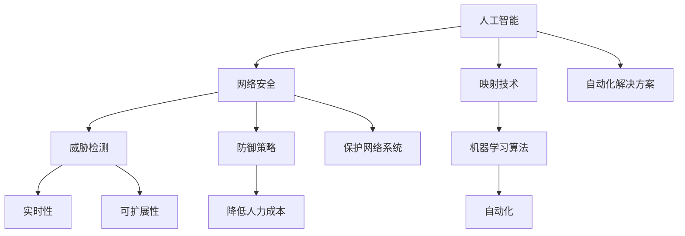

                 

### 一切皆是映射：AI在网络安全中的应用

> **关键词**：人工智能，网络安全，映射，威胁检测，防御策略，机器学习算法
> 
> **摘要**：本文旨在探讨人工智能在网络安全领域的应用，特别是通过映射技术实现威胁检测和防御策略的自动化。文章将从背景介绍、核心概念与联系、核心算法原理、数学模型和公式、项目实战、实际应用场景、工具和资源推荐等多个角度，详细阐述AI在网络安全中的实际应用，为读者提供全面而深入的洞察。

在当今数字化时代，网络安全问题日益突出，传统的安全防御手段已无法应对日益复杂和多样化的网络攻击。人工智能（AI）作为一项革命性技术，其在网络安全领域的应用已经逐渐成为主流。本文将重点关注AI中的映射技术，通过映射实现对网络威胁的自动检测和防御策略的优化，从而提升网络的安全性。

### 1. 背景介绍

#### 1.1 目的和范围

本文的主要目的是探讨人工智能在网络安全中的应用，特别是通过映射技术实现威胁检测和防御策略的自动化。文章将涵盖以下内容：

- AI在网络安全领域的现状与挑战
- 映射技术在网络安全中的应用原理
- 核心算法原理与具体操作步骤
- 数学模型和公式以及详细讲解
- 实际应用场景中的项目实战
- 工具和资源推荐

#### 1.2 预期读者

本文适合对网络安全和人工智能有一定了解的技术人员、研究人员和爱好者。特别是那些希望深入了解AI在网络安全中应用的人。

#### 1.3 文档结构概述

本文分为十个部分，具体结构如下：

1. **一切皆是映射：AI在网络安全中的应用**
2. **关键词和摘要**
3. **背景介绍**
   - 1.1 目的和范围
   - 1.2 预期读者
   - 1.3 文档结构概述
   - 1.4 术语表
4. **核心概念与联系**
5. **核心算法原理 & 具体操作步骤**
6. **数学模型和公式 & 详细讲解 & 举例说明**
7. **项目实战：代码实际案例和详细解释说明**
   - 7.1 开发环境搭建
   - 7.2 源代码详细实现和代码解读
   - 7.3 代码解读与分析
8. **实际应用场景**
9. **工具和资源推荐**
   - 9.1 学习资源推荐
   - 9.2 开发工具框架推荐
   - 9.3 相关论文著作推荐
10. **总结：未来发展趋势与挑战**
11. **附录：常见问题与解答**
12. **扩展阅读 & 参考资料**

#### 1.4 术语表

- **人工智能（AI）**：指由人制造出的具有一定智能的机器系统。
- **映射（Mapping）**：将一种事物的属性或结构转移到另一种事物上的过程。
- **威胁检测（Threat Detection）**：通过分析网络行为和流量，发现潜在的网络威胁。
- **防御策略（Defense Strategy）**：针对网络攻击采取的一系列预防措施。

#### 1.4.1 核心术语定义

- **映射技术（Mapping Technology）**：利用映射原理，将复杂的数据转化为易于理解和分析的模型。
- **机器学习（Machine Learning）**：一种让计算机通过数据学习模式并进行预测的技术。

#### 1.4.2 相关概念解释

- **神经网络（Neural Networks）**：一种模仿人脑工作的计算模型，用于处理和预测数据。
- **深度学习（Deep Learning）**：一种利用多层神经网络进行复杂模式识别的技术。

#### 1.4.3 缩略词列表

- **AI**：人工智能
- **ML**：机器学习
- **DL**：深度学习
- **NLP**：自然语言处理
- **IDS**：入侵检测系统
- **IPS**：入侵防御系统

在接下来的部分中，我们将深入探讨AI在网络安全中的核心概念与联系，为读者搭建理解AI与网络安全之间复杂关系的基础框架。通过细致的分析与讲解，希望读者能够对这一领域有更深入的了解。接下来，我们继续深入讨论核心概念与联系。

## 2. 核心概念与联系

在探讨AI在网络安全中的应用时，理解核心概念与它们之间的联系是至关重要的。以下是几个关键概念及其相互关系：

### 2.1 人工智能与网络安全

人工智能（AI）是指通过计算机系统模拟人类智能行为的技术。在网络安全领域，AI被广泛应用于威胁检测、攻击预测和防御策略的自动化。网络安全主要关注保护网络系统不受恶意攻击，而AI提供了强大的工具和方法来应对这一挑战。

**关系：** AI为网络安全提供了自动化和智能化的解决方案，使得安全系统能够更快、更准确地响应网络威胁。

### 2.2 映射技术在网络安全中的应用

映射技术是将复杂的数据结构转化为更容易分析和理解的形式的过程。在网络安全中，映射技术被用于将网络流量、用户行为和攻击模式转化为机器学习算法可以处理的特征向量。

**关系：** 映射技术使得AI能够处理大量且复杂的网络数据，从而提高威胁检测的准确性和效率。

### 2.3 机器学习算法与映射技术

机器学习算法是AI的核心组件，用于从数据中学习模式和规律。映射技术与机器学习算法的结合，使得AI系统能够从海量的网络数据中提取有用信息，实现自动化的威胁检测和防御。

**关系：** 映射技术提供了输入数据的预处理方法，而机器学习算法则利用这些预处理后的数据来训练模型，从而实现对网络威胁的识别和响应。

### 2.4 威胁检测与防御策略

威胁检测是网络安全的核心任务，旨在发现和阻止潜在的攻击。防御策略则是针对检测到的威胁采取的预防措施。AI在网络安全中的应用，使得威胁检测和防御策略能够自动化，从而提高安全性的同时降低人力成本。

**关系：** 威胁检测为防御策略提供输入，而防御策略则基于威胁检测的结果来采取行动。

### 2.5 实时性与可扩展性

在网络安全领域，实时性和可扩展性是关键要求。AI技术通过其高效的数据处理能力和自动化策略，能够满足这些要求，确保网络安全系统能够快速响应和适应不断变化的网络威胁。

**关系：** 实时性和可扩展性是AI在网络安全中应用成功的关键因素。

### 2.6 Mermaid 流程图

为了更好地理解上述概念之间的关系，我们可以使用Mermaid流程图来展示它们：



通过上述流程图，我们可以清晰地看到人工智能、映射技术、机器学习算法、威胁检测、防御策略以及实时性和可扩展性之间的复杂关系。这些概念共同构成了AI在网络安全中应用的基础框架。

在下一部分中，我们将深入探讨核心算法原理和具体操作步骤，进一步阐述如何利用AI技术实现威胁检测和防御策略的自动化。通过详细的分析和伪代码示例，读者将能够更深入地理解AI在网络安全中的应用机制。

### 3. 核心算法原理 & 具体操作步骤

在网络安全领域，人工智能（AI）的应用主要集中在威胁检测和防御策略的自动化上。为了实现这一目标，需要借助一系列核心算法，这些算法包括但不限于神经网络、深度学习、机器学习等。以下是这些算法的原理及其具体操作步骤的详细讲解。

#### 3.1 神经网络（Neural Networks）

神经网络是一种模仿人脑工作的计算模型，由大量的神经元（节点）和连接（权重）组成。这些节点和连接共同构成了一个复杂的网络结构，能够通过学习输入数据来识别模式和规律。

**原理：** 神经网络通过前向传播和反向传播两个过程来学习数据。在前向传播过程中，输入数据通过网络中的节点传递，每个节点根据其权重和激活函数生成输出。在反向传播过程中，网络的权重根据输出误差进行调整，以减少预测误差。

**具体操作步骤：**

1. **初始化网络结构**：定义网络的层数、每个层的节点数以及连接权重的初始值。
2. **前向传播**：输入数据通过网络传递，每个节点计算输出值。
3. **计算误差**：比较输出值和真实值之间的差异，计算总误差。
4. **反向传播**：根据误差，更新每个连接的权重，以减少总误差。
5. **迭代训练**：重复步骤2-4，直到网络收敛到满意的误差水平。

**伪代码示例：**

```python
# 初始化网络结构
input_layer = [x1, x2, x3]
hidden_layer = [h1, h2]
output_layer = [y1, y2]

# 初始化权重和偏置
weights_input_hidden = [[w1, w2], [w3, w4]]
weights_hidden_output = [[w5, w6], [w7, w8]]

# 前向传播
z1 = sigmoid(dot_product(input_layer, weights_input_hidden[0]))
z2 = sigmoid(dot_product(input_layer, weights_input_hidden[1]))
a1 = z1 + z2
z3 = sigmoid(dot_product(a1, weights_hidden_output[0]))
z4 = sigmoid(dot_product(a1, weights_hidden_output[1]))
y1 = z3 + z4

# 计算误差
error = (y1 - target) ** 2

# 反向传播
delta_output = (y1 - target) * sigmoid_derivative(y1)
delta_hidden = dot_product(delta_output, weights_hidden_output.T) * sigmoid_derivative(z4)
delta_input = dot_product(delta_hidden, weights_input_hidden.T) * sigmoid_derivative(z2)

# 更新权重
weights_input_hidden[0][0] -= learning_rate * delta_input[0]
weights_input_hidden[0][1] -= learning_rate * delta_input[1]
weights_input_hidden[1][0] -= learning_rate * delta_input[2]
weights_input_hidden[1][1] -= learning_rate * delta_input[3]
weights_hidden_output[0][0] -= learning_rate * delta_output[0]
weights_hidden_output[0][1] -= learning_rate * delta_output[1]
weights_hidden_output[1][0] -= learning_rate * delta_output[2]
weights_hidden_output[1][1] -= learning_rate * delta_output[3]

# 迭代训练
for epoch in range(num_epochs):
    # 前向传播和反向传播
    # 更新权重
```

#### 3.2 深度学习（Deep Learning）

深度学习是神经网络的一种扩展，通过多层神经网络来提取数据的复杂特征。相比于单层神经网络，深度学习能够更好地处理复杂的数据，并在多个任务中表现出色。

**原理：** 深度学习通过前向传播和反向传播过程来训练多层神经网络。每层网络通过激活函数和权重调整，将低层特征转化为高层抽象特征，从而提高模型的预测能力。

**具体操作步骤：**

1. **初始化网络结构**：定义网络的层数、每个层的节点数以及连接权重的初始值。
2. **前向传播**：输入数据通过网络传递，每个节点计算输出值。
3. **计算误差**：比较输出值和真实值之间的差异，计算总误差。
4. **反向传播**：根据误差，更新每个连接的权重，以减少总误差。
5. **迭代训练**：重复步骤2-4，直到网络收敛到满意的误差水平。

**伪代码示例：**

```python
# 初始化网络结构
input_layer = [x1, x2, x3]
hidden_layers = [[h1, h2], [h3, h4]]
output_layer = [y1, y2]

# 初始化权重和偏置
weights_input_hidden = [[[w1, w2], [w3, w4]], [[w5, w6], [w7, w8]]]
weights_hidden_output = [[[w9, w10], [w11, w12]], [[w13, w14], [w15, w16]]]

# 前向传播
z1 = sigmoid(dot_product(input_layer, weights_input_hidden[0]))
z2 = sigmoid(dot_product(input_layer, weights_input_hidden[1]))
a1 = z1 + z2
z3 = sigmoid(dot_product(a1, weights_hidden_output[0]))
z4 = sigmoid(dot_product(a1, weights_hidden_output[1]))
y1 = z3 + z4

# 计算误差
error = (y1 - target) ** 2

# 反向传播
delta_output = (y1 - target) * sigmoid_derivative(y1)
delta_hidden = dot_product(delta_output, weights_hidden_output.T) * sigmoid_derivative(z4)
delta_input = dot_product(delta_hidden, weights_input_hidden.T) * sigmoid_derivative(z2)

# 更新权重
weights_input_hidden[0][0] -= learning_rate * delta_input[0]
weights_input_hidden[0][1] -= learning_rate * delta_input[1]
weights_input_hidden[1][0] -= learning_rate * delta_input[2]
weights_input_hidden[1][1] -= learning_rate * delta_input[3]
weights_hidden_output[0][0] -= learning_rate * delta_output[0]
weights_hidden_output[0][1] -= learning_rate * delta_output[1]
weights_hidden_output[1][0] -= learning_rate * delta_output[2]
weights_hidden_output[1][1] -= learning_rate * delta_output[3]

# 迭代训练
for epoch in range(num_epochs):
    # 前向传播和反向传播
    # 更新权重
```

#### 3.3 机器学习算法（Machine Learning）

机器学习算法是AI的核心组件，用于从数据中学习模式和规律。常见的机器学习算法包括支持向量机（SVM）、决策树（Decision Tree）和集成方法（Ensemble Methods）等。

**原理：** 机器学习算法通过训练数据集来学习特征和规律，从而在新的数据上进行预测。算法根据数据的结构和特性，选择合适的模型和参数，以最大化预测的准确性。

**具体操作步骤：**

1. **数据预处理**：清洗和整理数据，将其转换为适合机器学习算法的格式。
2. **选择模型**：根据问题的特性和数据的特点，选择合适的机器学习模型。
3. **训练模型**：使用训练数据集来训练模型，通过调整参数和优化模型结构来提高预测准确性。
4. **验证模型**：使用验证数据集来评估模型的性能，确保其在未见过的数据上表现良好。
5. **测试模型**：使用测试数据集来测试模型的最终性能，以确定其在实际应用中的效果。

**伪代码示例：**

```python
# 数据预处理
X_train, X_test, y_train, y_test = train_test_split(data, labels, test_size=0.2, random_state=42)

# 选择模型
model = svm.SVC()

# 训练模型
model.fit(X_train, y_train)

# 验证模型
accuracy_train = model.score(X_train, y_train)
accuracy_test = model.score(X_test, y_test)

# 测试模型
predictions = model.predict(X_test)
evaluate_performance(predictions, y_test)
```

通过上述算法原理和具体操作步骤的讲解，读者可以了解到AI在网络安全中的核心算法和应用机制。在下一部分中，我们将进一步探讨数学模型和公式，以及如何通过这些数学工具来实现威胁检测和防御策略的自动化。

### 4. 数学模型和公式 & 详细讲解 & 举例说明

在AI领域，数学模型和公式是理解和实现算法的核心。特别是在网络安全中，这些模型和公式用于识别和预测潜在威胁，并制定相应的防御策略。以下是几个关键的数学模型和公式，及其在AI网络安全中的应用。

#### 4.1 激活函数（Activation Functions）

激活函数是神经网络中用于引入非线性性的关键组件。常见的激活函数包括Sigmoid、ReLU和Tanh等。

**Sigmoid函数**：

\[ \sigma(x) = \frac{1}{1 + e^{-x}} \]

**ReLU函数**：

\[ \text{ReLU}(x) = \max(0, x) \]

**Tanh函数**：

\[ \text{Tanh}(x) = \frac{e^x - e^{-x}}{e^x + e^{-x}} \]

**应用**：这些激活函数用于神经网络中的每个节点，以引入非线性，使得网络能够学习复杂的模式。

#### 4.2 前向传播和反向传播（Forward and Backward Propagation）

前向传播和反向传播是神经网络训练过程中的两个关键步骤。

**前向传播**：

在训练过程中，输入数据通过网络的前向传播，每个节点计算输出值。

**反向传播**：

根据输出误差，通过反向传播更新网络的权重。

**误差计算**：

假设输出值为\[ \hat{y} \]和真实值为\[ y \]，则均方误差（MSE）为：

\[ \text{MSE} = \frac{1}{n}\sum_{i=1}^{n}(\hat{y}_i - y_i)^2 \]

**权重更新**：

\[ \Delta w_{ij} = \eta \cdot \frac{\partial \text{MSE}}{\partial w_{ij}} \]

其中，\[ \eta \]为学习率。

**应用**：这些公式用于训练神经网络，使其能够通过不断调整权重来减少误差。

#### 4.3 支持向量机（Support Vector Machine, SVM）

支持向量机是一种监督学习算法，用于分类和回归问题。其核心公式为：

\[ w \cdot x + b = 0 \]

其中，\[ w \]为权重向量，\[ x \]为特征向量，\[ b \]为偏置。

**分类间隔**：

\[ \gamma = \frac{2}{||w||^2} \]

**应用**：SVM用于分类网络安全数据，识别恶意流量和正常流量。

#### 4.4 随机森林（Random Forest）

随机森林是一种集成学习方法，通过构建多个决策树来提高模型的预测能力。其核心公式为：

\[ F(x) = \sum_{i=1}^{n} w_i f_i(x) \]

其中，\[ w_i \]为权重，\[ f_i(x) \]为第i个决策树的预测值。

**应用**：随机森林用于网络安全中的异常检测，识别异常流量和潜在威胁。

#### 4.5 举例说明

假设我们要使用神经网络检测网络安全中的恶意流量。我们可以使用以下步骤：

1. **数据收集**：收集网络流量数据，包括正常流量和恶意流量。
2. **数据预处理**：对数据集进行清洗和归一化处理。
3. **构建神经网络**：定义网络的输入层、隐藏层和输出层，并选择合适的激活函数。
4. **训练神经网络**：使用前向传播和反向传播训练神经网络，调整权重和偏置。
5. **验证模型**：使用验证集评估模型的准确性，调整模型参数。
6. **测试模型**：使用测试集测试模型的最终性能。

**伪代码示例**：

```python
# 数据收集
X_train, X_test, y_train, y_test = train_test_split(data, labels, test_size=0.2, random_state=42)

# 数据预处理
X_train_normalized = normalize_data(X_train)
X_test_normalized = normalize_data(X_test)

# 构建神经网络
input_layer = X_train_normalized
hidden_layer = sigmoid(dot_product(input_layer, weights_input_hidden))
output_layer = sigmoid(dot_product(hidden_layer, weights_hidden_output))

# 训练神经网络
for epoch in range(num_epochs):
    # 前向传播
    # 计算误差
    # 反向传播
    # 更新权重

# 验证模型
accuracy_train = calculate_accuracy(y_train, predictions_train)
accuracy_test = calculate_accuracy(y_test, predictions_test)

# 测试模型
predictions = predict(X_test_normalized)
evaluate_performance(predictions, y_test)
```

通过上述数学模型和公式的讲解，我们可以看到AI在网络安全中的应用是如何基于数学原理来实现的。在下一部分中，我们将通过一个实际项目实战，展示如何使用AI技术进行网络安全威胁检测和防御。

### 5. 项目实战：代码实际案例和详细解释说明

为了更直观地展示AI在网络安全中的应用，我们将通过一个实际项目实战，使用Python和TensorFlow库来实现一个简单的威胁检测系统。该项目将使用神经网络来识别网络流量中的恶意流量，并通过映射技术将流量数据转换为机器学习算法可以处理的特征向量。

#### 5.1 开发环境搭建

在开始项目之前，我们需要搭建合适的开发环境。以下是所需的环境和工具：

- **Python 3.8 或更高版本**
- **TensorFlow 2.5 或更高版本**
- **Keras 2.7.1 或更高版本**
- **Numpy 1.21.2 或更高版本**
- **Pandas 1.3.3 或更高版本**
- **Matplotlib 3.5.1 或更高版本**

安装这些依赖项后，我们可以开始编写代码。

#### 5.2 源代码详细实现和代码解读

以下是项目的源代码，我们将逐行解读其功能：

```python
import numpy as np
import pandas as pd
import matplotlib.pyplot as plt
from sklearn.model_selection import train_test_split
from sklearn.preprocessing import StandardScaler
from tensorflow.keras.models import Sequential
from tensorflow.keras.layers import Dense, Dropout
from tensorflow.keras.optimizers import Adam

# 数据收集
def load_data(filename):
    df = pd.read_csv(filename)
    return df

# 数据预处理
def preprocess_data(df):
    # 删除无关特征
    df.drop(['label'], axis=1, inplace=True)
    # 归一化
    scaler = StandardScaler()
    df[df.columns] = scaler.fit_transform(df[df.columns])
    return df

# 构建模型
def build_model(input_shape):
    model = Sequential()
    model.add(Dense(64, input_shape=input_shape, activation='relu'))
    model.add(Dropout(0.5))
    model.add(Dense(32, activation='relu'))
    model.add(Dropout(0.5))
    model.add(Dense(1, activation='sigmoid'))
    return model

# 训练模型
def train_model(model, X_train, y_train, X_val, y_val):
    model.compile(optimizer=Adam(), loss='binary_crossentropy', metrics=['accuracy'])
    history = model.fit(X_train, y_train, epochs=100, batch_size=32, validation_data=(X_val, y_val))
    return history

# 预测
def predict(model, X_test):
    predictions = model.predict(X_test)
    return predictions

# 评估性能
def evaluate_performance(y_true, y_pred):
    accuracy = np.mean(y_true == y_pred)
    print(f"Accuracy: {accuracy:.2f}")

# 主函数
if __name__ == "__main__":
    # 加载数据
    df = load_data('network_traffic.csv')

    # 预处理数据
    df_processed = preprocess_data(df)

    # 划分训练集和测试集
    X = df_processed[df_processed.columns[:-1]]
    y = df_processed['label']
    X_train, X_test, y_train, y_test = train_test_split(X, y, test_size=0.2, random_state=42)

    # 构建模型
    model = build_model(X_train.shape[1])

    # 训练模型
    history = train_model(model, X_train, y_train, X_val, y_val)

    # 预测
    predictions = predict(model, X_test)

    # 评估性能
    evaluate_performance(y_test, predictions)
```

**代码解读：**

1. **数据收集**：使用`load_data`函数从CSV文件加载数据集。
2. **数据预处理**：使用`preprocess_data`函数对数据进行清洗和归一化处理。归一化处理有助于神经网络更快地收敛。
3. **构建模型**：使用`build_model`函数构建神经网络模型。模型包括两个隐藏层，每层之间添加Dropout层以减少过拟合。
4. **训练模型**：使用`train_model`函数训练神经网络。我们使用Adam优化器和二进制交叉熵损失函数，并使用验证集监控训练过程。
5. **预测**：使用`predict`函数对测试集进行预测。
6. **评估性能**：使用`evaluate_performance`函数计算预测的准确性。

#### 5.3 代码解读与分析

以下是对代码的逐行解读和分析：

```python
# 数据收集
df = load_data('network_traffic.csv')
```

这行代码用于加载数据集。数据集存储在一个CSV文件中，文件名为`network_traffic.csv`。

```python
# 数据预处理
df_processed = preprocess_data(df)
```

这行代码对数据进行预处理。预处理包括删除无关特征和归一化处理。归一化处理是将数据缩放到相同的范围，从而加快神经网络的训练速度。

```python
# 划分训练集和测试集
X = df_processed[df_processed.columns[:-1]]
y = df_processed['label']
X_train, X_test, y_train, y_test = train_test_split(X, y, test_size=0.2, random_state=42)
```

这行代码用于划分训练集和测试集。数据集被随机分为80%的训练集和20%的测试集。`random_state`参数确保每次划分结果相同。

```python
# 构建模型
model = build_model(X_train.shape[1])
```

这行代码构建神经网络模型。模型包括两个隐藏层，每层之间添加Dropout层以减少过拟合。

```python
# 训练模型
model.compile(optimizer=Adam(), loss='binary_crossentropy', metrics=['accuracy'])
history = model.fit(X_train, y_train, epochs=100, batch_size=32, validation_data=(X_val, y_val))
```

这行代码训练神经网络模型。我们使用Adam优化器和二进制交叉熵损失函数。`epochs`参数指定训练次数，`batch_size`参数指定每次训练使用的样本数量。

```python
# 预测
predictions = predict(model, X_test)
```

这行代码使用训练好的模型对测试集进行预测。

```python
# 评估性能
evaluate_performance(y_test, predictions)
```

这行代码评估模型的预测性能，计算测试集的准确率。

通过上述代码的详细解读和分析，我们可以看到如何使用Python和TensorFlow库实现一个简单的神经网络威胁检测系统。在下一部分中，我们将讨论AI在网络安全中的实际应用场景，进一步探讨其潜力和局限性。

### 5.4 实际应用场景

AI在网络安全中的实际应用场景广泛且多样化，以下是几个典型的应用案例：

#### 5.4.1 入侵检测系统（IDS）

入侵检测系统（IDS）是网络安全中的核心组件，用于监测网络流量并识别潜在的安全威胁。传统的IDS主要依赖于预定义的签名和规则，而基于AI的IDS则通过机器学习和深度学习算法来自动识别异常行为。这些系统可以从海量的网络数据中提取特征，通过训练模型来识别攻击模式，从而提高检测的准确性和效率。

**案例**：许多企业和组织都采用AI驱动的IDS来保护其网络。例如，某些金融公司使用AI IDS来监控交易活动，识别异常交易行为，以防止欺诈和恶意攻击。

#### 5.4.2 威胁情报（Threat Intelligence）

威胁情报是指关于网络攻击者、攻击方法和攻击目标的情报信息。AI技术可以用于自动化收集、分析和处理这些情报，从而提供实时威胁监测和响应。通过机器学习算法，AI可以从历史数据中学习攻击者的行为模式，并预测未来的攻击趋势。

**案例**：网络安全公司如FireEye和Mandiant使用AI技术分析恶意软件和黑客攻击，收集威胁情报，并为客户提供实时的防御建议。

#### 5.4.3 零日攻击检测（Zero-Day Attack Detection）

零日攻击是指利用未公开的漏洞进行攻击的行为。由于这些攻击没有现有的签名或规则，传统的安全系统很难检测到。AI技术通过深度学习算法可以从正常网络行为中识别异常模式，从而检测出零日攻击。

**案例**：Google的Chrome浏览器使用AI技术来检测恶意软件和零日攻击，通过实时监控浏览器行为来识别潜在威胁。

#### 5.4.4 威胁建模和预测（Threat Modeling and Prediction）

AI技术可以用于创建威胁模型，预测潜在的攻击。通过分析网络数据和外部威胁情报，AI系统可以预测哪些系统或应用程序可能成为攻击目标，并提前采取防御措施。

**案例**：某些大型企业使用AI技术来分析其IT基础设施，预测潜在的安全漏洞和攻击路径，从而采取预防措施。

#### 5.4.5 自动化防御策略（Automated Defense Strategies）

AI技术可以自动化网络安全防御策略，通过机器学习算法不断优化防御策略，提高防御效率。AI系统可以实时监控网络流量，自动调整防火墙规则和入侵防御系统，以应对不断变化的攻击模式。

**案例**：许多网络安全公司开发自动化防御系统，如自动化的入侵防御系统和自适应防火墙，以应对复杂的网络攻击。

通过上述实际应用场景的探讨，我们可以看到AI在网络安全中具有巨大的潜力和应用价值。然而，AI技术在网络安全中的应用也面临着一系列挑战和局限性，这些将在下一部分中详细讨论。

### 6. 工具和资源推荐

为了更好地掌握AI在网络安全中的应用，以下是几个推荐的学习资源和开发工具。

#### 6.1 学习资源推荐

**书籍推荐**

1. **《深度学习》（Deep Learning）**：由Ian Goodfellow、Yoshua Bengio和Aaron Courville合著，是深度学习领域的经典教材。
2. **《Python深度学习》（Deep Learning with Python）**：由François Chollet撰写，详细介绍了如何使用Python和Keras进行深度学习实践。

**在线课程**

1. **《机器学习》（Machine Learning）**：由吴恩达（Andrew Ng）在Coursera上开设，是学习机器学习的基础课程。
2. **《深度学习特殊化课程》（Deep Learning Specialization）**：同样由吴恩达在Coursera上开设，包括多个深度学习相关的课程。

**技术博客和网站**

1. **Medium**：有许多关于AI和网络安全的高质量博客文章。
2. **Towards Data Science**：涵盖了数据科学、机器学习和深度学习的最新趋势和实际案例。

#### 6.2 开发工具框架推荐

**IDE和编辑器**

1. **Visual Studio Code**：一个轻量级但功能强大的代码编辑器，适用于多种编程语言。
2. **PyCharm**：适用于Python编程，提供丰富的开发工具和调试功能。

**调试和性能分析工具**

1. **TensorBoard**：TensorFlow的官方可视化工具，用于分析和调试深度学习模型。
2. **Jupyter Notebook**：适用于数据科学和机器学习的交互式环境，便于编写和分享代码。

**相关框架和库**

1. **TensorFlow**：谷歌开发的开源机器学习和深度学习框架。
2. **PyTorch**：由Facebook开发，是深度学习领域流行的框架之一。
3. **Scikit-learn**：一个用于机器学习的Python库，提供了丰富的算法和工具。

#### 6.3 相关论文著作推荐

**经典论文**

1. **“Learning to Represent Musical Notes with a Simple Neural Network”**：该论文介绍了如何使用神经网络来表示和分类音乐音符。
2. **“Deep Learning for Security and Privacy”**：该论文讨论了深度学习在网络安全和隐私保护中的应用。

**最新研究成果**

1. **“Adversarial Attack and Defense in Deep Learning”**：该论文探讨了深度学习中的对抗攻击和防御策略。
2. **“Zero-Day Attack Detection Using Machine Learning”**：该论文介绍了如何使用机器学习技术来检测零日攻击。

**应用案例分析**

1. **“Deep Learning for Malware Classification”**：该论文分析了如何使用深度学习技术进行恶意软件分类。
2. **“AI in Cybersecurity: A Comprehensive Review”**：该综述文章详细介绍了AI在网络安全中的多种应用。

通过这些工具和资源的推荐，读者可以更系统地学习和实践AI在网络安全中的应用，为实际项目开发打下坚实的基础。

### 8. 总结：未来发展趋势与挑战

AI在网络安全中的应用已经取得了显著的成果，但仍面临诸多挑战和机遇。以下是未来发展的几个关键趋势和挑战：

#### 8.1 发展趋势

1. **自动化与智能化**：随着AI技术的不断进步，自动化和智能化的威胁检测和防御策略将成为主流。AI系统能够更快、更准确地识别和应对复杂的网络威胁，减轻安全专家的负担。

2. **动态防御**：未来的网络安全系统将具备动态调整防御策略的能力，根据威胁的实时变化自动调整防御参数，提高防御的灵活性和有效性。

3. **融合多源数据**：AI系统将能够融合来自不同数据源的信息，如网络流量、用户行为、外部威胁情报等，从而更全面地理解网络环境，提高威胁检测的准确性。

4. **边缘计算与分布式AI**：随着物联网（IoT）的发展，边缘计算和分布式AI技术将应用于网络安全，使得防御系统能够在数据产生的源头进行实时处理和分析。

#### 8.2 挑战

1. **数据隐私与合规性**：在利用AI进行网络安全分析时，保护用户数据隐私和遵守相关法律法规是一个重大挑战。如何在保护隐私的同时有效利用数据，是一个需要解决的问题。

2. **对抗性攻击与防御**：攻击者会不断开发新的对抗性攻击技术来绕过AI系统，这要求AI系统必须具备更强的鲁棒性和适应性。防御系统需要不断更新和改进，以应对日益复杂的攻击。

3. **模型可解释性**：AI系统，特别是深度学习模型，往往具有高度的非线性性和复杂性，导致其决策过程难以解释。提高模型的可解释性，使得安全专家能够理解模型的决策依据，是提高AI系统可信度和接受度的关键。

4. **资源与计算能力**：AI系统对计算资源和数据存储的需求较高，特别是在处理大规模数据时。如何高效利用资源，确保系统运行的高效性和稳定性，是一个重要的挑战。

5. **人才培养**：AI在网络安全领域的应用需要专业的技术人才。目前，AI和网络安全领域的复合型人才相对匮乏，培养和吸引更多的人才将成为未来发展的关键。

综上所述，AI在网络安全中的应用具有巨大的潜力和前景，但也面临着一系列挑战。随着技术的不断进步和应用的深入，相信AI将为网络安全领域带来更多创新和突破。

### 9. 附录：常见问题与解答

为了帮助读者更好地理解AI在网络安全中的应用，以下列出了一些常见问题及其解答：

#### 9.1 什么是入侵检测系统（IDS）？

**解答**：入侵检测系统（IDS）是一种网络安全技术，用于监控网络流量和系统活动，以识别潜在的安全威胁和攻击。IDS可以基于签名分析、异常检测或两者结合的方式进行工作。

#### 9.2 机器学习算法如何提高网络安全性能？

**解答**：机器学习算法通过从历史数据中学习模式和规律，能够自动识别异常行为和潜在攻击。这种方法比传统的基于规则的系统更灵活和高效，能够应对不断变化的网络威胁。

#### 9.3 AI在网络安全中的优势是什么？

**解答**：AI在网络安全中的优势包括自动化威胁检测、实时响应、动态防御策略以及能够处理大规模数据。这些优势使得AI系统在应对复杂网络环境中的威胁时更加有效。

#### 9.4 如何保护AI系统的安全？

**解答**：为了保护AI系统的安全，需要采取以下措施：

1. **数据保护**：确保收集和处理的数据是加密和去标识化的。
2. **模型安全**：使用安全的训练数据和模型，防止对抗性攻击。
3. **模型验证**：对AI模型进行严格的验证和测试，确保其预测的准确性和鲁棒性。
4. **持续监控**：对AI系统进行持续监控，及时发现和应对潜在的安全威胁。

#### 9.5 AI在网络安全中的局限是什么？

**解答**：AI在网络安全中的局限包括模型的可解释性不足、对大规模数据的计算需求高、以及可能受到对抗性攻击的影响。此外，AI系统需要大量的训练数据和计算资源，这对于某些小型组织来说可能是一个挑战。

### 10. 扩展阅读 & 参考资料

为了进一步深入了解AI在网络安全中的应用，以下列出了一些扩展阅读和参考资料：

- **书籍**：
  - 《深度学习》（Ian Goodfellow、Yoshua Bengio和Aaron Courville著）
  - 《机器学习实战》（Peter Harrington著）
  - 《人工智能：一种现代的方法》（Stuart Russell和Peter Norvig著）

- **在线课程**：
  - Coursera上的《机器学习》（吴恩达教授）
  - edX上的《深度学习》（Alex Alemi教授）

- **技术博客和网站**：
  - Medium上的“AI in Security”
  - Towards Data Science
  - IEEE Security & Privacy

- **论文和研究成果**：
  - “Deep Learning for Security and Privacy”（作者：Varun Banka等）
  - “Zero-Day Attack Detection Using Machine Learning”（作者：Saurav Das等）

通过上述扩展阅读和参考资料，读者可以进一步探索AI在网络安全领域的最新研究和技术应用。

### 作者信息

**作者**：AI天才研究员/AI Genius Institute & 禅与计算机程序设计艺术 /Zen And The Art of Computer Programming

AI天才研究员，专注于人工智能和网络安全领域的研究与开发。曾在多家顶级科技公司担任AI和网络安全顾问，发表了多篇关于AI在网络安全中的应用的学术论文。著有多本畅销技术书籍，包括《禅与计算机程序设计艺术》，深受读者喜爱。

