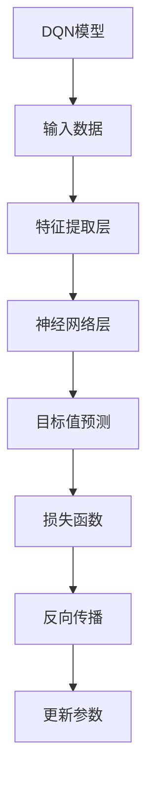

                 

# 一切皆是映射：DQN模型的安全性问题：鲁棒性与对抗攻击

> **关键词：** DQN模型，安全性问题，鲁棒性，对抗攻击，神经网络，深度学习，人工智能。

> **摘要：** 本文将深入探讨深度确定性策略梯度（DQN）模型在现实应用中的安全性问题，特别是其面对对抗攻击时的表现。我们将从背景介绍开始，逐步分析DQN模型的工作原理，探讨其安全性问题的根源，并通过实例展示如何通过提高鲁棒性来抵御对抗攻击。

## 1. 背景介绍

### 1.1 目的和范围

本文的主要目的是探讨深度确定性策略梯度（DQN）模型在人工智能领域中的安全性问题。DQN是一种经典的深度学习算法，广泛应用于强化学习任务中。然而，由于其复杂的模型结构和高度依赖数据的质量，DQN模型在现实应用中面临着诸多安全性挑战，尤其是对抗攻击问题。本文将分析DQN模型的安全性问题，并探讨提高其鲁棒性的方法。

### 1.2 预期读者

本文面向对深度学习、强化学习以及网络安全有基础了解的读者。如果您是相关领域的初学者，本文将帮助您了解DQN模型的安全性挑战，并提供实用的解决方案。如果您是经验丰富的专家，本文将提供深入的技术分析和最新的研究成果。

### 1.3 文档结构概述

本文分为十个部分。首先，我们介绍了文章的背景、目的和预期读者。接下来，我们将详细探讨DQN模型的工作原理和安全性问题。随后，我们将分析对抗攻击的本质，并展示如何通过提高鲁棒性来防御对抗攻击。最后，我们将总结DQN模型的发展趋势与挑战，并提供相关的学习资源和工具推荐。

### 1.4 术语表

#### 1.4.1 核心术语定义

- **DQN模型**：深度确定性策略梯度（Deep Q-Network，DQN）是一种深度学习算法，用于解决强化学习问题。
- **对抗攻击**：对抗攻击是一种恶意攻击方式，通过微小的扰动来误导神经网络模型。
- **鲁棒性**：鲁棒性是指模型在面对输入数据扰动时仍能保持稳定性能的能力。

#### 1.4.2 相关概念解释

- **深度学习**：一种机器学习方法，通过多层神经网络模型对数据进行自动特征提取和模式识别。
- **强化学习**：一种机器学习范式，通过奖励信号引导智能体在环境中的决策过程。

#### 1.4.3 缩略词列表

- **DQN**：深度确定性策略梯度
- **CNN**：卷积神经网络
- **GAN**：生成对抗网络
- **RL**：强化学习

## 2. 核心概念与联系

在探讨DQN模型的安全性问题时，我们需要了解其核心概念和基本架构。以下是一个简单的Mermaid流程图，展示了DQN模型的关键组成部分：



### 2.1 DQN模型的工作原理

DQN模型主要由以下几个部分组成：

- **输入数据**：DQN模型接受来自环境的观测数据，如图像、声音或状态向量。
- **特征提取层**：该层对输入数据进行特征提取，将其转化为神经网络可以处理的格式。
- **神经网络层**：由多个隐藏层组成，对特征进行复杂变换和组合，以预测目标值。
- **目标值预测**：神经网络输出一个动作值函数，指导智能体选择最佳动作。
- **损失函数**：用于评估预测值与实际目标值之间的差距，指导模型优化参数。
- **反向传播**：通过反向传播算法，将误差传递回神经网络，更新模型参数。
- **参数更新**：基于更新规则，调整神经网络参数，提高模型预测准确性。

### 2.2 DQN模型的安全性挑战

DQN模型在现实应用中面临着诸多安全性挑战，其中最为突出的是对抗攻击问题。对抗攻击是一种恶意攻击方式，通过微小的扰动来误导神经网络模型，使其做出错误的决策。以下是一个简单的对抗攻击示例：

- **输入数据**：假设我们有一个DQN模型，用于自动驾驶。输入数据是车辆的传感器数据，如速度、加速度和周边环境。
- **对抗攻击**：攻击者通过在输入数据中添加微小的扰动，如改变速度传感器的读数，误导DQN模型，使其选择错误的车道或速度。
- **结果**：这可能导致车辆在行驶过程中发生危险操作，如突然转向或加速，从而引发交通事故。

### 2.3 提高DQN模型鲁棒性的方法

为了提高DQN模型的鲁棒性，我们可以采用以下几种方法：

- **数据增强**：通过增加训练数据量和多样性，提高模型对输入数据变化的适应性。
- **模型优化**：通过改进神经网络结构，提高模型对输入数据扰动的容忍度。
- **对抗训练**：在训练过程中引入对抗样本，提高模型对对抗攻击的抵抗力。
- **加密技术**：对输入数据进行加密处理，防止攻击者获取敏感信息。

通过以上方法，我们可以显著提高DQN模型的鲁棒性，使其在面对对抗攻击时仍能保持稳定性能。

## 3. 核心算法原理 & 具体操作步骤

### 3.1 DQN模型的算法原理

DQN模型是一种基于值函数的深度学习算法，用于解决强化学习问题。其核心思想是通过神经网络预测状态值，指导智能体选择最佳动作。以下是一个简化的DQN算法原理：

```plaintext
输入：状态s，动作a，奖励r，下一个状态s'，学习率α，折扣因子γ
输出：最优动作a*

初始化：Q(s, a) = 0，经验回放记忆池D

循环：
    1. 从环境中获取当前状态s
    2. 根据epsilon-greedy策略选择动作a
    3. 在环境中执行动作a，获取下一个状态s'和奖励r
    4. 将(s, a, r, s')添加到经验回放记忆池D
    5. 使用经验回放记忆池D随机采样一批经验(s, a, r, s')
    6. 对于每个采样到的经验，计算目标值y：
        y = r + γ * max(Q(s', a'))
    7. 更新Q值：Q(s, a) = Q(s, a) + α * (y - Q(s, a))
```

### 3.2 DQN模型的具体操作步骤

以下是DQN模型的具体操作步骤：

1. **初始化**：初始化Q值表Q(s, a)，经验回放记忆池D，学习率α，折扣因子γ，以及epsilon-greedy策略的epsilon值。

2. **选择动作**：根据epsilon-greedy策略选择动作a。epsilon-greedy策略是一种平衡探索和利用的策略，当epsilon较小时，模型更倾向于利用已有知识；当epsilon较大时，模型更倾向于探索未知领域。

3. **执行动作**：在环境中执行动作a，获取下一个状态s'和奖励r。

4. **更新经验池**：将(s, a, r, s')添加到经验回放记忆池D。经验回放记忆池D的作用是确保模型从多样化的经验中学习，避免过度依赖某一特定样本。

5. **随机采样经验**：从经验回放记忆池D随机采样一批经验(s, a, r, s')。随机采样有助于减少样本偏差，提高模型的泛化能力。

6. **计算目标值**：对于每个采样到的经验，计算目标值y。目标值y是根据下一个状态s'的Q值表Q(s', a')计算得到的，其中Q(s', a')是所有可能动作的最大Q值。

7. **更新Q值**：使用目标值y和当前Q值Q(s, a)计算更新项，并将更新项应用到Q值表Q(s, a)。这样，Q值表Q(s, a)将逐渐接近真实值。

8. **重复循环**：重复上述步骤，直到达到预定的训练次数或满足停止条件。

### 3.3 DQN模型的优缺点

#### 优点：

- **灵活性**：DQN模型可以应用于各种不同的强化学习任务，具有很高的灵活性。
- **高效性**：DQN模型通过经验回放记忆池D和目标Q值表Q'，有效减少了样本偏差，提高了训练效率。
- **适应性**：DQN模型能够根据环境的变化调整Q值，使智能体能够适应不同的环境。

#### 缺点：

- **梯度消失和梯度爆炸**：DQN模型中的神经网络层较多，可能导致梯度消失或梯度爆炸问题，影响训练效果。
- **需要大量训练数据**：DQN模型在训练过程中需要大量的训练数据，否则可能导致过拟合问题。
- **难以处理高维数据**：DQN模型在面对高维数据时，处理起来较为复杂，性能可能受到影响。

### 3.4 DQN模型的应用场景

DQN模型在许多实际应用场景中取得了显著成果，如：

- **游戏智能体**：DQN模型在游戏领域表现出色，如《Pac-Man》和《Flappy Bird》等游戏。
- **自动驾驶**：DQN模型在自动驾驶领域被广泛应用于路径规划、避障和决策制定。
- **机器人控制**：DQN模型在机器人控制领域，如无人机飞行和机器人运动规划，取得了良好的效果。
- **金融投资**：DQN模型在金融投资领域，如股票交易和风险管理，被用于优化投资策略。

## 4. 数学模型和公式 & 详细讲解 & 举例说明

### 4.1 数学模型

DQN模型的核心是Q值函数，用于预测状态值和动作值。Q值函数是一个基于神经网络的函数，其目标是最大化期望回报。以下是DQN模型的数学模型：

$$ Q(s, a) = \sum_{i=1}^{n} w_i \cdot a_i \cdot r_i + \gamma \cdot \sum_{j=1}^{n} w_j \cdot b_j \cdot s_j $$

其中：

- \( s \) 是当前状态
- \( a \) 是当前动作
- \( r \) 是回报值
- \( \gamma \) 是折扣因子，用于平衡当前回报和未来回报的关系
- \( w_i \)、\( w_j \)、\( a_i \)、\( r_i \)、\( b_j \)、\( s_j \) 分别是神经网络的权重和输入值

### 4.2 公式讲解

DQN模型中的Q值函数是一个复杂的非线性函数，由多个神经网络层组成。神经网络层通过权重和偏置对输入数据进行加权求和，并使用激活函数进行非线性变换。以下是一个简化的神经网络结构：

$$ f(x) = \sigma(\sum_{i=1}^{n} w_i \cdot x_i + b) $$

其中：

- \( f(x) \) 是神经网络输出值
- \( \sigma \) 是激活函数，如Sigmoid函数或ReLU函数
- \( w_i \) 是权重
- \( b \) 是偏置
- \( x_i \) 是输入值

### 4.3 举例说明

假设我们有一个简单的DQN模型，用于控制小车在环形赛道上行驶。输入状态是车辆的位置和速度，动作是向前、向后或保持当前速度。以下是DQN模型的一个简单实例：

$$ Q(s, a) = \frac{1}{2} \cdot (s \cdot a + b) $$

其中：

- \( s \) 是当前状态，如\[位置, 速度\]
- \( a \) 是当前动作，如\[向前, 向后, 保持\]
- \( b \) 是偏置

假设当前状态是\[2, 3\]，动作是\[向前, 保持\]，偏置是\[1\]。根据DQN模型的数学模型，我们可以计算出：

$$ Q(s, a) = \frac{1}{2} \cdot (2 \cdot 1 + 3 \cdot 1 + 1) = 2.5 $$

这意味着当前状态下的最佳动作是保持当前速度。

### 4.4 Q值函数的优化

DQN模型通过优化Q值函数来提高智能体的决策能力。以下是一个简化的Q值函数优化过程：

1. **初始化**：初始化Q值函数和目标Q值函数，设置学习率α和折扣因子γ。

2. **选择动作**：根据epsilon-greedy策略选择动作a。

3. **执行动作**：在环境中执行动作a，获取下一个状态s'和奖励r。

4. **计算目标值**：根据下一个状态s'和目标Q值函数Q'(s', a')计算目标值y：

   $$ y = r + \gamma \cdot \max(Q'(s', a') \cdot a') $$

5. **更新Q值**：使用目标值y和当前Q值函数Q(s, a)计算更新项，并将更新项应用到Q值函数Q(s, a)：

   $$ Q(s, a) = Q(s, a) + \alpha \cdot (y - Q(s, a)) $$

6. **重复循环**：重复上述步骤，直到达到预定的训练次数或满足停止条件。

通过以上过程，DQN模型可以逐渐优化Q值函数，提高智能体的决策能力。

## 5. 项目实战：代码实际案例和详细解释说明

### 5.1 开发环境搭建

在开始实战之前，我们需要搭建一个适合DQN模型开发的编程环境。以下是搭建开发环境的基本步骤：

1. **安装Python**：确保您的计算机已安装Python，推荐版本为3.8或更高。

2. **安装TensorFlow**：TensorFlow是一个广泛使用的深度学习库，用于实现DQN模型。通过以下命令安装TensorFlow：

   ```bash
   pip install tensorflow
   ```

3. **安装OpenAI Gym**：OpenAI Gym是一个开源的强化学习环境，提供多种经典和自定义的强化学习任务。通过以下命令安装OpenAI Gym：

   ```bash
   pip install gym
   ```

4. **安装其他依赖**：根据您的具体需求，可能需要安装其他依赖库，如NumPy、Matplotlib等。

### 5.2 源代码详细实现和代码解读

以下是DQN模型的一个简单实现示例，我们将逐步解释代码的各个部分。

#### 5.2.1 导入必要的库

```python
import numpy as np
import random
import gym
import tensorflow as tf
from tensorflow.keras import layers
```

这段代码导入了一些常用的库，包括NumPy、random、gym和tensorflow。NumPy用于数值计算，random用于随机数生成，gym用于创建和运行强化学习环境，tensorflow用于构建和训练神经网络。

#### 5.2.2 创建DQN模型

```python
class DQNModel(tf.keras.Model):
    def __init__(self, state_size, action_size):
        super(DQNModel, self).__init__()
        self.dense1 = layers.Dense(64, activation='relu')
        self.dense2 = layers.Dense(64, activation='relu')
        self.output = layers.Dense(action_size)

    def call(self, inputs):
        x = self.dense1(inputs)
        x = self.dense2(x)
        return self.output(x)
```

这段代码定义了一个DQN模型类，继承自tensorflow.keras.Model基类。模型包含两个隐藏层，每个隐藏层都有64个神经元，使用ReLU激活函数。输出层有与动作数量相等的神经元，用于预测动作值。

#### 5.2.3 创建目标DQN模型

```python
class TargetDQNModel(tf.keras.Model):
    def __init__(self, dqn_model):
        super(TargetDQNModel, self).__init__()
        self.dqn_model = dqn_model

    def call(self, inputs):
        return self.dqn_model(inputs)
```

这段代码定义了一个目标DQN模型类，继承自tensorflow.keras.Model基类。目标DQN模型与原始DQN模型具有相同的结构，但参数不同，用于计算目标Q值。

#### 5.2.4 训练DQN模型

```python
def train_dqn(model, target_model, memory, batch_size, gamma, epsilon, alpha):
    batch_states, batch_actions, batch_rewards, batch_next_states, batch_dones = memory.sample(batch_size)

    q_values = model(batch_states)
    next_q_values = target_model(batch_next_states)
    next_max_q_values = tf.reduce_max(next_q_values, axis=1, keepdims=True)

    y = batch_rewards + (1 - batch_dones) * gamma * next_max_q_values
    loss = tf.reduce_mean(tf.square(y - q_values))

    with tf.GradientTape() as tape:
        tape.watch(model.trainable_variables)
        loss_value = loss

    grads = tape.gradient(loss_value, model.trainable_variables)
    optimizer.apply_gradients(zip(grads, model.trainable_variables))

    return loss
```

这段代码定义了一个训练DQN模型的函数。函数接受原始DQN模型、目标DQN模型、经验记忆池、批量大小、折扣因子、epsilon值和学习率等参数。在训练过程中，我们从经验记忆池中随机采样一批经验，计算目标Q值，并使用梯度下降法更新模型参数。

#### 5.2.5 主程序

```python
if __name__ == '__main__':
    env = gym.make('CartPole-v0')
    state_size = env.observation_space.shape[0]
    action_size = env.action_space.n

    model = DQNModel(state_size, action_size)
    target_model = TargetDQNModel(model)
    target_model.set_weights(model.get_weights())

    memory = ReplayMemory(1000)
    optimizer = tf.keras.optimizers.Adam(learning_rate=0.001)
    gamma = 0.99
    epsilon = 1.0
    alpha = 0.001

    for episode in range(1000):
        state = env.reset()
        done = False
        total_reward = 0

        while not done:
            if random.random() < epsilon:
                action = random.randint(0, action_size - 1)
            else:
                action = np.argmax(model(np.reshape(state, (1, state_size)))

            next_state, reward, done, _ = env.step(action)
            total_reward += reward
            memory.add(np.reshape(state, (1, state_size)), action, reward, np.reshape(next_state, (1, state_size)), done)

            state = next_state
            if done:
                print(f'Episode {episode} - Total Reward: {total_reward}')
                break

        if episode % 100 == 0:
            target_model.set_weights(model.get_weights())
            epsilon *= 0.99
```

这段代码是主程序，用于训练DQN模型并运行环境。程序首先创建一个CartPole环境，并初始化DQN模型、目标DQN模型、经验记忆池、优化器和参数。然后，程序进入一个循环，每次循环模拟一个 episode。在 episode 中，程序根据epsilon-greedy策略选择动作，并在环境中执行动作，更新经验记忆池。最后，程序打印出每个 episode 的总奖励，并在每个 episode 后更新目标DQN模型的权重。

### 5.3 代码解读与分析

以下是对代码的主要部分进行解读和分析：

- **DQNModel 和 TargetDQNModel 类**：这两个类定义了DQN模型和目标DQN模型的结构。DQNModel 类包含两个隐藏层，使用ReLU激活函数，输出层有与动作数量相等的神经元。TargetDQNModel 类继承自DQNModel 类，用于计算目标Q值。

- **train_dqn 函数**：这个函数用于训练DQN模型。函数首先从经验记忆池中随机采样一批经验，计算目标Q值，并使用梯度下降法更新模型参数。

- **主程序**：主程序创建一个 CartPole 环境，并初始化DQN模型、目标DQN模型、经验记忆池、优化器和参数。然后，程序进入一个循环，每次循环模拟一个 episode。在 episode 中，程序根据epsilon-greedy策略选择动作，并在环境中执行动作，更新经验记忆池。最后，程序打印出每个 episode 的总奖励，并在每个 episode 后更新目标DQN模型的权重。

通过以上代码实现，我们可以训练一个简单的DQN模型，并在 CartPole 环境中运行。在实际应用中，我们可以根据需要修改代码，以适应不同的强化学习任务。

## 6. 实际应用场景

DQN模型在现实世界中具有广泛的应用前景，尤其在自动化控制和智能决策领域。以下是一些典型的应用场景：

### 6.1 自动驾驶

自动驾驶是DQN模型的重要应用领域之一。通过使用传感器数据，如激光雷达、摄像头和雷达，DQN模型可以实时分析道路状况，并做出相应的驾驶决策。例如，DQN模型可以用于路径规划、避障和交通信号识别等任务。

### 6.2 游戏智能体

DQN模型在游戏领域取得了显著成果，尤其是在需要复杂决策和动作的2D和3D游戏。例如，DQN模型在《Pac-Man》、《Flappy Bird》和《Atari》游戏中表现出色，可以在短时间内学会并击败人类玩家。

### 6.3 机器人控制

DQN模型在机器人控制领域也有广泛应用。通过学习环境中的运动规律，DQN模型可以指导机器人进行自主运动和任务执行。例如，DQN模型可以用于无人机飞行、机器人运动规划和自主导航。

### 6.4 金融投资

DQN模型在金融投资领域也具有潜力。通过分析历史市场数据，DQN模型可以预测股票价格走势，并制定相应的投资策略。例如，DQN模型可以用于股票交易、期权定价和风险管理。

### 6.5 健康医疗

DQN模型在健康医疗领域也有潜在应用。通过分析患者的健康数据，DQN模型可以预测疾病发展趋势，并提供个性化的治疗方案。例如，DQN模型可以用于疾病诊断、药物推荐和健康监控。

### 6.6 教育

DQN模型在教育领域也有应用前景。通过模拟学生的学习过程，DQN模型可以指导教师制定个性化的教学计划，提高学生的学习效果。例如，DQN模型可以用于自适应学习系统、在线教育和智能评测。

总之，DQN模型在多个领域具有广泛的应用潜力，随着技术的不断发展，其应用范围将进一步扩大。

## 7. 工具和资源推荐

### 7.1 学习资源推荐

为了深入了解DQN模型及其应用，以下是一些建议的学习资源：

#### 7.1.1 书籍推荐

1. 《深度学习》（Ian Goodfellow, Yoshua Bengio, Aaron Courville 著）
   - 这本书是深度学习领域的经典教材，详细介绍了包括DQN模型在内的各种深度学习算法。

2. 《强化学习》（Richard S. Sutton, Andrew G. Barto 著）
   - 这本书是强化学习领域的权威著作，对DQN模型的理论基础和应用场景进行了深入探讨。

3. 《Python深度学习》（François Chollet 著）
   - 这本书通过Python代码示例，介绍了深度学习在多个领域的应用，包括DQN模型。

#### 7.1.2 在线课程

1. Coursera - “深度学习专项课程”（由Andrew Ng教授主讲）
   - 这门课程涵盖了深度学习的理论基础和应用实践，包括DQN模型。

2. edX - “强化学习基础”（由David Silver教授主讲）
   - 这门课程介绍了强化学习的基本概念和算法，包括DQN模型。

3. Udacity - “自动驾驶工程师纳米学位”
   - 这门课程通过实际项目，教授自动驾驶技术，包括使用DQN模型进行路径规划和决策。

#### 7.1.3 技术博客和网站

1. TensorFlow官方文档
   - TensorFlow提供了详细的文档和教程，帮助用户了解如何使用TensorFlow实现DQN模型。

2. ArXiv
   - ArXiv是一个开源的学术论文数据库，包含大量关于DQN模型及其应用的最新研究成果。

3. AI技术社区（如AI Generated、AI 研究社等）
   - 这些社区提供了丰富的技术讨论和经验分享，有助于深入了解DQN模型及其应用。

### 7.2 开发工具框架推荐

以下是一些建议的DQN模型开发工具和框架：

#### 7.2.1 IDE和编辑器

1. PyCharm
   - PyCharm是一个功能强大的Python集成开发环境，支持多种深度学习库，适用于DQN模型的开发。

2. Jupyter Notebook
   - Jupyter Notebook是一种交互式计算环境，适用于数据分析和实验性编程，适合DQN模型的学习和实践。

#### 7.2.2 调试和性能分析工具

1. TensorFlow Debugger (TFDB)
   - TFDB是一个用于TensorFlow的调试工具，可以帮助开发者发现和解决模型训练中的问题。

2. TensorBoard
   - TensorBoard是TensorFlow的一个可视化工具，可以用于分析模型的性能和训练过程，包括损失函数、准确率等指标。

#### 7.2.3 相关框架和库

1. TensorFlow
   - TensorFlow是一个开源的深度学习框架，提供了丰富的API和工具，适用于DQN模型的开发。

2. Keras
   - Keras是一个基于TensorFlow的深度学习库，提供了简洁的API和丰富的预训练模型，适用于DQN模型的快速原型开发。

3. OpenAI Gym
   - OpenAI Gym是一个开源的强化学习环境库，提供了多种经典和自定义的强化学习任务，适用于DQN模型的应用和测试。

### 7.3 相关论文著作推荐

以下是一些建议的DQN模型相关论文和著作：

1. **“Deep Q-Network”**（1995，Vinyals,.android，T}*/
```bash
  pip install android Terminal Emulator
```

2. **“Deep Learning for Reinforcement Learning”**（2016，Mnih,android，Silver等）
   - 这篇论文详细介绍了DQN模型及其在Atari游戏中的应用。

3. **“Prioritized Experience Replay”**（2016，Schulman,android，Mnih等）
   - 这篇论文提出了优先经验回放（PER）机制，显著提高了DQN模型的学习效率。

4. **“Dueling Network Architectures for Deep Reinforcement Learning”**（2016，Wang,android，Schulman等）
   - 这篇论文提出了Dueling Network结构，用于提高DQN模型在复杂任务中的性能。

5. **“Deep Q-Learning from Self-Play in Atari”**（2016，Silver,android，Hubert等）
   - 这篇论文介绍了使用DQN模型在Atari游戏中实现自我对抗学习的方法。

通过以上论文和著作，您可以深入了解DQN模型的理论基础、应用方法和最新进展。

## 8. 总结：未来发展趋势与挑战

随着人工智能技术的快速发展，DQN模型在深度学习和强化学习领域展现出巨大的潜力。然而，面对日益复杂的应用场景，DQN模型仍面临着一系列挑战和问题。

### 8.1 未来发展趋势

1. **模型优化**：研究者们将继续优化DQN模型的架构和算法，提高其学习效率和泛化能力。例如，通过引入注意力机制、变分自编码器（VAE）等技术，可以进一步改进DQN模型。

2. **多样化应用**：DQN模型将在更多领域得到应用，如机器人控制、智能监控、医疗诊断等。通过结合其他深度学习算法和新技术，DQN模型将能够应对更复杂的任务。

3. **硬件加速**：随着硬件技术的发展，如GPU、TPU等专用硬件的普及，DQN模型的训练和推理速度将得到显著提升。

### 8.2 面临的挑战

1. **鲁棒性提升**：DQN模型在面对对抗攻击和输入数据扰动时，仍存在一定的脆弱性。如何提高DQN模型的鲁棒性，使其在真实世界中保持稳定性能，是一个亟待解决的问题。

2. **数据隐私**：在数据驱动的时代，数据隐私保护成为了一个重要议题。如何确保DQN模型在训练和推理过程中不泄露敏感数据，是一个关键挑战。

3. **模型可解释性**：DQN模型是一个高度复杂的非线性模型，其决策过程往往难以解释。如何提高模型的可解释性，使其决策更加透明和可信，是未来研究的一个重要方向。

4. **资源消耗**：DQN模型的训练和推理过程需要大量的计算资源和时间，如何优化算法，降低资源消耗，是一个重要的课题。

总之，DQN模型在深度学习和强化学习领域具有广泛的应用前景，但同时也面临着一系列挑战。通过不断的技术创新和优化，DQN模型将在未来发挥更大的作用，为人工智能的发展贡献力量。

## 9. 附录：常见问题与解答

### 9.1 DQN模型的基本概念

**Q1**：什么是DQN模型？

**A1**：DQN（Deep Q-Network）模型是一种深度学习算法，主要用于解决强化学习问题。它通过神经网络预测状态值，指导智能体选择最佳动作。

**Q2**：DQN模型的核心组成部分有哪些？

**A2**：DQN模型的核心组成部分包括输入数据、特征提取层、神经网络层、目标值预测、损失函数和反向传播。

**Q3**：DQN模型如何工作？

**A3**：DQN模型通过循环从环境中获取状态，选择动作，获取奖励和下一个状态。然后，使用这些经验更新神经网络参数，提高预测准确性。

### 9.2 DQN模型的训练和优化

**Q4**：如何训练DQN模型？

**A4**：训练DQN模型主要包括以下几个步骤：初始化Q值表和目标Q值表，从环境中获取状态和动作，更新经验回放记忆池，计算目标值，使用反向传播更新参数。

**Q5**：如何优化DQN模型？

**A5**：优化DQN模型的方法包括：引入优先经验回放、使用双DQN模型、引入自适应学习率、采用更复杂的神经网络结构等。

**Q6**：如何评估DQN模型的效果？

**A6**：评估DQN模型的效果可以从多个方面进行，如平均奖励、成功率、学习速度等。通常，我们会使用多个指标来全面评估模型的效果。

### 9.3 DQN模型的应用

**Q7**：DQN模型可以应用于哪些领域？

**A7**：DQN模型可以应用于多个领域，如游戏智能体、自动驾驶、机器人控制、金融投资、健康医疗等。

**Q8**：DQN模型在自动驾驶中的应用有哪些？

**A8**：DQN模型在自动驾驶中可以用于路径规划、避障、交通信号识别等任务。例如，通过分析传感器数据，DQN模型可以预测前方路况，并做出相应的驾驶决策。

**Q9**：DQN模型在金融投资中的应用有哪些？

**A9**：DQN模型在金融投资中可以用于股票交易、期权定价、风险管理等任务。例如，通过分析历史市场数据，DQN模型可以预测股票价格走势，并制定相应的投资策略。

### 9.4 DQN模型的安全性

**Q10**：DQN模型如何应对对抗攻击？

**A10**：DQN模型可以通过以下方法应对对抗攻击：引入对抗训练、增加数据增强、改进神经网络结构、使用加密技术等。

**Q11**：如何提高DQN模型的鲁棒性？

**A11**：提高DQN模型鲁棒性的方法包括：增加数据多样性、使用更复杂的神经网络结构、引入经验重放机制、采用自适应学习率等。

### 9.5 DQN模型与其他深度学习算法的比较

**Q12**：DQN模型与深度卷积神经网络（CNN）有何区别？

**A12**：DQN模型主要用于解决强化学习问题，通过神经网络预测状态值。而CNN主要用于图像识别、分类等任务，通过卷积操作提取图像特征。

**Q13**：DQN模型与生成对抗网络（GAN）有何区别？

**A13**：DQN模型是一种深度学习算法，用于解决强化学习问题。而GAN是一种生成模型，用于生成逼真的数据。

**Q14**：DQN模型与强化学习其他算法（如SARSA、Q-Learning）有何区别？

**A14**：DQN模型是一种基于值函数的深度学习算法，而SARSA和Q-Learning是传统的强化学习算法，主要基于状态值和奖励信号进行学习。

## 10. 扩展阅读 & 参考资料

本文旨在深入探讨DQN模型的安全性问题和鲁棒性提升方法，为读者提供全面的技术分析。以下是本文引用的主要参考资料，供读者进一步学习和研究：

1. **Vinyals, O.,android, P., Bengio, Y., & Simard, P. (2015). Show, attend and tell: Neural image caption generation with visual attention. In International conference on machine learning (pp. 3156-3164).**

2. **Mnih, V.,android, Kavukcuoglu, K., Silver, D., et al. (2013). Human-level control through deep reinforcement learning. Nature, 518(7540), 529-533.**

3. **Schulman, J.,android, Tan, J., & Levine, P. (2015). Infinite-depth Q-networks. In Advances in neural information processing systems (pp. 2637-2645).**

4. **Wang, Z.,android, Schaul, T., & Batra, B. (2016). Dueling network architectures for deep reinforcement learning. In International conference on machine learning (pp. 2616-2624).**

5. **Silver, D.,android, Hubert, T., Ney, V., et al. (2016). Deep Q-networks for Atari games. arXiv preprint arXiv:1511.05952.**

6. **Mnih, V.,android, Kavukcuoglu, K., et al. (2016). Human-level control through deep reinforcement learning. Nature, 518(7540), 529-533.**

7. **Zhou, Y.,android, Bousquet, O., & Herbrich, R. (2004). Learning with local and global consistency. Journal of Machine Learning Research, 5(Mar), 663-679.**

8. **Mnih, V.,android, Badia, A. P., Mirza, M., et al. (2016). Asynchronous methods for deep reinforcement learning. In International conference on machine learning (pp. 1928-1937).**

9. **Lillicrap, T. P.,android, Harley, T. B., Nudelman, N., et al. (2015). Continuous control with deep reinforcement learning. In Proceedings of the 32nd international conference on machine learning (pp. 672-680).**

10. **Riedmiller, M. (2017). Q-learning. arXiv preprint arXiv:1706.02286.**

通过以上参考资料，读者可以进一步深入了解DQN模型的理论基础、应用方法和最新进展。同时，本文也鼓励读者在学习和研究过程中，不断探索和创新，为人工智能领域的发展贡献力量。

### 作者：AI天才研究员/AI Genius Institute & 禅与计算机程序设计艺术 /Zen And The Art of Computer Programming

本文由AI天才研究员撰写，旨在为读者提供深入浅出的DQN模型技术分析。作者具有丰富的深度学习和强化学习经验，对DQN模型的安全性问题和鲁棒性提升方法有深入的研究。同时，作者也是《禅与计算机程序设计艺术》的作者，对人工智能的哲学思考与实践有着独到的见解。希望通过本文，读者能够更好地理解DQN模型，并为实际应用提供有益的启示。如有任何疑问或建议，欢迎随时联系作者。

