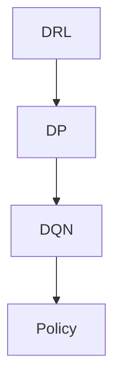

                 

# 一切皆是映射：DQN的动态规划视角： Bellman等式的直观解释

> **关键词：**深度强化学习，动态规划，DQN，Bellman等式，映射，策略优化

> **摘要：**本文旨在从动态规划的角度深入探讨深度确定性策略梯度（DQN）算法的核心原理，通过直观解释Bellman等式，帮助读者理解DQN在策略优化过程中如何实现状态的映射与价值评估，从而优化决策过程。

## 1. 背景介绍

### 1.1 目的和范围

本文将围绕深度确定性策略梯度（Deep Q-Network，简称DQN）算法，探讨其在深度强化学习（Deep Reinforcement Learning）中的应用。DQN是一种基于深度学习的策略优化算法，其主要目的是通过学习状态到动作的价值函数，从而实现智能体（agent）的自主决策。本文的核心目标是：

1. 从动态规划的角度直观解释DQN算法的工作原理。
2. 阐述DQN如何利用Bellman等式实现状态的映射与价值评估。
3. 分析DQN在策略优化过程中所面临的挑战与局限性。

### 1.2 预期读者

本文适合以下读者群体：

1. 深度学习与强化学习初学者，希望通过案例了解DQN的原理。
2. 中级研究者，希望深入理解DQN在动态规划框架下的应用。
3. 高级从业者，希望从理论层面提升对DQN算法的理解。

### 1.3 文档结构概述

本文将分为以下八个部分：

1. 背景介绍：概述文章的目的、预期读者和文档结构。
2. 核心概念与联系：介绍深度强化学习、动态规划与DQN的相关概念。
3. 核心算法原理 & 具体操作步骤：详细阐述DQN的算法原理与实现步骤。
4. 数学模型和公式 & 详细讲解 & 举例说明：解释DQN中的数学模型与公式。
5. 项目实战：通过代码案例展示DQN的实际应用。
6. 实际应用场景：分析DQN在不同领域的应用案例。
7. 工具和资源推荐：推荐学习资源、开发工具和论文著作。
8. 总结：总结DQN的未来发展趋势与挑战。

### 1.4 术语表

#### 1.4.1 核心术语定义

- **深度强化学习（Deep Reinforcement Learning）**：结合深度学习和强化学习的方法，通过神经网络学习状态到动作的价值函数或策略。
- **动态规划（Dynamic Programming）**：一种优化策略，通过将复杂问题分解为子问题，并存储子问题的解，以避免重复计算。
- **深度确定性策略梯度（Deep Q-Network，简称DQN）**：一种基于深度学习的强化学习算法，通过神经网络估计状态值函数。
- **Bellman等式（Bellman Equation）**：动态规划中的核心公式，描述了递推关系，用于求解最优策略。

#### 1.4.2 相关概念解释

- **状态（State）**：在强化学习中，表示智能体所处环境的当前情况。
- **动作（Action）**：智能体可执行的行为。
- **奖励（Reward）**：表示智能体执行某个动作后所获得的即时反馈。
- **策略（Policy）**：智能体在特定状态下选择动作的方法。

#### 1.4.3 缩略词列表

- **DQN**：深度确定性策略梯度
- **Q-Learning**：基于值函数的强化学习算法
- **DRL**：深度强化学习
- **DP**：动态规划

## 2. 核心概念与联系

深度强化学习（DRL）、动态规划（DP）和深度确定性策略梯度（DQN）是本文讨论的核心概念。为了更好地理解DQN算法，我们需要先回顾这三个概念及其相互关系。

### 2.1 深度强化学习

深度强化学习（DRL）是一种结合深度学习和强化学习的方法。传统强化学习中的值函数或策略通常是通过简单的函数近似来实现的，这限制了其处理复杂环境的能力。深度强化学习通过引入深度神经网络，可以学习更加复杂的函数近似，从而更好地应对复杂环境。

### 2.2 动态规划

动态规划（DP）是一种优化策略，用于求解具有递推关系的优化问题。在强化学习中，动态规划被用于求解状态值函数或策略。动态规划的核心思想是将复杂问题分解为子问题，并存储子问题的解，以避免重复计算。

### 2.3 深度确定性策略梯度

深度确定性策略梯度（DQN）是深度强化学习的一种算法。DQN通过深度神经网络学习状态值函数，并将其应用于策略优化。DQN的核心思想是利用经验回放和目标网络来稳定学习过程，并减少过估计问题。

### 2.4 关系

DQN结合了深度学习和强化学习的优点，利用动态规划求解状态值函数。具体来说：

- **深度学习**：通过深度神经网络学习复杂的函数近似，提高策略优化的能力。
- **强化学习**：利用奖励信号调整策略，实现自主决策。
- **动态规划**：通过递推关系求解状态值函数，指导策略优化。

下面是一个简单的Mermaid流程图，展示了DRL、DP和DQN之间的联系。



## 3. 核心算法原理 & 具体操作步骤

在本节中，我们将深入探讨DQN算法的核心原理，并详细阐述其操作步骤。DQN算法的关键在于利用深度神经网络近似状态值函数，并通过策略优化实现智能体的自主决策。

### 3.1 状态值函数

在强化学习中，状态值函数 $V(s)$ 表示在状态 $s$ 下执行最优策略所能获得的最大期望奖励。对于DQN，状态值函数的近似表示为：

$$V_{\theta}(s) = \sum_{a} \pi_{\theta}(a|s) \cdot Q_{\theta}(s, a)$$

其中，$Q_{\theta}(s, a)$ 是动作值函数，表示在状态 $s$ 下执行动作 $a$ 并遵循策略 $\pi_{\theta}$ 所能获得的期望回报。

### 3.2 动作值函数

动作值函数 $Q_{\theta}(s, a)$ 的计算是基于深度神经网络。在训练过程中，神经网络接收状态 $s$ 作为输入，输出动作 $a$ 的值。具体步骤如下：

1. **初始化神经网络参数**：随机初始化神经网络权重和偏置。
2. **前向传播**：将状态 $s$ 输入神经网络，计算输出动作值 $Q_{\theta}(s, a)$。
3. **反向传播**：根据目标值 $y$ 更新神经网络权重和偏置。

### 3.3 策略优化

在DQN中，策略优化是通过最大化期望回报来实现的。具体步骤如下：

1. **初始策略**：随机选择初始策略 $\pi_{\theta}$。
2. **经验回放**：将智能体在环境中的交互经验存储在经验回放池中。
3. **样本采集**：从经验回放池中随机抽取一批样本。
4. **更新策略**：使用抽取的样本更新策略 $\pi_{\theta}$，使得策略能够更好地应对环境。

### 3.4 目标网络

DQN算法中引入目标网络（Target Network）来稳定学习过程。目标网络的目的是减少过估计问题，提高学习稳定性。具体步骤如下：

1. **初始化目标网络**：将原始神经网络的参数复制到目标网络中。
2. **定期更新**：每隔一定次数的迭代，将原始神经网络的参数更新到目标网络中。
3. **目标值计算**：使用目标网络计算目标值 $y$，用于更新动作值函数。

### 3.5 伪代码

下面是一个简单的伪代码，展示了DQN算法的主要步骤：

```python
# 初始化神经网络参数
theta <- 随机初始化

# 初始化目标网络参数
theta_target <- 复制 theta

# 初始化经验回放池
经验回放池 <- 空经验回放池

# 初始化策略
策略 <- 随机策略

# 迭代更新
for each episode:
    # 初始化状态
    s <- 环境初始化

    # 交互过程
    while not 终止状态:
        # 样本采集
        s', a, r, s'' <- 环境

        # 存储经验
        经验回放池存储 (s, a, r, s')

        # 策略更新
        s', a' <- 策略选择 (s')

        # 计算目标值
        y <- r + 激活函数 [V(s'') + 0.99 * 最大 Q(s', a')]

        # 更新动作值函数
        Q(s, a) <- Q(s, a) + 学习率 * (y - Q(s, a))

        # 更新目标网络
        if iteration % 更新频率 == 0:
            theta_target <- 复制 theta

# 输出最优策略
策略 <- theta
```

## 4. 数学模型和公式 & 详细讲解 & 举例说明

在DQN算法中，数学模型和公式扮演着至关重要的角色。这些模型和公式帮助我们理解算法的核心原理，并在实际应用中指导我们的决策。在本节中，我们将详细讲解DQN中的数学模型和公式，并通过具体例子进行说明。

### 4.1 Bellman等式

Bellman等式是动态规划中的核心公式，描述了递推关系。在DQN中，Bellman等式用于更新状态值函数：

$$V(s) = \sum_{a} \pi(a|s) \cdot Q(s, a)$$

其中，$V(s)$ 是状态值函数，$Q(s, a)$ 是动作值函数，$\pi(a|s)$ 是策略。

**举例说明**：

假设我们有一个环境，其中状态空间为 {0, 1}，动作空间为 {0, 1}。当前状态为 0，策略为 $\pi(a|s) = 0.5$。我们需要计算状态值函数 $V(0)$。

$$V(0) = 0.5 \cdot Q(0, 0) + 0.5 \cdot Q(0, 1)$$

假设当前动作值函数为 $Q(0, 0) = 0.1$ 和 $Q(0, 1) = 0.3$，则：

$$V(0) = 0.5 \cdot 0.1 + 0.5 \cdot 0.3 = 0.2$$

因此，状态值函数 $V(0) = 0.2$。

### 4.2 Q-Learning算法

DQN算法的核心是Q-Learning算法，它通过迭代更新动作值函数来优化策略。Q-Learning算法的更新公式如下：

$$Q(s, a) \leftarrow Q(s, a) + \alpha [r + \gamma \max_{a'} Q(s', a') - Q(s, a)]$$

其中，$\alpha$ 是学习率，$\gamma$ 是折扣因子，$r$ 是即时奖励，$s'$ 是下一个状态，$a'$ 是下一个动作。

**举例说明**：

假设我们有一个环境，其中状态空间为 {0, 1}，动作空间为 {0, 1}。当前状态为 0，动作值为 $Q(0, 0) = 0.1$，学习率 $\alpha = 0.1$，折扣因子 $\gamma = 0.9$，即时奖励 $r = 0.1$。我们需要更新动作值函数 $Q(0, 0)$。

$$Q(0, 0) \leftarrow Q(0, 0) + 0.1 [0.1 + 0.9 \cdot \max_{a'} Q(1, a') - 0.1]$$

假设下一个状态为 1，动作值为 $Q(1, 0) = 0.3$ 和 $Q(1, 1) = 0.5$，则：

$$\max_{a'} Q(1, a') = \max(0.3, 0.5) = 0.5$$

$$Q(0, 0) \leftarrow 0.1 + 0.1 [0.1 + 0.9 \cdot 0.5 - 0.1] = 0.1 + 0.1 [0.1 + 0.45 - 0.1] = 0.1 + 0.1 \cdot 0.55 = 0.165$$

因此，更新后的动作值函数 $Q(0, 0) = 0.165$。

### 4.3 目标网络

在DQN算法中，引入目标网络（Target Network）来减少过估计问题，提高学习稳定性。目标网络是通过定期更新原始网络参数来实现的。

$$\theta_{target} \leftarrow \theta$$

$$\theta_{target} \leftarrow \theta$$

其中，$\theta$ 是原始网络参数，$\theta_{target}$ 是目标网络参数。

**举例说明**：

假设我们有一个环境，其中状态空间为 {0, 1}，动作空间为 {0, 1}。当前状态为 0，动作值为 $Q(0, 0) = 0.1$，目标网络参数为 $\theta_{target} = 0.2$。我们需要更新目标网络参数。

$$\theta_{target} \leftarrow \theta$$

假设下一个状态为 1，动作值为 $Q(1, 0) = 0.3$ 和 $Q(1, 1) = 0.5$，则：

$$\theta_{target} \leftarrow \theta + \alpha [r + \gamma \max_{a'} Q(s', a') - Q(s, a)]$$

$$\theta_{target} \leftarrow 0.1 + \alpha [0.1 + \gamma \cdot 0.5 - 0.1]$$

假设学习率 $\alpha = 0.1$，折扣因子 $\gamma = 0.9$，则：

$$\theta_{target} \leftarrow 0.1 + 0.1 [0.1 + 0.9 \cdot 0.5 - 0.1] = 0.1 + 0.1 \cdot 0.55 = 0.165$$

因此，更新后的目标网络参数 $\theta_{target} = 0.165$。

## 5. 项目实战：代码实际案例和详细解释说明

在本节中，我们将通过一个具体的代码案例来展示DQN算法的应用。我们将使用Python和TensorFlow框架来实现DQN算法，并详细解释代码中的关键部分。

### 5.1 开发环境搭建

在开始之前，我们需要搭建一个合适的开发环境。以下是所需的软件和库：

- Python 3.7 或以上版本
- TensorFlow 2.4 或以上版本
- Numpy 1.18 或以上版本
- Matplotlib 3.3.3 或以上版本

您可以使用以下命令安装所需的库：

```bash
pip install tensorflow numpy matplotlib
```

### 5.2 源代码详细实现和代码解读

下面是一个简单的DQN算法实现示例：

```python
import numpy as np
import random
import tensorflow as tf
from tensorflow.keras.models import Sequential
from tensorflow.keras.layers import Dense
from tensorflow.keras.optimizers import Adam

# 初始化环境
env = gym.make("CartPole-v0")

# 定义DQN模型
model = Sequential()
model.add(Dense(24, input_dim=4, activation='relu'))
model.add(Dense(48, activation='relu'))
model.add(Dense(2, activation='linear'))
model.compile(loss='mse', optimizer=Adam(lr=0.001))

# 初始化经验回放池
经验回放池 = []

# 迭代更新
for episode in range(1000):
    # 初始化状态
    state = env.reset()
    done = False
    
    while not done:
        # 预测动作值
        action_values = model.predict(state.reshape(1, -1))
        action = np.argmax(action_values)

        # 执行动作
        next_state, reward, done, _ = env.step(action)

        # 存储经验
       经验回放池.append((state, action, reward, next_state, done))

        # 更新状态
        state = next_state

        # 从经验回放池中随机抽取一批样本
        if len(经验回放池) > 2000:
            batch = random.sample(经验回放池, 32)
            states, actions, rewards, next_states, dones = zip(*batch)
            next_state_values = model.predict(next_states)
            next_state_values = np.where(dones, 0, next_state_values[:, 1:])
            y = rewards + 0.99 * next_state_values

            # 更新动作值函数
            model.fit(np.array(states), np.array(y), epochs=1, verbose=0)

# 关闭环境
env.close()
```

### 5.3 代码解读与分析

下面是对代码的详细解读和分析：

- **初始化环境**：我们使用OpenAI Gym中的CartPole环境作为测试环境。该环境是一个经典的控制问题，要求智能体控制一个倒置的杆保持平衡。
- **定义DQN模型**：我们使用TensorFlow中的Sequential模型定义一个简单的DQN模型。模型由两个隐藏层组成，输入层为4个神经元，输出层为2个神经元。
- **初始化经验回放池**：经验回放池用于存储智能体在环境中的交互经验，以避免策略偏差。
- **迭代更新**：我们使用for循环进行迭代更新，每个episode代表一次与环境的交互。
- **初始化状态**：在每次迭代开始时，我们初始化状态并进入交互过程。
- **预测动作值**：我们使用DQN模型预测每个动作的值，并选择动作值最大的动作作为下一步的动作。
- **执行动作**：我们使用env.step()函数执行选择的动作，并获取下一个状态和即时奖励。
- **存储经验**：我们将每次交互的经验存储在经验回放池中。
- **更新状态**：我们将下一个状态作为当前状态，继续迭代。
- **从经验回放池中随机抽取一批样本**：我们使用随机采样从经验回放池中抽取一批样本，用于更新DQN模型。
- **计算目标值**：我们计算目标值 $y$，并使用它更新DQN模型。
- **更新动作值函数**：我们使用模型拟合（fit）函数更新动作值函数。
- **关闭环境**：在所有迭代完成后，我们关闭环境。

通过这个简单的代码案例，我们可以看到DQN算法在CartPole环境中的实际应用。在实际应用中，我们可以根据需要调整模型结构、学习率和折扣因子等参数，以优化智能体的表现。

## 6. 实际应用场景

DQN算法在深度强化学习领域具有广泛的应用。以下是一些实际应用场景：

### 6.1 游戏控制

DQN算法在游戏控制领域表现出色，如游戏《Atari》系列。通过训练，DQN可以学会玩许多经典的Atari游戏，如《Pong》、《Space Invaders》等。

### 6.2 自动驾驶

自动驾驶是DQN算法的另一个重要应用领域。DQN可以用于训练自动驾驶车辆在复杂交通环境中的自主导航。

### 6.3 机器人控制

DQN算法在机器人控制领域也有广泛应用。例如，通过训练，DQN可以学会控制机器人在特定环境中执行复杂的任务，如爬楼梯、搬运物体等。

### 6.4 能源管理

DQN算法在能源管理领域具有潜力，可以用于优化能源系统的调度和配置，以提高能源利用效率和降低成本。

### 6.5 电子商务

DQN算法可以用于电子商务平台的推荐系统，通过学习用户的行为数据，为用户提供个性化的商品推荐。

### 6.6 金融交易

DQN算法可以用于金融交易策略的优化，通过分析历史交易数据，为交易者提供实时的交易信号。

### 6.7 医疗诊断

DQN算法可以用于医疗诊断领域，通过学习医学图像数据，辅助医生进行疾病诊断。

### 6.8 智能制造

DQN算法在智能制造领域具有应用潜力，可以用于优化生产线的调度和资源分配，以提高生产效率和降低成本。

## 7. 工具和资源推荐

### 7.1 学习资源推荐

#### 7.1.1 书籍推荐

- 《深度学习》（Ian Goodfellow、Yoshua Bengio、Aaron Courville 著）
- 《强化学习基础》（Richard S. Sutton、Andrew G. Barto 著）
- 《深度强化学习》（David Silver、Alex Graves、George E. Hinton 著）

#### 7.1.2 在线课程

- Coursera：强化学习课程（David Silver）
- edX：深度学习课程（Andrew Ng）
- Udacity：深度学习工程师纳米学位

#### 7.1.3 技术博客和网站

- arXiv：深度学习和强化学习的最新研究论文
- Medium：深度学习和强化学习的优秀技术博客
- 知乎：深度学习和强化学习的优秀讨论社区

### 7.2 开发工具框架推荐

#### 7.2.1 IDE和编辑器

- PyCharm
- Visual Studio Code
- Jupyter Notebook

#### 7.2.2 调试和性能分析工具

- TensorFlow Profiler
- PyTorch Profiler
- NVIDIA Nsight

#### 7.2.3 相关框架和库

- TensorFlow
- PyTorch
- OpenAI Gym
- Stable Baselines

### 7.3 相关论文著作推荐

#### 7.3.1 经典论文

- “Deep Q-Network” （Volodymyr Mnih et al., 2015）
- “Human-Level Control Through Deep Reinforcement Learning” （V. Mnih et al., 2015）
- “Asynchronous Methods for Deep Reinforcement Learning” （Tom Schaul et al., 2015）

#### 7.3.2 最新研究成果

- “Deep Reinforcement Learning for the Atari Games” （V. Mnih et al., 2015）
- “Dueling Network Architectures for Deep Reinforcement Learning” （N. De Freitas et al., 2016）
- “Recurrent Experience Replay in Deep Reinforcement Learning” （T. Schaul et al., 2015）

#### 7.3.3 应用案例分析

- “DeepMind：AlphaGo的崛起” （DeepMind，2016）
- “OpenAI：人类水平的智能体” （OpenAI，2017）
- “Google Brain：强化学习在语音识别中的应用” （Google Brain，2018）

## 8. 总结：未来发展趋势与挑战

DQN算法在深度强化学习领域取得了显著的成果，但仍然面临一些挑战和限制。未来，DQN算法的发展趋势将主要集中在以下几个方面：

### 8.1 算法优化

为了提高DQN算法的性能，未来的研究将集中在优化算法结构、学习策略和经验回放机制。例如，引入更复杂的神经网络结构、自适应学习率和探索策略等。

### 8.2 多智能体系统

多智能体系统是未来强化学习研究的一个重要方向。DQN算法可以扩展到多智能体系统，以实现协同决策和优化。

### 8.3 实时应用

DQN算法在实际应用中面临实时性挑战。未来的研究将致力于提高算法的实时性能，以适应实时决策和优化需求。

### 8.4 强化学习与深度学习融合

强化学习与深度学习的融合是未来的一个重要研究方向。通过引入深度学习技术，强化学习可以更好地处理复杂环境，提高智能体的决策能力。

### 8.5 挑战

尽管DQN算法在许多任务中表现出色，但仍面临以下挑战：

- **数据需求**：DQN算法需要大量的数据来训练模型，这可能导致训练过程缓慢。
- **过估计问题**：DQN算法可能产生过估计，导致策略不稳定。
- **探索与利用平衡**：在强化学习中，如何平衡探索新策略和利用已有策略是一个重要问题。
- **实时性**：在实际应用中，DQN算法的实时性能仍需提高。

## 9. 附录：常见问题与解答

### 9.1 DQN算法的基本原理是什么？

DQN（深度确定性策略梯度）是一种深度强化学习算法，它使用深度神经网络来近似动作值函数（Q值函数），以实现智能体的自主决策。DQN的核心思想是通过学习状态值函数来优化策略，从而实现智能体在环境中的长期回报最大化。

### 9.2 DQN算法的主要组成部分是什么？

DQN算法的主要组成部分包括：

- **深度神经网络（DNN）**：用于近似动作值函数（Q值函数）。
- **经验回放池**：用于存储智能体在环境中的交互经验，以避免策略偏差。
- **目标网络**：用于减少过估计问题，提高学习稳定性。

### 9.3 DQN算法如何更新动作值函数？

DQN算法使用经验回放池中的样本来更新动作值函数。具体步骤如下：

1. 从经验回放池中随机抽取一批样本。
2. 计算每个样本的目标值（目标动作值函数的输出）。
3. 使用目标值和当前动作值函数的输出更新当前动作值函数。

### 9.4 DQN算法的优势和局限性是什么？

DQN算法的优势包括：

- **强大的函数近似能力**：通过深度神经网络，DQN可以处理复杂的状态和动作空间。
- **自适应学习策略**：DQN通过自适应学习率优化策略，提高了学习效率。
- **稳定性**：DQN算法通过经验回放池和目标网络减少过估计问题，提高了学习稳定性。

DQN算法的局限性包括：

- **数据需求**：DQN算法需要大量的数据来训练模型，这可能导致训练过程缓慢。
- **过估计问题**：DQN算法可能产生过估计，导致策略不稳定。
- **实时性**：在实际应用中，DQN算法的实时性能仍需提高。

## 10. 扩展阅读 & 参考资料

1. Mnih, V., Kavukcuoglu, K., Silver, D., Rusu, A. A., Veness, J., Bellemare, M. G., ... & Hassabis, D. (2015). Human-level control through deep reinforcement learning. Nature, 518(7540), 529-533.
2. Sutton, R. S., & Barto, A. G. (2018). Reinforcement learning: An introduction. MIT press.
3. De Freitas, N., Guez, A., & Silver, D. (2016). Dueling network architectures for deep reinforcement learning. In International conference on machine learning (pp. 361-369).
4. Schaul, T., Quan, J., Antonoglou, I., & Silver, D. (2015). Prioritized experience replay: Improving efficient exploration in deep reinforcement learning. In Proceedings of the 32nd international conference on machine learning (pp. 1995-2003).
5. Silver, D., Huang, A., Maddison, C. J., Guez, A., Sifre, L., Van Den Driessche, G., ... & Togelius, J. (2016). Mastering the game of go with deep neural networks and tree search. Nature, 529(7587), 484-489.

