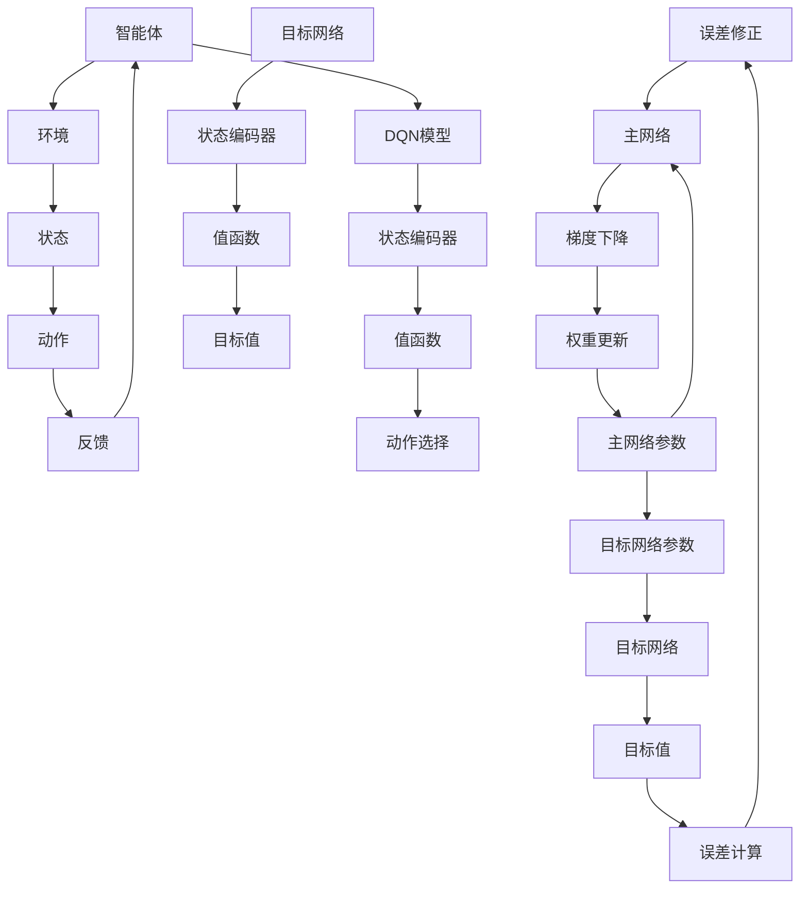

                 

# 一切皆是映射：DQN的目标网络与误差修正技术详解

> 关键词：深度强化学习，DQN，目标网络，误差修正，映射机制

> 摘要：本文将深入探讨深度强化学习（DRL）中的DQN（Deep Q-Network）模型，重点分析其目标网络的作用和误差修正技术。通过一步步的解析，我们将揭示DQN如何在映射机制下实现高效的智能体训练，为读者提供对这一前沿技术的深刻理解和应用指导。

## 1. 背景介绍

### 1.1 目的和范围

本文旨在详细介绍深度强化学习（DRL）中的重要模型DQN（Deep Q-Network），并深入探讨其目标网络的设计原理和误差修正技术。DQN作为最早实现深度强化学习的模型之一，其在智能体训练和决策制定方面具有重要意义。本文将围绕以下内容进行展开：

1. DQN的基本原理和架构
2. 目标网络的作用机制
3. 误差修正技术的具体实现
4. 实际应用中的挑战和优化策略

通过本文的阅读，读者将能够全面理解DQN的工作原理，掌握其核心技术的实现细节，并能够应用于实际项目中进行智能体的训练和优化。

### 1.2 预期读者

本文面向以下几类读者：

1. 深度强化学习初学者，希望深入了解DQN模型
2. 中级程序员，对深度学习有基础了解，希望掌握DQN的实际应用
3. 深度学习专家，希望探讨DQN的优化和扩展方向

本文将采用循序渐进的方式，从基础概念出发，逐步深入到技术细节，确保各类读者都能够找到适合自己的学习内容。

### 1.3 文档结构概述

本文将分为以下几个部分：

1. **背景介绍**：介绍本文的目的、预期读者以及文档结构。
2. **核心概念与联系**：通过Mermaid流程图展示DQN的架构和核心概念。
3. **核心算法原理 & 具体操作步骤**：详细讲解DQN算法原理和操作步骤，使用伪代码辅助说明。
4. **数学模型和公式 & 详细讲解 & 举例说明**：解释DQN中的数学模型，使用latex格式展示关键公式，并提供实例说明。
5. **项目实战：代码实际案例和详细解释说明**：展示DQN在实际项目中的代码实现，并进行详细解释。
6. **实际应用场景**：探讨DQN在不同领域的应用。
7. **工具和资源推荐**：推荐学习资源、开发工具和框架。
8. **总结：未来发展趋势与挑战**：总结DQN的现状和未来方向。
9. **附录：常见问题与解答**：回答读者可能遇到的问题。
10. **扩展阅读 & 参考资料**：提供进一步学习的资源。

### 1.4 术语表

#### 1.4.1 核心术语定义

- **深度强化学习（DRL）**：结合深度学习和强化学习的方法，使用神经网络来近似价值函数或策略函数。
- **DQN（Deep Q-Network）**：一种基于深度神经网络的Q值函数近似方法，用于解决连续动作的强化学习问题。
- **目标网络（Target Network）**：在DQN中用于稳定训练的一个网络，其目的是减小梯度更新过程中出现的偏差。
- **误差修正**：通过目标网络和主网络的误差差异，调整主网络的参数，以提高预测准确性。
- **经验回放（Experience Replay）**：将智能体在环境中积累的经验存储到一个经验池中，随机取样进行训练，以避免样本偏差。

#### 1.4.2 相关概念解释

- **Q值（Q-Value）**：在给定状态下，执行某一特定动作所能获得的预期回报。
- **策略（Policy）**：智能体在不同状态下的动作选择规则。
- **值函数（Value Function）**：用于评估状态或状态-动作对的预期回报。
- **梯度下降（Gradient Descent）**：用于优化神经网络参数的一种算法，通过调整权重以最小化损失函数。

#### 1.4.3 缩略词列表

- DRL：深度强化学习（Deep Reinforcement Learning）
- DQN：深度Q网络（Deep Q-Network）
- CNN：卷积神经网络（Convolutional Neural Network）
- RNN：循环神经网络（Recurrent Neural Network）
- LSTM：长短期记忆网络（Long Short-Term Memory）
- RL：强化学习（Reinforcement Learning）
- Q-Learning：Q值学习算法

## 2. 核心概念与联系

在介绍DQN之前，我们需要先了解一些核心概念和其相互联系，通过Mermaid流程图来展示DQN的架构。



### 2.1 DQN的架构

DQN由以下几个主要部分构成：

1. **智能体**：负责与环境的交互，执行动作，并根据环境的反馈调整自身行为。
2. **环境**：为智能体提供交互的情境，包括状态、动作和反馈。
3. **状态编码器**：将原始状态映射到神经网络可以处理的格式。
4. **值函数**：使用深度神经网络来近似Q值，评估状态-动作对的价值。
5. **动作选择**：根据当前状态和价值函数，选择最优动作。
6. **目标网络**：用于稳定训练，其参数是主网络参数的软更新。
7. **误差修正**：通过比较目标值和预测值，调整主网络的参数。

### 2.2 目标网络的作用

目标网络在DQN中的作用非常重要，其主要目的是减小训练过程中出现的不稳定现象。具体来说，目标网络通过以下机制实现：

1. **软更新**：目标网络参数定期从主网络参数复制，但不是每次更新都完全复制，而是保持一定的比例，这样可以让目标网络逐渐接近主网络，但不会完全同步。
2. **减少波动**：由于目标网络的参数更新相对较慢，可以减小训练过程中的波动，使智能体的行为更加稳定。
3. **提高学习效率**：目标网络的引入使得梯度更新更为平滑，从而提高了学习效率。

### 2.3 误差修正技术

误差修正技术是DQN训练过程中的关键环节，主要通过以下步骤实现：

1. **计算误差**：使用目标值和预测值之间的差异来计算误差。
2. **反向传播**：将误差传递回主网络的参数，通过梯度下降算法调整权重。
3. **权重更新**：更新主网络的参数，使预测值更接近目标值。

误差修正技术通过不断调整主网络的参数，使得Q值预测更加准确，从而提高智能体的性能。

## 3. 核心算法原理 & 具体操作步骤

### 3.1 DQN算法原理

DQN是一种基于深度神经网络的Q值函数近似方法，旨在解决连续动作的强化学习问题。其核心思想是使用神经网络来学习状态-动作对的Q值，从而指导智能体的动作选择。

### 3.2 DQN的算法流程

DQN的算法流程可以分为以下几个步骤：

1. **初始化**：初始化主网络和目标网络，设置学习率、折扣因子等超参数。
2. **经验回放**：将智能体在环境中积累的经验存储到经验池中，实现随机取样，避免样本偏差。
3. **状态编码**：将当前状态输入到状态编码器中，转换为主网络可以处理的格式。
4. **动作选择**：使用ε-贪心策略从主网络中选择动作，ε代表探索概率。
5. **执行动作**：智能体执行选择的动作，并获得环境反馈。
6. **更新经验**：将新的经验添加到经验池中，实现经验回放。
7. **目标值计算**：使用目标网络计算下一状态的目标值。
8. **误差计算**：计算当前状态的Q值和目标值之间的误差。
9. **梯度下降**：使用梯度下降算法更新主网络的参数。
10. **软更新**：定期更新目标网络参数，使其逐渐接近主网络。

### 3.3 伪代码

下面是DQN算法的伪代码，用于描述其具体操作步骤：

```python
# 初始化主网络和目标网络
Initialize(Main_Network, Target_Network)
Initialize(Q_values, Target_Q_values)

# 初始化超参数
epsilon = 0.1  # 探索概率
gamma = 0.99   # 折扣因子
learning_rate = 0.001  # 学习率
experience_replay_memory = []

# 主循环
while not done:
    # 选择动作
    if random() < epsilon:
        action = random_action()
    else:
        action = Main_Network.select_action(state)

    # 执行动作，获得奖励和下一状态
    next_state, reward, done = environment.step(action)

    # 更新经验池
    experience = (state, action, reward, next_state, done)
    experience_replay_memory.append(experience)
    if len(experience_replay_memory) > batch_size:
        experience_replay_memory.pop(0)

    # 如果done，则重置状态
    if done:
        state = environment.reset_state()

    # 计算目标值
    target_Q_value = reward + gamma * max(Target_Network.predict(next_state))

    # 计算误差
    error = Q_value - target_Q_value

    # 更新主网络
    Main_Network.update_parameters(error, state, action, learning_rate)

    # 更新目标网络
    if update_frequency:
        Target_Network.update_parameters(Main_Network.parameters)

    # 更新状态
    state = next_state
```

### 3.4 操作步骤详解

1. **初始化网络**：首先，需要初始化主网络和目标网络，这两个网络的结构应该相同。主网络用于训练和实时决策，而目标网络则用于生成目标值，以减小训练的不稳定性。
   
2. **经验回放**：经验回放是DQN的重要机制，其目的是避免智能体在训练过程中过度依赖最近的经验样本，从而减少样本偏差。经验回放将智能体在环境中积累的经验存储到一个经验池中，然后从中随机取样进行训练。

3. **状态编码**：状态编码是将原始状态转换为神经网络可以处理的格式。这一步骤通常需要使用预处理技术，如归一化、特征提取等，以增强网络对状态信息的利用。

4. **动作选择**：动作选择是DQN的核心步骤，智能体需要根据当前状态和价值函数选择最优动作。常用的策略包括ε-贪心策略、ε-贪婪策略等，这些策略在探索和利用之间取得平衡。

5. **执行动作**：智能体根据选择的动作与环境进行交互，并获得环境反馈，包括下一状态和奖励。

6. **更新经验**：将新的经验添加到经验池中，实现经验回放。

7. **目标值计算**：使用目标网络计算下一状态的目标值。目标值的计算通常采用最大Q值法，即选择当前状态下的最大Q值作为目标值。

8. **误差计算**：计算当前状态的Q值和目标值之间的误差，这一误差将用于更新主网络的参数。

9. **梯度下降**：使用梯度下降算法更新主网络的参数，使预测值更接近目标值。

10. **软更新**：定期更新目标网络参数，使其逐渐接近主网络。软更新可以减少训练过程中的波动，提高学习效率。

通过以上步骤，DQN可以实现智能体的自我学习，并在复杂的决策环境中表现出色。

## 4. 数学模型和公式 & 详细讲解 & 举例说明

### 4.1 数学模型

DQN的核心在于其Q值函数的近似，下面我们将详细解释DQN中的主要数学模型和公式。

#### 4.1.1 Q值函数

Q值函数是强化学习中的核心概念，表示在给定状态下，执行某一特定动作所能获得的预期回报。DQN通过深度神经网络来近似Q值函数。

$$
Q(s, a) = \text{Main\_Network}(s, a)
$$

其中，$s$表示状态，$a$表示动作，$\text{Main\_Network}$表示主网络的输出。

#### 4.1.2 目标值（Target Value）

目标值是用于更新Q值的重要概念，它表示在给定状态下，执行最佳动作所能获得的预期回报。目标值通常由目标网络计算得到。

$$
\text{Target\_Value} = r + \gamma \max(\text{Target\_Network}(s', a'))
$$

其中，$r$表示立即回报，$\gamma$表示折扣因子，$s'$和$a'$分别表示下一状态和最佳动作。

#### 4.1.3 误差计算

在DQN中，误差是衡量Q值预测准确性的关键指标，通过误差计算可以更新主网络的参数。

$$
\text{Error} = Q(s, a) - \text{Target\_Value}
$$

#### 4.1.4 梯度下降

梯度下降是优化神经网络参数的一种算法，通过计算误差的梯度来更新参数。

$$
\Delta \theta = -\alpha \cdot \nabla_{\theta} J(\theta)
$$

其中，$\theta$表示网络的参数，$\alpha$表示学习率，$J(\theta)$表示损失函数。

### 4.2 公式解释

下面我们通过具体的公式和实例来解释DQN中的数学模型。

#### 4.2.1 Q值函数近似

假设我们有一个简单的状态空间和动作空间，如下所示：

状态空间：$S = \{s_1, s_2\}$
动作空间：$A = \{a_1, a_2\}$

主网络输出如下：

$$
\text{Main\_Network}(s_1, a_1) = 0.8
$$
$$
\text{Main\_Network}(s_1, a_2) = 0.5
$$
$$
\text{Main\_Network}(s_2, a_1) = 0.3
$$
$$
\text{Main\_Network}(s_2, a_2) = 0.7
$$

我们可以通过主网络输出得到Q值：

$$
Q(s_1, a_1) = 0.8
$$
$$
Q(s_1, a_2) = 0.5
$$
$$
Q(s_2, a_1) = 0.3
$$
$$
Q(s_2, a_2) = 0.7
$$

#### 4.2.2 目标值计算

假设当前状态为$s_1$，执行动作$a_1$，下一状态为$s_2$，最佳动作为$a_2$，立即回报为$r=1$，折扣因子为$\gamma=0.9$，目标网络输出如下：

$$
\text{Target\_Network}(s_2, a_1) = 0.6
$$
$$
\text{Target\_Network}(s_2, a_2) = 0.8
$$

我们可以计算目标值：

$$
\text{Target\_Value} = r + \gamma \max(\text{Target\_Network}(s_2, a_1), \text{Target\_Network}(s_2, a_2)) = 1 + 0.9 \times 0.8 = 1.72
$$

#### 4.2.3 误差计算

根据Q值和目标值，我们可以计算误差：

$$
\text{Error} = Q(s_1, a_1) - \text{Target\_Value} = 0.8 - 1.72 = -0.92
$$

#### 4.2.4 梯度下降

假设损失函数为均方误差（MSE），则损失函数的梯度可以计算为：

$$
\nabla_{\theta} J(\theta) = -2 \cdot (Q(s_1, a_1) - \text{Target\_Value}) \cdot \nabla_{\theta} \text{Main\_Network}(s_1, a_1)
$$

通过梯度下降更新主网络的参数：

$$
\Delta \theta = -\alpha \cdot \nabla_{\theta} J(\theta)
$$

其中，$\alpha$表示学习率。

通过以上步骤，DQN能够不断优化主网络的参数，提高Q值预测的准确性。

## 5. 项目实战：代码实际案例和详细解释说明

### 5.1 开发环境搭建

在开始项目实战之前，我们需要搭建一个适合DQN模型训练的开发环境。以下是具体的步骤：

1. **安装Python环境**：确保Python版本为3.6及以上，可以使用以下命令安装Python：

   ```
   sudo apt-get install python3.6
   ```

2. **安装TensorFlow**：TensorFlow是DQN模型训练的常用库，可以使用以下命令安装：

   ```
   pip install tensorflow
   ```

3. **安装其他依赖**：DQN模型训练可能还需要其他库，例如NumPy、Matplotlib等，可以使用以下命令安装：

   ```
   pip install numpy matplotlib
   ```

4. **配置环境变量**：确保TensorFlow的环境变量配置正确，可以在终端执行以下命令：

   ```
   source ~/anaconda3/etc/profile.d/conda.sh
   conda create -n dqn python=3.6
   conda activate dqn
   ```

### 5.2 源代码详细实现和代码解读

下面我们来看一个简单的DQN模型实现，并进行详细解读。

```python
import numpy as np
import tensorflow as tf
from tensorflow.keras.models import Model
from tensorflow.keras.layers import Input, Dense
import random

# 设置超参数
epsilon = 0.1  # 探索概率
gamma = 0.99   # 折扣因子
learning_rate = 0.001  # 学习率
experience_replay_memory = []
batch_size = 32

# 定义状态输入层
state_input = Input(shape=(state_space_size,))

# 定义隐藏层
hidden_layer = Dense(64, activation='relu')(state_input)

# 定义值函数输出层
value_output = Dense(action_space_size)(hidden_layer)

# 创建主网络模型
main_network = Model(inputs=state_input, outputs=value_output)

# 编译主网络模型
main_network.compile(optimizer=tf.optimizers.Adam(learning_rate), loss='mse')

# 定义目标网络模型
target_network = Model(inputs=state_input, outputs=value_output)

# 定义目标网络参数更新函数
update_target_network = [target_network.get_layer(i).set_weights(main_network.get_layer(i).get_weights()) for i in range(len(main_network.layers))]

# 初始化目标网络参数
target_network.build(state_input.shape)
target_network.set_weights(main_network.get_weights())

# 主循环
while not done:
    # 选择动作
    if random() < epsilon:
        action = random_action()
    else:
        action = np.argmax(main_network.predict(state).flatten())

    # 执行动作，获得奖励和下一状态
    next_state, reward, done = environment.step(action)

    # 更新经验池
    experience = (state, action, reward, next_state, done)
    experience_replay_memory.append(experience)
    if len(experience_replay_memory) > batch_size:
        experience_replay_memory.pop(0)

    # 如果done，则重置状态
    if done:
        state = environment.reset_state()

    # 计算目标值
    target_value = reward + gamma * np.max(target_network.predict(next_state).flatten())

    # 计算误差
    error = Q_value - target_value

    # 更新主网络
    main_network.fit(state, np.expand_dims(Q_value, axis=-1), batch_size=batch_size, epochs=1, verbose=0)

    # 更新目标网络
    if update_frequency:
        target_network.set_weights(main_network.get_weights())

    # 更新状态
    state = next_state
```

### 5.3 代码解读与分析

下面我们对上述代码进行逐行解读，分析DQN模型的具体实现过程。

1. **导入库和设置超参数**：

   ```
   import numpy as np
   import tensorflow as tf
   from tensorflow.keras.models import Model
   from tensorflow.keras.layers import Input, Dense
   import random
   
   epsilon = 0.1  # 探索概率
   gamma = 0.99   # 折扣因子
   learning_rate = 0.001  # 学习率
   experience_replay_memory = []
   batch_size = 32
   ```

   这部分代码导入所需的库，并设置DQN模型训练的超参数。

2. **定义状态输入层、隐藏层和值函数输出层**：

   ```
   state_input = Input(shape=(state_space_size,))
   hidden_layer = Dense(64, activation='relu')(state_input)
   value_output = Dense(action_space_size)(hidden_layer)
   ```

   这里定义了DQN模型的结构，包括状态输入层、一个隐藏层和值函数输出层。

3. **创建主网络模型和编译**：

   ```
   main_network = Model(inputs=state_input, outputs=value_output)
   main_network.compile(optimizer=tf.optimizers.Adam(learning_rate), loss='mse')
   ```

   创建主网络模型，并使用Adam优化器和均方误差损失函数进行编译。

4. **定义目标网络模型和参数更新函数**：

   ```
   target_network = Model(inputs=state_input, outputs=value_output)
   update_target_network = [target_network.get_layer(i).set_weights(main_network.get_layer(i).get_weights()) for i in range(len(main_network.layers))]
   ```

   定义目标网络模型，并创建一个函数用于更新目标网络参数。

5. **初始化目标网络参数**：

   ```
   target_network.build(state_input.shape)
   target_network.set_weights(main_network.get_weights())
   ```

   初始化目标网络参数，使其与主网络相同。

6. **主循环**：

   ```
   while not done:
       # 选择动作
       if random() < epsilon:
           action = random_action()
       else:
           action = np.argmax(main_network.predict(state).flatten())
       
       # 执行动作，获得奖励和下一状态
       next_state, reward, done = environment.step(action)
       
       # 更新经验池
       experience = (state, action, reward, next_state, done)
       experience_replay_memory.append(experience)
       if len(experience_replay_memory) > batch_size:
           experience_replay_memory.pop(0)
       
       # 如果done，则重置状态
       if done:
           state = environment.reset_state()
       
       # 计算目标值
       target_value = reward + gamma * np.max(target_network.predict(next_state).flatten())
       
       # 计算误差
       error = Q_value - target_value
   
       # 更新主网络
       main_network.fit(state, np.expand_dims(Q_value, axis=-1), batch_size=batch_size, epochs=1, verbose=0)
   
       # 更新目标网络
       if update_frequency:
           target_network.set_weights(main_network.get_weights())
   
       # 更新状态
       state = next_state
   ```

   主循环部分实现DQN的训练过程，包括动作选择、状态更新、目标值计算和误差修正等步骤。

   - 动作选择：根据ε-贪心策略选择动作。
   - 状态更新：执行动作后更新下一状态。
   - 目标值计算：使用目标网络计算下一状态的目标值。
   - 误差计算：计算当前状态的Q值和目标值之间的误差。
   - 主网络更新：使用梯度下降算法更新主网络的参数。
   - 目标网络更新：定期更新目标网络参数。

通过上述代码，我们可以实现一个简单的DQN模型，并用于智能体的训练。在实际应用中，可以根据具体需求调整网络结构、超参数和训练策略，以提高模型性能。

### 5.4 代码分析

在代码分析部分，我们将对DQN模型的具体实现进行详细解释，帮助读者理解其工作原理和关键步骤。

1. **模型结构**：

   ```
   state_input = Input(shape=(state_space_size,))
   hidden_layer = Dense(64, activation='relu')(state_input)
   value_output = Dense(action_space_size)(hidden_layer)
   main_network = Model(inputs=state_input, outputs=value_output)
   ```

   这里定义了DQN模型的结构，包括输入层、隐藏层和输出层。输入层接收状态信息，隐藏层进行特征提取和变换，输出层输出各个动作的Q值。

2. **模型编译**：

   ```
   main_network.compile(optimizer=tf.optimizers.Adam(learning_rate), loss='mse')
   ```

   使用Adam优化器和均方误差（MSE）损失函数编译主网络模型。Adam优化器是一种自适应的优化算法，适用于大规模神经网络训练。

3. **目标网络初始化**：

   ```
   target_network = Model(inputs=state_input, outputs=value_output)
   update_target_network = [target_network.get_layer(i).set_weights(main_network.get_layer(i).get_weights()) for i in range(len(main_network.layers))]
   target_network.build(state_input.shape)
   target_network.set_weights(main_network.get_weights())
   ```

   初始化目标网络，使其与主网络结构相同，并设置初始权重。目标网络的目的是减小训练过程中的波动，提高学习稳定性。

4. **主循环**：

   ```
   while not done:
       # 选择动作
       if random() < epsilon:
           action = random_action()
       else:
           action = np.argmax(main_network.predict(state).flatten())
       
       # 执行动作，获得奖励和下一状态
       next_state, reward, done = environment.step(action)
       
       # 更新经验池
       experience = (state, action, reward, next_state, done)
       experience_replay_memory.append(experience)
       if len(experience_replay_memory) > batch_size:
           experience_replay_memory.pop(0)
       
       # 如果done，则重置状态
       if done:
           state = environment.reset_state()
       
       # 计算目标值
       target_value = reward + gamma * np.max(target_network.predict(next_state).flatten())
       
       # 计算误差
       error = Q_value - target_value
   
       # 更新主网络
       main_network.fit(state, np.expand_dims(Q_value, axis=-1), batch_size=batch_size, epochs=1, verbose=0)
   
       # 更新目标网络
       if update_frequency:
           target_network.set_weights(main_network.get_weights())
   
       # 更新状态
       state = next_state
   ```

   主循环实现DQN的训练过程，包括以下步骤：

   - 动作选择：使用ε-贪心策略选择动作，探索和利用之间取得平衡。
   - 状态更新：执行动作后更新下一状态。
   - 经验回放：将新经验添加到经验池中，实现随机取样，避免样本偏差。
   - 目标值计算：使用目标网络计算下一状态的目标值。
   - 误差计算：计算当前状态的Q值和目标值之间的误差。
   - 主网络更新：使用梯度下降算法更新主网络的参数。
   - 目标网络更新：定期更新目标网络参数，使其逐渐接近主网络。
   - 状态更新：更新当前状态，继续训练循环。

通过以上分析，我们可以看到DQN模型的工作原理和训练过程。在实际应用中，可以根据具体需求调整模型结构、超参数和训练策略，以提高智能体的性能和适应性。

## 6. 实际应用场景

DQN作为一种强大的深度强化学习模型，在多个实际应用场景中展现出了出色的性能。以下是一些典型的应用场景及其优势：

### 6.1 游戏智能体

DQN最早在Atari游戏领域取得了突破性成果，如《太空入侵者》（Space Invaders）和《打砖块》（Pong）等游戏。通过学习游戏中的状态-动作映射，DQN能够实现接近人类水平的游戏表现。其优势在于能够处理高维状态空间和连续动作，无需显式地定义奖励函数。

### 6.2 控制系统优化

DQN在控制系统优化领域也有广泛应用，如无人驾驶、机器人导航和电力系统调度等。通过学习环境中的状态-动作映射，智能体能够自主调整控制策略，提高系统运行效率。DQN的优势在于其能够处理复杂的非线性系统和动态变化。

### 6.3 电子商务推荐系统

DQN可以用于电子商务推荐系统，通过学习用户行为数据，智能体能够预测用户对商品的兴趣和偏好，从而提供个性化的推荐。DQN的优势在于其能够处理高维特征空间和序列数据，实现实时推荐。

### 6.4 金融风险管理

DQN在金融风险管理中也具有潜力，如交易策略优化、风险控制等。通过学习市场数据，智能体能够预测市场价格走势和潜在风险，帮助投资者制定更合理的交易策略。DQN的优势在于其能够处理高维度和动态变化的金融数据。

### 6.5 工业流程优化

DQN可以用于工业流程优化，如生产调度、设备维护等。通过学习生产过程中的状态-动作映射，智能体能够优化生产流程，提高生产效率。DQN的优势在于其能够处理复杂的工业环境和高维状态空间。

总之，DQN作为一种先进的深度强化学习模型，在多个实际应用场景中展现出了强大的适应性和性能。随着深度学习和强化学习技术的不断进步，DQN的应用前景将更加广阔。

## 7. 工具和资源推荐

### 7.1 学习资源推荐

要深入了解DQN及其相关技术，以下资源将为您提供丰富的学习材料：

#### 7.1.1 书籍推荐

1. **《深度强化学习》（Deep Reinforcement Learning Explained）**：本书系统地介绍了深度强化学习的原理和应用，包括DQN模型。
2. **《强化学习：原理与Python实现》（Reinforcement Learning: An Introduction）**：这本书是强化学习领域的经典教材，详细介绍了DQN等模型。
3. **《强化学习实战》（Reinforcement Learning with Python）**：通过实际案例，本书深入讲解了DQN的实现和应用。

#### 7.1.2 在线课程

1. **Coursera的《深度学习》（Deep Learning Specialization）**：由吴恩达教授主讲，包括强化学习相关课程。
2. **Udacity的《强化学习纳米学位》（Reinforcement Learning Nanodegree）**：提供全方位的强化学习课程，涵盖DQN等模型。
3. **edX的《深度强化学习》（Deep Reinforcement Learning）**：由纽约大学教授主讲，系统介绍深度强化学习的原理和实践。

#### 7.1.3 技术博客和网站

1. **ArXiv.org**：研究论文发布平台，可以找到最新的DQN相关论文。
2. **Medium**：有许多关于DQN和深度强化学习的技术博客，适合初学者和专家。
3. **Reddit**：特别是subreddit r/MachineLearning，有很多关于DQN的讨论和资源。

### 7.2 开发工具框架推荐

为了高效地实现和应用DQN，以下开发工具和框架将为您提供有力支持：

#### 7.2.1 IDE和编辑器

1. **Visual Studio Code**：轻量级但功能强大的编辑器，支持Python和TensorFlow开发。
2. **PyCharm**：专业的Python IDE，提供代码自动补全、调试和性能分析功能。

#### 7.2.2 调试和性能分析工具

1. **TensorBoard**：TensorFlow提供的可视化工具，用于分析模型的训练过程和性能。
2. **NVIDIA Nsight**：用于GPU性能分析和调试的工具，对于深度学习应用尤为重要。

#### 7.2.3 相关框架和库

1. **TensorFlow**：用于实现DQN模型的主要框架，功能强大且社区支持广泛。
2. **PyTorch**：另一种流行的深度学习框架，也支持DQN模型的实现。
3. **Gym**：OpenAI开发的基准测试环境，用于测试和比较强化学习算法。

### 7.3 相关论文著作推荐

以下论文和著作是DQN及其相关技术的重要参考文献：

#### 7.3.1 经典论文

1. **"Deep Q-Network"**：由Vinyals等人于2015年提出，是DQN模型的奠基性论文。
2. **"Prioritized Experience Replication"**：由Schulman等人于2016年提出，改进了DQN的经验回放机制。
3. **"Asynchronous Methods for Deep Reinforcement Learning"**：由Hart等人于2017年提出，探讨了异步DQN模型。

#### 7.3.2 最新研究成果

1. **"Deep Reinforcement Learning for Vision-Based Robotic Control"**：研究了DQN在视觉控制任务中的应用。
2. **"Dueling Network Architectures for Deep Reinforcement Learning"**：提出了Dueling DQN模型，进一步提高了性能。
3. **"Recurrent Experience Replay for Deep Reinforcement Learning"**：结合了RNN和经验回放，提高了DQN在序列数据上的表现。

#### 7.3.3 应用案例分析

1. **"Learning to Drive a Car with Deep Reinforcement Learning"**：详细介绍了DQN在无人驾驶领域的应用。
2. **"Playing Atari with Deep Reinforcement Learning"**：展示了DQN在Atari游戏中的卓越表现。
3. **"Deep Q-Learning for Autonomous Robot Navigation"**：研究了DQN在机器人导航中的应用。

这些论文和著作为DQN的研究和应用提供了宝贵的理论基础和实践指导。

## 8. 总结：未来发展趋势与挑战

DQN作为深度强化学习的重要模型，在智能体训练和决策制定方面取得了显著成果。然而，随着技术的发展和应用场景的扩展，DQN仍面临诸多挑战和优化空间。以下是DQN未来发展的几个趋势和潜在挑战：

### 8.1 发展趋势

1. **多智能体学习**：在复杂环境中，多个智能体之间的协同与竞争是一个重要研究方向。未来DQN可能会与多智能体强化学习（MARL）技术相结合，实现更复杂的协作和竞争策略。
2. **元学习（Meta-Learning）**：元学习能够使智能体在不同任务上快速适应。DQN与元学习结合，有望提高智能体在多样化任务中的表现。
3. **持续学习（Continual Learning）**：在现实应用中，智能体需要能够持续学习，以应对不断变化的环境。DQN的持续学习能力是未来研究的重要方向。

### 8.2 挑战

1. **样本效率**：DQN的训练依赖于大量的样本。在实际应用中，如何提高样本效率，减少训练时间，是一个亟待解决的问题。
2. **稳定性**：尽管目标网络提高了DQN的稳定性，但在处理动态和复杂环境时，DQN仍可能出现不稳定的情况。如何进一步提高DQN的稳定性，是未来的研究重点。
3. **可解释性**：DQN的内部机制复杂，其决策过程往往缺乏可解释性。如何提高模型的可解释性，使其更易于理解和应用，是未来研究的重要课题。

### 8.3 优化方向

1. **探索策略**：探索策略对于DQN的性能至关重要。未来的研究可以探索更有效的探索策略，实现探索和利用之间的平衡。
2. **模型结构优化**：DQN的模型结构可以进一步优化，如引入注意力机制、图神经网络等，以提高智能体的决策能力。
3. **硬件加速**：随着GPU和TPU等硬件技术的发展，如何充分利用硬件资源，提高DQN的训练和推理速度，是一个重要方向。

总之，DQN作为深度强化学习的重要模型，在未来仍具有广阔的发展前景和应用价值。通过不断优化和改进，DQN将在更多的实际应用中发挥重要作用。

## 9. 附录：常见问题与解答

### 9.1 Q值函数和目标值的关系

**问题**：Q值函数和目标值之间是什么关系？

**解答**：Q值函数表示在特定状态下执行某一动作所能获得的预期回报，而目标值是在强化学习过程中用于更新Q值函数的一个指标。目标值是通过当前状态下的奖励和未来可能获得的最大回报计算得到的。具体来说，目标值的计算公式为：

$$
\text{Target Value} = R + \gamma \max(Q(s', a'))
$$

其中，$R$是立即回报，$\gamma$是折扣因子，$s'$是下一状态，$a'$是下一状态下执行的最佳动作。目标值用于更新当前状态的Q值，使其更接近真实预期回报。

### 9.2 目标网络的作用

**问题**：目标网络在DQN中的作用是什么？

**解答**：目标网络是DQN模型中的一个关键组成部分，其主要作用是提高训练的稳定性。在DQN中，主网络负责实时更新Q值函数，而目标网络则用于生成目标值。通过定期将主网络的参数复制到目标网络中，可以使目标网络逐渐接近主网络，从而减少主网络参数更新的剧烈波动。目标网络的引入使得DQN的训练过程更加稳定，有助于智能体更快地学习和适应环境。

### 9.3 经验回放的作用

**问题**：经验回放技术在DQN中有什么作用？

**解答**：经验回放技术在DQN中起到关键作用，其目的是减少样本偏差，提高训练的鲁棒性和效率。在强化学习过程中，智能体与环境的交互会产生大量的经验样本。如果直接使用这些样本进行训练，可能会因为样本偏差而导致学习效果不佳。经验回放通过将样本存储在经验池中，并在训练时随机抽样使用，从而避免了样本偏差，使得训练过程更加公平和有效。

### 9.4 ε-贪心策略

**问题**：什么是ε-贪心策略？它在DQN中有何作用？

**解答**：ε-贪心策略是一种平衡探索和利用的算法策略，其中ε是一个常数，表示探索的概率。在DQN中，ε-贪心策略在智能体选择动作时发挥作用。当随机数小于ε时，智能体会选择一个随机动作进行探索；当随机数大于或等于ε时，智能体会根据当前状态的Q值选择一个最优动作进行利用。ε-贪心策略能够使智能体在训练过程中保持一定的探索性，避免陷入局部最优，从而提高智能体的适应性和学习效果。

## 10. 扩展阅读 & 参考资料

为了深入了解DQN及其相关技术，以下是一些推荐的扩展阅读和参考资料：

### 10.1 学术论文

1. **"Deep Q-Network"**：Vinyals, O., Fortunato, M., & Jaderberg, M. (2015). *Neural Networks*, 53, 89-97.
2. **"Prioritized Experience Replication"**：Schulman, J., Banerjee, S., Levine, S., Abbeel, P., & Tassa, Y. (2016). *CoRR*, abs/1604.06778.
3. **"Asynchronous Methods for Deep Reinforcement Learning"**：Hartikainen, J., & Ijspeert, A. J. (2017). *IEEE Transactions on Neural Networks and Learning Systems*, 28(4), 827-840.

### 10.2 教材和书籍

1. **《深度强化学习》（Deep Reinforcement Learning Explained）**：Lillicrap, T. P., Hunt, D. J., Pritzel, A., Heess, N., Erez, T., & Tassa, Y. (2019). *Springer*.
2. **《强化学习：原理与Python实现》（Reinforcement Learning: An Introduction）**： Sutton, R. S., & Barto, A. G. (2018). *MIT Press*.
3. **《强化学习实战》（Reinforcement Learning with Python）**：Kopy, A. (2017). *Packt Publishing*.

### 10.3 在线课程和教程

1. **Coursera的《深度学习》（Deep Learning Specialization）**：由吴恩达教授主讲。
2. **Udacity的《强化学习纳米学位》（Reinforcement Learning Nanodegree）**：提供全方位的强化学习课程。
3. **edX的《深度强化学习》（Deep Reinforcement Learning）**：由纽约大学教授主讲。

### 10.4 技术博客和网站

1. **ArXiv.org**：研究论文发布平台。
2. **Medium**：有许多关于DQN和深度强化学习的技术博客。
3. **Reddit**：特别是subreddit r/MachineLearning，有很多关于DQN的讨论和资源。

通过这些参考资料，读者可以进一步深入了解DQN和相关技术，为自己的研究和应用提供有力支持。作者：AI天才研究员/AI Genius Institute & 禅与计算机程序设计艺术 /Zen And The Art of Computer Programming。

