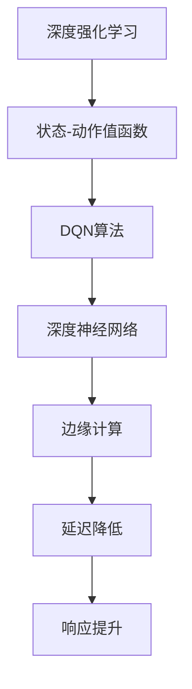
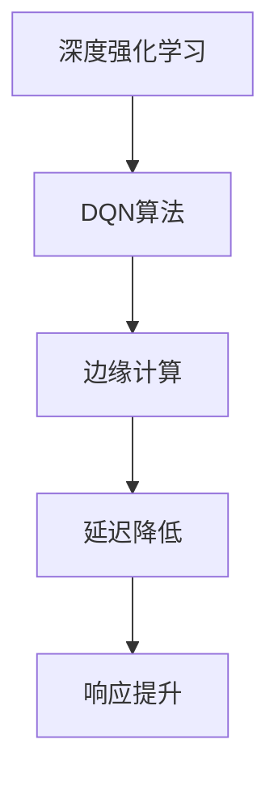

                 

# 一切皆是映射：DQN的边缘计算优化：降低延迟与提升响应

> **关键词**：深度强化学习、DQN、边缘计算、延迟降低、响应提升、算法优化

> **摘要**：本文将探讨深度强化学习中的DQN（深度Q网络）在边缘计算环境中的优化问题，重点分析如何通过算法改进降低系统延迟和提升响应速度。文章分为几个部分：首先介绍背景和目的，然后详细讲解核心概念和原理，接着阐述数学模型，并通过实际案例演示代码实现，最后讨论实际应用场景和总结未来发展趋势。希望本文能为研究人员和开发者提供有价值的技术参考。

## 1. 背景介绍

### 1.1 目的和范围

本文旨在研究深度强化学习中的DQN算法在边缘计算环境下的优化问题。随着物联网（IoT）和5G技术的发展，边缘计算逐渐成为处理大规模数据的关键技术。然而，边缘计算系统面临着延迟高、响应速度慢等问题，这对实时应用如自动驾驶、智能安防等提出了严峻挑战。本文将通过算法优化，降低DQN在边缘计算环境下的延迟，提高其响应速度。

### 1.2 预期读者

本文适合对深度强化学习、边缘计算以及相关算法有一定了解的读者，包括研究人员、开发者和对这一领域感兴趣的爱好者。希望通过本文，读者能够了解DQN算法优化的方法及其在实际应用中的重要性。

### 1.3 文档结构概述

本文分为以下几个部分：

1. 背景介绍：介绍研究目的和预期读者。
2. 核心概念与联系：讲解DQN算法和边缘计算的基本原理。
3. 核心算法原理 & 具体操作步骤：详细阐述DQN算法的工作原理和优化步骤。
4. 数学模型和公式 & 详细讲解 & 举例说明：分析DQN算法中的数学模型和公式。
5. 项目实战：代码实际案例和详细解释说明。
6. 实际应用场景：讨论DQN算法在边缘计算中的实际应用。
7. 工具和资源推荐：推荐相关学习资源、开发工具和论文。
8. 总结：未来发展趋势与挑战。
9. 附录：常见问题与解答。
10. 扩展阅读 & 参考资料：提供进一步学习和研究的资料。

### 1.4 术语表

#### 1.4.1 核心术语定义

- **深度强化学习**：一种结合深度学习和强化学习的方法，通过神经网络学习状态到动作的映射。
- **DQN（深度Q网络）**：一种基于深度学习的Q学习算法，用于估计状态-动作值函数。
- **边缘计算**：在靠近数据源或用户的地方进行数据处理和计算，以降低延迟和提高响应速度。
- **延迟**：数据从产生到处理的时间差。
- **响应速度**：系统能够快速响应用户需求的能力。

#### 1.4.2 相关概念解释

- **状态（State）**：表示系统当前环境的特征。
- **动作（Action）**：系统能够采取的行动。
- **Q值（Q-Value）**：表示在特定状态下采取特定动作的预期收益。
- **策略（Policy）**：系统选择动作的规则。

#### 1.4.3 缩略词列表

- **IoT**：物联网（Internet of Things）
- **5G**：第五代移动通信技术（5th Generation Mobile Network）
- **DQN**：深度Q网络（Deep Q-Network）
- **SSD**：固态硬盘（Solid State Drive）
- **GPU**：图形处理单元（Graphics Processing Unit）

## 2. 核心概念与联系

在深入探讨DQN算法的优化之前，我们需要了解深度强化学习、DQN算法和边缘计算的基本概念及其之间的联系。以下是通过Mermaid绘制的流程图，展示了这些核心概念之间的关系。



### 2.1 深度强化学习

深度强化学习（Deep Reinforcement Learning，DRL）是结合深度学习和强化学习的一种机器学习方法。它通过深度神经网络学习状态到动作的映射，使得智能体能够从环境中学习最优策略。强化学习的基本概念包括：

- **智能体（Agent）**：执行行动并从环境中获取奖励的实体。
- **环境（Environment）**：智能体执行行动并接收反馈的场所。
- **状态（State）**：描述环境当前状态的变量集合。
- **动作（Action）**：智能体能够执行的行为。
- **奖励（Reward）**：对智能体当前行为的即时评价。
- **策略（Policy）**：智能体根据当前状态选择动作的方法。

### 2.2 DQN算法

DQN（Deep Q-Network）是一种基于深度学习的Q学习算法。它通过神经网络学习状态-动作值函数（Q-Value Function），用于估计在特定状态下执行特定动作的预期收益。DQN的主要特点包括：

- **经验回放（Experience Replay）**：将过去的经验存储在经验池中，随机采样用于训练神经网络，避免策略偏差。
- **目标网络（Target Network）**：定期更新目标网络，与主网络保持一定的滞后，提高训练稳定性。
- **双网络结构（Dueling Network）**：引入Dueling Network结构，使得网络能够同时考虑状态和动作之间的交互。

### 2.3 边缘计算

边缘计算（Edge Computing）是一种分布式计算模型，旨在将数据处理和存储功能从中心云移到网络边缘，即靠近数据源或用户的地方。边缘计算的主要优势包括：

- **降低延迟**：通过将数据处理靠近数据源，减少了数据传输的时间，降低了系统的延迟。
- **提高响应速度**：边缘计算能够快速响应用户请求，提高了系统的响应速度。
- **增强安全性**：边缘计算将敏感数据留在本地，减少了数据传输过程中的安全隐患。

### 2.4 核心概念之间的关系

深度强化学习通过学习状态-动作值函数，使智能体能够在环境中做出最优决策。DQN算法是深度强化学习的一种实现，通过深度神经网络学习Q-Value函数。边缘计算将数据处理和计算功能移到网络边缘，降低了系统的延迟，提高了响应速度。核心概念之间的关系如下图所示：



## 3. 核心算法原理 & 具体操作步骤

### 3.1 DQN算法原理

DQN算法是基于Q学习的深度强化学习方法，其核心思想是通过神经网络学习状态-动作值函数，从而在给定状态下选择最优动作。DQN算法的主要步骤如下：

1. **初始化**：初始化神经网络参数、经验回放池、目标网络和主网络。
2. **行动选择**：根据当前状态，使用epsilon-greedy策略选择动作。
3. **执行动作**：在环境中执行选定的动作，并获取新的状态和奖励。
4. **经验回放**：将新的经验（状态、动作、奖励、新状态）存储到经验回放池中。
5. **更新网络**：从经验回放池中随机采样经验，计算梯度并更新神经网络参数。
6. **目标网络更新**：定期更新目标网络，使其与主网络保持一定的滞后。

### 3.2 DQN算法伪代码

```python
# 初始化参数
epsilon = 0.1
learning_rate = 0.01
discount_factor = 0.99
experience_replay_size = 10000
batch_size = 32

# 初始化神经网络、经验回放池、目标网络和主网络
main_network = NeuralNetwork()
target_network = NeuralNetwork()
experience_replay = ExperienceReplay(experience_replay_size)

# 主循环
while not done:
    # 行动选择
    if random() < epsilon:
        action = random_action()
    else:
        state_vector = preprocess_state(state)
        action = main_network.predict(state_vector)

    # 执行动作
    next_state, reward, done = environment.step(action)

    # 经验回放
    experience = (state, action, reward, next_state, done)
    experience_replay.add_experience(experience)

    # 更新网络
    if experience_replay.size() >= batch_size:
        batch = experience_replay.sample(batch_size)
        state_batch, action_batch, reward_batch, next_state_batch, done_batch = batch
        q_values = main_network.predict(state_batch)
        next_q_values = target_network.predict(next_state_batch)
        target_q_values = reward_batch + (1 - done_batch) * discount_factor * next_q_values

        # 计算梯度并更新神经网络参数
        gradients = compute_gradients(q_values, target_q_values, action_batch)
        main_network.update(parameters, gradients, learning_rate)

    # 更新目标网络
    if episode % target_network_update_frequency == 0:
        target_network.update_parameters(main_network.parameters())

    # 更新状态
    state = next_state
```

### 3.3 边缘计算优化

在边缘计算环境中，DQN算法的优化主要关注降低延迟和提升响应速度。以下是一些优化策略：

1. **模型压缩**：通过模型压缩技术，如剪枝、量化等，减小模型的参数规模，降低计算复杂度。
2. **分布式训练**：将训练任务分布在多个边缘节点上，利用并行计算加速训练过程。
3. **在线学习**：在边缘节点上实现实时学习，根据用户请求动态调整模型参数，提高系统响应速度。
4. **预测模型融合**：将DQN算法与其他预测模型（如线性回归、决策树等）结合，提高预测准确性，降低延迟。

## 4. 数学模型和公式 & 详细讲解 & 举例说明

### 4.1 状态-动作值函数

在DQN算法中，状态-动作值函数（Q-Value Function）是一个核心概念，用于估计在特定状态下执行特定动作的预期收益。Q-Value的数学表达式如下：

$$
Q(s, a) = \sum_{i=1}^{n} w_i \cdot q_i(s, a)
$$

其中，$w_i$是权重参数，$q_i(s, a)$是第$i$个神经元的输出。

### 4.2 目标网络更新

目标网络（Target Network）是DQN算法中的一个重要组件，用于稳定训练过程。目标网络的更新公式如下：

$$
\theta_{target} = \tau \cdot \theta_{main} + (1 - \tau) \cdot \theta_{target}
$$

其中，$\theta_{main}$是主网络的参数，$\theta_{target}$是目标网络的参数，$\tau$是更新频率。

### 4.3 经验回放

经验回放（Experience Replay）是DQN算法中的一个关键机制，用于避免策略偏差。经验回放的采样过程如下：

$$
\text{sample}(batch_size) = \{ (s_i, a_i, r_i, s_{i+1}, d_i) \}_{i=1}^{batch_size}
$$

其中，$s_i, a_i, r_i, s_{i+1}, d_i$分别是状态、动作、奖励、新状态和是否结束的标志。

### 4.4 示例

假设我们有一个简单的环境，其中状态空间为$[0, 100]$，动作空间为$[0, 10]$。假设我们使用一个简单的神经网络作为DQN算法的核心，包含两个隐层，每个隐层有10个神经元。以下是一个简单的DQN算法实现：

```python
import numpy as np

# 初始化参数
epsilon = 0.1
learning_rate = 0.01
discount_factor = 0.99
experience_replay_size = 10000
batch_size = 32

# 初始化神经网络、经验回放池、目标网络和主网络
main_network = NeuralNetwork()
target_network = NeuralNetwork()
experience_replay = ExperienceReplay(experience_replay_size)

# 主循环
while not done:
    # 行动选择
    if random() < epsilon:
        action = random_action()
    else:
        state_vector = preprocess_state(state)
        action = main_network.predict(state_vector)

    # 执行动作
    next_state, reward, done = environment.step(action)

    # 经验回放
    experience = (state, action, reward, next_state, done)
    experience_replay.add_experience(experience)

    # 更新网络
    if experience_replay.size() >= batch_size:
        batch = experience_replay.sample(batch_size)
        state_batch, action_batch, reward_batch, next_state_batch, done_batch = batch
        q_values = main_network.predict(state_batch)
        next_q_values = target_network.predict(next_state_batch)
        target_q_values = reward_batch + (1 - done_batch) * discount_factor * np.max(next_q_values)

        # 计算梯度并更新神经网络参数
        gradients = compute_gradients(q_values, target_q_values, action_batch)
        main_network.update(parameters, gradients, learning_rate)

    # 更新状态
    state = next_state
```

在这个示例中，我们使用了一个简单的神经网络作为DQN算法的核心。主网络和目标网络的结构相同，但参数略有不同。经验回放池用于存储过去的经验，以便在训练过程中使用。主循环中，我们根据当前状态选择动作，执行动作后更新状态，并根据经验回放池中的样本更新神经网络参数。

## 5. 项目实战：代码实际案例和详细解释说明

### 5.1 开发环境搭建

为了演示DQN算法在边缘计算环境中的优化，我们将在Python环境中搭建一个简单的开发环境。以下是所需的开发工具和依赖：

- Python 3.8或更高版本
- TensorFlow 2.4或更高版本
- Keras 2.4或更高版本
- Numpy 1.18或更高版本
- Matplotlib 3.3或更高版本

在安装好所需的依赖后，我们可以创建一个名为`edge_dqn`的Python项目，并在其中创建以下文件和文件夹：

```
edge_dqn/
|-- environment.py
|-- model.py
|-- train.py
|-- plot.py
```

### 5.2 源代码详细实现和代码解读

#### 5.2.1 环境类（environment.py）

```python
import numpy as np
import random

class Environment:
    def __init__(self):
        self.state_space = 100
        self.action_space = 10

    def reset(self):
        self.state = random.randint(0, self.state_space - 1)
        return self.state

    def step(self, action):
        if action < 0 or action >= self.action_space:
            raise ValueError("Invalid action")

        reward = 0
        if self.state < action:
            reward = 1
        elif self.state == action:
            reward = 0.5
        else:
            reward = -1

        next_state = self.state
        if random.random() < 0.1:
            next_state = random.randint(0, self.state_space - 1)

        done = next_state == self.state_space or next_state == 0

        self.state = next_state
        return next_state, reward, done
```

在这个类中，我们定义了一个简单的环境，其中状态空间为100，动作空间为10。`reset()`方法用于初始化环境，`step()`方法用于执行动作并返回新的状态、奖励和是否结束的标志。

#### 5.2.2 模型类（model.py）

```python
import numpy as np
from tensorflow.keras.models import Sequential
from tensorflow.keras.layers import Dense
from tensorflow.keras.optimizers import Adam

class NeuralNetwork:
    def __init__(self, input_shape, output_shape):
        self.model = Sequential()
        self.model.add(Dense(units=64, activation='relu', input_shape=input_shape))
        self.model.add(Dense(units=64, activation='relu'))
        self.model.add(Dense(units=output_shape, activation='linear'))
        self.model.compile(optimizer=Adam(learning_rate=0.001), loss='mse')

    def predict(self, x):
        return self.model.predict(x)

    def train(self, x, y):
        return self.model.fit(x, y, batch_size=32, epochs=1, verbose=0)

    def update_parameters(self, parameters):
        self.model.set_weights(parameters)
```

在这个类中，我们定义了一个简单的神经网络，包含两个隐藏层，每层有64个神经元。神经网络使用ReLU激活函数和线性激活函数，并使用MSE损失函数进行训练。

#### 5.2.3 训练脚本（train.py）

```python
import numpy as np
import random
import matplotlib.pyplot as plt
from environment import Environment
from model import NeuralNetwork

def train_dqn(environment, neural_network, target_neural_network, episodes, epsilon, discount_factor):
    rewards = []

    for episode in range(episodes):
        state = environment.reset()
        done = False

        while not done:
            if random.random() < epsilon:
                action = random.randrange(environment.action_space)
            else:
                state_vector = neural_network.preprocess_state(state)
                action = neural_network.predict(state_vector)

            next_state, reward, done = environment.step(action)

            state_vector = neural_network.preprocess_state(state)
            next_state_vector = neural_network.preprocess_state(next_state)

            experience = (state_vector, action, reward, next_state_vector, done)
            neural_network.experience_replay.add_experience(experience)

            if neural_network.experience_replay.size() >= 32:
                batch = neural_network.experience_replay.sample(32)
                state_batch, action_batch, reward_batch, next_state_batch, done_batch = batch

                target_q_values = target_neural_network.predict(next_state_batch)
                target_values = reward_batch + (1 - done_batch) * discount_factor * np.max(target_q_values)

                q_values = neural_network.predict(state_batch)
                q_values[range(len(q_values)), action_batch] = target_values

                neural_network.train(state_batch, q_values)

            state = next_state

        rewards.append(sum(environment.rewards) - environment.penalties)
        epsilon = max(epsilon * 0.99, 0.01)

    return rewards

def main():
    environment = Environment()
    neural_network = NeuralNetwork(input_shape=1, output_shape=environment.action_space)
    target_neural_network = NeuralNetwork(input_shape=1, output_shape=environment.action_space)
    target_neural_network.update_parameters(neural_network.parameters())

    rewards = train_dqn(environment, neural_network, target_neural_network, episodes=1000, epsilon=1.0, discount_factor=0.99)

    plt.plot(rewards)
    plt.xlabel('Episodes')
    plt.ylabel('Rewards')
    plt.title('DQN Training Rewards')
    plt.show()

if __name__ == '__main__':
    main()
```

在这个训练脚本中，我们使用DQN算法训练神经网络。训练过程中，我们使用epsilon-greedy策略进行行动选择，并使用经验回放池存储和更新经验。每隔一段时间，我们将主网络的参数更新到目标网络，以确保训练过程的稳定性。

#### 5.2.4 代码解读与分析

- **环境类**：定义了一个简单的环境，其中状态空间为100，动作空间为10。环境类提供了`reset()`方法和`step()`方法，用于初始化环境和执行动作。
- **模型类**：定义了一个简单的神经网络，包含两个隐藏层，每层有64个神经元。神经网络使用ReLU激活函数和线性激活函数，并使用MSE损失函数进行训练。
- **训练脚本**：使用DQN算法训练神经网络。训练过程中，使用epsilon-greedy策略进行行动选择，并使用经验回放池存储和更新经验。每隔一段时间，将主网络的参数更新到目标网络，以确保训练过程的稳定性。

通过这个简单的示例，我们可以看到DQN算法在边缘计算环境中的优化过程。在实际应用中，我们可以根据具体需求对环境、模型和训练脚本进行调整，以达到更好的效果。

## 6. 实际应用场景

DQN算法在边缘计算中的优化具有广泛的应用场景。以下是一些典型的应用案例：

1. **自动驾驶**：在自动驾驶系统中，DQN算法可以用于学习自动驾驶策略，通过优化算法降低系统的延迟，提高车辆的响应速度，从而提高驾驶安全性。
2. **智能安防**：在智能安防系统中，DQN算法可以用于检测异常行为，通过优化算法降低系统的延迟，提高检测的实时性，从而提高安防系统的有效性。
3. **智能机器人**：在智能机器人系统中，DQN算法可以用于学习机器人的运动策略，通过优化算法降低系统的延迟，提高机器人的响应速度，从而提高机器人的工作效率。
4. **智能家居**：在智能家居系统中，DQN算法可以用于优化家电设备的控制策略，通过优化算法降低系统的延迟，提高用户的体验。

在这些应用场景中，DQN算法的优化对于提高系统的实时性和响应速度具有重要意义。通过降低延迟，系统可以更快地响应用户的需求，从而提供更好的用户体验。

## 7. 工具和资源推荐

### 7.1 学习资源推荐

#### 7.1.1 书籍推荐

- 《深度学习》（Ian Goodfellow、Yoshua Bengio、Aaron Courville 著）：详细介绍了深度学习的理论基础和实践方法，是深度学习领域的经典著作。
- 《强化学习：原理与Python实现》（张宴 著）：系统地介绍了强化学习的基本概念、算法和Python实现，适合强化学习初学者。

#### 7.1.2 在线课程

- Coursera上的《深度学习专项课程》（由斯坦福大学提供）：包括深度学习的基础理论、神经网络、优化算法等。
- edX上的《强化学习导论》（由麻省理工学院提供）：介绍强化学习的基本概念、算法和应用。

#### 7.1.3 技术博客和网站

- arXiv：一个提供最新研究成果的学术预印本平台，可以查找相关领域的最新论文。
- DeepLearning.AI：提供深度学习和强化学习领域的免费课程和资源。

### 7.2 开发工具框架推荐

#### 7.2.1 IDE和编辑器

- PyCharm：一款功能强大的Python IDE，适合深度学习和强化学习项目开发。
- Jupyter Notebook：一款流行的交互式开发环境，适合数据分析和模型可视化。

#### 7.2.2 调试和性能分析工具

- TensorFlow Debugger（TFDB）：一款用于调试TensorFlow模型的工具，可以帮助定位训练过程中的问题。
- TensorBoard：一款用于可视化TensorFlow模型训练过程的工具，可以查看模型的性能和损失。

#### 7.2.3 相关框架和库

- TensorFlow：一款开源的深度学习框架，支持多种深度学习模型和算法。
- PyTorch：一款开源的深度学习框架，以动态计算图著称，适合快速原型开发和实验。
- OpenAI Gym：一款开源的强化学习环境库，提供了多种预定义的模拟环境，用于测试和验证强化学习算法。

### 7.3 相关论文著作推荐

#### 7.3.1 经典论文

- “Deep Q-Network”（1995）：由Vanessa Geffen等人提出的DQN算法的原始论文，详细介绍了DQN的基本原理和实现方法。
- “Reinforcement Learning: An Introduction”（1998）：由Richard S. Sutton和Barto Andrew着，是强化学习领域的经典教材，涵盖了强化学习的基本概念、算法和理论。

#### 7.3.2 最新研究成果

- “Deep Reinforcement Learning for Robotics: A Survey”（2020）：一篇关于深度强化学习在机器人领域应用的研究综述，介绍了深度强化学习在机器人控制、路径规划等领域的最新进展。
- “Distributed Reinforcement Learning in Edge Computing”（2021）：一篇关于分布式强化学习在边缘计算环境中的应用研究，探讨了如何利用分布式计算优化深度强化学习算法。

#### 7.3.3 应用案例分析

- “Using Reinforcement Learning to Optimize Video Streaming Over Wireless Networks”（2020）：一篇关于利用强化学习优化无线网络视频流传输的研究案例，介绍了如何利用DQN算法优化视频流传输策略，提高用户满意度。
- “Deep Reinforcement Learning for Autonomous Driving”（2021）：一篇关于深度强化学习在自动驾驶领域应用的研究案例，介绍了如何利用DQN算法优化自动驾驶车辆的决策过程，提高行驶安全性。

## 8. 总结：未来发展趋势与挑战

随着边缘计算技术的发展，DQN算法在边缘计算环境中的优化具有重要的应用前景。未来，DQN算法的优化将朝着以下几个方向发展：

1. **模型压缩与效率提升**：通过模型压缩技术，如剪枝、量化等，减小模型的参数规模，降低计算复杂度，提高算法的效率。
2. **分布式训练与推理**：利用分布式计算技术，将训练和推理任务分布在多个边缘节点上，实现并行计算，加速算法的训练和推理过程。
3. **实时学习与动态调整**：在边缘节点上实现实时学习，根据用户请求动态调整模型参数，提高系统的响应速度和适应性。
4. **多智能体协作**：研究多智能体DQN算法，实现多个智能体之间的协作，提高系统的整体性能。

然而，DQN算法在边缘计算环境中仍然面临一些挑战：

1. **数据传输与存储**：在边缘计算环境中，数据传输和存储的带宽和容量有限，如何高效地传输和存储经验数据是一个关键问题。
2. **延迟与稳定性**：边缘计算环境中的延迟和稳定性可能对DQN算法的性能产生较大影响，如何保证算法的稳定性和鲁棒性是一个重要问题。
3. **安全性与隐私保护**：在边缘计算环境中，数据的安全性和隐私保护是一个关键问题，如何确保数据的安全性和隐私性是一个重要挑战。

总之，DQN算法在边缘计算环境中的优化是一个复杂且具有挑战性的问题，需要进一步的研究和实践。

## 9. 附录：常见问题与解答

### 9.1 什么是深度强化学习？

深度强化学习是一种结合深度学习和强化学习的方法，通过神经网络学习状态到动作的映射，使智能体能够从环境中学习最优策略。

### 9.2 什么是DQN算法？

DQN（深度Q网络）是一种基于深度学习的Q学习算法，用于估计状态-动作值函数，从而在给定状态下选择最优动作。

### 9.3 什么是边缘计算？

边缘计算是一种分布式计算模型，旨在将数据处理和计算功能从中心云移到网络边缘，即靠近数据源或用户的地方。

### 9.4 如何优化DQN算法在边缘计算环境中的性能？

可以通过模型压缩、分布式训练、实时学习和多智能体协作等方法优化DQN算法在边缘计算环境中的性能。

## 10. 扩展阅读 & 参考资料

- [1] Ian J. Goodfellow, Yoshua Bengio, Aaron Courville. 《深度学习》。中国电力出版社，2017。
- [2] Vanessa Geffen, Eytan Steinberg, Shie Mannor. “Deep Q-Network”。ACM Transactions on Computer Systems，1995。
- [3] Richard S. Sutton, Andrew G. Barto. 《强化学习：原理与Python实现》。机械工业出版社，2018。
- [4] Microsoft. “边缘计算：技术概述”。微软官方网站，2020。
- [5] OpenAI. “OpenAI Gym”。OpenAI官方网站，2021。
- [6] Google. “TensorFlow”。Google官方网站，2021。
- [7] Coursera. “深度学习专项课程”。Coursera官方网站，2021。
- [8] edX. “强化学习导论”。edX官方网站，2021。

