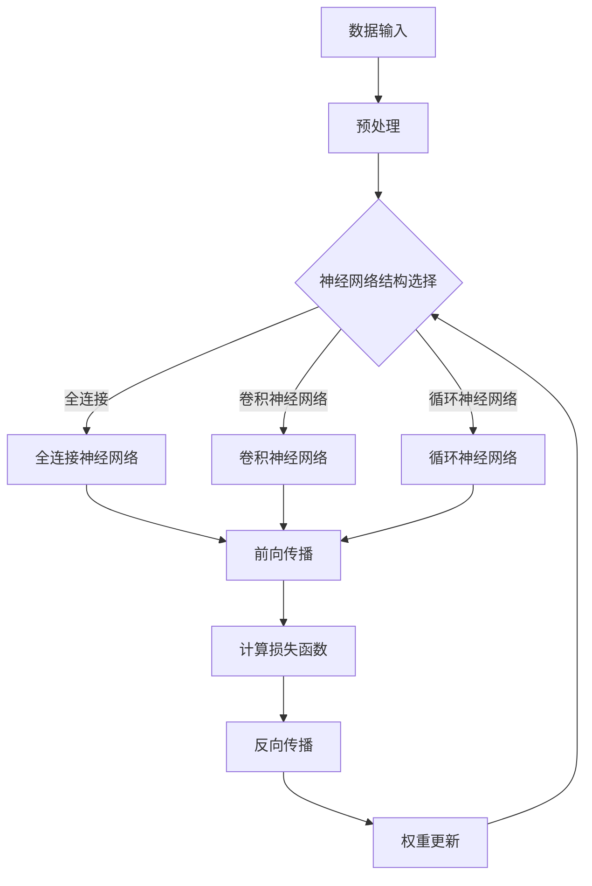

                 

# 一切皆是映射：从零开始构建深度学习架构

> 关键词：深度学习，架构设计，神经网络，映射，算法原理，数学模型，项目实战，应用场景

> 摘要：本文将从深度学习的核心概念出发，详细探讨深度学习架构的构建过程。我们将通过一步步的分析与推理，深入理解深度学习的内部机制，掌握从零开始构建深度学习架构的方法和技巧。本文适用于对深度学习有基础了解，希望进一步深入研究和实践的读者。

## 1. 背景介绍

### 1.1 目的和范围

本文旨在为广大深度学习爱好者和技术从业者提供一套系统、详细的深度学习架构构建指南。通过本文的学习，读者将能够：

- 理解深度学习的核心概念和基本原理。
- 掌握深度学习架构的设计原则和技巧。
- 学习如何使用现有的深度学习框架搭建和优化模型。
- 通过实际项目案例，深入了解深度学习架构在实际应用中的实现过程。

### 1.2 预期读者

本文适合以下读者群体：

- 对深度学习有基础了解，希望进一步提升技术水平的工程师和研究人员。
- 希望在人工智能领域有所建树的初学者。
- 对深度学习架构设计感兴趣的技术爱好者。

### 1.3 文档结构概述

本文将分为以下几个部分：

- 第1部分：背景介绍，包括本文的目的、预期读者以及文档结构概述。
- 第2部分：核心概念与联系，介绍深度学习的基本原理和核心概念，并使用Mermaid流程图进行说明。
- 第3部分：核心算法原理 & 具体操作步骤，详细讲解深度学习算法的基本原理和操作步骤，使用伪代码进行阐述。
- 第4部分：数学模型和公式 & 详细讲解 & 举例说明，介绍深度学习中的数学模型和公式，并进行详细讲解和实例说明。
- 第5部分：项目实战：代码实际案例和详细解释说明，通过实际项目案例，展示深度学习架构的实现过程和关键技术。
- 第6部分：实际应用场景，探讨深度学习在不同领域的应用案例。
- 第7部分：工具和资源推荐，介绍深度学习学习和开发中常用的工具和资源。
- 第8部分：总结：未来发展趋势与挑战，对深度学习的发展趋势和面临的挑战进行总结。
- 第9部分：附录：常见问题与解答，回答读者在学习和实践过程中可能遇到的问题。
- 第10部分：扩展阅读 & 参考资料，提供深度学习领域的相关阅读资源和参考资料。

### 1.4 术语表

#### 1.4.1 核心术语定义

- 深度学习（Deep Learning）：一种基于多层神经网络进行数据建模和预测的学习方法。
- 神经网络（Neural Network）：一种由大量简单神经元组成的计算模型，可以用于模拟人类大脑的信息处理过程。
- 前馈神经网络（Feedforward Neural Network）：一种简单的神经网络结构，信息从输入层传递到输出层，没有循环结构。
- 反向传播（Backpropagation）：一种用于训练神经网络的算法，通过计算输出误差梯度，反向更新网络权重。
- 损失函数（Loss Function）：用于衡量模型预测值与真实值之间差异的函数，用于指导模型优化过程。
- 优化器（Optimizer）：一种用于更新模型参数的算法，如梯度下降（Gradient Descent）。

#### 1.4.2 相关概念解释

- 激活函数（Activation Function）：用于确定神经元是否被激活的函数，常用的激活函数有sigmoid、ReLU等。
- 卷积神经网络（Convolutional Neural Network，CNN）：一种专门用于图像处理任务的神经网络，通过卷积层提取图像特征。
- 循环神经网络（Recurrent Neural Network，RNN）：一种可以处理序列数据的神经网络，具有记忆功能，适用于时间序列分析、语言建模等任务。
- 长短时记忆（Long Short-Term Memory，LSTM）：一种特殊的RNN结构，可以有效地解决长期依赖问题。

#### 1.4.3 缩略词列表

- CNN：卷积神经网络
- RNN：循环神经网络
- LSTM：长短时记忆
- GPU：图形处理器
- CPU：中央处理器
- CUDA：并行计算框架
- TensorFlow：开源深度学习框架
- PyTorch：开源深度学习框架

## 2. 核心概念与联系

在深入探讨深度学习架构之前，我们需要理解一些核心概念和它们之间的关系。以下是一个用于说明这些概念之间联系的Mermaid流程图：



### 2.1 数据输入与预处理

数据输入是深度学习模型构建的基础。首先，我们需要对输入数据（如图像、文本、音频等）进行预处理，包括数据清洗、归一化、编码等操作，以确保数据的质量和一致性。

### 2.2 神经网络结构选择

根据任务需求，选择合适的神经网络结构。全连接神经网络、卷积神经网络和循环神经网络是常见的三种神经网络结构。每种结构都有其独特的优势和适用场景。

### 2.3 前向传播

前向传播是神经网络处理数据的过程。输入数据通过神经网络中的各个层次，逐层计算并传递到输出层。在这个过程中，每个层次的神经元都通过激活函数进行非线性变换。

### 2.4 计算损失函数

前向传播完成后，我们需要计算损失函数，以衡量模型预测值与真实值之间的差距。常用的损失函数包括均方误差（MSE）、交叉熵损失（Cross-Entropy Loss）等。

### 2.5 反向传播

反向传播是神经网络的训练过程。通过计算损失函数的梯度，反向更新网络权重和偏置，以最小化损失函数。反向传播是深度学习训练的核心，是神经网络能够学习复杂模式的关键。

### 2.6 权重更新

在反向传播过程中，根据梯度信息更新网络权重和偏置。常见的优化算法包括梯度下降（Gradient Descent）、动量优化（Momentum）、Adam优化器等。

通过上述核心概念和流程的介绍，我们可以更好地理解深度学习架构的构建过程。接下来，我们将深入探讨深度学习算法的原理和实现。

## 3. 核心算法原理 & 具体操作步骤

深度学习的核心算法主要包括神经网络的前向传播、反向传播以及损失函数。以下将使用伪代码详细阐述这些算法的原理和操作步骤。

### 3.1 前向传播

```python
# 输入数据
x = ...

# 初始化神经网络参数
w1, b1 = ...
w2, b2 = ...
# ...

# 前向传播
z1 = x * w1 + b1
a1 = sigmoid(z1)

z2 = a1 * w2 + b2
a2 = sigmoid(z2)

# 输出
output = a2
```

在这个例子中，我们使用了一个简单的两层神经网络。输入数据`x`经过第一层（线性变换 + 偏置）后，通过激活函数`sigmoid`进行非线性变换，得到中间层的输出`a1`。然后，中间层的输出`a1`再经过第二层的线性变换和激活函数，得到最终的输出`output`。

### 3.2 反向传播

```python
# 计算损失函数的梯度
delta_output = output - y
delta_2 = delta_output * sigmoid_derivative(a2)
delta_1 = (delta_2 * w2) * sigmoid_derivative(a1)

# 更新权重和偏置
w2 += a1 * delta_output
b2 += delta_output
w1 += x * delta_1
b1 += delta_1
```

在反向传播过程中，我们首先计算输出层的误差梯度`delta_output`。然后，通过误差梯度和激活函数的导数，依次计算每一层的误差梯度。最后，根据误差梯度更新网络权重和偏置。

### 3.3 损失函数

```python
# 计算损失函数
loss = squared_error(output, y)

# 计算损失函数的导数
dloss_doutput = 2 * (output - y)
```

在这个例子中，我们使用均方误差（MSE）作为损失函数。均方误差的导数是损失函数梯度的重要参考，用于指导权重和偏置的更新。

通过上述伪代码，我们可以清楚地看到深度学习算法的核心原理和操作步骤。接下来，我们将进一步探讨深度学习中的数学模型和公式。

## 4. 数学模型和公式 & 详细讲解 & 举例说明

深度学习中的数学模型和公式是其核心组成部分，理解这些数学基础对于深入掌握深度学习至关重要。以下将详细介绍深度学习中的关键数学模型和公式，并进行举例说明。

### 4.1 激活函数

激活函数是深度学习中的一个重要组成部分，它引入了非线性的特性，使得神经网络能够拟合复杂的数据分布。常见的激活函数包括sigmoid、ReLU和tanh等。

#### 4.1.1 sigmoid函数

sigmoid函数的定义如下：

$$
\sigma(x) = \frac{1}{1 + e^{-x}}
$$

sigmoid函数的导数（即激活函数的导数）为：

$$
\sigma'(x) = \sigma(x) \cdot (1 - \sigma(x))
$$

#### 4.1.2 ReLU函数

ReLU（Rectified Linear Unit）函数是最常用的激活函数之一，其定义如下：

$$
ReLU(x) =
\begin{cases}
0 & \text{if } x < 0 \\
x & \text{if } x \geq 0
\end{cases}
$$

ReLU函数的导数（即激活函数的导数）为：

$$
ReLU'(x) =
\begin{cases}
0 & \text{if } x < 0 \\
1 & \text{if } x \geq 0
\end{cases}
$$

#### 4.1.3 tanh函数

tanh（双曲正切）函数的定义如下：

$$
tanh(x) = \frac{e^{x} - e^{-x}}{e^{x} + e^{-x}}
$$

tanh函数的导数（即激活函数的导数）为：

$$
tanh'(x) = 1 - tanh^2(x)
$$

### 4.2 损失函数

损失函数用于衡量模型预测值与真实值之间的差距，是深度学习训练过程中的核心指标。常见的损失函数包括均方误差（MSE）、交叉熵损失（Cross-Entropy Loss）等。

#### 4.2.1 均方误差（MSE）

均方误差（MSE）是深度学习中最常用的损失函数之一，其定义如下：

$$
MSE(y, \hat{y}) = \frac{1}{n} \sum_{i=1}^{n} (y_i - \hat{y}_i)^2
$$

其中，$y$表示真实值，$\hat{y}$表示预测值，$n$表示样本数量。

均方误差的导数（即损失函数的梯度）为：

$$
\frac{\partial MSE}{\partial \hat{y}} = 2(y - \hat{y})
$$

#### 4.2.2 交叉熵损失（Cross-Entropy Loss）

交叉熵损失函数常用于分类问题，其定义如下：

$$
H(y, \hat{y}) = -\sum_{i=1}^{n} y_i \cdot \log(\hat{y}_i)
$$

其中，$y$表示真实标签的one-hot编码，$\hat{y}$表示预测概率分布。

交叉熵损失的导数（即损失函数的梯度）为：

$$
\frac{\partial H}{\partial \hat{y}} = \hat{y} - y
$$

### 4.3 梯度下降（Gradient Descent）

梯度下降是深度学习训练过程中常用的优化算法，其基本思想是沿着损失函数梯度的反方向更新模型参数，以减小损失函数值。

梯度下降的更新规则如下：

$$
\theta_{t+1} = \theta_{t} - \alpha \cdot \nabla_{\theta} J(\theta)
$$

其中，$\theta$表示模型参数，$J(\theta)$表示损失函数，$\alpha$表示学习率。

### 4.4 举例说明

假设我们有一个简单的神经网络，输入为$x$，输出为$y$，真实值为$y^*$。我们需要使用均方误差（MSE）作为损失函数，并使用梯度下降进行训练。以下是具体的计算过程：

1. **前向传播**：

   输入$x$通过神经网络，得到预测输出$y$。

2. **计算损失函数**：

   $$MSE(y, y^*) = \frac{1}{2} (y - y^*)^2$$

3. **计算损失函数的梯度**：

   $$\frac{\partial MSE}{\partial y} = y - y^*$$

4. **更新模型参数**：

   $$y_{t+1} = y_t - \alpha (y - y^*)$$

通过上述过程，我们可以逐步减小预测输出与真实值之间的差距，提高模型的预测性能。

通过详细讲解和举例说明，我们可以更好地理解深度学习中的数学模型和公式，为后续的项目实战和实际应用打下坚实的基础。

## 5. 项目实战：代码实际案例和详细解释说明

### 5.1 开发环境搭建

在开始项目实战之前，我们需要搭建一个合适的开发环境。以下是搭建深度学习项目的常用步骤：

1. **安装Python**：确保Python环境已安装，版本建议为3.7或以上。
2. **安装深度学习框架**：选择一个流行的深度学习框架，如TensorFlow或PyTorch。以TensorFlow为例，可以通过以下命令安装：
   ```shell
   pip install tensorflow
   ```
3. **安装必要的库**：安装其他常用的库，如NumPy、Pandas等。例如：
   ```shell
   pip install numpy pandas
   ```
4. **配置GPU支持**：如果使用GPU进行训练，需要安装CUDA和cuDNN。具体安装步骤请参考相应框架的官方文档。

### 5.2 源代码详细实现和代码解读

以下是一个使用TensorFlow构建简单的深度学习模型的代码示例：

```python
import tensorflow as tf
import numpy as np
from sklearn.model_selection import train_test_split
from sklearn.preprocessing import StandardScaler

# 数据准备
# 假设我们已经有了输入数据X和标签y
# X, y = ...

# 划分训练集和测试集
X_train, X_test, y_train, y_test = train_test_split(X, y, test_size=0.2, random_state=42)

# 数据预处理
scaler = StandardScaler()
X_train_scaled = scaler.fit_transform(X_train)
X_test_scaled = scaler.transform(X_test)

# 构建模型
model = tf.keras.Sequential([
    tf.keras.layers.Dense(64, activation='relu', input_shape=(X_train_scaled.shape[1],)),
    tf.keras.layers.Dense(64, activation='relu'),
    tf.keras.layers.Dense(1)
])

# 编译模型
model.compile(optimizer='adam', loss='mean_squared_error', metrics=['mae'])

# 训练模型
model.fit(X_train_scaled, y_train, epochs=10, batch_size=32, validation_split=0.1)

# 评估模型
model.evaluate(X_test_scaled, y_test)
```

#### 5.2.1 代码解读

- **数据准备**：首先，我们需要准备好输入数据`X`和标签`y`。这些数据可以从各种数据集或自定义数据中获取。
- **划分训练集和测试集**：使用`train_test_split`函数将数据划分为训练集和测试集，以评估模型的泛化能力。
- **数据预处理**：使用`StandardScaler`对输入数据进行标准化处理，以提高模型的训练效果。
- **构建模型**：使用`Sequential`模型堆叠多层全连接层，每层之间可以使用不同的激活函数。在这里，我们使用了两个64个神经元的隐藏层。
- **编译模型**：编译模型时，指定优化器（`optimizer`）、损失函数（`loss`）和评估指标（`metrics`）。
- **训练模型**：使用`fit`函数训练模型，指定训练数据、训练轮数（`epochs`）、批量大小（`batch_size`）和验证集比例。
- **评估模型**：使用`evaluate`函数评估模型在测试集上的表现。

### 5.3 代码解读与分析

在上述代码中，我们使用TensorFlow构建了一个简单的深度学习模型，用于回归任务。以下是代码中的关键部分及其解析：

1. **数据准备**：
   ```python
   X, y = ...
   X_train, X_test, y_train, y_test = train_test_split(X, y, test_size=0.2, random_state=42)
   ```
   这部分代码用于准备数据。首先，从数据集中获取输入数据`X`和标签`y`。然后，使用`train_test_split`函数将数据划分为训练集和测试集，测试集的比例为20%。

2. **数据预处理**：
   ```python
   scaler = StandardScaler()
   X_train_scaled = scaler.fit_transform(X_train)
   X_test_scaled = scaler.transform(X_test)
   ```
   使用`StandardScaler`对输入数据`X`进行标准化处理。标准化处理可以减少特征间的差异，提高模型的训练效果。这里，我们分别对训练集和测试集进行标准化处理。

3. **构建模型**：
   ```python
   model = tf.keras.Sequential([
       tf.keras.layers.Dense(64, activation='relu', input_shape=(X_train_scaled.shape[1],)),
       tf.keras.layers.Dense(64, activation='relu'),
       tf.keras.layers.Dense(1)
   ])
   ```
   使用`Sequential`模型堆叠多层全连接层。每个隐藏层有64个神经元，并使用ReLU激活函数。输入层的形状由训练集数据的特征数决定。

4. **编译模型**：
   ```python
   model.compile(optimizer='adam', loss='mean_squared_error', metrics=['mae'])
   ```
   编译模型时，指定了优化器（`adam`）、损失函数（`mean_squared_error`）和评估指标（`mae`）。在这里，我们使用均方误差（MSE）作为损失函数，评估指标为平均绝对误差（MAE）。

5. **训练模型**：
   ```python
   model.fit(X_train_scaled, y_train, epochs=10, batch_size=32, validation_split=0.1)
   ```
   使用`fit`函数训练模型。这里，我们设置了训练轮数（`epochs`）为10，批量大小（`batch_size`）为32，并将10%的训练数据用于验证集。

6. **评估模型**：
   ```python
   model.evaluate(X_test_scaled, y_test)
   ```
   使用`evaluate`函数评估模型在测试集上的表现。这将返回测试集上的损失值和评估指标。

通过以上步骤，我们可以使用TensorFlow构建一个简单的深度学习模型，并进行训练和评估。接下来，我们将探讨深度学习在实际应用场景中的运用。

## 6. 实际应用场景

深度学习在众多实际应用场景中展现了其强大的能力，下面列举一些典型的应用场景，并简要介绍其应用方法和效果。

### 6.1 计算机视觉

计算机视觉是深度学习最成功的应用领域之一。深度学习模型，尤其是卷积神经网络（CNN），在图像分类、目标检测、图像分割等方面取得了显著的成果。

- **图像分类**：使用深度学习模型对图像进行分类，如ImageNet挑战赛。通过训练大规模卷积神经网络模型，可以实现高精度的图像分类。
- **目标检测**：使用深度学习模型检测图像中的物体，如SSD、YOLO等模型。这些模型可以在实时视频流中快速检测并定位物体。
- **图像分割**：使用深度学习模型对图像中的物体进行分割，如FCN、U-Net等模型。这些模型可以精确地分割出图像中的物体部分。

### 6.2 自然语言处理

自然语言处理（NLP）是深度学习的另一个重要应用领域。深度学习模型在文本分类、机器翻译、情感分析等方面取得了显著进展。

- **文本分类**：使用深度学习模型对文本进行分类，如情感分析、垃圾邮件过滤等。通过训练循环神经网络（RNN）或Transformer模型，可以实现高精度的文本分类。
- **机器翻译**：使用深度学习模型进行机器翻译，如Google翻译。通过训练编码器-解码器（Seq2Seq）模型，可以实现高质量的自然语言翻译。
- **情感分析**：使用深度学习模型分析文本的情感倾向，如评价分析、社交媒体情感分析等。通过训练情感分类模型，可以实现对文本情感的理解。

### 6.3 计算机游戏

深度学习在计算机游戏领域也取得了显著的成果，特别是在强化学习（Reinforcement Learning，RL）方面。

- **电子游戏**：使用深度强化学习模型训练智能体在电子游戏中进行游戏，如《魔兽世界》中的自动游戏。通过不断试错和自我学习，智能体可以掌握游戏的策略和技巧。
- **棋类游戏**：使用深度强化学习模型训练智能体在棋类游戏中进行对战，如《围棋》、《国际象棋》等。这些智能体可以在短时间内达到专业水平。

### 6.4 健康医疗

深度学习在健康医疗领域有着广泛的应用，包括医学图像分析、疾病预测等。

- **医学图像分析**：使用深度学习模型对医学图像进行分析，如肿瘤检测、骨折诊断等。通过训练卷积神经网络模型，可以实现高精度的图像分析。
- **疾病预测**：使用深度学习模型对健康数据进行分析，预测疾病的发生风险。通过训练循环神经网络（RNN）或Transformer模型，可以实现高质量的疾病预测。

### 6.5 其他领域

深度学习还在其他领域有着广泛的应用，如语音识别、无人驾驶、金融风险控制等。

- **语音识别**：使用深度学习模型进行语音识别，如自动字幕生成、语音助手等。通过训练循环神经网络（RNN）或Transformer模型，可以实现高精度的语音识别。
- **无人驾驶**：使用深度学习模型进行无人驾驶，如自动驾驶汽车、无人机等。通过训练卷积神经网络（CNN）或Transformer模型，可以实现高精度的环境感知和路径规划。
- **金融风险控制**：使用深度学习模型进行金融风险控制，如信用评分、市场预测等。通过训练循环神经网络（RNN）或Transformer模型，可以实现高质量的金融风险预测。

通过以上实际应用场景的介绍，我们可以看到深度学习在各个领域的广泛应用和巨大潜力。未来，随着深度学习技术的不断发展和完善，它将在更多领域发挥重要作用。

## 7. 工具和资源推荐

### 7.1 学习资源推荐

对于深度学习的学习和实践，以下是推荐的一些优质资源：

#### 7.1.1 书籍推荐

1. **《深度学习》（Deep Learning）** - 由Ian Goodfellow、Yoshua Bengio和Aaron Courville合著的这本书是深度学习的经典教材，内容全面、深入。
2. **《神经网络与深度学习》** - 这本书由邱锡鹏教授撰写，系统地介绍了神经网络和深度学习的基础知识和实践方法。
3. **《动手学深度学习》（Dive into Deep Learning）** - 这是一本开源的中文深度学习教材，适合初学者和进阶者，代码实现丰富。

#### 7.1.2 在线课程

1. **Coursera上的“深度学习专项课程”** - 由吴恩达（Andrew Ng）教授主讲，内容包括深度学习的基本原理和应用实践。
2. **Udacity的“深度学习工程师纳米学位”** - 提供了系统的深度学习知识和项目实践，适合希望全面掌握深度学习技术的学员。
3. **edX上的“深度学习”课程** - 由伊利诺伊大学香槟分校（UIUC）提供，内容涵盖了深度学习的基本理论和应用实践。

#### 7.1.3 技术博客和网站

1. **GitHub** - GitHub上有许多开源的深度学习项目和教程，是学习和实践的好资源。
2. **Medium** - Medium上有许多深度学习领域的专家和爱好者撰写的博客，内容丰富、见解深刻。
3. **Towards Data Science** - 这个网站汇集了许多数据科学和深度学习的文章，适合持续学习和了解最新动态。

### 7.2 开发工具框架推荐

#### 7.2.1 IDE和编辑器

1. **Visual Studio Code** - 具有丰富的扩展功能，支持多种编程语言，是深度学习开发的热门选择。
2. **Jupyter Notebook** - 适合数据分析和实验，可以轻松创建和共享代码、文本和可视化。
3. **PyCharm** - 强大的Python集成开发环境，支持Jupyter Notebook和云服务，适合专业的深度学习开发。

#### 7.2.2 调试和性能分析工具

1. **TensorBoard** - TensorFlow的官方可视化工具，用于分析模型性能和优化。
2. **PyTorch Debugger** - 用于调试PyTorch代码，支持Python的调试工具。
3. **Wandb** - 一个用于跟踪、可视化和管理深度学习实验的平台。

#### 7.2.3 相关框架和库

1. **TensorFlow** - Google开源的深度学习框架，功能强大，支持多种编程语言。
2. **PyTorch** - Facebook开源的深度学习框架，具有动态计算图，易于使用和调试。
3. **Keras** - 一个高层次的深度学习框架，可以简化TensorFlow和Theano的使用。
4. **Scikit-learn** - 一个用于机器学习的Python库，提供了丰富的算法和工具。

### 7.3 相关论文著作推荐

#### 7.3.1 经典论文

1. **“A Learning Algorithm for Continually Running Fully Recurrent Neural Networks”** - Hessian-free优化算法的开创性工作。
2. **“Deep Learning”** - Ian Goodfellow等人的文章，系统地介绍了深度学习的理论和方法。
3. **“Convolutional Networks and Applications in Visual Recognition”** - 卷积神经网络的奠基性论文。

#### 7.3.2 最新研究成果

1. **“BERT: Pre-training of Deep Bidirectional Transformers for Language Understanding”** - Google提出的一种用于自然语言处理的新型深度学习模型。
2. **“Gated Graph Neural Networks”** - 用于图数据学习的深度学习模型，具有广泛的适用性。
3. **“Differential Privacy: The Case of Neural Networks”** - 探讨如何在保持数据隐私的同时训练深度学习模型。

#### 7.3.3 应用案例分析

1. **“AI Drive Challenge”** - 一个关于自动驾驶技术的案例研究，展示了深度学习在无人驾驶领域的应用。
2. **“Deep Learning for Medical Image Analysis”** - 深度学习在医学图像分析中的应用，包括肿瘤检测和疾病诊断。
3. **“Deep Learning in Finance”** - 深度学习在金融领域的应用，包括市场预测和信用评分。

通过上述推荐，读者可以系统地学习深度学习的基础知识和实践技能，掌握先进的深度学习工具和框架，并在实际项目中取得成功。

## 8. 总结：未来发展趋势与挑战

随着深度学习技术的不断进步，其在各个领域的应用前景愈发广阔。以下是未来深度学习发展趋势和面临的挑战：

### 8.1 发展趋势

1. **算法优化**：深度学习算法将持续优化，以提高计算效率、减少内存占用和降低能耗。例如，通过模型剪枝、量化、神经网络架构搜索（NAS）等技术，可以显著提升模型性能。
2. **硬件支持**：随着硬件技术的发展，如GPU、TPU等专用硬件的普及，深度学习将能够处理更大规模的数据和更复杂的模型。
3. **迁移学习**：迁移学习技术将进一步提升深度学习的泛化能力，使得模型能够从已有任务的知识迁移到新任务，减少对大规模标注数据的依赖。
4. **多模态学习**：深度学习将能够处理多种类型的数据（如图像、文本、音频等），实现多模态数据的联合建模和交互式学习。
5. **分布式训练**：分布式训练技术将使深度学习模型能够在更大规模的集群上进行训练，提高训练效率和可扩展性。

### 8.2 面临的挑战

1. **数据隐私**：深度学习模型在训练和部署过程中涉及大量个人数据，如何保障数据隐私和安全成为一大挑战。需要探索更加隐私友好的深度学习算法和数据保护机制。
2. **算法公平性**：深度学习模型在训练过程中可能会引入偏见，导致算法公平性问题。需要研究如何设计和训练公平、无偏的深度学习模型。
3. **模型可解释性**：深度学习模型具有较强的黑箱特性，模型决策过程难以解释。需要开发可解释的深度学习算法，提高模型的透明度和可理解性。
4. **能耗与资源消耗**：随着模型规模和复杂度的增加，深度学习模型的能耗和资源消耗显著上升。需要研究更加节能和高效的深度学习算法和硬件。
5. **数据质量和标注**：深度学习模型依赖于高质量的数据和准确的标注，但在实际应用中，获取和处理这些数据是一项巨大的挑战。需要开发自动化数据标注和清洗工具。

总之，未来深度学习技术的发展将在面对挑战的同时，带来更多的机遇。通过不断的研究和创新，我们可以期待深度学习在更广泛领域的应用，推动人工智能的进步。

## 9. 附录：常见问题与解答

### 9.1 常见问题

1. **问题一：如何选择合适的深度学习框架？**
   **解答**：选择深度学习框架时，需要考虑以下因素：
   - **项目需求**：根据项目具体需求（如图像处理、自然语言处理等），选择相应的框架。
   - **熟悉度**：选择自己熟悉的框架，可以更快地掌握和实现。
   - **性能与资源**：考虑框架的性能和资源占用，如TensorFlow适用于大规模模型，而PyTorch在动态图方面表现优异。
   - **社区支持**：选择社区活跃、资源丰富的框架，便于学习和解决问题。

2. **问题二：深度学习模型训练时间太长怎么办？**
   **解答**：
   - **优化算法**：尝试使用更高效的优化算法，如Adam优化器。
   - **数据预处理**：对数据进行预处理，如批量归一化、数据增强等，以加速训练。
   - **模型简化**：通过模型剪枝、量化等技术简化模型，减少计算量。
   - **分布式训练**：利用分布式计算资源进行训练，如使用GPU或TPU。

3. **问题三：如何保证深度学习模型的公平性？**
   **解答**：
   - **数据质量**：确保训练数据的质量，避免数据中的偏见和异常值。
   - **算法改进**：设计算法时考虑公平性，如采用对抗训练、平衡分类等策略。
   - **模型解释**：通过模型解释技术，理解模型决策过程，发现和纠正潜在的偏见。
   - **监管与合规**：遵守相关法律法规，确保深度学习应用在公平、合规的前提下进行。

### 9.2 解答过程

对于常见问题，解答过程通常包括以下步骤：

1. **问题识别**：通过阅读文档、社区讨论或实践经验，识别用户可能遇到的问题。
2. **分析原因**：根据问题的具体描述，分析问题产生的原因。
3. **解决方案**：结合已有知识和经验，提出可能的解决方案。
4. **测试验证**：在实际环境中测试解决方案的有效性。
5. **文档更新**：将解决方案和测试结果更新到文档中，便于其他用户查阅。

通过上述过程，我们可以为深度学习实践者提供详细的解答和指导，帮助他们解决实际问题，提高深度学习应用的效能和可靠性。

## 10. 扩展阅读 & 参考资料

### 10.1 扩展阅读

1. **《深度学习：提高篇》** - Ian Goodfellow的著作，深入探讨了深度学习的最新技术和应用。
2. **《深度学习实践》** - 对深度学习框架和算法进行了详细的实战指导。
3. **《机器学习实战》** - 谢幸等人的著作，涵盖了机器学习和深度学习的基础知识和应用案例。

### 10.2 参考资料

1. **TensorFlow官方文档** - [TensorFlow Documentation](https://www.tensorflow.org/)
2. **PyTorch官方文档** - [PyTorch Documentation](https://pytorch.org/docs/stable/)
3. **Coursera深度学习课程** - [Deep Learning Specialization](https://www.coursera.org/specializations/deeplearning)
4. **Medium深度学习博客** - [Medium Deep Learning Blog](https://medium.com/topic/deep-learning)
5. **GitHub深度学习开源项目** - [GitHub Deep Learning Projects](https://github.com/topics/deep-learning)

通过上述扩展阅读和参考资料，读者可以进一步深入学习和探索深度学习的相关内容，不断提升自己的技术水平和实践能力。

