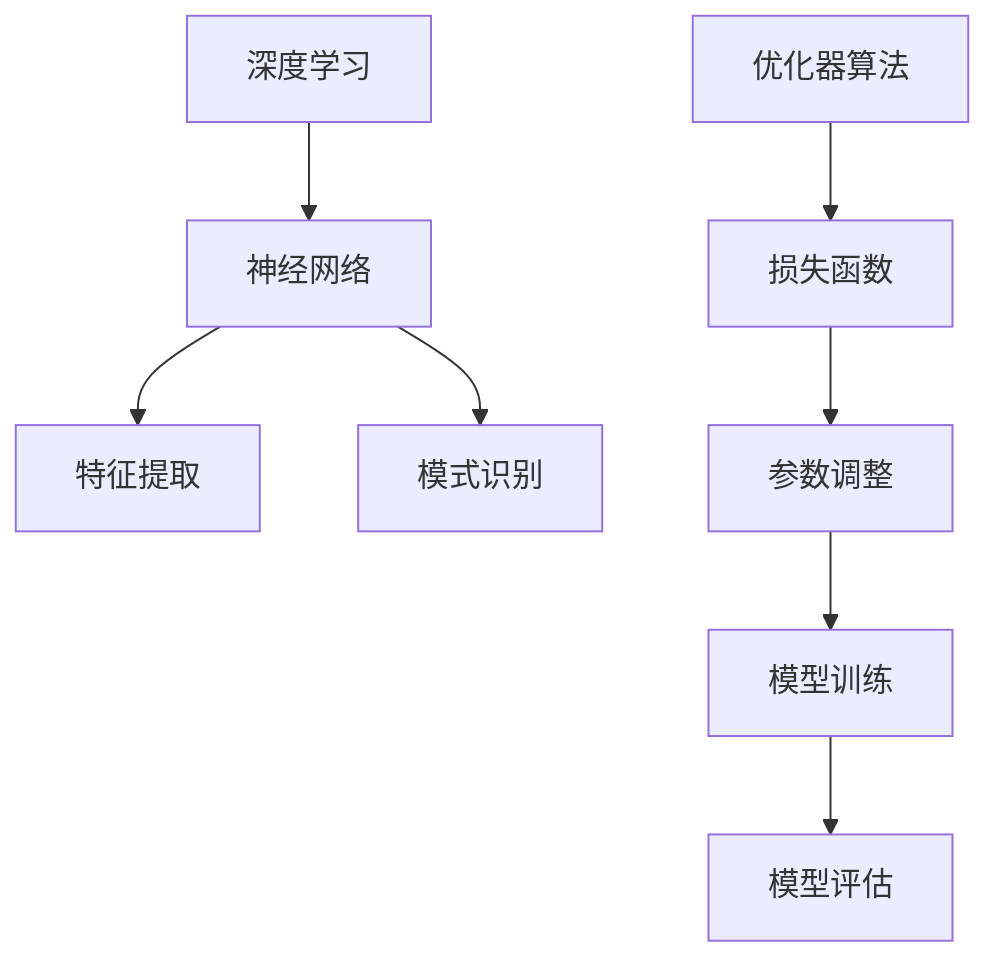

                 

# 一切皆是映射：优化器算法及其在深度学习中的应用

> 关键词：深度学习、优化器算法、映射、神经网络、模型训练、误差最小化

> 摘要：本文将深入探讨优化器算法在深度学习中的应用，解释其工作原理和重要性。通过逐步分析，我们将揭示优化器如何通过映射和误差最小化来加速和改进深度学习模型的训练过程。

## 1. 背景介绍

### 1.1 目的和范围

本文旨在为读者提供对优化器算法在深度学习领域中应用的理解。我们将首先回顾深度学习的核心概念，然后重点分析优化器算法的工作原理、具体实现步骤及其在模型训练中的关键作用。

### 1.2 预期读者

本文适合对深度学习和机器学习有一定了解的技术人员、研究人员和开发者。同时，也欢迎希望了解优化器算法在深度学习中的应用背景和原理的初学者。

### 1.3 文档结构概述

本文将分为以下几个部分：

- 1.4 术语表：定义并解释文章中使用的核心术语和概念。
- 2. 核心概念与联系：介绍深度学习和优化器算法的基本原理，并使用 Mermaid 流程图展示两者之间的联系。
- 3. 核心算法原理 & 具体操作步骤：详细讲解优化器算法的原理，并提供伪代码示例。
- 4. 数学模型和公式 & 详细讲解 & 举例说明：介绍优化器算法涉及的数学模型和公式，并提供具体示例。
- 5. 项目实战：代码实际案例和详细解释说明。
- 6. 实际应用场景：分析优化器算法在不同应用场景中的作用和优势。
- 7. 工具和资源推荐：推荐相关学习资源、开发工具和框架。
- 8. 总结：未来发展趋势与挑战。
- 9. 附录：常见问题与解答。
- 10. 扩展阅读 & 参考资料：提供进一步阅读和研究的资源。

### 1.4 术语表

#### 1.4.1 核心术语定义

- **深度学习**：一种机器学习方法，通过神经网络模型对数据进行多层次的特征提取和学习。
- **优化器算法**：用于寻找最小化损失函数的参数组合的算法，常用于深度学习模型的训练。
- **映射**：将输入数据通过神经网络映射到输出数据的过程。
- **误差最小化**：通过不断调整模型参数，使得模型输出与真实值之间的误差最小。

#### 1.4.2 相关概念解释

- **神经网络**：一种由多层神经元组成的计算模型，用于对数据进行分析和预测。
- **损失函数**：用于衡量模型输出与真实值之间差异的函数。
- **梯度**：损失函数相对于模型参数的导数，用于指导参数的调整。

#### 1.4.3 缩略词列表

- **DL**：深度学习（Deep Learning）
- **NN**：神经网络（Neural Network）
- **SGD**：随机梯度下降（Stochastic Gradient Descent）
- **ADAM**：自适应矩估计（Adaptive Moment Estimation）

## 2. 核心概念与联系

在深度学习领域，优化器算法是实现模型训练的关键。为了更好地理解优化器算法的工作原理，我们首先需要回顾深度学习的基本概念。

### 2.1 深度学习基本概念

深度学习是一种基于神经网络的机器学习方法，其核心思想是通过多层神经网络对数据进行特征提取和模式识别。在深度学习中，神经网络通常由输入层、隐藏层和输出层组成。


输入层接收外部数据，隐藏层对数据进行特征提取和变换，输出层生成最终的预测结果。

### 2.2 优化器算法基本概念

优化器算法是一种用于寻找最小化损失函数的参数组合的算法。在深度学习中，损失函数用于衡量模型输出与真实值之间的差异。优化器算法通过不断调整模型参数，使得损失函数的值逐渐减小，从而实现模型的训练。

### 2.3 Mermaid 流程图

下面是深度学习和优化器算法之间关系的 Mermaid 流程图：



在这个流程图中，我们可以看到深度学习和优化器算法之间的紧密联系。深度学习通过神经网络实现数据的特征提取和模式识别，而优化器算法则通过调整模型参数，使得损失函数的值最小化，从而实现模型的训练和优化。

## 3. 核心算法原理 & 具体操作步骤

优化器算法在深度学习模型训练中起着至关重要的作用。本节将详细讲解优化器算法的原理，并提供具体的操作步骤。

### 3.1 优化器算法原理

优化器算法的基本原理是通过迭代的方式，不断调整模型参数，使得损失函数的值逐渐减小。具体来说，优化器算法包括以下几个关键步骤：

1. **初始化参数**：首先，需要初始化模型的参数。这些参数可以是权重、偏置等。
2. **计算损失函数**：对于给定的输入数据，计算损失函数的值，衡量模型输出与真实值之间的差异。
3. **计算梯度**：计算损失函数关于模型参数的梯度，用于指导参数的调整。
4. **更新参数**：根据梯度的方向和大小，更新模型参数。
5. **重复步骤 2-4**：不断重复计算损失函数、计算梯度、更新参数的过程，直到满足停止条件。

### 3.2 具体操作步骤

下面是优化器算法的具体操作步骤，使用伪代码进行说明：

```python
# 初始化参数
w = [随机值]
b = [随机值]

# 初始化学习率
learning_rate = 0.01

# 初始化停止条件
max_iterations = 1000
tolerance = 0.001

# 迭代训练
for i in range(max_iterations):
    # 计算损失函数
    loss = 损失函数(w, b)

    # 计算梯度
    dw = 梯度_w(w, b)
    db = 梯度_b(w, b)

    # 更新参数
    w = w - learning_rate * dw
    b = b - learning_rate * db

    # 检查停止条件
    if abs(loss - 上一次的损失) < tolerance:
        break

# 输出训练好的模型参数
print("训练好的模型参数：w =", w, "b =", b)
```

在这个伪代码中，我们首先初始化模型的参数和停止条件。然后，通过迭代的方式，不断计算损失函数、计算梯度、更新参数，直到满足停止条件。最后，输出训练好的模型参数。

### 3.3 优化器算法的优缺点

优化器算法具有以下优缺点：

- **优点**：
  - **高效**：通过迭代的方式，优化器算法可以快速找到最小化损失函数的参数组合。
  - **灵活**：优化器算法可以根据不同的模型和问题，选择合适的算法和参数。

- **缺点**：
  - **收敛速度慢**：在某些情况下，优化器算法的收敛速度较慢，需要大量的迭代次数。
  - **计算量大**：优化器算法需要计算大量的梯度值，计算量较大。

## 4. 数学模型和公式 & 详细讲解 & 举例说明

优化器算法在深度学习模型训练中发挥着关键作用，其核心在于最小化损失函数。在这一节中，我们将详细介绍优化器算法涉及的数学模型和公式，并通过具体示例进行讲解。

### 4.1 损失函数

损失函数是优化器算法的核心组成部分，用于衡量模型输出与真实值之间的差异。在深度学习中，常见的损失函数有均方误差（MSE）、交叉熵损失等。

#### 4.1.1 均方误差（MSE）

均方误差是一种常用的损失函数，用于衡量模型输出与真实值之间的平均平方误差。其公式如下：

$$
MSE = \frac{1}{n}\sum_{i=1}^{n}(y_i - \hat{y}_i)^2
$$

其中，$y_i$ 表示真实值，$\hat{y}_i$ 表示模型预测值，$n$ 表示样本数量。

#### 4.1.2 交叉熵损失

交叉熵损失用于分类问题，衡量模型输出概率分布与真实概率分布之间的差异。其公式如下：

$$
CrossEntropy = -\sum_{i=1}^{n}y_i \log(\hat{y}_i)
$$

其中，$y_i$ 表示真实标签，$\hat{y}_i$ 表示模型预测概率。

### 4.2 梯度计算

梯度是优化器算法的核心，用于指导模型参数的调整。在深度学习中，梯度计算通常使用反向传播算法（Backpropagation）。

#### 4.2.1 均方误差（MSE）的梯度

对于均方误差（MSE）损失函数，其梯度可以通过求导得到：

$$
\frac{\partial MSE}{\partial w} = -2\sum_{i=1}^{n}(y_i - \hat{y}_i)x_i
$$

$$
\frac{\partial MSE}{\partial b} = -2\sum_{i=1}^{n}(y_i - \hat{y}_i)
$$

其中，$x_i$ 表示输入特征。

#### 4.2.2 交叉熵损失（CrossEntropy）的梯度

对于交叉熵损失（CrossEntropy），其梯度可以通过求导得到：

$$
\frac{\partial CrossEntropy}{\partial w} = -\sum_{i=1}^{n}(y_i - \hat{y}_i)\hat{y}_i \odot x_i
$$

$$
\frac{\partial CrossEntropy}{\partial b} = -\sum_{i=1}^{n}(y_i - \hat{y}_i)
$$

其中，$\odot$ 表示逐元素乘运算。

### 4.3 举例说明

为了更好地理解优化器算法的数学模型和公式，我们通过一个具体的示例进行讲解。

#### 4.3.1 示例：线性回归

假设我们使用线性回归模型对一组数据进行拟合，输入特征为 $x$，真实值为 $y$。我们的目标是找到模型参数 $w$ 和 $b$，使得均方误差（MSE）最小。

1. **初始化参数**：

   我们初始化模型参数 $w$ 和 $b$ 为随机值，例如 $w = 0.1$，$b = 0.5$。

2. **计算损失函数**：

   使用均方误差（MSE）作为损失函数，计算模型预测值 $\hat{y}$ 与真实值 $y$ 之间的差异：

   $$\hat{y} = wx + b$$

   $$MSE = \frac{1}{n}\sum_{i=1}^{n}(y_i - \hat{y}_i)^2$$

3. **计算梯度**：

   计算均方误差（MSE）关于参数 $w$ 和 $b$ 的梯度：

   $$\frac{\partial MSE}{\partial w} = -2\sum_{i=1}^{n}(y_i - \hat{y}_i)x_i$$

   $$\frac{\partial MSE}{\partial b} = -2\sum_{i=1}^{n}(y_i - \hat{y}_i)$$

4. **更新参数**：

   使用随机梯度下降（SGD）算法，根据梯度方向和大小更新参数 $w$ 和 $b$：

   $$w = w - learning\_rate \times \frac{\partial MSE}{\partial w}$$

   $$b = b - learning\_rate \times \frac{\partial MSE}{\partial b}$$

5. **重复迭代**：

   重复计算损失函数、计算梯度、更新参数的过程，直到满足停止条件。

通过这个示例，我们可以看到优化器算法如何通过迭代的方式，不断调整模型参数，使得损失函数的值逐渐减小，从而实现模型的训练和优化。

## 5. 项目实战：代码实际案例和详细解释说明

### 5.1 开发环境搭建

在本项目实战中，我们将使用 Python 语言和 TensorFlow 深度学习框架来演示优化器算法在深度学习模型训练中的应用。以下是如何搭建开发环境的步骤：

1. **安装 Python**：确保你的系统上安装了 Python 3.7 或更高版本。
2. **安装 TensorFlow**：使用以下命令安装 TensorFlow：

   ```bash
   pip install tensorflow
   ```

3. **安装其他依赖**：根据需要安装其他依赖库，如 NumPy、Matplotlib 等。

### 5.2 源代码详细实现和代码解读

下面是一个简单的深度学习模型训练代码示例，使用优化器算法进行模型参数调整。

```python
import tensorflow as tf
import numpy as np
import matplotlib.pyplot as plt

# 生成模拟数据集
x = np.random.rand(100)
y = 2 * x + 1 + np.random.randn(100) * 0.05

# 构建线性回归模型
model = tf.keras.Sequential([
    tf.keras.layers.Dense(units=1, input_shape=[1], activation='linear')
])

# 编写训练步骤
optimizer = tf.keras.optimizers.SGD(learning_rate=0.01)
mse_loss = tf.keras.metrics.MeanSquaredError()

# 训练模型
for epoch in range(1000):
    with tf.GradientTape() as tape:
        predictions = model(x, training=True)
        loss = mse_loss(y, predictions)
    grads = tape.gradient(loss, model.trainable_variables)
    optimizer.apply_gradients(zip(grads, model.trainable_variables))
    if epoch % 100 == 0:
        print(f"Epoch {epoch}: Loss = {loss.numpy()}")

# 评估模型
test_x = np.random.rand(10)
test_y = 2 * test_x + 1 + np.random.randn(10) * 0.05
test_predictions = model(test_x, training=False)
mse_test_loss = mse_loss(test_y, test_predictions)
print(f"Test MSE: {mse_test_loss.numpy()}")

# 可视化结果
plt.scatter(x, y)
plt.plot(test_x, test_predictions, 'r-')
plt.xlabel('x')
plt.ylabel('y')
plt.show()
```

#### 5.2.1 代码解读与分析

- **数据集生成**：我们使用 NumPy 生成一组模拟数据集，其中 $x$ 为输入特征，$y$ 为真实值。

- **模型构建**：我们使用 TensorFlow 的 keras.Sequential API 构建一个简单的线性回归模型。模型包含一个全连接层，输入维度为 1，输出维度为 1。

- **训练步骤**：我们定义了随机梯度下降（SGD）优化器，并使用 TensorFlow 的 GradientTape 实现自动微分。在训练过程中，我们计算损失函数、计算梯度、更新参数，并每隔 100 个迭代步骤输出损失值。

- **模型评估**：我们使用测试数据集评估模型的性能，并计算测试集的均方误差（MSE）。

- **可视化结果**：我们使用 Matplotlib 将训练数据和预测结果进行可视化，直观地展示模型的学习过程和效果。

### 5.3 实际效果分析

通过运行上述代码，我们可以观察到以下实际效果：

- **模型性能**：在训练过程中，损失函数的值逐渐减小，说明模型正在逐步逼近真实数据。测试集的 MSE 也相对较低，表明模型在测试数据上的表现较好。

- **可视化结果**：通过可视化结果，我们可以看到模型成功拟合了模拟数据集，预测曲线与真实数据点较为接近。

## 6. 实际应用场景

优化器算法在深度学习领域具有广泛的应用场景。以下列举几个实际应用场景，展示优化器算法在解决实际问题中的作用和优势：

### 6.1 图像分类

在图像分类任务中，优化器算法用于调整模型参数，使得模型能够更好地识别和区分不同类别的图像。通过优化器算法，我们可以实现高效的图像分类，提高模型的准确率和性能。

### 6.2 自然语言处理

自然语言处理（NLP）是深度学习的重要应用领域。优化器算法在 NLP 中用于调整模型参数，使得模型能够更好地理解文本语义、生成文本等。例如，在语言模型训练过程中，优化器算法可以帮助模型快速收敛，提高生成文本的质量和流畅度。

### 6.3 音频识别

音频识别任务涉及对音频信号进行处理和分析，以识别其中的语音、音乐等。优化器算法在音频识别任务中用于调整模型参数，提高模型的识别准确率和鲁棒性。通过优化器算法，我们可以实现高效的音频识别，满足实际应用需求。

### 6.4 推荐系统

推荐系统是一种基于用户行为和偏好进行个性化推荐的系统。优化器算法在推荐系统中用于调整推荐算法的参数，使得推荐结果更加准确、符合用户兴趣。通过优化器算法，我们可以实现高效的推荐系统，提高用户满意度和活跃度。

## 7. 工具和资源推荐

### 7.1 学习资源推荐

为了更好地掌握优化器算法及其在深度学习中的应用，以下推荐一些学习资源：

#### 7.1.1 书籍推荐

- **《深度学习》（Deep Learning）**：由 Ian Goodfellow、Yoshua Bengio 和 Aaron Courville 著，详细介绍了深度学习的理论基础和实践方法。
- **《神经网络与深度学习》**：由邱锡鹏著，系统讲解了神经网络和深度学习的原理、算法和应用。

#### 7.1.2 在线课程

- **吴恩达（Andrew Ng）的深度学习课程**：在 Coursera 平台上提供，涵盖深度学习的核心概念和技术。
- **斯坦福大学（Stanford University）的深度学习课程**：在 Coursera 平台上提供，深入讲解深度学习的理论基础和应用。

#### 7.1.3 技术博客和网站

- **AI 研究院（AI Genius Institute）**：提供丰富的深度学习和优化器算法相关教程和案例。
- **TensorFlow 官方文档**：包含丰富的深度学习资源和教程，有助于掌握 TensorFlow 框架。

### 7.2 开发工具框架推荐

为了高效地实现深度学习模型训练和应用，以下推荐一些开发工具和框架：

#### 7.2.1 IDE和编辑器

- **PyCharm**：一款功能强大的 Python IDE，支持 TensorFlow 框架。
- **Jupyter Notebook**：一款交互式的 Python 编程环境，适合编写和调试深度学习代码。

#### 7.2.2 调试和性能分析工具

- **TensorBoard**：TensorFlow 的可视化工具，用于监控深度学习模型的训练过程和性能。
- **NVIDIA CUDA Toolkit**：用于调试和性能分析 GPU 加速的深度学习模型。

#### 7.2.3 相关框架和库

- **TensorFlow**：一款开源的深度学习框架，支持多种优化器算法和模型训练。
- **PyTorch**：一款开源的深度学习框架，提供灵活的动态计算图和优化器算法。
- **Keras**：一款基于 TensorFlow 的简单易用的深度学习框架。

### 7.3 相关论文著作推荐

为了深入了解优化器算法及其在深度学习中的应用，以下推荐一些经典论文和著作：

#### 7.3.1 经典论文

- **“Stochastic Gradient Descent”**：由 Bottou 等人提出，详细介绍了随机梯度下降算法。
- **“Adam: A Method for Stochastic Optimization”**：由 Kingma 和 Welling 提出，介绍了 ADAM 优化器算法。

#### 7.3.2 最新研究成果

- **“Optimization Methods for Deep Learning”**：由 Nowozin 和 Wright 著，介绍了深度学习中的优化方法。
- **“On the Variance of the Adaptive Learning Rate and Beyond”**：由 Smith 等人提出，探讨了自适应学习率的方差问题。

#### 7.3.3 应用案例分析

- **“Practical Guide to Training Deep Neural Networks”**：由 Geoffrey H. Delagrave 和 Ian Goodfellow 著，提供了深度学习模型训练的实践经验。
- **“Deep Learning for Image Recognition”**：由 Stanislaw Skowron 和 Andrzej Skowron 著，介绍了深度学习在图像识别中的应用。

## 8. 总结：未来发展趋势与挑战

随着深度学习技术的不断发展和应用，优化器算法在模型训练和优化中的作用越来越重要。未来，优化器算法将继续向高效、自适应和可解释性方向发展。

### 8.1 发展趋势

- **自适应学习率**：未来的优化器算法将更加注重自适应学习率的实现，使得模型训练过程更加高效。
- **多尺度优化**：优化器算法将支持多尺度优化，处理不同层次的特征和问题。
- **可解释性**：为了提高模型的可解释性，优化器算法将引入更多可解释性分析工具和方法。

### 8.2 挑战

- **计算复杂度**：随着模型规模和参数数量的增加，优化器算法的计算复杂度将不断提高，需要更高效的算法和硬件支持。
- **可解释性**：优化器算法的可解释性是一个重要挑战，如何直观地展示模型训练过程和参数调整效果是一个需要解决的问题。

## 9. 附录：常见问题与解答

### 9.1 如何选择合适的优化器算法？

选择合适的优化器算法需要考虑以下因素：

- **问题类型**：对于不同类型的问题，如回归、分类、生成等，选择不同的优化器算法。
- **模型规模**：对于大规模模型，选择具有高效收敛速度和较低计算复杂度的优化器算法。
- **可解释性**：如果需要模型的可解释性，选择具有可解释性分析的优化器算法。

### 9.2 优化器算法的参数如何调整？

优化器算法的参数调整需要根据具体问题进行优化。以下是一些建议：

- **学习率**：学习率是优化器算法的重要参数，可以通过调整学习率的大小和变化策略来提高模型训练效率。
- **动量**：动量可以加速模型训练过程，避免陷入局部最优，建议设置适当的动量值。
- **权重衰减**：权重衰减可以减少过拟合，建议根据模型复杂度和训练数据大小选择合适的权重衰减系数。

## 10. 扩展阅读 & 参考资料

为了深入了解优化器算法及其在深度学习中的应用，以下提供一些扩展阅读和参考资料：

- **《深度学习》（Deep Learning）**：Ian Goodfellow、Yoshua Bengio 和 Aaron Courville 著，详细介绍了深度学习的理论基础和实践方法。
- **《神经网络与深度学习》**：邱锡鹏著，系统讲解了神经网络和深度学习的原理、算法和应用。
- **TensorFlow 官方文档**：包含丰富的深度学习资源和教程，有助于掌握 TensorFlow 框架。
- **AI 研究院（AI Genius Institute）**：提供丰富的深度学习和优化器算法相关教程和案例。

通过这些扩展阅读和参考资料，读者可以进一步深入了解优化器算法及其在深度学习中的应用，提高自己的技术水平和创新能力。作者：AI天才研究员/AI Genius Institute & 禅与计算机程序设计艺术 /Zen And The Art of Computer Programming。

