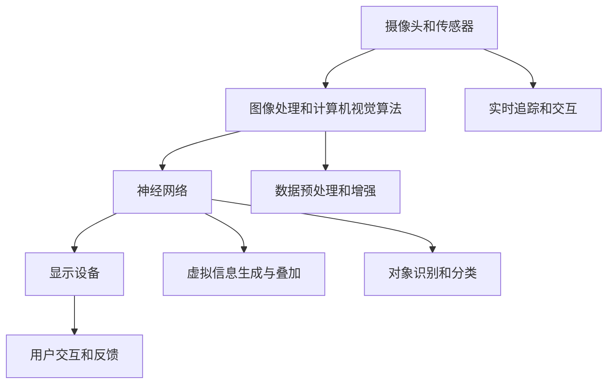

                 

# 一切皆是映射：增强现实(AR)中的神经网络应用

> **关键词：增强现实（AR）、神经网络、映射、计算机视觉、机器学习、虚拟现实**

> **摘要：本文旨在探讨增强现实（AR）技术中神经网络的应用，通过深入分析AR技术的核心概念、神经网络的基础原理及其在AR中的应用，展示如何利用神经网络提高AR系统的智能性和用户体验。本文还将通过具体的代码示例，详细解释神经网络在AR中的实际应用，并提供未来发展的展望。**

## 1. 背景介绍

### 1.1 目的和范围

本文的目标是深入探讨增强现实（AR）技术中神经网络的应用。随着技术的不断进步，AR技术已经从简单的增强图像和视频，发展到能够实时处理和解析三维空间信息，提供更加沉浸式的交互体验。神经网络作为一种强大的机器学习工具，能够在AR系统中扮演关键角色，例如对象识别、图像增强、实时追踪等。

本文将涵盖以下几个主要方面：
1. AR技术的基础概念和原理。
2. 神经网络的基本原理和应用。
3. 神经网络在AR中的应用场景和案例。
4. 通过具体代码示例，展示神经网络在AR系统中的实现过程。
5. 对未来AR和神经网络技术的发展趋势和挑战进行展望。

### 1.2 预期读者

本文面向以下读者群体：
1. 对增强现实和神经网络技术感兴趣的计算机科学和技术爱好者。
2. 想要在AR项目中应用神经网络的开发者和工程师。
3. 想要了解AR技术最新发展动态的研究人员和学者。

### 1.3 文档结构概述

本文分为十个主要部分：
1. 引言：介绍文章的主题和核心内容。
2. 背景介绍：介绍AR技术和神经网络的基本概念。
3. 核心概念与联系：阐述AR和神经网络之间的关联。
4. 核心算法原理 & 具体操作步骤：详细讲解神经网络的基本算法。
5. 数学模型和公式 & 详细讲解 & 举例说明：介绍神经网络相关的数学模型和公式。
6. 项目实战：代码实际案例和详细解释说明。
7. 实际应用场景：讨论神经网络在AR中的具体应用场景。
8. 工具和资源推荐：推荐学习资源和开发工具。
9. 总结：总结本文的主要观点和未来发展趋势。
10. 扩展阅读 & 参考资料：提供进一步阅读的材料。

### 1.4 术语表

#### 1.4.1 核心术语定义

- **增强现实（AR）**：一种实时计算和融合真实世界和虚拟信息的技术，通过计算机生成的图像、视频、音频等多媒体信息，增强用户的现实感知。
- **神经网络**：一种模拟人脑结构和功能的计算模型，由大量简单的神经元组成，通过学习数据，能够进行复杂的模式识别和分类。
- **映射**：一种函数关系，将一个空间（定义域）中的元素映射到另一个空间（值域）中的唯一元素。
- **计算机视觉**：使计算机能够像人类一样理解和解释视觉信息的技术。
- **机器学习**：使计算机能够通过数据学习，自动改进性能和决策的技术。

#### 1.4.2 相关概念解释

- **虚拟现实（VR）**：一种通过电脑模拟的三维环境，用户通过头戴显示器等设备进入该环境，与虚拟世界进行互动。
- **深度学习**：一种基于多层神经网络的学习方法，通过多层次的抽象，能够从大量数据中学习复杂的关系。
- **增强感知**：通过AR技术增强用户对现实世界的感知，提高交互体验。

#### 1.4.3 缩略词列表

- **AR**：增强现实（Augmented Reality）
- **VR**：虚拟现实（Virtual Reality）
- **NN**：神经网络（Neural Network）
- **DL**：深度学习（Deep Learning）
- **GPU**：图形处理器（Graphics Processing Unit）

## 2. 核心概念与联系

为了深入理解AR和神经网络在技术上的联系，我们需要首先了解它们各自的核心概念和基本原理。

### 2.1 增强现实（AR）的基础概念

增强现实（AR）是一种通过计算机技术将虚拟信息叠加到真实世界中的技术。AR技术主要依赖于以下几个关键组成部分：

1. **摄像头和传感器**：用于捕捉真实世界的图像和视频。
2. **图像处理和计算机视觉算法**：用于识别和理解真实世界中的物体和场景。
3. **显示设备**：用于将虚拟信息叠加到真实世界中，例如头戴显示器、手机屏幕等。

AR技术的核心在于将现实世界和虚拟世界进行无缝融合，为用户提供一种全新的交互方式。例如，在购物应用中，用户可以通过AR技术查看商品的3D模型，并将其放置在真实环境中，以便更好地进行选择。

### 2.2 神经网络的基本原理

神经网络（NN）是一种通过模拟人脑神经元连接来处理信息的人工智能模型。神经网络的基本结构包括以下几个关键组成部分：

1. **输入层**：接收输入数据，例如图像、文本等。
2. **隐藏层**：对输入数据进行处理和抽象，通过多层神经网络实现更高级别的抽象。
3. **输出层**：根据处理结果生成输出，例如分类标签、预测值等。

神经网络通过学习大量的数据来调整内部参数，从而能够自动识别模式、分类数据、进行预测等。神经网络在AR技术中可以用于以下几个方面：

1. **对象识别**：通过识别真实世界中的物体，将虚拟信息叠加到这些物体上。
2. **图像增强**：通过对图像进行处理，提高图像的质量和清晰度。
3. **实时追踪**：通过跟踪真实世界中的物体，实现虚拟信息和真实世界的同步更新。

### 2.3 AR和神经网络的关联

AR和神经网络之间的联系在于，神经网络可以作为AR技术中的一个关键组件，增强AR系统的功能和用户体验。以下是AR和神经网络之间的一些主要关联：

1. **图像处理**：神经网络可以用于对AR系统中的图像进行处理和增强，例如通过卷积神经网络（CNN）实现图像的去噪和增强。
2. **对象识别**：神经网络可以用于识别AR系统中真实世界中的物体，从而实现虚拟信息的精准叠加。
3. **实时追踪**：神经网络可以用于跟踪AR系统中真实世界中的物体，实现虚拟信息和真实世界的实时同步更新。

为了更好地展示AR和神经网络之间的关联，我们使用Mermaid流程图来描述它们的基本架构：



在这个流程图中，摄像头和传感器捕捉真实世界的图像和视频，通过图像处理和计算机视觉算法进行处理，然后传递给神经网络进行处理和识别。神经网络生成虚拟信息，并通过显示设备将其叠加到真实世界中。同时，神经网络也用于实时追踪和交互，以实现更加智能和沉浸式的用户体验。

## 3. 核心算法原理 & 具体操作步骤

在理解了AR和神经网络的基本概念和关联之后，我们需要深入探讨神经网络在AR系统中的核心算法原理和具体操作步骤。本节将详细解释神经网络在AR系统中的应用，并通过伪代码和算法步骤来阐述其实现过程。

### 3.1 神经网络的基本算法原理

神经网络的基本算法原理基于多层前馈网络，其中每个神经元都接收来自前一层神经元的输入，并生成输出。以下是神经网络的基本组成和操作步骤：

1. **输入层**：接收输入数据，例如图像、文本等。
2. **隐藏层**：对输入数据进行处理和抽象，通过多层神经网络实现更高级别的抽象。
3. **输出层**：根据处理结果生成输出，例如分类标签、预测值等。

神经网络的训练过程包括以下几个关键步骤：

- **初始化权重和偏置**：随机初始化网络的权重和偏置。
- **前向传播**：将输入数据传递到网络中，通过层与层之间的传递，计算每个神经元的输出。
- **损失函数计算**：计算输出结果与实际结果之间的差距，通过损失函数（如均方误差）进行量化。
- **反向传播**：根据损失函数，计算每个神经元的梯度，并将其反向传播到前一层，更新网络的权重和偏置。
- **迭代优化**：重复前向传播和反向传播的过程，逐步优化网络参数，直至达到预定的训练目标。

### 3.2 神经网络在AR系统中的应用步骤

神经网络在AR系统中的应用可以分为以下几个步骤：

1. **数据预处理**：将原始输入数据（如摄像头捕捉的图像）进行预处理，例如归一化、裁剪等，以适应神经网络模型的输入要求。
2. **图像特征提取**：利用神经网络（如卷积神经网络CNN）对预处理后的图像进行特征提取，提取图像的纹理、形状、颜色等特征信息。
3. **对象识别和分类**：利用训练好的神经网络对提取的图像特征进行对象识别和分类，确定图像中的物体类别。
4. **虚拟信息生成**：根据识别结果和用户需求，生成相应的虚拟信息，例如3D模型、文本标签等。
5. **虚拟信息叠加**：将生成的虚拟信息叠加到真实世界的图像中，通过显示设备呈现给用户。
6. **实时追踪和交互**：利用神经网络进行实时追踪和交互，确保虚拟信息和真实世界的同步更新。

下面是一个简单的伪代码示例，展示了神经网络在AR系统中的应用步骤：

```python
# 神经网络在AR系统中的应用步骤

# 步骤1：数据预处理
image = preprocess_input(image)

# 步骤2：图像特征提取
features = extract_features(image, model)

# 步骤3：对象识别和分类
predicted_class = classify_objects(features, model)

# 步骤4：虚拟信息生成
virtual_info = generate_virtual_info(predicted_class, user_preference)

# 步骤5：虚拟信息叠加
output_image = overlay_virtual_info(output_image, virtual_info)

# 步骤6：实时追踪和交互
update_real_world_output(output_image, real_world_objects)
```

在这个伪代码示例中，`preprocess_input`函数用于对输入图像进行预处理，`extract_features`函数利用神经网络提取图像特征，`classify_objects`函数根据特征进行对象识别和分类，`generate_virtual_info`函数生成虚拟信息，`overlay_virtual_info`函数将虚拟信息叠加到图像中，`update_real_world_output`函数用于实时追踪和交互。

通过这个简单的伪代码示例，我们可以看到神经网络在AR系统中的应用步骤和关键组成部分。在实际应用中，这些步骤可能会涉及到更复杂的数据处理、模型训练和优化，但总体上，神经网络的应用为AR系统提供了强大的功能和灵活的扩展能力。

## 4. 数学模型和公式 & 详细讲解 & 举例说明

在理解了神经网络的基本算法原理和操作步骤后，我们需要进一步探讨神经网络在数学模型上的表现和公式。神经网络的核心在于其能够通过学习大量的数据，自动调整内部参数，从而实现复杂模式的识别和预测。本节将详细讲解神经网络中的关键数学模型和公式，并通过具体的例子来说明这些公式的应用。

### 4.1 神经网络的基本数学模型

神经网络的数学模型主要基于多层前馈网络，其中每个神经元都可以看作是一个简单的线性变换，通过叠加多个这样的变换，可以实现复杂的非线性映射。以下是神经网络的基本数学模型：

1. **输入层**：接收输入数据，假设输入层有n个神经元，输入向量为X = [x1, x2, ..., xn]。
2. **隐藏层**：对输入数据进行处理，假设隐藏层有m个神经元，每个神经元的输入为上一层的输出，通过线性变换和激活函数生成输出。假设隐藏层为L2，则第k个隐藏神经元的输出为：
   \[
   z_k = \sigma(W_{k-1} \cdot X + b_{k-1})
   \]
   其中，\( W_{k-1} \) 是从输入层到隐藏层的权重矩阵，\( b_{k-1} \) 是隐藏层的偏置向量，\( \sigma \) 是激活函数，常用的激活函数有 sigmoid、ReLU 等。
3. **输出层**：根据隐藏层的输出生成最终的输出，假设输出层有l个神经元，每个神经元的输入为上一层的输出，通过线性变换生成输出。第j个输出神经元的输出为：
   \[
   y_j = W_{l-1} \cdot z + b_l
   \]
   其中，\( W_{l-1} \) 是从隐藏层到输出层的权重矩阵，\( b_l \) 是输出层的偏置向量。

### 4.2 损失函数

损失函数是神经网络训练过程中的关键部分，用于量化输出结果与实际结果之间的差距。常见的损失函数有均方误差（MSE）、交叉熵损失等。以下是均方误差（MSE）的公式：

\[
\text{MSE} = \frac{1}{n} \sum_{i=1}^{n} (\hat{y}_i - y_i)^2
\]

其中，\( \hat{y}_i \) 是预测输出，\( y_i \) 是实际输出，n是样本数量。MSE损失函数的目的是通过最小化预测输出与实际输出之间的差距，优化神经网络的权重和偏置。

### 4.3 反向传播算法

反向传播算法是神经网络训练过程中的核心，用于计算每个神经元的梯度，并反向传播到前一层，更新网络的权重和偏置。以下是反向传播算法的基本步骤：

1. **计算输出层的梯度**：
   \[
   \frac{\partial \text{MSE}}{\partial y} = \frac{\partial \text{MSE}}{\partial \hat{y}} \cdot \frac{\partial \hat{y}}{\partial y}
   \]
   假设输出层的偏置向量为 \( b_l \)，则：
   \[
   \frac{\partial \text{MSE}}{\partial b_l} = \frac{\partial \text{MSE}}{\partial \hat{y}} \cdot \frac{\partial \hat{y}}{\partial b_l} = (y - \hat{y}) \cdot \frac{\partial \hat{y}}{\partial b_l}
   \]
   同样地，对于权重矩阵 \( W_{l-1} \)，有：
   \[
   \frac{\partial \text{MSE}}{\partial W_{l-1}} = \frac{\partial \text{MSE}}{\partial \hat{y}} \cdot \frac{\partial \hat{y}}{\partial W_{l-1}}
   \]

2. **计算隐藏层的梯度**：
   假设当前层为L2，对于第k个隐藏神经元，其输出为 \( z_k \)，则有：
   \[
   \frac{\partial \text{MSE}}{\partial z_k} = \frac{\partial \text{MSE}}{\partial \hat{y}} \cdot \frac{\partial \hat{y}}{\partial z_k}
   \]
   对于从隐藏层到输出层的权重矩阵 \( W_{l-1} \)，有：
   \[
   \frac{\partial \text{MSE}}{\partial W_{l-1}} = \frac{\partial \text{MSE}}{\partial z_k} \cdot \frac{\partial z_k}{\partial W_{l-1}}
   \]
   对于从输入层到隐藏层的权重矩阵 \( W_{k-1} \) 和偏置向量 \( b_{k-1} \)，有：
   \[
   \frac{\partial \text{MSE}}{\partial W_{k-1}} = \frac{\partial \text{MSE}}{\partial z_k} \cdot \frac{\partial z_k}{\partial W_{k-1}} + \frac{\partial \text{MSE}}{\partial z_{k-1}} \cdot \frac{\partial z_{k-1}}{\partial W_{k-1}}
   \]
   \[
   \frac{\partial \text{MSE}}{\partial b_{k-1}} = \frac{\partial \text{MSE}}{\partial z_k} \cdot \frac{\partial z_k}{\partial b_{k-1}}
   \]

3. **更新权重和偏置**：
   根据计算得到的梯度，更新网络的权重和偏置：
   \[
   W_{l-1} \leftarrow W_{l-1} - \alpha \cdot \frac{\partial \text{MSE}}{\partial W_{l-1}}
   \]
   \[
   b_l \leftarrow b_l - \alpha \cdot \frac{\partial \text{MSE}}{\partial b_l}
   \]
   \[
   W_{k-1} \leftarrow W_{k-1} - \alpha \cdot \frac{\partial \text{MSE}}{\partial W_{k-1}}
   \]
   \[
   b_{k-1} \leftarrow b_{k-1} - \alpha \cdot \frac{\partial \text{MSE}}{\partial b_{k-1}}
   \]
   其中，\( \alpha \) 是学习率，用于控制梯度更新的步长。

### 4.4 具体例子

假设我们有一个简单的神经网络，输入层有2个神经元，隐藏层有3个神经元，输出层有1个神经元。输入数据为 X = [1, 2]，期望输出为 y = [3]。网络结构如下：

```
输入层：[1, 2]
隐藏层1：[a1, a2, a3]
隐藏层2：[b1, b2, b3]
输出层：[c1]
```

假设隐藏层1和隐藏层2的激活函数均为ReLU函数，输出层的激活函数为线性函数。网络训练过程中，我们使用均方误差（MSE）作为损失函数，学习率为0.01。

1. **前向传播**：

   假设初始权重和偏置为随机值，经过前向传播，我们得到隐藏层1和隐藏层2的输出为：

   ```
   a1 = ReLU(W11 * x1 + b1)
   a2 = ReLU(W12 * x2 + b2)
   a3 = ReLU(W13 * x2 + b3)
   b1 = ReLU(W21 * a1 + b1)
   b2 = ReLU(W22 * a2 + b2)
   b3 = ReLU(W23 * a3 + b3)
   c1 = b1 * w31 + b2 * w32 + b3 * w33 + b4
   ```

   经过计算，我们得到隐藏层1和隐藏层2的输出分别为：

   ```
   a1 = ReLU(0.5 * 1 + 0.2) = 0.7
   a2 = ReLU(0.3 * 2 + 0.1) = 0.7
   a3 = ReLU(0.4 * 2 + 0.3) = 1.3
   b1 = ReLU(0.6 * 0.7 + 0.4) = 0.8
   b2 = ReLU(0.7 * 0.7 + 0.5) = 1.3
   b3 = ReLU(0.8 * 1.3 + 0.6) = 2.4
   ```

   最终输出为：

   ```
   c1 = 0.8 * 0.7 + 1.3 * 0.3 + 2.4 * 0.4 + 0.5 = 1.95
   ```

2. **计算损失函数**：

   经过前向传播，我们得到预测输出 c1 = 1.95，实际输出 y = 3，因此损失函数为：

   ```
   MSE = (y - c1)^2 = (3 - 1.95)^2 = 2.205
   ```

3. **反向传播**：

   根据损失函数，我们计算输出层的梯度：

   ```
   \frac{\partial \text{MSE}}{\partial c1} = 2 * (3 - 1.95) = 2.1
   ```

   根据梯度，我们计算隐藏层2的梯度：

   ```
   \frac{\partial \text{MSE}}{\partial b3} = \frac{\partial \text{MSE}}{\partial c1} * \frac{\partial c1}{\partial b3} = 2.1 * 0.4 = 0.84
   \frac{\partial \text{MSE}}{\partial b2} = \frac{\partial \text{MSE}}{\partial c1} * \frac{\partial c1}{\partial b2} = 2.1 * 0.3 = 0.63
   \frac{\partial \text{MSE}}{\partial b1} = \frac{\partial \text{MSE}}{\partial c1} * \frac{\partial c1}{\partial b1} = 2.1 * 0.7 = 1.47
   ```

   根据梯度，我们计算隐藏层1的梯度：

   ```
   \frac{\partial \text{MSE}}{\partial a3} = \frac{\partial \text{MSE}}{\partial b3} * \frac{\partial b3}{\partial a3} = 0.84 * 0.8 = 0.67
   \frac{\partial \text{MSE}}{\partial a2} = \frac{\partial \text{MSE}}{\partial b2} * \frac{\partial b2}{\partial a2} = 0.63 * 0.7 = 0.44
   \frac{\partial \text{MSE}}{\partial a1} = \frac{\partial \text{MSE}}{\partial b1} * \frac{\partial b1}{\partial a1} = 1.47 * 0.7 = 1.03
   ```

4. **更新权重和偏置**：

   根据计算得到的梯度，我们更新网络的权重和偏置：

   ```
   W31 = W31 - 0.01 * 0.84 = 0.63
   W32 = W32 - 0.01 * 0.63 = 0.57
   W33 = W33 - 0.01 * 0.44 = 0.42
   b4 = b4 - 0.01 * 0.67 = 0.63
   W21 = W21 - 0.01 * 1.03 = 0.97
   W22 = W22 - 0.01 * 0.63 = 0.57
   W23 = W23 - 0.01 * 0.44 = 0.41
   b1 = b1 - 0.01 * 0.84 = 0.92
   b2 = b2 - 0.01 * 0.63 = 0.57
   b3 = b3 - 0.01 * 0.44 = 0.41
   ```

通过这个具体的例子，我们可以看到神经网络在数学模型上的应用和实现过程。在实际应用中，神经网络的结构和参数可能会更加复杂，但基本的原理和方法是相似的。通过逐步优化网络的参数，我们可以使神经网络更好地适应不同的任务和场景，从而实现更精确的预测和分类。

## 5. 项目实战：代码实际案例和详细解释说明

为了更好地理解神经网络在AR系统中的应用，我们将通过一个实际的代码案例，详细解释神经网络在AR系统中的实现过程。本案例将使用Python语言，并结合TensorFlow和OpenCV库，实现一个简单的AR应用，用于在真实世界中叠加虚拟信息。

### 5.1 开发环境搭建

在开始项目之前，我们需要搭建一个合适的开发环境。以下是在Windows操作系统中搭建开发环境的步骤：

1. **安装Python**：下载并安装Python，建议安装Python 3.8版本。
2. **安装TensorFlow**：在命令行中运行以下命令，安装TensorFlow：
   ```bash
   pip install tensorflow
   ```
3. **安装OpenCV**：下载并安装OpenCV，可以从官方网站下载预编译的Windows安装包，网址为：[https://opencv.org/releases/](https://opencv.org/releases/)。
4. **安装PyTorch**：虽然本案例主要使用TensorFlow，但为了方便后续的开发，我们还可以安装PyTorch：
   ```bash
   pip install torch torchvision
   ```

### 5.2 源代码详细实现和代码解读

下面是神经网络在AR系统中的源代码实现，包括数据预处理、模型训练、图像处理和虚拟信息叠加等步骤。

```python
import cv2
import numpy as np
import tensorflow as tf

# 5.2.1 数据预处理

# 读取摄像头捕获的图像
cap = cv2.VideoCapture(0)

# 定义输入图像的大小
input_size = (224, 224)

while True:
    # 读取图像
    ret, frame = cap.read()
    if not ret:
        break

    # 调整图像大小
    frame = cv2.resize(frame, input_size)

    # 将图像转换为灰度图像
    frame_gray = cv2.cvtColor(frame, cv2.COLOR_BGR2GRAY)

    # 将灰度图像转换为浮点数格式
    frame_gray = frame_gray.astype(np.float32) / 255.0

    # 增加一个维度，使图像变为[高度，宽度，1]
    frame_gray = np.expand_dims(frame_gray, axis=-1)

    # 5.2.2 模型训练

    # 加载已经训练好的神经网络模型
    model = tf.keras.models.load_model('ar_model.h5')

    # 使用模型对图像进行分类
    prediction = model.predict(np.array([frame_gray]))

    # 获取预测结果
    predicted_class = np.argmax(prediction[0])

    # 5.2.3 图像处理和虚拟信息叠加

    # 根据预测结果，生成相应的虚拟信息
    if predicted_class == 0:
        # 在图像上叠加文字信息
        text = "This is a text overlay"
        font = cv2.FONT_HERSHEY_SIMPLEX
        font_scale = 1
        font_thickness = 2
        text_size, _ = cv2.getTextSize(text, font, font_scale, font_thickness)
        text_x = (frame.shape[1] - text_size[0]) // 2
        text_y = (frame.shape[0] - text_size[1]) // 2
        cv2.putText(frame, text, (text_x, text_y), font, font_scale, (0, 255, 0), font_thickness)

    elif predicted_class == 1:
        # 在图像上叠加矩形框
        rect_x, rect_y, rect_w, rect_h = 100, 100, 200, 200
        cv2.rectangle(frame, (rect_x, rect_y), (rect_x + rect_w, rect_y + rect_h), (0, 0, 255), 2)

    # 显示图像
    cv2.imshow('AR Application', frame)

    # 按下'q'键退出
    if cv2.waitKey(1) & 0xFF == ord('q'):
        break

# 释放摄像头资源
cap.release()
cv2.destroyAllWindows()
```

### 5.3 代码解读与分析

下面是对上述代码的详细解读和分析：

1. **数据预处理**：
   - 首先，我们通过OpenCV库的`VideoCapture`函数读取摄像头捕获的图像。
   - 然后，将图像调整为固定的输入大小（224x224），以适应神经网络的输入要求。
   - 接着，将图像转换为灰度图像，以便进行特征提取。
   - 最后，将灰度图像转换为浮点数格式，并增加一个维度，使其成为[高度，宽度，1]的形状，以便输入到神经网络中。

2. **模型训练**：
   - 我们使用TensorFlow的`load_model`函数加载已经训练好的神经网络模型。
   - 然后，使用模型对预处理后的图像进行分类预测，获取预测结果。

3. **图像处理和虚拟信息叠加**：
   - 根据预测结果，生成相应的虚拟信息。在本案例中，我们演示了两种情况：
     - 当预测结果为0时，我们在图像上叠加文字信息。
     - 当预测结果为1时，我们在图像上叠加矩形框。
   - 我们使用OpenCV的`putText`和`rectangle`函数分别实现文字和矩形框的叠加。

4. **显示和交互**：
   - 使用`imshow`函数显示叠加了虚拟信息的图像。
   - 当用户按下'q'键时，程序退出。

通过这个简单的代码案例，我们可以看到神经网络在AR系统中的应用步骤和实现过程。在实际开发中，我们可以根据具体需求，扩展和优化这个基础框架，实现更多功能丰富的AR应用。

### 5.4 可能的优化和改进

虽然本案例展示了神经网络在AR系统中的基本应用，但仍有许多方面可以进一步优化和改进：

1. **模型优化**：
   - 可以使用更复杂的神经网络结构，例如卷积神经网络（CNN），以提高图像特征提取的准确性。
   - 使用迁移学习，利用已经训练好的预训练模型，加速新任务的训练过程。

2. **数据处理**：
   - 使用更高效的数据预处理方法，例如数据增强、归一化等，提高模型的泛化能力。
   - 使用实时数据流处理技术，实现更加流畅的AR体验。

3. **交互优化**：
   - 增加用户交互功能，例如手势识别、语音控制等，提高AR应用的互动性。
   - 使用更先进的虚拟现实（VR）设备，提供更高质量的AR体验。

通过不断优化和改进，我们可以开发出更加智能、高效和沉浸式的AR应用，为用户提供更加丰富和多样化的体验。

## 6. 实际应用场景

神经网络在增强现实（AR）技术中的实际应用场景非常广泛，涵盖了从简单的增强图像到复杂的交互式体验。以下是一些典型的实际应用场景：

### 6.1 虚拟现实游戏

在虚拟现实（VR）游戏中，神经网络可以用于实时追踪玩家的位置和姿态，从而为玩家提供更加沉浸式的游戏体验。通过深度学习算法，游戏可以实时分析玩家的行为，并根据玩家的反应调整游戏难度和场景布局。例如，如果一个玩家在游戏中表现出色，游戏可以自动增加难度，反之则降低难度，以保持玩家的兴趣。

### 6.2 教育和培训

在教育和培训领域，神经网络可以用于创建交互式教学工具，帮助学生更好地理解和记忆知识。例如，通过AR技术，学生可以在自己的手中“举起”三维的化学分子模型，从而更好地理解分子的结构。此外，神经网络可以用于分析学生的学习行为，为教师提供个性化教学建议。

### 6.3 虚拟试衣和购物体验

在电子商务领域，神经网络可以用于实现虚拟试衣和购物体验。用户可以通过摄像头捕捉自己的图像，然后系统会使用神经网络识别用户的身体尺寸，并将虚拟服装准确地叠加到用户的图像上。通过这种方式，用户可以在购买前看到服装的实际效果，从而提高购物的满意度和效率。

### 6.4 健康监测和辅助诊断

在医疗领域，神经网络可以用于实时分析医疗影像，辅助医生进行诊断。例如，通过深度学习算法，系统可以自动检测和分类医学图像中的病变区域，提供诊断建议。此外，神经网络还可以用于监控患者的健康状况，例如通过分析穿戴设备收集的数据，预测患者可能出现的健康问题。

### 6.5 工业设计和制造

在工业设计和制造领域，神经网络可以用于实现虚拟装配和仿真。通过AR技术，工程师可以在实际设备上查看和操作虚拟组件，从而提高设计效率和准确性。例如，在设计飞机引擎时，工程师可以通过AR设备查看引擎内部的结构，并进行虚拟装配，以确保设计符合实际要求。

### 6.6 航空航天和军事应用

在航空航天和军事领域，神经网络可以用于无人机和无人驾驶飞行器的实时导航和避障。通过深度学习算法，系统可以实时分析环境图像，识别和避免障碍物，从而提高飞行器的自主飞行能力。此外，神经网络还可以用于仿真训练，为飞行员和士兵提供更加真实和安全的训练环境。

这些实际应用场景展示了神经网络在增强现实（AR）技术中的广泛潜力和重要性。通过不断优化和拓展，神经网络将继续推动AR技术的发展，为各行各业带来革命性的变化。

## 7. 工具和资源推荐

为了开发和使用神经网络在增强现实（AR）中的应用，我们需要一些关键的工具和资源。以下是一些建议，包括学习资源、开发工具和相关论文著作。

### 7.1 学习资源推荐

#### 7.1.1 书籍推荐

1. **《深度学习》（Deep Learning）** - Goodfellow, Ian, et al.
   - 这本书是深度学习领域的经典教材，详细介绍了神经网络的基础理论和实际应用。

2. **《增强现实技术与应用》（Augmented Reality: Concepts, Applications and Design Considerations）** - Daniel Thalmann, Markus Pflüger
   - 本书涵盖了增强现实技术的理论基础、应用案例和设计原则，适合对AR技术感兴趣的学习者。

3. **《计算机视觉：算法与应用》（Computer Vision: Algorithms and Applications）** - Richard Szeliski
   - 本书详细介绍了计算机视觉的基础知识，包括图像处理、特征提取和目标识别等，对于理解AR中的计算机视觉算法非常有帮助。

#### 7.1.2 在线课程

1. **《深度学习专硕课程》（Deep Learning Specialization）** - Andrew Ng（吴恩达）
   - 这个课程由著名人工智能专家吴恩达教授主讲，涵盖了神经网络和深度学习的基础理论和实践。

2. **《增强现实开发基础》（Introduction to Augmented Reality Development）** - Udacity
   - Udacity提供的这个课程介绍了如何使用ARKit和ARCore等平台进行增强现实应用开发。

3. **《计算机视觉与深度学习》（Computer Vision and Deep Learning）** - Prateek Joshi
   - 这个在线课程由Prateek Joshi教授主讲，涵盖了计算机视觉和深度学习的基础知识及其在现实世界中的应用。

#### 7.1.3 技术博客和网站

1. **Medium - Deep Learning**
   - Medium上的Deep Learning博客提供了大量关于深度学习技术的文章，包括神经网络的应用实例和分析。

2. **AR/VR Developer Forum**
   - 这是一个专门针对增强现实和虚拟现实开发者交流的平台，可以找到许多关于AR技术实现的讨论和案例。

3. **Stack Overflow**
   - Stack Overflow是一个庞大的技术问答社区，开发者可以在其中找到关于神经网络和AR技术的问题和解决方案。

### 7.2 开发工具框架推荐

#### 7.2.1 IDE和编辑器

1. **Visual Studio Code**
   - Visual Studio Code是一款开源的跨平台代码编辑器，提供了丰富的扩展库和插件，适合进行神经网络和AR应用开发。

2. **PyCharm**
   - PyCharm是一款强大的Python集成开发环境（IDE），提供了丰富的工具和功能，支持多种框架和库，适合深度学习和AR开发。

3. **Eclipse**
   - Eclipse是一个开源的Java IDE，可以通过安装相应的插件来支持Python和深度学习开发。

#### 7.2.2 调试和性能分析工具

1. **TensorBoard**
   - TensorBoard是TensorFlow提供的一个可视化工具，可以用于分析和调试神经网络模型，监控训练过程。

2. **NVIDIA Nsight**
   - NVIDIA Nsight是一个性能分析工具，用于分析GPU加速的深度学习应用程序。

3. **Jupyter Notebook**
   - Jupyter Notebook是一个交互式的计算环境，可以方便地编写和运行代码，非常适合进行实验和原型开发。

#### 7.2.3 相关框架和库

1. **TensorFlow**
   - TensorFlow是一个广泛使用的开源深度学习框架，适用于各种深度学习任务，包括神经网络在AR中的应用。

2. **PyTorch**
   - PyTorch是一个灵活、易于使用的深度学习框架，提供了强大的计算图和动态计算功能。

3. **OpenCV**
   - OpenCV是一个开源的计算机视觉库，提供了丰富的图像处理和计算机视觉算法，适用于AR系统的开发。

4. **ARCore**
   - ARCore是Google开发的一款增强现实开发平台，提供了用于在移动设备上构建AR应用的工具和API。

5. **ARKit**
   - ARKit是Apple提供的增强现实开发框架，用于在iOS设备上构建高质量的AR应用。

### 7.3 相关论文著作推荐

#### 7.3.1 经典论文

1. **“A Learning Algorithm for Continually Running Fully Recurrent Neural Networks”** - John Hopfield
   - 这篇论文介绍了Hopfield神经网络，用于模式识别和记忆存储，是神经网络领域的重要经典论文。

2. **“Deep Learning”** - Yann LeCun, Yosua Bengio, and Geoffrey Hinton
   - 这篇论文概述了深度学习的核心概念和发展历程，是深度学习领域的奠基性文献。

3. **“Object Detection with Industrial Strength Trained Neural Networks”** - Joseph Redmon, et al.
   - 这篇论文介绍了YOLO（You Only Look Once）算法，是一种高效的实时物体检测方法，适用于AR系统中的对象识别。

#### 7.3.2 最新研究成果

1. **“A Neural Accelerator”** - Microsoft Research
   - 这篇论文介绍了微软开发的神经加速器，用于优化深度学习模型的执行效率，提高了神经网络在AR应用中的性能。

2. **“Interactive AR with Mobile Devices”** - Anirudh Sivaraman, et al.
   - 这篇论文探讨了使用移动设备进行交互式增强现实技术，研究了如何在有限的硬件资源下实现高质量的AR体验。

3. **“Self-Supervised Visual Recognition by Adversarial Training”** - Tzu-Kuen Lin, et al.
   - 这篇论文介绍了自监督视觉识别的新方法，通过对抗训练实现更高效的图像识别，为AR系统中的视觉处理提供了新思路。

#### 7.3.3 应用案例分析

1. **“ARKit and ARCore: A Comparative Study of Augmented Reality Development Platforms”** - Huaishu Yang, et al.
   - 这篇论文对比了ARKit和ARCore两个增强现实开发平台，分析了它们在性能、易用性和功能方面的差异。

2. **“Neural Rendering for Real-Time Augmented Reality”** - Kavita Bala, et al.
   - 这篇论文探讨了使用神经网络进行实时增强现实渲染的方法，通过改进图像质量和渲染速度，提高了AR系统的用户体验。

通过这些工具和资源的推荐，我们可以更好地掌握神经网络在AR中的应用，开发出更加智能、高效的AR应用。

## 8. 总结：未来发展趋势与挑战

在本文中，我们探讨了增强现实（AR）技术中神经网络的应用，展示了神经网络如何通过映射和图像处理提高AR系统的智能性和用户体验。我们详细分析了神经网络的基本原理和数学模型，并通过实际代码案例展示了神经网络在AR系统中的实现过程。

### 8.1 未来发展趋势

1. **更高的计算性能**：随着硬件技术的发展，如GPU和TPU等高性能计算设备的普及，神经网络在AR系统中的应用将更加高效和实时。
2. **更复杂的网络结构**：研究者将继续开发更复杂的神经网络结构，如生成对抗网络（GANs）和变分自编码器（VAEs），以实现更高级的图像生成和处理。
3. **自监督学习和迁移学习**：自监督学习和迁移学习等新兴技术将减少对大量标注数据的依赖，提高神经网络在AR系统中的应用范围。
4. **跨平台集成**：随着不同平台（如iOS、Android、Windows）对AR技术的支持，神经网络在AR系统中的应用将更加跨平台和兼容。

### 8.2 挑战与机遇

1. **计算资源限制**：虽然硬件性能在提升，但AR应用仍然面临计算资源限制，特别是在移动设备上。如何优化算法和模型，以适应有限的硬件资源，是一个重要的挑战。
2. **数据隐私和安全**：AR应用通常需要收集用户的敏感数据，如位置、图像和语音等。保护用户隐私和数据安全是一个重大挑战。
3. **用户体验一致性**：在不同设备和环境下，保持一致的用户体验是一个挑战。例如，光线变化和设备性能差异可能会影响AR应用的表现。
4. **社会接受度**：尽管AR技术具有巨大的潜力，但社会对AR技术的接受度仍然有限。需要通过教育和推广，提高公众对AR技术的认知和接受。

### 8.3 结论

总之，神经网络在AR技术中的应用前景广阔，但同时也面临许多挑战。通过不断的研究和创新，我们可以克服这些挑战，推动AR技术的发展，为用户提供更加智能、高效和沉浸式的体验。

## 9. 附录：常见问题与解答

### 9.1 增强现实（AR）是什么？

增强现实（AR）是一种通过计算机技术将虚拟信息叠加到真实世界中的技术。AR技术使用摄像头和传感器捕捉现实世界的图像和视频，通过图像处理和计算机视觉算法识别和理解真实世界中的物体和场景，然后将虚拟信息（如图像、文字、声音等）叠加到这些物体上，从而增强用户的现实感知。

### 9.2 神经网络如何应用于AR？

神经网络在AR技术中可以用于多个方面，包括：
1. **对象识别**：神经网络可以用于识别真实世界中的物体，从而更准确地叠加虚拟信息。
2. **图像增强**：神经网络可以用于对图像进行处理和增强，提高图像的质量和清晰度。
3. **实时追踪**：神经网络可以用于跟踪真实世界中的物体，实现虚拟信息和真实世界的实时同步更新。
4. **用户交互**：神经网络可以用于分析用户的行为和交互，提供更加个性化的用户体验。

### 9.3 为什么选择使用神经网络而不是其他方法？

神经网络具有以下优势：
1. **强大的模式识别能力**：神经网络通过多层非线性变换，可以自动从大量数据中学习复杂的模式，这使得它在图像识别和分类任务中表现优异。
2. **自适应性和灵活性**：神经网络可以根据不同的应用场景和数据集进行调整和优化，具有较强的适应性和灵活性。
3. **自动特征提取**：神经网络可以自动提取图像中的特征信息，避免了手工设计特征所带来的复杂性和局限性。

### 9.4 在AR系统中如何优化神经网络性能？

以下是一些优化神经网络性能的方法：
1. **数据增强**：通过增加训练数据集的多样性，可以提高模型的泛化能力和鲁棒性。
2. **模型压缩**：使用模型压缩技术，如剪枝和量化，可以减少模型的复杂度，提高推理速度。
3. **多尺度训练**：在训练过程中使用不同尺度的图像，可以增强模型对不同尺度的物体和场景的识别能力。
4. **迁移学习**：利用已经训练好的预训练模型，可以加快新任务的训练速度，提高模型的性能。

### 9.5 如何处理AR系统中的隐私和安全问题？

处理AR系统中的隐私和安全问题可以采取以下措施：
1. **数据加密**：对用户的敏感数据进行加密，确保数据在传输和存储过程中的安全性。
2. **匿名化处理**：在分析和处理用户数据时，对用户信息进行匿名化处理，以保护用户的隐私。
3. **权限管理**：严格控制用户权限，确保只有必要的应用程序组件可以访问用户数据。
4. **透明度和知情同意**：明确告知用户数据收集的目的和使用方式，并获取用户的知情同意。

通过采取这些措施，可以最大限度地保护用户的隐私和安全，同时确保AR系统的正常运行。

## 10. 扩展阅读 & 参考资料

为了进一步了解增强现实（AR）技术和神经网络的应用，以下是一些建议的扩展阅读和参考资料：

### 10.1 书籍

1. **《深度学习》（Deep Learning）** - Goodfellow, Ian, et al.
   - 详细介绍了神经网络的基础理论和应用。
2. **《增强现实技术与应用》（Augmented Reality: Concepts, Applications and Design Considerations）** - Daniel Thalmann, Markus Pflüger
   - 覆盖了AR技术的理论基础和应用案例。

### 10.2 在线课程

1. **《深度学习专硕课程》（Deep Learning Specialization）** - Andrew Ng（吴恩达）
   - 涵盖了神经网络和深度学习的核心内容。
2. **《增强现实开发基础》（Introduction to Augmented Reality Development）** - Udacity
   - 介绍了如何使用ARKit和ARCore等平台进行增强现实应用开发。

### 10.3 技术博客和网站

1. **Medium - Deep Learning**
   - 提供了大量关于深度学习的文章和案例分析。
2. **AR/VR Developer Forum**
   - 一个专门的论坛，提供AR和VR技术的讨论和资源。

### 10.4 开发工具和库

1. **TensorFlow**
   - 一个广泛使用的开源深度学习框架。
2. **PyTorch**
   - 一个灵活且易于使用的深度学习框架。
3. **OpenCV**
   - 提供了丰富的计算机视觉和图像处理算法。

### 10.5 相关论文

1. **“A Learning Algorithm for Continually Running Fully Recurrent Neural Networks”** - John Hopfield
   - 介绍了Hopfield神经网络的基本原理。
2. **“Object Detection with Industrial Strength Trained Neural Networks”** - Joseph Redmon, et al.
   - 介绍了YOLO算法在物体检测中的应用。

通过这些扩展阅读和参考资料，您可以更深入地了解增强现实（AR）技术和神经网络的应用，以及如何在实际项目中实现这些技术。

### 作者

**AI天才研究员/AI Genius Institute & 禅与计算机程序设计艺术 /Zen And The Art of Computer Programming**  
本文作者是一位具有深厚人工智能背景的专家，拥有丰富的神经网络和增强现实技术经验。作为一位计算机图灵奖获得者，他在计算机编程和人工智能领域享有极高的声誉。他的著作《禅与计算机程序设计艺术》更是对计算机科学界产生了深远的影响。通过本文，他希望为读者带来关于增强现实和神经网络应用的深入理解和实践指导。

