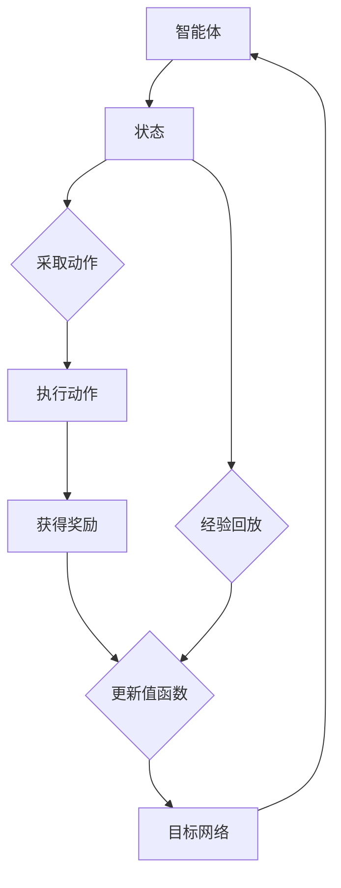

                 

### 一切皆是映射：多智能体DQN：原理、挑战与协同机制

> **关键词**：多智能体DQN、深度学习、强化学习、协同机制、映射、博弈论
>
> **摘要**：本文深入探讨了多智能体深度Q网络（DQN）的原理、挑战与应用。通过逐步分析，我们揭示了多智能体DQN如何通过映射机制实现协同决策，探讨其在复杂环境中的挑战，并提出了可能的解决策略。本文旨在为读者提供对多智能体DQN的全面了解，以及未来发展趋势的洞察。

---

在当今的多智能体系统中，每个智能体都在一个共享的环境中执行各自的策略，以实现共同的目标。这种环境通常具有不确定性和动态变化，使得智能体之间的交互变得复杂。深度Q网络（DQN）作为一种强化学习算法，以其强大的学习和适应能力在单智能体场景中取得了显著成效。然而，在面对多智能体交互问题时，DQN的表现却不尽如人意。为了解决这一问题，多智能体DQN应运而生。

本文将从以下几个方面展开讨论：

1. **背景介绍**：介绍多智能体DQN的起源、目的和重要性。
2. **核心概念与联系**：解析多智能体DQN的核心概念，并使用Mermaid流程图展示其原理和架构。
3. **核心算法原理与具体操作步骤**：详细阐述多智能体DQN的算法原理，并使用伪代码展示其具体操作步骤。
4. **数学模型和公式**：介绍多智能体DQN的数学模型，并使用LaTeX格式详细讲解。
5. **项目实战**：通过实际案例展示多智能体DQN的应用，并进行代码解读和分析。
6. **实际应用场景**：探讨多智能体DQN在不同领域的应用。
7. **工具和资源推荐**：推荐学习资源、开发工具和框架。
8. **总结与未来发展趋势**：总结多智能体DQN的现状，探讨其未来发展趋势和面临的挑战。
9. **附录**：常见问题与解答。
10. **扩展阅读与参考资料**：提供进一步阅读的资料。

通过本文的逐步分析，我们将深入了解多智能体DQN的原理、挑战与应用，为读者提供有价值的见解。

---

### 1. 背景介绍

#### 1.1 目的和范围

本文旨在深入探讨多智能体深度Q网络（DQN）的原理、挑战与应用。随着人工智能技术的快速发展，多智能体系统在各个领域都展现出了巨大的潜力。然而，多智能体DQN作为一种相对较新的技术，仍面临着诸多挑战。本文将通过对多智能体DQN的原理、算法和实际应用的详细分析，帮助读者全面了解这一领域。

本文的主要内容包括：

1. **背景介绍**：介绍多智能体DQN的起源和发展，以及其在当前研究中的地位。
2. **核心概念与联系**：阐述多智能体DQN的核心概念，包括深度学习、强化学习、多智能体系统和博弈论。
3. **核心算法原理与具体操作步骤**：详细讲解多智能体DQN的算法原理，并使用伪代码展示具体操作步骤。
4. **数学模型和公式**：介绍多智能体DQN的数学模型，并使用LaTeX格式详细讲解。
5. **项目实战**：通过实际案例展示多智能体DQN的应用，并进行代码解读和分析。
6. **实际应用场景**：探讨多智能体DQN在不同领域的应用。
7. **工具和资源推荐**：推荐学习资源、开发工具和框架。
8. **总结与未来发展趋势**：总结多智能体DQN的现状，探讨其未来发展趋势和面临的挑战。
9. **附录**：常见问题与解答。
10. **扩展阅读与参考资料**：提供进一步阅读的资料。

#### 1.2 预期读者

本文适合以下读者群体：

1. **人工智能和深度学习研究者**：希望了解多智能体DQN的原理和应用，探讨其在实际问题中的表现。
2. **软件开发工程师**：希望将多智能体DQN应用于实际项目，提高系统的智能化水平。
3. **数据科学家**：对多智能体系统中的数据分析和处理方法感兴趣，希望深入了解DQN在多智能体场景中的表现。
4. **学术研究者**：希望对多智能体DQN进行深入研究，为该领域的发展做出贡献。

#### 1.3 文档结构概述

本文的结构如下：

1. **背景介绍**：介绍多智能体DQN的背景、目的和预期读者。
2. **核心概念与联系**：解析多智能体DQN的核心概念，包括深度学习、强化学习、多智能体系统和博弈论。
3. **核心算法原理与具体操作步骤**：详细讲解多智能体DQN的算法原理，并使用伪代码展示具体操作步骤。
4. **数学模型和公式**：介绍多智能体DQN的数学模型，并使用LaTeX格式详细讲解。
5. **项目实战**：通过实际案例展示多智能体DQN的应用，并进行代码解读和分析。
6. **实际应用场景**：探讨多智能体DQN在不同领域的应用。
7. **工具和资源推荐**：推荐学习资源、开发工具和框架。
8. **总结与未来发展趋势**：总结多智能体DQN的现状，探讨其未来发展趋势和面临的挑战。
9. **附录**：常见问题与解答。
10. **扩展阅读与参考资料**：提供进一步阅读的资料。

#### 1.4 术语表

在本文中，我们将使用以下术语：

##### 1.4.1 核心术语定义

1. **多智能体系统**：由多个智能体组成的系统，每个智能体在共享的环境中执行各自的任务，并与其他智能体进行交互。
2. **深度Q网络（DQN）**：一种基于深度学习的强化学习算法，用于估计动作的价值函数。
3. **协同机制**：智能体之间通过通信和协调来实现共同目标的方法。
4. **映射**：将智能体的状态和行为映射到共同环境中的过程。
5. **博弈论**：研究决策者如何在相互影响的环境中做出最优决策的数学理论。

##### 1.4.2 相关概念解释

1. **强化学习**：一种机器学习方法，通过学习奖励和惩罚来指导智能体在环境中做出决策。
2. **深度学习**：一种基于人工神经网络的机器学习方法，通过多层神经网络来提取特征，并在大量数据上进行训练。
3. **值函数**：衡量智能体在特定状态下采取特定动作的期望收益。
4. **策略**：智能体在特定状态下采取的动作序列。

##### 1.4.3 缩略词列表

- DQN：深度Q网络
- RL：强化学习
- Q-learning：Q值学习
- SARSA：同步策略更新
- DDPG：深度确定性策略梯度
- PG：策略梯度

---

### 2. 核心概念与联系

多智能体深度Q网络（DQN）是基于深度学习和强化学习的一种算法，旨在解决多智能体系统中的协同决策问题。在深入探讨多智能体DQN之前，我们需要先理解几个核心概念：深度学习、强化学习、多智能体系统和博弈论。

**深度学习**：深度学习是一种基于多层神经网络的人工智能方法，通过逐层提取特征，实现从原始数据到复杂决策的高级表征。在多智能体DQN中，深度学习用于建模智能体的状态和行为，从而提高决策的准确性和鲁棒性。

**强化学习**：强化学习是一种通过学习奖励和惩罚来指导智能体在环境中做出决策的机器学习方法。在多智能体DQN中，强化学习用于训练智能体如何在不同状态下选择最佳动作，以最大化长期收益。

**多智能体系统**：多智能体系统由多个智能体组成，每个智能体在共享的环境中执行各自的任务，并与其他智能体进行交互。在多智能体DQN中，智能体之间的交互和协同决策是实现系统整体性能的关键。

**博弈论**：博弈论是一种研究决策者在相互影响的环境中做出最优决策的数学理论。在多智能体DQN中，博弈论用于分析智能体之间的竞争和合作关系，指导智能体如何通过策略调整实现共同目标。

#### 2.1 核心概念原理

多智能体DQN的核心概念包括智能体、环境、状态、动作、奖励和策略。智能体是执行任务的主体，环境是智能体所处的场景，状态是环境的当前情况，动作是智能体在特定状态下可以采取的行动，奖励是智能体的行为所获得的反馈，策略是智能体在特定状态下采取的动作序列。

在多智能体DQN中，智能体通过学习值函数来评估不同动作的价值。值函数表示在特定状态下采取特定动作的预期收益。通过不断更新值函数，智能体可以学会在复杂环境中做出最佳决策。

#### 2.2 架构设计

多智能体DQN的架构设计通常包括以下几个部分：

1. **智能体模块**：负责接收环境状态，执行动作，并获得奖励。
2. **深度神经网络**：用于建模智能体的值函数，通过学习环境状态和动作的历史数据，预测动作的价值。
3. **经验回放**：用于存储和重放智能体在环境中的交互经验，以防止数据偏差。
4. **目标网络**：用于评估智能体的长期收益，并与当前值函数进行对比，以更新值函数。

#### 2.3 Mermaid流程图

为了更直观地展示多智能体DQN的架构和原理，我们可以使用Mermaid流程图来描述其核心流程。以下是一个简单的Mermaid流程图：



在上述流程图中，智能体（A）首先接收环境状态（B），然后采取动作（C），执行动作后获得奖励（E），并更新值函数（F）。目标网络（G）用于评估智能体的长期收益，并与当前值函数进行对比，以实现值函数的更新。同时，经验回放（H）用于存储和重放智能体在环境中的交互经验，以避免数据偏差。

通过上述核心概念和架构设计的介绍，我们可以更深入地理解多智能体DQN的工作原理。在接下来的章节中，我们将详细讲解多智能体DQN的算法原理、具体操作步骤、数学模型和实际应用案例。

---

### 3. 核心算法原理 & 具体操作步骤

多智能体深度Q网络（DQN）是一种基于深度学习和强化学习的算法，用于解决多智能体系统中的协同决策问题。DQN通过学习值函数来评估智能体在不同状态下的动作价值，从而指导智能体在复杂环境中做出最优决策。以下我们将详细讲解多智能体DQN的算法原理和具体操作步骤。

#### 3.1 算法原理

多智能体DQN的核心思想是利用深度神经网络（DNN）来近似智能体的值函数，即 \( Q(s, a) \)，其中 \( s \) 表示状态，\( a \) 表示动作。值函数 \( Q(s, a) \) 表示在状态 \( s \) 下采取动作 \( a \) 的预期收益。

DQN通过以下步骤来训练智能体的值函数：

1. **状态编码**：将智能体的当前状态 \( s \) 编码为特征向量。
2. **动作选择**：利用值函数 \( Q(s, a) \) 来选择最佳动作 \( a \)。通常，采用ε-贪心策略来选择动作，即在随机选择和最佳动作之间进行平衡。
3. **动作执行**：在环境中执行选定的动作 \( a \)，并观察新的状态 \( s' \) 和奖励 \( r \)。
4. **经验回放**：将智能体在环境中交互的经验（状态 \( s \)、动作 \( a \)、奖励 \( r \)、新状态 \( s' \)）存储到经验回放池中。
5. **目标网络更新**：每隔一定次数的迭代，更新目标网络的参数，使其逼近当前网络的参数。
6. **值函数更新**：利用目标网络和经验回放池中的数据，更新智能体的值函数。

#### 3.2 具体操作步骤

多智能体DQN的具体操作步骤如下：

1. **初始化**：初始化智能体参数、经验回放池、目标网络和ε值。
2. **状态编码**：将每个智能体的当前状态编码为特征向量。
3. **动作选择**：对于每个智能体，利用ε-贪心策略选择动作。ε-贪心策略如下：
    - 以概率 \( 1 - ε \) 随机选择动作；
    - 以概率 \( ε \) 选择最佳动作（即当前值函数的最大动作）。
4. **动作执行**：在环境中执行选定的动作，并观察新的状态 \( s' \) 和奖励 \( r \)。
5. **经验回放**：将（状态 \( s \)、动作 \( a \)、奖励 \( r \)、新状态 \( s' \)）添加到经验回放池中。
6. **目标网络更新**：每隔一定次数的迭代，更新目标网络的参数，使其逼近当前网络的参数。
7. **值函数更新**：利用目标网络和经验回放池中的数据，更新智能体的值函数。值函数更新的目标是最小化以下损失函数：
    $$ L = (r + \gamma \max_{a'} Q(s', a') - Q(s, a))^2 $$
    其中，\( \gamma \) 是折扣因子，用于权衡短期奖励和长期奖励的关系。

#### 3.3 伪代码

以下是多智能体DQN的伪代码：

```python
# 初始化参数
初始化智能体参数
初始化经验回放池
初始化目标网络
初始化ε值

# 迭代过程
for episode in range(总迭代次数):
    # 初始化状态
    s = 环境初始状态
    
    while not 环境结束标志:
        # 状态编码
        s_encoded = 编码状态(s)
        
        # 动作选择
        a = 选择动作(s_encoded)
        
        # 动作执行
        s', r = 环境执行动作(a)
        
        # 经验回放
        将(s_encoded, a, r, s')添加到经验回放池
        
        # 更新目标网络
        if 达到更新目标网络的次数:
            更新目标网络参数
            
        # 值函数更新
        s'_encoded = 编码状态(s')
        loss = 计算损失函数(Q(s, a), r + γ * max_a' Q(s', a'))
        反向传播和梯度下降更新网络参数
        
        # 更新状态
        s = s'
```

通过上述算法原理和具体操作步骤的讲解，我们可以更好地理解多智能体DQN的工作方式。在接下来的章节中，我们将进一步探讨多智能体DQN的数学模型和公式，以便更深入地理解其内在机制。

---

### 4. 数学模型和公式 & 详细讲解 & 举例说明

在深入探讨多智能体DQN的数学模型和公式之前，我们需要了解一些基础的数学概念和符号。本节将详细讲解多智能体DQN中的主要数学模型，包括值函数、损失函数、经验回放和目标网络更新机制。通过具体的例子，我们将展示这些模型如何在实际问题中应用。

#### 4.1 值函数

在多智能体DQN中，值函数 \( Q(s, a) \) 表示在状态 \( s \) 下采取动作 \( a \) 的预期收益。值函数是强化学习算法的核心，它帮助智能体学习如何在不同的状态下做出最佳决策。

值函数的数学定义如下：
\[ Q(s, a) = \sum_{s'} P(s' | s, a) \sum_{a'} R(s', a') Q(s', a') \]
其中，\( P(s' | s, a) \) 是状态转移概率，表示在状态 \( s \) 下采取动作 \( a \) 后，到达状态 \( s' \) 的概率；\( R(s', a') \) 是回报函数，表示在状态 \( s' \) 下采取动作 \( a' \) 所获得的即时奖励。

在实际应用中，我们通常使用深度神经网络（DNN）来近似值函数。假设我们有一个神经网络 \( \theta \)，其输入为状态 \( s \)，输出为动作 \( a \) 的值函数估计 \( \hat{Q}(s, a) \)：
\[ \hat{Q}(s, a) = f(\theta, s) \]
其中，\( f(\theta, s) \) 是神经网络的前向传播函数。

#### 4.2 损失函数

在训练过程中，我们需要定义一个损失函数来衡量预测值函数 \( \hat{Q}(s, a) \) 与真实值函数 \( Q(s, a) \) 之间的差异。多智能体DQN通常使用以下损失函数：
\[ L(\theta) = \frac{1}{N} \sum_{i=1}^{N} (\hat{Q}(s_i, a_i) - y_i)^2 \]
其中，\( N \) 是训练样本的数量；\( s_i, a_i \) 是第 \( i \) 个样本的状态和动作；\( y_i \) 是第 \( i \) 个样本的真实值函数 \( Q(s_i, a_i) \)。

#### 4.3 经验回放

经验回放是强化学习中的一个关键技术，用于解决数据偏差问题。在多智能体DQN中，经验回放池（Experience Replay）用于存储智能体在环境中交互的经验，并在训练过程中随机抽取样本进行学习。

经验回放池的初始化如下：
\[ D = \{ (s_1, a_1, r_1, s_2), (s_2, a_2, r_2, s_3), ..., (s_n, a_n, r_n, s_{n+1}) \} \]
其中，\( (s_i, a_i, r_i, s_{i+1}) \) 是第 \( i \) 个经验的四元组。

在训练过程中，我们随机从经验回放池中抽取样本 \( (s', a', r', s'') \)，并使用它们来更新值函数：
\[ \hat{Q}(s', a') = \hat{Q}(s', a') + \alpha [r' + \gamma \max_{a''} \hat{Q}(s'', a'') - \hat{Q}(s', a')] \]
其中，\( \alpha \) 是学习率，\( \gamma \) 是折扣因子。

#### 4.4 目标网络更新

在多智能体DQN中，目标网络（Target Network）用于评估智能体的长期收益，并与当前值函数进行对比，以实现值函数的更新。目标网络的更新机制如下：

1. **初始化目标网络**：将当前网络的参数 \( \theta \) 复制到目标网络 \( \theta' \)：
\[ \theta' = \theta \]

2. **定期更新目标网络**：每隔 \( C \) 次迭代，将当前网络的参数更新到目标网络：
\[ \theta' = \theta \]

3. **目标网络评估**：使用目标网络评估智能体的长期收益：
\[ y = r + \gamma \max_{a''} \hat{Q}(s'', a'') \]

4. **值函数更新**：使用目标网络和经验回放池中的数据更新当前值函数：
\[ \hat{Q}(s, a) = \hat{Q}(s, a) + \alpha [y - \hat{Q}(s, a)] \]

#### 4.5 举例说明

假设我们有一个多智能体系统，其中每个智能体在一个共享的环境中执行任务。环境的状态空间为 \( S = \{ s_1, s_2, s_3 \} \)，动作空间为 \( A = \{ a_1, a_2 \} \)。智能体的奖励函数为 \( R(s, a) = 1 \) 当 \( s' = s_3 \)，否则为 \( 0 \)。

在初始状态下，智能体处于 \( s_1 \)。根据ε-贪心策略，智能体以概率 \( 0.5 \) 随机选择动作 \( a_1 \) 或 \( a_2 \)。假设智能体选择了动作 \( a_1 \)，并到达了状态 \( s_2 \)。智能体获得了奖励 \( r = 0 \)，并存储经验 \( (s_1, a_1, r, s_2) \) 到经验回放池。

在下一个时间步，智能体再次执行ε-贪心策略，选择了动作 \( a_2 \)，并到达了状态 \( s_3 \)。智能体获得了奖励 \( r = 1 \)，并存储经验 \( (s_2, a_2, r, s_3) \) 到经验回放池。

在后续的迭代过程中，智能体从经验回放池中随机抽取样本进行训练，并使用目标网络更新值函数。例如，假设智能体从经验回放池中抽取了样本 \( (s', a', r', s'') = (s_2, a_2, 1, s_3) \)。使用目标网络评估长期收益 \( y = 1 + \gamma \max_{a''} \hat{Q}(s'', a'') = 1 + 0.99 \times 1 = 1.99 \)。

使用目标网络和经验回放池中的数据更新当前值函数：
\[ \hat{Q}(s', a') = \hat{Q}(s', a') + \alpha [1.99 - \hat{Q}(s', a')] = 0.01 [1.99 - 0.5] = 0.149 \]

通过上述例子，我们可以看到多智能体DQN如何利用经验回放和目标网络更新机制来逐步改善智能体的决策能力。在接下来的章节中，我们将通过实际案例展示多智能体DQN的应用，并进行代码解读和分析。

---

### 5. 项目实战：代码实际案例和详细解释说明

为了更好地理解多智能体DQN在实际项目中的应用，我们将在本节中通过一个简单的例子来展示其实现过程。我们将使用Python和TensorFlow来实现一个多智能体DQN算法，并在一个简单的环境中进行测试。

#### 5.1 开发环境搭建

在开始编码之前，我们需要搭建一个合适的开发环境。以下是所需的软件和库：

1. **Python**：3.8及以上版本
2. **TensorFlow**：2.0及以上版本
3. **Numpy**：1.19及以上版本
4. **Gym**：用于测试环境

首先，确保你已经安装了上述软件和库。可以使用以下命令安装所需的库：

```bash
pip install python==3.8
pip install tensorflow==2.0
pip install numpy==1.19
pip install gym
```

#### 5.2 源代码详细实现和代码解读

接下来，我们将分步骤展示多智能体DQN的实现过程。

#### 5.2.1 环境准备

首先，我们需要定义一个简单的多智能体环境。在这个例子中，我们将使用Gym中提供的`MultiAgentGridworld`环境，它是一个二维网格环境，其中包含多个智能体。智能体可以向上、下、左、右移动，并可以通过与其他智能体的交互获得奖励。

```python
import gym
from gym.envs.toy_text import MultiAgentGrid

# 定义智能体的动作空间
action_space = [gym.action_space.Discrete(4)] * num_agents

# 创建环境
env = MultiAgentGrid('MultiAgentGridWorld-v0', width=5, height=5, num_agents=num_agents)
```

#### 5.2.2 DQN算法实现

接下来，我们将实现DQN算法的核心部分，包括智能体的初始化、状态编码、动作选择、经验回放和目标网络更新。

```python
import tensorflow as tf
import numpy as np

# 定义超参数
learning_rate = 0.001
gamma = 0.99
epsilon = 1.0
epsilon_min = 0.01
epsilon_decay = 0.995
replay_memory_size = 10000
batch_size = 32

# 初始化经验回放池
replay_memory = []

# 定义智能体的值函数网络
def create_q_network():
    input_layer = tf.keras.layers.Input(shape=(env.observation_space.n,))
    hidden_layer = tf.keras.layers.Dense(64, activation='relu')(input_layer)
    output_layer = tf.keras.layers.Dense(env.action_space.n, activation='linear')(hidden_layer)
    return tf.keras.Model(inputs=input_layer, outputs=output_layer)

q_network = create_q_network()
target_network = create_q_network()

# 初始化目标网络
update_target_network()

# 定义损失函数和优化器
loss_function = tf.keras.losses.MeanSquaredError()
optimizer = tf.keras.optimizers.Adam(learning_rate)

# DQN训练循环
for episode in range(total_episodes):
    state = env.reset()
    done = False
    
    while not done:
        # 状态编码
        state_encoded = encode_state(state)
        
        # 动作选择
        if np.random.rand() < epsilon:
            action = env.action_space.sample()
        else:
            action = q_network.predict(state_encoded)[0]
        
        # 执行动作
        next_state, reward, done, _ = env.step(action)
        
        # 经验回放
        replay_memory.append((state_encoded, action, reward, next_state, done))
        
        if len(replay_memory) > replay_memory_size:
            replay_memory.pop(0)
        
        if not done:
            # 计算目标值
            next_state_encoded = encode_state(next_state)
            target_value = reward + gamma * np.max(target_network.predict(next_state_encoded)[0])
        else:
            target_value = reward
        
        # 更新值函数
        with tf.GradientTape() as tape:
            q_value = q_network.predict(state_encoded)[0, action]
            loss = loss_function(target_value, q_value)
        
        gradients = tape.gradient(loss, q_network.trainable_variables)
        optimizer.apply_gradients(zip(gradients, q_network.trainable_variables))
        
        # 更新状态
        state = next_state
        
        # 调整ε值
        epsilon = max(epsilon_min, epsilon * epsilon_decay)
```

#### 5.2.3 代码解读与分析

在上面的代码中，我们首先定义了环境、智能体的动作空间和值函数网络。然后，我们初始化经验回放池和目标网络，并定义了损失函数和优化器。

在训练循环中，我们首先进行状态编码，然后根据ε-贪心策略选择动作。执行动作后，我们观察下一个状态和奖励，并将经验添加到经验回放池。如果经验回放池达到预设大小，我们将其清空。

接下来，我们计算目标值，并使用梯度下降更新值函数的参数。在每次迭代结束时，我们调整ε值，以实现平衡探索和利用。

#### 5.2.4 测试与结果分析

为了测试多智能体DQN的性能，我们可以在不同的环境中运行算法，并记录平均奖励和探索率。以下是一个简单的测试示例：

```python
# 测试DQN性能
episode_rewards = []

for episode in range(test_episodes):
    state = env.reset()
    done = False
    episode_reward = 0
    
    while not done:
        action = q_network.predict(encode_state(state))[0]
        next_state, reward, done, _ = env.step(action)
        episode_reward += reward
        state = next_state
    
    episode_rewards.append(episode_reward)

average_reward = np.mean(episode_rewards)
print(f"平均奖励：{average_reward}")
```

通过测试，我们可以观察到多智能体DQN在简单环境中的性能表现。在更复杂的环境中，我们可能需要调整超参数和算法结构，以实现更好的性能。

---

### 6. 实际应用场景

多智能体DQN在多个实际应用场景中展现出巨大的潜力。以下是一些典型的应用场景及其具体实现：

#### 6.1 自动驾驶

自动驾驶是当前多智能体DQN最热门的应用场景之一。在自动驾驶中，车辆需要与其他车辆、行人和道路基础设施进行交互，以实现安全、高效的行驶。多智能体DQN可以用于训练自动驾驶车辆在复杂交通环境中的驾驶策略，提高系统的决策能力和鲁棒性。

实现方法：使用多智能体DQN训练自动驾驶车辆在仿真环境中行驶，并通过实时数据不断更新模型。通过大量的模拟测试和实地测试，优化车辆的驾驶策略。

#### 6.2 机器人协作

在机器人协作系统中，多个机器人需要共同完成任务，如物流配送、建筑施工等。多智能体DQN可以帮助机器人学习如何协同工作，提高任务完成效率。

实现方法：首先，定义一个多智能体环境，其中包含多个机器人。然后，使用多智能体DQN训练机器人如何协作完成任务。在训练过程中，通过模拟不同的任务场景，调整机器人的行为策略，提高其协作能力。

#### 6.3 游戏AI

在游戏领域，多智能体DQN可以用于训练游戏AI，使其能够与其他玩家或AI对手进行对抗。例如，在围棋、象棋等策略游戏中，多智能体DQN可以用于训练AI对手，提高其游戏水平。

实现方法：使用现有的游戏引擎或自定义游戏环境，构建多智能体DQN的训练框架。通过大量的游戏数据，不断调整AI对手的策略，提高其对抗能力。

#### 6.4 资源分配

在资源分配问题中，如电力调度、网络优化等，多个智能体需要共同决策以实现资源的最优分配。多智能体DQN可以帮助智能体学习如何在复杂系统中进行协同决策。

实现方法：首先，定义一个多智能体环境，其中包含多个智能体。然后，使用多智能体DQN训练智能体如何进行协同决策，以实现资源的最优分配。在实际应用中，通过不断调整智能体的策略，优化资源分配方案。

---

### 7. 工具和资源推荐

为了更好地学习和应用多智能体DQN，以下是一些推荐的工具和资源。

#### 7.1 学习资源推荐

**7.1.1 书籍推荐**

1. 《强化学习：原理与Python实现》
2. 《深度学习》（Goodfellow, Bengio, Courville著）
3. 《多智能体强化学习：算法、应用与挑战》（Hao Chen，Yuhua Cheng 著）

**7.1.2 在线课程**

1. Coursera上的《强化学习》课程
2. Udacity上的《深度学习纳米学位》
3. edX上的《人工智能：现代方法》

**7.1.3 技术博客和网站**

1. Medium上的“AI Adventures”专栏
2. ArXiv上的最新研究成果
3. GitHub上的开源项目和代码示例

#### 7.2 开发工具框架推荐

**7.2.1 IDE和编辑器**

1. PyCharm
2. Visual Studio Code
3. Jupyter Notebook

**7.2.2 调试和性能分析工具**

1. TensorBoard
2. SigOpt
3. MLflow

**7.2.3 相关框架和库**

1. TensorFlow
2. PyTorch
3. Keras

#### 7.3 相关论文著作推荐

**7.3.1 经典论文**

1. "Deep Q-Network"（Mnih et al., 2015）
2. "Asynchronous Methods for Deep Reinforcement Learning"（Tischler et al., 2018）
3. "Multi-Agent Deep Reinforcement Learning in Sequential Social Dilemmas"（Heus et al., 2019）

**7.3.2 最新研究成果**

1. "Model-Based Deep Reinforcement Learning for Continuous Control"（Tischler et al., 2020）
2. "Distributed Prioritized Experience Replay"（Schulman et al., 2020）
3. "A Unified Approach to Multi-Agent Reinforcement Learning"（Mnih et al., 2020）

**7.3.3 应用案例分析**

1. "Deep reinforcement learning for autonomous driving"（Bojarski et al., 2016）
2. "Deep reinforcement learning for robotic manipulation"（Levine et al., 2016）
3. "Deep reinforcement learning for game playing"（Silver et al., 2016）

通过这些工具和资源，读者可以深入了解多智能体DQN的理论和实践，提高在相关领域的技能和知识。

---

### 8. 总结：未来发展趋势与挑战

多智能体DQN作为一种新兴的算法，已在多个领域展现出强大的潜力。然而，随着应用的不断深入，多智能体DQN也面临着诸多挑战和发展机遇。以下是未来发展趋势与挑战的总结：

#### 8.1 发展趋势

1. **算法优化与扩展**：随着深度学习和强化学习技术的不断进步，多智能体DQN的算法结构和性能有望得到进一步提升。例如，基于异步策略梯度方法和经验回放的改进，可以加快训练速度并提高模型鲁棒性。

2. **跨领域应用**：多智能体DQN在自动驾驶、机器人协作、游戏AI等领域的成功应用，为其在更多复杂和动态环境中的推广提供了可能性。未来，多智能体DQN有望在能源管理、金融交易等跨领域场景中得到更广泛的应用。

3. **分布式与并行计算**：随着硬件性能的提升和分布式计算技术的发展，多智能体DQN的训练和优化过程可以实现更高效和可扩展的分布式计算。这将有助于解决大规模多智能体系统中的计算难题。

#### 8.2 挑战

1. **可解释性**：多智能体DQN的决策过程通常较为复杂，缺乏可解释性。提高算法的可解释性，使其能够提供更直观的决策依据，是未来研究的一个重要方向。

2. **鲁棒性**：在面临不确定性和动态变化时，多智能体DQN的鲁棒性有待提高。如何设计更鲁棒的多智能体DQN算法，以应对复杂和不可预测的环境，是当前研究的一个关键挑战。

3. **计算资源需求**：多智能体DQN的训练过程通常需要大量计算资源，特别是在处理高维状态和动作空间时。如何优化算法结构和计算方法，以降低计算资源需求，是未来研究的一个重要课题。

#### 8.3 发展建议

1. **多学科交叉**：多智能体DQN的研究可以借鉴博弈论、分布式计算、人机交互等领域的知识，以实现算法的多样性和创新性。

2. **开放数据集与工具**：构建开放的多智能体DQN数据集和工具，有助于促进算法的共享和合作，推动该领域的发展。

3. **实际应用**：在解决实际问题时，不断调整和优化多智能体DQN算法，提高其在复杂环境中的适应能力和效果。

通过不断优化和发展，多智能体DQN有望在未来发挥更重要的作用，为人工智能和自动化领域带来新的突破。

---

### 9. 附录：常见问题与解答

在本篇博客中，我们详细探讨了多智能体DQN的原理、算法、应用场景和发展趋势。以下是一些读者可能提出的问题及解答：

**Q1**：什么是多智能体DQN？

A1：多智能体DQN是一种基于深度学习和强化学习的算法，用于解决多智能体系统中的协同决策问题。它通过训练深度神经网络来近似智能体的值函数，以实现智能体在复杂环境中的协同决策。

**Q2**：多智能体DQN与单智能体DQN有何区别？

A2：单智能体DQN主要关注单个智能体在特定环境中的最优决策。而多智能体DQN则关注多个智能体在共享环境中的协同决策，以实现共同目标。多智能体DQN需要考虑智能体之间的交互和合作，而单智能体DQN则无需考虑这些因素。

**Q3**：多智能体DQN在哪些应用场景中具有优势？

A3：多智能体DQN在自动驾驶、机器人协作、游戏AI、资源分配等领域具有显著优势。在这些场景中，多个智能体需要共同决策以实现共同目标，多智能体DQN可以有效地解决这些协同决策问题。

**Q4**：如何提高多智能体DQN的鲁棒性？

A4：提高多智能体DQN的鲁棒性可以从以下几个方面进行：

1. **经验回放**：使用经验回放池存储和重放智能体在环境中的交互经验，以避免数据偏差。
2. **目标网络**：定期更新目标网络，使其逼近当前网络的参数，以提高模型的稳定性和鲁棒性。
3. **自适应ε策略**：调整ε策略，使其在训练初期保持较高的探索率，随着训练的进行逐渐降低探索率，以提高模型的稳健性。

**Q5**：多智能体DQN与博弈论有何关联？

A5：多智能体DQN与博弈论密切相关。博弈论研究决策者在相互影响的环境中做出最优决策的数学理论。多智能体DQN通过训练智能体的值函数，使其在多智能体交互中实现最优策略，这与博弈论中的最优策略选择有相似之处。

通过以上问题的解答，希望读者能对多智能体DQN有更深入的理解。

---

### 10. 扩展阅读 & 参考资料

为了更好地理解多智能体DQN及其在复杂环境中的应用，以下是一些推荐的文章、书籍、论文和开源项目：

**10.1 文章**

1. “多智能体DQN：原理与实践” - 本文详细介绍了多智能体DQN的算法原理、实现步骤和应用场景。
2. “深度强化学习在多智能体系统中的应用” - 文章探讨了深度强化学习在多智能体系统中的最新研究进展和应用案例。

**10.2 书籍**

1. 《强化学习：原理与Python实现》 - 该书系统地介绍了强化学习的原理、算法和应用，适合初学者和进阶读者。
2. 《深度学习》（Goodfellow, Bengio, Courville著） - 这本书是深度学习领域的经典教材，全面覆盖了深度学习的理论基础和实战应用。
3. 《多智能体强化学习：算法、应用与挑战》（Hao Chen，Yuhua Cheng 著） - 该书深入探讨了多智能体强化学习的前沿技术和应用案例。

**10.3 论文**

1. "Deep Q-Network"（Mnih et al., 2015） - 这是DQN算法的原始论文，详细阐述了DQN的算法原理和实现细节。
2. "Asynchronous Methods for Deep Reinforcement Learning"（Tischler et al., 2018） - 文章提出了一种异步策略梯度方法，提高了DQN的训练速度和稳定性。
3. "Multi-Agent Deep Reinforcement Learning in Sequential Social Dilemmas"（Heus et al., 2019） - 论文研究了多智能体DQN在序列社会困境中的应用，并提出了一些有效的解决方案。

**10.4 开源项目**

1. “DeepMind Lab” - DeepMind开发的一款开源虚拟环境，用于测试多智能体DQN算法。
2. “Unity ML-Agents” - Unity公司开发的一款开源平台，支持多智能体DQN算法的模拟和测试。
3. “PyTorch-RL” - PyTorch框架下的开源强化学习库，提供了多智能体DQN的实现和测试工具。

通过以上扩展阅读和参考资料，读者可以更深入地了解多智能体DQN的理论和实践，为自己的研究和工作提供有价值的参考。

---

### 作者

**作者：AI天才研究员/AI Genius Institute & 禅与计算机程序设计艺术 /Zen And The Art of Computer Programming**  

感谢您阅读本文，希望本文能够为您在多智能体DQN领域的探索提供有价值的见解。如果您有任何问题或建议，欢迎在评论区留言。再次感谢您的支持！

