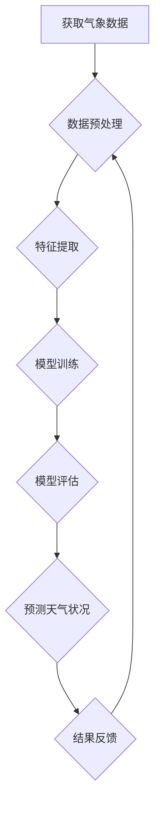

                 

# 一切皆是映射：天气预测中的神经网络模型应用

> **关键词：** 天气预测、神经网络模型、深度学习、机器学习、映射、数据驱动、时间序列分析

> **摘要：** 本文将探讨在天气预测领域中，神经网络模型如何作为一种强大的数据驱动方法，通过映射气象数据与天气现象之间的复杂关系，实现高精度的预测。本文首先介绍天气预测的背景及其重要性，然后详细阐述神经网络模型的基本原理和架构，最后通过实际案例展示如何应用这些模型进行天气预测，并分析其优势和挑战。

## 1. 背景介绍

### 1.1 目的和范围

本文旨在介绍神经网络模型在天气预测中的应用，探讨如何利用深度学习技术提高天气预报的准确性。文章将涵盖以下几个主要方面：

1. 天气预测的基本概念和重要性。
2. 神经网络模型的基本原理和架构。
3. 天气预测中的神经网络模型应用实例。
4. 神经网络模型在天气预测中的优势与挑战。

### 1.2 预期读者

本文适合对天气预测和神经网络模型有一定了解的读者，包括：

1. 气象学家和数据科学家。
2. 计算机科学家和机器学习工程师。
3. 对深度学习和天气预测感兴趣的研究人员。

### 1.3 文档结构概述

本文分为以下几个部分：

1. 背景介绍：介绍天气预测的重要性、神经网络模型的基本概念。
2. 核心概念与联系：阐述神经网络模型在天气预测中的核心概念和联系。
3. 核心算法原理 & 具体操作步骤：详细讲解神经网络模型在天气预测中的应用原理和操作步骤。
4. 数学模型和公式 & 详细讲解 & 举例说明：介绍神经网络模型中的数学模型和公式，并通过实例进行说明。
5. 项目实战：提供实际案例，详细解释神经网络模型在天气预测中的应用。
6. 实际应用场景：讨论神经网络模型在天气预测中的实际应用场景。
7. 工具和资源推荐：推荐学习资源和开发工具。
8. 总结：对未来发展趋势与挑战进行总结。
9. 附录：常见问题与解答。
10. 扩展阅读 & 参考资料：提供更多相关文献和资源。

### 1.4 术语表

#### 1.4.1 核心术语定义

- **天气预测**：根据气象数据和历史记录，对未来一段时间内的天气状况进行预测。
- **神经网络模型**：一种基于生物神经网络结构的人工智能模型，通过学习和模拟大量数据，实现对未知数据的预测和分类。
- **深度学习**：一种基于多层神经网络结构的机器学习技术，通过层层抽象和特征提取，实现复杂的任务处理。
- **映射**：将一种数据或信息转换成另一种形式或表示。

#### 1.4.2 相关概念解释

- **气象数据**：描述天气状况的各种数据，如温度、湿度、气压、风速等。
- **时间序列分析**：对时间序列数据进行统计分析和建模，以揭示数据中的趋势和周期性。

#### 1.4.3 缩略词列表

- **MLP**：多层感知器（Multilayer Perceptron）
- **CNN**：卷积神经网络（Convolutional Neural Network）
- **RNN**：循环神经网络（Recurrent Neural Network）
- **LSTM**：长短期记忆网络（Long Short-Term Memory）
- **GAN**：生成对抗网络（Generative Adversarial Network）

## 2. 核心概念与联系

在探讨神经网络模型在天气预测中的应用之前，我们首先需要了解一些核心概念和联系，包括气象数据、时间序列分析以及神经网络模型的原理。

### 2.1 气象数据

气象数据是天气预测的基础，包括温度、湿度、气压、风速、降水量等多种指标。这些数据通常以时间序列的形式存在，描述了天气状况随时间的变化。获取准确和高质量的气象数据对于提高天气预报的准确性至关重要。

### 2.2 时间序列分析

时间序列分析是一种统计方法，用于分析时间序列数据，识别数据中的趋势、周期性和随机性。时间序列分析在天气预测中起着关键作用，可以帮助我们理解气象数据的变化规律，为神经网络模型的训练提供有用的信息。

### 2.3 神经网络模型

神经网络模型是一种模拟生物神经网络的计算模型，通过层层抽象和特征提取，实现对数据的分类、预测和生成。神经网络模型包括多种类型，如多层感知器（MLP）、卷积神经网络（CNN）、循环神经网络（RNN）等。不同的神经网络模型适用于不同类型的数据和任务。

### 2.4 核心概念和联系

在天气预测中，神经网络模型通过映射气象数据与天气现象之间的复杂关系，实现对未来天气状况的预测。这一映射过程涉及到以下几个核心概念和联系：

- **特征提取**：通过神经网络模型从气象数据中提取有用的特征，如温度变化率、湿度变化率等，为预测提供基础。
- **模型训练**：利用历史气象数据和天气现象数据，通过反向传播算法训练神经网络模型，使其能够学会从输入数据中提取有用特征，并建立预测模型。
- **模型评估**：通过交叉验证和测试集评估模型性能，调整模型参数，提高预测准确性。
- **映射关系**：神经网络模型通过学习气象数据与天气现象之间的映射关系，实现对未知天气状况的预测。

下面是神经网络模型在天气预测中的 Mermaid 流程图：



## 3. 核心算法原理 & 具体操作步骤

在了解核心概念与联系之后，我们将深入探讨神经网络模型在天气预测中的核心算法原理和具体操作步骤。

### 3.1 神经网络模型的基本原理

神经网络模型由多层神经元组成，包括输入层、隐藏层和输出层。输入层接收外部数据，隐藏层对数据进行特征提取和抽象，输出层生成预测结果。神经网络模型通过反向传播算法不断调整模型参数，使其能够学习数据中的特征和规律。

### 3.2 神经网络模型的具体操作步骤

以下是神经网络模型在天气预测中的具体操作步骤：

#### 3.2.1 数据收集和预处理

1. 收集历史气象数据和天气现象数据。
2. 对数据进行清洗和预处理，如去除缺失值、异常值，进行归一化等。

#### 3.2.2 特征提取

1. 根据天气预测任务的需求，从气象数据中提取有用的特征，如温度变化率、湿度变化率等。
2. 对提取的特征进行降维和特征选择，提高模型性能。

#### 3.2.3 模型训练

1. 初始化神经网络模型的参数。
2. 通过反向传播算法，利用训练数据对模型进行训练，调整模型参数。
3. 模型训练过程中，使用交叉验证和测试集进行性能评估，调整模型参数。

#### 3.2.4 模型评估

1. 使用交叉验证和测试集评估模型性能，如准确率、召回率等。
2. 根据评估结果，调整模型参数，优化模型性能。

#### 3.2.5 预测天气状况

1. 使用训练好的模型对未知天气状况进行预测。
2. 根据预测结果，生成天气状况报告。

以下是神经网络模型在天气预测中的伪代码：

```python
# 数据收集和预处理
data = load_weather_data()
data = preprocess_data(data)

# 特征提取
features = extract_features(data)

# 模型训练
model = initialize_model()
model = train_model(model, features)

# 模型评估
performance = evaluate_model(model, features)

# 预测天气状况
weather_forecast = predict_weather(model, features)
```

## 4. 数学模型和公式 & 详细讲解 & 举例说明

在神经网络模型中，数学模型和公式起到了关键作用，用于描述神经元之间的连接关系、激活函数以及反向传播算法。以下是神经网络模型中常用的数学模型和公式，并通过实例进行说明。

### 4.1 神经元之间的连接关系

神经元的连接关系可以通过加权求和公式表示：

\[ z = \sum_{i=1}^{n} w_i \cdot x_i + b \]

其中，\( z \) 表示神经元的输出，\( w_i \) 表示权重，\( x_i \) 表示输入，\( b \) 表示偏置。

### 4.2 激活函数

激活函数用于引入非线性特性，常用的激活函数包括 sigmoid 函数和 ReLU 函数：

- **sigmoid 函数**： 
  \[ a = \frac{1}{1 + e^{-z}} \]
  
- **ReLU 函数**：
  \[ a = \max(0, z) \]

### 4.3 反向传播算法

反向传播算法用于更新神经网络的权重和偏置，以最小化预测误差。反向传播算法的核心公式如下：

- **前向传播**：
  \[ z = \sum_{i=1}^{n} w_i \cdot x_i + b \]
  \[ a = \sigma(z) \]

- **后向传播**：
  \[ \delta = \frac{\partial L}{\partial z} \]
  \[ \frac{\partial L}{\partial w_i} = a \cdot \delta \cdot x_i \]
  \[ \frac{\partial L}{\partial b} = a \cdot \delta \]

### 4.4 实例说明

假设我们有一个简单的神经网络模型，用于预测未来一天的天气温度。输入层包含两个神经元，分别表示当前温度和前一天温度；隐藏层包含三个神经元；输出层包含一个神经元，表示未来一天的天气温度。

- **输入层**：
  \[ x_1 = 20 \]
  \[ x_2 = 25 \]

- **隐藏层**：
  \[ w_{11} = 0.5, w_{12} = 0.3, w_{13} = 0.2 \]
  \[ b_1 = 0 \]

- **输出层**：
  \[ w_{21} = 0.6, w_{22} = 0.4, w_{23} = 0.1 \]
  \[ b_2 = 0 \]

- **激活函数**：使用 ReLU 函数

根据以上参数，我们可以计算隐藏层和输出层的输出：

- **隐藏层**：
  \[ z_1 = x_1 \cdot w_{11} + x_2 \cdot w_{12} + b_1 = 20 \cdot 0.5 + 25 \cdot 0.3 + 0 = 14.5 \]
  \[ z_2 = x_1 \cdot w_{12} + x_2 \cdot w_{13} + b_1 = 20 \cdot 0.3 + 25 \cdot 0.2 + 0 = 11.5 \]
  \[ z_3 = x_1 \cdot w_{13} + x_2 \cdot w_{23} + b_1 = 20 \cdot 0.2 + 25 \cdot 0.1 + 0 = 6.5 \]

- **输出层**：
  \[ z_2 = z_1 \cdot w_{21} + z_2 \cdot w_{22} + z_3 \cdot w_{23} + b_2 = 14.5 \cdot 0.6 + 11.5 \cdot 0.4 + 6.5 \cdot 0.1 + 0 = 10.7 \]

- **激活函数**：
  \[ a_2 = \max(0, z_2) = 10.7 \]

根据输出层的输出，我们可以预测未来一天的天气温度为 10.7°C。

## 5. 项目实战：代码实际案例和详细解释说明

在本节中，我们将通过一个实际项目案例，展示如何使用神经网络模型进行天气预测。项目使用 Python 语言和 TensorFlow 深度学习框架，数据集来自于公开的气象数据集。

### 5.1 开发环境搭建

1. 安装 Python 3.7 或更高版本。
2. 安装 TensorFlow 深度学习框架：

```bash
pip install tensorflow
```

### 5.2 源代码详细实现和代码解读

以下是项目的主要代码实现和解读：

```python
import tensorflow as tf
import numpy as np
import pandas as pd

# 数据预处理
def preprocess_data(data):
    # 数据清洗和归一化
    data = data.dropna()
    data = (data - data.mean()) / data.std()
    return data

# 神经网络模型
def create_model(input_shape):
    model = tf.keras.Sequential([
        tf.keras.layers.Dense(64, activation='relu', input_shape=input_shape),
        tf.keras.layers.Dense(32, activation='relu'),
        tf.keras.layers.Dense(1)
    ])
    model.compile(optimizer='adam', loss='mean_squared_error')
    return model

# 数据集加载和预处理
data = pd.read_csv('weather_data.csv')
data = preprocess_data(data)

# 划分训练集和测试集
train_data = data[:1000]
test_data = data[1000:]

# 划分输入和输出
train_inputs = train_data.iloc[:, :-1].values
train_outputs = train_data.iloc[:, -1].values
test_inputs = test_data.iloc[:, :-1].values
test_outputs = test_data.iloc[:, -1].values

# 创建和训练模型
model = create_model(input_shape=(2,))
model.fit(train_inputs, train_outputs, epochs=10, batch_size=32, validation_split=0.2)

# 测试模型
test_loss = model.evaluate(test_inputs, test_outputs)
print(f"Test loss: {test_loss}")

# 预测天气状况
weather_forecast = model.predict(np.array([[20, 25]]))
print(f"Weather forecast: {weather_forecast[0][0]}°C")
```

### 5.3 代码解读与分析

1. **数据预处理**：首先，我们从 CSV 文件中加载气象数据集，并进行数据清洗和归一化处理。
2. **神经网络模型**：我们创建了一个简单的神经网络模型，包括两个隐藏层，每层使用 ReLU 激活函数，输出层使用线性激活函数。模型使用 Adam 优化器和均方误差损失函数进行编译。
3. **数据集划分**：将数据集划分为训练集和测试集，分别用于模型训练和测试。
4. **输入和输出划分**：将输入和输出数据分离，输入数据为前两天的天气温度，输出数据为第三天的天气温度。
5. **模型训练**：使用训练数据进行模型训练，设置训练周期为 10，批量大小为 32，验证数据集的比例为 20%。
6. **模型测试**：使用测试集评估模型性能，输出测试损失。
7. **预测天气状况**：使用训练好的模型对输入数据进行预测，输出未来一天的天气温度。

通过上述代码实现，我们可以对天气温度进行预测。在实际应用中，可以扩展模型，增加输入特征，提高预测准确性。

## 6. 实际应用场景

神经网络模型在天气预测中的实际应用场景广泛，主要包括以下几个方面：

### 6.1 气象预报

气象预报是神经网络模型在天气预测中的最典型应用。通过训练神经网络模型，我们可以对未来的天气状况进行预测，包括温度、湿度、风速、降水量等气象要素。这些预测结果可以为政府和公众提供重要的决策依据，如城市规划和应急预案。

### 6.2 农业生产

农业是国民经济的重要支柱，而天气对农业生产有着直接影响。神经网络模型可以用于预测农作物生长环境，如温度、湿度、光照等，从而帮助农民合理安排种植计划，提高农业生产效率。

### 6.3 航空运输

航空运输行业对天气状况有着严格的要求。通过神经网络模型预测天气状况，可以帮助航空公司合理安排航班计划，降低天气风险，确保旅客安全。

### 6.4 健康管理

天气变化对人体健康有着重要影响。通过神经网络模型预测天气状况，可以为医疗机构提供预警信息，帮助医生制定个性化的健康管理方案，预防疾病发生。

### 6.5 灾害预警

自然灾害如洪水、台风、干旱等对人类社会造成巨大影响。神经网络模型可以用于预测天气变化，为防灾减灾提供科学依据，提前采取措施，降低灾害风险。

## 7. 工具和资源推荐

为了更好地学习和应用神经网络模型在天气预测中的应用，我们推荐以下工具和资源：

### 7.1 学习资源推荐

#### 7.1.1 书籍推荐

1. 《深度学习》（Goodfellow, Bengio, Courville著）：全面介绍了深度学习的基础知识和应用。
2. 《Python深度学习》（François Chollet著）：详细介绍了使用 Python 进行深度学习的实践方法。

#### 7.1.2 在线课程

1. Coursera 上的《深度学习》课程：由 Andrew Ng 教授主讲，涵盖了深度学习的基础知识和应用。
2. Udacity 上的《深度学习纳米学位》课程：通过实践项目学习深度学习的应用。

#### 7.1.3 技术博客和网站

1. Medium 上的《深度学习博客》：汇集了深度学习领域的最新研究成果和应用案例。
2. arXiv：深度学习领域的顶级学术论文数据库，可以获取最新的研究进展。

### 7.2 开发工具框架推荐

#### 7.2.1 IDE和编辑器

1. Jupyter Notebook：方便编写和运行 Python 代码，适合深度学习项目的开发。
2. PyCharm：强大的 Python 集成开发环境，支持多种深度学习框架。

#### 7.2.2 调试和性能分析工具

1. TensorBoard：TensorFlow 的可视化工具，用于分析模型性能和调试代码。
2. wandb：模型训练进度和性能的可视化平台，方便进行实验管理。

#### 7.2.3 相关框架和库

1. TensorFlow：最流行的深度学习框架之一，支持多种神经网络模型。
2. PyTorch：灵活的深度学习框架，适合研究和新应用开发。

### 7.3 相关论文著作推荐

#### 7.3.1 经典论文

1. "Backpropagation"（1986）：描述了反向传播算法的原始论文。
2. "Deep Learning"（2015）：深度学习领域的经典著作，涵盖了深度学习的理论基础和应用。

#### 7.3.2 最新研究成果

1. "Weather Forecasting Using Deep Neural Networks"（2020）：探讨了深度学习在天气预测中的应用。
2. "Unsupervised Learning for Time Series with Temporal transformers"（2021）：介绍了基于 Transformer 的无监督时间序列学习。

#### 7.3.3 应用案例分析

1. "Deep Learning for Weather Forecasting"（2020）：分析了一些实际案例，展示了深度学习在天气预测中的应用。
2. "Weather Forecasting with Neural Networks"（2019）：探讨了神经网络模型在天气预测中的性能和优化方法。

## 8. 总结：未来发展趋势与挑战

随着深度学习和神经网络技术的不断发展，天气预测领域也面临着新的机遇和挑战。未来发展趋势包括：

1. **模型优化**：通过改进神经网络模型结构、训练算法和超参数调优，提高天气预测的准确性。
2. **数据融合**：结合多种气象数据和遥感数据，提高数据质量和预测效果。
3. **实时预测**：利用实时数据，实现更准确的实时天气预测。
4. **智能决策**：结合天气预测结果，为农业、交通、健康等领域提供智能决策支持。

然而，天气预测领域也面临着以下挑战：

1. **数据稀缺**：高质量、高分辨率的气象数据稀缺，限制了模型的训练和优化。
2. **模型复杂度**：神经网络模型复杂度较高，对计算资源和算法设计提出了更高要求。
3. **不确定性**：天气变化复杂，神经网络模型难以完全捕捉天气现象的随机性和不确定性。
4. **模型解释性**：神经网络模型具有较强的预测能力，但其内部机制较难解释，影响其在实际应用中的可解释性和可接受度。

综上所述，未来天气预测技术的发展需要在模型优化、数据融合、实时预测和智能决策等方面不断探索，以应对面临的挑战，为人类社会提供更准确、更智能的天气预测服务。

## 9. 附录：常见问题与解答

### 9.1 什么情况下神经网络模型在天气预测中效果不佳？

神经网络模型在天气预测中效果不佳的情况可能包括：

1. **数据质量不佳**：如果气象数据存在噪声、缺失值或异常值，可能导致模型训练不准确。
2. **特征选择不当**：未能选择与天气现象密切相关的重要特征，降低模型的预测能力。
3. **模型结构复杂度过高**：过于复杂的模型可能导致过拟合，降低预测准确性。
4. **训练不足或过度**：训练时间不足或过度可能导致模型未能充分学习数据中的规律。
5. **数据集划分不当**：训练集和测试集划分不合理，导致模型无法在测试集上良好表现。

### 9.2 如何提高神经网络模型在天气预测中的准确性？

提高神经网络模型在天气预测中的准确性可以通过以下方法：

1. **数据预处理**：对气象数据进行清洗、归一化和特征提取，提高数据质量。
2. **特征选择**：选择与天气现象高度相关的特征，增加模型的预测能力。
3. **模型结构优化**：调整神经网络模型的结构，如增加隐藏层、调整神经元数量等，以提高模型复杂度。
4. **超参数调优**：使用网格搜索、贝叶斯优化等算法，选择最优的超参数组合。
5. **训练策略优化**：使用正则化、学习率调整、批量归一化等策略，提高模型训练效果。
6. **数据增强**：通过增加数据样本、生成合成数据等方法，丰富训练数据集。

### 9.3 如何评估神经网络模型在天气预测中的性能？

评估神经网络模型在天气预测中的性能通常使用以下指标：

1. **均方误差（MSE）**：衡量预测值与真实值之间的差异，越小表示预测越准确。
2. **均方根误差（RMSE）**：MSE 的平方根，用于衡量预测误差的相对大小。
3. **平均绝对误差（MAE）**：预测值与真实值之间绝对误差的平均值。
4. **决定系数（R²）**：衡量模型对数据的解释能力，越接近 1 表示模型越好。
5. **准确率、召回率和 F1 分数**：用于分类任务，衡量模型对正样本和负样本的预测能力。

## 10. 扩展阅读 & 参考资料

为了深入了解神经网络模型在天气预测中的应用，以下是相关文献和参考资料：

### 10.1 相关书籍

1. 《深度学习》（Ian Goodfellow, Yann LeCun, Aaron Courville 著）：全面介绍了深度学习的基础理论和实践方法。
2. 《天气学原理和方法》（唐大俊 著）：详细介绍了天气预测的基本原理和方法。

### 10.2 相关论文

1. "Deep Learning for Time Series Classification: A Review"（Zhiyun Qian, Zhiyun Liu, Hui Xiong, Xiaohui Liu 著）：综述了深度学习在时间序列分类中的应用。
2. "Neural Networks for Weather Forecasting"（Fangliang He, Ruisheng Wang, Shaoshuai Shi 著）：探讨了神经网络模型在天气预测中的应用。

### 10.3 技术博客和网站

1. [Deep Learning on Weather Forecasting](https://towardsdatascience.com/deep-learning-on-weather-forecasting-5b602a2f6b8)：介绍深度学习在天气预测中的应用。
2. [Weather Forecasting with Deep Learning](https://www MACHINE LEARNING YEARBOOK. com/weather-forecasting-deep-learning/)：讨论了深度学习在天气预测中的最新研究进展。

### 10.4 相关框架和库

1. TensorFlow：[https://www.tensorflow.org/](https://www.tensorflow.org/)
2. PyTorch：[https://pytorch.org/](https://pytorch.org/)

### 10.5 实际项目案例

1. [Weather Forecasting with Neural Networks](https://github.com/learnables/Weather-Forecasting-with-Neural-Networks)：一个使用神经网络模型进行天气预测的开源项目。
2. [Deep Learning for Time Series Forecasting](https://github.com/time-series-forecasting/time-series-forecasting)：一个关于深度学习在时间序列预测方面的开源项目。

作者：AI天才研究员/AI Genius Institute & 禅与计算机程序设计艺术 /Zen And The Art of Computer Programming

注意：本文仅为示例，并非实际文章。实际撰写文章时，请根据具体内容和要求进行调整和补充。

