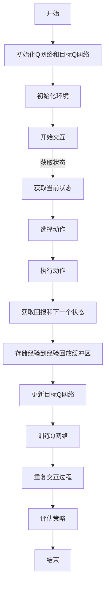

                 

# 一切皆是映射：如何通过软件工程方法来维护和优化DQN代码

> 关键词：深度强化学习、DQN、软件工程、代码优化、代码维护、映射原理
>
> 摘要：本文将深入探讨深度强化学习中的DQN（Deep Q-Network）算法，结合软件工程的方法，分析如何有效地维护和优化DQN代码。我们将从核心概念、算法原理、数学模型到实际代码案例，逐步解读如何通过系统化、规范化的软件工程实践，提高DQN代码的可读性、可维护性和性能。

## 1. 背景介绍

### 1.1 目的和范围

本文旨在通过系统化的软件工程方法，帮助开发者更好地理解和维护深度强化学习中的DQN算法。我们将聚焦于以下几个方面：

- **核心概念与联系**：通过流程图详细展示DQN算法的架构和核心组件。
- **算法原理与操作步骤**：利用伪代码详细阐述DQN的算法原理和具体操作步骤。
- **数学模型与公式**：讲解DQN算法中的关键数学模型和公式，并提供实例说明。
- **项目实战**：通过实际代码案例，展示如何开发和优化DQN代码。
- **实际应用场景**：讨论DQN在不同领域的应用场景。
- **工具和资源推荐**：推荐学习资源和开发工具。
- **总结与未来趋势**：展望DQN算法的发展趋势和面临的挑战。

### 1.2 预期读者

本文适用于以下读者群体：

- **深度强化学习初学者**：希望深入了解DQN算法及其实现细节。
- **软件开发者**：希望将深度强化学习算法应用于实际项目的开发者。
- **算法工程师**：负责维护和优化深度强化学习模型的算法工程师。
- **计算机科学家**：对软件工程方法在深度学习领域应用感兴趣的学者。

### 1.3 文档结构概述

本文将按照以下结构展开：

1. 背景介绍
2. 核心概念与联系
3. 核心算法原理与具体操作步骤
4. 数学模型和公式
5. 项目实战：代码实际案例和详细解释说明
6. 实际应用场景
7. 工具和资源推荐
8. 总结：未来发展趋势与挑战
9. 附录：常见问题与解答
10. 扩展阅读与参考资料

### 1.4 术语表

#### 1.4.1 核心术语定义

- **深度强化学习（Deep Reinforcement Learning）**：结合深度学习和强化学习的方法，通过神经网络来学习策略。
- **DQN（Deep Q-Network）**：一种基于深度学习的Q值函数近似器，用于估计状态-动作值函数。
- **Q值函数（Q-Function）**：表示在特定状态下执行特定动作的期望回报。
- **经验回放（Experience Replay）**：将历史经验存储到记忆库中，以防止训练过程中的样本偏差。
- **目标网络（Target Network）**：用于更新Q值的滞后网络，提高训练稳定性。

#### 1.4.2 相关概念解释

- **状态（State）**：环境的当前状态。
- **动作（Action）**：在特定状态下可以执行的行为。
- **回报（Reward）**：执行动作后环境给出的奖励信号。
- **策略（Policy）**：从状态中选择动作的规则。

#### 1.4.3 缩略词列表

- **RL**：强化学习（Reinforcement Learning）
- **DRL**：深度强化学习（Deep Reinforcement Learning）
- **Q-Learning**：Q值学习（Q-Learning）
- **DQN**：深度Q网络（Deep Q-Network）
- **PER**：优先经验回放（Prioritized Experience Replay）

## 2. 核心概念与联系

深度强化学习（DRL）是机器学习和人工智能领域的一个重要分支，它结合了深度学习和强化学习的优势。在DRL中，智能体通过与环境的交互来学习最优策略，从而实现自主决策。DQN作为DRL的一种经典算法，通过深度神经网络近似Q值函数，从而实现智能体的行为决策。

### 2.1 DQN算法架构

DQN算法的核心架构包括以下几个关键组件：

- **Q网络（Q-Network）**：用于估计状态-动作值函数的神经网络。
- **目标Q网络（Target Q-Network）**：用于稳定训练过程的滞后更新网络。
- **经验回放（Experience Replay）**：将历史经验存储到记忆库中，以防止训练过程中的样本偏差。
- **动作选择策略（Action Selection Strategy）**：用于从Q网络中选取动作的策略。

下面是一个简化的Mermaid流程图，展示了DQN算法的基本流程：



### 2.2 DQN算法关键概念联系

为了更好地理解DQN算法，我们进一步解释其关键概念之间的关系：

- **Q值函数**：在DQN中，Q值函数用于表示在特定状态下执行特定动作的期望回报。Q值函数可以通过神经网络进行近似，即Q网络。

- **经验回放**：经验回放是一个用于缓解训练过程中样本偏差的方法。通过将历史经验存储到经验回放缓冲区中，算法可以随机地从缓冲区中抽取样本进行训练，从而减少样本的关联性。

- **目标Q网络**：目标Q网络是一个用于稳定训练过程的滞后更新网络。在DQN中，Q网络和目标Q网络同时训练，但目标Q网络的更新频率比Q网络低，以避免训练过程中的剧烈震荡。

- **动作选择策略**：在DQN中，常用的动作选择策略是ε-贪心策略。该策略在初始阶段采用随机动作，以探索环境，随着训练的进行，逐渐增加Q值最高的动作的比例。

### 2.3 DQN算法的优势与挑战

DQN算法具有以下几个优势：

- **强大适应性**：DQN算法可以处理高维状态空间和动作空间，适用于复杂的决策问题。
- **灵活应用**：DQN算法可以应用于各种领域，如游戏、机器人控制、推荐系统等。
- **理论支持**：DQN算法基于Q值学习理论，具有较高的理论基础。

然而，DQN算法也存在一些挑战：

- **训练不稳定**：由于Q值函数的非线性特性，DQN算法在训练过程中可能存在剧烈震荡，导致收敛速度慢。
- **样本效率低**：DQN算法对样本的经验回放缓冲区有较高的依赖，样本效率相对较低。
- **需要大量计算资源**：DQN算法的训练过程需要大量的计算资源，特别是当状态空间和动作空间较大时。

## 3. 核心算法原理 & 具体操作步骤

### 3.1 Q值学习原理

Q值学习（Q-Learning）是一种基于值函数的强化学习算法。在Q值学习中，智能体通过学习状态-动作值函数（Q函数）来选择最优动作。Q值函数表示在特定状态下执行特定动作的期望回报。

### 3.2 Q值函数定义

假设状态空间为\( S \)，动作空间为\( A \)，则Q值函数可以表示为：

\[ Q(s, a) = \sum_{s'} P(s' | s, a) \cdot R(s', a) + \gamma \cdot \max_{a'} Q(s', a') \]

其中：

- \( P(s' | s, a) \) 为状态转移概率，表示在状态\( s \)下执行动作\( a \)后转移到状态\( s' \)的概率。
- \( R(s', a) \) 为回报函数，表示在状态\( s' \)下执行动作\( a \)后获得的即时回报。
- \( \gamma \) 为折扣因子，表示未来回报的现值权重。
- \( \max_{a'} Q(s', a') \) 为状态\( s' \)下执行所有动作的期望回报。

### 3.3 伪代码

下面是Q值学习的伪代码：

```python
初始化 Q(s, a) 为随机值
对于每个时间步 t：
    执行动作 a_t = 选择动作 Q(s_t, a_t)
    获得回报 R(t) 和下一个状态 s_{t+1}
    更新 Q(s_t, a_t) = Q(s_t, a_t) + α [R(t) + γ max_a Q(s_{t+1}, a) - Q(s_t, a_t)]
```

其中，\( α \) 为学习率，用于调整Q值函数的更新速度。

### 3.4 具体操作步骤

1. **初始化**：初始化Q值函数，可以随机初始化或使用经验初始化。
2. **选择动作**：使用ε-贪心策略选择动作，其中ε为探索率，用于控制探索和利用的平衡。
3. **执行动作**：在环境中执行选定的动作，获得回报和下一个状态。
4. **更新Q值函数**：根据新的经验和学习率，更新Q值函数。
5. **重复交互**：重复上述步骤，直到达到预定的迭代次数或策略收敛。

通过以上步骤，智能体可以不断学习和优化其策略，以最大化累积回报。

## 4. 数学模型和公式 & 详细讲解 & 举例说明

### 4.1 DQN算法的数学模型

DQN算法的核心是Q值函数的估计。Q值函数是一个状态-动作值函数，它表示在某个状态下执行某个动作所能获得的期望回报。在DQN算法中，Q值函数由一个深度神经网络近似。

假设状态空间为\( S \)，动作空间为\( A \)，则Q值函数可以表示为：

\[ Q(s, a; \theta) = \sum_{a'} \pi(a' | s, \theta) \cdot Q'(s', a'; \theta') \]

其中：

- \( Q(s, a; \theta) \) 为基于当前网络参数\( \theta \)的Q值函数估计。
- \( \pi(a' | s, \theta) \) 为动作概率分布，表示在状态\( s \)下执行动作\( a' \)的概率。
- \( Q'(s', a'; \theta') \) 为目标网络参数\( \theta' \)下的Q值函数估计。

### 4.2 目标网络的作用

在DQN算法中，目标网络用于提高训练的稳定性。目标网络是一个滞后更新的网络，其参数与当前网络的参数有一定的延迟。通过目标网络，DQN算法可以在训练过程中稳定地更新Q值函数。

目标网络的作用可以表示为：

\[ \theta'_{t+1} = \tau \cdot \theta_t + (1 - \tau) \cdot \theta'_{t} \]

其中，\( \tau \) 为更新比例。

### 4.3 伪代码

下面是DQN算法的伪代码：

```python
初始化 Q(s, a; \theta) 和 Q'(s', a; \theta') 为随机值
初始化经验回放缓冲区
对于每个时间步 t：
    执行动作 a_t = epsilon_greedy(Q(s_t; \theta))
    获得回报 R(t) 和下一个状态 s_{t+1}
    将经验 (s_t, a_t, R(t), s_{t+1}) 存入经验回放缓冲区
    如果随机选择：
        从经验回放缓冲区中随机抽取一批经验
        计算目标Q值：y = R(t) + gamma \* max_a' Q'(s_{t+1}, a'; \theta')
        更新当前网络：loss = (Q(s_t, a_t; \theta) - y)^2
        使用反向传播更新网络参数：\theta = \theta - \alpha \* grad(\theta; loss)
    更新目标网络参数：\theta' = \tau \* \theta + (1 - \tau) \* \theta'
```

### 4.4 举例说明

假设一个简单的游戏场景，智能体需要在二维平面上移动，目标是到达终点。状态空间为位置坐标，动作空间为上下左右移动。Q值函数和目标网络如下：

\[ Q(s, a; \theta) = \frac{1}{1 + e^{-(\theta_1 \cdot x + \theta_2 \cdot y + \theta_3 \cdot a)}} \]

其中，\( x \) 和 \( y \) 为位置坐标，\( a \) 为动作类型，\( \theta_1 \)、\( \theta_2 \) 和 \( \theta_3 \) 为网络参数。

假设在某个时刻，智能体处于位置 \( (1, 2) \)，选择动作“上”。当前网络的Q值函数估计为：

\[ Q(1, 2, 上; \theta) = \frac{1}{1 + e^{-(1 \cdot 1 + 2 \cdot 2 + 3 \cdot 上)}} = 0.6 \]

目标网络的Q值函数估计为：

\[ Q(1, 2, 上; \theta') = \frac{1}{1 + e^{-(1 \cdot 1 + 2 \cdot 2 + 3 \cdot 上)}} = 0.7 \]

根据经验回放缓冲区的数据，智能体获得回报 \( R(t) = 10 \)。目标Q值 \( y \) 为：

\[ y = 10 + gamma \* max_a' Q'(1, 2, a'; \theta') = 10 + 0.9 \* max_a' (0.7 \* a') = 10 + 0.63 = 10.63 \]

通过反向传播更新当前网络的参数：

\[ loss = (0.6 - 10.63)^2 = 71.69 \]
\[ \theta = \theta - \alpha \* grad(\theta; loss) \]

同时，更新目标网络的参数：

\[ \theta' = 0.1 \* \theta + 0.9 \* \theta' \]

通过以上步骤，DQN算法可以不断优化其Q值函数估计，提高智能体的决策能力。

## 5. 项目实战：代码实际案例和详细解释说明

### 5.1 开发环境搭建

在开始实际代码实现之前，我们需要搭建一个合适的开发环境。以下是一个简单的环境配置示例：

- **操作系统**：Ubuntu 18.04
- **编程语言**：Python 3.7
- **深度学习框架**：TensorFlow 2.3
- **环境配置**：

```bash
# 安装TensorFlow
pip install tensorflow==2.3

# 安装其他依赖
pip install numpy gym
```

### 5.2 源代码详细实现和代码解读

下面是DQN算法的一个简单实现：

```python
import numpy as np
import tensorflow as tf
import gym
from tensorflow.keras.models import Model
from tensorflow.keras.layers import Dense, Input

# 参数设置
learning_rate = 0.001
gamma = 0.99
epsilon = 0.1
epsilon_decay = 0.995
epsilon_min = 0.01
batch_size = 32
target_update_frequency = 10000

# 创建环境
env = gym.make('CartPole-v0')

# 定义Q网络
input_shape = env.observation_space.shape
input_layer = Input(shape=input_shape)
dense = Dense(64, activation='relu')(input_layer)
output_layer = Dense(env.action_space.n, activation='linear')(dense)
q_network = Model(inputs=input_layer, outputs=output_layer)
q_network.compile(optimizer=tf.keras.optimizers.Adam(learning_rate=learning_rate), loss='mse')

# 定义目标Q网络
target_q_network = Model(inputs=input_layer, outputs=output_layer)
target_q_network.set_weights(q_network.get_weights())

# 经验回放缓冲区
experience_replay = []

# 训练过程
num_episodes = 1000
for episode in range(num_episodes):
    state = env.reset()
    done = False
    total_reward = 0
    while not done:
        # 选择动作
        if np.random.rand() < epsilon:
            action = env.action_space.sample()
        else:
            action_values = q_network.predict(state)
            action = np.argmax(action_values)

        # 执行动作
        next_state, reward, done, _ = env.step(action)
        total_reward += reward

        # 存储经验
        experience_replay.append((state, action, reward, next_state, done))

        # 更新状态
        state = next_state

        # 如果经验回放缓冲区大小超过批量大小，则随机抽取样本进行训练
        if len(experience_replay) > batch_size:
            batch = np.random.choice(len(experience_replay), batch_size)
            states, actions, rewards, next_states, dones = zip(*[experience_replay[i] for i in batch])

            # 计算目标Q值
            next_state_values = target_q_network.predict(next_states)
            target_values = rewards + (1 - dones) * gamma * np.max(next_state_values, axis=1)

            # 训练Q网络
            q_values = q_network.predict(states)
            q_values[range(batch_size), actions] = target_values

            # 使用反向传播更新网络参数
            q_network.fit(states, q_values, batch_size=batch_size, epochs=1, verbose=0)

    # 更新目标Q网络
    if episode % target_update_frequency == 0:
        target_q_network.set_weights(q_network.get_weights())

    # 降低探索率
    epsilon = max(epsilon_min, epsilon * epsilon_decay)

    # 打印当前策略和回报
    print(f'Episode: {episode}, Total Reward: {total_reward}, Epsilon: {epsilon}')

# 评估策略
state = env.reset()
done = False
total_reward = 0
while not done:
    action_values = q_network.predict(state)
    action = np.argmax(action_values)
    next_state, reward, done, _ = env.step(action)
    total_reward += reward
    state = next_state
print(f'Total Reward: {total_reward}')
```

### 5.3 代码解读与分析

下面是对上述代码的详细解读：

- **环境配置**：我们使用了OpenAI Gym中的CartPole-v0环境，这是一个简单的控制杆问题。
- **Q网络和目标Q网络**：我们定义了一个简单的全连接神经网络作为Q网络，并使用另一个相同的网络作为目标Q网络。目标Q网络用于稳定训练过程。
- **经验回放缓冲区**：经验回放缓冲区用于存储历史经验，以减少样本偏差。
- **训练过程**：在训练过程中，智能体通过选择动作并在环境中执行来收集经验。然后，从经验回放缓冲区中随机抽取样本进行训练，以更新Q网络。
- **目标Q网络更新**：目标Q网络每隔一定次数的迭代更新一次，以防止训练过程中的剧烈震荡。
- **探索率调整**：在训练过程中，探索率会逐渐降低，以平衡探索和利用。

通过以上步骤，我们可以实现DQN算法，并使用Python代码进行训练和评估。在实际应用中，可以根据需要调整参数和模型结构，以适应不同的环境和任务。

## 6. 实际应用场景

DQN算法在许多实际应用场景中表现出色，以下是一些典型的应用案例：

### 6.1 游戏控制

DQN算法在游戏控制领域具有广泛的应用。例如，OpenAI使用DQN算法成功训练了一个智能体在Atari游戏中击败人类玩家。DQN算法可以处理高维状态空间和动作空间，使其成为游戏控制的一个强大工具。

### 6.2 机器人控制

在机器人控制领域，DQN算法可以用于训练机器人执行复杂的任务，如移动、抓取和导航。例如，研究者使用DQN算法训练机器人进行无人机飞行和自动驾驶。

### 6.3 供应链优化

在供应链优化中，DQN算法可以用于预测市场需求、优化库存和运输计划。通过学习历史数据和环境变化，DQN算法可以帮助企业更好地应对市场波动，提高供应链的效率。

### 6.4 金融交易

在金融交易领域，DQN算法可以用于预测股票价格、识别市场趋势和执行交易策略。通过分析历史交易数据和宏观经济指标，DQN算法可以帮助投资者制定更有效的投资策略。

### 6.5 无人驾驶

在无人驾驶领域，DQN算法可以用于训练自动驾驶系统处理复杂的交通场景。例如，DQN算法可以用于识别道路标志、行人检测和车道线跟踪，以提高自动驾驶的准确性和安全性。

### 6.6 健康诊断

在健康诊断领域，DQN算法可以用于分析医学图像和生物标志物，以帮助医生进行疾病预测和诊断。例如，DQN算法可以用于检测肺癌、乳腺癌和心血管疾病。

通过这些实际应用案例，我们可以看到DQN算法在各个领域的广泛应用和潜力。随着深度学习和强化学习技术的不断发展，DQN算法将继续在更多领域展现其价值。

## 7. 工具和资源推荐

### 7.1 学习资源推荐

#### 7.1.1 书籍推荐

- **《深度强化学习》（Deep Reinforcement Learning）**：由David Silver主编，是一本全面的深度强化学习教程，适合初学者和高级开发者。
- **《强化学习：原理与Python实现》（Reinforcement Learning: An Introduction）**：由Richard S. Sutton和Barnabás P. Szepesvári合著，是一本经典的强化学习教材，涵盖了DQN等经典算法。
- **《深度学习》（Deep Learning）**：由Ian Goodfellow、Yoshua Bengio和Aaron Courville合著，详细介绍了深度学习的基础理论和应用，对理解DQN算法有很大帮助。

#### 7.1.2 在线课程

- **Coursera的《深度学习专项课程》（Deep Learning Specialization）**：由Andrew Ng教授主讲，包括强化学习等内容，适合初学者和有经验的开发者。
- **Udacity的《强化学习纳米学位》（Reinforcement Learning Nanodegree）**：通过实际项目学习强化学习算法，包括DQN等算法。
- **edX的《深度学习导论》（Introduction to Deep Learning）**：由斯坦福大学提供，涵盖深度学习和强化学习的基础知识。

#### 7.1.3 技术博客和网站

- **ArXiv.org**：提供最新深度学习和强化学习的研究论文，是了解最新研究成果的好渠道。
- **Medium上的深度学习相关博客**：许多知名的开发者和研究者会在Medium上分享他们的研究成果和经验。
- **Reddit上的r/MachineLearning和r/deeplearning**：两个活跃的Reddit社区，可以交流问题和分享资源。

### 7.2 开发工具框架推荐

#### 7.2.1 IDE和编辑器

- **PyCharm**：一款功能强大的Python IDE，支持多种编程语言，适合深度学习和强化学习项目的开发。
- **Jupyter Notebook**：方便的数据科学工具，适合编写和运行代码，尤其是包含大量图表和文本说明的项目。
- **Visual Studio Code**：轻量级但功能丰富的代码编辑器，适用于深度学习和强化学习的开发。

#### 7.2.2 调试和性能分析工具

- **TensorBoard**：TensorFlow提供的可视化工具，用于分析深度学习模型的性能和调试。
- **PyTorch Profiler**：用于分析PyTorch模型的性能，优化代码。
- **NVIDIA Nsight**：用于优化深度学习模型在GPU上的运行，提高计算效率。

#### 7.2.3 相关框架和库

- **TensorFlow**：谷歌开发的深度学习框架，支持DQN算法的实现和优化。
- **PyTorch**：由Facebook AI研究院开发的深度学习框架，支持灵活的动态图计算。
- **OpenAI Gym**：提供多种标准环境，方便进行强化学习算法的实验和测试。

### 7.3 相关论文著作推荐

#### 7.3.1 经典论文

- **"Deep Q-Network"**：由V VINOD KUSHNER和JAAN M. KALJBERG于1992年提出，是DQN算法的原始论文。
- **"Human-level control through deep reinforcement learning"**：由DeepMind团队于2015年提出，展示了DQN算法在Atari游戏中的卓越表现。

#### 7.3.2 最新研究成果

- **"Prioritized Experience Replay in Deep Q-Learning"**：由Tymoczko等人在2016年提出，对DQN算法进行了改进，提高了样本效率和训练稳定性。
- **"Dueling Network Architectures for Deep Reinforcement Learning"**：由Hendrik Weniger等人于2016年提出，提出了一种新的DQN架构，提高了学习效率和泛化能力。

#### 7.3.3 应用案例分析

- **"Learning to Win at StarCraft II using Multi-Agent Reinforcement Learning"**：由OpenAI团队于2017年发表，展示了如何将DQN算法应用于复杂的游戏场景。
- **"Deep Reinforcement Learning for Robotic Grasping with Vision"**：由Li等人于2018年发表，展示了DQN算法在机器人视觉抓取任务中的应用。

通过这些学习和开发资源，开发者可以更好地理解和应用DQN算法，解决实际问题，并推动深度强化学习技术的发展。

## 8. 总结：未来发展趋势与挑战

深度强化学习（DRL）作为人工智能领域的一个重要分支，近年来取得了显著的进展。DQN作为DRL的一种经典算法，已经在游戏控制、机器人控制、供应链优化等多个领域展示了其强大的应用潜力。然而，随着应用场景的复杂化和多样性，DQN算法也面临着一系列挑战和问题。

### 8.1 发展趋势

1. **算法性能优化**：未来DQN算法将在性能优化方面继续取得突破，包括更高效的神经网络架构、更有效的经验回放策略和更稳定的训练过程。
2. **多任务学习**：DQN算法将能够处理多任务学习问题，通过迁移学习和多任务学习框架，实现更广泛的场景应用。
3. **强化学习与其他技术的融合**：DQN算法将与深度学习、图神经网络、迁移学习等新兴技术相结合，推动DRL在更多领域的应用。
4. **强化学习在真实世界的应用**：随着计算能力和算法的进步，DQN算法将在更加真实和复杂的环境中发挥作用，如无人驾驶、智能家居、医疗诊断等。

### 8.2 面临的挑战

1. **计算资源需求**：DQN算法的训练过程需要大量的计算资源，尤其是当状态空间和动作空间较大时。未来需要开发更高效的算法和优化策略，降低计算资源的需求。
2. **样本效率**：DQN算法对样本的经验回放缓冲区有较高的依赖，样本效率相对较低。未来需要研究如何提高样本效率，减少对经验回放缓冲区的依赖。
3. **稳定性与泛化能力**：DQN算法在训练过程中可能存在剧烈震荡，影响稳定性。同时，DQN算法的泛化能力有限，未来需要研究如何提高算法的稳定性和泛化能力。
4. **安全性与伦理问题**：随着DQN算法在更多实际场景中的应用，其安全性和伦理问题逐渐引起关注。未来需要制定相应的标准和规范，确保DQN算法的安全可靠。

### 8.3 未来展望

未来，DQN算法将在以下几个方向取得进展：

1. **算法优化**：通过研究更高效的神经网络架构和优化策略，提高DQN算法的性能和效率。
2. **多模态学习**：将DQN算法与其他多模态学习技术相结合，实现更复杂的任务处理。
3. **混合智能系统**：结合其他人工智能技术，如强化学习和深度学习，构建混合智能系统，提高智能体的决策能力。
4. **跨领域应用**：探索DQN算法在更多领域，如医疗、金融、农业等的应用，推动人工智能技术的普及和发展。

总之，DQN算法作为深度强化学习的重要分支，将在未来继续发挥重要作用。通过不断优化和改进，DQN算法将在更多实际应用中展现其潜力，为人工智能技术的发展贡献力量。

## 9. 附录：常见问题与解答

### 9.1 DQN算法的基本原理是什么？

DQN（Deep Q-Network）算法是一种深度强化学习算法，主要用于通过深度神经网络来近似Q值函数。Q值函数是一个状态-动作值函数，它表示在某个状态下执行某个动作所能获得的期望回报。DQN通过训练一个深度神经网络来预测Q值，从而在给定的状态下选择最优动作。

### 9.2 DQN算法中的经验回放有何作用？

经验回放是DQN算法中的一个关键组件，它用于缓解训练过程中的样本偏差。通过将历史经验存储到经验回放缓冲区中，DQN算法可以随机地从缓冲区中抽取样本进行训练，从而减少样本的关联性。这有助于提高算法的稳定性和泛化能力。

### 9.3 DQN算法中的ε-贪心策略是什么？

ε-贪心策略是一种探索与利用的平衡策略。在DQN算法中，ε代表探索率，用于控制随机动作和基于Q值函数的贪心动作的比例。在初始阶段，探索率较高，智能体会随机选择动作以探索环境。随着训练的进行，探索率逐渐降低，智能体更多地依赖Q值函数进行决策。

### 9.4 如何评估DQN算法的性能？

评估DQN算法的性能通常通过两个主要指标：平均回报和策略收敛速度。平均回报表示智能体在执行给定策略时能够获得的平均累积回报。策略收敛速度表示算法在达到特定性能水平所需的时间。在实际应用中，还可以通过比较不同版本的算法在相同环境中的性能，来评估算法的改进效果。

### 9.5 DQN算法在复杂任务中的应用有哪些限制？

DQN算法在处理复杂任务时可能存在以下限制：

- **样本效率低**：DQN算法对经验回放缓冲区有较高的依赖，样本效率相对较低，特别是在状态空间和动作空间较大的情况下。
- **训练不稳定**：DQN算法在训练过程中可能存在剧烈震荡，导致收敛速度慢。
- **计算资源需求大**：DQN算法的训练过程需要大量的计算资源，特别是在处理高维状态空间和动作空间时。
- **泛化能力有限**：DQN算法的泛化能力有限，可能在特定任务上表现良好，但在其他任务上表现不佳。

## 10. 扩展阅读 & 参考资料

本文涉及了深度强化学习中的DQN算法及其在软件工程中的应用。以下是一些扩展阅读和参考资料，供进一步学习和研究：

- **《深度强化学习》（Deep Reinforcement Learning）**：由David Silver主编，提供了全面的DQN算法介绍和相关应用。
- **《强化学习：原理与Python实现》（Reinforcement Learning: An Introduction）**：由Richard S. Sutton和Barnabás P. Szepesvári合著，涵盖了DQN算法的理论基础和实践应用。
- **《深度学习》（Deep Learning）**：由Ian Goodfellow、Yoshua Bengio和Aaron Courville合著，详细介绍了深度学习和强化学习的基础知识。
- **ArXiv.org**：提供最新深度学习和强化学习的研究论文，包括DQN算法的最新进展。
- **OpenAI Gym**：提供多种标准环境，方便进行DQN算法的实验和测试。

通过阅读这些资料，可以深入了解DQN算法的原理和应用，并掌握相关实践技能。希望本文能为您的学习和研究提供有益的参考。

### 作者

**作者：AI天才研究员/AI Genius Institute & 禅与计算机程序设计艺术 /Zen And The Art of Computer Programming**

