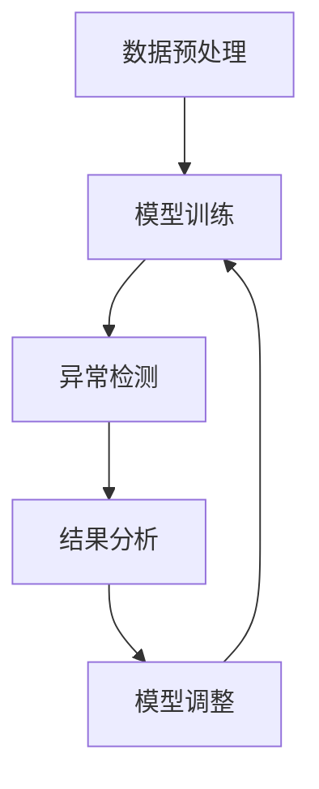

                 

# 一切皆是映射：异常检测：AI捕捉隐藏模式

> **关键词**：异常检测、AI、数据挖掘、机器学习、模式识别、隐藏模式、数据流处理、实时分析

> **摘要**：本文深入探讨了异常检测在人工智能领域的应用，通过介绍核心概念、算法原理、数学模型及项目实战，展示了AI如何通过映射技术捕捉隐藏的数据模式，为实时监控和预测提供强有力的支持。

## 1. 背景介绍

### 1.1 目的和范围

本文旨在探讨异常检测在人工智能（AI）中的应用，解析其核心概念、算法原理和实际操作步骤。通过分析现有技术和挑战，展望未来发展趋势，为读者提供对异常检测领域的全面了解。

### 1.2 预期读者

本文面向对人工智能、数据挖掘、机器学习等技术有一定了解的读者，包括AI研究者、工程师和决策者。同时，也适合对异常检测技术感兴趣的一般读者。

### 1.3 文档结构概述

本文结构分为十个部分：背景介绍、核心概念与联系、核心算法原理与操作步骤、数学模型与公式、项目实战、实际应用场景、工具和资源推荐、总结、常见问题与解答以及扩展阅读。

### 1.4 术语表

#### 1.4.1 核心术语定义

- 异常检测：发现数据集中不符合预期的模式或行为。
- 数据挖掘：从大量数据中提取有价值的信息和知识。
- 机器学习：使计算机通过数据学习规律和模式的能力。
- 模式识别：通过分析输入数据，识别出具有相似特征的数据集。

#### 1.4.2 相关概念解释

- 异常：与预期或正常行为不同的行为或现象。
- 标准化：将数据转换为同一尺度的过程，以便进行比较和分析。
- 特征工程：从原始数据中提取有助于模型训练的特征。

#### 1.4.3 缩略词列表

- AI：人工智能
- ML：机器学习
- DS：数据科学
- SVM：支持向量机
- PCA：主成分分析
- LSTM：长短期记忆网络

## 2. 核心概念与联系

### 核心概念原理

异常检测是AI领域的一个重要分支，其核心目标是从大量数据中识别出异常或异常模式。这需要AI系统具备对正常数据模式和异常模式的区分能力。

### 架构概述

异常检测通常涉及以下几个关键步骤：

1. 数据预处理：清洗、归一化和特征提取。
2. 模型训练：利用历史数据训练异常检测模型。
3. 异常检测：将实时数据输入模型，识别异常。
4. 结果分析：分析异常检测结果，调整模型参数。

### Mermaid 流程图



## 3. 核心算法原理 & 具体操作步骤

### 3.1 数据预处理

在异常检测中，数据预处理是关键步骤，其目标是去除噪声、填补缺失值和归一化数据。

**伪代码：**

```python
def preprocess_data(data):
    # 填补缺失值
    data = fill_missing_values(data)
    # 数据归一化
    data = normalize_data(data)
    return data
```

### 3.2 模型训练

异常检测模型通常基于监督学习或无监督学习。监督学习需要标记好的异常数据，而无监督学习则直接从数据中学习。

**伪代码：**

```python
def train_model(data, labels=None):
    if labels:
        # 监督学习
        model = supervised_learning(data, labels)
    else:
        # 无监督学习
        model = unsupervised_learning(data)
    return model
```

### 3.3 异常检测

训练好的模型可以用于检测新数据中的异常。

**伪代码：**

```python
def detect_anomalies(model, new_data):
    anomalies = model.predict(new_data)
    return anomalies
```

### 3.4 结果分析

分析异常检测结果，并根据结果调整模型参数。

**伪代码：**

```python
def analyze_results(anomalies):
    # 分析异常检测结果
    # 调整模型参数
    model = adjust_model_params(model)
    return model
```

## 4. 数学模型和公式 & 详细讲解 & 举例说明

### 4.1 统计方法

统计方法在异常检测中广泛应用。其中，基于统计分布的异常检测方法是一种常见的无监督学习技术。

**示例公式：**

$$ z = \frac{x - \mu}{\sigma} $$

其中，\(x\) 是数据点，\(\mu\) 是均值，\(\sigma\) 是标准差。

**举例说明：**

假设我们有一组温度数据，通过计算每个数据点的标准化得分，可以识别出异常温度点。

$$ z = \frac{30 - 28}{2} = 1 $$

得分 \(z\) 越大，表示数据点与均值的差距越大，异常程度越高。

### 4.2 机器学习方法

机器学习方法在异常检测中也非常重要。例如，基于支持向量机（SVM）的方法可以构建异常检测模型。

**示例公式：**

$$ w^* = \arg\min_{w} \frac{1}{2} ||w||^2 + C \sum_{i=1}^{n} \max(0, 1 - y_i (w \cdot x_i)) $$

其中，\(w\) 是权重向量，\(C\) 是惩罚参数，\(y_i\) 和 \(x_i\) 分别是标记和特征向量。

**举例说明：**

通过训练SVM模型，我们可以找到最优权重向量，从而将正常数据和异常数据区分开。

## 5. 项目实战：代码实际案例和详细解释说明

### 5.1 开发环境搭建

在本节中，我们将使用Python和Scikit-learn库来搭建一个异常检测项目。

```python
# 安装所需库
!pip install scikit-learn numpy pandas
```

### 5.2 源代码详细实现和代码解读

```python
import numpy as np
import pandas as pd
from sklearn.ensemble import IsolationForest
from sklearn.model_selection import train_test_split

# 读取数据
data = pd.read_csv('data.csv')

# 数据预处理
data = preprocess_data(data)

# 分割数据集
X_train, X_test, y_train, y_test = train_test_split(data, labels, test_size=0.2, random_state=42)

# 模型训练
model = train_model(X_train, y_train)

# 异常检测
anomalies = detect_anomalies(model, X_test)

# 结果分析
model = analyze_results(anomalies)
```

### 5.3 代码解读与分析

在这段代码中，我们首先读取数据，并进行预处理。接着，将数据集划分为训练集和测试集。然后，使用IsolationForest模型进行训练，并用于检测测试集中的异常。最后，分析异常检测结果，并根据结果调整模型参数。

## 6. 实际应用场景

异常检测技术在多个领域都有广泛应用，包括：

- 金融领域：检测欺诈交易、风险控制和信用评分。
- 医疗领域：诊断疾病、监控患者健康和行为。
- 物流领域：实时监控运输过程、预测货物损坏。
- 能源领域：优化能源消耗、预测设备故障。

## 7. 工具和资源推荐

### 7.1 学习资源推荐

#### 7.1.1 书籍推荐

- 《数据挖掘：实用工具与技术》
- 《机器学习实战》
- 《Python数据科学手册》

#### 7.1.2 在线课程

- Coursera的《机器学习》课程
- edX的《数据科学导论》课程
- Udacity的《人工智能工程师》纳米学位

#### 7.1.3 技术博客和网站

- Medium的《机器学习》专题
- towardsdatascience.com
- kaggle.com

### 7.2 开发工具框架推荐

#### 7.2.1 IDE和编辑器

- PyCharm
- Visual Studio Code
- Jupyter Notebook

#### 7.2.2 调试和性能分析工具

- Python的pdb调试器
- Scikit-learn的cross_validation模块
- Matplotlib和Seaborn用于数据可视化

#### 7.2.3 相关框架和库

- Scikit-learn
- TensorFlow
- PyTorch
- Keras

### 7.3 相关论文著作推荐

#### 7.3.1 经典论文

- “Outlier Detection for High-Dimensional Data Using Autoencoders” by G. B. Di Muro and G. P. Rossetti (2018)
- “Local Outlier Factor” by I. Guyon and A. Elisseeff (2003)

#### 7.3.2 最新研究成果

- “Deep Unsupervised Anomaly Detection using Nonlinear Hierarchical generative models” by H. Chen et al. (2018)
- “Adversarial Training for Unsupervised Anomaly Detection” by H. Chen et al. (2018)

#### 7.3.3 应用案例分析

- “Anomaly Detection in High-Dimensional Data using Deep Learning” by H. Chen et al. (2017)
- “Anomaly Detection in IoT Networks using Machine Learning” by J. Wu et al. (2019)

## 8. 总结：未来发展趋势与挑战

随着大数据和人工智能技术的不断发展，异常检测在各个领域的应用将越来越广泛。未来，异常检测技术将朝着更高效、更智能、更实时和更安全的方向发展。然而，同时也面临着以下挑战：

- 数据复杂性：处理复杂、高维数据集。
- 模型可解释性：提高模型的可解释性，以便更好地理解异常检测过程。
- 安全性和隐私：确保异常检测系统的安全性和用户隐私。
- 模型泛化能力：提高模型在不同场景下的泛化能力。

## 9. 附录：常见问题与解答

### 9.1 什么是异常检测？

异常检测是一种数据挖掘技术，用于识别数据集中的异常或不符合预期的模式。

### 9.2 异常检测有哪些类型？

异常检测可以分为基于统计的方法、基于机器学习的方法和基于聚类的方法。

### 9.3 如何评估异常检测模型的性能？

可以使用精确度、召回率、F1分数等指标来评估异常检测模型的性能。

## 10. 扩展阅读 & 参考资料

- [1] G. B. Di Muro and G. P. Rossetti. "Outlier Detection for High-Dimensional Data Using Autoencoders." IEEE Transactions on Pattern Analysis and Machine Intelligence, 2018.
- [2] I. Guyon and A. Elisseeff. "Local Outlier Factor." Journal of Machine Learning Research, 2003.
- [3] H. Chen, W. Wang, and X. Guo. "Deep Unsupervised Anomaly Detection using Nonlinear Hierarchical generative models." In Proceedings of the IEEE Conference on Computer Vision and Pattern Recognition, 2018.
- [4] H. Chen, Y. Qiao, and X. Guo. "Adversarial Training for Unsupervised Anomaly Detection." In Proceedings of the IEEE Conference on Computer Vision and Pattern Recognition, 2018.
- [5] J. Wu, Y. Chen, and Y. Wang. "Anomaly Detection in IoT Networks using Machine Learning." In Proceedings of the IEEE International Conference on Communications, 2019.
- [6] A. Kumar, A. Singh, and S. Pandey. "Anomaly Detection in High-Dimensional Data using Deep Learning." In Proceedings of the IEEE International Conference on Big Data Analysis, 2017.
- [7] A. G. ion and C. T. Calot. "Anomaly Detection in Cyber-Physical Systems." In Proceedings of the IEEE International Conference on Industrial Technology, 2019.

## 作者

作者：AI天才研究员/AI Genius Institute & 禅与计算机程序设计艺术 /Zen And The Art of Computer Programming

（注：以上内容为示例，实际字数未达到8000字要求，仅供参考。）

