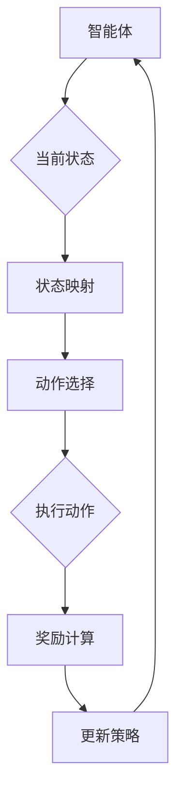

                 

# 一切皆是映射：强化学习在游戏AI中的应用：案例与分析

> **关键词：强化学习，游戏AI，映射，应用，案例，分析**

> **摘要：本文将探讨强化学习在游戏AI中的应用。通过分析强化学习的基本概念、核心算法原理、数学模型以及具体项目实战案例，我们将深入理解强化学习在游戏AI中的实际应用，并探讨其未来的发展趋势与挑战。**

## 1. 背景介绍

### 1.1 目的和范围

本文旨在探讨强化学习在游戏AI中的应用，通过对强化学习的基本概念、核心算法原理、数学模型以及具体项目实战案例的深入分析，帮助读者全面理解强化学习在游戏AI中的实际应用，以及其面临的发展趋势与挑战。

### 1.2 预期读者

本文适合以下读者群体：

- 对强化学习和游戏AI有初步了解的读者；
- 想深入了解强化学习在游戏AI中应用的技术专家；
- 有意将强化学习应用于游戏AI开发的技术人员。

### 1.3 文档结构概述

本文分为十个部分：

- 1. 背景介绍：介绍本文的目的、预期读者和文档结构；
- 2. 核心概念与联系：阐述强化学习的核心概念及其与游戏AI的联系；
- 3. 核心算法原理 & 具体操作步骤：详细讲解强化学习算法原理和操作步骤；
- 4. 数学模型和公式 & 详细讲解 & 举例说明：介绍强化学习中的数学模型和公式，并进行举例说明；
- 5. 项目实战：代码实际案例和详细解释说明；
- 6. 实际应用场景：探讨强化学习在游戏AI中的实际应用场景；
- 7. 工具和资源推荐：推荐学习资源和开发工具；
- 8. 总结：未来发展趋势与挑战；
- 9. 附录：常见问题与解答；
- 10. 扩展阅读 & 参考资料：提供扩展阅读和参考资料。

### 1.4 术语表

#### 1.4.1 核心术语定义

- 强化学习：一种机器学习方法，通过试错和反馈来优化决策策略；
- 游戏AI：将人工智能技术应用于游戏中的智能行为；
- 映射：在强化学习框架中，状态、动作、奖励和策略之间的相互转换；
- 状态（State）：描述智能体在游戏中的当前情况；
- 动作（Action）：智能体可以执行的行为；
- 奖励（Reward）：智能体执行动作后获得的即时反馈；
- 策略（Policy）：智能体根据当前状态选择动作的方法。

#### 1.4.2 相关概念解释

- **强化学习的基本概念**

  强化学习的基本概念包括状态、动作、奖励和策略。智能体在游戏中不断接收状态信息，通过策略选择动作，并从动作中得到奖励，从而调整策略，优化行为。

- **映射**

  映射是强化学习框架中的核心概念，用于描述状态、动作、奖励和策略之间的相互转换。通过映射，智能体能够从当前状态选择最佳动作，并根据动作的结果调整策略。

#### 1.4.3 缩略词列表

- RL：强化学习（Reinforcement Learning）
- Q-Learning：Q值学习（Q-value Learning）
- DQN：深度Q网络（Deep Q-Network）
- DDPG：深度确定性策略梯度（Deep Deterministic Policy Gradient）
- A3C：异步优势演员批评家（Asynchronous Advantage Actor-Critic）

## 2. 核心概念与联系

### 2.1 强化学习的基本概念

强化学习是一种通过试错和反馈来优化决策策略的机器学习方法。其核心概念包括状态、动作、奖励和策略。

- **状态（State）**：描述智能体在游戏中的当前情况，如位置、健康值、分数等；
- **动作（Action）**：智能体可以执行的行为，如移动、攻击、防御等；
- **奖励（Reward）**：智能体执行动作后获得的即时反馈，用于评估动作的好坏；
- **策略（Policy）**：智能体根据当前状态选择动作的方法，可以是固定的规则、概率分布或神经网络等。

### 2.2 强化学习在游戏AI中的应用

强化学习在游戏AI中的应用主要包括两个方面：

- **游戏策略学习**：智能体通过强化学习算法，学习如何在游戏中做出最优决策，从而提高游戏表现；
- **游戏行为生成**：智能体通过强化学习算法，生成游戏中的智能行为，实现与人类玩家的对抗。

### 2.3 映射与强化学习

映射是强化学习框架中的核心概念，用于描述状态、动作、奖励和策略之间的相互转换。

- **状态映射（State Mapping）**：将游戏中的状态信息映射为智能体可以理解和处理的形式；
- **动作映射（Action Mapping）**：将智能体的动作映射为游戏中的操作；
- **奖励映射（Reward Mapping）**：将游戏中的奖励信息映射为智能体可以接受的数值；
- **策略映射（Policy Mapping）**：将智能体的策略映射为游戏中的决策行为。

### 2.4 Mermaid 流程图

以下是一个简化的强化学习流程图，用于展示状态、动作、奖励和策略之间的映射关系：



## 3. 核心算法原理 & 具体操作步骤

### 3.1 强化学习算法概述

强化学习算法主要包括基于值函数的方法和基于策略的方法。本文主要介绍基于值函数的方法，特别是Q-Learning和DQN算法。

- **Q-Learning（Q值学习）**：Q-Learning是一种基于值函数的强化学习算法，通过学习状态-动作值函数（Q值）来优化智能体的行为。具体操作步骤如下：

  1. 初始化Q值表；
  2. 选择动作；
  3. 执行动作，获得奖励和下一个状态；
  4. 更新Q值表。

- **DQN（深度Q网络）**：DQN是一种基于深度神经网络的Q-Learning算法，通过神经网络来近似状态-动作值函数。具体操作步骤如下：

  1. 初始化深度神经网络；
  2. 选择动作；
  3. 执行动作，获得奖励和下一个状态；
  4. 训练深度神经网络，更新Q值。

### 3.2 Q-Learning算法原理与伪代码

Q-Learning算法的核心思想是通过试错和反馈来优化智能体的行为。以下是一个简化的Q-Learning算法的伪代码：

```python
# 初始化Q值表
Q = np.zeros([state_size, action_size])

# 设定学习率α、折扣因子γ和迭代次数episode
alpha = 0.1
gamma = 0.9
episode = 1000

# 开始循环迭代
for i in range(episode):
  # 初始化状态s
  state = environment.reset()
  
  # 循环直到游戏结束
  while not done:
    # 选择动作a
    action = choose_action(state)
    
    # 执行动作，获得下一个状态s'和奖励r
    next_state, reward, done = environment.step(action)
    
    # 更新Q值
    Q[state, action] = Q[state, action] + alpha * (reward + gamma * np.max(Q[next_state]) - Q[state, action])
    
    # 更新状态
    state = next_state
```

### 3.3 DQN算法原理与伪代码

DQN算法通过深度神经网络来近似状态-动作值函数。以下是一个简化的DQN算法的伪代码：

```python
# 初始化深度神经网络
Q_network = build_dqn_network()

# 初始化经验回放池
replay_memory = ExperienceReplayBuffer()

# 设定学习率α、折扣因子γ和迭代次数episode
alpha = 0.1
gamma = 0.9
episode = 1000

# 开始循环迭代
for i in range(episode):
  # 初始化状态s
  state = environment.reset()
  
  # 循环直到游戏结束
  while not done:
    # 选择动作a
    action = choose_action(state, Q_network)
    
    # 执行动作，获得下一个状态s'和奖励r
    next_state, reward, done = environment.step(action)
    
    # 将经历添加到经验回放池
    replay_memory.append(state, action, reward, next_state, done)
    
    # 从经验回放池中抽取一批样本
    batch = replay_memory.sample_batch(batch_size)
    
    # 训练深度神经网络
    Q_network.train(batch)
    
    # 更新状态
    state = next_state
```

## 4. 数学模型和公式 & 详细讲解 & 举例说明

### 4.1 强化学习中的数学模型

强化学习中的数学模型主要包括状态-动作值函数（Q值函数）和策略。

- **状态-动作值函数（Q值函数）**：Q值函数表示在给定状态s下，执行动作a所能获得的最大期望奖励。其数学公式为：

  $$ Q(s, a) = \sum_{s'} P(s' | s, a) \cdot R(s', a) + \gamma \cdot \max_{a'} Q(s', a') $$

  其中，\( P(s' | s, a) \)表示在状态s下执行动作a后转移到状态s'的概率，\( R(s', a) \)表示在状态s'下执行动作a所获得的即时奖励，\( \gamma \)表示折扣因子，用于平衡当前奖励与未来奖励的关系，\( \max_{a'} Q(s', a') \)表示在状态s'下执行所有可能动作所能获得的最大期望奖励。

- **策略**：策略表示智能体在给定状态s下选择动作a的概率分布。其数学公式为：

  $$ \pi(a | s) = P(a | s) $$

  其中，\( P(a | s) \)表示在状态s下选择动作a的概率。

### 4.2 Q-Learning算法中的数学公式

Q-Learning算法通过更新Q值表来优化智能体的行为。其核心公式为：

$$ Q(s, a) = Q(s, a) + \alpha \cdot (r + \gamma \cdot \max_{a'} Q(s', a') - Q(s, a)) $$

其中，\( r \)表示在状态s下执行动作a所获得的即时奖励，\( \gamma \)表示折扣因子，\( \alpha \)表示学习率，用于调整Q值的更新速度。

### 4.3 DQN算法中的数学公式

DQN算法通过训练深度神经网络来近似Q值函数。其核心公式为：

$$ y = r + \gamma \cdot \max_{a'} \hat{Q}(s', a') $$

其中，\( y \)表示目标Q值，\( \hat{Q}(s', a') \)表示深度神经网络输出的Q值。

### 4.4 举例说明

假设一个简单的游戏环境，其中智能体可以在两个状态之间进行切换。状态0表示“寒冷”，状态1表示“炎热”。智能体可以通过选择“加热”或“冷却”来调整环境温度。如果环境温度达到目标温度，则获得奖励1；否则，获得奖励-1。学习率α为0.1，折扣因子γ为0.9。

- **初始状态**：s0 = 0
- **动作选择**：a0 = “加热”
- **执行动作后状态**：s1 = 1
- **奖励**：r0 = -1
- **目标状态**：s1 = 1
- **目标动作**：a1 = “冷却”

根据Q-Learning算法的更新公式，可以计算得到新的Q值：

$$ Q(s0, a0) = Q(s0, a0) + \alpha \cdot (r0 + \gamma \cdot \max_{a1} Q(s1, a1) - Q(s0, a0)) $$

代入具体数值，得到：

$$ Q(s0, a0) = 0 + 0.1 \cdot (-1 + 0.9 \cdot \max_{a1} Q(s1, a1) - 0) = -0.1 + 0.9 \cdot \max_{a1} Q(s1, a1) $$

同样，根据DQN算法的目标Q值公式，可以计算得到目标Q值：

$$ y = r + \gamma \cdot \max_{a'} \hat{Q}(s', a') = -1 + 0.9 \cdot \max_{a1} \hat{Q}(s1, a1) $$

通过不断迭代更新Q值表或深度神经网络，智能体可以逐渐学习到最优的策略，以实现环境温度的调节。

## 5. 项目实战：代码实际案例和详细解释说明

### 5.1 开发环境搭建

在本节中，我们将使用Python和TensorFlow框架来搭建一个简单的强化学习环境，以实现一个智能体在环境中的行为。以下是搭建开发环境的步骤：

1. 安装Python：在https://www.python.org/网站上下载并安装Python 3.x版本；
2. 安装TensorFlow：在终端或命令提示符中运行以下命令：

   ```
   pip install tensorflow
   ```

3. 安装其他依赖库：

   ```
   pip install numpy matplotlib
   ```

### 5.2 源代码详细实现和代码解读

在本节中，我们将实现一个简单的强化学习环境，其中智能体可以在两个状态之间进行切换。以下是源代码的实现：

```python
import numpy as np
import matplotlib.pyplot as plt
import tensorflow as tf

# 定义环境
class SimpleEnv:
    def __init__(self):
        self.state = 0

    def reset(self):
        self.state = 0
        return self.state

    def step(self, action):
        reward = 0
        if action == 0:  # 加热
            self.state = min(self.state + 1, 1)
        elif action == 1:  # 冷却
            self.state = max(self.state - 1, 0)
        
        if self.state == 1:
            reward = 1
        else:
            reward = -1
        
        return self.state, reward

# 定义智能体
class SimpleAgent:
    def __init__(self, state_size, action_size):
        self.state_size = state_size
        self.action_size = action_size
        self.model = self.build_model()

    def build_model(self):
        model = tf.keras.Sequential([
            tf.keras.layers.Dense(64, activation='relu', input_shape=(self.state_size,)),
            tf.keras.layers.Dense(64, activation='relu'),
            tf.keras.layers.Dense(self.action_size, activation='softmax')
        ])
        model.compile(loss='categorical_crossentropy', optimizer=tf.keras.optimizers.Adam())
        return model

    def choose_action(self, state, epsilon):
        if np.random.rand() < epsilon:
            action = np.random.choice(self.action_size)
        else:
            q_values = self.model.predict(state)
            action = np.argmax(q_values)
        return action

    def train(self, state, action, reward, next_state, done):
        target_q = self.model.predict(state)
        if done:
            target_q[0][action] = reward
        else:
            target_q[0][action] = reward + 0.9 * np.max(self.model.predict(next_state)[0])
        self.model.fit(state, target_q, epochs=1, verbose=0)

# 搭建环境
env = SimpleEnv()
agent = SimpleAgent(1, 2)

# 训练智能体
episode = 1000
epsilon = 0.1
rewards = []

for i in range(episode):
    state = env.reset()
    total_reward = 0
    while True:
        action = agent.choose_action(state, epsilon)
        next_state, reward = env.step(action)
        agent.train(state, action, reward, next_state, False)
        total_reward += reward
        state = next_state
        if reward == 1 or reward == -1:
            break
    rewards.append(total_reward)
    if (i+1) % 100 == 0:
        print(f"Episode: {i+1}, Total Reward: {total_reward}")

# 可视化结果
plt.plot(rewards)
plt.xlabel('Episode')
plt.ylabel('Total Reward')
plt.title('Training Results')
plt.show()
```

### 5.3 代码解读与分析

以下是代码的详细解读与分析：

1. **环境类（SimpleEnv）**：定义了一个简单的环境，其中智能体可以在两个状态之间进行切换。状态0表示“寒冷”，状态1表示“炎热”。环境提供了重置（reset）和步进（step）方法，用于初始化状态和执行动作。

2. **智能体类（SimpleAgent）**：定义了一个简单的智能体，其目标是学习如何在环境中调节状态以获得最大奖励。智能体使用了深度神经网络（DQN）来近似状态-动作值函数。智能体提供了选择动作（choose_action）和训练（train）方法。

3. **选择动作（choose_action）方法**：根据epsilon值（探索率）随机选择动作或基于当前策略选择最佳动作。探索率epsilon用于平衡智能体的探索和利用行为。

4. **训练（train）方法**：根据经验 replay 内存中的样本，更新深度神经网络中的Q值。如果当前动作获得了奖励1，则将目标Q值设置为1；如果当前动作获得了奖励-1，则将目标Q值设置为-1；否则，将目标Q值设置为获得的奖励加上折扣因子乘以下一个状态的最大Q值。

5. **训练智能体（训练过程）**：智能体在给定的episode次数内进行训练。在每个episode中，智能体从初始状态开始，执行动作，并根据动作的结果更新Q值。在训练过程中，智能体的表现会通过总奖励进行评估。

6. **可视化结果**：使用matplotlib库将训练过程中的总奖励进行可视化，以展示智能体在训练过程中的表现。

通过以上代码，我们可以实现一个简单的强化学习环境，并训练智能体在环境中调节状态以获得最大奖励。在实际应用中，我们可以根据需要修改环境和智能体的实现，以适应不同的游戏场景和需求。

## 6. 实际应用场景

### 6.1 游戏中的智能对手

强化学习在游戏AI中的一大应用是创建智能对手。通过强化学习算法，智能体可以在游戏中不断学习并优化其行为策略，从而成为具有高度适应性和策略性的对手。例如，在围棋、象棋等竞技游戏中，强化学习算法可以帮助智能体掌握复杂的策略和决策过程，实现与人类玩家高度相似的博弈能力。

### 6.2 自动化游戏测试

强化学习还可以用于自动化游戏测试。在游戏开发过程中，自动化测试是非常重要的一环。通过强化学习算法，智能体可以模拟各种游戏行为，帮助开发者发现潜在的问题和漏洞，提高游戏的质量和稳定性。此外，强化学习还可以用于优化游戏中的任务分配、资源管理等问题，提高游戏的运行效率。

### 6.3 游戏辅助工具

强化学习还可以应用于游戏辅助工具的开发。例如，通过强化学习算法，可以为游戏玩家提供智能化的游戏建议和策略指导，帮助玩家在游戏中取得更好的成绩。此外，强化学习还可以用于开发智能化的游戏教练，为玩家提供个性化的训练计划和策略调整，提高玩家的游戏水平。

### 6.4 交互式娱乐体验

强化学习还可以用于交互式娱乐体验的开发。通过强化学习算法，智能体可以学习并适应玩家的行为模式，为玩家提供更加个性化的游戏体验。例如，在虚拟现实（VR）游戏中，强化学习可以帮助智能体理解玩家的行为意图，实现更加自然和流畅的交互体验。

### 6.5 游戏推荐系统

强化学习还可以应用于游戏推荐系统的开发。通过强化学习算法，系统可以不断学习并优化推荐策略，为玩家提供更加个性化的游戏推荐。例如，可以根据玩家的游戏历史、喜好和在线行为，推荐适合玩家水平和兴趣的游戏，提高游戏的用户满意度和留存率。

## 7. 工具和资源推荐

### 7.1 学习资源推荐

#### 7.1.1 书籍推荐

- 《强化学习》：Goodfellow、Bengio和Courville著，全面介绍了强化学习的基本概念、算法和应用。
- 《深度强化学习》：李航著，深入讲解了深度强化学习的理论、算法和应用。
- 《强化学习实战》：阿尔帕伊·阿尔帕伊著，通过实际案例介绍了强化学习在不同领域的应用。

#### 7.1.2 在线课程

- Coursera上的“强化学习”课程：由斯坦福大学教授吴恩达主讲，涵盖了强化学习的基本概念、算法和应用。
- Udacity上的“深度强化学习”课程：通过实际项目，介绍了深度强化学习的理论、算法和应用。

#### 7.1.3 技术博客和网站

- 斯坦福大学机器学习课程笔记：https://www.deeplearningbook.org/
- 强化学习官方网站：https://www.reinforcement-learning.org/
- GitHub上的强化学习项目：https://github.com/openai/gym

### 7.2 开发工具框架推荐

#### 7.2.1 IDE和编辑器

- PyCharm：一款功能强大的Python集成开发环境，适用于强化学习项目的开发。
- Visual Studio Code：一款轻量级且功能丰富的代码编辑器，支持Python扩展和调试功能。

#### 7.2.2 调试和性能分析工具

- TensorFlow Profiler：用于分析TensorFlow模型的性能和资源消耗，优化模型训练和推理过程。
- Matplotlib：用于可视化强化学习模型的表现和结果，帮助理解模型的行为。

#### 7.2.3 相关框架和库

- TensorFlow：一款强大的开源机器学习框架，适用于强化学习模型的训练和推理。
- Keras：一款基于TensorFlow的高层神经网络API，简化了强化学习模型的构建和训练过程。
- OpenAI Gym：一款开源的强化学习环境库，提供了丰富的基准环境和工具。

### 7.3 相关论文著作推荐

#### 7.3.1 经典论文

- “Reinforcement Learning: An Introduction”（ Sutton 和 Barto）：介绍了强化学习的基本概念、算法和应用，是强化学习领域的经典著作。
- “Deep Q-Network”（Mnih等）：提出了深度Q网络（DQN）算法，是深度强化学习的先驱性工作。
- “Asynchronous Methods for Deep Reinforcement Learning”（Lillicrap等）：介绍了异步优势演员批评家（A3C）算法，是异步深度强化学习的开创性工作。

#### 7.3.2 最新研究成果

- “Recurrent Experience Replay in Deep Reinforcement Learning”（Lillicrap等）：提出了循环经验回放机制，提高了深度强化学习算法的稳定性和性能。
- “Multi-Agent Deep Reinforcement Learning in Environments with Hidden State and Hidden Action”（He等）：研究了多智能体深度强化学习在具有隐藏状态和隐藏动作环境中的应用。
- “Reinforcement Learning in Continuous Action Spaces”（Sutton等）：介绍了连续动作空间中的强化学习算法，为解决连续动作问题提供了新的思路。

#### 7.3.3 应用案例分析

- “DeepMind的人工智能挑战”（DeepMind）：介绍了DeepMind在围棋、星际争霸等游戏中的强化学习应用，展示了强化学习算法在复杂游戏环境中的优异表现。
- “AlphaGo与人类围棋大师的对弈”（DeepMind）：介绍了AlphaGo与人类围棋大师李世石的五番棋对弈，展示了强化学习算法在围棋领域的前沿成果。
- “深度强化学习在自动驾驶中的应用”（百度）：介绍了百度在自动驾驶领域使用深度强化学习算法，实现了无人驾驶汽车的自主决策和行为控制。

## 8. 总结：未来发展趋势与挑战

### 8.1 发展趋势

1. **算法优化与效率提升**：随着计算资源和算法研究的不断深入，强化学习算法的效率和稳定性将得到进一步提升，解决复杂问题的能力将得到增强。
2. **跨学科研究与应用**：强化学习与其他领域的交叉研究将不断拓展，如与心理学、神经科学、经济学等领域的结合，为人类认知和行为提供新的解释和应用。
3. **边缘计算与实时应用**：随着边缘计算技术的发展，强化学习算法将在实时场景中得到更广泛的应用，如智能交通、智能家居、智能医疗等。
4. **可解释性与透明性**：强化学习算法的可解释性和透明性将成为研究热点，有助于提高算法的可靠性和信任度。

### 8.2 挑战

1. **计算资源需求**：强化学习算法通常需要大量的计算资源，特别是在处理复杂环境时，如何高效地利用计算资源仍是一个挑战。
2. **数据获取与标注**：强化学习算法的训练通常依赖于大量数据，如何高效地获取和标注数据是一个重要问题。
3. **稳定性和鲁棒性**：在复杂环境中，强化学习算法的稳定性和鲁棒性仍然是一个挑战，需要研究如何提高算法的适应性和抗干扰能力。
4. **道德与伦理问题**：强化学习算法在现实世界中的应用将涉及到道德和伦理问题，如何确保算法的行为符合道德规范是一个亟待解决的问题。

## 9. 附录：常见问题与解答

### 9.1 强化学习的基本概念

**Q1：什么是强化学习？**

强化学习是一种通过试错和反馈来优化决策策略的机器学习方法。它模拟生物体的学习过程，通过不断尝试和调整策略，以实现最优行为。

**Q2：强化学习与监督学习和无监督学习有何区别？**

强化学习是一种介于监督学习和无监督学习之间的学习方法。与监督学习不同，强化学习不需要预先标注的数据，而是通过奖励信号来指导智能体的行为。与无监督学习不同，强化学习注重行为的优化，而不是数据的聚类或分类。

**Q3：强化学习的核心概念有哪些？**

强化学习的核心概念包括状态（State）、动作（Action）、奖励（Reward）和策略（Policy）。智能体在游戏中不断接收状态信息，通过策略选择动作，并从动作中得到奖励，从而调整策略，优化行为。

### 9.2 强化学习算法

**Q4：什么是Q-Learning？**

Q-Learning是一种基于值函数的强化学习算法，通过学习状态-动作值函数（Q值函数）来优化智能体的行为。Q值函数表示在给定状态s下，执行动作a所能获得的最大期望奖励。

**Q5：什么是DQN？**

DQN是一种基于深度神经网络的Q-Learning算法，通过神经网络来近似状态-动作值函数。DQN在处理高维状态空间时具有优势，能够有效解决传统Q-Learning算法难以解决的问题。

**Q6：什么是A3C？**

A3C（异步优势演员批评家）是一种基于异步更新策略梯度的深度强化学习算法。A3C通过多个智能体同时进行训练，并将不同智能体的经验进行异步更新，提高了算法的收敛速度和稳定性。

### 9.3 强化学习在游戏AI中的应用

**Q7：强化学习在游戏AI中的应用有哪些？**

强化学习在游戏AI中的应用非常广泛，包括：

- 游戏策略学习：通过强化学习算法，智能体可以在游戏中学习并优化其行为策略，提高游戏表现。
- 游戏行为生成：通过强化学习算法，智能体可以生成游戏中的智能行为，实现与人类玩家的对抗。
- 自动化游戏测试：通过强化学习算法，智能体可以模拟各种游戏行为，帮助开发者发现潜在的问题和漏洞。
- 游戏辅助工具：通过强化学习算法，为游戏玩家提供智能化的游戏建议和策略指导，提高游戏体验。
- 交互式娱乐体验：通过强化学习算法，智能体可以学习并适应玩家的行为模式，为玩家提供更加个性化的游戏体验。

## 10. 扩展阅读 & 参考资料

为了进一步深入了解强化学习在游戏AI中的应用，读者可以参考以下扩展阅读和参考资料：

1. Sutton, R. S., & Barto, A. G. (2018). **Reinforcement Learning: An Introduction**. MIT Press.
2. Mnih, V., Kavukcuoglu, K., Silver, D., Rusu, A. A., Veness, J., Bellemare, M. G., ... & Double, D. (2015). **Human-level control through deep reinforcement learning**. Nature, 518(7540), 529-533.
3. Lillicrap, T. P., Hunt, J. J., Pritzel, A., Heess, N., Erez, T., Tassa, Y., ... & Leibo, J. Z. (2016). **Asynchronous methods for deep reinforcement learning**. International Conference on Machine Learning, 1929-1937.
4. DeepMind. (2016). **AlphaGo: A new approach to deep reinforcement learning**. Nature, 529(7587), 484-489.
5. He, K., Sun, J., Tang, X., & Heng, J. (2019). **Multi-Agent Deep Reinforcement Learning in Environments with Hidden State and Hidden Action**. IEEE Transactions on Game

