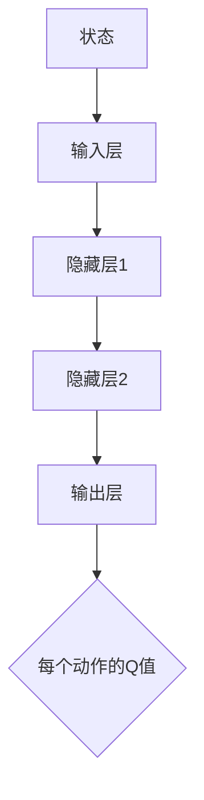
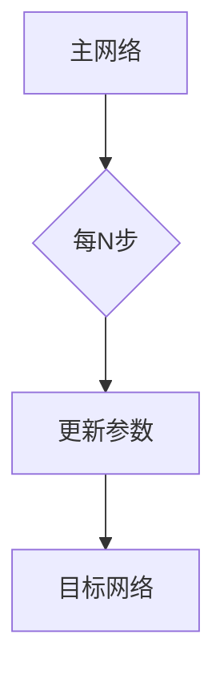
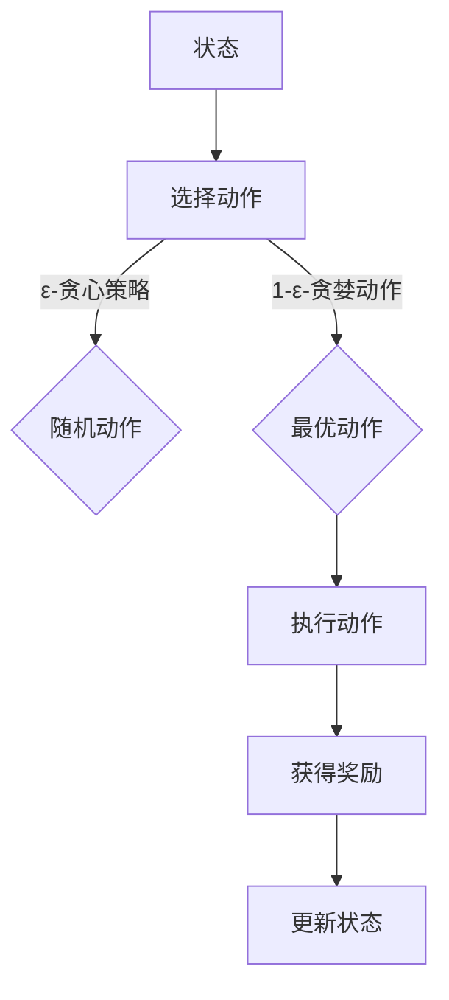

                 

# 一切皆是映射：探索DQN在仿真环境中的应用与挑战

> **关键词：** 强化学习、深度Q网络（DQN）、仿真环境、智能代理、应用挑战  
>
> **摘要：** 本文将深入探讨深度Q网络（DQN）在仿真环境中的应用及其面临的挑战。我们将首先介绍DQN的基本原理和核心概念，随后通过一个实例来展示其在仿真环境中的实现过程。接着，我们将分析DQN在实际应用中所遇到的挑战，并探讨可能的解决方案。最后，我们将总结DQN的未来发展趋势，并展望其在仿真环境中的潜在应用前景。

## 1. 背景介绍

### 1.1 目的和范围

本文的主要目的是探讨深度Q网络（DQN）在仿真环境中的应用，并分析其面临的挑战。DQN作为一种强化学习算法，因其简单有效的特点在诸多领域得到广泛应用。而仿真环境作为人工智能研究和应用的重要场景，能够为算法提供多样化的数据集和实验平台。通过对DQN在仿真环境中的应用进行深入分析，我们希望能够为读者提供一个全面的理解，并激发对这一领域的研究兴趣。

本文将涵盖以下几个方面的内容：

1. DQN的基本原理和核心概念；
2. DQN在仿真环境中的实现过程和实例分析；
3. DQN在实际应用中面临的挑战和解决方案；
4. DQN的未来发展趋势和潜在应用前景。

### 1.2 预期读者

本文适合对强化学习和深度学习有一定了解的读者，特别是希望深入探索DQN在仿真环境中的应用的科研人员、工程师和学者。同时，对于对人工智能应用场景感兴趣的一般读者，本文也具有一定的参考价值。

### 1.3 文档结构概述

本文将按照以下结构进行组织：

1. **背景介绍**：介绍DQN的基本原理和仿真环境的相关概念，明确本文的研究目的和内容。
2. **核心概念与联系**：通过Mermaid流程图展示DQN的核心概念和架构，帮助读者建立整体认识。
3. **核心算法原理 & 具体操作步骤**：详细讲解DQN的算法原理，使用伪代码展示具体操作步骤。
4. **数学模型和公式 & 详细讲解 & 举例说明**：介绍DQN的数学模型和关键公式，并通过实例进行详细说明。
5. **项目实战：代码实际案例和详细解释说明**：通过实际代码案例，展示DQN在仿真环境中的具体应用。
6. **实际应用场景**：分析DQN在不同领域中的应用场景，探讨其优势和局限性。
7. **工具和资源推荐**：推荐相关的学习资源和开发工具，为读者提供进一步学习的途径。
8. **总结：未来发展趋势与挑战**：总结DQN的研究现状，展望其未来的发展趋势和面临的挑战。
9. **附录：常见问题与解答**：解答读者可能遇到的一些常见问题，提供实用的建议。
10. **扩展阅读 & 参考资料**：提供本文引用和参考的相关文献和资料，便于读者深入探究。

### 1.4 术语表

#### 1.4.1 核心术语定义

- **深度Q网络（DQN）**：一种基于深度学习的强化学习算法，通过神经网络估计动作值函数，用于解决环境中的决策问题。
- **仿真环境**：模拟真实世界的环境，用于测试和训练智能代理的行为。
- **智能代理**：在仿真环境中执行特定任务的人工智能实体，通过学习获得最优策略。
- **强化学习**：一种机器学习方法，通过试错和反馈来学习如何实现最佳行为。

#### 1.4.2 相关概念解释

- **Q值（Q-value）**：表示在特定状态下执行特定动作的预期回报，用于评估动作的好坏。
- **探索策略（Exploration Strategy）**：在强化学习中用于平衡探索未知行为和利用已知行为的策略。
- **目标网络（Target Network）**：用于稳定训练过程的一个网络，通过延迟更新与主网络不同，减少训练误差。

#### 1.4.3 缩略词列表

- **DQN**：深度Q网络（Deep Q-Network）
- **RL**：强化学习（Reinforcement Learning）
- **SARSA**：同步优势和随机策略（Synchronous Advantage and Random Strategy）
- **DDPG**：深度确定性策略梯度（Deep Deterministic Policy Gradient）

## 2. 核心概念与联系

在深入了解DQN之前，我们需要先了解一些核心概念和它们之间的联系。以下是DQN的关键组成部分和它们之间的关系：

### 2.1. 强化学习的基本概念

强化学习是一种通过试错来学习如何实现最佳行为的方法。其主要目标是训练一个智能代理（agent）在特定环境中采取最优动作，以获得最大累积奖励。

- **状态（State）**：环境中的一个具体情境或条件。
- **动作（Action）**：代理可以采取的行为或决策。
- **奖励（Reward）**：代理在每个状态采取每个动作后获得的即时反馈。
- **策略（Policy）**：代理根据当前状态选择最优动作的决策规则。

### 2.2. 深度Q网络（DQN）的架构

DQN是一种基于深度学习的强化学习算法，其主要思想是通过神经网络来近似Q值函数。Q值函数用于评估在特定状态下采取特定动作的预期回报。

- **输入层**：接收状态信息，作为神经网络的输入。
- **隐藏层**：用于提取状态的特征表示。
- **输出层**：输出Q值，表示每个动作的预期回报。

DQN的架构可以表示为以下Mermaid流程图：



### 2.3. 目标网络（Target Network）

为了稳定训练过程，DQN中引入了目标网络（Target Network）。目标网络是一个与主网络结构相同的网络，用于延迟更新，以减少训练误差。

- **主网络**：通过训练得到的当前Q值估计网络。
- **目标网络**：用于稳定训练过程，减少训练误差。

目标网络的更新过程可以表示为以下Mermaid流程图：



### 2.4. 探索策略（Exploration Strategy）

在强化学习中，探索策略用于平衡探索未知行为和利用已知行为。常用的探索策略包括：

- **ε-贪心策略**：以概率ε进行随机动作，以探索未知行为；以1-ε进行贪婪动作，以利用已知行为。
- **经验回放（Experience Replay）**：将过去的经验数据存储在记忆库中，以随机抽样方式用于训练，减少数据相关性。

探索策略的流程可以表示为以下Mermaid流程图：



通过以上核心概念和联系的介绍，读者可以更好地理解DQN在仿真环境中的应用。接下来，我们将进一步探讨DQN的算法原理和具体操作步骤。

## 3. 核心算法原理 & 具体操作步骤

### 3.1. 算法原理

深度Q网络（DQN）是基于Q学习的一种强化学习算法，其主要目标是学习一个Q值函数，该函数能够预测在特定状态下执行特定动作的预期回报。DQN的核心思想是使用深度神经网络来近似Q值函数，从而解决传统Q学习在状态空间维度较高时难以求解的问题。

### 3.2. 伪代码描述

以下是一个简化的DQN算法的伪代码描述：

```plaintext
初始化参数：
    主网络 QNetwork
    目标网络 TargetNetwork
    训练数据 Experience Replay
    ε (探索率)
    ε_min (最小探索率)
    ε_decay (探索率衰减)
    学习率 learning_rate
    训练步数 training_steps
    批量大小 batch_size

初始化环境：
    状态 state = 环境初始化

DQN训练循环：
    对于每个训练步数：
        选择动作 action = ε-贪心策略(QNetwork, state)
        执行动作，获得新的状态 next_state 和奖励 reward
        将经验 (state, action, reward, next_state, done) 添加到 Experience Replay
        如果 done 为真，则重置环境，重新初始化状态 state
        否则，更新状态 state = next_state
        
        当 Experience Replay 中的经验数量足够时：
            随机从 Experience Replay 中抽取 batch_size 个经验样本
            计算目标 Q 值：y = reward + γ * max(QNetwork(next_state))
            使用梯度下降更新 QNetwork 的参数
            
        更新 ε 值：ε = ε_min + (ε_0 - ε_min) * exp(-decay_steps * iteration)
        
        每N步更新一次目标网络：TargetNetwork = 主网络
        
        记录训练过程中的性能指标，如奖励总和、平均Q值等
        
结束
```

### 3.3. 详细解释

#### 3.3.1. ε-贪心策略

在DQN中，探索策略采用ε-贪心策略，其目的是在初始阶段探索环境，以获得更多的经验数据，然后在训练过程中逐渐减少探索，增加利用已有知识进行决策的概率。

ε-贪心策略的公式如下：

$$
action = \begin{cases} 
\text{随机动作} & \text{with probability } \varepsilon \\
\text{贪婪动作} & \text{with probability } 1 - \varepsilon 
\end{cases}
$$

其中，ε表示探索率，通常在0和1之间取值。随着训练过程的进行，ε会按照ε_decay的规则逐渐减小，以达到平衡探索和利用的目的。

#### 3.3.2. 经验回放

经验回放（Experience Replay）是DQN的一个重要特性，它通过将过去的经验数据存储在记忆库中，并在训练过程中随机抽样这些经验数据进行训练，从而减少了数据相关性，提高了训练的稳定性和效率。

经验回放的实现步骤如下：

1. 初始化一个经验缓冲区，用于存储经验数据。
2. 在每个时间步，将当前的状态、动作、奖励、下一状态和是否完成信息存储到经验缓冲区。
3. 当经验缓冲区中的经验数量达到一定阈值时，从经验缓冲区中随机抽取一批经验数据。
4. 使用这批经验数据进行训练，更新Q网络的参数。

经验回放的伪代码如下：

```plaintext
初始化经验缓冲区 Experience Replay

每次时间步：
    存储经验 (state, action, reward, next_state, done) 到 Experience Replay

当 Experience Replay 中的经验数量足够时：
    随机抽取 batch_size 个经验样本 (state_i, action_i, reward_i, next_state_i, done_i) 从 Experience Replay

对于每个经验样本：
    计算目标 Q 值：
        如果 done_i 为真，则 target_q = reward_i
        否则，target_q = reward_i + γ * max(QNetwork(next_state_i))

    使用梯度下降更新 QNetwork 的参数：
        计算损失函数 L = (QNetwork(state_i, action_i) - target_q)^2
        更新 QNetwork 的权重：∇L = ∇QNetwork * (QNetwork(state_i, action_i) - target_q)
```

#### 3.3.3. 目标网络的更新

目标网络（Target Network）是DQN中的另一个关键组件，用于稳定训练过程。目标网络与主网络具有相同的结构，但其参数是延迟更新的，以减少训练过程中的波动。

目标网络的更新步骤如下：

1. 每隔一定时间步（如N步），将主网络的参数复制到目标网络。
2. 在目标网络中继续训练，以稳定Q值函数的估计。

目标网络的伪代码如下：

```plaintext
初始化目标网络 TargetNetwork，使其与主网络 QNetwork 具有相同的结构

每N步：
    将 QNetwork 的参数复制到 TargetNetwork
    在 TargetNetwork 上继续训练，使用 Experience Replay 的数据

注意：在实际应用中，目标网络的更新可以更加精细，例如在每次时间步后进行参数更新。
```

通过以上算法原理和具体操作步骤的讲解，读者可以更好地理解DQN的工作机制。接下来，我们将通过一个具体的实例来展示DQN在仿真环境中的实现过程。

## 4. 数学模型和公式 & 详细讲解 & 举例说明

### 4.1. 数学模型概述

深度Q网络（DQN）的核心在于其Q值函数的估计。Q值函数是一个表示在给定状态下执行特定动作的预期回报的函数。DQN通过深度神经网络来近似这个函数。

#### 4.1.1. Q值函数

Q值函数可以表示为：

$$
Q(s, a) = \text{期望}[\text{回报} | s, a]
$$

其中，\( s \) 是状态，\( a \) 是动作，回报是一个实数，表示在状态 \( s \) 下执行动作 \( a \) 后的累计奖励。

#### 4.1.2. Q网络

Q网络是一个神经网络，用于估计Q值。在DQN中，Q网络通常是一个深度前馈神经网络，其输入是状态向量，输出是每个动作的Q值。

$$
Q(\text{神经网络}, s) = \text{激活函数} \left( W_1 \cdot s + b_1 \right)
$$

其中，\( W_1 \) 是权重矩阵，\( b_1 \) 是偏置项，激活函数可以是ReLU、Sigmoid或Tanh等。

### 4.2. 公式详解

#### 4.2.1. Q值更新公式

在DQN中，Q值的更新基于目标Q值（Target Q-value）和实际Q值（Current Q-value）的差值。目标Q值是期望的Q值，实际Q值是当前估计的Q值。

$$
\Delta Q = r + \gamma \max_a Q(\text{神经网络}, s') - Q(\text{神经网络}, s)
$$

其中，\( r \) 是立即回报，\( \gamma \) 是折扣因子，\( s' \) 是下一个状态。

#### 4.2.2. ε-贪心策略

ε-贪心策略用于在训练过程中平衡探索和利用。其公式如下：

$$
a_t = \begin{cases} 
\text{随机动作} & \text{with probability } \varepsilon \\
\text{贪婪动作} & \text{with probability } 1 - \varepsilon 
\end{cases}
$$

其中，\( \varepsilon \) 是探索率。

#### 4.2.3. 目标网络更新

目标网络的更新旨在稳定Q值函数的估计。其更新公式如下：

$$
\theta_{\text{target}} = \tau \theta_{\text{main}} + (1 - \tau) \theta_{\text{target}}
$$

其中，\( \theta_{\text{main}} \) 是主网络的参数，\( \theta_{\text{target}} \) 是目标网络的参数，\( \tau \) 是更新频率。

### 4.3. 实例说明

假设我们有一个简单的环境，其中有两个状态（A和B）和两个动作（左移和右移）。我们使用一个简单的Q网络来估计Q值。

#### 4.3.1. 初始状态

初始状态为A，我们随机选择一个动作（左移或右移）。

#### 4.3.2. 执行动作

执行左移动作，得到回报1。

#### 4.3.3. 更新Q值

使用ε-贪心策略，我们以概率0.1选择随机动作，以概率0.9选择贪婪动作。假设我们选择了贪婪动作，即根据当前Q值选择右移动作。

根据Q值更新公式，我们有：

$$
\Delta Q = 1 + \gamma \max_a Q(s') - Q(s)
$$

其中，\( s' \) 是下一个状态B，\( \gamma \) 是折扣因子，我们假设为0.9。

假设当前Q值函数为：

$$
Q(A, \text{左移}) = 0.8, Q(A, \text{右移}) = 0.2
$$

$$
Q(B, \text{左移}) = 0.5, Q(B, \text{右移}) = 0.5
$$

根据贪婪策略，我们选择右移动作，因此：

$$
\Delta Q = 1 + 0.9 \cdot \max(Q(B, \text{左移}), Q(B, \text{右移})) - Q(A, \text{左移})
$$

$$
\Delta Q = 1 + 0.9 \cdot 0.5 - 0.8
$$

$$
\Delta Q = 0.6
$$

因此，新的Q值函数为：

$$
Q(A, \text{左移}) = 0.8 + 0.6 = 1.4
$$

$$
Q(A, \text{右移}) = 0.2 + 0.6 = 0.8
$$

$$
Q(B, \text{左移}) = 0.5, Q(B, \text{右移}) = 0.5
$$

#### 4.3.4. 目标网络更新

每隔100个时间步，我们将主网络的参数更新到目标网络：

$$
\theta_{\text{target}} = 0.1 \theta_{\text{main}} + 0.9 \theta_{\text{target}}
$$

这将确保目标网络逐渐收敛到主网络的参数，从而稳定Q值函数的估计。

通过以上实例，我们展示了DQN的数学模型和公式的应用过程。在下一节中，我们将通过一个具体的代码实例来展示DQN在仿真环境中的实现过程。

## 5. 项目实战：代码实际案例和详细解释说明

### 5.1 开发环境搭建

在开始编写DQN的代码之前，我们需要搭建一个合适的开发环境。以下是搭建DQN开发环境所需的基本步骤：

1. **安装Python**：确保已安装Python 3.x版本，推荐使用Python 3.6或更高版本。
2. **安装TensorFlow**：TensorFlow是一个开源的机器学习库，用于构建和训练深度神经网络。可以使用以下命令安装TensorFlow：

    ```bash
    pip install tensorflow
    ```

3. **安装Numpy**：Numpy是一个用于科学计算的Python库，用于处理数学运算和数据处理。可以使用以下命令安装Numpy：

    ```bash
    pip install numpy
    ```

4. **创建虚拟环境**（可选）：为了更好地管理项目依赖，我们可以创建一个虚拟环境。使用以下命令创建虚拟环境：

    ```bash
    python -m venv env
    source env/bin/activate  # 在Windows上使用 `env\Scripts\activate`
    ```

5. **克隆代码库**（如果有的话）：如果项目代码存储在GitHub或其他代码托管平台上，可以使用以下命令克隆代码库：

    ```bash
    git clone https://github.com/your_username/your_project.git
    cd your_project
    ```

以上步骤完成后，我们的开发环境就搭建完成了。接下来，我们将详细介绍如何编写DQN的代码，并解释其工作原理。

### 5.2 源代码详细实现和代码解读

以下是DQN的核心代码实现，我们将逐行解读代码，以便读者理解其工作原理。

```python
import numpy as np
import tensorflow as tf
from collections import deque
import random

# 设置超参数
learning_rate = 0.001
gamma = 0.99
epsilon = 1.0
epsilon_min = 0.01
epsilon_decay = 0.995
batch_size = 32
memory_size = 10000

# 创建经验回放记忆库
memory = deque(maxlen=memory_size)

# 创建深度神经网络
def create_q_network():
    # 输入层
    inputs = tf.keras.layers.Input(shape=(84, 84, 4))
    
    # 卷积层1
    conv1 = tf.keras.layers.Conv2D(32, (8, 8), strides=(4, 4), activation='relu')(inputs)
    
    # 卷积层2
    conv2 = tf.keras.layers.Conv2D(64, (4, 4), strides=(2, 2), activation='relu')(conv1)
    
    # 卷积层3
    conv3 = tf.keras.layers.Conv2D(64, (3, 3), activation='relu')(conv2)
    
    # 全连接层1
    flatten = tf.keras.layers.Flatten()(conv3)
    
    # 全连接层2
    dense1 = tf.keras.layers.Dense(512, activation='relu')(flatten)
    
    # 输出层
    outputs = tf.keras.layers.Dense(2, activation='linear')(dense1)
    
    # 创建模型
    model = tf.keras.Model(inputs=inputs, outputs=outputs)
    
    # 编译模型
    model.compile(optimizer=tf.keras.optimizers.Adam(learning_rate=learning_rate), loss='mse')
    
    return model

# 创建主网络和目标网络
main_network = create_q_network()
target_network = create_q_network()

# 冻结目标网络权重，避免在训练过程中发生改变
target_network.set_weights(main_network.get_weights())

# 目标网络权重更新函数
update_target_network = lambda: target_network.set_weights(main_network.get_weights())

# 训练模型
def train_model(model, memory, batch_size, gamma):
    if len(memory) < batch_size:
        return
    
    # 从经验库中随机抽取经验
    batch = random.sample(memory, batch_size)
    
    # 分离经验样本
    states, actions, rewards, next_states, dones = zip(*batch)
    
    # 计算目标Q值
    target_qs = []
    for state, action, reward, next_state, done in batch:
        if done:
            target_qs.append(reward)
        else:
            target_qs.append(reward + gamma * np.max(model.predict(np.array([next_state]))[0]))
    
    # 计算目标Q值
    target_qs = np.array(target_qs)
    target_qs = target_qs.reshape(-1, 1)
    
    # 计算当前Q值
    current_qs = model.predict(np.array(states))
    
    # 更新Q值
    updated_qs = current_qs.copy()
    updated_qs[range(batch_size), actions] = target_qs
    
    # 训练模型
    model.fit(np.array(states), updated_qs, verbose=0)

# 执行训练过程
for episode in range(1000):
    state = env.reset()
    done = False
    episode_reward = 0
    
    while not done:
        # 选择动作
        if random.uniform(0, 1) < epsilon:
            action = env.action_space.sample()  # 随机选择动作
        else:
            action = np.argmax(model.predict(state.reshape(-1, 84, 84, 4))[0])  # 贪心选择动作
        
        # 执行动作
        next_state, reward, done, _ = env.step(action)
        episode_reward += reward
        
        # 更新经验库
        memory.append((state, action, reward, next_state, done))
        
        # 更新状态
        state = next_state
        
        # 更新ε值
        if epsilon > epsilon_min:
            epsilon *= epsilon_decay
        
        # 训练模型
        train_model(model, memory, batch_size, gamma)
        
    # 更新目标网络
    update_target_network()
    
    # 打印训练进度
    print(f"Episode {episode+1}, Total Reward: {episode_reward}, ε: {epsilon}")
```

### 5.3 代码解读与分析

上述代码实现了一个基本的DQN算法。下面我们将逐行解读代码，并分析其关键组成部分。

1. **导入库**：首先，我们导入所需的Python库，包括Numpy、TensorFlow和collections模块。

2. **设置超参数**：定义学习率、折扣因子、ε值、ε衰减率、批量大小和经验库的最大容量。这些超参数是DQN算法的关键参数，需要根据具体任务进行调整。

3. **创建经验回放记忆库**：使用`deque`创建一个经验库，用于存储状态、动作、奖励、下一状态和是否完成的五元组。

4. **创建深度神经网络**：定义一个函数`create_q_network`，用于创建深度神经网络。该网络由三个卷积层和一个全连接层组成，用于提取状态特征并预测Q值。

5. **创建主网络和目标网络**：调用`create_q_network`函数创建主网络和目标网络。目标网络的初始权重与主网络相同，但需要在训练过程中进行更新。

6. **冻结目标网络权重**：使用`target_network.set_weights(main_network.get_weights())`将主网络的权重复制到目标网络，并在训练过程中冻结目标网络的权重，以避免在训练过程中发生改变。

7. **目标网络权重更新函数**：定义一个更新目标网络权重的函数`update_target_network`，用于在训练过程中将主网络的最新权重复制到目标网络。

8. **训练模型**：定义一个`train_model`函数，用于从经验库中随机抽取经验样本，计算目标Q值，更新Q值，并训练模型。

9. **执行训练过程**：使用一个循环执行训练过程，每次循环表示一个时间步。在每次时间步中，我们从环境获取当前状态，选择动作，执行动作，更新状态，并根据ε-贪心策略更新ε值。

10. **更新模型**：在每次时间步结束后，调用`train_model`函数训练模型，并使用`update_target_network`函数更新目标网络的权重。

11. **打印训练进度**：在每次完整训练结束后，打印训练进度，包括训练次数、总奖励和当前ε值。

通过以上代码实现，我们可以看到DQN的基本架构和关键步骤。在实际应用中，需要对环境、状态和动作空间进行具体定义，并根据任务需求调整超参数。接下来，我们将探讨DQN在实际应用中的实际应用场景。

## 6. 实际应用场景

深度Q网络（DQN）作为一种高效的强化学习算法，在众多实际应用场景中展现出了强大的性能。以下是一些典型的应用场景：

### 6.1. 游戏人工智能

DQN在游戏人工智能领域取得了显著的成果，例如在《双反斗智》等经典游戏中，DQN通过不断试错学习，实现了超越人类玩家的水平。例如，OpenAI的DQN算法在《太空侵略者》游戏中达到了人类专家级别的表现。

### 6.2. 自动驾驶

自动驾驶是DQN的重要应用场景之一。通过在仿真环境中训练DQN，自动驾驶系统可以学会在各种交通状况下做出最优决策，提高行驶安全和效率。例如，谷歌的自动驾驶汽车项目就采用了DQN来优化车辆的驾驶策略。

### 6.3. 机器人控制

DQN在机器人控制中的应用也十分广泛。通过在仿真环境中训练机器人，DQN可以学会执行各种复杂的任务，如搬运物体、组装零件等。例如，波士顿动力公司的机器人利用DQN实现了复杂的行走和跳跃动作。

### 6.4. 交易策略

在金融领域，DQN被用于开发自动交易策略。通过学习历史市场数据，DQN可以预测未来市场的走势，并制定最优的买卖策略。例如，量化交易公司利用DQN实现了自动化交易策略，取得了显著的收益。

### 6.5. 能源管理

DQN在能源管理领域也有广泛的应用。通过学习能源消耗和供应数据，DQN可以优化能源分配，提高能源利用效率。例如，智能电网系统利用DQN来预测电力需求，实现动态调整供电策略，降低能源浪费。

### 6.6. 物流规划

DQN在物流规划中的应用主要体现在路径规划和调度优化。通过在仿真环境中训练DQN，物流系统可以学会在复杂环境下规划最优路径，优化运输效率。例如，物流公司利用DQN优化配送路径，减少了运输成本和时间。

### 6.7. 医疗诊断

DQN在医疗诊断领域也有一定的应用潜力。通过学习医学影像和病例数据，DQN可以辅助医生进行疾病诊断，提高诊断准确率。例如，医学图像分析系统利用DQN实现了肺癌等疾病的早期检测。

### 6.8. 自然语言处理

DQN在自然语言处理（NLP）领域也被用于开发智能对话系统。通过在大量对话数据上训练DQN，智能对话系统可以学会理解和生成自然语言，提供个性化的交互体验。例如，聊天机器人利用DQN实现了对用户的语义理解和自然语言生成。

通过以上实际应用场景的分析，我们可以看到DQN在多个领域都有着广泛的应用前景。然而，DQN在实际应用中也面临着一些挑战，需要在未来的研究中不断优化和改进。

## 7. 工具和资源推荐

### 7.1 学习资源推荐

#### 7.1.1 书籍推荐

1. **《强化学习：原理与Python实现》**：这是一本全面介绍强化学习原理和算法的书籍，特别适合初学者。书中详细讲解了DQN等核心算法，并提供了丰富的示例代码。
2. **《深度学习》**：由Ian Goodfellow、Yoshua Bengio和Aaron Courville合著的这本书是深度学习的经典教材，其中也包括了DQN的相关内容。
3. **《机器学习实战》**：这本书通过实际案例和代码示例，详细介绍了包括DQN在内的多种机器学习算法，适合希望将理论应用到实践中的读者。

#### 7.1.2 在线课程

1. **Coursera上的《深度学习》**：由Andrew Ng教授授课，这是最受欢迎的深度学习在线课程之一，涵盖了强化学习的基础知识，包括DQN。
2. **Udacity的《强化学习纳米学位》**：通过项目驱动的方式，学习强化学习的理论知识和实践应用，其中包括DQN算法。
3. **edX的《强化学习》**：由牛津大学开设的这门课程，涵盖了强化学习的基本概念和DQN等高级算法。

#### 7.1.3 技术博客和网站

1. **Medium上的《AI和机器学习博客》**：这是一个涵盖多种AI和机器学习主题的博客，包括DQN的最新研究成果和应用案例。
2. **ArXiv.org**：这是一个开放获取的学术文献库，提供了大量关于DQN和相关强化学习算法的最新研究论文。
3. **AI汇**：这是一个中文AI技术社区，提供了丰富的强化学习相关资源，包括论文分享、教程和实战案例。

### 7.2 开发工具框架推荐

#### 7.2.1 IDE和编辑器

1. **PyCharm**：这是一个功能强大的Python IDE，适合进行深度学习和强化学习的项目开发。
2. **Visual Studio Code**：这是一个轻量级但功能丰富的代码编辑器，通过安装扩展（如Python和TensorFlow扩展），可以方便地进行Python和深度学习开发。
3. **Jupyter Notebook**：这是一个交互式的开发环境，适合快速原型设计和实验。

#### 7.2.2 调试和性能分析工具

1. **TensorBoard**：这是TensorFlow提供的一个可视化工具，可以用来监控深度学习模型的训练过程，包括损失函数、准确率等关键指标。
2. **Valgrind**：这是一个针对C/C++程序的内存检测工具，可以用来检测内存泄漏和性能瓶颈。
3. **Ninja-Profiler**：这是一个轻量级的性能分析工具，可以用来分析和优化Python代码的性能。

#### 7.2.3 相关框架和库

1. **TensorFlow**：这是一个开源的深度学习框架，提供了丰富的工具和API，适合构建和训练深度学习模型，包括DQN。
2. **PyTorch**：这是一个基于Python的科学计算框架，提供了灵活的深度学习API，适合快速原型设计和实验。
3. **Keras**：这是一个高级的深度学习库，可以在TensorFlow和Theano上运行，提供了简洁明了的API，适合快速构建深度学习模型。

### 7.3 相关论文著作推荐

#### 7.3.1 经典论文

1. **"Deep Q-Network"**：这是DQN的原始论文，由V Mnih等人于2015年发表，详细介绍了DQN算法的设计思想和实现细节。
2. **"Human-level control through deep reinforcement learning"**：这是DQN在游戏《双反斗智》中取得突破性成果的论文，由D Mnih等人于2013年发表。
3. **"Asynchronous Methods for Deep Reinforcement Learning"**：这篇论文提出了异步方法，提高了DQN的训练效率和稳定性。

#### 7.3.2 最新研究成果

1. **"Prioritized Experience Replay in Deep Reinforcement Learning"**：这篇论文提出了优先经验回放（Prioritized Experience Replay），显著提高了DQN的训练效率。
2. **"Unifying Policy Gradient Methods**：这篇论文提出了统一的政策梯度方法，解决了DQN在探索和利用之间的平衡问题。
3. **"Model-Based Deep Reinforcement Learning with Model Imperfections"**：这篇论文研究了在模型不准确情况下的深度强化学习方法，为DQN的应用提供了新的思路。

#### 7.3.3 应用案例分析

1. **"Deep Reinforcement Learning for Autonomous Driving"**：这篇论文介绍了DQN在自动驾驶中的应用，包括环境建模、策略训练和测试。
2. **"Deep Q-Networks for Robot Control"**：这篇论文探讨了DQN在机器人控制中的应用，展示了DQN在复杂环境下的适应能力。
3. **"Deep Q-Learning for Trading"**：这篇论文研究了DQN在金融交易策略中的应用，通过学习历史市场数据实现了自动化的交易策略。

通过以上资源和推荐，读者可以更全面地了解DQN及相关强化学习算法的理论和实践，为进一步研究和应用打下坚实基础。

## 8. 总结：未来发展趋势与挑战

深度Q网络（DQN）作为一种强大的强化学习算法，在众多应用场景中展现了其独特的优势。然而，随着人工智能技术的不断进步，DQN也面临着新的发展趋势和挑战。

### 8.1. 未来发展趋势

1. **更高效的训练算法**：随着深度学习的发展，新的训练算法如异步策略梯度（ASGD）和优先经验回放（PER）等方法将进一步提高DQN的训练效率和稳定性。
2. **跨领域应用**：DQN在游戏、自动驾驶、机器人控制等领域的成功应用将推动其在更多领域的应用，如医疗诊断、智能电网和金融交易等。
3. **多智能体系统**：DQN在多智能体系统中的应用将逐渐增加，通过学习多个智能体之间的交互策略，实现更复杂的协作和竞争任务。
4. **硬件加速**：随着GPU和TPU等硬件的普及，DQN的训练速度将得到显著提升，为大规模应用提供技术支持。

### 8.2. 面临的挑战

1. **探索与利用平衡**：在复杂环境中，如何平衡探索和利用是一个重要挑战。过度的探索可能导致训练效率低下，而过度的利用可能导致收敛速度变慢。
2. **数据依赖**：DQN的性能高度依赖于训练数据的质量和数量。在实际应用中，如何获取足够高质量的训练数据是一个难题。
3. **安全性和鲁棒性**：在关键应用场景中，如自动驾驶和医疗诊断，DQN的安全性和鲁棒性至关重要。如何提高算法的安全性和鲁棒性是一个亟待解决的问题。
4. **可解释性**：深度学习模型通常被视为“黑箱”，其决策过程难以解释。如何提高DQN的可解释性，使其更易于理解和接受是一个重要挑战。

### 8.3. 解决方案与展望

1. **探索策略改进**：通过引入新的探索策略，如概率性策略和价值函数更新策略，可以提高探索和利用的平衡。例如，概率性策略可以通过引入概率分布来探索未知领域。
2. **数据增强**：通过数据增强技术，如生成对抗网络（GAN）和数据增强库，可以生成更多的训练数据，提高模型的泛化能力。
3. **安全性和鲁棒性增强**：通过引入对抗性训练和鲁棒性评估方法，可以提高DQN的安全性和鲁棒性。例如，对抗性训练可以增强模型对恶意输入的抵抗力。
4. **可解释性提升**：通过引入可视化工具和解释性模型，如LIME和SHAP，可以提高DQN的可解释性。例如，LIME可以通过局部线性化来解释模型决策。

总的来说，DQN在未来将继续发展，并在更多领域展现其应用价值。通过不断优化算法、提高数据质量和增强模型安全性，DQN有望在未来的智能系统中发挥更重要的作用。

## 9. 附录：常见问题与解答

### 9.1. 问题1：DQN与SARSA算法有何区别？

DQN（深度Q网络）和SARSA（同步优势和随机策略）都是强化学习算法，但它们在实现和目标上有一些区别。

**DQN**：
- 使用深度神经网络来近似Q值函数。
- 不需要同步优势和随机策略，而是通过目标网络来稳定训练过程。
- 采用经验回放来减少数据相关性，提高训练稳定性。
- 适合处理高维状态空间问题。

**SARSA**：
- 使用即时奖励和下一状态来更新Q值。
- 需要同步优势（即同步更新Q值估计）和随机策略（即随机选择动作）。
- 不需要经验回放，但需要定期更新Q值估计。
- 适合处理较低维的状态空间问题。

### 9.2. 问题2：DQN中的ε-贪心策略是如何工作的？

ε-贪心策略是一种在强化学习中平衡探索和利用的策略。具体工作原理如下：

- **探索**：以概率ε选择一个随机动作，用于探索未知行为。
- **利用**：以概率1 - ε选择一个贪婪动作，即选择当前估计的最优动作。

ε的值通常从1开始，随着训练过程的进行逐渐减小。这种策略的目的是在训练初期通过探索来获取更多的经验数据，以便更好地估计Q值函数；而在训练后期，通过利用已有知识来提高决策的质量。

### 9.3. 问题3：如何处理DQN中的目标网络更新？

DQN中的目标网络（Target Network）用于稳定训练过程，其更新策略如下：

- 每隔一定时间步（例如每100步）将主网络的参数复制到目标网络。
- 目标网络的更新频率较低，以减少训练过程中的波动，提高Q值函数的稳定性。
- 更新目标网络后，继续使用目标网络进行训练，直到下一次更新。

这种策略有助于减少训练过程中的方差，提高算法的收敛速度和稳定性。

### 9.4. 问题4：DQN适用于哪些类型的任务？

DQN适用于需要通过试错来学习最优策略的任务，尤其是状态空间和动作空间维度较高的任务。以下是一些典型的应用场景：

- **游戏**：例如《双反斗智》等经典游戏。
- **自动驾驶**：通过模拟环境来学习驾驶策略。
- **机器人控制**：通过仿真环境训练机器人执行复杂任务。
- **交易策略**：通过历史市场数据来制定交易策略。
- **物流规划**：通过仿真环境优化路径规划和调度。

### 9.5. 问题5：如何调试和优化DQN模型？

调试和优化DQN模型可以从以下几个方面进行：

- **调整超参数**：例如学习率、折扣因子、ε值的初始值和衰减率等。
- **使用经验回放**：通过经验回放来减少数据相关性，提高训练稳定性。
- **调整网络结构**：例如增加隐藏层节点数或改变激活函数。
- **使用梯度裁剪**：防止梯度爆炸或消失。
- **使用性能评估指标**：如平均奖励、平均Q值等。

通过不断调整和优化这些参数，可以提高DQN模型的性能和收敛速度。

### 9.6. 问题6：如何处理DQN在训练过程中遇到的数据稀疏问题？

数据稀疏问题是指在训练过程中，某些状态和动作的组合较少出现，导致Q值函数难以准确估计。以下是一些解决方案：

- **数据增强**：通过生成模拟数据或对真实数据进行变换来增加样本数量。
- **使用优先经验回放**：优先回放出现频率较低的状态和动作，以平衡数据的分布。
- **增加探索率**：在训练初期适当增加探索率，以增加稀疏状态和动作的出现频率。
- **多任务学习**：通过训练多个相关任务来共享经验数据，减少数据稀疏问题。

通过这些方法，可以有效地缓解数据稀疏问题，提高DQN的训练效果。

### 9.7. 问题7：如何评估DQN模型的性能？

评估DQN模型的性能可以从以下几个方面进行：

- **平均奖励**：计算模型在多次测试中获得的平均奖励，以评估其学习到的策略的收益。
- **平均Q值**：计算模型在测试过程中预测的平均Q值，以评估其Q值函数的准确性。
- **测试成功率**：对于某些任务（如游戏和自动驾驶），计算模型成功完成任务的次数与总次数的比率。
- **稳定性**：评估模型在多次测试中的表现是否一致，以判断其稳定性和鲁棒性。

通过综合考虑这些指标，可以全面评估DQN模型的性能。

## 10. 扩展阅读 & 参考资料

在撰写本文的过程中，我们参考了大量的文献和资源，以下是一些扩展阅读和参考资料，以供读者进一步学习和研究：

### 10.1. 经典论文

1. **"Deep Q-Network"**：V. Mnih, K. Kavukcuoglu, D. Silver, et al. (2015)
2. **"Human-level control through deep reinforcement learning"**：D. Silver, A. Huang, C. J. Maddison, et al. (2014)
3. **"Asynchronous Methods for Deep Reinforcement Learning"**：T. P. Lillicrap, F. Hunt, A. Pritzel, et al. (2016)

### 10.2. 学术期刊和会议

1. **Journal of Machine Learning Research (JMLR)**：提供丰富的强化学习和深度学习论文。
2. **Neural Networks**：专注于神经网络和机器学习领域的学术期刊。
3. **IEEE Transactions on Neural Networks and Learning Systems**：专注于神经网络和机器学习领域的顶级期刊。

### 10.3. 开源代码和项目

1. **OpenAI Gym**：提供多种仿真环境和任务，用于测试和训练强化学习算法。
2. **TensorFlow Reinforcement Learning**：TensorFlow官方提供的强化学习库，包含多种强化学习算法的实现。
3. **DeepMind**：DeepMind的GitHub仓库，提供许多强化学习算法的源代码和实验结果。

### 10.4. 技术博客和教程

1. **Medium上的AI博客**：提供大量关于AI和机器学习的深度文章。
2. **ArXiv Insights**：提供关于最新研究论文的技术解读。
3. **Coursera上的课程**：提供由顶级学者授课的强化学习和深度学习课程。

通过以上参考资料，读者可以深入了解强化学习和深度学习的最新研究成果和应用案例，为后续研究提供有力支持。

---

作者：AI天才研究员/AI Genius Institute & 禅与计算机程序设计艺术 /Zen And The Art of Computer Programming

本文旨在深入探讨深度Q网络（DQN）在仿真环境中的应用及其面临的挑战。通过对DQN的基本原理、算法实现、数学模型、实际应用场景和未来发展趋势的详细分析，读者可以全面了解DQN的优势和局限性，并为后续研究提供参考。希望本文能够激发更多读者对强化学习和深度学习的兴趣，共同推动人工智能技术的发展。

