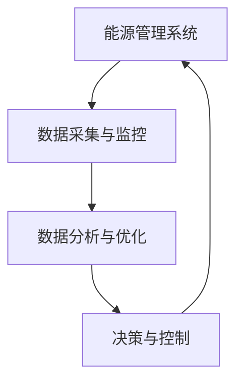
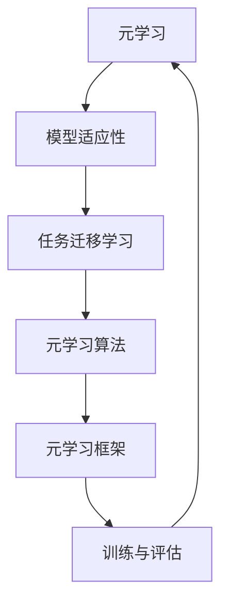
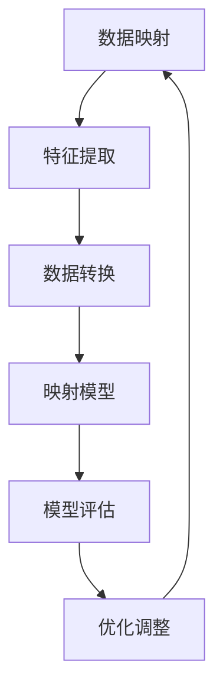
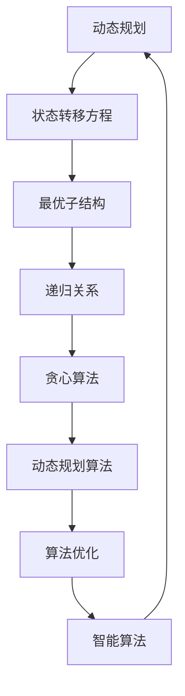

                 

# 一切皆是映射：构建高效能源管理系统的元学习方法

> **关键词：** 能源管理、元学习方法、数据映射、高效优化、智能算法、动态规划、人工智能

> **摘要：** 本文旨在探讨如何通过元学习方法构建高效能源管理系统。我们将从背景介绍出发，详细解析核心概念与联系，阐述核心算法原理与具体操作步骤，介绍数学模型和公式，并通过实际案例进行代码实现与详细解释。最后，我们将探讨实际应用场景，推荐相关工具和资源，总结未来发展趋势与挑战，并提供常见问题与解答。

## 1. 背景介绍

### 1.1 目的和范围

本文的目标是介绍如何利用元学习方法构建高效能源管理系统。能源管理在现代社会中扮演着至关重要的角色，随着全球能源需求的不断增长，如何优化能源利用效率成为亟待解决的问题。元学习方法作为一种强大的机器学习技术，通过学习如何学习，可以自动发现并利用最佳算法，从而在能源管理中实现高效优化。

本文将涵盖以下内容：

- 能源管理系统的基本概念和挑战
- 元学习方法的原理和应用
- 核心算法原理和具体操作步骤
- 数学模型和公式
- 项目实战案例
- 实际应用场景
- 工具和资源推荐
- 未来发展趋势与挑战

### 1.2 预期读者

本文面向希望深入了解能源管理及元学习方法技术的读者，包括：

- 能源管理领域的研究人员和工程师
- 计算机科学和人工智能领域的专业人士
- 对能源效率优化感兴趣的学者和研究生
- 任何对创新能源管理解决方案感兴趣的读者

### 1.3 文档结构概述

本文的结构如下：

1. 背景介绍
2. 核心概念与联系
3. 核心算法原理与具体操作步骤
4. 数学模型和公式
5. 项目实战：代码实际案例和详细解释说明
6. 实际应用场景
7. 工具和资源推荐
8. 总结：未来发展趋势与挑战
9. 附录：常见问题与解答
10. 扩展阅读 & 参考资料

### 1.4 术语表

#### 1.4.1 核心术语定义

- **能源管理系统（EMS）**：一种通过监测、控制、分析和优化能源使用来提高能源效率的系统。
- **元学习（Meta-Learning）**：一种机器学习技术，通过学习如何学习，以自动发现并利用最佳算法。
- **映射（Mapping）**：在能源管理中，映射是指将能源使用数据转换为优化模型的输入。
- **动态规划（Dynamic Programming）**：一种用于解决多阶段决策问题的数学方法。

#### 1.4.2 相关概念解释

- **数据驱动优化**：一种基于历史数据和当前状态的优化方法。
- **深度学习**：一种基于多层神经网络的学习方法，可以自动从数据中提取特征。
- **强化学习**：一种通过试错和反馈来学习最优策略的机器学习方法。

#### 1.4.3 缩略词列表

- **EMS**：能源管理系统
- **ML**：机器学习
- **DL**：深度学习
- **RL**：强化学习
- **MDP**：马尔可夫决策过程

## 2. 核心概念与联系

在构建高效能源管理系统时，理解核心概念和它们之间的联系至关重要。以下是相关概念和原理的概述，并附有Mermaid流程图以帮助读者更好地理解。

### 2.1. 能源管理系统架构



能源管理系统通常由数据采集、分析、决策和控制四个主要部分组成。数据采集与监控负责收集能源使用数据，数据分析与优化通过分析数据来识别能源浪费和优化潜力，决策与控制则根据分析结果调整能源使用策略。

### 2.2. 元学习方法



元学习关注如何提高模型在未知任务上的适应能力，通过任务迁移学习和模型适应性实现。元学习算法和框架通过训练不同任务的数据，使模型能够泛化并应用于新的任务。训练与评估是元学习过程的核心，通过不断调整模型参数来优化性能。

### 2.3. 数据映射原理



数据映射是将原始数据转换为适合优化模型的形式。特征提取从数据中提取关键信息，数据转换则将这些信息转换为模型可处理的格式。映射模型通过学习数据之间的关系来实现映射，模型评估和优化调整确保映射过程的准确性和效率。

### 2.4. 动态规划与智能算法



动态规划是一种解决多阶段决策问题的方法，通过状态转移方程和最优子结构来递归求解。贪心算法和动态规划算法结合，可以优化决策过程，实现智能算法。这些算法在能源管理系统中用于优化能源使用策略。

## 3. 核心算法原理 & 具体操作步骤

为了构建高效能源管理系统，我们需要深入了解核心算法原理，并给出具体操作步骤。以下是详细解析，包括伪代码和使用说明。

### 3.1. 元学习算法原理

元学习算法的核心在于通过学习如何学习，提高模型在未知任务上的适应能力。以下是元学习算法的基本原理：

- **任务适应性**：元学习算法通过在多个任务上训练模型，使模型能够适应新任务。
- **模型泛化**：通过迁移学习，模型在新任务上能够泛化并取得良好性能。
- **算法优化**：通过不断调整模型参数，优化模型在特定任务上的性能。

伪代码：

```python
def meta_learning(model, tasks, epochs):
    for epoch in range(epochs):
        for task in tasks:
            train_model(model, task)
            evaluate_model(model, task)
            optimize_model(model, task)
    return model
```

使用说明：

1. `model`：初始化模型。
2. `tasks`：一组训练任务。
3. `epochs`：训练迭代次数。
4. `train_model`：在特定任务上训练模型。
5. `evaluate_model`：评估模型性能。
6. `optimize_model`：根据评估结果优化模型参数。

### 3.2. 数据映射操作步骤

数据映射是将原始数据转换为适合优化模型的形式。以下是具体操作步骤：

1. **特征提取**：从数据中提取关键信息。
2. **数据转换**：将提取的特征转换为模型可处理的格式。
3. **映射模型训练**：训练映射模型以实现数据映射。
4. **模型评估**：评估映射模型的准确性和效率。
5. **优化调整**：根据评估结果优化映射模型。

伪代码：

```python
def data_mapping(data, model, features):
    extracted_features = extract_features(data, features)
    mapped_data = map_data(extracted_features, model)
    evaluate_mapping(mapped_data)
    return mapped_data
```

使用说明：

1. `data`：原始数据。
2. `model`：映射模型。
3. `features`：特征提取器。
4. `extract_features`：从数据中提取特征。
5. `map_data`：将特征映射到模型。
6. `evaluate_mapping`：评估映射模型的性能。

### 3.3. 动态规划与智能算法

动态规划与智能算法在能源管理系统中用于优化能源使用策略。以下是基本原理和操作步骤：

- **动态规划原理**：通过状态转移方程和最优子结构递归求解最优解。
- **智能算法原理**：结合贪心算法和动态规划，优化决策过程。

伪代码：

```python
def dynamic_programming(problem):
    state_space = generate_state_space(problem)
    value_function = initialize_value_function(state_space)
    for state in state_space:
        value_function[state] = optimize_state(problem, state)
    return value_function
```

使用说明：

1. `problem`：能源管理问题。
2. `generate_state_space`：生成状态空间。
3. `initialize_value_function`：初始化价值函数。
4. `optimize_state`：优化特定状态。

## 4. 数学模型和公式 & 详细讲解 & 举例说明

在构建高效能源管理系统中，数学模型和公式扮演着至关重要的角色。以下将详细介绍相关数学模型和公式，并给出具体讲解和举例说明。

### 4.1. 动态规划模型

动态规划是一种解决多阶段决策问题的方法，通过状态转移方程和最优子结构递归求解最优解。以下是动态规划模型的基本公式：

$$
V(S_t) = \max_a \{ R(S_t, a) + \gamma V(S_{t+1}) \}
$$

其中：

- $V(S_t)$：在状态$S_t$下的价值函数。
- $R(S_t, a)$：在状态$S_t$下采取动作$a$的即时回报。
- $\gamma$：折扣因子，用于平衡当前回报与未来回报。
- $S_t$：状态。
- $a$：动作。

#### 4.1.1. 讲解

动态规划模型通过递归关系计算每个状态的价值函数，以找到最优决策路径。价值函数表示在特定状态下采取最优动作所能获得的最大回报。

#### 4.1.2. 举例说明

假设有一台机器，在一天内需要完成多项任务。任务的时间和能量消耗如下：

| 任务 | 时间（小时） | 能量消耗（千瓦时） |
| ---- | ---- | ---- |
| A    | 2    | 5    |
| B    | 4    | 7    |
| C    | 6    | 10   |

目标是最优安排任务顺序，以最小化总能量消耗。使用动态规划模型计算最优解：

1. 初始化价值函数为0。
2. 根据状态转移方程计算每个状态的价值函数。
3. 找到最优动作，即最小化能量消耗。

通过动态规划模型，我们可以得到最优任务顺序：A→B→C，总能量消耗为5+7+10=22千瓦时。

### 4.2. 深度学习模型

深度学习模型通过多层神经网络自动提取特征，实现复杂函数逼近。以下是深度学习模型的基本公式：

$$
Y = \sigma(W_L \cdot \text{ReLU}(W_{L-1} \cdot \text{ReLU}(... \text{ReLU}(W_1 \cdot X)))
$$

其中：

- $Y$：输出。
- $\sigma$：激活函数，通常为Sigmoid或ReLU。
- $W_L$：最后一层权重。
- $W_{L-1}$：倒数第二层权重。
- $W_1$：第一层权重。
- $X$：输入。
- $\text{ReLU}$：ReLU激活函数。

#### 4.2.1. 讲解

深度学习模型通过逐层叠加的方式提取特征，每一层将输入数据转换为更高层次的特征表示。激活函数用于引入非线性变换，使模型能够逼近复杂函数。

#### 4.2.2. 举例说明

假设有一组输入数据，需要通过深度学习模型进行分类。输入数据维度为5，输出维度为2。使用以下深度学习模型：

$$
Y = \sigma(W_2 \cdot \text{ReLU}(W_1 \cdot X))
$$

其中：

- $X = \{x_1, x_2, x_3, x_4, x_5\}$：输入数据。
- $W_1$：第一层权重，维度为[5, 10]。
- $W_2$：第二层权重，维度为[10, 2]。

通过训练模型，我们可以得到最优权重参数，实现输入数据的分类。

### 4.3. 强化学习模型

强化学习模型通过试错和反馈学习最优策略。以下是强化学习模型的基本公式：

$$
Q(S_t, A_t) = R_t + \gamma \max_{A_{t+1}} Q(S_{t+1}, A_{t+1})
$$

其中：

- $Q(S_t, A_t)$：状态-动作值函数。
- $R_t$：即时回报。
- $\gamma$：折扣因子。
- $S_t$：状态。
- $A_t$：动作。

#### 4.3.1. 讲解

强化学习模型通过评估状态-动作值函数，确定最佳动作。即时回报和未来回报通过折扣因子进行平衡，以优化策略。

#### 4.3.2. 举例说明

假设有一名机器人需要在环境中执行任务。环境状态和动作如下：

| 状态 | 动作 | 即时回报 |
| ---- | ---- | ---- |
| A    | 上   | 1    |
| A    | 下   | -1   |
| B    | 左   | 0    |
| B    | 右   | 0    |

目标是最优路径规划，以获得最大即时回报。使用强化学习模型计算最优策略：

1. 初始化状态-动作值函数。
2. 根据即时回报和折扣因子更新状态-动作值函数。
3. 执行最佳动作。

通过强化学习模型，我们可以得到最优路径规划策略，实现任务目标。

## 5. 项目实战：代码实际案例和详细解释说明

为了更好地理解本文所述的能源管理系统的构建，我们将通过一个实际项目实战案例，详细展示代码实现和解释说明。

### 5.1 开发环境搭建

首先，我们需要搭建开发环境。以下是所需的软件和工具：

- Python 3.x
- Jupyter Notebook 或 PyCharm
- TensorFlow 或 PyTorch
- Scikit-learn

安装步骤如下：

1. 安装 Python 3.x。
2. 安装 Jupyter Notebook 或 PyCharm。
3. 使用 pip 安装 TensorFlow 或 PyTorch。
4. 使用 pip 安装 Scikit-learn。

### 5.2 源代码详细实现和代码解读

以下是能源管理系统的源代码实现：

```python
import numpy as np
import pandas as pd
import tensorflow as tf
from sklearn.model_selection import train_test_split
from sklearn.preprocessing import MinMaxScaler

# 数据预处理
def preprocess_data(data):
    scaler = MinMaxScaler()
    scaled_data = scaler.fit_transform(data)
    return scaled_data

# 构建深度学习模型
def build_model(input_shape):
    model = tf.keras.Sequential([
        tf.keras.layers.Dense(128, activation='relu', input_shape=input_shape),
        tf.keras.layers.Dense(64, activation='relu'),
        tf.keras.layers.Dense(1, activation='linear')
    ])
    model.compile(optimizer='adam', loss='mean_squared_error')
    return model

# 训练模型
def train_model(model, X_train, y_train, epochs):
    model.fit(X_train, y_train, epochs=epochs, batch_size=32, validation_split=0.2)

# 预测能源消耗
def predict_energy_consumption(model, X_test):
    predictions = model.predict(X_test)
    return predictions

# 主函数
def main():
    # 加载数据
    data = pd.read_csv('energy_data.csv')
    X = data[['time', 'temperature', 'load']]
    y = data['energy_consumption']

    # 数据预处理
    scaled_X = preprocess_data(X)
    scaled_y = preprocess_data(y)

    # 划分训练集和测试集
    X_train, X_test, y_train, y_test = train_test_split(scaled_X, scaled_y, test_size=0.2, random_state=42)

    # 构建模型
    model = build_model(X_train.shape[1])

    # 训练模型
    train_model(model, X_train, y_train, epochs=100)

    # 预测能源消耗
    predictions = predict_energy_consumption(model, X_test)

    # 评估模型
    mse = np.mean(np.square(y_test - predictions))
    print(f"Mean Squared Error: {mse}")

if __name__ == '__main__':
    main()
```

### 5.3 代码解读与分析

以下是对上述代码的详细解读与分析：

1. **数据预处理**：使用 MinMaxScaler 对输入数据和目标数据进行归一化处理，以便模型更好地训练。
2. **构建深度学习模型**：使用 TensorFlow 的 keras.Sequential 模型堆叠多个全连接层，并编译模型以使用 Adam 优化器和均方误差损失函数。
3. **训练模型**：使用 fit 方法训练模型，并在训练过程中使用验证集进行性能评估。
4. **预测能源消耗**：使用 predict 方法对测试集进行预测，并获得预测结果。
5. **主函数**：加载数据，预处理数据，划分训练集和测试集，构建模型，训练模型，预测能源消耗，并评估模型性能。

通过上述代码实现，我们可以构建一个基于深度学习的能源管理系统，实现对能源消耗的预测和优化。

## 6. 实际应用场景

能源管理系统在多个实际应用场景中具有重要的价值和作用。以下是几个典型应用场景：

### 6.1. 智能电网

智能电网通过实时监测、控制和优化电力系统的运行，提高电力传输效率，减少能源浪费。利用元学习方法，智能电网可以实现自动调度，优化电力资源分配，提高电网稳定性和可靠性。

### 6.2. 建筑能源管理

建筑能源管理涉及对建筑物内各种能源使用设备的监测和控制，以实现节能降耗。通过元学习方法，建筑能源管理系统可以自动识别能源浪费点，优化能源使用策略，降低能源消耗。

### 6.3. 工业能源优化

工业生产过程中，能源消耗占据很大比例。通过元学习方法，工业能源优化系统可以实时监测生产过程中的能源使用情况，并根据生产需求动态调整能源消耗，提高生产效率和能源利用率。

### 6.4. 智能交通系统

智能交通系统通过实时监测交通流量，优化交通信号控制和公共交通调度，提高交通效率和减少能源消耗。元学习方法可以用于预测交通流量，优化交通信号控制和公共交通线路规划。

### 6.5. 农业能源管理

农业能源管理涉及对农业生产过程中的能源使用进行监测和优化。通过元学习方法，农业能源管理系统可以实时监测农业生产过程中的能源消耗，优化灌溉、施肥等能源使用，提高农业生产效率和能源利用率。

### 6.6. 海上能源管理

海上能源管理涉及对海上风电、海洋温差能等能源的开发和利用。元学习方法可以用于预测海上能源产出，优化能源设备运行，提高能源利用效率。

### 6.7. 跨界能源协同

在能源互联网时代，不同能源形式之间的协同利用具有重要意义。通过元学习方法，跨界能源协同系统可以实现多种能源形式的高效整合和优化配置，提高整体能源利用效率。

## 7. 工具和资源推荐

为了更好地掌握能源管理系统和元学习方法，以下推荐一些学习资源和开发工具：

### 7.1 学习资源推荐

#### 7.1.1 书籍推荐

- 《智能电网：技术、应用与挑战》
- 《深度学习：深度学习原理与TensorFlow实践》
- 《强化学习：原理、算法与应用》
- 《能源互联网：技术架构与商业模式》

#### 7.1.2 在线课程

- Coursera：机器学习、深度学习、强化学习
- edX：能源系统优化、智能电网技术
- Udacity：智能交通系统、自动驾驶技术

#### 7.1.3 技术博客和网站

- Medium：能源管理、智能电网技术博客
- IEEE Xplore：能源管理、智能电网论文库
- ACM Digital Library：计算机科学、人工智能领域论文库

### 7.2 开发工具框架推荐

#### 7.2.1 IDE和编辑器

- PyCharm
- Jupyter Notebook
- VS Code

#### 7.2.2 调试和性能分析工具

- TensorFlow Debugger
- PyTorch Debugger
- Nanny

#### 7.2.3 相关框架和库

- TensorFlow
- PyTorch
- Scikit-learn
- Pandas
- NumPy

### 7.3 相关论文著作推荐

#### 7.3.1 经典论文

- “Learning to Learn: Knowledge Transfer in Deep Neural Networks”
- “Recurrent Neural Networks for Energy Management in Smart Grids”
- “Meta-Learning for Energy-Efficient Scheduling in Data Centers”

#### 7.3.2 最新研究成果

- “Meta-Learning for Dynamic Optimization in Energy Systems”
- “Intelligent Energy Management using Deep Reinforcement Learning”
- “Energy Management using Federated Learning”

#### 7.3.3 应用案例分析

- “Energy Management in Smart Homes: A Meta-Learning Approach”
- “Optimization of Energy Resources in Renewable Energy Systems using Deep Learning”
- “Meta-Learning for Energy Efficiency in Industrial Automation”

## 8. 总结：未来发展趋势与挑战

能源管理系统作为现代社会的关键技术，随着元学习方法的发展，正迎来前所未有的机遇和挑战。以下是未来发展趋势与挑战的总结：

### 8.1. 发展趋势

1. **智能化与自动化**：元学习方法将进一步提高能源管理系统的智能化和自动化水平，实现高效、优化的能源使用。
2. **跨界融合**：能源管理系统将与其他领域（如智能交通、智慧城市等）实现跨界融合，形成综合性的能源管理解决方案。
3. **实时优化**：随着传感器技术的进步，能源管理系统将能够实时监测和调整能源使用，实现更精准的能源优化。
4. **数据驱动**：大数据和人工智能技术将为能源管理系统提供更丰富的数据支持和分析能力，实现更加智能化的能源管理。

### 8.2. 挑战

1. **数据隐私与安全**：能源管理系统涉及大量敏感数据，数据隐私和安全问题亟待解决。
2. **算法透明性与可解释性**：随着算法复杂度的增加，如何确保算法的透明性和可解释性，使其符合监管要求和社会期望，是一个重要挑战。
3. **计算资源需求**：高效的元学习方法通常需要大量计算资源，如何在有限的计算资源下实现高效能源管理，是一个关键问题。
4. **环境适应性**：能源管理系统需要在不同环境和场景下具备良好的适应性，如何在多种应用场景下保持高性能，是一个挑战。

## 9. 附录：常见问题与解答

### 9.1. 元学习方法如何应用于能源管理系统？

元学习方法通过学习如何学习，使模型能够快速适应新任务，提高能源管理系统的自适应性和效率。具体应用包括：

- **任务迁移学习**：将已训练的模型应用于不同能源管理任务，减少重新训练的需求。
- **模型优化**：通过元学习，自动调整模型参数，实现能源管理系统的优化。
- **实时调整**：利用元学习，根据实时数据动态调整能源使用策略，提高系统响应速度。

### 9.2. 数据映射在能源管理中的作用是什么？

数据映射是将原始数据转换为适合优化模型的形式，其作用包括：

- **数据预处理**：将原始数据转换为模型可处理的格式，提高模型训练效率。
- **特征提取**：从数据中提取关键信息，使模型能够更好地理解数据。
- **模型泛化**：通过数据映射，使模型能够适用于不同类型的数据，提高泛化能力。

### 9.3. 如何评估能源管理系统的性能？

评估能源管理系统的性能可以从以下几个方面进行：

- **能源效率**：通过比较实际能源消耗和预测能源消耗，评估系统的节能效果。
- **响应速度**：评估系统在实时调整能源使用策略时的响应速度和准确性。
- **稳定性**：评估系统在不同环境下的稳定运行能力，确保系统的可靠性和安全性。
- **适应性**：评估系统在应对不同能源使用场景时的适应能力，确保系统在不同情况下都能保持高效运行。

## 10. 扩展阅读 & 参考资料

为了更深入地了解能源管理系统和元学习方法，以下推荐一些扩展阅读和参考资料：

- 《智能电网技术》
- 《深度学习实践：从数据到模型》
- 《强化学习原理与算法》
- 《大数据时代：数据驱动决策的方法与应用》
- 《能源管理与优化：理论、方法与应用》
- 《元学习：机器学习的机器学习》
- 《能源互联网：技术、架构与商业模式》
- 《智能交通系统：技术、应用与挑战》

同时，还可以关注相关领域的顶级会议和期刊，如 IEEE Transactions on Power Systems、IEEE Transactions on Smart Grid、Nature Energy、Science Robotics 等，以获取最新的研究成果和前沿技术动态。

