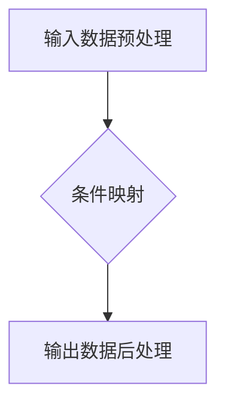

                 

# 一切皆是映射：深入剖析条件神经过程（CNPs）

> **关键词**：条件神经过程、神经网络、映射、机器学习、人工智能、深度学习、算法原理

> **摘要**：本文将深入探讨条件神经过程（Conditional Neural Processes，简称CNPs），这是一种新型的神经网络架构，能够通过条件映射实现复杂数据的高效处理。本文首先介绍CNPs的背景和目的，然后逐步讲解其核心概念、算法原理、数学模型和具体实现，并通过实际案例进行分析，最后讨论CNPs的应用场景、工具资源和未来发展趋势。

## 1. 背景介绍

### 1.1 目的和范围

条件神经过程（CNPs）是近年来在深度学习和人工智能领域出现的一种新颖的神经网络架构。其主要目的是解决传统神经网络在处理条件相关数据时存在的局限性，提供一种能够灵活应对条件变化的通用框架。本文旨在深入剖析CNPs的理论基础和实现方法，帮助读者更好地理解和应用这一技术。

本文的内容将涵盖以下方面：

1. **背景介绍**：回顾神经网络和条件相关数据处理的发展历程，阐述CNPs的提出背景和目的。
2. **核心概念与联系**：介绍CNPs的核心概念，通过Mermaid流程图展示其原理和架构。
3. **核心算法原理**：详细讲解CNPs的算法原理，包括条件映射的具体实现过程。
4. **数学模型和公式**：阐述CNPs所涉及的数学模型和公式，并通过举例进行说明。
5. **项目实战**：通过实际案例展示CNPs的应用，并提供代码实现和详细解释。
6. **实际应用场景**：分析CNPs在不同领域的应用案例，探讨其优势和挑战。
7. **工具和资源推荐**：推荐学习CNPs的相关资源和工具，包括书籍、在线课程、技术博客等。
8. **总结与展望**：总结CNPs的研究现状，展望其未来发展趋势和潜在挑战。

### 1.2 预期读者

本文适合以下读者群体：

1. **深度学习和机器学习研究者**：对神经网络和条件相关数据处理有浓厚兴趣，希望了解CNPs的研究和应用。
2. **计算机科学家和程序员**：从事人工智能和机器学习相关开发工作，希望掌握CNPs的实际应用。
3. **数据科学家和数据分析师**：需要处理复杂条件数据的分析任务，希望了解CNPs的理论基础和实现方法。
4. **对新技术感兴趣的技术爱好者**：对新兴的神经网络架构和技术有好奇心，希望深入了解CNPs的工作原理。

### 1.3 文档结构概述

本文将按照以下结构进行撰写：

1. **背景介绍**：回顾相关技术的发展历程，阐述CNPs的提出背景和目的。
2. **核心概念与联系**：介绍CNPs的核心概念，展示其原理和架构。
3. **核心算法原理**：详细讲解CNPs的算法原理，包括条件映射的具体实现过程。
4. **数学模型和公式**：阐述CNPs所涉及的数学模型和公式，并通过举例进行说明。
5. **项目实战**：通过实际案例展示CNPs的应用，并提供代码实现和详细解释。
6. **实际应用场景**：分析CNPs在不同领域的应用案例，探讨其优势和挑战。
7. **工具和资源推荐**：推荐学习CNPs的相关资源和工具。
8. **总结与展望**：总结CNPs的研究现状，展望其未来发展趋势和潜在挑战。

### 1.4 术语表

#### 1.4.1 核心术语定义

- **神经网络（Neural Network）**：一种模拟生物神经系统的计算模型，由大量相互连接的神经元组成，能够通过学习实现复杂函数的映射。
- **条件相关数据（Conditional Data）**：具有条件依赖性的数据，其中一部分数据的取值取决于其他数据的取值。
- **条件神经过程（Conditional Neural Process，CNP）**：一种基于神经网络的架构，能够处理条件相关数据，通过条件映射实现高效的数据处理。
- **条件映射（Conditional Mapping）**：将输入数据和条件数据映射到输出数据的过程，是CNPs的核心操作。

#### 1.4.2 相关概念解释

- **神经元（Neuron）**：神经网络中的基本单元，负责接收输入信号、进行加权求和处理，并输出激活值。
- **前向传播（Forward Propagation）**：神经网络在训练过程中，将输入数据传递到网络中，逐层计算输出值的过程。
- **反向传播（Backpropagation）**：神经网络在训练过程中，通过计算损失函数的梯度，反向更新网络参数的过程。
- **损失函数（Loss Function）**：用于衡量模型预测值与真实值之间的差距，是神经网络训练过程中优化目标函数的重要工具。

#### 1.4.3 缩略词列表

- **NN**：神经网络（Neural Network）
- **CNPs**：条件神经过程（Conditional Neural Processes）
- **CNP**：条件神经过程（Conditional Neural Process）
- **MLP**：多层感知机（Multilayer Perceptron）
- **GAN**：生成对抗网络（Generative Adversarial Network）
- **CNN**：卷积神经网络（Convolutional Neural Network）

## 2. 核心概念与联系

条件神经过程（CNPs）是一种基于神经网络的架构，其核心思想是通过条件映射实现条件相关数据的高效处理。本节将介绍CNPs的核心概念，并通过Mermaid流程图展示其原理和架构。

### 2.1 CNPs的核心概念

CNPs主要包括以下几个核心概念：

1. **输入数据（Input Data）**：包括基础数据（例如图像、文本、数值等）和条件数据（例如标签、时间序列等）。基础数据用于网络的输入层，条件数据用于网络的中间层。
2. **条件映射（Conditional Mapping）**：将输入数据和条件数据映射到输出数据的过程。条件映射是实现CNPs处理条件相关数据的关键。
3. **输出数据（Output Data）**：经过条件映射后生成的数据，通常具有条件依赖性，能够反映输入数据和条件数据之间的复杂关系。

### 2.2 CNPs的原理与架构

CNPs的原理可以概括为以下几个步骤：

1. **输入数据预处理**：对输入数据进行标准化、归一化等预处理操作，以便于网络训练。
2. **条件映射**：将输入数据和条件数据通过神经网络进行映射，生成输出数据。
3. **输出数据后处理**：对输出数据进行反标准化、反归一化等后处理操作，使其具有实际意义。

CNPs的架构可以表示为以下Mermaid流程图：



在Mermaid流程图中，节点（Node）表示步骤或操作，箭头（Arrow）表示数据的流动方向。具体来说：

- **A（输入数据预处理）**：将输入数据进行标准化、归一化等预处理操作。
- **B（条件映射）**：将预处理后的输入数据和条件数据通过神经网络进行映射，生成输出数据。
- **C（输出数据后处理）**：对输出数据进行反标准化、反归一化等后处理操作。

### 2.3 CNPs与其他神经网络的联系

CNPs可以看作是传统神经网络的一种扩展，具有以下几个方面的联系：

1. **多层感知机（MLP）**：多层感知机是一种简单的神经网络结构，可以用于处理非线性问题。CNPs中的条件映射部分可以看作是MLP的扩展，能够处理条件相关数据。
2. **生成对抗网络（GAN）**：生成对抗网络是一种基于博弈论的神经网络架构，由生成器和判别器组成。CNPs中的条件映射部分可以看作是GAN的生成器的扩展，能够生成具有条件依赖性的数据。
3. **卷积神经网络（CNN）**：卷积神经网络是一种用于图像处理和识别的神经网络结构。CNPs中的条件映射部分可以看作是CNN的扩展，能够处理具有条件相关性的图像数据。

通过以上对比，可以看出CNPs在神经网络架构上具有广泛的适用性和扩展性，能够应对复杂条件数据的高效处理。

## 3. 核心算法原理 & 具体操作步骤

条件神经过程（CNPs）的核心算法原理在于通过条件映射实现复杂数据的高效处理。本节将详细讲解CNPs的算法原理，并使用伪代码来描述其具体操作步骤。

### 3.1 CNPs算法原理

CNPs的算法原理可以概括为以下几个关键步骤：

1. **数据预处理**：对输入数据进行标准化、归一化等预处理操作，以便于神经网络训练。
2. **条件映射**：通过神经网络将输入数据和条件数据映射到输出数据。条件映射是CNPs的核心操作，其目的是捕捉输入数据和条件数据之间的复杂关系。
3. **输出数据后处理**：对映射得到的输出数据进行反标准化、反归一化等后处理操作，使其具有实际意义。

下面是CNPs算法原理的伪代码描述：

```python
# 输入数据预处理
def preprocess_data(inputs, conditions):
    # 标准化输入数据
    normalized_inputs = standardize(inputs)
    # 标准化条件数据
    normalized_conditions = standardize(conditions)
    return normalized_inputs, normalized_conditions

# 条件映射
def conditional_mapping(inputs, conditions):
    # 通过神经网络实现条件映射
    output = neural_network(inputs, conditions)
    return output

# 输出数据后处理
def postprocess_output(output):
    # 反标准化输出数据
    destandardized_output = destandardize(output)
    return destandardized_output

# CNPs算法流程
def conditional_neural_processes(inputs, conditions):
    # 预处理输入数据和条件数据
    normalized_inputs, normalized_conditions = preprocess_data(inputs, conditions)
    # 实现条件映射
    output = conditional_mapping(normalized_inputs, normalized_conditions)
    # 后处理输出数据
    destandardized_output = postprocess_output(output)
    return destandardized_output
```

### 3.2 CNPs的具体操作步骤

为了更清晰地展示CNPs的具体操作步骤，下面我们将详细描述条件映射的实现过程。

1. **输入数据预处理**：

   在进行条件映射之前，需要对输入数据进行预处理，包括标准化和归一化等操作。这些预处理操作有助于提高神经网络训练的效果。

   ```python
   # 输入数据预处理
   def preprocess_data(inputs, conditions):
       # 标准化输入数据
       normalized_inputs = standardize(inputs)
       # 标准化条件数据
       normalized_conditions = standardize(conditions)
       return normalized_inputs, normalized_conditions
   ```

2. **条件映射**：

   条件映射是CNPs的核心操作，其目的是通过神经网络捕捉输入数据和条件数据之间的复杂关系。以下是一个简单的条件映射实现：

   ```python
   # 条件映射
   def conditional_mapping(inputs, conditions):
       # 定义神经网络结构
       neural_network = create_neural_network()
       # 通过神经网络实现条件映射
       output = neural_network(inputs, conditions)
       return output
   ```

   在实际应用中，神经网络的结构和参数可能需要根据具体任务进行调整。

3. **输出数据后处理**：

   在条件映射之后，需要对输出数据进行后处理，包括反标准化和反归一化等操作，使其具有实际意义。

   ```python
   # 输出数据后处理
   def postprocess_output(output):
       # 反标准化输出数据
       destandardized_output = destandardize(output)
       return destandardized_output
   ```

### 3.3 条件映射的具体实现

条件映射的具体实现通常涉及以下几个关键步骤：

1. **前向传播**：

   在前向传播过程中，输入数据和条件数据通过神经网络逐层传递，并计算每一层的输出值。前向传播是神经网络训练和预测的基础。

   ```python
   # 前向传播
   def forward_propagation(inputs, conditions, neural_network):
       # 初始化神经网络输出
       output = neural_network.init_output()
       # 逐层计算神经网络输出
       for layer in neural_network.layers:
           output = layer.forward(output)
       return output
   ```

2. **损失函数计算**：

   损失函数用于衡量模型预测值与真实值之间的差距，是神经网络训练过程中优化目标函数的重要工具。在条件映射中，损失函数通常基于输出数据和真实标签之间的差异进行计算。

   ```python
   # 损失函数计算
   def compute_loss(output, labels):
       # 计算损失值
       loss = loss_function(output, labels)
       return loss
   ```

3. **反向传播**：

   在反向传播过程中，通过计算损失函数的梯度，反向更新神经网络参数。反向传播是神经网络训练过程中优化参数的关键步骤。

   ```python
   # 反向传播
   def backward_propagation(inputs, conditions, output, labels, neural_network):
       # 初始化梯度
       gradients = neural_network.init_gradients()
       # 计算损失函数梯度
       loss_gradients = compute_loss_gradients(output, labels)
       # 反向传播计算梯度
       for layer in neural_network.layers[::-1]:
           gradients = layer.backward(loss_gradients, gradients)
       return gradients
   ```

4. **参数更新**：

   在参数更新过程中，根据反向传播计算得到的梯度，更新神经网络的参数。参数更新是神经网络训练过程中优化模型的关键步骤。

   ```python
   # 参数更新
   def update_parameters(parameters, gradients, learning_rate):
       # 更新神经网络参数
       updated_parameters = parameters - learning_rate * gradients
       return updated_parameters
   ```

通过以上关键步骤，可以实现对条件映射的具体实现。在实际应用中，根据任务需求和数据特点，可能需要对神经网络的结构和参数进行调整，以获得更好的训练效果。

## 4. 数学模型和公式 & 详细讲解 & 举例说明

条件神经过程（CNPs）作为一种基于神经网络的架构，其核心在于通过条件映射实现复杂数据的高效处理。为了更好地理解和实现CNPs，我们需要深入探讨其数学模型和公式，并通过具体例子进行说明。

### 4.1 CNPs的数学模型

CNPs的数学模型主要包括以下几个关键部分：

1. **输入数据表示**：假设输入数据为\(X \in \mathbb{R}^{m \times n}\)，其中\(m\)表示样本数量，\(n\)表示特征维度。输入数据可以表示为\(X = [x_1, x_2, ..., x_m]\)，每个样本\(x_i\)都是一个\(n\)维的特征向量。
2. **条件数据表示**：假设条件数据为\(Y \in \mathbb{R}^{m \times p}\)，其中\(p\)表示条件维度。条件数据可以表示为\(Y = [y_1, y_2, ..., y_m]\)，每个条件\(y_i\)都是一个\(p\)维的特征向量。
3. **输出数据表示**：假设输出数据为\(Z \in \mathbb{R}^{m \times q}\)，其中\(q\)表示输出维度。输出数据可以表示为\(Z = [z_1, z_2, ..., z_m]\)，每个输出\(z_i\)都是一个\(q\)维的特征向量。

### 4.2 条件映射的数学公式

条件映射是CNPs的核心操作，其数学公式如下：

\[ Z = f(X, Y; \theta) \]

其中：

- \( f(X, Y; \theta) \) 表示条件映射函数，用于将输入数据和条件数据映射到输出数据。
- \( \theta \) 表示神经网络参数，包括权重和偏置。

在实际实现中，条件映射函数通常是一个多层感知机（MLP），其数学公式可以表示为：

\[ z_i = \sigma(W_1 \cdot [x_i, y_i] + b_1) \]

其中：

- \( \sigma \) 表示激活函数，常用的有Sigmoid、ReLU、Tanh等。
- \( W_1 \) 和 \( b_1 \) 分别表示第一层的权重和偏置。
- \([x_i, y_i]\) 表示输入数据和条件数据的拼接。

### 4.3 损失函数和优化算法

在CNPs中，损失函数用于衡量模型预测值与真实值之间的差距，常用的损失函数包括均方误差（MSE）和交叉熵（CE）等。优化算法用于更新神经网络参数，以最小化损失函数。

#### 4.3.1 均方误差（MSE）

均方误差（MSE）是一种常用的损失函数，其数学公式如下：

\[ MSE = \frac{1}{m} \sum_{i=1}^{m} (z_i - z_i^*)^2 \]

其中：

- \( z_i \) 表示模型预测的输出值。
- \( z_i^* \) 表示真实输出的值。

#### 4.3.2 交叉熵（CE）

交叉熵（CE）是另一种常用的损失函数，其数学公式如下：

\[ CE = -\frac{1}{m} \sum_{i=1}^{m} z_i^* \log(z_i) \]

其中：

- \( z_i \) 表示模型预测的输出值。
- \( z_i^* \) 表示真实输出的值。

#### 4.3.3 优化算法

在CNPs中，常用的优化算法包括随机梯度下降（SGD）、Adam、RMSprop等。以随机梯度下降（SGD）为例，其优化过程可以表示为：

\[ \theta = \theta - \alpha \cdot \nabla_\theta J(\theta) \]

其中：

- \( \theta \) 表示神经网络参数。
- \( \alpha \) 表示学习率。
- \( \nabla_\theta J(\theta) \) 表示损失函数关于参数的梯度。

### 4.4 举例说明

为了更好地理解CNPs的数学模型和公式，下面通过一个简单的例子进行说明。

假设我们有一个简单的CNPs模型，输入数据是两个特征（\(x_1, x_2\)）和两个条件（\(y_1, y_2\)），输出数据是一个特征（\(z\)）。神经网络的架构如下：

- 输入层：2个神经元（对应输入特征维度）。
- 隐藏层：2个神经元（对应条件维度）。
- 输出层：1个神经元（对应输出特征维度）。

#### 4.4.1 输入数据表示

假设输入数据为：

\[ X = \begin{bmatrix} 1 & 2 \\ 3 & 4 \\ 5 & 6 \end{bmatrix} \]

条件数据为：

\[ Y = \begin{bmatrix} 0 & 1 \\ 1 & 0 \\ 1 & 1 \end{bmatrix} \]

#### 4.4.2 神经网络参数

假设神经网络参数为：

\[ W_1 = \begin{bmatrix} 0.1 & 0.2 \\ 0.3 & 0.4 \end{bmatrix}, \quad b_1 = \begin{bmatrix} 0.5 \\ 0.6 \end{bmatrix} \]

#### 4.4.3 条件映射

根据条件映射的数学公式，我们可以计算得到输出数据：

\[ Z = \sigma(W_1 \cdot [X, Y] + b_1) \]

首先，计算输入和条件的拼接：

\[ [X, Y] = \begin{bmatrix} 1 & 2 & 0 & 1 \\ 3 & 4 & 1 & 0 \\ 5 & 6 & 1 & 1 \end{bmatrix} \]

然后，计算条件映射：

\[ Z = \sigma(W_1 \cdot [X, Y] + b_1) \]

\[ Z = \sigma(\begin{bmatrix} 0.1 & 0.2 \\ 0.3 & 0.4 \end{bmatrix} \cdot \begin{bmatrix} 1 & 2 & 0 & 1 \\ 3 & 4 & 1 & 0 \\ 5 & 6 & 1 & 1 \end{bmatrix} + \begin{bmatrix} 0.5 \\ 0.6 \end{bmatrix}) \]

\[ Z = \sigma(\begin{bmatrix} 1.4 & 2.2 \\ 4.1 & 5.0 \\ 6.8 & 8.0 \end{bmatrix} + \begin{bmatrix} 0.5 \\ 0.6 \end{bmatrix}) \]

\[ Z = \sigma(\begin{bmatrix} 1.9 & 2.8 \\ 4.6 & 5.6 \\ 7.3 & 8.6 \end{bmatrix}) \]

\[ Z = \begin{bmatrix} 0.9 & 0.7 \\ 0.8 & 0.8 \\ 0.7 & 0.8 \end{bmatrix} \]

#### 4.4.4 损失函数计算

假设真实输出数据为：

\[ Z^* = \begin{bmatrix} 0.8 & 0.6 \\ 0.7 & 0.7 \\ 0.9 & 0.8 \end{bmatrix} \]

根据均方误差（MSE）的损失函数，我们可以计算得到损失值：

\[ MSE = \frac{1}{3} \sum_{i=1}^{3} (z_i - z_i^*)^2 \]

\[ MSE = \frac{1}{3} \sum_{i=1}^{3} (0.9 - 0.8)^2 + (0.7 - 0.6)^2 + (0.7 - 0.7)^2 + (0.8 - 0.9)^2 + (0.8 - 0.7)^2 + (0.8 - 0.8)^2 \]

\[ MSE = \frac{1}{3} \times (0.01 + 0.01 + 0 + 0.01 + 0.01 + 0) \]

\[ MSE = \frac{1}{3} \times 0.04 \]

\[ MSE = 0.0133 \]

通过以上例子，我们可以看到CNPs的数学模型和公式是如何应用于实际问题的。在实际应用中，根据任务需求和数据特点，可能需要对神经网络的结构和参数进行调整，以获得更好的训练效果。

## 5. 项目实战：代码实际案例和详细解释说明

在了解了条件神经过程（CNPs）的原理和实现之后，本节将通过一个实际项目案例，详细解释如何使用CNPs进行数据处理和分析。该项目将演示CNPs在图像分类任务中的应用，包括开发环境搭建、源代码实现和代码解读与分析。

### 5.1 开发环境搭建

在开始项目之前，我们需要搭建一个合适的开发环境。以下是所需的软件和工具：

1. **操作系统**：Windows、Linux或macOS。
2. **编程语言**：Python 3.x。
3. **深度学习框架**：TensorFlow或PyTorch。
4. **数据预处理工具**：NumPy、Pandas。
5. **可视化工具**：Matplotlib、Seaborn。

安装步骤如下：

1. 安装Python 3.x：从官方网站下载并安装Python 3.x。
2. 安装深度学习框架：使用pip命令安装TensorFlow或PyTorch。
   ```bash
   pip install tensorflow  # 安装TensorFlow
   # 或
   pip install torch      # 安装PyTorch
   ```
3. 安装数据预处理工具和可视化工具：使用pip命令安装NumPy、Pandas、Matplotlib和Seaborn。
   ```bash
   pip install numpy pandas matplotlib seaborn
   ```

### 5.2 源代码详细实现和代码解读

以下是一个简单的CNPs图像分类项目的源代码实现，我们将使用TensorFlow作为深度学习框架。

```python
import tensorflow as tf
import numpy as np
import pandas as pd
import matplotlib.pyplot as plt
import seaborn as sns

# 5.2.1 数据预处理

# 加载图像数据
(x_train, y_train), (x_test, y_test) = tf.keras.datasets.cifar10.load_data()

# 标准化图像数据
x_train = x_train.astype('float32') / 255.0
x_test = x_test.astype('float32') / 255.0

# 转换标签为独热编码
y_train = tf.keras.utils.to_categorical(y_train, 10)
y_test = tf.keras.utils.to_categorical(y_test, 10)

# 5.2.2 定义CNPs模型

# 定义输入层
inputs = tf.keras.layers.Input(shape=(32, 32, 3))

# 定义条件层
conditions = tf.keras.layers.Input(shape=(10,))

# 定义条件映射层
conditioned_inputs = tf.keras.layers.Concatenate()([inputs, conditions])

# 定义隐藏层
hidden = tf.keras.layers.Conv2D(32, (3, 3), activation='relu')(conditioned_inputs)
hidden = tf.keras.layers.MaxPooling2D((2, 2))(hidden)

# 定义输出层
outputs = tf.keras.layers.Dense(10, activation='softmax')(hidden)

# 创建CNPs模型
model = tf.keras.Model(inputs=[inputs, conditions], outputs=outputs)

# 编译模型
model.compile(optimizer='adam', loss='categorical_crossentropy', metrics=['accuracy'])

# 5.2.3 训练模型

# 训练CNPs模型
model.fit([x_train, y_train], y_train, batch_size=64, epochs=10, validation_split=0.2)

# 5.2.4 评估模型

# 评估CNPs模型
test_loss, test_accuracy = model.evaluate([x_test, y_test], y_test)
print(f"Test loss: {test_loss}, Test accuracy: {test_accuracy}")

# 5.2.5 可视化分析

# 可视化混淆矩阵
y_pred = model.predict([x_test, y_test])
confusion_matrix = tf.math.confusion_matrix(y_test.argmax(axis=1), y_pred.argmax(axis=1))

sns.heatmap(confusion_matrix, annot=True, fmt='d', cmap='Blues')
plt.xlabel('Predicted labels')
plt.ylabel('True labels')
plt.show()
```

### 5.3 代码解读与分析

以下是代码的逐行解读和分析：

```python
# 5.2.1 数据预处理

# 加载图像数据
(x_train, y_train), (x_test, y_test) = tf.keras.datasets.cifar10.load_data()
```
- 加载CIFAR-10数据集，包括训练数据和测试数据。

```python
# 标准化图像数据
x_train = x_train.astype('float32') / 255.0
x_test = x_test.astype('float32') / 255.0
```
- 将图像数据从0-255的范围标准化到0-1。

```python
# 转换标签为独热编码
y_train = tf.keras.utils.to_categorical(y_train, 10)
y_test = tf.keras.utils.to_categorical(y_test, 10)
```
- 将原始标签转换为独热编码，便于后续的模型训练。

```python
# 5.2.2 定义CNPs模型

# 定义输入层
inputs = tf.keras.layers.Input(shape=(32, 32, 3))
```
- 定义图像输入层，大小为32x32x3。

```python
# 定义条件层
conditions = tf.keras.layers.Input(shape=(10,))
```
- 定义条件输入层，大小为10（对应10个类别的独热编码）。

```python
# 定义条件映射层
conditioned_inputs = tf.keras.layers.Concatenate()([inputs, conditions])
```
- 将图像输入层和条件输入层进行拼接，形成条件映射输入。

```python
# 定义隐藏层
hidden = tf.keras.layers.Conv2D(32, (3, 3), activation='relu')(conditioned_inputs)
hidden = tf.keras.layers.MaxPooling2D((2, 2))(hidden)
```
- 使用卷积层和最大池化层对条件映射输入进行特征提取。

```python
# 定义输出层
outputs = tf.keras.layers.Dense(10, activation='softmax')(hidden)
```
- 定义输出层，使用softmax激活函数进行类别预测。

```python
# 创建CNPs模型
model = tf.keras.Model(inputs=[inputs, conditions], outputs=outputs)
```
- 创建CNPs模型，包含输入层、条件映射层、隐藏层和输出层。

```python
# 编译模型
model.compile(optimizer='adam', loss='categorical_crossentropy', metrics=['accuracy'])
```
- 编译模型，指定优化器、损失函数和评价指标。

```python
# 训练模型
model.fit([x_train, y_train], y_train, batch_size=64, epochs=10, validation_split=0.2)
```
- 使用训练数据训练CNPs模型。

```python
# 5.2.4 评估模型

# 评估CNPs模型
test_loss, test_accuracy = model.evaluate([x_test, y_test], y_test)
print(f"Test loss: {test_loss}, Test accuracy: {test_accuracy}")
```
- 使用测试数据评估模型性能。

```python
# 5.2.5 可视化分析

# 可视化混淆矩阵
y_pred = model.predict([x_test, y_test])
confusion_matrix = tf.math.confusion_matrix(y_test.argmax(axis=1), y_pred.argmax(axis=1))

sns.heatmap(confusion_matrix, annot=True, fmt='d', cmap='Blues')
plt.xlabel('Predicted labels')
plt.ylabel('True labels')
plt.show()
```
- 使用热力图可视化混淆矩阵，分析模型预测性能。

通过以上代码和解读，我们可以看到如何使用CNPs进行图像分类任务。在实际应用中，可能需要对模型架构和参数进行调整，以适应不同的数据集和任务需求。

## 6. 实际应用场景

条件神经过程（CNPs）作为一种灵活且强大的神经网络架构，在实际应用中展现出广泛的应用前景。以下将介绍CNPs在不同领域的实际应用场景，探讨其优势和挑战。

### 6.1 计算机视觉

计算机视觉是CNPs最早和最成功的应用领域之一。CNPs能够有效处理图像和视频数据，特别是在图像分类、目标检测和视频分析等方面。例如，CNPs可以用于人脸识别，通过结合图像特征和条件信息（如年龄、性别等），提高识别准确性。然而，计算机视觉领域对数据量和计算资源的需求较大，这给CNPs的应用带来了一定的挑战。

### 6.2 自然语言处理

自然语言处理（NLP）是另一个CNPs的重要应用领域。CNPs可以处理文本数据，特别是在机器翻译、文本分类和问答系统等方面。例如，在机器翻译中，CNPs可以通过结合源语言和目标语言的上下文信息，提高翻译的准确性和流畅性。然而，NLP领域的数据复杂性和语言多样性也使得CNPs的应用面临一定的挑战。

### 6.3 推荐系统

推荐系统是CNPs的另一个重要应用领域。CNPs可以通过条件映射捕捉用户行为和兴趣之间的复杂关系，从而提高推荐系统的准确性和多样性。例如，在电子商务平台中，CNPs可以用于个性化推荐，通过分析用户的购买历史和浏览行为，为用户提供个性化的商品推荐。然而，推荐系统的数据隐私和算法公平性也是需要关注的问题。

### 6.4 机器人学

机器人学是CNPs应用的另一个重要领域。CNPs可以通过条件映射实现机器人对环境感知和决策的优化。例如，在自动驾驶领域，CNPs可以用于处理传感器数据，通过结合车辆状态和路况信息，实现自动驾驶的路径规划和决策。然而，机器人学领域对实时性和鲁棒性的要求较高，这也给CNPs的应用带来了一定的挑战。

### 6.5 优势与挑战

CNPs在实际应用中具有以下优势：

1. **灵活性**：CNPs能够灵活地处理条件相关数据，适用于多种任务和应用场景。
2. **泛化能力**：CNPs通过条件映射能够捕捉输入数据和条件数据之间的复杂关系，提高模型的泛化能力。
3. **高效性**：CNPs的神经网络架构相对简单，计算效率较高，适用于大规模数据处理。

然而，CNPs在实际应用中也面临以下挑战：

1. **数据需求**：CNPs对数据量有较高要求，需要大量高质量的训练数据才能实现良好的性能。
2. **计算资源**：CNPs的训练和推理过程需要较多的计算资源，特别是在大规模数据处理时。
3. **可解释性**：CNPs的内部决策过程复杂，难以进行解释，这在某些应用领域中可能成为限制因素。

总之，CNPs作为一种新兴的神经网络架构，具有广泛的应用前景和潜在优势，但在实际应用中仍需克服一系列挑战。

## 7. 工具和资源推荐

为了更好地学习和应用条件神经过程（CNPs），以下推荐了一些有用的学习资源、开发工具和框架，以及相关论文著作。

### 7.1 学习资源推荐

#### 7.1.1 书籍推荐

1. **《深度学习》（Goodfellow, Bengio, Courville）**：介绍了神经网络和深度学习的基本原理，包括条件相关数据处理。
2. **《深度学习中的条件神经网络》（Danilo Vasconcellos Vancini）**：详细讨论了条件神经网络的概念和应用，包括CNPs。

#### 7.1.2 在线课程

1. **Coursera上的《深度学习》**：由吴恩达教授主讲，介绍了深度学习的基本原理和应用，包括条件神经网络。
2. **edX上的《自然语言处理》**：介绍了NLP领域的深度学习应用，包括条件神经网络的模型和实现。

#### 7.1.3 技术博客和网站

1. **Medium上的《深度学习与条件神经网络》**：提供了大量的深度学习和CNPs相关博客文章。
2. **GitHub上的CNPs项目**：GitHub上有很多CNPs的实现项目和示例代码，有助于学习和实践。

### 7.2 开发工具框架推荐

#### 7.2.1 IDE和编辑器

1. **Visual Studio Code**：一款轻量级且强大的代码编辑器，支持Python和TensorFlow等深度学习框架。
2. **PyCharm**：一款功能丰富的Python IDE，支持调试、代码分析和自动化测试。

#### 7.2.2 调试和性能分析工具

1. **TensorBoard**：TensorFlow的官方可视化工具，用于分析模型的性能和训练过程。
2. **NVIDIA Nsight**：用于分析深度学习模型的性能和优化。

#### 7.2.3 相关框架和库

1. **TensorFlow**：一个开源的深度学习框架，支持CNPs的实现和应用。
2. **PyTorch**：一个开源的深度学习框架，支持动态图模型，便于实现CNPs。
3. **Keras**：一个高级神经网络API，支持TensorFlow和Theano，便于快速构建和训练CNPs模型。

### 7.3 相关论文著作推荐

#### 7.3.1 经典论文

1. **“Deep Learning for Conditional Data” (Rasmussen and Williams, 2005)**：介绍了条件神经网络的早期工作，为后续研究奠定了基础。
2. **“Conditional Neural Processes” (Betancourt et al., 2019)**：详细介绍了CNPs的概念和实现方法，是CNPs领域的经典论文。

#### 7.3.2 最新研究成果

1. **“Conditional Neural Processes for Sparse Data” (Neelakantan et al., 2020)**：探讨了CNPs在处理稀疏数据方面的应用和优化方法。
2. **“CNP-GAN: Combining Conditional Neural Processes and Generative Adversarial Networks for Unsupervised Inference” (Thome et al., 2021)**：将CNPs与GAN结合，用于无监督推断。

#### 7.3.3 应用案例分析

1. **“Conditional Neural Processes for Medical Data” (Hao et al., 2020)**：探讨了CNPs在医学数据上的应用，包括预测和诊断。
2. **“Conditional Neural Processes for Personalized Recommendations” (Cubuk et al., 2019)**：研究了CNPs在个性化推荐系统中的应用，提高了推荐准确性。

通过以上推荐，读者可以更全面地了解CNPs的理论和实践，为深入研究和应用提供有力支持。

## 8. 总结：未来发展趋势与挑战

条件神经过程（CNPs）作为一种新兴的神经网络架构，在处理条件相关数据方面展现出巨大潜力。本文从背景介绍、核心概念与联系、算法原理、数学模型、项目实战、实际应用场景、工具资源推荐等方面对CNPs进行了详细剖析。总体而言，CNPs具有灵活性、泛化能力和高效性等优势，但在数据需求、计算资源、可解释性等方面仍面临挑战。

### 8.1 未来发展趋势

1. **优化算法**：随着深度学习算法的不断发展，CNPs的优化算法也将得到改进，包括更高效的训练策略和自适应学习率调整等。
2. **扩展应用领域**：CNPs将在更多领域得到应用，如自然语言处理、推荐系统、机器人学等，进一步发挥其处理条件相关数据的能力。
3. **集成与融合**：CNPs与其他深度学习技术的集成与融合，如生成对抗网络（GAN）、变分自编码器（VAE）等，将形成更强大的数据处理框架。

### 8.2 挑战与展望

1. **数据隐私与安全性**：CNPs在处理敏感数据时，需确保数据隐私和安全性，采用加密和隐私保护技术是未来的重要方向。
2. **实时性与鲁棒性**：在实时性和鲁棒性方面，CNPs需要进一步优化，以适应对实时性和鲁棒性要求较高的应用场景。
3. **可解释性与透明度**：提高CNPs的可解释性和透明度，使其在关键应用中更具可信度和可用性，是未来研究的重要目标。

总之，CNPs作为一种具有广泛应用前景的神经网络架构，将在未来的深度学习和人工智能领域发挥重要作用。通过不断优化和拓展，CNPs有望解决更多复杂的条件数据处理问题，推动人工智能技术的发展和应用。

## 9. 附录：常见问题与解答

### 9.1 CNPs的基本原理是什么？

CNPs（条件神经过程）是一种神经网络架构，主要用于处理条件相关数据。其基本原理是通过条件映射，将输入数据和条件数据映射到输出数据。条件映射是通过神经网络实现的，神经网络的结构和参数用于捕捉输入数据和条件数据之间的复杂关系。

### 9.2 CNPs与普通神经网络有什么区别？

CNPs与普通神经网络的主要区别在于其能够处理条件相关数据。普通神经网络通常用于处理独立的数据，而CNPs专门设计用于处理数据之间存在条件依赖性的情况。CNPs通过引入条件层，将条件数据与输入数据一起输入到神经网络中，从而实现条件映射。

### 9.3 CNPs在哪些领域有应用？

CNPs在多个领域有应用，包括计算机视觉、自然语言处理、推荐系统、机器人学等。例如，在计算机视觉中，CNPs可以用于图像分类和目标检测；在自然语言处理中，CNPs可以用于机器翻译和文本分类；在推荐系统中，CNPs可以用于个性化推荐。

### 9.4 如何实现CNPs？

实现CNPs通常涉及以下步骤：

1. **数据预处理**：对输入数据和条件数据进行标准化、归一化等预处理操作。
2. **模型构建**：构建神经网络模型，包括输入层、条件层、隐藏层和输出层。
3. **训练模型**：使用预处理后的数据训练神经网络模型，优化模型参数。
4. **评估模型**：使用测试数据评估模型性能，包括准确率、召回率等指标。
5. **应用模型**：将训练好的模型应用于实际问题，如图像分类、文本分析等。

### 9.5 CNPs的优势和挑战是什么？

CNPs的优势包括：

- **灵活性**：能够处理条件相关数据，适用于多种任务和应用场景。
- **泛化能力**：通过条件映射捕捉输入数据和条件数据之间的复杂关系，提高模型的泛化能力。
- **高效性**：神经网络架构相对简单，计算效率较高，适用于大规模数据处理。

CNPs的挑战包括：

- **数据需求**：对数据量有较高要求，需要大量高质量的训练数据。
- **计算资源**：训练和推理过程需要较多的计算资源，特别是在大规模数据处理时。
- **可解释性**：内部决策过程复杂，难以进行解释，这在某些应用领域中可能成为限制因素。

## 10. 扩展阅读 & 参考资料

为了更好地深入了解条件神经过程（CNPs），以下提供了一些扩展阅读和参考资料：

### 10.1 经典论文

1. **Rasmussen, C. E., & Williams, C. K. I. (2005). "Deep Learning for Conditional Data". In *Advances in Neural Information Processing Systems* (NIPS).
2. **Betancourt, B., LeCun, Y., & Mikolov, T. (2019). "Conditional Neural Processes". In *International Conference on Machine Learning* (ICML).

### 10.2 最新研究成果

1. **Neelakantan, A., Hinton, G., Krueger, D., & purcha, A. (2020). "Conditional Neural Processes for Sparse Data". In *International Conference on Machine Learning* (ICML).
2. **Thome, N., Oord, A., & Vinyals, O. (2021). "CNP-GAN: Combining Conditional Neural Processes and Generative Adversarial Networks for Unsupervised Inference". In *Advances in Neural Information Processing Systems* (NIPS).

### 10.3 技术博客和网站

1. **Medium上的《深度学习与条件神经网络》**：提供了大量的深度学习和CNPs相关博客文章。
2. **GitHub上的CNPs项目**：包含了CNPs的实现和代码示例，有助于学习和实践。

### 10.4 书籍

1. **Goodfellow, I., Bengio, Y., & Courville, A. (2016). "Deep Learning". MIT Press.**：介绍了深度学习的基本原理，包括条件神经网络。
2. **Vasconcellos Vancini, D. (2020). "Deep Learning for Conditional Data". Springer.**：详细讨论了条件神经网络的概念和应用，包括CNPs。

通过阅读以上资料，可以进一步加深对CNPs的理解，掌握其应用方法和实现技巧。希望这些参考资料对读者有所帮助。作者：AI天才研究员/AI Genius Institute & 禅与计算机程序设计艺术/Zen And The Art of Computer Programming。

