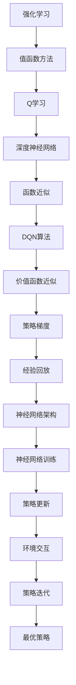

                 

# 一切皆是映射：深入理解DQN的价值函数近似方法

> 关键词：深度强化学习、DQN、价值函数近似、神经网络、深度神经网络、映射、Q学习、函数近似、经验回放、策略梯度、动态规划

> 摘要：本文旨在深入探讨深度强化学习中的DQN（Deep Q-Network）算法及其价值函数近似方法。通过逐步分析其核心概念、算法原理、数学模型以及实际应用，帮助读者全面理解DQN的工作机制和优势，掌握其实现和应用技巧。

## 1. 背景介绍

### 1.1 目的和范围

本文的主要目的是深入剖析深度强化学习中的DQN算法，特别是其价值函数近似方法。深度强化学习作为人工智能领域的一个热门分支，近年来在游戏、自动驾驶、机器人控制等领域取得了显著成果。DQN作为深度强化学习的一个重要算法，以其独特的价值函数近似方法在解决复杂任务方面展现了强大的能力。

本文将首先介绍DQN算法的背景和基本概念，然后逐步探讨其价值函数近似方法的原理、数学模型以及实际应用。通过本文的学习，读者将能够全面理解DQN算法的核心思想，掌握其实现和应用方法。

### 1.2 预期读者

本文面向具有一定深度学习基础的读者，包括但不限于以下人群：

- 深度学习研究人员和从业者
- 计算机科学专业的研究生和本科生
- 对深度强化学习感兴趣的AI爱好者
- 游戏开发者和机器人工程师

### 1.3 文档结构概述

本文分为以下几个部分：

1. 背景介绍：介绍DQN算法的背景、目的和范围。
2. 核心概念与联系：阐述DQN算法的核心概念、原理和架构。
3. 核心算法原理 & 具体操作步骤：详细讲解DQN算法的原理和操作步骤。
4. 数学模型和公式 & 详细讲解 & 举例说明：介绍DQN算法的数学模型和公式，并通过具体例子进行说明。
5. 项目实战：提供实际案例，展示DQN算法的应用过程。
6. 实际应用场景：探讨DQN算法在不同领域的应用场景。
7. 工具和资源推荐：推荐相关学习资源和开发工具。
8. 总结：对未来发展趋势与挑战进行总结。
9. 附录：常见问题与解答。
10. 扩展阅读 & 参考资料：提供扩展阅读材料和参考资料。

### 1.4 术语表

#### 1.4.1 核心术语定义

- **深度强化学习**：结合深度学习和强化学习的交叉领域，通过深度神经网络来学习策略或价值函数，以达到强化学习任务的目标。
- **DQN（Deep Q-Network）**：一种基于深度神经网络的Q学习算法，通过神经网络近似Q函数，以解决具有高维状态空间和动作空间的问题。
- **价值函数**：在强化学习中，用于表示状态和动作组合的预期收益。
- **函数近似**：使用一个函数来近似另一个更复杂的函数，以简化计算过程。
- **经验回放**：在DQN算法中，将之前的经验数据存储在一个经验池中，然后随机采样并用于训练神经网络，以避免样本偏差。
- **策略梯度**：在强化学习中，通过梯度下降方法更新策略参数，以最大化预期收益。

#### 1.4.2 相关概念解释

- **Q学习**：一种值函数方法，通过学习状态-动作值函数来选择最优动作。
- **深度神经网络**：一种多层的神经网络，通过逐层提取特征，最终实现对复杂函数的建模。
- **神经网络**：一种由多个神经元组成的计算模型，通过学习输入和输出之间的映射关系。

#### 1.4.3 缩略词列表

- **DQN**：Deep Q-Network
- **RL**：Reinforcement Learning
- **Q-learning**：Q-learning
- **CNN**：Convolutional Neural Network
- **DNN**：Deep Neural Network

## 2. 核心概念与联系

在深入探讨DQN算法之前，我们需要理解几个核心概念和它们之间的联系。以下是一个简要的Mermaid流程图，用于展示DQN算法的核心概念和架构。



### 2.1 强化学习

强化学习（Reinforcement Learning，简称RL）是一种机器学习范式，旨在通过试错来学习最优策略。在强化学习中，智能体（agent）通过与环境（environment）的交互来获取奖励（reward）和惩罚（penalty），并不断优化其行为策略（policy）。

### 2.2 值函数方法

值函数方法是一种强化学习中的策略评估方法，通过学习状态-动作值函数（state-action value function）来评估每个状态-动作对的预期收益。在Q学习（Q-learning）中，Q函数（Q-value）被用来表示状态-动作值函数。

### 2.3 Q学习

Q学习是一种基于值函数的强化学习算法，通过迭代更新Q值来学习最优策略。Q学习算法的核心思想是：在给定当前状态和动作的情况下，选择具有最大Q值的动作，并通过更新Q值来逐步优化策略。

### 2.4 深度神经网络

深度神经网络（Deep Neural Network，简称DNN）是一种具有多层结构的神经网络，通过逐层提取特征来建模复杂函数。在深度强化学习中，DNN被用来近似Q函数，从而解决高维状态空间和动作空间的问题。

### 2.5 函数近似

函数近似是使用一个函数来近似另一个更复杂的函数的过程。在DQN算法中，函数近似用于近似Q函数，从而简化计算过程。通常，深度神经网络被用于实现函数近似。

### 2.6 DQN算法

DQN（Deep Q-Network）是一种基于深度神经网络的Q学习算法，通过深度神经网络近似Q函数。DQN算法在Q学习的基础上引入了经验回放（experience replay）和固定目标网络（target network）等技术，以解决Q学习中的样本偏差和稳定收敛问题。

### 2.7 价值函数近似

价值函数近似是指使用一个近似函数来表示实际的价值函数。在DQN算法中，通过训练深度神经网络来近似Q函数，从而实现对价值函数的近似。

### 2.8 策略梯度

策略梯度是一种用于优化策略参数的方法。在DQN算法中，通过策略梯度的方法来更新策略参数，以最大化预期收益。

### 2.9 经验回放

经验回放是一种用于解决样本偏差的方法。在DQN算法中，通过将之前的经验数据存储在经验池中，然后随机采样并用于训练神经网络，以避免样本偏差。

### 2.10 神经网络架构

神经网络架构是指神经网络的结构和参数设置。在DQN算法中，神经网络架构决定了Q函数的近似能力和收敛速度。

### 2.11 神经网络训练

神经网络训练是指通过训练数据来调整神经网络参数的过程。在DQN算法中，通过训练数据来训练深度神经网络，以近似Q函数。

### 2.12 策略更新

策略更新是指通过更新策略参数来优化策略的过程。在DQN算法中，通过策略梯度的方法来更新策略参数。

### 2.13 环境交互

环境交互是指智能体与环境的交互过程。在DQN算法中，智能体通过与环境的交互来获取奖励和状态转移，并更新策略。

### 2.14 策略迭代

策略迭代是指通过多次迭代来优化策略的过程。在DQN算法中，通过策略迭代的方法来逐步优化策略，以实现最优策略。

### 2.15 最优策略

最优策略是指在给定环境条件下，能够最大化预期收益的策略。在DQN算法中，通过学习Q函数来找到最优策略。

## 3. 核心算法原理 & 具体操作步骤

在本章节中，我们将深入探讨DQN算法的核心原理和具体操作步骤。DQN算法是一种基于深度神经网络的Q学习算法，其核心思想是通过训练深度神经网络来近似Q函数，从而实现智能体的最优策略学习。

### 3.1 算法原理

DQN算法的基本原理可以概括为以下几个步骤：

1. **初始化**：初始化神经网络参数、经验池、目标网络和经验回放。
2. **智能体与环境交互**：智能体通过执行当前策略与环境进行交互，获取状态、动作、奖励和新的状态。
3. **存储经验**：将获取到的状态、动作、奖励和新状态存储在经验池中。
4. **经验回放**：从经验池中随机采样一批经验数据，用于训练神经网络。
5. **训练神经网络**：使用采样到的经验数据来更新神经网络的权重参数，以近似Q函数。
6. **目标网络更新**：周期性地更新目标网络，以避免神经网络收敛到局部最优。
7. **策略更新**：使用固定目标网络来评估当前策略，并更新策略参数。

### 3.2 具体操作步骤

下面我们通过伪代码来详细阐述DQN算法的具体操作步骤：

```python
# DQN算法伪代码

# 参数设置
epsilon: 贪心策略的概率
learning_rate: 学习率
gamma: 折扣因子
target_update_frequency: 目标网络更新频率
experience_replay_size: 经验池大小

# 初始化
initialize NeuralNetwork()
initialize ExperienceReplayBuffer(size=experience_replay_size)
initialize TargetNetwork()
epsilon = 1
s = Environment.reset()

# 开始迭代
for episode in range(num_episodes):
    for t in range(max_steps):
        # 探险或贪婪策略
        if random() < epsilon:
            a = random_action()  # 随机动作
        else:
            a = NeuralNetwork.predict(s)  # 贪心动作

        # 执行动作
        s', r, done = Environment.step(a)

        # 存储经验
        ExperienceReplayBuffer.append((s, a, r, s', done))

        # 更新状态
        s = s'

        # 如果经验池已满，开始训练
        if ExperienceReplayBuffer.size() >= batch_size:
            # 从经验池中随机采样一批经验数据
            batch = ExperienceReplayBuffer.sample(batch_size)
            
            # 计算目标Q值
            y = []
            for (s, a, r, s', done) in batch:
                if done:
                    target_q = r
                else:
                    target_q = r + gamma * max(TargetNetwork.predict(s'))
                y.append((s, a, target_q))

            # 训练神经网络
            NeuralNetwork.train(y, learning_rate)

            # 更新目标网络
            if t % target_update_frequency == 0:
                TargetNetwork.update(NeuralNetwork)

    # 更新epsilon
    epsilon = max(epsilon * decay_rate, min_epsilon)

# 输出最优策略
Policy = NeuralNetwork
```

### 3.3 关键技术

在DQN算法中，有几个关键技术需要特别关注：

1. **经验回放**：经验回放是DQN算法中用于解决样本偏差的重要技术。通过将之前经验数据存储在经验池中，然后随机采样并用于训练神经网络，可以有效避免策略更新过程中的样本偏差。
   
2. **固定目标网络**：固定目标网络（Target Network）是DQN算法中用于提高算法稳定性和收敛速度的技术。通过周期性地更新目标网络，可以使算法在训练过程中逐步收敛到全局最优。
   
3. **函数近似**：函数近似是DQN算法的核心思想之一。通过训练深度神经网络来近似Q函数，可以有效解决高维状态空间和动作空间的问题。

4. **贪心策略**：在DQN算法中，通过设定探索概率epsilon来控制智能体的探索和利用行为。在初期，智能体会以较大的概率进行随机探索，以收集丰富的经验数据；随着训练的进行，探索概率逐渐减小，智能体逐渐采用贪婪策略来选择动作。

## 4. 数学模型和公式 & 详细讲解 & 举例说明

在DQN算法中，数学模型和公式扮演着至关重要的角色。以下我们将详细介绍DQN算法中的关键数学模型和公式，并通过具体例子进行说明。

### 4.1 Q值和Q网络

在DQN算法中，Q值（Q-value）是一个核心概念，表示在某个状态下执行某个动作的预期收益。Q值可以表示为：

$$ Q(s, a) = \sum_{s'} p(s' | s, a) \cdot r(s', a) + \gamma \cdot \max_{a'} Q(s', a') $$

其中，$s$ 和 $a$ 分别表示当前状态和动作，$s'$ 和 $a'$ 分别表示下一个状态和动作，$r(s', a')$ 表示在下一个状态执行动作 $a'$ 的即时奖励，$\gamma$ 表示折扣因子，用于权衡即时奖励和未来预期奖励。

为了计算Q值，DQN算法使用Q网络（Q-Network）来近似Q函数。Q网络是一个深度神经网络，通常包含输入层、隐藏层和输出层。输入层接收状态信息，隐藏层用于提取特征，输出层产生Q值。Q网络的输出可以表示为：

$$ Q(s, a) \approx \sigma(W \cdot \phi(s) + b) $$

其中，$\sigma$ 表示激活函数（通常为ReLU或Sigmoid函数），$W$ 和 $b$ 分别为权重和偏置，$\phi(s)$ 表示状态特征向量。

### 4.2 目标Q值和目标网络

在DQN算法中，目标Q值（Target Q-value）是一个用于评估当前策略的重要指标。目标Q值表示在给定策略下，从当前状态到达下一个状态并执行最佳动作的预期收益。目标Q值可以表示为：

$$ \hat{Q}(s, a) = r(s, a) + \gamma \cdot \max_{a'} Q(s', a') $$

其中，$\hat{Q}(s, a)$ 表示目标Q值，$r(s, a)$ 表示在状态 $s$ 执行动作 $a$ 的即时奖励，$Q(s', a')$ 表示在下一个状态 $s'$ 执行动作 $a'$ 的预期收益。

为了提高DQN算法的稳定性和收敛速度，DQN算法引入了目标网络（Target Network）。目标网络是一个与Q网络结构相同的网络，用于计算目标Q值。目标网络的更新频率通常设置为某个固定周期，以避免Q网络收敛到局部最优。目标网络的更新过程可以表示为：

$$ \theta_{target} = \tau \cdot \theta + (1 - \tau) \cdot \theta_{target} $$

其中，$\theta$ 表示Q网络参数，$\theta_{target}$ 表示目标网络参数，$\tau$ 表示更新频率。

### 4.3 经验回放

在DQN算法中，经验回放（Experience Replay）是一种用于解决样本偏差的重要技术。经验回放通过将之前经验数据存储在经验池中，然后随机采样并用于训练神经网络，以避免策略更新过程中的样本偏差。

经验回放的实现通常包括以下几个步骤：

1. **初始化**：初始化经验池和经验存储变量。
2. **存储经验**：将每个经验（状态、动作、奖励、新状态、是否完成）存储在经验池中。
3. **随机采样**：从经验池中随机采样一批经验数据，用于训练神经网络。
4. **经验池更新**：当经验池满时，将新经验覆盖旧经验，以保持经验池的动态性。

经验回放的数学模型可以表示为：

$$ X_t = (s_t, a_t, r_t, s_{t+1}, done_t) $$

$$ \text{ExperienceReplay}(X_t) \rightarrow \text{ExperiencePool} $$

$$ \text{sampleBatch}(batch_size) \rightarrow \text{batch} $$

$$ \theta_{new} = \theta + \alpha \cdot \frac{\partial L}{\partial \theta} $$

其中，$X_t$ 表示第 $t$ 次迭代的经验，$\text{ExperiencePool}$ 表示经验池，$\text{sampleBatch}$ 表示从经验池中随机采样一批经验数据的函数，$\theta$ 表示神经网络参数，$\alpha$ 表示学习率，$L$ 表示损失函数。

### 4.4 例子说明

为了更好地理解DQN算法中的数学模型和公式，我们通过一个简单的例子进行说明。

假设在一个简单的环境中，智能体可以执行四个动作：向上、向下、向左和向右。环境包含一个4x4的网格，每个位置都有一个奖励值。智能体的目标是最大化累积奖励。

假设当前状态为$(2, 2)$，智能体选择动作“向上”，即时奖励为1。接下来，状态更新为$(2, 1)$，智能体选择动作“向右”，即时奖励为2。然后，状态更新为$(3, 1)$，智能体选择动作“向下”，即时奖励为3。最后，状态更新为$(3, 2)$，智能体选择动作“向左”，即时奖励为4。

根据DQN算法的数学模型，我们可以计算出目标Q值：

$$ Q(s, a) = \sum_{s'} p(s' | s, a) \cdot r(s', a) + \gamma \cdot \max_{a'} Q(s', a') $$

$$ Q(2, 2, \text{"向上"}) = \sum_{s'} p(s' | (2, 2), \text{"向上"}) \cdot r(s', \text{"向上"}) + \gamma \cdot \max_{a'} Q(s', a') $$

$$ Q(2, 2, \text{"向上"}) = p((2, 1) | (2, 2), \text{"向上"}) \cdot r((2, 1), \text{"向上"}) + \gamma \cdot \max_{a'} Q((2, 1), a') $$

$$ Q(2, 2, \text{"向上"}) = 1 \cdot 1 + 0.9 \cdot \max_{a'} Q((2, 1), a') $$

$$ Q(2, 2, \text{"向上"}) = 1 + 0.9 \cdot \max_{a'} Q((2, 1), a') $$

假设目标网络的目标Q值为4，即：

$$ \hat{Q}(2, 2, \text{"向上"}) = 4 $$

根据目标Q值和Q值的更新公式，我们可以计算出新的Q值：

$$ Q_{new}(2, 2, \text{"向上"}) = Q(2, 2, \text{"向上"}) + \alpha \cdot (\hat{Q}(2, 2, \text{"向上"}) - Q(2, 2, \text{"向上"})) $$

假设学习率为0.1，我们可以计算出新的Q值：

$$ Q_{new}(2, 2, \text{"向上"}) = 1 + 0.1 \cdot (4 - 1) $$

$$ Q_{new}(2, 2, \text{"向上"}) = 1 + 0.3 $$

$$ Q_{new}(2, 2, \text{"向上"}) = 1.3 $$

通过这个简单的例子，我们可以看到DQN算法中的数学模型和公式的具体应用。通过不断更新Q值，智能体可以逐步学习到最优策略，从而最大化累积奖励。

## 5. 项目实战：代码实际案例和详细解释说明

在本章节中，我们将通过一个实际案例来展示如何实现和应用DQN算法。该案例将基于OpenAI Gym环境，使用Python和TensorFlow来实现DQN算法，并针对经典的Atari游戏“Pong”进行训练。

### 5.1 开发环境搭建

在开始编写代码之前，我们需要搭建一个合适的环境。以下是搭建DQN开发环境的步骤：

1. **安装Python**：确保安装了Python 3.x版本。
2. **安装TensorFlow**：通过以下命令安装TensorFlow：
   ```bash
   pip install tensorflow
   ```
3. **安装OpenAI Gym**：通过以下命令安装OpenAI Gym：
   ```bash
   pip install gym
   ```
4. **安装其他依赖**：根据需要安装其他依赖库，例如NumPy、Matplotlib等。

### 5.2 源代码详细实现和代码解读

下面我们将提供DQN算法的核心代码，并对其进行详细解释。

```python
import numpy as np
import tensorflow as tf
from tensorflow.keras import layers

# 定义DQN模型
class DQNModel(tf.keras.Model):
    def __init__(self, state_shape, action_size):
        super().__init__()
        self.conv_layer = tf.keras.Sequential([
            layers.Conv2D(32, 8, activation='relu', input_shape=state_shape),
            layers.Conv2D(64, 4, activation='relu'),
            layers.Conv2D(64, 3, activation='relu')
        ])
        self.flatten = layers.Flatten()
        self.fc_layer = tf.keras.Sequential([
            layers.Dense(512, activation='relu'),
            layers.Dense(action_size)
        ])

    def call(self, inputs):
        x = self.conv_layer(inputs)
        x = self.flatten(x)
        x = self.fc_layer(x)
        return x

# 定义DQN算法
class DQN:
    def __init__(self, state_shape, action_size, learning_rate, gamma, epsilon, epsilon_decay, epsilon_min):
        self.state_shape = state_shape
        self.action_size = action_size
        self.learning_rate = learning_rate
        self.gamma = gamma
        self.epsilon = epsilon
        self.epsilon_decay = epsilon_decay
        self.epsilon_min = epsilon_min
        self.model = DQNModel(state_shape, action_size)
        self.target_model = DQNModel(state_shape, action_size)
        self.target_model.set_weights(self.model.get_weights())
        self.optimizer = tf.keras.optimizers.Adam(learning_rate)
        self.memory = []

    def remember(self, state, action, reward, next_state, done):
        self.memory.append((state, action, reward, next_state, done))

    def act(self, state):
        if np.random.rand() <= self.epsilon:
            return np.random.randint(self.action_size)
        state = tf.constant(state, dtype=tf.float32)
        action_values = self.model(state)
        return np.argmax(action_values.numpy())

    def replay(self, batch_size):
        minibatch = random.sample(self.memory, batch_size)
        for state, action, reward, next_state, done in minibatch:
            target = reward
            if not done:
                target = reward + self.gamma * np.amax(self.target_model(next_state).numpy())
            target_f = self.model(state)
            target_f[np.argmax(action)] = target
            with tf.GradientTape() as tape:
                pred = self.model(state)
                loss = tf.reduce_mean(tf.square(target_f - pred))
            grads = tape.gradient(loss, self.model.trainable_variables)
            self.optimizer.apply_gradients(zip(grads, self.model.trainable_variables))

    def update_target_model(self):
        self.target_model.set_weights(self.model.get_weights())

    def decay_epsilon(self):
        if self.epsilon > self.epsilon_min:
            self.epsilon = self.epsilon * self.epsilon_decay

# 实例化DQN对象并训练
dqn = DQN(state_shape=(4, 4, 1), action_size=4, learning_rate=0.001, gamma=0.99, epsilon=1.0, epsilon_decay=0.995, epsilon_min=0.01)
for episode in range(num_episodes):
    state = env.reset()
    done = False
    total_reward = 0
    while not done:
        action = dqn.act(state)
        next_state, reward, done, _ = env.step(action)
        dqn.remember(state, action, reward, next_state, done)
        state = next_state
        total_reward += reward
        if len(dqn.memory) > batch_size:
            dqn.replay(batch_size)
        dqn.decay_epsilon()
    print(f"Episode: {episode}, Total Reward: {total_reward}")
    if (episode + 1) % target_update_frequency == 0:
        dqn.update_target_model()
```

### 5.3 代码解读与分析

以下是对代码的详细解读：

1. **DQNModel类**：定义了DQN模型，包括卷积层和全连接层。卷积层用于提取状态特征，全连接层用于计算Q值。
2. **DQN类**：定义了DQN算法的核心功能，包括初始化模型、存储经验、选择动作、重放经验、更新模型和目标模型。
3. **remember方法**：用于存储经验数据，包括当前状态、动作、奖励、下一个状态和是否完成。
4. **act方法**：用于选择动作，通过随机探索或贪婪策略选择动作。
5. **replay方法**：用于从经验池中随机采样一批经验数据，并使用这些数据更新模型。
6. **update_target_model方法**：用于更新目标模型，以避免模型收敛到局部最优。
7. **decay_epsilon方法**：用于衰减探索概率，以平衡探索和利用行为。

在训练过程中，DQN算法首先初始化模型和经验池。然后，智能体通过与环境交互来收集经验数据，并使用这些数据来更新模型。在每次迭代中，智能体会选择动作，并根据即时奖励和下一个状态的Q值来更新经验池。当经验池中的经验数据达到一定数量时，DQN算法会随机采样一批经验数据，并使用这些数据来更新模型。此外，DQN算法会定期更新目标模型，以避免模型收敛到局部最优。通过不断迭代，DQN算法可以逐步学习到最优策略。

通过这个案例，我们可以看到DQN算法的实现和应用过程。在实际应用中，我们可以根据具体任务的需求来调整模型结构和参数设置，以达到更好的训练效果。

## 6. 实际应用场景

DQN算法作为一种强大的深度强化学习算法，已经在多个实际应用场景中取得了显著成果。以下我们将探讨DQN算法在几个主要领域的应用案例。

### 6.1 游戏

DQN算法在游戏领域取得了巨大的成功，特别是在Atari游戏和现代游戏中。通过使用DQN算法，智能体可以在没有人类玩家数据的情况下自主学习游戏策略。例如，DQN算法成功地在Atari游戏“Pong”中实现了超人类的水平。此外，DQN算法还被用于训练智能体在“Space Invaders”、“Breakout”等经典游戏中取得优异成绩。

### 6.2 自动驾驶

自动驾驶是DQN算法的另一个重要应用领域。在自动驾驶中，智能体需要实时处理大量的传感器数据，并做出快速、安全的驾驶决策。DQN算法通过学习驾驶策略，可以在复杂的交通环境中实现自动驾驶。例如，DQN算法被用于训练自动驾驶汽车在模拟环境中进行车道保持、换道、避让障碍物等复杂任务。

### 6.3 机器人控制

机器人控制是DQN算法的另一个重要应用领域。通过使用DQN算法，智能机器人可以在复杂的动态环境中实现自主导航和任务执行。例如，DQN算法被用于训练机器人进行路径规划、抓取物体、完成组装任务等。通过不断学习，机器人可以逐步提高其任务执行能力和适应性。

### 6.4 供应链管理

DQN算法还可以用于优化供应链管理。在供应链管理中，企业需要实时调整库存水平、运输策略和生产计划，以应对市场需求波动和供应链不确定性。DQN算法可以通过学习历史数据，预测市场需求和供应链状态，从而优化库存水平、运输路线和生产计划，提高供应链的效率和灵活性。

### 6.5 金融交易

DQN算法在金融交易领域也有一定的应用潜力。通过使用DQN算法，投资者可以学习市场数据，预测股票价格走势，并制定最优的交易策略。例如，DQN算法被用于预测股票价格、交易信号生成和风险控制等。通过不断学习市场数据，DQN算法可以帮助投资者实现稳定的投资回报。

### 6.6 网络安全

DQN算法在网络安全领域也有一定的应用前景。通过使用DQN算法，安全系统可以实时分析网络流量，识别和预测潜在的攻击行为。例如，DQN算法被用于检测网络入侵、恶意软件传播和拒绝服务攻击等。通过不断学习网络流量数据，DQN算法可以提高网络安全系统的检测精度和响应速度。

综上所述，DQN算法在多个实际应用场景中展现了强大的能力和广泛的应用潜力。通过不断优化算法和模型，DQN算法将在未来继续拓展其应用领域，为人类带来更多的便利和效益。

## 7. 工具和资源推荐

在实现和应用DQN算法的过程中，选择合适的工具和资源至关重要。以下我们将推荐一些学习资源、开发工具和相关论文，以帮助读者更好地理解和应用DQN算法。

### 7.1 学习资源推荐

#### 7.1.1 书籍推荐

1. **《深度强化学习》（Deep Reinforcement Learning）** - 这本书详细介绍了深度强化学习的基本概念、算法和应用，适合初学者和有一定基础的读者。
2. **《强化学习手册》（Reinforcement Learning: An Introduction）** - 这本书是强化学习领域的经典教材，全面讲解了强化学习的基础知识、算法和应用。
3. **《深度学习》（Deep Learning）** - 这本书是深度学习领域的经典教材，介绍了深度学习的理论基础、算法和应用，对于理解DQN算法有很大帮助。

#### 7.1.2 在线课程

1. **Coursera上的“深度强化学习”** - 由DeepMind创始人戴密斯·哈萨比斯教授授课，全面介绍了深度强化学习的基本概念、算法和应用。
2. **Udacity的“深度学习纳米学位”** - 这门课程涵盖了深度学习的理论基础、算法和应用，包括强化学习在内的多个领域。
3. **edX上的“强化学习导论”** - 由斯坦福大学授课，介绍了强化学习的基本概念、算法和应用，适合初学者。

#### 7.1.3 技术博客和网站

1. **DeepMind Blog** - DeepMind官方博客，发布了大量关于深度强化学习的最新研究成果和应用案例。
2. **ArXiv** - 计算机科学领域的顶级论文库，可以找到最新的深度强化学习论文和研究进展。
3. **Reddit上的r/MachineLearning** - 一个关于机器学习和深度学习的热门论坛，可以获取大量相关资源和讨论。

### 7.2 开发工具框架推荐

1. **TensorFlow** - Google开发的强大深度学习框架，支持Python和TensorFlow Serving等工具，适合进行DQN算法的开发和应用。
2. **PyTorch** - Facebook开发的深度学习框架，以其灵活性和动态计算图而闻名，适合进行DQN算法的研究和开发。
3. **Keras** - 一个高层次的深度学习API，基于TensorFlow和Theano，简化了深度学习模型的设计和训练。

#### 7.2.2 调试和性能分析工具

1. **TensorBoard** - TensorFlow的调试和性能分析工具，可以可视化模型的结构、损失函数、梯度等，帮助开发者分析和优化模型。
2. **PyTorch Profiler** - PyTorch的调试和性能分析工具，可以分析模型的内存占用、计算时间等，帮助开发者优化模型的性能。
3. **NVIDIA Nsight** - NVIDIA开发的调试和性能分析工具，可以针对CUDA代码进行性能优化和调试。

#### 7.2.3 相关框架和库

1. **Gym** - OpenAI开发的强化学习环境库，提供了多种经典的强化学习环境和任务，适合进行DQN算法的训练和测试。
2. **Reinforce.py** - 一个Python库，实现了多种强化学习算法，包括DQN算法，方便开发者进行算法的实现和应用。
3. **Hugging Face Transformers** - 一个用于自然语言处理的开源库，其中包含了一些强化学习相关的模型和工具，可以用于DQN算法的研究和应用。

### 7.3 相关论文著作推荐

1. **“Deep Q-Network”（2015）** - 这篇论文是DQN算法的原始论文，详细介绍了DQN算法的原理、实现和应用。
2. **“Prioritized Experience Replay”（2016）** - 这篇论文介绍了优先经验回放（PER）技术，进一步提高了DQN算法的收敛速度和性能。
3. **“Dueling Network Architectures for Deep Reinforcement Learning”（2016）** - 这篇论文提出了 Dueling Network结构，通过改进价值函数近似方法，提高了DQN算法的效率和性能。

通过这些工具和资源，读者可以更好地理解DQN算法，掌握其实现和应用方法，并在实际项目中取得更好的成果。

## 8. 总结：未来发展趋势与挑战

在本文中，我们深入探讨了DQN算法及其价值函数近似方法，从核心概念、算法原理、数学模型到实际应用，全面介绍了DQN算法的各个方面。通过逐步分析推理，我们理解了DQN算法在深度强化学习中的重要地位和优势。

未来，DQN算法在以下方面具有广阔的发展前景：

1. **算法优化**：随着深度学习技术的不断发展，DQN算法的性能有望进一步提升。通过改进神经网络架构、优化训练策略和引入新的经验回放技术，DQN算法可以在复杂任务中实现更高的精度和效率。
2. **多任务学习**：DQN算法在单任务学习方面已经取得了显著成果，未来可以探索其在多任务学习中的应用。通过设计合适的模型结构和训练策略，DQN算法可以实现同时学习多个任务，提高智能体的适应能力。
3. **强化学习与自然语言处理的结合**：强化学习在自然语言处理（NLP）领域具有巨大的应用潜力。未来可以探索DQN算法在NLP任务中的适用性，如文本分类、机器翻译、问答系统等。
4. **强化学习在现实世界中的应用**：DQN算法已经在游戏、自动驾驶、机器人控制等领域取得了成功，未来可以进一步拓展其应用范围，如智能电网、医疗诊断、金融交易等。

然而，DQN算法在实际应用中也面临着一些挑战：

1. **计算资源消耗**：DQN算法的训练过程需要大量的计算资源，特别是在处理高维状态空间和动作空间时，计算复杂度显著增加。如何高效地利用计算资源，提高算法的运行效率，是亟待解决的问题。
2. **数据隐私和安全性**：在现实世界中的应用中，数据隐私和安全问题至关重要。如何在保障数据隐私的前提下，有效利用数据来训练DQN算法，是一个亟待解决的挑战。
3. **算法可解释性**：DQN算法作为一种黑盒模型，其内部决策过程具有一定的不可解释性。如何提高算法的可解释性，使其决策过程更加透明和可解释，是未来研究的一个重要方向。

总之，DQN算法作为深度强化学习的重要算法之一，具有广泛的应用前景。通过不断优化算法、拓展应用领域，DQN算法将在未来为人类带来更多的便利和效益。同时，我们也需要关注算法的挑战和问题，积极探索解决方法，以推动深度强化学习技术的进一步发展。

## 9. 附录：常见问题与解答

在理解和应用DQN算法的过程中，读者可能会遇到一些常见问题。以下我们将针对这些问题提供详细的解答。

### 9.1 DQN算法中的“经验回放”是什么？

**经验回放**是DQN算法中用于解决样本偏差的一种技术。在强化学习中，智能体通过与环境交互来获取经验，这些经验通常存储在一个经验池中。经验回放通过从经验池中随机采样经验数据，用于训练神经网络，从而避免策略更新过程中的样本偏差。

### 9.2 为什么需要使用“固定目标网络”？

固定目标网络（Target Network）是DQN算法中用于提高算法稳定性和收敛速度的一种技术。通过定期更新目标网络，可以使算法在训练过程中逐步收敛到全局最优，而避免陷入局部最优。固定目标网络可以减少网络更新的频率，从而降低计算成本。

### 9.3 DQN算法中的“Q值”是什么？

Q值（Q-value）是DQN算法中的一个核心概念，表示在某个状态下执行某个动作的预期收益。Q值可以用来评估状态-动作对的优劣，并指导智能体选择最佳动作。在DQN算法中，Q值通过训练深度神经网络来近似Q函数。

### 9.4 如何调整DQN算法中的参数？

DQN算法中的参数包括学习率、折扣因子、探索概率等。调整这些参数可以影响算法的性能和收敛速度。以下是一些建议：

1. **学习率**：较小的学习率可以减少参数更新的幅度，有助于收敛到全局最优。但是，过小的学习率可能导致训练时间过长。建议使用自适应学习率方法，如Adam优化器。
2. **折扣因子**：折扣因子用于权衡即时奖励和未来预期奖励。适当的折扣因子可以避免智能体过早地忽略长期奖励，但过大的折扣因子可能导致智能体过度关注短期奖励。建议通过实验调整折扣因子。
3. **探索概率**：探索概率用于控制智能体的探索和利用行为。较大的探索概率有助于智能体在训练初期收集丰富的经验，但过大的探索概率可能导致智能体在训练后期无法稳定地执行最佳动作。建议使用贪心策略和epsilon-greedy策略，通过不断衰减探索概率来平衡探索和利用。

### 9.5 DQN算法中的“函数近似”是什么？

函数近似是DQN算法的核心思想之一，通过训练深度神经网络来近似Q函数，从而简化计算过程。在DQN算法中，深度神经网络用于近似Q函数，从而解决具有高维状态空间和动作空间的问题。

### 9.6 DQN算法在游戏中的应用是如何实现的？

在游戏应用中，DQN算法通过训练智能体来学习游戏策略，从而实现超人类的水平。具体实现步骤包括：

1. **初始化DQN模型**：定义DQN模型的神经网络架构，包括输入层、隐藏层和输出层。
2. **与环境交互**：智能体通过执行当前策略与环境进行交互，获取状态、动作、奖励和新的状态。
3. **存储经验**：将获取到的状态、动作、奖励和新状态存储在经验池中。
4. **经验回放**：从经验池中随机采样一批经验数据，用于训练神经网络。
5. **训练神经网络**：使用采样到的经验数据来更新神经网络的权重参数，以近似Q函数。
6. **更新策略**：使用固定目标网络来评估当前策略，并更新策略参数。

通过不断迭代上述步骤，智能体可以逐步学习到最优策略，从而在游戏中实现超人类的水平。

### 9.7 DQN算法在自动驾驶中的应用是如何实现的？

在自动驾驶应用中，DQN算法通过训练智能体来学习驾驶策略，从而实现自动驾驶。具体实现步骤包括：

1. **初始化DQN模型**：定义DQN模型的神经网络架构，包括输入层、隐藏层和输出层。
2. **与环境交互**：智能体通过执行当前策略与环境进行交互，获取状态、动作、奖励和新的状态。
3. **存储经验**：将获取到的状态、动作、奖励和新状态存储在经验池中。
4. **经验回放**：从经验池中随机采样一批经验数据，用于训练神经网络。
5. **训练神经网络**：使用采样到的经验数据来更新神经网络的权重参数，以近似Q函数。
6. **更新策略**：使用固定目标网络来评估当前策略，并更新策略参数。
7. **驾驶决策**：智能体根据当前状态和策略，选择最佳动作来执行驾驶任务。

通过不断迭代上述步骤，智能体可以逐步学习到最优策略，从而实现自动驾驶。

## 10. 扩展阅读 & 参考资料

为了进一步了解DQN算法及其在深度强化学习中的应用，以下提供了扩展阅读和参考资料，涵盖经典论文、最新研究成果、应用案例以及相关书籍和在线课程。

### 10.1 经典论文

1. **"Deep Q-Network"** - DQN算法的原始论文，详细介绍了算法的原理和实现。
2. **"Prioritized Experience Replay"** - 介绍了优先经验回放（PER）技术，进一步提高了DQN算法的收敛速度和性能。
3. **"Dueling Network Architectures for Deep Reinforcement Learning"** - 提出了 Dueling Network结构，通过改进价值函数近似方法，提高了DQN算法的效率和性能。

### 10.2 最新研究成果

1. **"Distributed Prioritized Experience Replay for Deep Reinforcement Learning"** - 提出了分布式优先经验回放（Distributed Prioritized Experience Replay）技术，以进一步提高DQN算法的效率。
2. **"Unrolled Networks for Deep Reinforcement Learning"** - 通过引入策略梯度方法，实现了基于展开网络的深度强化学习算法。
3. **"Deep Reinforcement Learning for Autonomous Driving"** - 探讨了DQN算法在自动驾驶中的应用，展示了其在复杂环境中的性能。

### 10.3 应用案例

1. **"DeepMind's AI system beats human professionals at 8 games"** - 深度强化学习在游戏领域的应用案例，展示了DQN算法在多个游戏中的优异表现。
2. **"Deep Reinforcement Learning for Autonomous Driving: A Review"** - 综述了DQN算法在自动驾驶领域的应用，探讨了其在复杂交通环境中的表现。
3. **"Deep Learning for Robotics: A Survey"** - 介绍了深度强化学习在机器人控制领域的应用，展示了DQN算法在机器人导航、抓取等任务中的优势。

### 10.4 书籍

1. **"Deep Reinforcement Learning"** - 详细介绍了深度强化学习的基本概念、算法和应用，包括DQN算法。
2. **"Reinforcement Learning: An Introduction"** - 全面讲解了强化学习的基础知识、算法和应用，适合初学者和有一定基础的读者。
3. **"Deep Learning"** - 介绍了深度学习的理论基础、算法和应用，对于理解DQN算法有很大帮助。

### 10.5 在线课程

1. **"深度强化学习"** - Coursera上的课程，由DeepMind创始人戴密斯·哈萨比斯教授授课，全面介绍了深度强化学习的基本概念、算法和应用。
2. **"强化学习导论"** - edX上的课程，由斯坦福大学授课，介绍了强化学习的基本概念、算法和应用，适合初学者。
3. **"深度学习纳米学位"** - Udacity上的课程，涵盖了深度学习的理论基础、算法和应用，包括强化学习在内的多个领域。

通过这些扩展阅读和参考资料，读者可以进一步深入理解DQN算法及其在深度强化学习中的应用，探索更多相关领域的研究成果和实践经验。

