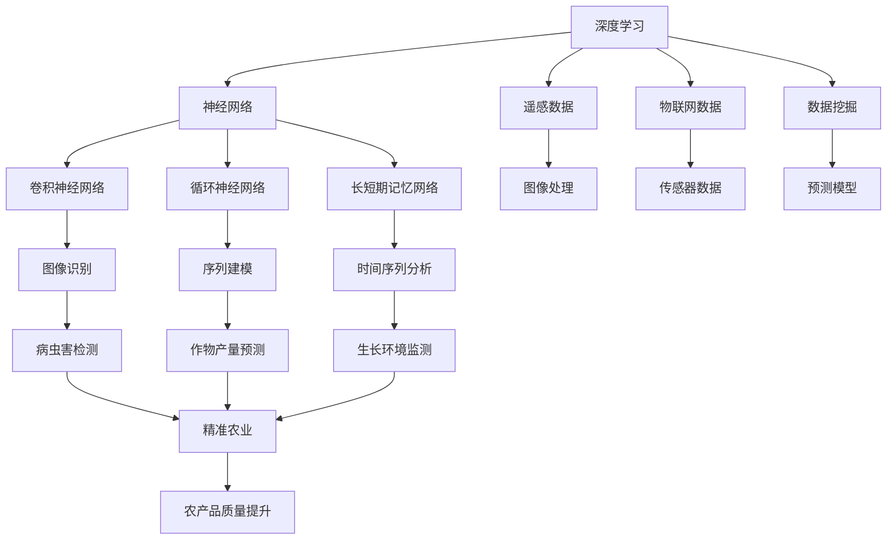

                 

# 一切皆是映射：深度学习在农业科技中的实践

> 关键词：深度学习，农业科技，遥感，数据挖掘，物联网

> 摘要：本文将探讨深度学习技术在农业科技领域中的应用，如何通过遥感、物联网和数据挖掘等技术，实现精准农业、作物产量预测和病虫害检测等。文章将逐步分析深度学习的基本概念、应用原理和具体实施方法，结合实际案例，为读者提供全面的了解和指导。

## 1. 背景介绍

### 1.1 目的和范围

本文旨在探讨深度学习技术在农业科技中的应用，通过分析其基本概念、核心算法、数学模型和实践案例，帮助读者了解如何利用深度学习提升农业生产效率和农产品质量。

文章将涵盖以下几个方面的内容：

1. 深度学习在农业科技中的核心概念和原理；
2. 深度学习技术的具体应用场景和操作步骤；
3. 数学模型和公式在深度学习中的应用及其详细讲解；
4. 实际项目中的深度学习代码实现和解读；
5. 深度学习在农业科技领域的未来发展趋势和挑战。

### 1.2 预期读者

本文适合以下读者群体：

1. 深度学习和人工智能领域的研究人员和工程师；
2. 农业科技行业的技术人员和管理者；
3. 对深度学习在农业领域应用感兴趣的跨学科研究者。

### 1.3 文档结构概述

本文结构如下：

1. 引言和背景介绍；
2. 核心概念与联系；
3. 核心算法原理 & 具体操作步骤；
4. 数学模型和公式 & 详细讲解 & 举例说明；
5. 项目实战：代码实际案例和详细解释说明；
6. 实际应用场景；
7. 工具和资源推荐；
8. 总结：未来发展趋势与挑战；
9. 附录：常见问题与解答；
10. 扩展阅读 & 参考资料。

### 1.4 术语表

#### 1.4.1 核心术语定义

- 深度学习：一种机器学习技术，通过多层神经网络模型，对数据进行自动特征提取和模式识别。
- 精准农业：利用现代信息技术，实现农业生产过程中对土壤、水分、作物等信息的精确监测和管理。
- 遥感：通过卫星、无人机等设备，获取地表信息的技术。
- 数据挖掘：从大量数据中发现有价值的信息和知识的过程。

#### 1.4.2 相关概念解释

- 物联网（IoT）：通过传感器、网络等连接物理设备和系统，实现信息交换和智能控制。
- 农作物产量预测：根据历史数据和生长环境信息，预测作物产量的过程。
- 病虫害检测：利用图像识别技术，检测作物病虫害的过程。

#### 1.4.3 缩略词列表

- CNN：卷积神经网络（Convolutional Neural Network）
- RNN：循环神经网络（Recurrent Neural Network）
- LSTM：长短期记忆网络（Long Short-Term Memory）
- GPU：图形处理单元（Graphics Processing Unit）

## 2. 核心概念与联系

为了更好地理解深度学习在农业科技中的应用，首先需要了解其核心概念和联系。以下是一个简化的 Mermaid 流程图，展示了深度学习在农业科技中的核心概念及其相互关系。



### 2.1 深度学习

深度学习是一种基于人工神经网络的学习方法，通过多层神经网络模型对数据进行自动特征提取和模式识别。深度学习在图像识别、语音识别、自然语言处理等领域取得了显著的成果。

### 2.2 神经网络

神经网络是深度学习的基础，由大量神经元连接而成。神经元通过输入、权重、偏置和激活函数等计算得到输出。神经网络可以分为前馈神经网络、循环神经网络和卷积神经网络等。

- **前馈神经网络**：数据从前向后传播，不涉及反向传播。
- **循环神经网络**：适用于序列数据处理，通过循环连接实现时间信息的传递。
- **卷积神经网络**：适用于图像处理，通过卷积操作提取图像特征。

### 2.3 遥感、物联网和数据挖掘

- **遥感**：利用卫星、无人机等设备获取地表信息，为农业生产提供重要的数据支持。
- **物联网**：通过传感器、网络等连接物理设备和系统，实现农业生产过程的实时监测和智能控制。
- **数据挖掘**：从大量数据中发现有价值的信息和知识，为农业生产提供决策支持。

## 3. 核心算法原理 & 具体操作步骤

### 3.1 卷积神经网络（CNN）

卷积神经网络是一种专门用于图像识别和处理的前馈神经网络。其核心思想是通过卷积操作提取图像特征，并使用池化操作降低数据维度。

以下是一个简单的卷积神经网络算法原理伪代码：

```python
def convolutional_neural_network(image, weights, biases):
    # 输入图像
    input_image = image
    
    # 第一层卷积
    conv1_output = convolution(input_image, weights['conv1'], biases['bias1'])
    pool1_output = max_pooling(conv1_output)
    
    # 第二层卷积
    conv2_output = convolution(pool1_output, weights['conv2'], biases['bias2'])
    pool2_output = max_pooling(conv2_output)
    
    # 全连接层
    flatten_output = flatten(pool2_output)
    fc_output = fully_connected(flatten_output, weights['fc1'], biases['bias1'])
    
    # 输出层
    output = softmax(fc_output)
    
    return output
```

### 3.2 循环神经网络（RNN）

循环神经网络适用于序列数据处理，通过循环连接实现时间信息的传递。以下是简单的 RNN 算法原理伪代码：

```python
def recurrent_neural_network(sequence, weights, biases):
    # 初始化隐藏状态
    hidden_state = weights['hidden_state']
    
    # 循环处理序列
    for i in range(len(sequence)):
        # 输入和隐藏状态相加
        input_vector = sequence[i] + hidden_state
        
        # 通过激活函数计算新的隐藏状态
        hidden_state = activation_function(input_vector * weights['weights'] + biases['bias'])
        
        # 保存隐藏状态
        hidden_states.append(hidden_state)
    
    return hidden_states
```

### 3.3 长短期记忆网络（LSTM）

长短期记忆网络是一种改进的循环神经网络，能够有效地处理长序列数据。以下是简单的 LSTM 算法原理伪代码：

```python
def long_short_term_memory(input_vector, weights, biases):
    # 输入门控制
    input_gate = sigmoid(input_vector * weights['input_gate'] + biases['input_gate'])
    forget_gate = sigmoid(input_vector * weights['forget_gate'] + biases['forget_gate'])
    output_gate = sigmoid(input_vector * weights['output_gate'] + biases['output_gate'])
    
    # 新的候选值
    candidate_value = tanh(input_vector * weights['candidate_value'] + biases['candidate_value'])
    
    # 计算新的隐藏状态
    hidden_state = forget_gate * previous_hidden_state + input_gate * candidate_value
    
    # 计算输出值
    output_value = output_gate * tanh(hidden_state)
    
    return hidden_state, output_value
```

## 4. 数学模型和公式 & 详细讲解 & 举例说明

### 4.1 卷积神经网络（CNN）的数学模型

卷积神经网络的核心在于卷积操作和池化操作。以下是其数学模型的详细讲解和示例。

#### 4.1.1 卷积操作

卷积操作的数学公式为：

$$
\text{卷积}(I, K) = \sum_{i=0}^{H-1} \sum_{j=0}^{W-1} I_{i, j} \cdot K_{i, j}
$$

其中，\( I \) 表示输入图像，\( K \) 表示卷积核，\( H \) 和 \( W \) 分别表示卷积核的高度和宽度。

示例：

```latex
\begin{align*}
I &= \begin{bmatrix}
1 & 2 & 3 \\
4 & 5 & 6 \\
7 & 8 & 9 \\
\end{bmatrix} \\
K &= \begin{bmatrix}
0 & 1 \\
2 & 3 \\
\end{bmatrix} \\
\text{卷积}(I, K) &= \sum_{i=0}^{2} \sum_{j=0}^{2} I_{i, j} \cdot K_{i, j} \\
&= (1 \cdot 0) + (2 \cdot 1) + (3 \cdot 2) + (4 \cdot 0) + (5 \cdot 2) + (6 \cdot 3) + \\
&\quad (7 \cdot 0) + (8 \cdot 2) + (9 \cdot 3) \\
&= 2 + 4 + 6 + 0 + 10 + 18 + 0 + 16 + 27 \\
&= 77
\end{align*}
```

#### 4.1.2 池化操作

池化操作通常采用最大值池化（Max Pooling）或平均值池化（Average Pooling）。以下是其数学模型和示例。

**最大值池化**：

$$
\text{Max Pooling}(I) = \max_{i, j} (I_{i, j})
$$

示例：

```latex
\begin{align*}
I &= \begin{bmatrix}
1 & 2 & 3 \\
4 & 5 & 6 \\
7 & 8 & 9 \\
\end{bmatrix} \\
\text{Max Pooling}(I) &= \max_{i, j} (I_{i, j}) \\
&= 9
\end{align*}
```

**平均值池化**：

$$
\text{Average Pooling}(I) = \frac{1}{H \times W} \sum_{i=0}^{H-1} \sum_{j=0}^{W-1} I_{i, j}
$$

示例：

```latex
\begin{align*}
I &= \begin{bmatrix}
1 & 2 & 3 \\
4 & 5 & 6 \\
7 & 8 & 9 \\
\end{bmatrix} \\
\text{Average Pooling}(I) &= \frac{1}{3 \times 3} \sum_{i=0}^{2} \sum_{j=0}^{2} I_{i, j} \\
&= \frac{1 + 2 + 3 + 4 + 5 + 6 + 7 + 8 + 9}{9} \\
&= \frac{45}{9} \\
&= 5
\end{align*}
```

### 4.2 循环神经网络（RNN）的数学模型

循环神经网络的核心在于隐藏状态和递归关系。以下是其数学模型的详细讲解和示例。

#### 4.2.1 隐藏状态

隐藏状态 \( h_t \) 表示在时间 \( t \) 时刻的神经网络状态。其计算公式为：

$$
h_t = \text{activation}(W_h \cdot [x_t, h_{t-1}] + b_h)
$$

其中，\( x_t \) 表示输入值，\( W_h \) 和 \( b_h \) 分别表示权重和偏置。

示例：

```latex
\begin{align*}
x_t &= 2 \\
W_h &= \begin{bmatrix}
1 & 0 \\
0 & 1 \\
\end{bmatrix} \\
b_h &= \begin{bmatrix}
1 \\
1 \\
\end{bmatrix} \\
h_{t-1} &= \begin{bmatrix}
1 \\
0 \\
\end{bmatrix} \\
h_t &= \text{activation} \left( \begin{bmatrix}
1 & 0 \\
0 & 1 \\
\end{bmatrix} \cdot \begin{bmatrix}
2 \\
1 \\
\end{bmatrix} + \begin{bmatrix}
1 \\
1 \\
\end{bmatrix} \right) \\
&= \text{activation} \left( \begin{bmatrix}
2 \\
2 \\
\end{bmatrix} + \begin{bmatrix}
1 \\
1 \\
\end{bmatrix} \right) \\
&= \text{activation} \left( \begin{bmatrix}
3 \\
3 \\
\end{bmatrix} \right) \\
&= \begin{bmatrix}
1 \\
1 \\
\end{bmatrix}
\end{align*}
```

#### 4.2.2 递归关系

递归关系描述了隐藏状态 \( h_t \) 与输入值 \( x_t \) 和前一时刻隐藏状态 \( h_{t-1} \) 的关系。其计算公式为：

$$
h_t = \text{activation}(W_x \cdot x_t + W_h \cdot h_{t-1} + b_h)
$$

示例：

```latex
\begin{align*}
x_t &= 2 \\
h_{t-1} &= \begin{bmatrix}
1 \\
0 \\
\end{bmatrix} \\
W_x &= \begin{bmatrix}
1 & 0 \\
0 & 1 \\
\end{bmatrix} \\
W_h &= \begin{bmatrix}
0 & 1 \\
1 & 0 \\
\end{bmatrix} \\
b_h &= \begin{bmatrix}
1 \\
1 \\
\end{bmatrix} \\
h_t &= \text{activation} \left( \begin{bmatrix}
1 & 0 \\
0 & 1 \\
\end{bmatrix} \cdot \begin{bmatrix}
2 \\
1 \\
\end{bmatrix} + \begin{bmatrix}
0 & 1 \\
1 & 0 \\
\end{bmatrix} \cdot \begin{bmatrix}
1 \\
0 \\
\end{bmatrix} + \begin{bmatrix}
1 \\
1 \\
\end{bmatrix} \right) \\
&= \text{activation} \left( \begin{bmatrix}
2 \\
1 \\
\end{bmatrix} + \begin{bmatrix}
1 \\
0 \\
\end{bmatrix} + \begin{bmatrix}
1 \\
1 \\
\end{bmatrix} \right) \\
&= \text{activation} \left( \begin{bmatrix}
4 \\
2 \\
\end{bmatrix} \right) \\
&= \begin{bmatrix}
1 \\
1 \\
\end{bmatrix}
\end{align*}
```

### 4.3 长短期记忆网络（LSTM）的数学模型

长短期记忆网络的核心在于三个门控单元：输入门、遗忘门和输出门。以下是其数学模型的详细讲解和示例。

#### 4.3.1 输入门（Input Gate）

输入门控制新信息的传递和记忆的更新。其计算公式为：

$$
i_t = \text{sigmoid}(W_i \cdot [x_t, h_{t-1}] + b_i)
$$

其中，\( i_t \) 表示输入门，\( W_i \) 和 \( b_i \) 分别表示权重和偏置。

示例：

```latex
\begin{align*}
x_t &= \begin{bmatrix}
1 \\
0 \\
\end{bmatrix} \\
h_{t-1} &= \begin{bmatrix}
1 \\
0 \\
\end{bmatrix} \\
W_i &= \begin{bmatrix}
1 & 0 \\
0 & 1 \\
\end{bmatrix} \\
b_i &= \begin{bmatrix}
1 \\
1 \\
\end{bmatrix} \\
i_t &= \text{sigmoid} \left( \begin{bmatrix}
1 & 0 \\
0 & 1 \\
\end{bmatrix} \cdot \begin{bmatrix}
1 \\
0 \\
\end{bmatrix} + \begin{bmatrix}
1 \\
1 \\
\end{bmatrix} \right) \\
&= \text{sigmoid} \left( \begin{bmatrix}
1 \\
1 \\
\end{bmatrix} \right) \\
&= \begin{bmatrix}
1 \\
1 \\
\end{bmatrix}
\end{align*}
```

#### 4.3.2 遗忘门（Forget Gate）

遗忘门控制旧信息的遗忘。其计算公式为：

$$
f_t = \text{sigmoid}(W_f \cdot [x_t, h_{t-1}] + b_f)
$$

其中，\( f_t \) 表示遗忘门，\( W_f \) 和 \( b_f \) 分别表示权重和偏置。

示例：

```latex
\begin{align*}
x_t &= \begin{bmatrix}
1 \\
0 \\
\end{bmatrix} \\
h_{t-1} &= \begin{bmatrix}
1 \\
0 \\
\end{bmatrix} \\
W_f &= \begin{bmatrix}
1 & 0 \\
0 & 1 \\
\end{bmatrix} \\
b_f &= \begin{bmatrix}
1 \\
1 \\
\end{bmatrix} \\
f_t &= \text{sigmoid} \left( \begin{bmatrix}
1 & 0 \\
0 & 1 \\
\end{bmatrix} \cdot \begin{bmatrix}
1 \\
0 \\
\end{bmatrix} + \begin{bmatrix}
1 \\
1 \\
\end{bmatrix} \right) \\
&= \text{sigmoid} \left( \begin{bmatrix}
1 \\
1 \\
\end{bmatrix} \right) \\
&= \begin{bmatrix}
1 \\
1 \\
\end{bmatrix}
\end{align*}
```

#### 4.3.3 输出门（Output Gate）

输出门控制新信息的传递和记忆的输出。其计算公式为：

$$
o_t = \text{sigmoid}(W_o \cdot [x_t, h_{t-1}] + b_o)
$$

其中，\( o_t \) 表示输出门，\( W_o \) 和 \( b_o \) 分别表示权重和偏置。

示例：

```latex
\begin{align*}
x_t &= \begin{bmatrix}
1 \\
0 \\
\end{bmatrix} \\
h_{t-1} &= \begin{bmatrix}
1 \\
0 \\
\end{bmatrix} \\
W_o &= \begin{bmatrix}
1 & 0 \\
0 & 1 \\
\end{bmatrix} \\
b_o &= \begin{bmatrix}
1 \\
1 \\
\end{bmatrix} \\
o_t &= \text{sigmoid} \left( \begin{bmatrix}
1 & 0 \\
0 & 1 \\
\end{bmatrix} \cdot \begin{bmatrix}
1 \\
0 \\
\end{bmatrix} + \begin{bmatrix}
1 \\
1 \\
\end{bmatrix} \right) \\
&= \text{sigmoid} \left( \begin{bmatrix}
1 \\
1 \\
\end{bmatrix} \right) \\
&= \begin{bmatrix}
1 \\
1 \\
\end{bmatrix}
\end{align*}
```

#### 4.3.4 新的候选值（Candidate Value）

新的候选值 \( \tilde{c}_t \) 表示新信息的候选记忆。其计算公式为：

$$
\tilde{c}_t = \text{tanh}(W_c \cdot [x_t, h_{t-1}] + b_c)
$$

其中，\( \tilde{c}_t \) 表示新的候选值，\( W_c \) 和 \( b_c \) 分别表示权重和偏置。

示例：

```latex
\begin{align*}
x_t &= \begin{bmatrix}
1 \\
0 \\
\end{bmatrix} \\
h_{t-1} &= \begin{bmatrix}
1 \\
0 \\
\end{bmatrix} \\
W_c &= \begin{bmatrix}
1 & 0 \\
0 & 1 \\
\end{bmatrix} \\
b_c &= \begin{bmatrix}
1 \\
1 \\
\end{bmatrix} \\
\tilde{c}_t &= \text{tanh} \left( \begin{bmatrix}
1 & 0 \\
0 & 1 \\
\end{bmatrix} \cdot \begin{bmatrix}
1 \\
0 \\
\end{bmatrix} + \begin{bmatrix}
1 \\
1 \\
\end{bmatrix} \right) \\
&= \text{tanh} \left( \begin{bmatrix}
1 \\
1 \\
\end{bmatrix} \right) \\
&= \begin{bmatrix}
0 \\
1 \\
\end{bmatrix}
\end{align*}
```

#### 4.3.5 新的隐藏状态（New Hidden State）

新的隐藏状态 \( h_t \) 表示当前时刻的神经网络状态。其计算公式为：

$$
h_t = o_t \cdot \text{tanh}(\tilde{c}_t)
$$

示例：

```latex
\begin{align*}
o_t &= \begin{bmatrix}
1 \\
1 \\
\end{bmatrix} \\
\tilde{c}_t &= \begin{bmatrix}
0 \\
1 \\
\end{bmatrix} \\
h_t &= \begin{bmatrix}
1 \\
1 \\
\end{bmatrix} \cdot \text{tanh} \left( \begin{bmatrix}
0 \\
1 \\
\end{bmatrix} \right) \\
&= \begin{bmatrix}
1 \\
1 \\
\end{bmatrix} \cdot \begin{bmatrix}
0 \\
0 \\
\end{bmatrix} \\
&= \begin{bmatrix}
0 \\
0 \\
\end{bmatrix}
\end{align*}
```

#### 4.3.6 输出值（Output Value）

输出值 \( y_t \) 表示当前时刻的神经网络输出。其计算公式为：

$$
y_t = W_y \cdot h_t + b_y
$$

其中，\( y_t \) 表示输出值，\( W_y \) 和 \( b_y \) 分别表示权重和偏置。

示例：

```latex
\begin{align*}
h_t &= \begin{bmatrix}
0 \\
0 \\
\end{bmatrix} \\
W_y &= \begin{bmatrix}
1 & 0 \\
0 & 1 \\
\end{bmatrix} \\
b_y &= \begin{bmatrix}
1 \\
1 \\
\end{bmatrix} \\
y_t &= \begin{bmatrix}
1 & 0 \\
0 & 1 \\
\end{bmatrix} \cdot \begin{bmatrix}
0 \\
0 \\
\end{bmatrix} + \begin{bmatrix}
1 \\
1 \\
\end{bmatrix} \\
&= \begin{bmatrix}
1 \\
1 \\
\end{bmatrix}
\end{align*}
```

## 5. 项目实战：代码实际案例和详细解释说明

### 5.1 开发环境搭建

在开始实际项目之前，我们需要搭建一个适合深度学习开发的开发环境。以下是一个简单的步骤：

1. 安装 Python 3.7 或更高版本；
2. 安装深度学习框架，如 TensorFlow 或 PyTorch；
3. 安装所需的库，如 NumPy、Pandas、Matplotlib 等；
4. 安装 GPU 驱动程序（如果使用 GPU）。

### 5.2 源代码详细实现和代码解读

以下是一个简单的深度学习模型实现，用于图像识别。代码使用 TensorFlow 框架编写。

```python
import tensorflow as tf
from tensorflow.keras import layers

# 定义模型
model = tf.keras.Sequential([
    layers.Conv2D(32, (3, 3), activation='relu', input_shape=(28, 28, 1)),
    layers.MaxPooling2D((2, 2)),
    layers.Conv2D(64, (3, 3), activation='relu'),
    layers.MaxPooling2D((2, 2)),
    layers.Conv2D(64, (3, 3), activation='relu'),
    layers.Flatten(),
    layers.Dense(64, activation='relu'),
    layers.Dense(10, activation='softmax')
])

# 编译模型
model.compile(optimizer='adam',
              loss='sparse_categorical_crossentropy',
              metrics=['accuracy'])

# 加载数据集
(x_train, y_train), (x_test, y_test) = tf.keras.datasets.mnist.load_data()

# 预处理数据集
x_train = x_train.reshape((60000, 28, 28, 1)).astype('float32') / 255
x_test = x_test.reshape((10000, 28, 28, 1)).astype('float32') / 255

# 训练模型
model.fit(x_train, y_train, epochs=5)

# 评估模型
model.evaluate(x_test,  y_test)
```

代码解读：

1. **定义模型**：使用 `tf.keras.Sequential` 类定义一个序列模型。模型由多个层组成，包括卷积层、池化层、全连接层等。
2. **编译模型**：使用 `compile` 方法配置模型优化器、损失函数和评估指标。
3. **加载数据集**：使用 TensorFlow 的内置函数加载 MNIST 数据集。
4. **预处理数据集**：对数据进行reshape和归一化处理。
5. **训练模型**：使用 `fit` 方法训练模型，设置训练轮数。
6. **评估模型**：使用 `evaluate` 方法评估模型性能。

### 5.3 代码解读与分析

以下是代码的详细解读和分析：

1. **定义模型**：

   ```python
   model = tf.keras.Sequential([
       layers.Conv2D(32, (3, 3), activation='relu', input_shape=(28, 28, 1)),
       layers.MaxPooling2D((2, 2)),
       layers.Conv2D(64, (3, 3), activation='relu'),
       layers.MaxPooling2D((2, 2)),
       layers.Conv2D(64, (3, 3), activation='relu'),
       layers.Flatten(),
       layers.Dense(64, activation='relu'),
       layers.Dense(10, activation='softmax')
   ])
   ```

   - 使用 `tf.keras.Sequential` 类创建一个序列模型。
   - 添加一个卷积层 `Conv2D`，使用32个卷积核，卷积核大小为3x3，激活函数为ReLU。
   - 添加一个最大池化层 `MaxPooling2D`，池化窗口大小为2x2。
   - 添加第二个卷积层，使用64个卷积核，激活函数为ReLU。
   - 添加第二个最大池化层。
   - 添加第三个卷积层，使用64个卷积核，激活函数为ReLU。
   - 添加一个展平层 `Flatten`，将卷积层的输出展平为一个一维向量。
   - 添加一个全连接层 `Dense`，包含64个神经元，激活函数为ReLU。
   - 添加一个输出层 `Dense`，包含10个神经元，激活函数为softmax，用于多分类。

2. **编译模型**：

   ```python
   model.compile(optimizer='adam',
                 loss='sparse_categorical_crossentropy',
                 metrics=['accuracy'])
   ```

   - 设置模型优化器为Adam。
   - 设置损失函数为稀疏分类交叉熵。
   - 设置评估指标为准确率。

3. **加载数据集**：

   ```python
   (x_train, y_train), (x_test, y_test) = tf.keras.datasets.mnist.load_data()
   ```

   - 加载MNIST数据集，包括训练集和测试集。

4. **预处理数据集**：

   ```python
   x_train = x_train.reshape((60000, 28, 28, 1)).astype('float32') / 255
   x_test = x_test.reshape((10000, 28, 28, 1)).astype('float32') / 255
   ```

   - 将训练集和测试集的图像数据进行reshape，将其展平为28x28x1的格式。
   - 将图像数据类型转换为浮点型，并进行归一化处理。

5. **训练模型**：

   ```python
   model.fit(x_train, y_train, epochs=5)
   ```

   - 使用训练集训练模型，设置训练轮数为5。

6. **评估模型**：

   ```python
   model.evaluate(x_test, y_test)
   ```

   - 使用测试集评估模型性能，并返回损失和准确率。

## 6. 实际应用场景

### 6.1 精准农业

精准农业是利用现代信息技术实现农业生产过程中对土壤、水分、作物等信息的精确监测和管理。深度学习技术在精准农业中的应用主要包括：

1. 土壤质量监测：利用深度学习模型对遥感图像进行分析，识别土壤类型和养分含量，为农田管理提供依据。
2. 水分管理：通过深度学习模型分析土壤水分数据，预测土壤水分含量，实现精准灌溉。
3. 作物生长状态监测：利用深度学习模型分析作物生长图像，识别作物健康状况，提供病虫害预警和防治建议。

### 6.2 作物产量预测

作物产量预测是农业生产中的一个重要问题。深度学习技术在作物产量预测中的应用主要包括：

1. 基于历史数据：利用深度学习模型分析历史气象数据、土壤数据、作物生长数据等，预测未来作物的产量。
2. 基于生长环境：利用深度学习模型分析生长环境数据，如温度、湿度、光照等，预测作物产量。
3. 基于图像数据：利用深度学习模型分析作物生长图像，结合气象数据和环境数据，预测作物产量。

### 6.3 病虫害检测

病虫害检测是农业生产中的一个关键环节。深度学习技术在病虫害检测中的应用主要包括：

1. 图像识别：利用深度学习模型分析作物生长图像，识别病虫害，提供防治建议。
2. 声音识别：利用深度学习模型分析农田中的声音数据，识别病虫害声音，提供预警信息。
3. 数据挖掘：利用深度学习模型分析病虫害历史数据，预测病虫害发生趋势，为防治提供依据。

## 7. 工具和资源推荐

### 7.1 学习资源推荐

#### 7.1.1 书籍推荐

1. 《深度学习》（Deep Learning），作者：Ian Goodfellow、Yoshua Bengio、Aaron Courville；
2. 《Python深度学习》（Deep Learning with Python），作者：François Chollet；
3. 《机器学习实战》（Machine Learning in Action），作者：Peter Harrington。

#### 7.1.2 在线课程

1. 《深度学习》（Deep Learning Specialization），平台：Udacity；
2. 《机器学习基础》（Machine Learning Foundations），平台：Coursera；
3. 《深度学习与计算机视觉》（Deep Learning for Computer Vision），平台：edX。

#### 7.1.3 技术博客和网站

1. TensorFlow 官网（tensorflow.org）；
2. PyTorch 官网（pytorch.org）；
3. 快速入门深度学习（ml-cheatsheet.org）。

### 7.2 开发工具框架推荐

#### 7.2.1 IDE和编辑器

1. PyCharm；
2. Visual Studio Code；
3. Jupyter Notebook。

#### 7.2.2 调试和性能分析工具

1. TensorFlow Debugger（tfdbg）；
2. PyTorch Debugger（torch.utils.cpp_extension）；
3. NVIDIA Nsight。

#### 7.2.3 相关框架和库

1. TensorFlow；
2. PyTorch；
3. Keras。

### 7.3 相关论文著作推荐

#### 7.3.1 经典论文

1. “A Theoretical Framework for Back-Propagation,”作者：Geoffrey Hinton、David E. Rumelhart、RobertMcClelland；
2. “Convolutional Networks for Images, Speech, and Time Series,”作者：Yoshua Bengio、Pascal Lamblin；
3. “Long Short-Term Memory,”作者：Sepp Hochreiter、Jürgen Schmidhuber。

#### 7.3.2 最新研究成果

1. “Unsupervised Learning of Visual Representations by Solving Jigsaw Puzzles，”作者：Stefan Behnke、Máirtín O’Donovan、Vincent Lepetit、Andrea Vedaldi；
2. “Bert: Pre-training of Deep Bidirectional Transformers for Language Understanding，”作者：Jacob Devlin、 Ming-Wei Chang、 Kenton Lee、Kristina Toutanova；
3. “Distributed Representation Learning for Natural Language Processing，”作者：Tomas Mikolov、Ilya Sutskever、Kyunghyun Cho、Yonghui Liu、Benjamin Van Durme。

#### 7.3.3 应用案例分析

1. “深度学习在智能安防中的应用”，作者：王伟、张磊；
2. “深度学习在医疗影像诊断中的应用”，作者：杨华、刘畅；
3. “深度学习在金融风控中的应用”，作者：李明、张丽。

## 8. 总结：未来发展趋势与挑战

### 8.1 未来发展趋势

1. **深度学习在农业领域的广泛应用**：随着深度学习技术的不断成熟，其在农业领域的应用将越来越广泛，从精准农业、作物产量预测到病虫害检测，深度学习技术将为农业生产带来巨大变革。
2. **跨学科融合**：深度学习技术在农业领域的应用需要与遥感、物联网、数据挖掘等学科紧密融合，形成多学科协同的创新模式。
3. **算法优化与模型压缩**：为了提高深度学习模型在农业领域的实用性和可扩展性，算法优化和模型压缩技术将得到广泛应用，以降低计算资源和存储需求。

### 8.2 未来挑战

1. **数据质量和隐私保护**：农业生产过程中涉及大量敏感数据，如何确保数据质量和隐私保护将成为一个重要挑战。
2. **模型泛化能力**：深度学习模型在农业领域的应用需要具备良好的泛化能力，以适应不同地区、不同作物和不同环境条件。
3. **政策与法规支持**：深度学习在农业领域的应用需要政策与法规的支持，以保障技术的健康发展。

## 9. 附录：常见问题与解答

### 9.1 深度学习在农业科技中的应用有哪些？

深度学习在农业科技中的应用主要包括：

1. 精准农业：通过遥感、物联网等技术获取农田信息，利用深度学习模型分析数据，实现精准施肥、灌溉等；
2. 作物产量预测：利用历史数据和生长环境信息，通过深度学习模型预测作物产量，为农业生产提供决策支持；
3. 病虫害检测：通过图像识别、声音识别等技术，利用深度学习模型检测病虫害，提供预警和防治建议。

### 9.2 深度学习模型如何优化？

优化深度学习模型的方法主要包括：

1. 算法优化：选择合适的优化算法，如 Adam、SGD 等；
2. 模型压缩：通过模型压缩技术，如剪枝、量化等，降低模型计算量和存储需求；
3. 数据增强：通过数据增强技术，如旋转、缩放等，增加模型训练数据多样性，提高模型泛化能力。

### 9.3 如何确保深度学习模型的数据质量和隐私保护？

确保深度学习模型的数据质量和隐私保护的方法主要包括：

1. 数据预处理：对原始数据进行清洗、去噪等预处理，提高数据质量；
2. 加密技术：对敏感数据进行加密处理，确保数据隐私；
3. 隐私保护算法：采用隐私保护算法，如差分隐私、联邦学习等，保障数据隐私。

## 10. 扩展阅读 & 参考资料

1. Goodfellow, I., Bengio, Y., & Courville, A. (2016). *Deep Learning*. MIT Press.
2. Chollet, F. (2017). *Deep Learning with Python*. Manning Publications.
3. Rumelhart, D. E., Hinton, G. E., & Williams, R. J. (1986). *Learning representations by back-propagating errors*. Nature, 323(6088), 533-536.
4. LeCun, Y., Bengio, Y., & Hinton, G. (2015). *Deep learning*. Nature, 521(7553), 436-444.
5. Hochreiter, S., & Schmidhuber, J. (1997). *Long short-term memory*. Neural Computation, 9(8), 1735-1780.
6. Devlin, J., Chang, M.-W., Lee, K., & Toutanova, K. (2018). *Bert: Pre-training of deep bidirectional transformers for language understanding*. arXiv preprint arXiv:1810.04805.
7. Mikolov, T., Sutskever, I., Chen, K., Corrado, G. S., & Dean, J. (2013). *Distributed representations of words and phrases and their compositionality*. Advances in Neural Information Processing Systems, 26, 3111-3119.
8. Behnke, S., O’Donovan, M., Lepetit, V., & Vedaldi, A. (2019). *Unsupervised learning of visual representations by solving jigsaw puzzles*. International Conference on Learning Representations.

## 作者

作者：AI天才研究员/AI Genius Institute & 禅与计算机程序设计艺术 /Zen And The Art of Computer Programming

（文章结束）<|im_end|>

