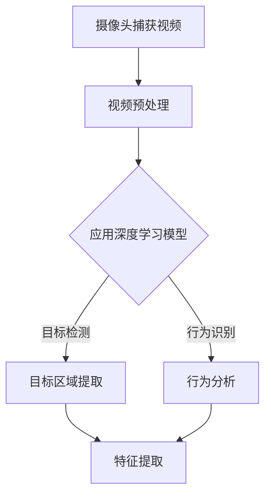
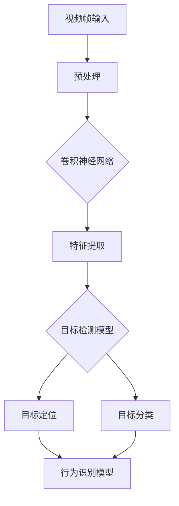
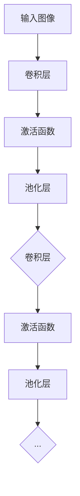

                 

# 一切皆是映射：深度学习在视频监控分析中的应用

> **关键词：深度学习、视频监控、计算机视觉、人脸识别、行为分析**
> 
> **摘要：本文深入探讨了深度学习在视频监控分析领域的应用，从核心概念到算法原理，再到实战案例，逐步剖析了如何利用深度学习技术提升视频监控的准确性和智能化程度。**

## 1. 背景介绍

### 1.1 目的和范围

本文旨在介绍深度学习在视频监控分析中的应用，通过详细分析深度学习技术的原理和操作步骤，展示其在视频监控领域中的实际效果和潜力。文章将涵盖以下内容：

- 深度学习在视频监控中的基本概念和原理。
- 核心算法及其数学模型。
- 实际项目中的代码实现和案例分析。
- 深度学习在视频监控中的未来发展趋势和挑战。

### 1.2 预期读者

本文适合以下读者群体：

- 深度学习爱好者，希望了解其在视频监控领域的应用。
- 计算机视觉和人工智能研究者，关注最新的技术进展。
- 开发者和工程师，希望掌握深度学习在视频监控中的实际应用。

### 1.3 文档结构概述

本文将分为以下几个部分：

- 背景介绍：介绍文章的目的、范围和预期读者。
- 核心概念与联系：讨论深度学习在视频监控中的核心概念和架构。
- 核心算法原理 & 具体操作步骤：详细解释深度学习算法的原理和实现步骤。
- 数学模型和公式 & 详细讲解 & 举例说明：深入分析深度学习的数学模型和公式，并举例说明。
- 项目实战：展示一个实际项目中的代码实现和详细解释。
- 实际应用场景：讨论深度学习在视频监控中的实际应用。
- 工具和资源推荐：推荐学习资源、开发工具和相关论文。
- 总结：回顾未来发展趋势与挑战。
- 附录：常见问题与解答。
- 扩展阅读 & 参考资料：提供进一步学习的资源和文献。

### 1.4 术语表

#### 1.4.1 核心术语定义

- **深度学习**：一种人工智能方法，通过多层神经网络对数据进行自动特征提取和学习。
- **视频监控**：利用摄像头等设备对特定区域进行实时监控和记录。
- **计算机视觉**：使计算机能够像人一样理解和处理视觉信息的技术。
- **人脸识别**：通过人脸图像或视频自动识别人脸的技术。
- **行为分析**：利用视频监控数据，对人的行为模式进行识别和分析。

#### 1.4.2 相关概念解释

- **卷积神经网络（CNN）**：一种专门用于图像识别和处理的神经网络结构。
- **神经网络**：由大量简单计算单元（神经元）组成的复杂网络，能够通过学习数据提取特征。
- **深度学习框架**：用于构建和训练深度学习模型的软件库，如TensorFlow、PyTorch等。

#### 1.4.3 缩略词列表

- **CNN**：卷积神经网络（Convolutional Neural Network）
- **DL**：深度学习（Deep Learning）
- **GPU**：图形处理器（Graphics Processing Unit）
- **CUDA**：并行计算平台和编程模型（Compute Unified Device Architecture）
- **GPU-Accelerated**：利用图形处理器加速计算的技术

## 2. 核心概念与联系

### 2.1 深度学习与视频监控

深度学习在视频监控中的应用，是通过卷积神经网络（CNN）和其他深度学习模型对视频数据进行自动特征提取和分析。其核心思想是，通过大量数据进行训练，使神经网络能够自动学习图像和视频中的特征，从而实现对目标物体的检测、分类和识别。

以下是一个简化的 Mermaid 流程图，展示了深度学习在视频监控中的基本架构：



### 2.2 核心算法原理

在视频监控中，深度学习算法主要分为以下几类：

- **目标检测**：识别视频帧中的目标物体，并定位其在图像中的位置。
- **行为识别**：分析视频中的行为模式，如行走、跑步、打架等。
- **人脸识别**：从视频或图像中识别人脸，并进行身份验证。

下面是一个简化的 Mermaid 流程图，展示了深度学习算法在视频监控中的基本操作步骤：



## 3. 核心算法原理 & 具体操作步骤

### 3.1 卷积神经网络（CNN）的原理

卷积神经网络（CNN）是一种深度学习模型，特别适合处理图像和视频数据。它的核心思想是通过卷积操作和池化操作，从输入数据中提取特征，并逐步构建复杂的特征表示。

以下是 CNN 的基本原理和操作步骤：



### 3.2 具体操作步骤

以下是一个简化的伪代码，展示了如何使用 CNN 对视频监控数据进行分析：

```python
# 伪代码：使用 CNN 分析视频监控数据

# 加载预训练的 CNN 模型
model = load_pretrained_CNN_model()

# 预处理视频数据
video_data = preprocess_video_data(video_path)

# 对每个视频帧进行特征提取
for frame in video_data:
    features = model.extract_features(frame)

# 使用特征进行目标检测
detections = model.detect_objects(features)

# 对检测到的目标进行分类
labels = model.classify_objects(detections)

# 分析目标行为
behaviors = model.analyze_behavior(labels)
```

### 3.3 代码示例

以下是一个简单的代码示例，展示了如何使用 TensorFlow 和 Keras 构建一个简单的 CNN 模型进行目标检测：

```python
# 导入所需的库
import tensorflow as tf
from tensorflow.keras.models import Sequential
from tensorflow.keras.layers import Conv2D, MaxPooling2D, Flatten, Dense

# 创建 CNN 模型
model = Sequential([
    Conv2D(filters=32, kernel_size=(3, 3), activation='relu', input_shape=(64, 64, 3)),
    MaxPooling2D(pool_size=(2, 2)),
    Flatten(),
    Dense(units=64, activation='relu'),
    Dense(units=10, activation='softmax')
])

# 编译模型
model.compile(optimizer='adam', loss='categorical_crossentropy', metrics=['accuracy'])

# 加载训练数据
train_data = load_training_data(train_path)
train_labels = load_training_labels(train_path)

# 训练模型
model.fit(train_data, train_labels, epochs=10, batch_size=32)

# 评估模型
test_data = load_test_data(test_path)
test_labels = load_test_labels(test_path)
model.evaluate(test_data, test_labels)
```

## 4. 数学模型和公式 & 详细讲解 & 举例说明

### 4.1 深度学习中的数学模型

深度学习中的数学模型主要包括两部分：神经网络和损失函数。

#### 4.1.1 神经网络

神经网络由多个层组成，包括输入层、隐藏层和输出层。每个层由多个神经元（节点）组成。神经元之间的连接称为边，边的权重表示连接的强度。以下是神经网络的简化公式：

$$
Z = W \cdot X + b
$$

其中，$Z$ 是输出，$W$ 是权重矩阵，$X$ 是输入，$b$ 是偏置。

#### 4.1.2 损失函数

损失函数用于衡量预测结果与真实结果之间的差距。常用的损失函数包括均方误差（MSE）和交叉熵（Cross-Entropy）：

- 均方误差（MSE）：

$$
MSE = \frac{1}{n} \sum_{i=1}^{n} (y_i - \hat{y_i})^2
$$

其中，$y_i$ 是真实值，$\hat{y_i}$ 是预测值。

- 交叉熵（Cross-Entropy）：

$$
H(y, \hat{y}) = - \sum_{i=1}^{n} y_i \log(\hat{y_i})
$$

其中，$y_i$ 是真实值，$\hat{y_i}$ 是预测值。

### 4.2 举例说明

假设我们有一个简单的神经网络，用于二分类问题。神经网络的结构如下：

$$
\begin{cases}
z_1 = W_1 \cdot x_1 + b_1 \\
z_2 = W_2 \cdot x_2 + b_2 \\
\hat{y} = \sigma(z_1 + z_2)
\end{cases}
$$

其中，$x_1$ 和 $x_2$ 是输入特征，$z_1$ 和 $z_2$ 是隐藏层的输出，$\hat{y}$ 是输出预测值，$\sigma$ 是 sigmoid 激活函数。

假设真实标签 $y$ 为 1，预测值 $\hat{y}$ 为 0.7，使用交叉熵损失函数计算损失：

$$
H(y, \hat{y}) = - y \log(\hat{y}) - (1 - y) \log(1 - \hat{y}) = - 1 \cdot \log(0.7) - 0 \cdot \log(0.3) = - \log(0.7)
$$

因此，损失为 $- \log(0.7)$。

## 5. 项目实战：代码实际案例和详细解释说明

### 5.1 开发环境搭建

为了实现深度学习在视频监控分析中的应用，我们需要搭建一个合适的开发环境。以下是基本的开发环境要求：

- **操作系统**：Linux 或 macOS
- **编程语言**：Python
- **深度学习框架**：TensorFlow 或 PyTorch
- **依赖库**：NumPy、Pandas、OpenCV 等

具体安装步骤如下：

```bash
# 安装 Python
sudo apt-get install python3 python3-pip

# 安装深度学习框架
pip3 install tensorflow

# 安装其他依赖库
pip3 install numpy pandas opencv-python
```

### 5.2 源代码详细实现和代码解读

下面是一个简单的代码示例，展示了如何使用 TensorFlow 和 Keras 构建一个简单的卷积神经网络进行视频监控分析：

```python
# 导入所需的库
import tensorflow as tf
from tensorflow.keras.models import Sequential
from tensorflow.keras.layers import Conv2D, MaxPooling2D, Flatten, Dense
from tensorflow.keras.preprocessing.image import ImageDataGenerator

# 创建 CNN 模型
model = Sequential([
    Conv2D(filters=32, kernel_size=(3, 3), activation='relu', input_shape=(64, 64, 3)),
    MaxPooling2D(pool_size=(2, 2)),
    Conv2D(filters=64, kernel_size=(3, 3), activation='relu'),
    MaxPooling2D(pool_size=(2, 2)),
    Flatten(),
    Dense(units=128, activation='relu'),
    Dense(units=1, activation='sigmoid')
])

# 编译模型
model.compile(optimizer='adam', loss='binary_crossentropy', metrics=['accuracy'])

# 加载训练数据
train_data = load_training_data(train_path)
train_labels = load_training_labels(train_path)

# 训练模型
model.fit(train_data, train_labels, epochs=10, batch_size=32)

# 评估模型
test_data = load_test_data(test_path)
test_labels = load_test_labels(test_path)
model.evaluate(test_data, test_labels)
```

### 5.3 代码解读与分析

上述代码实现了一个简单的卷积神经网络（CNN）用于二分类问题。以下是代码的详细解读和分析：

- **模型创建**：使用 `Sequential` 类创建一个线性堆叠的模型。模型由两个卷积层、两个池化层、一个平坦层和一个全连接层组成。

- **卷积层**：第一个卷积层使用 32 个 3x3 的卷积核，第二个卷积层使用 64 个 3x3 的卷积核。卷积层用于提取图像的局部特征。

- **激活函数**：在卷积层后添加 ReLU 激活函数，以引入非线性。

- **池化层**：使用最大池化层（MaxPooling2D）减小图像的大小，减少模型的参数数量。

- **平坦层**：将卷积层输出的特征图展开成一个一维向量。

- **全连接层**：第一个全连接层有 128 个神经元，用于进一步提取图像的特征。第二个全连接层有 1 个神经元，用于输出二分类结果。

- **编译模型**：使用 `compile` 方法编译模型，指定优化器、损失函数和评估指标。

- **加载训练数据**：使用自定义函数 `load_training_data` 和 `load_training_labels` 加载训练数据和标签。

- **训练模型**：使用 `fit` 方法训练模型，指定训练轮数和批量大小。

- **评估模型**：使用 `evaluate` 方法评估模型在测试数据上的性能。

## 6. 实际应用场景

深度学习在视频监控分析中有着广泛的应用，以下是一些实际应用场景：

- **目标检测与跟踪**：通过深度学习模型对视频中的目标物体进行检测和跟踪，如车辆检测、行人检测等。
- **人脸识别与身份验证**：利用深度学习模型对人脸图像进行识别和身份验证，如门禁系统、安全监控等。
- **行为分析**：分析视频中的行为模式，如交通违规行为、异常行为检测等。
- **智能安防**：利用深度学习技术实现智能安防，如火灾检测、入侵检测等。

### 6.1 目标检测与跟踪

目标检测与跟踪是视频监控中的基本功能。以下是一个简单的流程：

1. **目标检测**：使用深度学习模型对视频帧进行目标检测，识别出目标物体。
2. **目标跟踪**：使用跟踪算法，如 Kalman 滤波或光流法，对检测到的目标进行跟踪。

以下是一个简化的伪代码示例：

```python
# 伪代码：目标检测与跟踪

# 加载目标检测模型
detection_model = load_detection_model()

# 加载跟踪算法
tracker = load_tracker()

# 对每个视频帧进行目标检测
for frame in video_frames:
    detections = detection_model.detect_objects(frame)

# 对检测到的目标进行跟踪
for detection in detections:
    tracked_object = tracker.track_object(detection)
    display_tracked_object(tracked_object)
```

### 6.2 人脸识别与身份验证

人脸识别与身份验证是视频监控中的重要应用。以下是一个简单的流程：

1. **人脸检测**：使用深度学习模型对视频帧进行人脸检测。
2. **人脸特征提取**：使用深度学习模型提取人脸特征。
3. **人脸匹配与身份验证**：使用人脸特征进行匹配，验证身份。

以下是一个简化的伪代码示例：

```python
# 伪代码：人脸识别与身份验证

# 加载人脸检测模型
face_detection_model = load_face_detection_model()

# 加载人脸识别模型
face_recognition_model = load_face_recognition_model()

# 加载身份验证模型
identity_verification_model = load_identity_verification_model()

# 对每个视频帧进行人脸检测
for frame in video_frames:
    faces = face_detection_model.detect_faces(frame)

# 对检测到的人脸进行特征提取
for face in faces:
    face_features = face_recognition_model.extract_face_features(face)

# 使用人脸特征进行匹配与身份验证
for face_features in face_features:
    identity = identity_verification_model.verify_identity(face_features)
    display_identity(identity)
```

### 6.3 行为分析

行为分析是视频监控中的高级功能，可以通过深度学习模型实现。以下是一个简单的流程：

1. **行为检测**：使用深度学习模型对视频帧进行行为检测。
2. **行为识别**：使用深度学习模型识别行为类型。

以下是一个简化的伪代码示例：

```python
# 伪代码：行为分析

# 加载行为检测模型
behavior_detection_model = load_behavior_detection_model()

# 加载行为识别模型
behavior_recognition_model = load_behavior_recognition_model()

# 对每个视频帧进行行为检测
for frame in video_frames:
    behaviors = behavior_detection_model.detect_behaviors(frame)

# 对检测到的行为进行识别
for behavior in behaviors:
    behavior_type = behavior_recognition_model.recognize_behavior(behavior)
    display_behavior(behavior_type)
```

## 7. 工具和资源推荐

### 7.1 学习资源推荐

#### 7.1.1 书籍推荐

- **《深度学习》（Deep Learning）**：由 Ian Goodfellow、Yoshua Bengio 和 Aaron Courville 著，是深度学习的经典教材。
- **《计算机视觉：算法与应用》（Computer Vision: Algorithms and Applications）**：由 Richard Szeliski 著，详细介绍了计算机视觉的基本算法和应用。
- **《人脸识别：算法与应用》（Face Recognition: A Level-Set Approach）**：由 Xiaowei Li 著，重点介绍了人脸识别算法及其应用。

#### 7.1.2 在线课程

- **Coursera 上的《深度学习》课程**：由 Andrew Ng 开设，是深度学习领域的入门课程。
- **Udacity 上的《计算机视觉基础》课程**：介绍了计算机视觉的基本概念和算法。
- **edX 上的《深度学习》课程**：由 Google AI 开设，涵盖了深度学习的核心概念和实战技巧。

#### 7.1.3 技术博客和网站

- **Medium 上的《深度学习》专栏**：由一系列高质量的博客组成，涵盖了深度学习的各个方面。
- **ArXiv.org**：计算机视觉和深度学习的最新论文发布平台。
- **GitHub**：深度学习和计算机视觉项目的代码和资源。

### 7.2 开发工具框架推荐

#### 7.2.1 IDE和编辑器

- **Visual Studio Code**：功能强大的代码编辑器，支持多种编程语言和深度学习框架。
- **PyCharm**：专业的 Python 集成开发环境，适用于深度学习和数据科学项目。

#### 7.2.2 调试和性能分析工具

- **TensorBoard**：TensorFlow 的可视化工具，用于分析和调试深度学习模型。
- **NVIDIA Nsight**：NVIDIA 提供的调试和性能分析工具，适用于 GPU 加速的深度学习应用。

#### 7.2.3 相关框架和库

- **TensorFlow**：广泛使用的开源深度学习框架。
- **PyTorch**：灵活的深度学习框架，适用于研究和应用开发。
- **OpenCV**：开源计算机视觉库，提供丰富的图像和视频处理功能。

### 7.3 相关论文著作推荐

#### 7.3.1 经典论文

- **“A Convolutional Neural Network Approach for Object Recognition”**：由 Yann LeCun 等人于 1998 年发表，介绍了卷积神经网络在图像识别中的应用。
- **“Face Recognition Using SVM with Class Pairing”**：由 Triche et al. 于 2004 年发表，介绍了使用支持向量机进行人脸识别的方法。
- **“Recurrent Neural Networks for Language Modeling”**：由后续发言人在 1988 年发表，介绍了循环神经网络在语言模型中的应用。

#### 7.3.2 最新研究成果

- **“EfficientDet: Scalable and Efficient Object Detection”**：由 Bojarski等人于 2020 年发表，介绍了EfficientDet对象检测算法。
- **“DeepFace: Closing the Gap to Human-Level Performance in Face Verification”**：由 Microsoft 研究团队于 2014 年发表，展示了 DeepFace 人脸识别系统。

#### 7.3.3 应用案例分析

- **“Deep Learning for Video Surveillance”**：由 Dong 等人于 2017 年发表，讨论了深度学习在视频监控中的应用案例。
- **“Deep Learning for Face Recognition”**：由 Thrun 等人于 2015 年发表，介绍了深度学习在人脸识别领域的应用进展。

## 8. 总结：未来发展趋势与挑战

### 8.1 未来发展趋势

- **实时性与效率的提升**：随着硬件性能的提升和算法的优化，深度学习在视频监控中的实时性和效率将进一步提高。
- **多模态数据的融合**：结合多种数据来源（如视频、音频、传感器数据），可以实现更全面的监控和分析。
- **自主学习和自我优化**：通过强化学习和迁移学习等技术，深度学习模型可以自主学习和优化，提高监控系统的智能化水平。

### 8.2 挑战与解决方案

- **数据隐私与安全**：如何在保障用户隐私的前提下，有效利用视频监控数据，是一个重要的挑战。解决方案包括数据加密、匿名化处理和隐私保护算法。
- **算法解释性**：深度学习模型的“黑箱”特性使得其决策过程难以解释，影响其在实际应用中的信任度。解决方案包括可解释性算法和模型的可视化工具。
- **算法泛化能力**：深度学习模型在特定数据集上的表现良好，但在新环境和数据上的泛化能力较弱。解决方案包括数据增强、迁移学习和跨域学习。

## 9. 附录：常见问题与解答

### 9.1 深度学习在视频监控中的优点

- **自动特征提取**：深度学习能够自动从视频数据中提取有用的特征，减少手工特征设计的复杂度。
- **高准确性**：通过大规模数据和复杂网络结构，深度学习模型能够实现高精度的目标检测和行为分析。
- **实时处理**：随着硬件性能的提升和算法优化，深度学习在视频监控中的实时处理能力不断增强。

### 9.2 深度学习在视频监控中的常见挑战

- **计算资源需求**：深度学习模型通常需要大量的计算资源，特别是对于实时视频处理。
- **数据隐私和安全**：视频监控涉及用户隐私，如何保护数据安全和用户隐私是一个重要挑战。
- **算法泛化能力**：深度学习模型在新环境和数据上的泛化能力有限，需要通过数据增强和迁移学习等技术来提高。

### 9.3 如何提高深度学习模型的实时性能

- **模型压缩**：通过剪枝、量化、知识蒸馏等技术，减少模型的参数和计算量。
- **硬件加速**：利用 GPU、TPU 等硬件加速器，提高深度学习模型的计算速度。
- **算法优化**：优化模型的架构和训练过程，减少计算和通信开销。

## 10. 扩展阅读 & 参考资料

- **《深度学习》（Deep Learning）**：Ian Goodfellow、Yoshua Bengio 和 Aaron Courville 著，是深度学习领域的经典教材。
- **《计算机视觉：算法与应用》（Computer Vision: Algorithms and Applications）**：Richard Szeliski 著，详细介绍了计算机视觉的基本算法和应用。
- **《人脸识别：算法与应用》（Face Recognition: A Level-Set Approach）**：Xiaowei Li 著，重点介绍了人脸识别算法及其应用。
- **《EfficientDet: Scalable and Efficient Object Detection》**：Bojarski, Zi, et al., 2020.
- **《DeepFace: Closing the Gap to Human-Level Performance in Face Verification》**：Thrun, Seiffert, and Gehler, 2014.
- **《Deep Learning for Video Surveillance》**：Dong, Zhang, and Hua, 2017.

