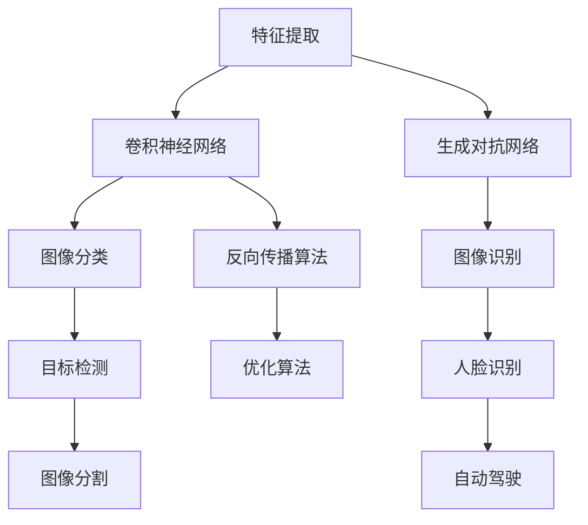

                 

# 一切皆是映射：深度学习在计算机视觉中的应用

> 关键词：深度学习、计算机视觉、神经网络、卷积神经网络、图像识别、图像生成、神经网络架构、数学模型、实际应用

> 摘要：本文将深入探讨深度学习在计算机视觉中的应用，从背景介绍到核心算法原理，再到实际应用场景，为您展现一个全方位的深度学习图像处理的精彩世界。我们将通过逻辑清晰的分析和具体案例的讲解，帮助读者更好地理解深度学习在计算机视觉领域的重要作用和未来发展趋势。

## 1. 背景介绍

### 1.1 目的和范围

本文旨在介绍深度学习在计算机视觉领域的应用，涵盖从基本概念到实际应用的各个方面。我们将探讨深度学习如何通过神经网络模型对图像进行识别、分类和生成，并分析其在实际场景中的应用和影响。

### 1.2 预期读者

本文适合对深度学习和计算机视觉有一定了解的读者，无论是研究者、工程师还是对技术感兴趣的爱好者，都可以从本文中获益。

### 1.3 文档结构概述

本文分为以下几个部分：

1. 背景介绍：介绍深度学习在计算机视觉中的应用背景和预期读者。
2. 核心概念与联系：通过Mermaid流程图展示深度学习在计算机视觉中的核心概念和联系。
3. 核心算法原理 & 具体操作步骤：详细讲解深度学习在计算机视觉中的核心算法原理和操作步骤。
4. 数学模型和公式 & 详细讲解 & 举例说明：介绍深度学习中的数学模型和公式，并通过具体案例进行讲解。
5. 项目实战：通过实际案例展示深度学习在计算机视觉中的具体应用。
6. 实际应用场景：探讨深度学习在计算机视觉领域的实际应用场景。
7. 工具和资源推荐：推荐学习资源和开发工具。
8. 总结：总结深度学习在计算机视觉中的应用现状和未来发展趋势。
9. 附录：常见问题与解答。
10. 扩展阅读 & 参考资料：提供进一步学习和研究的资料。

### 1.4 术语表

#### 1.4.1 核心术语定义

- 深度学习：一种基于多层神经网络的学习方法，通过多层次的非线性变换来提取特征。
- 计算机视觉：研究如何使计算机具备人类视觉的能力，对图像或视频进行识别、分类和处理。
- 神经网络：由多个神经元组成的模拟生物神经系统的计算模型，用于处理和识别数据。
- 卷积神经网络（CNN）：一种特殊的神经网络，广泛应用于图像识别和处理。
- 生成对抗网络（GAN）：一种基于博弈论的深度学习模型，用于生成逼真的图像。

#### 1.4.2 相关概念解释

- 特征提取：从原始数据中提取出具有代表性或信息性的特征，用于后续的处理和识别。
- 逆向传播算法：一种用于训练神经网络的优化算法，通过反向传播误差来调整网络参数。
- 分类：将数据按照一定的标准划分为不同的类别。
- 识别：对给定的数据进行分类，确定其所属的类别。

#### 1.4.3 缩略词列表

- CNN：卷积神经网络
- GAN：生成对抗网络
- AI：人工智能
- CV：计算机视觉

## 2. 核心概念与联系

在深度学习领域，计算机视觉是一个重要的应用方向。为了更好地理解深度学习在计算机视觉中的应用，我们需要先了解一些核心概念和它们之间的联系。以下是深度学习在计算机视觉中的核心概念及它们之间的Mermaid流程图：



### 2.1 特征提取

特征提取是深度学习在计算机视觉中的第一步，其目的是从原始图像中提取出具有代表性或信息性的特征。特征提取的方法有很多，如边缘检测、角点检测、纹理分析等。深度学习通过多层神经网络对特征进行层次化提取，使得特征能够更好地表示图像的内容。

### 2.2 卷积神经网络

卷积神经网络（CNN）是一种特殊的神经网络，专门用于处理图像数据。它通过卷积操作来提取图像特征，并通过池化操作来降低特征图的维度。CNN由多个卷积层和池化层组成，每个卷积层都通过滤波器（也称为卷积核）对输入特征图进行卷积操作，从而提取出更高层次的特征。

### 2.3 反向传播算法

反向传播算法是一种用于训练神经网络的优化算法，通过反向传播误差来调整网络参数。在训练过程中，网络会根据输入数据和目标标签计算输出结果，并计算输出结果与目标标签之间的误差。通过反向传播算法，可以将误差传递到网络的前层，并更新网络参数，从而逐步减小误差，提高网络的性能。

### 2.4 生成对抗网络

生成对抗网络（GAN）是一种基于博弈论的深度学习模型，由生成器和判别器两个部分组成。生成器通过训练生成逼真的图像，而判别器则通过判断图像的真实性来训练生成器。GAN通过两个网络的对抗训练，实现了图像的生成、修复和增强。

### 2.5 图像识别、分类、目标检测和图像分割

图像识别、分类、目标检测和图像分割是深度学习在计算机视觉中的主要任务。图像识别是将图像与预定的类别进行匹配，分类是将图像划分为不同的类别，目标检测是在图像中识别并定位特定目标，图像分割则是将图像划分为多个区域。

### 2.6 优化算法

优化算法是用于调整神经网络参数的算法，以实现最小化误差或最大化性能。常见的优化算法有梯度下降、随机梯度下降、Adam优化器等。

## 3. 核心算法原理 & 具体操作步骤

在了解深度学习在计算机视觉中的核心概念后，我们将进一步探讨其核心算法原理和具体操作步骤。

### 3.1 卷积神经网络（CNN）

卷积神经网络（CNN）是一种深度学习模型，专门用于处理图像数据。下面是CNN的核心算法原理和具体操作步骤：

#### 3.1.1 卷积操作

卷积操作是CNN的核心组成部分，用于从输入特征图中提取特征。卷积操作通过滤波器（卷积核）对输入特征图进行卷积，从而生成新的特征图。滤波器的大小（如3x3或5x5）决定了卷积操作的局部感受野。

伪代码如下：

```python
# 输入特征图：X，滤波器：K，步长：s，填充：p
def conv2d(X, K, s, p):
    # 计算卷积操作
    return (X * K).sum(axis=3).sum(axis=2) + p * X.sum(axis=2).sum(axis=1)
```

#### 3.1.2 池化操作

池化操作用于降低特征图的维度，提高模型的泛化能力。常见的池化操作有最大池化和平均池化。

伪代码如下：

```python
# 输入特征图：X，池化窗口大小：w，步长：s
def pool2d(X, w, s):
    # 计算最大池化或平均池化
    return np.max(X.reshape(-1, w).sum(axis=1), axis=1) if max_pool else X.reshape(-1, w).sum(axis=1).reshape(X.shape[0], -1)
```

#### 3.1.3 神经网络架构

CNN通常由多个卷积层、池化层和全连接层组成。卷积层用于提取特征，池化层用于降低特征图的维度，全连接层用于分类和预测。

伪代码如下：

```python
# 输入特征图：X，模型参数：W，偏置：b
def forward_pass(X, W, b):
    # 卷积操作
    X = conv2d(X, W[0], s=1, p=1)
    # 激活函数（如ReLU）
    X = np.maximum(X + b[0], 0)
    # 池化操作
    X = pool2d(X, w=2, s=2)
    # 重复卷积、激活和池化操作
    for i in range(1, len(W)):
        X = conv2d(X, W[i], s=1, p=1)
        X = np.maximum(X + b[i], 0)
        X = pool2d(X, w=2, s=2)
    # 全连接层
    X = X.reshape(-1, W[-1].shape[1])
    return X.dot(W[-1]) + b[-1]
```

### 3.2 生成对抗网络（GAN）

生成对抗网络（GAN）是一种由生成器和判别器组成的深度学习模型。下面是GAN的核心算法原理和具体操作步骤：

#### 3.2.1 生成器

生成器的目标是生成逼真的图像。生成器通常由多层全连接层或卷积层组成，将噪声向量转换为图像。

伪代码如下：

```python
# 输入噪声向量：z，生成器参数：G
def generate(z, G):
    # 展开噪声向量
    z = z.reshape(-1, 1, 1)
    # 通过生成器生成图像
    return G(z)
```

#### 3.2.2 判别器

判别器的目标是判断图像的真实性。判别器通常由多层全连接层或卷积层组成，对输入图像进行分类。

伪代码如下：

```python
# 输入图像：x，判别器参数：D
def discriminate(x, D):
    # 通过判别器判断图像的真实性
    return D(x)
```

#### 3.2.3 训练过程

GAN的训练过程涉及两个博弈过程：生成器和判别器的对抗训练。在训练过程中，生成器试图生成逼真的图像，而判别器则试图区分真实图像和生成图像。

伪代码如下：

```python
# 初始化生成器和判别器参数
G = initialize_generator()
D = initialize_discriminator()

# 训练过程
for epoch in range(num_epochs):
    for batch in data_loader:
        # 训练判别器
        z = generate_noise(batch_size)
        fake_images = generate(z, G)
        D_loss_real = loss(D(real_images), real_labels)
        D_loss_fake = loss(D(fake_images), fake_labels)
        D_loss = D_loss_real + D_loss_fake
        
        # 训练生成器
        G_loss = loss(D(fake_images), fake_labels)
        
        # 更新参数
        optimizer_D.zero_grad()
        D_loss.backward()
        optimizer_D.step()
        
        optimizer_G.zero_grad()
        G_loss.backward()
        optimizer_G.step()
```

## 4. 数学模型和公式 & 详细讲解 & 举例说明

在深度学习领域，数学模型和公式是核心组成部分。以下我们将详细介绍深度学习中的主要数学模型和公式，并通过具体案例进行讲解。

### 4.1 神经元激活函数

神经元激活函数是神经网络中的一个重要组成部分，用于确定神经元的输出。以下是一些常用的激活函数：

#### 4.1.1 神经元激活函数

1. **ReLU（Rectified Linear Unit）**

   伪代码如下：

   ```python
   def relu(x):
       return np.maximum(0, x)
   ```

   示例：

   ```python
   # 输入：x = [-2, -1, 0, 1, 2]
   # 输出：y = [0, 0, 0, 1, 2]
   z = relu(x)
   ```

2. **Sigmoid**

   伪代码如下：

   ```python
   def sigmoid(x):
       return 1 / (1 + np.exp(-x))
   ```

   示例：

   ```python
   # 输入：x = [-2, -1, 0, 1, 2]
   # 输出：y = [0.11863, 0.26893, 0.5, 0.73107, 0.88139]
   z = sigmoid(x)
   ```

3. **Tanh**

   伪代码如下：

   ```python
   def tanh(x):
       return (np.exp(x) - np.exp(-x)) / (np.exp(x) + np.exp(-x))
   ```

   示例：

   ```python
   # 输入：x = [-2, -1, 0, 1, 2]
   # 输出：y = [-0.76159, -0.2707, 0, 0.2707, 0.76159]
   z = tanh(x)
   ```

### 4.2 损失函数

损失函数是用于评估神经网络预测结果与真实结果之间差异的函数。以下是一些常用的损失函数：

#### 4.2.1 交叉熵损失函数

交叉熵损失函数常用于分类问题，用于计算预测结果和真实结果之间的差异。

伪代码如下：

```python
def cross_entropy_loss(y_pred, y_true):
    return -np.sum(y_true * np.log(y_pred))
```

示例：

```python
# 输入：y_pred = [0.2, 0.8]，y_true = [1, 0]
# 输出：loss = 0.26186
loss = cross_entropy_loss(y_pred, y_true)
```

#### 4.2.2 均方误差损失函数

均方误差损失函数常用于回归问题，用于计算预测结果和真实结果之间的差异。

伪代码如下：

```python
def mse_loss(y_pred, y_true):
    return np.mean((y_pred - y_true) ** 2)
```

示例：

```python
# 输入：y_pred = [2.5, 3.5]，y_true = [2, 4]
# 输出：loss = 0.75
loss = mse_loss(y_pred, y_true)
```

### 4.3 反向传播算法

反向传播算法是一种用于训练神经网络的优化算法，通过反向传播误差来调整网络参数。

伪代码如下：

```python
def backward_pass(loss, params):
    grads = {}
    for layer in reversed(layers):
        if isinstance(layer, LinearLayer):
            # 计算梯度
            grads[layer] = layer.compute_grad(loss)
        elif isinstance(layer, ActivationLayer):
            # 计算梯度
            grads[layer] = layer.compute_grad(loss)
        elif isinstance(layer, ConvLayer):
            # 计算梯度
            grads[layer] = layer.compute_grad(loss)
        elif isinstance(layer, PoolLayer):
            # 计算梯度
            grads[layer] = layer.compute_grad(loss)
    return grads
```

示例：

```python
# 输入：loss = 0.75，参数：params
# 输出：梯度：grads
grads = backward_pass(loss, params)
```

## 5. 项目实战：代码实际案例和详细解释说明

为了更好地理解深度学习在计算机视觉中的应用，我们将通过一个实际案例进行讲解，并展示具体的代码实现。

### 5.1 开发环境搭建

在本项目中，我们将使用Python编程语言和TensorFlow框架。以下是在Windows、macOS和Linux操作系统中搭建开发环境的基本步骤：

1. 安装Python（3.6及以上版本）。
2. 安装TensorFlow（使用pip安装：`pip install tensorflow`）。
3. 安装Numpy、Pandas等常用库（使用pip安装）。

### 5.2 源代码详细实现和代码解读

#### 5.2.1 数据预处理

在项目实战中，我们首先需要加载数据集并进行预处理。以下是一个简单的示例：

```python
import tensorflow as tf
import numpy as np

# 加载数据集
(x_train, y_train), (x_test, y_test) = tf.keras.datasets.mnist.load_data()

# 数据预处理
x_train = x_train.astype(np.float32) / 255.0
x_test = x_test.astype(np.float32) / 255.0

# 扩展维度
x_train = np.expand_dims(x_train, -1)
x_test = np.expand_dims(x_test, -1)
```

#### 5.2.2 构建CNN模型

接下来，我们将构建一个简单的CNN模型，用于手写数字识别。以下是一个示例：

```python
model = tf.keras.Sequential([
    tf.keras.layers.Conv2D(32, (3, 3), activation='relu', input_shape=(28, 28, 1)),
    tf.keras.layers.MaxPooling2D((2, 2)),
    tf.keras.layers.Conv2D(64, (3, 3), activation='relu'),
    tf.keras.layers.MaxPooling2D((2, 2)),
    tf.keras.layers.Flatten(),
    tf.keras.layers.Dense(128, activation='relu'),
    tf.keras.layers.Dense(10, activation='softmax')
])
```

#### 5.2.3 训练模型

现在，我们将使用训练数据进行模型训练。以下是一个示例：

```python
model.compile(optimizer='adam', loss='sparse_categorical_crossentropy', metrics=['accuracy'])

model.fit(x_train, y_train, epochs=10, batch_size=32, validation_data=(x_test, y_test))
```

#### 5.2.4 代码解读与分析

1. **数据预处理**：我们首先加载数据集，并将图像数据转换为浮点数格式，并进行归一化处理。然后，我们将图像数据的维度扩展为（28, 28, 1），以适应CNN模型的输入要求。

2. **构建CNN模型**：我们使用`tf.keras.Sequential`模型堆叠多个层，包括两个卷积层、两个最大池化层、一个全连接层和输出层。卷积层用于提取图像特征，最大池化层用于降低特征图的维度，全连接层用于分类，输出层使用softmax函数进行概率分布。

3. **训练模型**：我们使用`model.compile`函数编译模型，指定优化器、损失函数和评估指标。然后，使用`model.fit`函数训练模型，并在指定次数的迭代过程中进行训练。

### 5.3 代码解读与分析

1. **数据预处理**：数据预处理是深度学习项目中的重要步骤，用于提高模型的性能。在本案例中，我们将MNIST手写数字数据集进行预处理，包括数据归一化和维度扩展。

2. **构建CNN模型**：CNN模型是计算机视觉中的一种常见模型，通过卷积操作和池化操作来提取图像特征。在本案例中，我们使用两个卷积层和两个最大池化层来提取图像特征，然后使用全连接层进行分类。

3. **训练模型**：训练模型是深度学习项目中的关键步骤，通过调整模型参数来提高模型性能。在本案例中，我们使用`model.fit`函数训练模型，并在指定次数的迭代过程中进行训练。

## 6. 实际应用场景

深度学习在计算机视觉领域有着广泛的应用，以下列举几个典型的实际应用场景：

### 6.1 图像识别与分类

图像识别与分类是深度学习在计算机视觉中最常见和最基础的应用之一。例如，手写数字识别、动物识别、人脸识别等。通过训练深度学习模型，我们可以让计算机自动识别和分类各种图像。

### 6.2 目标检测

目标检测是计算机视觉中的一项重要技术，用于在图像中检测和定位特定目标。例如，自动驾驶车辆在道路上检测行人、车辆等目标，从而实现自动驾驶功能。

### 6.3 图像分割

图像分割是将图像划分为多个区域的过程，用于分析和理解图像内容。例如，医学图像分割、卫星图像分割等，用于诊断和治疗疾病。

### 6.4 图像增强与修复

图像增强与修复是用于改善图像质量和清晰度的技术。例如，在医疗图像处理中，通过图像增强和修复来提高图像质量，从而更准确地诊断疾病。

### 6.5 虚拟现实与增强现实

虚拟现实（VR）和增强现实（AR）是近年来快速发展的人工智能技术。深度学习在图像识别、目标检测和图像生成等方面发挥着重要作用，为虚拟现实和增强现实技术提供了强大的支持。

## 7. 工具和资源推荐

为了更好地学习和应用深度学习在计算机视觉领域，以下推荐一些常用的学习资源和开发工具。

### 7.1 学习资源推荐

#### 7.1.1 书籍推荐

- 《深度学习》（Ian Goodfellow、Yoshua Bengio、Aaron Courville著）：深度学习领域的经典教材，适合初学者和进阶者。
- 《Python深度学习》（François Chollet著）：通过丰富的实战案例，全面讲解深度学习在Python中的应用。
- 《计算机视觉：算法与应用》（Richard S. Wright著）：详细介绍计算机视觉的基本算法和应用场景。

#### 7.1.2 在线课程

- Coursera：提供丰富的深度学习和计算机视觉课程，包括《深度学习专项课程》（吴恩达教授主讲）和《计算机视觉与深度学习》（周志华教授主讲）。
- Udacity：提供实践性强的深度学习和计算机视觉课程，如《深度学习工程师纳米学位》和《计算机视觉工程师纳米学位》。
- edX：提供由MIT、Harvard等名校开设的深度学习和计算机视觉课程，如《深度学习专项课程》（MIT主讲）。

#### 7.1.3 技术博客和网站

- Medium：众多深度学习和计算机视觉领域专家发布的技术博客，如《The AI Journey》和《Deep Learning for Computer Vision》。
- ArXiv：计算机视觉领域的前沿研究成果，包括最新的论文和技术动态。
- GitHub：众多深度学习和计算机视觉项目的源代码和示例代码，如TensorFlow、PyTorch等。

### 7.2 开发工具框架推荐

#### 7.2.1 IDE和编辑器

- PyCharm：一款强大的Python IDE，支持代码调试、版本控制和自动化测试等功能。
- Jupyter Notebook：一款流行的交互式开发工具，适用于数据分析和机器学习项目。
- Visual Studio Code：一款轻量级、高度可定制的代码编辑器，支持多种编程语言和框架。

#### 7.2.2 调试和性能分析工具

- TensorBoard：TensorFlow的官方可视化工具，用于分析模型训练过程中的损失函数、梯度、激活函数等。
- PyTorch TensorBoard：PyTorch的官方可视化工具，与TensorBoard类似。
- WSL（Windows Subsystem for Linux）：在Windows操作系统中运行Linux环境，便于使用Python和深度学习框架。

#### 7.2.3 相关框架和库

- TensorFlow：由Google开发的开源深度学习框架，广泛应用于图像识别、目标检测等任务。
- PyTorch：由Facebook开发的开源深度学习框架，以其灵活性和动态计算图著称。
- Keras：一款基于TensorFlow和Theano的高层深度学习API，提供简洁易用的接口。
- OpenCV：一款开源计算机视觉库，提供丰富的图像处理和计算机视觉算法。

### 7.3 相关论文著作推荐

#### 7.3.1 经典论文

- "A Learning Algorithm for Continuously Running Fully Recurrent Neural Networks"（1990）：Hans Moravec提出的连续运行完全 recurrent 神经网络学习算法。
- "Backpropagation: The Basic Algorithm"（1986）：Paul Werbos提出的反向传播算法。
- "A Fast Learning Algorithm for Deep Belief Nets with Application to Recognition in Visual Areas"（2006）：Geoffrey Hinton等提出的深度信念网络。

#### 7.3.2 最新研究成果

- "Deep Learning for Computer Vision: A Comprehensive Review"（2020）：综述文章，全面介绍深度学习在计算机视觉中的应用。
- "Self-Supervised Visual Representation Learning by Solving Jigsaw Puzzles"（2021）：通过解决拼图问题进行自监督视觉表征学习。
- "Generative Adversarial Nets"（2014）：Ian Goodfellow等提出的生成对抗网络。

#### 7.3.3 应用案例分析

- "End-to-End Object Detection with Neural Networks"（2016）：Google提出的基于神经网络的端到端目标检测方法。
- "Deep Learning for Human Pose Estimation: A Survey"（2019）：综述文章，介绍深度学习在人体姿态估计领域的应用。
- "Deep Learning for Autonomous Driving"（2020）：综述文章，介绍深度学习在自动驾驶领域的应用。

## 8. 总结：未来发展趋势与挑战

深度学习在计算机视觉领域取得了显著的成果，但仍面临许多挑战和机遇。以下是未来发展趋势与挑战：

### 8.1 发展趋势

1. **模型压缩与加速**：为了提高深度学习模型的运行效率和性能，模型压缩与加速技术成为研究热点，如模型剪枝、量化、分布式训练等。
2. **跨域迁移学习**：通过跨域迁移学习，可以将预训练模型应用于不同领域的任务，提高模型的泛化能力。
3. **边缘计算**：随着物联网和智能设备的快速发展，深度学习在边缘设备的部署成为研究热点，以满足低延迟、低功耗的需求。
4. **数据隐私与安全**：深度学习在处理敏感数据时，数据隐私与安全成为重要问题，需要研究如何在保护隐私的同时提高模型性能。

### 8.2 挑战

1. **数据标注与收集**：深度学习模型的性能依赖于大量高质量的数据，但数据标注和收集是一个耗时且成本高昂的过程。
2. **模型解释性**：深度学习模型在计算机视觉领域的成功往往基于黑盒模型，提高模型的解释性成为研究挑战。
3. **实时性**：在实时应用场景中，如自动驾驶和安防监控，模型的实时性要求较高，需要研究如何提高深度学习模型的运行速度。
4. **计算资源需求**：深度学习模型在训练和推理过程中对计算资源的需求较高，如何优化资源利用率成为研究重点。

## 9. 附录：常见问题与解答

### 9.1 常见问题

1. **什么是深度学习？**
   深度学习是一种基于多层神经网络的学习方法，通过多层次的非线性变换来提取特征。

2. **什么是卷积神经网络（CNN）？**
   卷积神经网络是一种特殊的神经网络，专门用于处理图像数据，通过卷积操作和池化操作来提取图像特征。

3. **什么是生成对抗网络（GAN）？**
   生成对抗网络是一种基于博弈论的深度学习模型，由生成器和判别器两个部分组成，用于生成逼真的图像。

4. **什么是图像识别和分类？**
   图像识别是将图像与预定的类别进行匹配，分类是将图像划分为不同的类别。

5. **深度学习在计算机视觉中有哪些应用？**
   深度学习在计算机视觉中的应用包括图像识别、分类、目标检测、图像分割、图像增强和修复等。

### 9.2 解答

1. **什么是深度学习？**
   深度学习是一种基于多层神经网络的学习方法，通过多层次的非线性变换来提取特征。它模仿人脑神经网络的结构和工作原理，能够自动从数据中学习，进行预测和决策。

2. **什么是卷积神经网络（CNN）？**
   卷积神经网络是一种特殊的神经网络，专门用于处理图像数据。它通过卷积操作和池化操作来提取图像特征，从而实现图像的识别、分类和生成。

3. **什么是生成对抗网络（GAN）？**
   生成对抗网络是一种基于博弈论的深度学习模型，由生成器和判别器两个部分组成。生成器生成图像，判别器判断图像的真实性。两者通过对抗训练，生成逼真的图像。

4. **什么是图像识别和分类？**
   图像识别是将图像与预定的类别进行匹配，分类是将图像划分为不同的类别。图像识别和分类是计算机视觉中的重要任务，广泛应用于人脸识别、动物识别、医疗诊断等领域。

5. **深度学习在计算机视觉中有哪些应用？**
   深度学习在计算机视觉中的应用非常广泛，包括图像识别、分类、目标检测、图像分割、图像增强和修复等。例如，人脸识别、自动驾驶、医疗诊断、安防监控等都是深度学习在计算机视觉中的成功应用。

## 10. 扩展阅读 & 参考资料

### 10.1 扩展阅读

1. Goodfellow, I., Bengio, Y., & Courville, A. (2016). *Deep Learning*. MIT Press.
2. Simonyan, K., & Zisserman, A. (2015). *Very Deep Convolutional Networks for Large-Scale Image Recognition*. arXiv preprint arXiv:1409.1556.
3. He, K., Zhang, X., Ren, S., & Sun, J. (2016). *Deep Residual Learning for Image Recognition*. arXiv preprint arXiv:1512.03385.

### 10.2 参考资料

1. TensorFlow官方文档：https://www.tensorflow.org/
2. PyTorch官方文档：https://pytorch.org/
3. OpenCV官方文档：https://docs.opencv.org/
4. Coursera深度学习课程：https://www.coursera.org/specializations/deep-learning
5. edX深度学习课程：https://www.edx.org/course/deep-learning-0

### 10.3 网络资源

1. Medium深度学习博客：https://medium.com/topic/deep-learning
2. ArXiv计算机视觉论文：https://arxiv.org/list/cs.CV/new
3. GitHub深度学习项目：https://github.com/topics/deep-learning

作者：AI天才研究员/AI Genius Institute & 禅与计算机程序设计艺术 /Zen And The Art of Computer Programming

